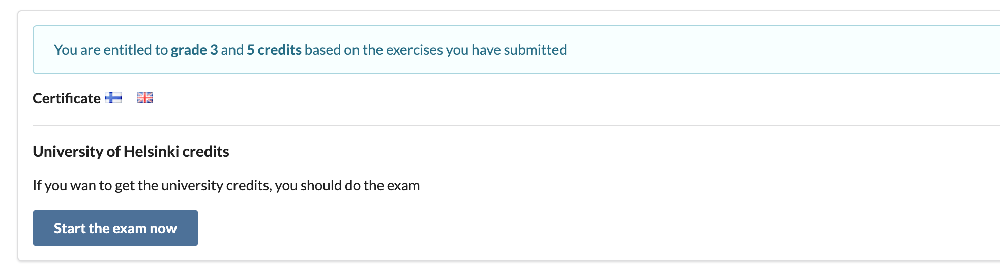

<div class="content">

تُعد هذه الدورة مدخلاً شاملاً وتطبيقياً لتطوير تطبيقات الويب الحديثة باستخدام جافاسكريبت (JavaScript). ينصب التركيز الأساسي على بناء **تطبيقات الصفحة الواحدة (Single Page Applications - SPAs)** باستخدام مكتبة **React**، وتدعيمها بخدمات الويب ونقاط النهاية البرمجية بنمطي **RESTful** و **GraphQL** المبنية على بيئة تشغيل **Node.js**. كما تحتوي الدورة على أجزاء متقدمة متخصصة في لغة **TypeScript**، وتطوير تطبيقات الهواتف الذكية عبر **React Native**، وممارسات **التكامل والنشر المستمر (Continuous Integration / CI)**.

وتشمل الموضوعات الأخرى التي تغطيها الدورة: تصحيح أخطاء التطبيقات واكتشافها (Debugging)، تقنيات الحاويات وإدارتها (Container Technology / Docker)، إدارة الإعدادات وبيئات التشغيل، وإدارة قواعد البيانات العلائقية وغير العلائقية.

الدورة مجانية بالكامل ومتاحة للجميع. يمكنك الحصول على شهادة إتمام معتمدة مجاناً، وحتى الحصول على ساعات دراسية معتمدة بنظام الساعات الأوروبية ECTS (European Credit Transfer and Accumulation System) من جامعة هلسنكي.

### المتطلبات السابقة (Prerequisites)

يُتوقع من المشاركين امتلاك مهارات برمجية جيدة، ومعرفة أساسية ببرمجة الويب وقواعد البيانات، والإلمام بأساسيات نظام إدارة النسخ **Git**. كما يُتوقع منك امتلاك العزيمة والمثابرة والقدرة على حل المشكلات البرمجية والبحث المستقل عن المعلومات.

لا يُشترط وجود معرفة مسبقة بلغة JavaScript أو الموضوعات المحددة لهذه الدورة.

ما هو حجم الخبرة البرمجية المطلوبة؟ من الصعب تحديد ذلك برقم مطلق، ولكن يجب أن تكون متمكناً وطلاً في لغتك البرمجية الأساسية التي تكتب بها. يتطلب الوصول إلى هذا المستوى من الطلاقة عادة ما بين 100 إلى 200 ساعة على الأقل من الممارسة والتطبيق العملي.

### المادة التعليمية (Course material)

صُممت المادة التعليمية لتتم قراءتها واستيعابها جزءاً تلو الآخر وبترتيب متسلسل دقيق.

تحتوي المادة على تمارين عملية مدروسة، تم وضعها وتوزيعها بحيث توفر المادة السابقة لها كل المعلومات والمعارف الكافية لحل كل تمرين. يمكنك حل التمارين بمجرد مصادفتها أثناء قراءتك للمادة، ولكن قد يكون من المفيد أيضاً قراءة محتوى الجزء كاملاً أولاً قبل الشروع في حل التمارين.

في العديد من أجزاء الدورة، تُبنى التمارين تدريجياً لإنشاء تطبيق واحد كبير خطوة بخطوة، وقد يمتد تطوير بعض هذه التطبيقات عبر أجزاء متعددة من المنهج.

تعتمد المادة التعليمية على التوسع التدريجي في تطبيقات نموذجية تتغير وتتطور من جزء إلى آخر. أفضل وسيلة للتعلم هي تتبع الكود خطوة بخطوة وإجراء تعديلات وتجارب مستقلة عليه لفهم كيفية عمله. الشيفرة المصدرية للتطبيقات النموذجية لكل خطوة ولكل جزء متاحة على مستودع GitHub.

### دراسة الدورة والتقدّم (Taking the course)

تتألف الدورة من أربعة عشر جزءاً، يبدأ أولها بالرقم 0 للحفاظ على التسلسل التاريخي لإصدارات الدورة. يُعادل كل جزء بصورة تقريبية أسبوعاً واحداً من الدراسة المنتظمة (بمتوسط 15 إلى 20 ساعة دراسية)، إلا أن وتيرة إنجاز الدورة مرنة تماماً ومتروكة لجدولك الخاص.

إن الانتقال من الجزء *n* إلى الجزء *n+1* ليس أمراً منطقياً ما لم يتم استيعاب وإتقان المفاهيم البرمجية في الجزء *n*. من الناحية التربوية والأكاديمية، تعتمد الدورة أسلوب **التعلم للإتقان ([Mastery Learning](https://en.wikipedia.org/wiki/Mastery_learning))**، حيث يُفترض ألا تنتقل إلى الجزء التالي إلا بعد إنجاز القدر الكافي من تمارين الجزء السابق.

في الأجزاء من 1 إلى 4، يُتوقع منك إنجاز **كافة** التمارين التي **لا** تحمل علامة النجمة (*). تُحسب التمارين التي تحمل علامة النجمة ضمن درجتك النهائية، لكن تخطيها لا يمنعك من إنجاز التمارين الإلزامية في الأجزاء اللاحقة. الأجزاء من 5 إلى 13 لا تحتوي على تمارين بنجمة لعدم وجود ترابط خطي صارم مماثل بالأجزاء السابقة.

وتيرة إكمال الدورة مرنة بالكامل.

يمكنك الاطلاع على إحصائيات أوقات إنجاز التمارين عبر [نظام التسليم وإحصائيات الطلاب](https://studies.cs.helsinki.fi/stats/courses/fullstackopen).

### قناة الدورة على ديسكورد (Course channel in Discord)

يمكنك مناقشة محتوى الدورة والموضوعات التقنية المرتبطة بها في مجتمعنا المخصص على Discord عبر الرابط: <https://study.cs.helsinki.fi/discord/join/fullstack>. يحتوي خادم Discord على قناة عامة `fullstack_general` وقنوات مخصصة لكل جزء (تبدأ أسماؤها بالبادئة `fullstack`) للنقاشات المرتبطة بالمنهج. يُرجى الانضمام والمشاركة في النقاش!

### كيف تطلب المساعدة في ديسكورد بفعالية؟

عند طلب المساعدة لحل مشكلة أو استكشاف خطأ برمجي في مجموعة Discord، يجب أن يكون سؤالك غنياً بالمعلومات ومحدداً بأقصى درجة ممكنة. إذا كان سؤالك مصاغاً بهذا الشكل:

> *إضافة شخص جديد لا تعمل، هل يمكن لأحد مساعدتي في ذلك؟*

فمن المرجح ألا يجيبك أحد؛ لأن الخطأ البرمجي (Bug) قد يكمن في أي مكان في الشيفرة أو الخادم أو المتصفح.

النموذج الأفضل لصياغة السؤال هو كالتالي:

> * في تمرين 2.15، عندما أحاول إضافة شخص جديد إلى التطبيق، يرد الخادم برمز الحالة 403، على الرغم من أن بنية الطلب تبدو صحيحة.
>
> الشيفرة البرمجية ذات الصلة:
>
> ```js
>   // يتم هنا لصق الجزء المسؤول من الشيفرة البرمجية
>   // يجب أن تحتوي الشيفرة على عبارات console.log للمساعدة في تصحيح الأخطاء
> ```
>
> المخرجات المطبوعة في وحدة التحكم (Console):
>
> ```bash
>   // البيانات المطبوعة في الكونسول
> ```
>
> لقطة شاشة لتبويب الشبكة (Network Tab) في أدوات المطورين:
>
> [صورة من وحدة تحكم الشبكة Network Console]
>
> الشيفرة الكاملة للمشروع متاحة على الرابط التالي: (رابط المستودع على GitHub)

### الأجزاء وإتمام الدراسة الأكاديمية (Parts and completion)

تتألف دراسة Full Stack من الدورة الأساسية بالإضافة إلى عدة ملحقات تخصصية. يمكنك إتمام الدراسة بما يتراوح بين 5 إلى 14 ساعة معتمدة (Credits).

#### الأجزاء 0-5 (الدورة الأساسية) - تطوير الويب الشامل Full Stack Web Development (5 cr, CSM141081)

يعتمد عدد الساعات والدرجة الأكاديمية للدورة على إجمالي عدد التمارين المسلمة للأجزاء 0-7 (بما في ذلك التمارين الموسومة بنجمة).

تُحسب الساعات المعتمدة والدرجات التقديرية وفق الجدول التالي:

| عدد التمارين المسلمة | الساعات المعتمدة (Credits) | الدرجة (من 5) |
| :------------------: | :------------------------: | :-----------: |
|         150          |             7              |       5       |
|         135          |             6              |       5       |
|         116          |             5              |       5       |
|         105          |             5              |       4       |
|          94          |             5              |       3       |
|          83          |             5              |       2       |
|          72          |             5              |       1       |

تم تعديل حدود الـ 6 و 7 ساعات معتمدة لتعكس التمارين الجديدة المضافة في الجزء 5.

بمجرد إكمال التمارين الكافية للحصول على درجة النجاح، يمكنك تحميل شهادة إتمام الدورة مباشرة من [نظام التسليم](https://studies.cs.helsinki.fi/stats/courses/fullstackopen).

إذا كنت ترغب في الحصول على ساعات جامعية معتمدة، فيجب عليك اجتياز اختبار الدورة. لا يدخل الاختبار في حساب درجتك النهائية، ولكن يشترط اجتيازه. للمزيد من المعلومات راجع [قسم اختبار الدورة](/ar/part0/general_info#the-course-exam).

لا يمكنك دخول الاختبار إلا بعد تسليم التمارين الكافية لـ 5 ساعات معتمدة. الاختبار موحد لجميع المسارات من 5 إلى 14 ساعة ولا يؤثر على الدرجة التقديرية.

*لا تحتاج إلى حضور الاختبار الجامعي أو التسجيل في الجامعة المفتوحة للحصول على شهادة إتمام الدورة الرقمية.*

#### الجزء 6 - تطوير الويب الشامل، الملحق 1 (1 cr, CSM141082)

بتسليم ما لا يقل عن 135 تمريناً للأجزاء 0-7 أثناء دراستك للدورة الأساسية، يمكنك الحصول على ساعة معتمدة إضافية من خلال هذا الملحق:
- تسليم 135 تمريناً على الأقل للأجزاء 0-7.
- [التسجيل في الجزء 6 عبر الجامعة المفتوحة](https://www.avoin.helsinki.fi/palvelut/esittely.aspx?s=otm-759cfee1-370b-4200-8e11-dc86b1a8ed88).
- [طلب اعتماد الساعات للجزء 6](/ar/part0/general_info/#how-to-get-your-credits).

#### الجزء 7 - تطوير الويب الشامل، الملحق 2 (1 cr, CSM141083)

بتسليم 150 تمريناً على الأقل للأجزاء 0-7، يمكنك الحصول على ساعة معتمدة إضافية ثانية:
- تسليم 150 تمريناً على الأقل للأجزاء 0-7.
- [التسجيل في الجزء 7 عبر الجامعة المفتوحة](https://www.avoin.helsinki.fi/palvelut/esittely.aspx?s=otm-4142645d-5690-4527-9d57-79bd1fbc8770).
- [طلب اعتماد الساعات للجزء 7](/ar/part0/general_info/#how-to-get-your-credits).

#### الجزء 8 - تطوير الويب الشامل: GraphQL (1 cr, CSM14113)
انتقلت المادة التعليمية للجزء 8 إلى المنصة الحديثة: <a href="https://courses.mooc.fi/org/uh-cs/courses/full-stack-open-graphql">https://courses.mooc.fi/org/uh-cs/courses/full-stack-open-graphql</a>.

#### الجزء 9 - تطوير الويب الشامل: TypeScript (1 cr, CSM14110)
مادة الجزء 9 متاحة على: <a href="https://courses.mooc.fi/org/uh-cs/courses/full-stack-open-typescript">https://courses.mooc.fi/org/uh-cs/courses/full-stack-open-typescript</a>.

#### الجزء 10 - تطوير الويب الشامل: React Native (2 cr, CSM14111)
مادة الجزء 10 متاحة على: <a href="https://courses.mooc.fi/org/uh-cs/courses/full-stack-open-react-native">https://courses.mooc.fi/org/uh-cs/courses/full-stack-open-react-native</a>.

#### الجزء 11 - التكامل والنشر المستمر CI/CD (1 cr, CSM14112)
مادة الجزء 11 متاحة على: <a href="https://courses.mooc.fi/org/uh-cs/courses/full-stack-open-continuous-integration">https://courses.mooc.fi/org/uh-cs/courses/full-stack-open-continuous-integration</a>.

#### الجزء 12 - إدارة الحاويات Containers (1 cr, CSM141084)
مادة الجزء 12 متاحة على: <a href="https://courses.mooc.fi/org/uh-cs/courses/full-stack-open-containers">https://courses.mooc.fi/org/uh-cs/courses/full-stack-open-containers</a>.

#### الجزء 13 - قواعد البيانات العلائقية Relational databases (1 cr, CSM14114)
مادة الجزء 13 متاحة على: <a href="https://courses.mooc.fi/org/uh-cs/courses/full-stack-open-relational-databases">https://courses.mooc.fi/org/uh-cs/courses/full-stack-open-relational-databases</a>.

#### الجزء 14 - تطوير الويب الشامل: Next.js
مادة الجزء 14 متاحة على: <a href="https://courses.mooc.fi/org/uh-cs/courses/full-stack-open-nextjs">https://courses.mooc.fi/org/uh-cs/courses/full-stack-open-nextjs</a>.

---

### خلاصة دراسة الدورة (Studying the course in a nutshell)

#### تعليمات دراسة الدورة الأساسية (5 ساعات معتمدة CSM141081):
1. **حل التمارين**: يتم تسليم التمارين عبر رفعها على GitHub وتحديدها كمنجزة في [نظام تسليم التمارين](https://studies.cs.helsinki.fi/stats/courses/fullstackopen).
   - [شهادة إتمام الدورة](/ar/part0/general_info#course-certificate) ستكون متاحة للتنزيل فور إتمام متطلبات النجاح.
2. **إذا كنت ترغب في الحصول على ساعات جامعة هلسنكي المعتمدة**:
   - سجّل في الدورة؛ سيظهر لك رابط التسجيل في نظام التسليم بمجرد إكمال التمارين الكافية.
   - احفظ رقمك الجامعي (Student Number) في نظام التسليم بعد إتمام التسجيل.
   - أدِّ الاختبار عبر الإنترنت في نظام التسليم.
   - اطلب تسجيل الساعات المعتمدة في نظام التسليم.

---

### تسليم التمارين والنزاهة الأكاديمية (Submitting exercises)

تُسلّم التمارين عبر رفعها على مستودعات **GitHub** وتأكيد تسليمها في تبويب "my submissions" في [تطبيق التسليم](https://studies.cs.helsinki.fi/stats/courses/fullstackopen).

إذا كنت تسلم تمارين أجزاء مختلفة في نفس المستودع، فاستخدم هيكلية مجلدات واضحة ومنظمة (مثل `part0/`, `part1/`). يمكنك أيضاً إنشاء مستودع مستقل لكل جزء. وإذا كان المستودع خاصاً (Private)، فأضف المستخدم `mluukkai` كمتعاون (Collaborator).

تُسلّم التمارين **جزءاً بجزء (one part at a time)**. تقوم بتحديد عدد التمارين التي أنجزتها من ذلك الجزء، وبمجرد تأكيد التسليم لجزء معين، لن تتمكن من رفع تمارين إضافية لنفس الجزء لاحقاً.

يتم استخدام نظام آلي لكشف الانتحال والسرقات البرمجية (Plagiarism). إذا تبيّن تطابق الأكواد مع نماذج الحلول أو بين الطلاب، فسيتم التعامل مع الحالة وفقاً [للوائح مكافحة الانتحال والغش الأكاديمي](https://guide.student.helsinki.fi/en/article/what-cheating-and-plagiarism) بجامعة هلسنكي.

تبني العديد من التمارين تطبيقاً واحداً كبيراً بصورة تدريجية؛ في هذه الحالات، يكفي تسليم الحالة النهائية للتطبيق بعد إتمام جميع تمارين الجزء.

---

### اختبار الدورة الجامعي (The course exam)

للحصول على الساعات الأكاديمية المعتمدة رسمياً، يجب اجتياز اختبار الدورة الذي يغطي الأجزاء من 1 إلى 5:
- في حال عدم الاجتياز، يمكن إعادة الاختبار بعد مرور أسبوع واحد.
- يمكنك مواصلة تسليم التمارين بعد أداء الاختبار.

يتم إجراء الاختبار داخل نظام تسليم التمارين عبر الخطوات التالية:
1. التسجيل في الدورة عبر الجامعة المفتوحة من خلال الرابط الذي يظهر في نظام التسليم بعد إكمال التمارين الكافية:


2. حفظ الرقم الجامعي لجامعة هلسنكي في صفحة [بيانات الطالب](https://studies.cs.helsinki.fi/stats/myinfo):


3. بدء الاختبار في نظام التسليم:



مدة الاختبار 120 دقيقة (ساعتان). وعند الإتمام بنجاح ستظهر رسالة التأكيد:


4. بعد اجتياز الاختبار، يمكنك العودة لتبويب "my submissions" والضغط مرتين على الزر الأزرق الكبير لطلب تسجيل واعتماد الساعات الأكاديمية:


ستظهر الرسالة:
> *University credit registration in progress...*

---

### كيف تحصل على رقمك الجامعي (Student Number)؟

عند التسجيل لأول مرة في الجامعة المفتوحة، يتم توليد رقم طالب جامعي تلقائياً. يمكنك معرفة رقمك الجامعي من خلال:
- **نظام Sisu**: بتسجيل الدخول واختيار `My profile` ثم `Personal information`.
- **بريد تأكيد التسجيل**: يحتوي إيميل التأكيد مباشرة على رقم الطالب أو رابط يعرضه.
- **مراسلة شؤون الطلاب**: عبر البريد الإلكتروني `avoin-student@helsinki.fi` متضمناً اسمك وتاريخ ميلادك واسم الدورة.

---

### شهادة إتمام الدورة (Course certificate)

حتى في حال عدم تسجيلك للاختبار والساعات الجامعية، يمكنك دائماً تحميل شهادة إتمام الدورة الرقمية المعتمدة من تبويب "My submissions" فور إكمال متطلبات النجاح. تُمنح شهادة موحدة للأجزاء الأساسية (0-7)، وشهادات مستقلة لكل جزء إضافي تخصصي.

---

### كشف الدرجات الرسمي (Transcript of studies)

يمكنك طلب كشف درجات إلكتروني رسمي وموثق بعد اعتماد الساعات الجامعية عبر [النموذج الإلكتروني لشؤون الطلاب](https://elomake.helsinki.fi/lomakkeet/132797/lomake.html?rinnakkaislomake=Rinnakkaislomake1_en%5Bk%5D) لتقديمه إلى جامعتك الأصلية لمعادلة الساعات.

---

### استمرارية المنهج والتحديثات الدورية

لا توجد "إصدارات سنوية منقطعة" للدورة؛ فالمنهج مفتوح ومتاح باستمرار ويتم تحديث الأجزاء بشكل دوري (تحديث إصدارات المكتبات، تحسين جودة النصوص، وإضافة تقنيات جديدة). وتظل كافة التمارين المسلمة صالحة ومعتمدة دائماً مهما حدث من تحديثات.

أبرز التحديثات الرئيسية الأخيرة:
- **الجزء 14**: إضافة جزء جديد متخصص في Next.js.
- **الجزء 10**: تحديث إصدارات Expo والمكتبات الخاصة بـ React Native.
- **الجزء 7**: استبدال Webpack بأداة esbuild السريعة، وتغطية حدود الأخطاء (Error Boundaries) وتوحيد مستودعات Fullstack في Mono-repo.
- **الجزء 6**: استبدال Redux بمكتبة Zustand الحديثة لإدارة الحالة.
- **الجزء 5**: نقل مكتبات التنسيق و React Router إلى هذا الجزء.
- **الجزء 8**: تحديث Apollo Server إلى v5 و Apollo Client إلى v4.
- **الجزء 4**: تحديث إطار عمل Express إلى الإصدار 5.

---

### مشروع الويب الشامل (Full stack project)

يتوفر مشروع برمجي تطبيقي شامل بقيمة 5 أو 7 أو 10 ساعات معتمدة عبر الجامعة المفتوحة، يقوم فيه الطالب أو فريق عمل ببناء تطبيق متكامل حقيقي باستخدام React و Node.js أو React Native. تُحتسب الساعة المعتمدة الواحدة بقرابة 17.5 ساعة عمل فعلي.

---

### فرصة المقابلات الوظيفية (Interview promise)

قدم شركاؤنا [Terveystalo](https://www.terveystalo.com/en/) و [Smartly.io](https://www.smartly.io/) وعداً بإجراء **مقابلة وظيفية مباشرة (Job Interview)** لكل طالب يكمل الدورة والمشروع التطبيقي بأعلى الساعات المعتمدة (14 + 10 ساعات) للمقيمين في فنلندا.

---

### الأدوات والبيئة المطلوبة قبل البدء (Before you start)

1. **متصفح الويب**: يُوصى بشدة باستخدام **[Google Chrome](https://www.google.com/chrome/)** أو متصفح **[Firefox Developer Edition](https://www.mozilla.org/en-US/firefox/developer/)** لأدوات التطوير المتقدمة المدمجة فيهما.
2. **نظام التحكم بالإصدارات Git**: تثبيت Git ومعرفة أساسياته لرفع الحلول على GitHub.
3. **محرر النصوص**: يُوصى بشدة ببيئة **[Visual Studio Code](https://code.visualstudio.com/)**.
4. **بيئة Node.js**: تثبيت أحدث إصدار مستقر من **[Node.js](https://nodejs.org/en/)** (الإصدار 20 أو 22) والذي يتضمن مديري الحزم **npm** و **npx**.

---

### المساهمة والإبلاغ عن الأخطاء المطبعية

إذا وجدت خطأ لغوياً أو مطبعياً أو رابطاً تالفاً، يمكنك دائماً تقديم **Pull Request** عبر مستودع المنهج على GitHub عبر رابط *اقتراح تعديل المنهج* الموجود في أسفل كل صفحة.

</div>
