<div class="content">

قبل أن نبدأ بكتابة الشيفرات البرمجية، سنستعرض المبادئ الأساسية لهندسة تطبيقات الويب من خلال فحص تطبيق تجريبي متاح عبر الرابط التالي: <https://studies.cs.helsinki.fi/exampleapp>.

الهدف الوحيد من هذا التطبيق هو توضيح المفاهيم والمصطلحات الأساسية للدورة، وهو ليس بأي حال نموذجاً لكيفية بناء تطبيقات الويب الحديثة. بل على العكس من ذلك، فهو يستعرض بعض التقنيات القديمة في تطوير الويب التي قد تُعتبر اليوم *ممارسات غير مستحبة (bad practices)*. سنلتزم بالمعايير وأفضل الممارسات الحديثة بدقة بدءاً من [الجزء 1](/ar/part1) فصاعداً.

افتح [التطبيق التجريبي](https://studies.cs.helsinki.fi/exampleapp) في متصفحك. (قد يستغرق تحميل الصفحة بضع ثوانٍ أحياناً).

صُممت مادة الدورة وتمت ملاءمتها لتجربتها على متصفح Google Chrome.

**القاعدة الذهبية الأولى في تطوير الويب**: احرص دائماً على إبقاء **أدوات المطورين (Developer Console)** مفتوحة في متصفحك:
- على نظام **macOS**: اضغط `Option + Cmd + I` أو `Fn + F12`.
- على نظام **Windows** أو **Linux**: اضغط `Ctrl + Shift + I` أو `F12`.
- يمكنك أيضاً فتحها بالنقر بزر الفأرة الأيمن في أي مكان واختيار "فحص العنصر (Inspect)".

تبدو أدوات المطورين بهذا الشكل:


تأكد من فتح تبويب **الشبكة (Network)**، وتفعيل خيار **Disable cache** (تعطيل التخزين المؤقت) كما هو موضح بالصورة. كما يُعد خيار *Preserve log* مفيداً جداً (حيث يحفظ سجلات التطبيق حتى عند إعادة تحميل الصفحة)، وكذلك خيار "Hide extension URLs" لإخفاء طلبات إضافات المتصفح.

> **ملاحظة**: التبويب الأكثر أهمية واستخداماً للمطور هو تبويب **وحدة التحكم (Console)**. ومع ذلك، سنستخدم تبويب *الشبكة (Network)* بكثرة في هذا الجزء التمهيدي لفهم حركة البيانات والبروتوكولات.

---

### بروتوكول HTTP وطلبات GET (HTTP GET)

يتواصل المتصفح (العميل Client) والخادم (Server) مع بعضهما البعض باستخدام بروتوكول نقل النص الفائق ([HTTP](https://developer.mozilla.org/en-US/docs/Web/HTTP)). يوضح تبويب *Network* كيف يتواصل المتصفح والخادم عبر خط زمني متسلسل.

عند إعادة تحميل الصفحة (`F5` أو `Ctrl + R` على Windows/Linux، أو `Cmd + R` على macOS)، ستوضح وحدة التحكم حدوث حدثين (طلبين للشبكة):
- قام المتصفح بجلب محتوى صفحة HTML من الخادم عبر المسار `studies.cs.helsinki.fi/exampleapp`.
- وقام المتصفح بتنزيل ملف الصورة `kuva.png`.


على الشاشات الصغيرة، قد تحتاج إلى توسيع نافذة أدوات المطورين لرؤية هذه التفاصيل بوضوح.

بالنقر على الطلب الأول، تظهر تفاصيل وافية حول ما جرى في هذا الاتصال:


يوضح الجزء العلوي (*General*) أن المتصفح طلب العنوان عبر طريقة **[HTTP GET](https://developer.mozilla.org/en-US/docs/Web/HTTP/Methods/GET)**، وأن الطلب تكلل بالنجاح لأن استجابة الخادم حملت **رمز الحالة ([Status code](https://en.wikipedia.org/wiki/List_of_HTTP_status_codes)) 200 OK**.

يحتوي كل من الطلب والاستجابة على عدة **ترويسات ([Headers](https://en.wikipedia.org/wiki/List_of_HTTP_header_fields))**:


تخبرنا ترويسات الاستجابة (*Response headers*) بحجم الاستجابة بالبايت والوقت الزمني الدقيق للرد. وتحدد الترويسة الهامة **[Content-Type](https://developer.mozilla.org/en-US/docs/Web/HTTP/Headers/Content-Type)** أن الرد عبارة عن ملف نصي مشفر بترميز [UTF-8](https://en.wikipedia.org/wiki/UTF-8) ومكتوب بصيغة HTML. وبهذه المعلومة يدرك المتصفح أن الملف مستند [HTML](https://en.wikipedia.org/wiki/HTML) قياسي ويقوم بتصييره (Rendering) على الشاشة كصفحة ويب.

يعرض تبويب *Response* بيانات الاستجابة، وهي صفحة HTML عادية. يحدد قسم `<body>` هيكل الصفحة المعروضة:

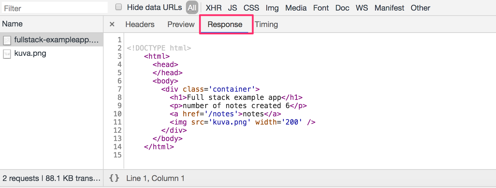

تحتوي الصفحة على عنصر [div](https://developer.mozilla.org/en-US/docs/Web/HTML/Element/div) يضم بدوره عنواناً رئيسياً، ورابطاً لصفحة الملاحظات *notes*، بالإضافة إلى وسم صورة [img](https://developer.mozilla.org/en-US/docs/Web/HTML/Element/img) ويعرض عدد الملاحظات المنشأة.

وبسبب وجود وسم ``، يرسل المتصفح طلباً ثانياً تلقائياً من نوع *HTTP GET* لجلب ملف الصورة `kuva.png` من الخادم:


أُرسل الطلب إلى المسار `https://studies.cs.helsinki.fi/exampleapp/kuva.png`. وتوضح ترويسات الاستجابة أن حجم الصورة هو 89350 بايت، ونوع المحتوى هو `image/png`. يستخدم المتصفح هذه المعلومات لرسم الصورة وعرضها على الشاشة.

تشكل سلسلة الأحداث الناجمة عن فتح الصفحة **مخططاً تسلسلياً ([Sequence Diagram](https://www.geeksforgeeks.org/unified-modeling-language-uml-sequence-diagrams/))** كالتالي:


يصور المخطط التسلسلي كيفية تواصل المتصفح والخادم عبر الزمن، حيث يتدفق الوقت في المخطط من الأعلى إلى الأسفل؛ فيبدأ بالطلب الأول الذي يرسله المتصفح إلى الخادم متبوعاً بالاستجابة، ثم استدعاء الموارد المرتبطة كالصورة وتصيير الصفحة.

---

### تطبيقات الويب التقليدية (Traditional Web Applications)

تعمل الصفحة الرئيسية للتطبيق التجريبي بنمط *تطبيقات الويب التقليدية*. عند زيارة الصفحة، يجلب المتصفح مستند HTML كاملاً من الخادم يحدد هيكل ومحتوى النصوص في الصفحة.

يقوم الخادم بإنشاء وتجهيز هذا المستند؛ إما كملف نصي ثابت (*Static*) محفوظ في مجلدات الخادم، أو بإنشائه **ديناميكياً (*Dynamically*)** وفق منطق عمل التطبيق البرمجي، مستخدماً على سبيل المثال بيانات مسترجعة من قاعدة بيانات. تم إنشاء كود HTML للتطبيق التجريبي ديناميكياً لأنه يحتوي على عدد الملاحظات المسجلة لحظياً:

```js
const getFrontPageHtml = noteCount => {
  return `
    <!DOCTYPE html>
    <html>
      <head>
      </head>
      <body>
        <div class='container'>
          <h1>Full stack example app</h1>
          <p>number of notes created ${noteCount}</p>
          <a href='/notes'>notes</a>
          
        </div>
      </body>
    </html>
`
}

app.get('/', (req, res) => {
  const page = getFrontPageHtml(notes.length)
  res.send(page)
})
```

(لا يُشترط استيعاب تفاصيل كود Node.js الآن بالكامل).

تم حفظ محتوى صفحة HTML كنص قالبي (Template string) يتيح تقييم المتغيرات، مثل المتغير `noteCount` في وسطه. الجزء المتغير ديناميكياً في الصفحة (عدد الملاحظات) يتم استبداله بالعدد الفعلي الحالي للملاحظات (`notes.length`).

إن كتابة أكواد HTML داخل لغة البرمجة ليست الطريقة المثلى في التطبيقات الكبيرة، لكنها كانت الممارسة الشائعة لدى مبرمجي PHP التقليديين.

في تطبيقات الويب التقليدية، يُعتبر المتصفح "مستقبِلاً وعارضاً فقط"، بينما يقع كامل منطق التطبيق وحساباته وبناء مستندات الـ HTML على عاتق الخادم (باستخدام تقنيات مثل Java Spring أو Python Flask أو Ruby on Rails أو PHP).

---

### تشغيل منطق التطبيق في المتصفح (Running application logic in the browser)

أبقِ أدوات المطورين مفتوحة، وامسح سجل وحدة التحكم بالنقر على رمز 🚫 أو كتابة `clear()` في الـ Console.
عند الانتقال إلى صفحة [الملاحظات (notes)](https://studies.cs.helsinki.fi/exampleapp/notes)، ستلاحظ أن المتصفح يرسل **4 طلبات HTTP**:


تختلف أنواع هذه الطلبات: الطلب الأول نوعه *document*، وهو كود HTML للصفحة:


عند مقارنة الصفحة المعروضة على المتصفح بكود HTML العائد من الخادم، نلاحظ أن كود HTML لا يحتوي على قائمة الملاحظات إطلاقاً! بل يحتوي قسم `<head>` في HTML على وسم `<script>` يوجه المتصفح لجلب ملف جافاسكريبت اسمه `main.js`.

يبدو كود الجافاسكريبت في `main.js` كالتالي:

```js
var xhttp = new XMLHttpRequest()

xhttp.onreadystatechange = function() {
  if (this.readyState == 4 && this.status == 200) {
    const data = JSON.parse(this.responseText)
    console.log(data)

    var ul = document.createElement('ul')
    ul.setAttribute('class', 'notes')

    data.forEach(function(note) {
      var li = document.createElement('li')

      ul.appendChild(li)
      li.appendChild(document.createTextNode(note.content))
    })

    document.getElementById('notes').appendChild(ul)
  }
}

xhttp.open('GET', '/data.json', true)
xhttp.send()
```

> **ملاحظة**: قد يتساءل البعض لماذا استُخدم الكائن القديم `XMLHttpRequest` بدلاً من واجهة `fetch` الحديثة؟ السبب هو تجنب الدخول في موضوع الوعود (Promises) في هذا الجزء التمهيدي؛ حيث سنستخدم الطرق الحديثة والقياسية في [الجزء 2](/ar/part2).

فور تنزيل ملف السكريبت، يبدأ المتصفح بتنفيذ الشيفرة البرمجية. السطران الأخيران يوجهان المتصفح لإرسال طلب HTTP GET إلى المسار `/data.json`:

```js
xhttp.open('GET', '/data.json', true)
xhttp.send()
```

وهذا هو الطلب الرابع الأخير الظاهر في تبويب Network. يمكنك زيارة الرابط <https://studies.cs.helsinki.fi/exampleapp/data.json> مباشرة من المتصفح لمعاينة البيانات الخام بصيغة **[JSON](https://en.wikipedia.org/wiki/JSON)**:


يمكنك تثبيت إضافة مثل [JSONView](https://chromewebstore.google.com/detail/gmegofmjomhknnokphhckolhcffdaihd) على المتصفح لتنسيق بيانات JSON بشكل منظم وملون:


يقوم كود الجافاسكريبت بتنزيل بيانات JSON التي تحتوي على الملاحظات، ثم يُنشئ قائمة نقطية لعرض نصوص الملاحظات في الصفحة عبر الكود:

```js
const data = JSON.parse(this.responseText)
console.log(data)

var ul = document.createElement('ul')
ul.setAttribute('class', 'notes')

data.forEach(function(note) {
  var li = document.createElement('li')

  ul.appendChild(li)
  li.appendChild(document.createTextNode(note.content))
})

document.getElementById('notes').appendChild(ul)
```

يقوم الأمر `console.log(data)` بطباعة البيانات المستلمة في وحدة التحكم (Console):


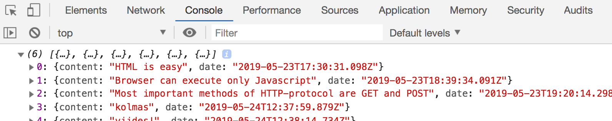

ستصبح وحدة التحكم وأمر `console.log` من أعز أصدقائك وأهم أدواتك طوال رحلتك في هذه الدورة.

---

### معالجات الأحداث ودوال رد النداء (Event handlers and Callback functions)

انتبه لبنية هذا الكود:
```js
var xhttp = new XMLHttpRequest()

xhttp.onreadystatechange = function() {
  // الكود المسؤول عن معالجة استجابة الخادم
}

xhttp.open('GET', '/data.json', true)
xhttp.send()
```

تم إرسال الطلب في السطر الأخير، بينما وُضعت دالة المعالجة في الأعلى. في هذا السطر:
```js
xhttp.onreadystatechange = function () {
```
تم تعريف **معالج أحداث (Event Handler)** للحدث `onreadystatechange` الخاص بالكائن `xhttp`. عندما تتغير حالة الطلب وتكتمل (`readyState == 4` مع رمز الحالة 200)، يستدعي المتصفح تلقائياً هذه الدالة التي تُعرف باسم **دالة رد النداء ([Callback function](https://developer.mozilla.org/en-US/docs/Glossary/Callback_function))**. لا يستدعي كود التطبيق الدالة بنفسه مباشرة، بل تقوم بيئة التشغيل (المتصفح) باستدعائها في اللحظة المناسبة فور وقوع الحدث.

---

### نموذج كائن المستند (DOM - Document Object Model)

يمكن تمثيل صفحات الويب كشجرة هرمية ضمنية من العناصر:

```text
html
  head
    link
    script
  body
    div
      h1
      div
        ul
          li
          li
          li
      form
        input
        input
```

يمكنك مشاهدة نفس الهيكل الشجري في تبويب **Elements** في أدوات المطورين:


يمثل **DOM** واجهة برمجة تطبيقات (API) تتيح للبرامج ولغة JavaScript التعديل البرمجي على شجرة عناصر صفحة الويب في الوقت الفعلي.

---

### التعديل على كائن المستند من وحدة التحكم (Manipulating the document object from console)

يُسمى العنصر الجذري الأعلى في شجرة الـ DOM بـ `document`. يمكنك كتابة `document` في تبويب Console للوصول إليه والتعديل عليه:

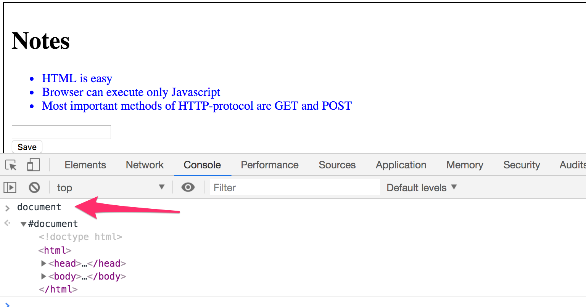

لنجرب إضافة ملاحظة جديدة للصفحة مباشرة من وحدة التحكم:
```js
// جلب أول قائمة ul في الصفحة
list = document.getElementsByTagName('ul')[0]

// إنشاء عنصر li جديد وإضافة نص إليه
newElement = document.createElement('li')
newElement.textContent = 'Page manipulation from console is easy'

// إضافة العنصر الجديد إلى القائمة
list.appendChild(newElement)
```

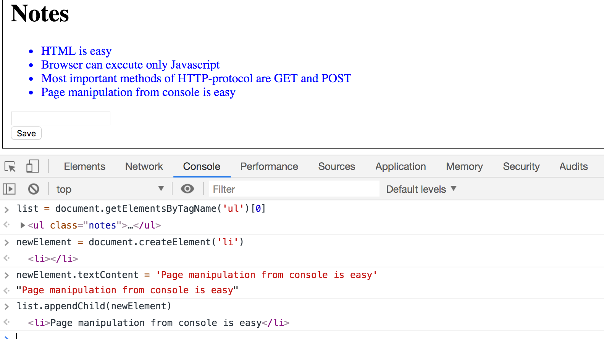

على الرغم من أن الصفحة تم تحديثها فورياً في المتصفح، إلا أن هذا التغيير **مؤقت** ويزول بمجرد تحديث الصفحة (Refresh)، لأن التعديل لم يُحفظ في الخادم أو قاعدة البيانات.

---

### أوراق الأنماط والتنسيقات (CSS)

يحتوي عنصر `<head>` في صفحة الملاحظات على وسم `<link>` يوجه المتصفح لجلب ملف التنسيقات `main.css`:

```css
.container {
  padding: 10px;
  border: 1px solid;
}

.notes {
  color: blue;
}
```

يحدد هذا الملف محددات الفئات (Class selectors). يمكن فحص خصائص CSS وتعديلها حياً في تبويب *Elements*:

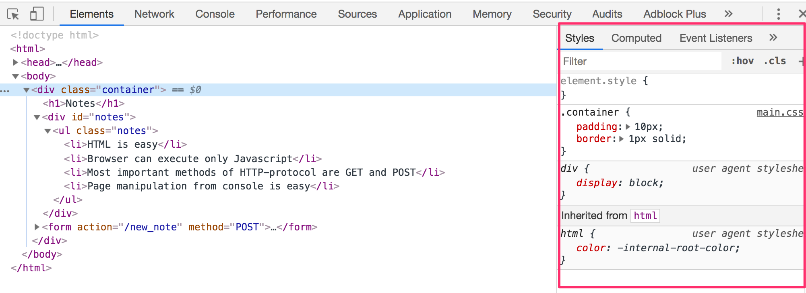


أي تغييرات تجريها في أدوات المطورين تزول عند إعادة التحميل ما لم يتم حفظها في ملف CSS في الخادم.

---

### مراجعة شاملة: ما يحدث عند تحميل صفحة تحتوي على JavaScript

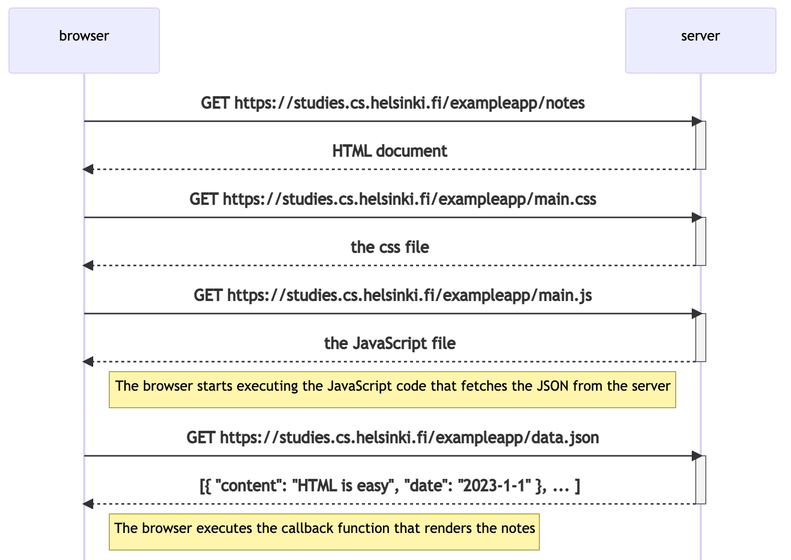

1. يجلب المتصفح مستند HTML الرئيسي عبر طلب HTTP GET.
2. تدفع الروابط في كود HTML المتصفح لجلب ملف التنسيق `main.css` وملف الجافاسكريبت `main.js`.
3. يُنفذ المتصفح كود JavaScript، الذي يرسل بدوره طلب HTTP GET إلى `/data.json` لجلب الملاحظات بصيغة JSON.
4. عند اكتمال جلب البيانات، يُنفذ معالج الأحداث دالة رد النداء التي تُنشئ عناصر HTML وتُصيّر الملاحظات في الصفحة عبر DOM API.

---

### النماذج وإرسال البيانات عبر HTTP POST

تحتوي صفحة الملاحظات على نموذج إدخال ([form element](https://developer.mozilla.org/en-US/docs/Learn/HTML/Forms/Your_first_HTML_form)):

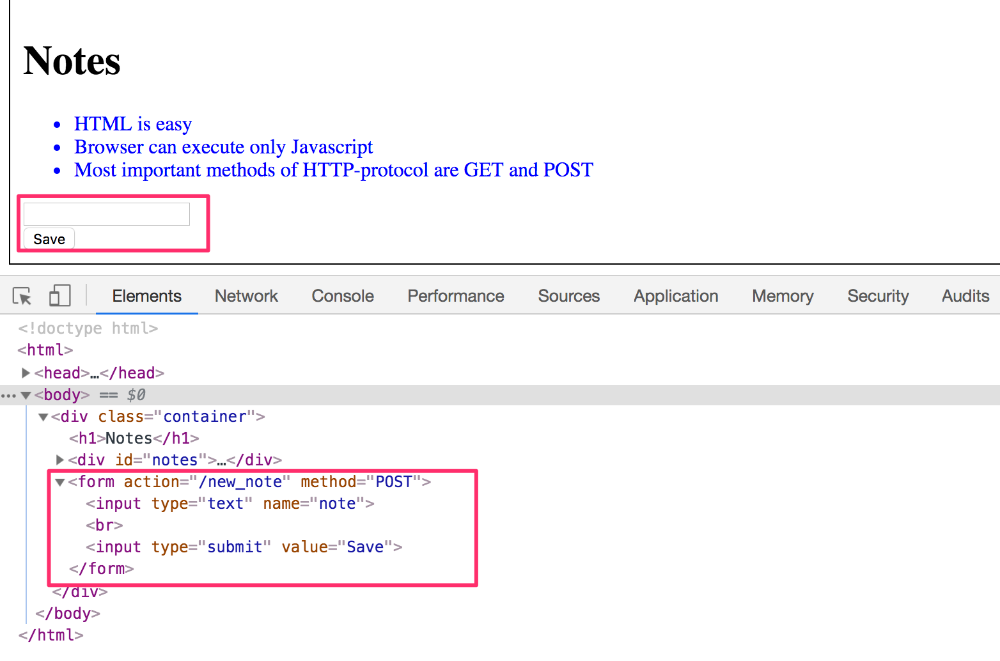

عند النقر على زر الحفظ (Save)، يُرسل المتصفح مدخلات المستخدم إلى الخادم. يوضح تبويب Network ما يحدث:

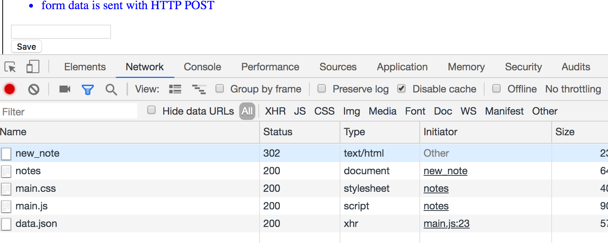

يتسبب إرسال النموذج في حدوث **5 طلبات HTTP متتالية**:
الطلب الأول هو طلب **[HTTP POST](https://developer.mozilla.org/en-US/docs/Web/HTTP/Methods/POST)** إلى العنوان `/new_note`:

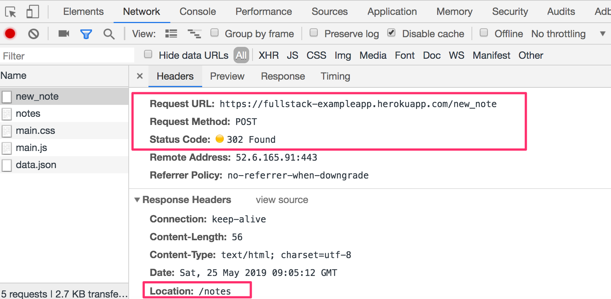

يرد الخادم برمز الحالة **302 (URL Redirect)**؛ وهو توجيه يطلب من المتصفح إرسال طلب GET جديد للمسار `/notes`. مما يؤدي لإعادة تحميل الصفحة بالكامل وجلب CSS و JS والبيانات من جديد لعرض الملاحظة المضافة حديثاً.

يتم إرسال نص الملاحظة كحمولة داخل **جسم الطلب (Request Payload / Body)**:

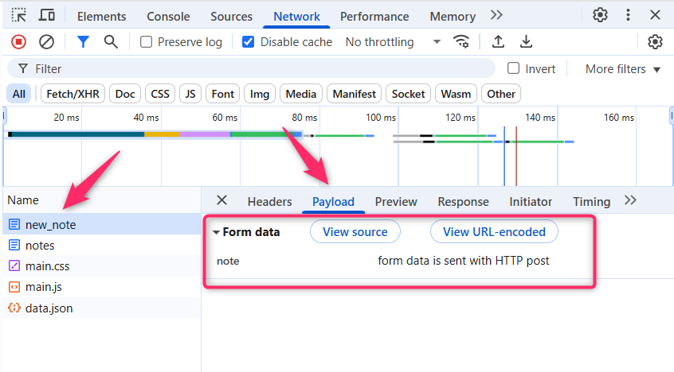

يحتوي وسم النموذج على الخاصيتين `action="/new_note"` و `method="POST"`:

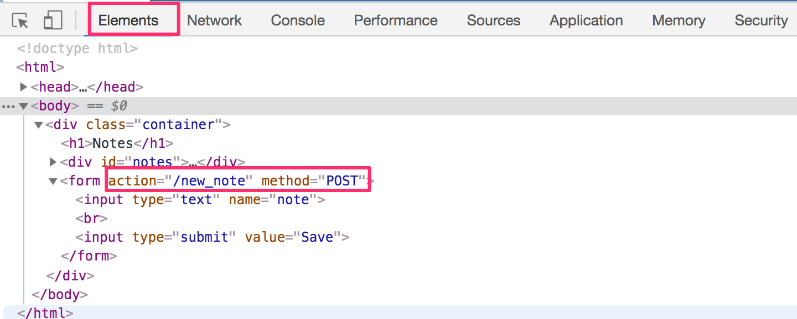

كود الخادم المسؤول عن استقبال طلب الـ POST:
```js
app.post('/new_note', (req, res) => {
  notes.push({
    content: req.body.note,
    date: new Date(),
  })

  return res.redirect('/notes')
})
```

---

### تقنية AJAX وظهور تطبيقات الصفحة الواحدة (SPA)

في عام 2005، ظهر مصطلح **AJAX (Asynchronous JavaScript and XML)** ليصف ثورة تقنية أتاحت للمتصفح جلب البيانات في الخلفية باستخدام JavaScript وتحديث أجزاء من الصفحة دون الحاجة لإعادة تحميل صفحة الويب كاملة.

تطور هذا المفهوم لاحقاً إلى نمط **تطبيقات الصفحة الواحدة ([Single-page application - SPA](https://en.wikipedia.org/wiki/Single-page_application))**. في مواقع الـ SPA، لا يجلب المتصفح صفحات HTML متعددة ومنفصلة من الخادم، بل يتم تحميل صفحة HTML واحدة فقط في البداية، ويتم إجراء كافة عمليات التنقل وتحديث المحتوى وعرض البيانات بالكامل داخل المتصفح عبر JavaScript.

يمكنك تجربة النسخة المبنية بنمط SPA لتطبيقنا عبر الرابط: <https://studies.cs.helsinki.fi/exampleapp/spa>.

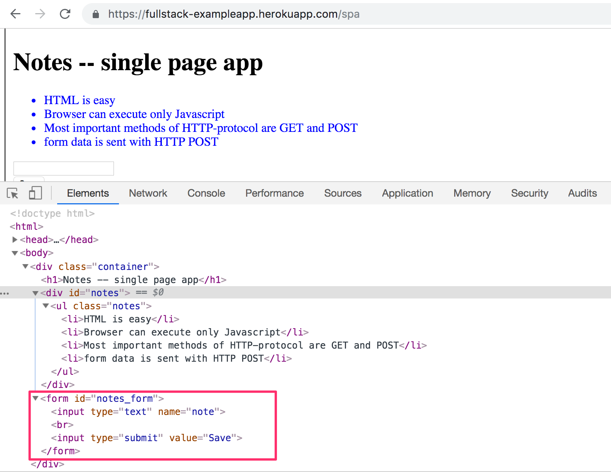

في نسخة الـ SPA، لا يحتوي النموذج على `action` أو `method`. وعند إضافة ملاحظة جديدة، يرسل المتصفح **طلباً واحداً فقط** إلى الخادم:


يُرسل طلب الـ POST كبيانات JSON مع الترويسة `Content-Type: application/json`:

```json
{
  "content": "single page app does not reload the whole page",
  "date": "2026-08-24T14:30:00.000Z"
}
```

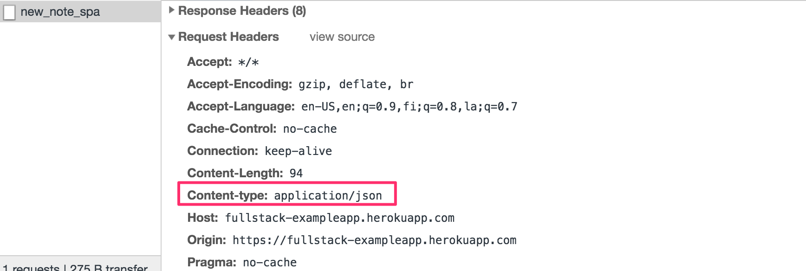

يرد الخادم برمز الحالة **[201 Created](https://httpstatuses.com/201)** دون إعادة توجيه (No redirect)، وتظل الصفحة في مكانها دون أي إعادة تحميل:

```js
var form = document.getElementById('notes_form')
form.onsubmit = function(e) {
  e.preventDefault() // منع إعادة تحميل الصفحة الافتراضي

  var note = {
    content: e.target.elements[0].value,
    date: new Date(),
  }

  notes.push(note)
  e.target.elements[0].value = ''
  redrawNotes() // إعادة رسم الملاحظات محلياً في DOM
  sendToServer(note) // إرسال الملاحظة للخادم عبر XMLHttpRequest
}
```

الشيفرة الكاملة للتطبيق التجريبي متاحة على مستودع GitHub: <https://github.com/mluukkai/example_app>.

---

### مكتبات جافاسكريبت وتطورها (JavaScript libraries)

- **Vanilla JavaScript**: استخدام لغة JavaScript الصرفة وواجهة DOM API المباشرة.
- **jQuery (2006)**: مكتبة أحدثت طفرة هائلة بتوفير أدوات سهلة للتلاعب بالـ DOM وضمان التوافق التام بين جميع المتصفحات (Cross-browser compatibility).
- **BackboneJS و AngularJS (2012)**: قاد إطار عمل AngularJS من Google الموجة الأولى من تطبيقات الصفحة الواحدة (SPAs).
- **React (من Meta/Facebook)**: المكتبة الأكثر انتشاراً وشعبية اليوم لبناء الواجهات التفاعلية الحديثة المعتمدة على المكونات (Components)، وتُستخدم بكثرة مع مكتبات إدارة الحالة الحديثة مثل **[Zustand](https://github.com/pmndrs/zustand)**.

---

### مفهوم تطوير الويب الشامل (Full-stack web development)

تتألف تطبيقات الويب من طبقات متعددة تسمى **الحزمة (Stack)**:
1. **الواجهة الأمامية ([Frontend](https://en.wikipedia.org/wiki/Front_and_back_ends))**: كود المتصفح وواجهة المستخدم (React, HTML, CSS, JavaScript).
2. **الواجهة الخلفية ([Backend](https://en.wikipedia.org/wiki/Front_and_back_ends))**: الخادم ومنطق الأعمال ونقاط النهاية البرمجية (Node.js, Express).
3. **قاعدة البيانات (Database)**: تخزين البيانات واسترجاعها (MongoDB, PostgreSQL).

في هذه الدورة، سنقوم ببرمجة الواجهة الخلفية والأمامية باستخدام لغة واحدة هي **JavaScript** عبر بيئة **Node.js**، مما يمنح المطور إنتاجية وسرعة فائقة في بناء التطبيقات.

---

### ظاهرة إرهاق جافاسكريبت (JavaScript fatigue)

تتطور منظومة JavaScript بسرعة مذهلة، حيث تظهر مكتبات وأدوات وتحديثات مستمرة. أطلق المطورون على وتيرة التغيير المتسارعة هذه مصطلح *إرهاق جافاسكريبت (JavaScript fatigue)*. في هذه الدورة، صممنا المنهج بحيث نركز مباشرة على البرمجة وكتابة الأكواد العملية وتجنب الغرق في تعقيدات الإعدادات الأولية (Configuration hell).

</div>

<div class="tasks">

<h3>التمارين 0.1 - 0.6</h3>

تُسلّم حلول التمارين عبر رفعها على مستودع **GitHub** وتأكيد الإنجاز في [نظام تسليم التمارين](https://studies.cs.helsinki.fi/stats/courses/fullstackopen).

نظم مجلدات المستودع بشكل مرتب:
```text
part0
part1
  courseinfo
  unicafe
  anecdotes
part2
  courseinfo
  phonebook
  countries
```

تُسلّم التمارين **جزءاً بجزء (one part at a time)**.

<h4>0.1: أساسيات HTML</h4>
راجع أساسيات HTML بقراءة دليل موزيلا: [دليل HTML للمبتدئين](https://developer.mozilla.org/en-US/docs/Learn/Getting_started_with_the_web/HTML_basics).
*(هذا التمرين للقراءة والمراجعة فقط ولا يتطلب تسليم شيفرة على GitHub)*.

<h4>0.2: أساسيات CSS</h4>
راجع أساسيات تنسيق CSS بقراءة دليل موزيلا: [دليل CSS للمبتدئين](https://developer.mozilla.org/en-US/docs/Learn/Getting_started_with_the_web/CSS_basics).
*(هذا التمرين للقراءة والمراجعة فقط)*.

<h4>0.3: نماذج HTML</h4>
تعرف على كيفية عمل النماذج في HTML بقراءة دليل موزيلا: [إنشاء أول نموذج في HTML](https://developer.mozilla.org/en-US/docs/Learn/HTML/Forms/Your_first_HTML_form).
*(هذا التمرين للقراءة والمراجعة فقط)*.

<h4>0.4: مخطط تسلسلي لإنشاء ملاحظة جديدة (New Note Diagram)</h4>
في قسم [مراجعة ما يحدث عند تحميل صفحة تحتوي على JavaScript](/ar/part0/fundamentals_of_web_apps#loading-a-page-containing-java-script-review)، تم توضيح سلسلة الأحداث كمخطط تسلسلي.

تم إنشاء المخطط كملف Markdown باستخدام صيغة **[Mermaid](https://docs.github.com/en/get-started/writing-on-github/working-with-advanced-formatting/creating-diagrams)** كالتالي:

```text
sequenceDiagram
    participant browser
    participant server

    browser->>server: GET https://studies.cs.helsinki.fi/exampleapp/notes
    activate server
    server-->>browser: HTML document
    deactivate server

    browser->>server: GET https://studies.cs.helsinki.fi/exampleapp/main.css
    activate server
    server-->>browser: the css file
    deactivate server

    browser->>server: GET https://studies.cs.helsinki.fi/exampleapp/main.js
    activate server
    server-->>browser: the JavaScript file
    deactivate server

    Note right of browser: The browser starts executing the JavaScript code that fetches the JSON from the server

    browser->>server: GET https://studies.cs.helsinki.fi/exampleapp/data.json
    activate server
    server-->>browser: [{ "content": "HTML is easy", "date": "2023-1-1" }, ... ]
    deactivate server

    Note right of browser: The browser executes the callback function that renders the notes
```

**أنشئ مخططاً مماثلاً** يوضح بالتفصيل الحالة التي يقوم فيها المستخدم بإنشاء ملاحظة جديدة في الصفحة <https://studies.cs.helsinki.fi/exampleapp/notes> عن طريق كتابة نص في الحقل والضغط على زر *Save*.

وضّح العمليات التي تحدث في المتصفح وفي الخادم وطلبات الشبكة ورمز إعادة التوجيه 302 وسلسلة الطلبات الناتجة.

يمكنك إنجاز المخطط بصيغة Mermaid في ملف Markdown على مستودع GitHub.

<h4>0.5: مخطط تطبيق الصفحة الواحدة (Single page app diagram)</h4>
أنشئ مخططاً تسلسلياً يوضح ما يحدث عندما ينتقل المستخدم مباشرة إلى نسخة تطبيق الصفحة الواحدة <https://studies.cs.helsinki.fi/exampleapp/spa>.

<h4>0.6: مخطط إضافة ملاحظة في تطبيق الصفحة الواحدة (New note in Single page app diagram)</h4>
أنشئ مخططاً تسلسلياً يوضح ما يحدث عندما يكتب المستخدم ملاحظة جديدة ويحفظها في نسخة الـ SPA مع توضيح طلب POST الواحد المرسل ببيانات JSON والرد 201 Created.

هذا هو التمرين الأخير في هذا الجزء، حان الوقت لرفع حلولك على GitHub وتأكيد إنجاز التمارين في نظام التسليم.

</div>
