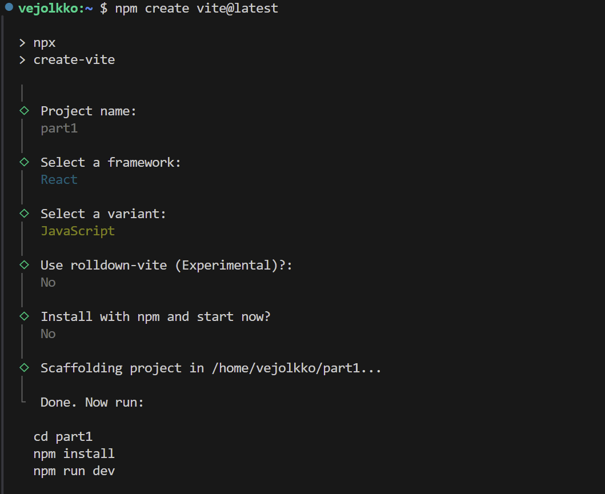
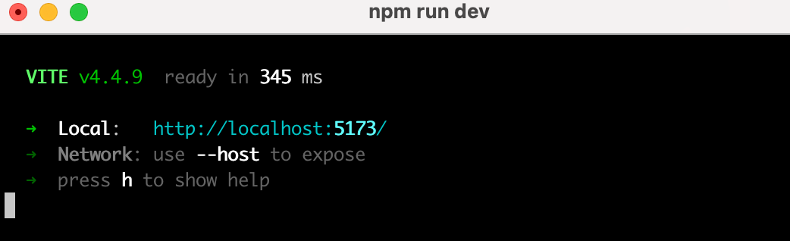
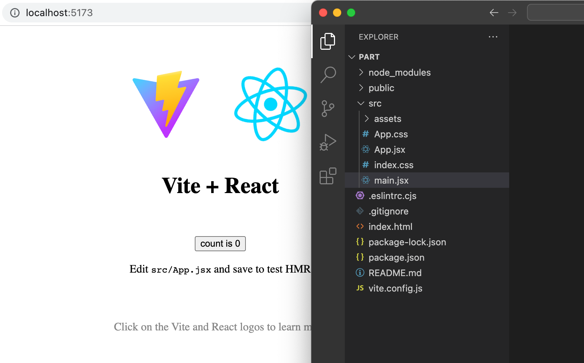
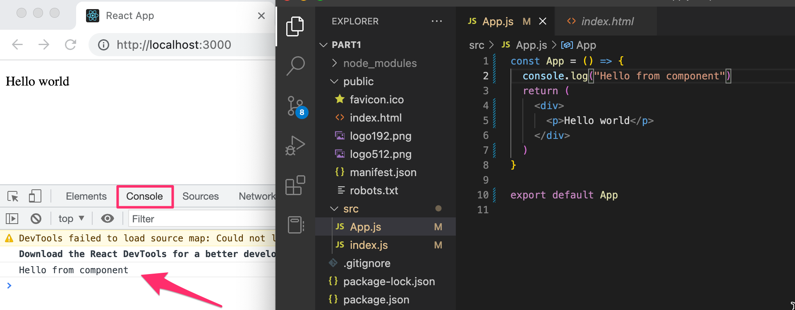
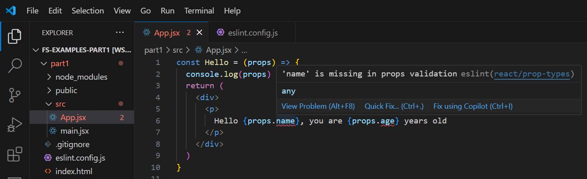
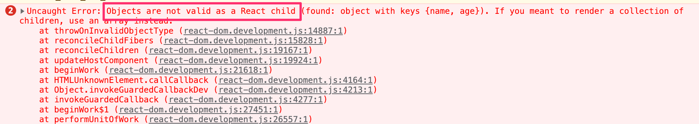

<div class="content">

سنتعرف الآن على الموضوع الأهم في هذه الدورة، وهو مكتبة **[React](https://react.dev/)**. سنبدأ بإنشاء أول تطبيق بسيط بواسطة React والتعرف على المفاهيم الجوهرية لبناء واجهات المستخدم التفاعلية.

أسهل وأسرع وسيلة للبدء هي استخدام أداة البناء الحديثة **[Vite](https://vitejs.dev/)**.

لنقم بإنشاء تطبيق جديد باستخدام أداة `create-vite` بتنفيذ الأمر التالي في الطرفية:

```bash
npm create vite@latest
```

أجب على الأسئلة التي تطرحها الأداة كالتالي:
- اسم المشروع (Project name): `part1`
- إطار العمل (Select a framework): `React`
- لغة البرمجة (Select a variant): `JavaScript`



أنشأنا الآن تطبيقاً باسم *part1*. انتقل إلى مجلد التطبيق وقم بتثبيت المكتبات المطلوبة:

```bash
cd part1
npm install
```

ثم قم بتشغيل التطبيق في بيئة التطوير:

```bash
npm run dev
```

ستوضح لك الطرفية أن التطبيق يعمل على المنفذ الافتراضي 5173 عبر العنوان: <http://localhost:5173/>:



افتح المتصفح ومحرر النصوص (VS Code) جنباً إلى جنب على الشاشة:



توجد شيفرة التطبيق داخل المجلد `src`. سنقوم بتبسيط الملفات المبدئية؛ افتح الملف `src/main.jsx` واجعله كالتالي:

```js
import ReactDOM from 'react-dom/client'

import App from './App'

ReactDOM.createRoot(document.getElementById('root')).render(<App />)
```

واجعل محتوى الملف `src/App.jsx` كالتالي:

```js
const App = () => {
  return (
    <div>
      <p>Hello world</p>
    </div>
  )
}

export default App
```

يمكنك حذف الملفات `App.css` و `index.css` ومجلد `assets` لعدم حاجتنا إليها في تطبيقنا الحالي.

---

### المكونات (Component)

يُعرّف الملف `App.jsx` [مكون React](https://react.dev/learn/your-first-component) باسم `App`. يقوم الأمر في السطر الأخير من ملف `main.jsx`:

```js
ReactDOM.createRoot(document.getElementById('root')).render(<App />)
```

بتصيير محتويات المكون داخل عنصر الـ `div` المعرف في ملف `index.html` والذي يحمل الخاصية `id="root"`.

لا يحتوي ملف `index.html` افتراضياً على وسوم HTML مرئية، بل يقتصر على هيكل أساسي:

```html
<!doctype html>
<html lang="en">
  <head>
    <meta charset="UTF-8" />
    <link rel="icon" type="image/svg+xml" href="/vite.svg" />
    <meta name="viewport" content="width=device-width, initial-scale=1.0" />
    <title>part1</title>
  </head>
  <body>
    <div id="root"></div>
    <script type="module" src="/src/main.jsx"></script>
  </body>
</html>
```

عند استخدام React، يتم تعريف كافة المحتويات المطلوب تصييرها على أنها مكونات React.

لنلقِ نظرة فاحصة على الشيفرة التي تُعرّف المكون:

```js
const App = () => (
  <div>
    <p>Hello world</p>
  </div>
)
```

من الناحية التقنية، يُعرَّف المكون كـ **دالة جافاسكريبت (JavaScript function)** تُرجع واجهة مستخدم:

```js
() => (
  <div>
    <p>Hello world</p>
  </div>
)
```

ثم يتم إسناد هذه الدالة إلى ثابت باسم `App`:

```js
const App = ...
```

استخدمنا هنا **الدوال السهمية ([Arrow functions](https://developer.mozilla.org/en-US/docs/Web/JavaScript/Reference/Functions/Arrow_functions))** المقدمة في مواصفة [ECMAScript 6 (ES6)](https://262.ecma-international.org/6.0/). ولأن الدالة تتكون من تعبير وحيد، استخدمنا الصيغة المختصرة التي تمثل هذا الكود:

```js
const App = () => {
  return (
    <div>
      <p>Hello world</p>
    </div>
  )
}
```

يمكن لدالة المكون أن تحتوي على أي منطق وحسابات برمجية بلغة JavaScript. عدل مكونك ليصبح كالتالي:

```js
const App = () => {
  console.log('Hello from component')
  return (
    <div>
      <p>Hello world</p>
    </div>
  )
}

export default App
```

ولاحظ ما يُطبع في وحدة التحكم (Console) بالمتصفح:



> **القاعدة الذهبية الأولى في تطوير الواجهات الأمامية**: *أبقِ وحدة التحكم (Console) مفتوحة طوال الوقت أثناء كتابة وتجربة الشيفرات*.

يمكن أيضاً تصيير محتوى ديناميكي داخل المكون:

```js
const App = () => {
  const now = new Date()
  const a = 10
  const b = 20
  console.log(now, a+b)

  return (
    <div>
      <p>Hello world, it is {now.toString()}</p>
      <p>
        {a} plus {b} is {a + b}
      </p>
    </div>
  )
}
```

أي تعبير جافاسكريبت يُكتب بين **الأقواس المعقوفة `{ }`** يتم تقييم قيمته ودمجه في الموضع المحدد داخل كود الـ HTML المولد.

انتبه لعدم حذف سطر التصدير `export default App` الموجود في نهاية الملف، فبدونه لن يعمل المكون وسيتوقف التطبيق.

---

### لغة التوصيف JSX

يبدو كود مكونات React كأنه يُرجع وسوم HTML عادية، لكنه في الواقع يُكتب بصيغة **[JSX](https://react.dev/learn/writing-markup-with-jsx)**. ورغم أن JSX تشبه HTML ظاهرياً، إلا أنها امتداد لبناء واجهات JavaScript؛ حيث يتم تصريف (Compile) وسوم JSX خلف الكواليس إلى دوال جافاسكريبت قياسية.

بعد عملية التصريف، يصبح الكود البرمجي للتطبيق كالتالي:

```js
const App = () => {
  const now = new Date()
  const a = 10
  const b = 20
  return React.createElement(
    'div',
    null,
    React.createElement(
      'p', null, 'Hello world, it is ', now.toString()
    ),
    React.createElement(
      'p', null, a, ' plus ', b, ' is ', a + b
    )
  )
}
```

تتولى أداة [Babel](https://babeljs.io/repl/) تصريف وسوم JSX تلقائياً في مشاريع Vite.

في لغة JSX، التي تتبع بنية [XML](https://developer.mozilla.org/en-US/docs/Web/XML/XML_introduction)، يجب إغلاق كافة الوسوم بشكل صريح. فمثلاً وسم السطر الجديد في HTML يُكتب `<br>`، بينما في JSX يجب كتابته `<br />`.

---

### تعدد المكونات وإعادة استخدامها (Multiple components)

لنعدل ملف `App.jsx` كالتالي:

```js
const Hello = () => {
  return (
    <div>
      <p>Hello world</p>
    </div>
  )
}

const App = () => {
  return (
    <div>
      <h1>Greetings</h1>
      <Hello />
      <Hello />
      <Hello />
    </div>
  )
}
```

قمنا بتعريف مكون جديد باسم `Hello` واستخدامه عدة مرات داخل المكون الرئيسي `App`.

جوهر فلسفة React يقوم على تجميع وتأليف التطبيقات المعقدة من خلال **مكونات صغيرة ومتخصصة وقابلة لإعادة الاستخدام (Reusable components)**.

---

### تمرير البيانات إلى المكونات عبر الخصائص (props)

يمكن تمرير البيانات بين المكونات باستخدام ما يُعرف بـ **الخصائص ([props](https://react.dev/learn/passing-props-to-a-component))**:

```js
const Hello = (props) => {
  return (
    <div>
      <p>Hello {props.name}</p>
    </div>
  )
}

const App = () => {
  return (
    <div>
      <h1>Greetings</h1>
      <Hello name='George' />
      <Hello name='Daisy' />
    </div>
  )
}
```

تستقبل دالة المكون كائناً يحتوي على كافة الخصائص الممررة `props`. ويمكن تمرير قيم نصية مباشرة، أو تمرير متغيرات وحسابات ديناميكية بوضعها داخل `{ }`:

```js
const Hello = (props) => {
  console.log(props)
  return (
    <div>
      <p>
        Hello {props.name}, you are {props.age} years old
      </p>
    </div>
  )
}

const App = () => {
  const name = 'Peter'
  const age = 10

  return (
    <div>
      <h1>Greetings</h1>
      <Hello name='Maya' age={26 + 10} />
      <Hello name={name} age={age} />
    </div>
  )
}
```

---

### رسائل التنبيه وأداة ESLint (Possible error message)

إذا ظهر لك تنبيه تحذيري في محرر الأكواد مثل: `name is missing in props validation`:



هذا ليس خطأً في عمل الكود، بل هو تحذير من أداة الفحص [ESLint](https://eslint.org/). يمكنك تعطيل هذا التحذير المحدد بإضافة القاعدة `'react/prop-types': 0` داخل ملف `eslint.config.js`:

```js
export default [
  { ignores: ['dist'] },
  {
    files: ['**/*.{js,jsx}'],
    // ...
    rules: {
      // ...
      'react/prop-types': 0,
    },
  },
]
```

---

### قواعد هامة عند كتابة مكونات React

1. **تسمية المكونات تبدأ بحرف كبير دائماً (Capitalized names)**:
   - يجب أن يبدأ اسم أي مكون بحرف كبير (مثل `Header`, `App`, `Footer`). إذا سميت المكون بحرف صغير (مثل `const footer = ...`)، ستعتبره React وسم HTML أصلي بدلاً من مكونك المخصص.

2. **عنصر الجذر الواحد والقطع المجزأة (React Fragments)**:
   - يجب أن يُرجع المكون عنصراً جذرياً واحداً. لتفادي إضافة وسوم `<div>` غير ضرورية في شجرة DOM، نستخدم **القطع المجزأة (Fragments)** عبر الوسم الفارغ `<> ... </>`:

```js
const App = () => {
  const name = 'Peter'
  const age = 10

  return (
    <>
      <h1>Greetings</h1>
      <Hello name='Maya' age={26 + 10} />
      <Hello name={name} age={age} />
      <Footer />
    </>
  )
}
```

3. **عدم تصيير الكائنات مباشرة (Do not render objects)**:
   - إذا حاولت تصيير كائن جافاسكريبت مباشرة بين الأقواس `{ }`:

```js
const App = () => {
  const friends = [
    { name: 'Peter', age: 4 },
    { name: 'Maya', age: 10 },
  ]

  return (
    <div>
      <p>{friends[0]}</p>
      <p>{friends[1]}</p>
    </div>
  )
}
```

ستصرخ وحدة التحكم بالمتصفح بالخطأ الشهير:



**السبب**: *Objects are not valid as a React child*، حيث تشترط React أن تكون القيم الفردية المصيرة بين الأقواس قيماً أولية (Primitive values) كالأرقام والنصوص.

الحل الصحيح هو الوصول لخصائص الكائن الفردية:

```js
<p>{friends[0].name} {friends[0].age}</p>
<p>{friends[1].name} {friends[1].age}</p>
```

</div>

<div class="tasks">

<h3>التمارين 1.1 - 1.2</h3>

تُسلّم حلول التمارين عبر رفعها على مستودع GitHub الخاص بك وتأكيد الإنجاز في نظام التسليم.

<h4>1.1: معلومات الدورة - الخطوة 1 (Course Information, step 1)</h4>

أنشئ تطبيقاً جديداً باستخدام Vite. اجعل ملف `main.jsx` يستدعي المكون `App`، واجعل ملف `App.jsx` كالتالي:

```js
const App = () => {
  const course = 'Half Stack application development'
  const part1 = 'Fundamentals of React'
  const exercises1 = 10
  const part2 = 'Using props to pass data'
  const exercises2 = 7
  const part3 = 'State of a component'
  const exercises3 = 14

  return (
    <div>
      <h1>{course}</h1>
      <p>
        {part1} {exercises1}
      </p>
      <p>
        {part2} {exercises2}
      </p>
      <p>
        {part3} {exercises3}
      </p>
      <p>Number of exercises {exercises1 + exercises2 + exercises3}</p>
    </div>
  )
}

export default App
```

أعد هيكلة الكود (Refactor) بحيث يتألف التطبيق من ثلاثة مكونات جديدة:
- **Header**: يقوم بعرض اسم الدورة (`course`).
- **Content**: يقوم بعرض الأجزاء وعدد التمارين.
- **Total**: يقوم بعرض إجمالي عدد التمارين.

تظل البيانات في المكون الرئيسي `App` ويتم تمريرها عبر `props`.

> **نصيحة هامة**: لا تحاول برمجة كافة المكونات دفعة واحدة؛ تقدم بخطوات صغيرة ومدروسة. وكما قال خبير هندسة البرمجيات الشهير روبرت مارتن ("Uncle Bob"):
> *"الطريقة الوحيدة للمضي قدماً بسرعة هي كتابة كود عالي الجودة وبخطوات متقنة"* (The only way to go fast, is to go well).

<h4>1.2: معلومات الدورة - الخطوة 2 (Course Information, step 2)</h4>

أعد هيكلة المكون `Content` بحيث لا يقوم بعرض أسماء الأجزاء وتمارينها بنفسه مباشرة، بل يستدعي ثلاثة مكونات فرعية باسم `Part`، بحيث يتولى كل مكون `Part` عرض اسم جزء واحد وعدد تمارينه:

```js
const Content = (props) => {
  return (
    <div>
      <Part .../>
      <Part .../>
      <Part .../>
    </div>
  )
}
```

</div>
