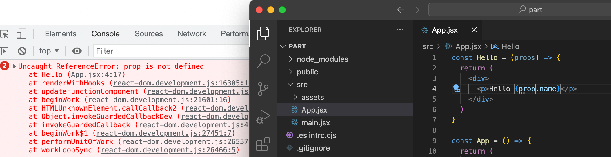
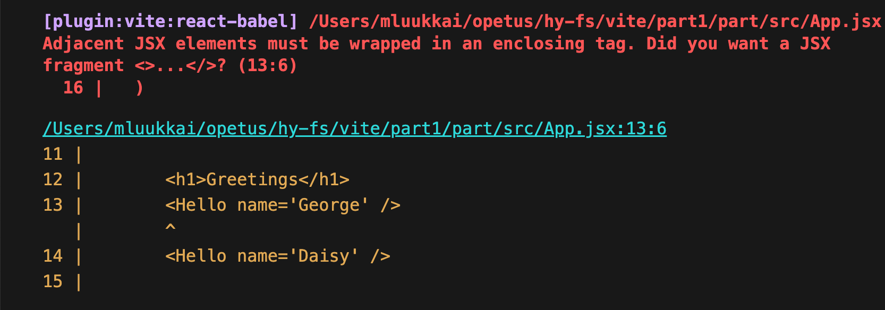

<div class="content">

سنبدأ الآن في التعرف على الموضوع الأكثر أهمية في هذه الدورة على الأرجح، وهو مكتبة [React](https://react.dev/). لنبدأ بإنشاء تطبيق React بسيط والتعرف على المفاهيم الأساسية لـ React.

أسهل طريقة للبدء على الإطلاق هي استخدام أداة تُدعى [Vite](https://vitejs.dev/).

لنقم بإنشاء تطبيق جديد باستخدام أداة <i>create-vite</i>:

```bash
npm create vite@latest
```

لنجب على الأسئلة التي تطرحها الأداة على النحو التالي:


لقد أنشأنا الآن تطبيقاً باسم <i>part1</i>. كان بإمكان الأداة أيضاً تثبيت الاعتماديات (Dependencies) المطلوبة وتشغيل التطبيق تلقائياً إذا أجبنا بـ "Yes" على السؤال "Install with npm and start now?". ومع ذلك، سنقوم بتنفيذ هذه الخطوات يدوياً حتى نرى بوضوح كيف تتم.

بعد ذلك، لننتقل إلى مجلد التطبيق ونقم بتثبيت المكتبات المطلوبة:

```bash
cd part1
npm install
```

يتم تشغيل التطبيق على النحو التالي:

```bash
npm run dev
```

توضح الطرفية أن التطبيق قد بدأ بالعمل على المنفذ (Port) 5173 على المضيف المحلي (localhost)، أي على العنوان <http://localhost:5173/>:


يقوم Vite بتشغيل التطبيق [افتراضياً](https://vitejs.dev/config/server-options.html#server-port) على المنفذ 5173. إذا لم يكن هذا المنفذ متاحاً، فسيستخدم Vite رقم المنفذ التالي المتاح.

افتح المتصفح ومحرر النصوص بحيث يمكنك رؤية الكود وصفحة الويب في نفس الوقت على الشاشة:


توجد شيفرة التطبيق داخل مجلد <i>src</i>. لنقم بتبسيط الكود الافتراضي بحيث يبدو محتوى الملف <i>main.jsx</i> هكذا:

```js
import ReactDOM from 'react-dom/client'

import App from './App'

ReactDOM.createRoot(document.getElementById('root')).render(<App />)
```

ويبدو الملف <i>App.jsx</i> هكذا:

```js
const App = () => {
  return (
    <div>
      <p>Hello world</p>
    </div>
  )
}

export default App
```

يمكن حذف الملفين <i>App.css</i> و <i>index.css</i>، بالإضافة إلى المجلد <i>assets</i>، حيث إننا لا نحتاج إليها في تطبيقنا في الوقت الحالي.

### المكوّن (Component)

يُعرّف الملف <i>App.jsx</i> الآن [مكوّن React (React component)](https://react.dev/learn/your-first-component) باسم <i>App</i>. ويقوم الأمر الموجود في السطر الأخير من الملف <i>main.jsx</i>:

```js
ReactDOM.createRoot(document.getElementById('root')).render(<App />)
```

بتصيير (Render) محتوياته داخل عنصر <i>div</i> المُعرّف في الملف <i>index.html</i> والذي يحمل قيمة <i>id</i> تساوي 'root'.

افتراضياً، لا يحتوي الملف <i>index.html</i> على أي وسوم HTML مرئية لنا في المتصفح:

```html
<!doctype html>
<html lang="en">
  <head>
    <meta charset="UTF-8" />
    <link rel="icon" type="image/svg+xml" href="/vite.svg" />
    <meta name="viewport" content="width=device-width, initial-scale=1.0" />
    <title>part1</title>
  </head>
  <body>
    <div id="root"></div>
    <script type="module" src="/src/main.jsx"></script>
  </body>
</html>
```

يمكنك تجربة إضافة بعض وسوم HTML إلى الملف. ومع ذلك، عند استخدام React، فإن كل المحتوى الذي يحتاج إلى تصيير يتم تعريفه عادةً كمكونات React.

دعونا نلقي نظرة فاحصة على الكود الذي يُعرّف المكوّن:

```js
const App = () => (
  <div>
    <p>Hello world</p>
  </div>
)
```

كما خمنت على الأرجح، سيتم تصيير المكوّن كوسم <i>div</i>، يغلّف وسم <i>p</i> يحتوي على النص <i>Hello world</i>.

من الناحية التقنية، يُعرّف المكوّن كدالة جافاسكريبت. وفيما يلي دالة (لا تستقبل أي معاملات):

```js
() => (
  <div>
    <p>Hello world</p>
  </div>
)
```

ثم يتم تعيين هذه الدالة إلى متغير ثابت باسم <i>App</i>:

```js
const App = ...
```

هناك بضع طرق لتعريف الدوال في JavaScript. سنستخدم هنا [الدوال السهمية (Arrow functions)](https://developer.mozilla.org/en-US/docs/Web/JavaScript/Reference/Functions/Arrow_functions)، والتي تم تقديمها في إصدار JavaScript المعروف باسم [ECMAScript 6](https://262.ecma-international.org/6.0/index.html?_gl=1*xxe99l*_ga*MjA1MjAzOTEwMC4xNzc0MjU2OTkx*_ga_TDCK4DWEPP*czE3NzQyNTY5OTEkbzEkZzEkdDE3NzQyNTczNzUkajYwJGwwJGgw)، ويُطلق عليه أيضاً ES6.

نظراً لأن الدالة تتكون من تعبير (Expression) واحد فقط، فقد استخدمنا صيغة مختصرة تمثل هذه الجزئية من الكود:

```js
const App = () => {
  return (
    <div>
      <p>Hello world</p>
    </div>
  )
}
```

بمعنى آخر، تُرجع الدالة قيمة ذلك التعبير مباشرة.

يمكن للدالة التي تُعرّف المكوّن أن تحتوي على أي نوع من أكواد JavaScript. قم بتعديل المكوّن الخاص بك ليصبح كالتالي:

```js
const App = () => {
  console.log('Hello from component')
  return (
    <div>
      <p>Hello world</p>
    </div>
  )
}

export default App
```

ولاحظ ما يحدث في منصة تحكم المتصفح (Browser Console):


القاعدة الأولى في تطوير واجهات الويب الأمامية (Frontend Web Development):

> <i>أبقِ منصة التحكم (Console) مفتوحة طوال الوقت</i>

دعونا نردد هذا معاً: <i>أنا أتعهد بإبقاء منصة التحكم مفتوحة طوال الوقت</i> خلال هذه الدورة، وطوال حياتي عندما أقوم بتطوير الويب.

من الممكن أيضاً تصيير محتوى ديناميكي داخل المكوّن.

قم بتعديل المكوّن على النحو التالي:

```js
const App = () => {
  const now = new Date()
  const a = 10
  const b = 20
  console.log(now, a+b)

  return (
    <div>
      <p>Hello world, it is {now.toString()}</p>
      <p>
        {a} plus {b} is {a + b}
      </p>
    </div>
  )
}
```

يتم تقييم أي كود جافاسكريبت موضوع بين القوسين المعقوفين `{}` وتضمين نتيجة هذا التقييم في المكان المحدد داخل HTML الذي ينتجه المكوّن.

لاحظ أنه يجب ألا تحذف السطر الموجود في أسفل المكوّن:

```js
export default App
```

لا يظهر التصدير (export) في معظم أمثلة المادة التعليمية للدورة. ولكن بدون هذا التصدير، سيتعطل المكوّن والتطبيق بأكمله.

هل تذكرت تعهدك بإبقاء منصة التحكم مفتوحة؟ ماذا طُبع هناك؟

### JSX

يبدو للوهلة الأولى أن مكونات React تُرجع وسوم HTML. ومع ذلك، ليس هذا هو الواقع في حقيقة الأمر. يُكتب تخطيط وبنية مكونات React في الغالب باستخدام [JSX](https://react.dev/learn/writing-markup-with-jsx). وعلى الرغم من أن JSX يشبه HTML في المظهر، إلا أننا نتعامل مع طريقة لكتابة JavaScript. في الكواليس وتحت الغطاء، يتم تجميع (Compile) كود JSX الذي تُرجعه مكونات React إلى شيفرة JavaScript عادية.

بعد عملية التجميع، يبدو تطبيقنا هكذا:

```js
const App = () => {
  const now = new Date()
  const a = 10
  const b = 20
  return React.createElement(
    'div',
    null,
    React.createElement(
      'p', null, 'Hello world, it is ', now.toString()
    ),
    React.createElement(
      'p', null, a, ' plus ', b, ' is ', a + b
    )
  )
}
```

تتم معالجة التجميع بواسطة أداة [Babel](https://babeljs.io/repl/). المشاريع المنشأة بواسطة *Vite* مُعدة مسبقاً للقيام بالتجميع تلقائياً. سنتعلم المزيد حول هذا الموضوع في [الجزء السابع (Part 7)](/ar/part7) من هذه الدورة.

من الممكن أيضاً كتابة تطبيقات React باستخدام "JavaScript الخالصة" دون استخدام JSX على الإطلاق. ومع ذلك، لن يفعل ذلك أي شخص بكامل قواه العقلية!

من الناحية العملية، يشبه JSX لغة HTML إلى حد كبير مع فارق جوهري، وهو أنه باستخدام JSX يمكنك بسهولة تضمين محتوى ديناميكي عن طريق كتابة كود JavaScript المناسب داخل الأقواس المعقوفة. فكرة JSX تشبه تماماً العديد من لغات قوالب العرض (Templating Languages)، مثل Thymeleaf المستخدمة مع Java Spring على الخوادم.

تعتبر JSX شبيهة بـ [XML](https://developer.mozilla.org/en-US/docs/Web/XML/XML_introduction)، مما يعني أن كل وسم يجب أن يُغلق بإحكام. على سبيل المثال، يمثل السطر الجديد عنصراً فارغاً، ويمكن كتابته في HTML هكذا:

```html
<br>
```

ولكن عند كتابته في JSX، يجب إغلاق الوسم ذاتياً:

```html
<br />
```

### مكونات متعددة (Multiple components)

لنقم بتعديل الملف <i>App.jsx</i> ليصبح كما يلي:

```js
// highlight-start
const Hello = () => {
  return (
    <div>
      <p>Hello world</p>
    </div>
  )
}
// highlight-end

const App = () => {
  return (
    <div>
      <h1>Greetings</h1>
      <Hello /> // highlight-line
    </div>
  )
}
```

لقد قمنا بتعريف مكوّن جديد باسم <i>Hello</i> واستخدمناه داخل المكوّن <i>App</i>. وبطبيعة الحال، يمكن استخدام المكوّن عدة مرات:

```js
const App = () => {
  return (
    <div>
      <h1>Greetings</h1>
      <Hello />
      // highlight-start
      <Hello />
      <Hello />
      // highlight-end
    </div>
  )
}
```

**ملاحظة هامة**: تم حذف سطر <em>export</em> في أسفل الملف في هذه <i>الأمثلة</i>، الآن وفي المستقبل. ولكنه يظل ضرورياً دائماً لكي يعمل الكود بنجاح.

تُعد كتابة المكونات باستخدام React أمراً سهلاً، ومن خلال دمج المكونات معاً، يمكن الحفاظ على قابلية صيانة التطبيقات حتى الأكثر تعقيداً منها. في الواقع، تتمثل إحدى الفلسفات الأساسية لـ React في بناء التطبيقات من خلال تجميع العديد من المكونات المتخصصة والقابلة لإعادة الاستخدام.

هناك أيضاً عرف أساسي قوي يتمثل في وجود <i>مكوّن جذري (Root Component)</i> يُدعى <i>App</i> في أعلى شجرة المكونات للتطبيق. ومع ذلك، كما سنتعلم في [الجزء السادس (Part 6)](/ar/part6)، هناك حالات لا يكون فيها المكوّن <i>App</i> هو الجذر تماماً، بل يتم تغليفه داخل مكوّن خدمات مساعد مناسب.

### الخصائص (props): تمرير البيانات إلى المكونات

من الممكن تمرير البيانات إلى المكونات باستخدام ما يُعرف بـ [الخصائص (Props)](https://react.dev/learn/passing-props-to-a-component).

لنقم بتعديل المكوّن <i>Hello</i> كالتالي:

```js
const Hello = (props) => { // highlight-line
  return (
    <div>
      <p>Hello {props.name}</p> // highlight-line
    </div>
  )
}
```

أصبح للدالة المُعرِّفة للمكوّن الآن معامل يُسمى props. كمعطى (Argument)، يستقبل هذا المعامل كائناً (Object) يحتوي على حقول تقابل جميع "الخصائص (props)" التي يمررها مستخدم المكوّن.

يتم تعريف الخصائص (props) على النحو التالي:

```js
const App = () => {
  return (
    <div>
      <h1>Greetings</h1>
      <Hello name='George' /> // highlight-line
      <Hello name='Daisy' /> // highlight-line
    </div>
  )
}
```

يمكن تمرير أي عدد من الخصائص، ويمكن أن تكون قيمها سلاسل نصية ثابتة أو نتائج تعبيرات JavaScript برمجية. وإذا تم الحصول على قيمة الخاصية عبر JavaScript، فيجب تغليفها بأقواس معقوفة.

لنقم بتعديل الكود بحيث يستخدم المكوّن <i>Hello</i> خاصيتين (two props):

```js
const Hello = (props) => {
  console.log(props) // highlight-line
  return (
    <div>
      <p>
        Hello {props.name}, you are {props.age} years old // highlight-line
      </p>
    </div>
  )
}

const App = () => {
  const name = 'Peter' // highlight-line
  const age = 10       // highlight-line

  return (
    <div>
      <h1>Greetings</h1>
      <Hello name='Maya' age={26 + 10} /> // highlight-line
      <Hello name={name} age={age} />     // highlight-line
    </div>
  )
}
```

الخصائص المرسلة بواسطة المكوّن <i>App</i> هي قيم المتغيرات، وناتج تقييم تعبير الجمع، وسلسلة نصية عادية.

يقوم المكوّن <i>Hello</i> أيضاً بطباعة قيمة كائن الخصائص props في منصة التحكم (console).

آمل حقاً أن منصة التحكم لديك كانت مفتوحة. وإذا لم تكن كذلك، فتذكر ما تعهدت به:

> <i>أنا أتعهد بإبقاء منصة التحكم مفتوحة طوال الوقت أثناء هذه الدورة، ولما تبقى من حياتي عندما أعمل في تطوير الويب</i>

تطوير البرمجيات أمر صعب. ويصبح أكثر صعوبة إذا لم يستخدم المرء جميع الأدوات المتاحة مثل منصة تحكم الويب والطباعة التشخيصية باستخدام _console.log_. يستخدم المحترفون كلاهما <i>طوال الوقت</i>، ولا يوجد أي سبب يدعو المبتدئ إلى عدم تبني استخدام هذه الطرق المساعدة الرائعة التي ستجعل حياته أسهل بكثير.

### رسالة خطأ محتملة

إذا كان مشروعك يحتوي على الإصدار 18 من React أو إصدار سابق مثبت، فقد تتلقى رسالة الخطأ التالية في هذه المرحلة:


هذا ليس خطأً حقيقياً يوقف التنفيذ، بل هو تحذير ناتج عن أداة [ESLint](https://eslint.org/). يمكنك كتم هذا التحذير [react/prop-types](https://github.com/jsx-eslint/eslint-plugin-react/blob/master/docs/rules/prop-types.md) عن طريق إضافة السطر التالي إلى ملف <i>eslint.config.js</i>:

```js
export default [
  { ignores: ['dist'] },
  {
    files: ['**/*.{js,jsx}'],
    languageOptions: {
      ecmaVersion: 2020,
      globals: globals.browser,
      parserOptions: {
        ecmaVersion: 'latest',
        ecmaFeatures: { jsx: true },
        sourceType: 'module',
      },
    },
    settings: { react: { version: '18.3' } },
    plugins: {
      react,
      'react-hooks': reactHooks,
      'react-refresh': reactRefresh,
    },
    rules: {
      ...js.configs.recommended.rules,
      ...react.configs.recommended.rules,
      ...react.configs['jsx-runtime'].rules,
      ...reactHooks.configs.recommended.rules,
      'react/jsx-no-target-blank': 'off',
      'react-refresh/only-export-components': [
        'warn',
        { allowConstantExport: true },
      ],
      'react/prop-types': 0, // highlight-line
    },
  },
]
```

سنتعرف على ESLint بمزيد من التفصيل [في الجزء الثالث (Part 3)](/ar/part3/validation_and_es_lint#lint).

### بعض الملاحظات الهامة

تم إعداد React لتوليد رسائل خطأ واضحة ومفهومة للغاية. ورغم ذلك، ينبغي عليك، على الأقل في البداية، أن تتقدم بـ **خطوات صغيرة جداً** وتتأكد من أن كل تعديل يعمل بالشكل المطلوب تماماً قبل المتابعة.

**يجب أن تظل منصة التحكم مفتوحة دائماً**. وإذا أبلغ المتصفح عن أخطاء، فليس من الحكمة الاستمرار في كتابة المزيد من الأكواد على أمل حدوث معجزة. بل ينبغي عليك بدلاً من ذلك محاولة فهم سبب الخطأ والرجوع، على سبيل المثال، إلى آخر حالة كان التطبيق يعمل فيها بشكل سليم:



وكما ذكرنا سابقاً، عند البرمجة باستخدام React، فمن الممكن والمفيد جداً كتابة أوامر <em>console.log()</em> (التي تطبع في منصة التحكم) داخل التعليمات البرمجية الخاصة بك.

تذكر أيضاً دائماً أن **الحرف الأول من أسماء مكونات React يجب أن يكون حرفاً كبيراً (Capitalized)**. فإذا حاولت تعريف مكوّن بالشكل التالي:

```js
const footer = () => {
  return (
    <div>
      greeting app created by <a href='https://github.com/mluukkai'>mluukkai</a>
    </div>
  )
}
```

واستخدمته هكذا:

```js
const App = () => {
  return (
    <div>
      <h1>Greetings</h1>
      <Hello name='Maya' age={26 + 10} />
      <footer /> // highlight-line
    </div>
  )
}
```

فلن تعرض الصفحة المحتوى المُعرّف داخل مكوّن footer، وبدلاً من ذلك ستنشئ React عنصر [footer](https://developer.mozilla.org/en-US/docs/Web/HTML/Element/footer) فارغاً، أي عنصر HTML المدمج الافتراضي بدلاً من مكوّن React المخصص الذي يحمل نفس الاسم. وإذا قمت بتغيير الحرف الأول من اسم المكوّن إلى حرف كبير، فستنشئ React عنصر <i>div</i> المُعرّف داخل مكوّن Footer ليتم تصييره في الصفحة.

لاحظ أيضاً أن محتوى مكوّن React يحتاج (في العادة) إلى أن يحتوي على **عنصر جذري واحد (One root element)**. فإذا حاولنا، على سبيل المثال، تعريف المكوّن <i>App</i> دون عنصر <i>div</i> الخارجي المحيط:

```js
const App = () => {
  return (
    <h1>Greetings</h1>
    <Hello name='Maya' age={26 + 10} />
    <Footer />
  )
}
```

فستكون النتيجة ظهور رسالة خطأ.



إن استخدام عنصر جذري محيط ليس هو الخيار الوحيد القابل للتطبيق. إذ تُعد إعادة <i>مصفوفة (Array)</i> من المكونات حلاً صالحاً أيضاً:

```js
const App = () => {
  return [
    <h1>Greetings</h1>,
    <Hello name='Maya' age={26 + 10} />,
    <Footer />
  ]
}
```

ومع ذلك، عند تعريف المكوّن الجذري للتطبيق، لا يُعد هذا تصرفاً حكيماً، كما أنه يجعل الكود يبدو غير أنيق.

ونظراً لاشتراط وجود عنصر جذري واحد، يتبقى لدينا عناصر div "إضافية" غير ضرورية في شجرة DOM. ويمكن تجنب ذلك عن طريق استخدام [الأجزاء (Fragments)](https://react.dev/reference/react/Fragment)، أي بتغليف العناصر المراد إرجاعها من المكوّن بعنصر فارغ `<> ... </>`:

```js
const App = () => {
  const name = 'Peter'
  const age = 10

  return (
    <>
      <h1>Greetings</h1>
      <Hello name='Maya' age={26 + 10} />
      <Hello name={name} age={age} />
      <Footer />
    </>
  )
}
```

يتم تجميع الكود الآن بنجاح، ولم يعد كائن DOM المُولد بواسطة React يحتوي على عنصر div الإضافي.

### لا تصيّر الكائنات مباشرة (Do not render objects)

تأمل تطبيقاً يقوم بطباعة أسماء وأعمار أصدقائنا على الشاشة:

```js
const App = () => {
  const friends = [
    { name: 'Peter', age: 4 },
    { name: 'Maya', age: 10 },
  ]

  return (
    <div>
      <p>{friends[0]}</p>
      <p>{friends[1]}</p>
    </div>
  )
}

export default App
```

ومع ذلك، لا يظهر أي شيء على الشاشة. ظللت أحاول العثور على المشكلة في الكود لمدة 15 دقيقة، لكنني لم أستطع معرفة أين يكمن الخطأ.

أخيراً تذكرت العهد الذي قطعناه على أنفسنا:

> <i>أنا أتعهد بإبقاء منصة التحكم مفتوحة طوال الوقت أثناء هذه الدورة، ولما تبقى من حياتي عندما أعمل في تطوير الويب</i>

تصرخ منصة التحكم باللون الأحمر:


جوهر المشكلة هو <i>Objects are not valid as a React child</i>، أي أن التطبيق يحاول تصيير <i>كائنات (Objects)</i> مباشرة ويفشل في ذلك مجدداً.

يحاول الكود تصيير معلومات صديق واحد على النحو التالي:

```js
<p>{friends[0]}</p>
```

وهذا يسبب مشكلة لأن العنصر المراد تصييره داخل القوسين المعقوفين هو كائن:

```js
{ name: 'Peter', age: 4 }
```

في React، يجب أن تكون العناصر الفردية التي يتم تصييرها بين الأقواس المعقوفة قيماً أولية (Primitive values)، مثل الأرقام أو السلاسل النصية.

والتصحيح يكون على النحو التالي:

```js
const App = () => {
  const friends = [
    { name: 'Peter', age: 4 },
    { name: 'Maya', age: 10 },
  ]

  return (
    <div>
      <p>{friends[0].name} {friends[0].age}</p>
      <p>{friends[1].name} {friends[1].age}</p>
    </div>
  )
}

export default App
```

وبالتالي، يتم الآن تصيير اسم الصديق بشكل منفصل داخل الأقواس المعقوفة:

```js
{friends[0].name}
```

وكذلك عمره:

```js
{friends[0].age}
```

بعد تصحيح الخطأ، يجب مسح رسائل الخطأ من منصة التحكم بالضغط على 🚫 ثم إعادة تحميل محتوى الصفحة والتأكد من عدم ظهور أي رسائل خطأ.

ملاحظة إضافية صغيرة على ما سبق: تسمح React أيضاً بتصيير المصفوفات (Arrays) <i>إذا</i> كانت المصفوفة تحتوي على قيم مؤهلة للتصيير (مثل الأرقام أو السلاسل النصية). وبالتالي، فإن البرنامج التالي سيعمل، على الرغم من أن النتيجة قد لا تكون تماماً كما نريد:

```js
const App = () => {
  const friends = [ 'Peter', 'Maya']

  return (
    <div>
      <p>{friends}</p>
    </div>
  )
}
```

في هذا الجزء، لا داعي لمحاولة استخدام التصيير المباشر للجداول أو المصفوفات، وسنعود إلى ذلك بالتفصيل في الجزء التالي.

</div>

<div class="tasks">
  <h3>التمارين 1.1.-1.2.</h3>

يتم تسليم التمارين عبر GitHub، وعن طريق تحديد التمارين المكتملة في علامة التبويب "my submissions" في [تطبيق تسليم المهام](https://studies.cs.helsinki.fi/stats/courses/fullstackopen).

تُسلّم التمارين **جزءاً تلو الآخر**. وعندما تقوم بتسليم تمارين جزء معين من الدورة، فلن تتمكن من تسليم التمارين غير المكتملة لنفس الجزء لاحقاً.

لاحظ أنه في هذا الجزء، توجد [تمارين أخرى](/ar/part1/a_more_complex_state_debugging_react_apps#exercises-1-6-1-14) بالإضافة إلى التمارين الموجودة أدناه. <i>لا تقم بتسليم عملك</i> حتى تكمل جميع التمارين التي ترغب في تسليمها لهذا الجزء.

يمكنك تسليم جميع تمارين هذه الدورة في نفس المستودع، أو استخدام عدة مستودعات. وإذا قمت بتسليم تمارين أجزاء مختلفة في نفس المستودع، يُرجى استخدام مخطط تسمية منطقي للمجلدات.

أحد هياكل المجلدات العملية والفعالة للغاية لمستودع التسليم هو كما يلي:

```text
part0
part1
  courseinfo
  unicafe
  anecdotes
part2
  phonebook
  countries
```

انظر إلى [نموذج مستودع التسليم هذا](https://github.com/fullstack-hy2020/example-submission-repository)!

لكل جزء من أجزاء الدورة يوجد مجلد رئيسي، يتفرع بدوره إلى مجلدات تحتوي على سلسلة التمارين، مثل "unicafe" للجزء الأول.

معظم تمارين الدورة تبني تطبيقاً أكبر تدريجياً، مثل courseinfo و unicafe و anecdotes في هذا الجزء، خطوة بخطوة. ويكفي تسليم التطبيق المكتمل. يمكنك إجراء Commit بعد كل تمرين، ولكن هذا ليس إلزامياً. على سبيل المثال، يتم بناء تطبيق معلومات الدورة course info في التمارين 1.1.-1.5. والنتيجة النهائية بعد التمرين 1.5 هي فقط ما تحتاج إلى تسليمه!

لكل تطبيق ويب لسلسلة من التمارين، يوصى بتسليم جميع الملفات المتعلقة بذلك التطبيق، باستثناء المجلد <i>node\_modules</i>.

  <h4>1.1: معلومات الدورة، الخطوة 1 (Course Information, step 1)</h4>

<i>التطبيق الذي سنبدأ العمل عليه في هذا التمرين سيتم تطويره بشكل إضافي في بعض التمارين التالية. في هذه المجموعة ومجموعات التمارين القادمة في هذه الدورة، يكفي فقط تسليم الحالة النهائية للتطبيق. وإذا رغبت، يمكنك أيضاً إنشاء Commit لكل تمرين من السلسلة، ولكن هذا اختياري تماماً.</i>

استخدم Vite لتهيئة تطبيق جديد. قم بتعديل الملف <i>main.jsx</i> ليتطابق مع ما يلي:

```js
import ReactDOM from 'react-dom/client'

import App from './App'

ReactDOM.createRoot(document.getElementById('root')).render(<App />)
```

والملف <i>App.jsx</i> ليتطابق مع ما يلي:

```js
const App = () => {
  const course = 'Half Stack application development'
  const part1 = 'Fundamentals of React'
  const exercises1 = 10
  const part2 = 'Using props to pass data'
  const exercises2 = 7
  const part3 = 'State of a component'
  const exercises3 = 14

  return (
    <div>
      <h1>{course}</h1>
      <p>
        {part1} {exercises1}
      </p>
      <p>
        {part2} {exercises2}
      </p>
      <p>
        {part3} {exercises3}
      </p>
      <p>Number of exercises {exercises1 + exercises2 + exercises3}</p>
    </div>
  )
}

export default App
```

وقم بحذف الملفات الزائدة <i>App.css</i> و <i>index.css</i>، واحذف أيضاً المجلد <i>assets</i>.

لسوء الحظ، يوجد التطبيق بأكمله داخل مكوّن واحد فقط. أعد هيكلة الكود (Refactor) بحيث يتكون من ثلاثة مكونات جديدة: <i>Header</i> و <i>Content</i> و <i>Total</i>. تظل جميع البيانات موجودة في المكوّن <i>App</i>، والذي يمرر البيانات اللازمة لكل مكوّن باستخدام <i>الخصائص (props)</i>. يتولى المكوّن <i>Header</i> تصيير اسم الدورة، ويتولى <i>Content</i> تصيير الأجزاء وعدد تمارين كل منها، ويتولى <i>Total</i> تصيير إجمالي عدد التمارين.

قم بتعريف المكونات الجديدة داخل الملف <i>App.jsx</i>.

سيكون جسم المكوّن <i>App</i> مشابهاً تقريباً لما يلي:

```js
const App = () => {
  // const-definitions

  return (
    <div>
      <Header course={course} />
      <Content ... />
      <Total ... />
    </div>
  )
}
```

**تحذير**: لا تحاول برمجة جميع المكونات في وقت واحد، لأن ذلك سيؤدي بشكل شبه مؤكد إلى تعطل التطبيق بالكامل. تقدم بخطوات صغيرة؛ قم أولاً بإنشاء المكوّن <i>Header</i> مثلاً، وفقط عندما تتأكد من أنه يعمل بشكل سليم، يمكنك الانتقال إلى المكوّن التالي.

قد يبدو التقدم الحذر والتدريجي بخطوات صغيرة بطيئاً، ولكنه في الحقيقة <i>أسرع طريقة للتقدم على الإطلاق</i>. وقد صرح مطور البرمجيات الشهير روبرت مارتن "العم بوب" (Uncle Bob):

> <i>"الطريقة الوحيدة للتحرك بسرعة، هي أن تسير بإتقان"</i>

أي أنه وفقاً لمارتن، فإن التقدم الحذر بخطوات مدروسة هو في الواقع الطريقة الوحيدة للمضي قدماً بسرعة.

  <h4>1.2: معلومات الدورة، الخطوة 2 (Course Information, step 2)</h4>

أعد هيكلة المكوّن <i>Content</i> بحيث لا يقوم بتصيير أسماء الأجزاء أو عدد تمارينها بنفسه مباشرة. بل يقوم بدلاً من ذلك بتصيير ثلاثة مكونات <i>Part</i>، يتولى كل منها تصيير اسم جزء واحد وعدد تمارينه.

```js
const Content = ... {
  return (
    <div>
      <Part .../>
      <Part .../>
      <Part .../>
    </div>
  )
}
```

يمرر تطبيقنا المعلومات بطريقة بدائية تماماً في الوقت الحالي، نظراً لأنها تعتمد على متغيرات فردية منفصلة. سنقوم بإصلاح ذلك في [الجزء الثاني (Part 2)](/ar/part2)، ولكن قبل ذلك، دعونا ننتقل إلى الجزء 1b لنتعلم المزيد عن لغة JavaScript.

</div>
