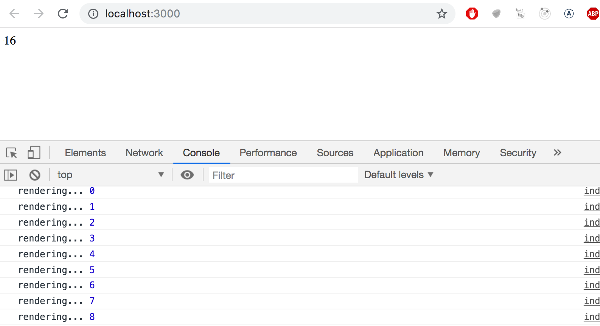
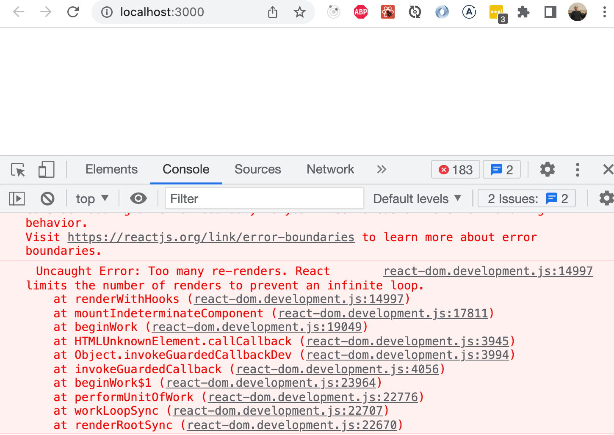
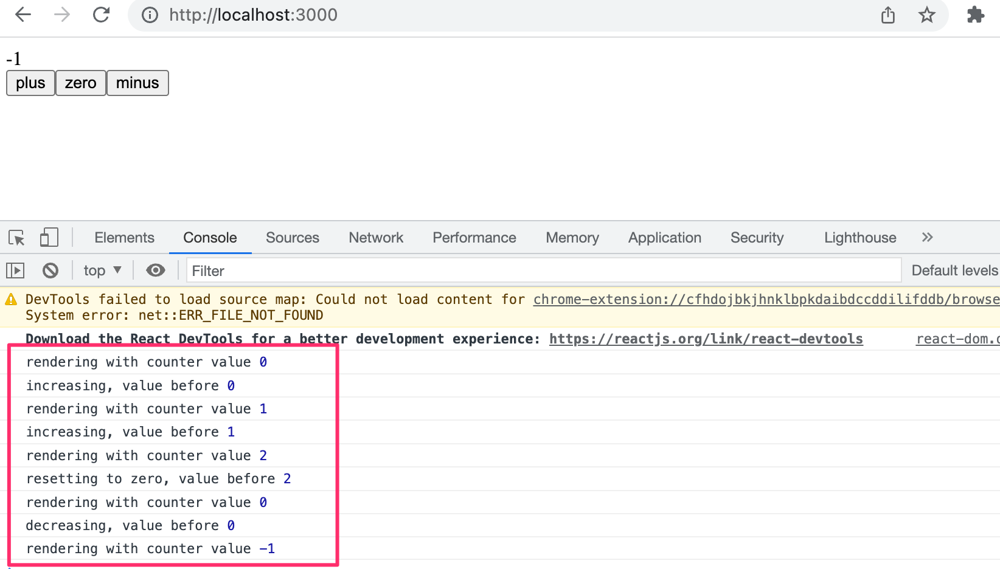

<div class="content">

دعونا نعود الآن إلى العمل مع React.

سنبدأ بمثال جديد:

```js
const Hello = (props) => {
  return (
    <div>
      <p>
        Hello {props.name}, you are {props.age} years old
      </p>
    </div>
  )
}

const App = () => {
  const name = 'Peter'
  const age = 10

  return (
    <div>
      <h1>Greetings</h1>
      <Hello name="Maya" age={26 + 10} />
      <Hello name={name} age={age} />
    </div>
  )
}
```

### دوال المكوّن المساعدة (Component helper functions)

دعونا نوسع مكوّننا <i>Hello</i> بحيث يخمن سنة ميلاد الشخص الذي يتم الترحيب به:

```js
const Hello = (props) => {
  // highlight-start
  const bornYear = () => {
    const yearNow = new Date().getFullYear()
    return yearNow - props.age
  }
  // highlight-end

  return (
    <div>
      <p>
        Hello {props.name}, you are {props.age} years old
      </p>
      <p>So you were probably born in {bornYear()}</p> // highlight-line
    </div>
  )
}
```

تم تضمين منطق تخمين سنة الميلاد وتغليفه داخل دالة خاصة به، ويتم استدعاؤها عند تصيير (Rendering) المكوّن.

لا يلزم تمرير عمر الشخص كمعامل صريح إلى هذه الدالة لأن الدالة يمكنها الوصول مباشرة إلى جميع الخصائص (props) المقدمة للمكوّن.

إذا فحصنا الكود الحالي، نلاحظ أن الدالة المساعدة معرفة داخل دالة أخرى تحدد سلوك المكوّن. في البرمجة بلغة Java، يمكن أن يكون تعريف دالة داخل دالة أخرى معقداً وغير شائع. ومع ذلك، في JavaScript، يُعد تعريف الدوال داخل الدوال ممارسة شائعة وفعالة للغاية.

### تفكيك الكائنات (Destructuring)

قبل أن نمضي قدماً، سنلقي نظرة على ميزة صغيرة ولكنها مفيدة للغاية في لغة JavaScript تمت إضافتها في مواصفات ES6، وتسمح لنا بـ [تفكيك (Destructure)](https://developer.mozilla.org/en-US/docs/Web/JavaScript/Reference/Operators/Destructuring_assignment) القيم من الكائنات والمصفوفات عند الإسناد.

في الكود السابق، كان علينا الإشارة إلى البيانات الممررة إلى المكوّن بصيغة _props.name_ و _props.age_. ومن بين هذين التعبيرين، كان علينا تكرار _props.age_ مرتين في الكود.

نظراً لأن <i>props</i> هو كائن:

```js
props = {
  name: 'Arto Hellas',
  age: 35,
}
```

فيمكننا تبسيط وتنظيم المكوّن الخاص بنا عن طريق إسناد قيم الخصائص مباشرة إلى متغيرين هما _name_ و _age_ واللذين يمكننا استخدامهما بعد ذلك في الكود:

```js
const Hello = (props) => {
  // highlight-start
  const name = props.name
  const age = props.age
  // highlight-end

  const bornYear = () => new Date().getFullYear() - age // highlight-line

  return (
    <div>
      <p>Hello {name}, you are {age} years old</p> // highlight-line
      <p>So you were probably born in {bornYear()}</p>
    </div>
  )
}
```

لاحظ أننا استخدمنا أيضاً الصيغة الأكثر إيجازاً للدوال السهمية عند تعريف الدالة _bornYear_. وكما ذكرنا سابقاً، إذا كانت الدالة السهمية تتكون من تعبير واحد فقط، فلا حاجة لكتابة جسم الدالة داخل أقواس معقوفة. في هذا الشكل الأكثر إيجازاً، تُرجع الدالة ببساطة نتيجة ذلك التعبير الوحيد.

للتذكير، فإن تعريفي الدالة الموضحين أدناه متكافئان تماماً:

```js
const bornYear = () => new Date().getFullYear() - age

const bornYear = () => {
  return new Date().getFullYear() - age
}
```

يجعل تفكيك الكائنات (Destructuring) إسناد المتغيرات أكثر سهولة، حيث يمكننا استخدامه لاستخراج وجمع قيم خصائص الكائن في متغيرات منفصلة:

```js
const Hello = (props) => {
    // highlight-start
  const { name, age } = props
    // highlight-end
  const bornYear = () => new Date().getFullYear() - age

  return (
    <div>
      <p>Hello {name}, you are {age} years old</p>
      <p>So you were probably born in {bornYear()}</p>
    </div>
  )
}
```

عندما يحتوي الكائن الذي نقوم بتفكيكه على القيم:

```js
props = {
  name: 'Arto Hellas',
  age: 35,
}
```

فإن التعبير <em>const { name, age } = props</em> يسند القيمة 'Arto Hellas' إلى _name_ والقيمة 35 إلى _age_.

يمكننا الذهاب بالتفكيك خطوة إلى الأمام:

```js
const Hello = ({ name, age }) => { // highlight-line
  const bornYear = () => new Date().getFullYear() - age

  return (
    <div>
      <p>
        Hello {name}, you are {age} years old
      </p>
      <p>So you were probably born in {bornYear()}</p>
    </div>
  )
}
```

الخصائص (props) التي يتم تمريرها إلى المكوّن يتم تفكيكها الآن مباشرة وبشكل فوري داخل المتغيرين _name_ و _age_.

هذا يعني أنه بدلاً من إسناد كائن props بأكمله إلى متغير يُدعى <i>props</i> ثم إسناد خصائصه إلى المتغيرين _name_ و _age_:

```js
const Hello = (props) => {
  const { name, age } = props
```

فإننا نسند قيم الخصائص مباشرة إلى المتغيرات عن طريق تفكيك كائن props الممرر إلى دالة المكوّن كمعامل:

```js
const Hello = ({ name, age }) => {
```

### إعادة تصيير الصفحة (Page re-rendering)

حتى هذه اللحظة، كانت تطبيقاتنا ثابتة (Static) - يظل مظهرها دون تغيير بعد التصيير الأولي. ولكن ماذا لو أردنا إنشاء عداد تزداد قيمته، إما بمرور الوقت أو عند النقر فوق زر؟

لنبدأ بما يلي. يصبح الملف <i>App.jsx</i>:

```js
const App = (props) => {
  const {counter} = props
  return (
    <div>{counter}</div>
  )
}

export default App
```

ويصبح الملف <i>main.jsx</i>:

```js
import ReactDOM from 'react-dom/client'

import App from './App'

let counter = 1

ReactDOM.createRoot(document.getElementById('root')).render(
  <App counter={counter} />
)
```

يتم إعطاء المكوّن App قيمة العداد عبر الخاصية _counter_. يقوم هذا المكوّن بتصيير القيمة على الشاشة. ماذا يحدث عندما تتغير قيمة _counter_؟ حتى لو أضفنا السطر التالي:

```js
counter += 1
```

فلن يُعاد تصيير المكوّن. يمكننا جعل المكوّن يُعاد تصييره عن طريق استدعاء دالة _render_ مرة ثانية، على سبيل المثال بالطريقة التالية:

```js
let counter = 1

const root = ReactDOM.createRoot(document.getElementById('root'))

const refresh = () => {
  root.render(
    <App counter={counter} />
  )
}

refresh()
counter += 1
refresh()
counter += 1
refresh()
```

تم تغليف أمر إعادة التصيير داخل دالة _refresh_ لتقليل تكرار الشيفرة المنسوخة.

الآن <i>يتم تصيير المكوّن ثلاث مرات</i>، أولاً بالقيمة 1، ثم 2، وأخيراً 3. ومع ذلك، يتم عرض القيمتين 1 و 2 على الشاشة لفترة قصيرة جداً لدرجة أنه لا يمكن ملاحظتهما بالعين المجردة.

يمكننا تنفيذ وظيفة أكثر إثارة للاهتمام عن طريق إعادة التصيير وزيادة العداد كل ثانية باستخدام [setInterval](https://developer.mozilla.org/en-US/docs/Web/API/WindowOrWorkerGlobalScope/setInterval):

```js
setInterval(() => {
  refresh()
  counter += 1
}, 1000)
```

إن إجراء استدعاءات متكررة لدالة _render_ ليس هو الطريقة الموصى بها لإعادة تصيير المكونات في React. بعد ذلك، سنقدم طريقة أفضل بكثير لتحقيق هذا التأثير.

### مكوّن ذو حالة (Stateful component)

كانت جميع مكوناتنا حتى الآن بسيطة بمعنى أنها لم تكن تحتوي على أي حالة (State) يمكن أن تتغير خلال دورة حياة المكوّن.

بعد ذلك، دعونا نضيف الحالة (State) إلى مكوّن <i>App</i> في تطبيقنا بمساعدة [خطاف الحالة (State Hook)](https://react.dev/learn/state-a-components-memory) الخاص بـ React.

سنقوم بتغيير التطبيق على النحو التالي. يعود <i>main.jsx</i> إلى:

```js
import ReactDOM from 'react-dom/client'

import App from './App'

ReactDOM.createRoot(document.getElementById('root')).render(<App />)
```

ويتغير <i>App.jsx</i> إلى ما يلي:

```js
import { useState } from 'react' // highlight-line

const App = () => {
  const [ counter, setCounter ] = useState(0) // highlight-line

// highlight-start
  setTimeout(
    () => setCounter(counter + 1),
    1000
  )
  // highlight-end

  return (
    <div>{counter}</div>
  )
}

export default App
```

في السطر الأول، يستورد الملف دالة _useState_:

```js
import { useState } from 'react'
```

يبدأ جسم الدالة التي تُعرّف المكوّن باستدعاء الدالة:

```js
const [ counter, setCounter ] = useState(0)
```

يضيف استدعاء الدالة *حالة (State)* إلى المكوّن ويقوم بتصييره مهيأً بالقيمة صفر. تُرجع الدالة مصفوفة تحتوي على عنصرين. نسند هذين العنصرين إلى المتغيرين _counter_ و _setCounter_ باستخدام صيغة تفكيك المصفوفات التي رأيناها سابقاً.

يتم إسناد القيمة الأولية لـ <i>الحالة (State)</i> إلى المتغير _counter_، وهي صفر. بينما يتم إسناد دالة إلى المتغير _setCounter_ والتي ستُستخدم لـ <i>تعديل الحالة</i>.

يستدعي التطبيق دالة [setTimeout](https://developer.mozilla.org/en-US/docs/Web/API/WindowOrWorkerGlobalScope/setTimeout) ويمرر إليها معاملين: دالة لزيادة حالة العداد ومؤقتاً زمنياً مدته ثانية واحدة:

```js
setTimeout(
  () => setCounter(counter + 1),
  1000
)
```

يتم استدعاء الدالة الممررة كمعامل أول إلى دالة _setTimeout_ بعد ثانية واحدة من استدعاء دالة _setTimeout_:

```js
() => setCounter(counter + 1)
```

عندما يتم استدعاء دالة تعديل الحالة _setCounter_، <i>تقوم React بإعادة تصيير المكوّن (Re-render)</i> مما يعني إعادة تنفيذ جسم دالة المكوّن بالكامل:

```js
() => {
  const [ counter, setCounter ] = useState(0)

  setTimeout(
    () => setCounter(counter + 1),
    1000
  )

  return (
    <div>{counter}</div>
  )
}
```

في المرة الثانية التي يتم فيها تنفيذ دالة المكوّن، تستدعي دالة _useState_ وتُرجع القيمة الجديدة للحالة: 1. كما أن إعادة تنفيذ جسم الدالة يؤدي أيضاً إلى إجراء استدعاء جديد لدالة _setTimeout_، والتي تنفذ مهلة الثانية الواحدة وتزيد حالة _counter_ مرة أخرى. ونظراً لأن قيمة المتغير _counter_ هي 1، فإن زيادة القيمة بمقدار 1 تعادل بشكل أساسي تعبيراً يضبط قيمة _counter_ على 2.

```js
() => setCounter(2)
```

في الوقت نفسه، يتم تصيير القيمة القديمة لـ _counter_ - "1" - على الشاشة.

في كل مرة تقوم فيها _setCounter_ بتعديل الحالة، فإنها تجعل المكوّن يُعاد تصييره. وستزداد قيمة الحالة مرة أخرى بعد ثانية واحدة، وسيستمر هذا التكرار طالما كان التطبيق قيد التشغيل.

إذا لم يتم تصيير المكوّن عندما تعتقد أنه ينبغي عليه ذلك، أو إذا تم تصييره في "الوقت الخطأ"، فيمكنك تصحيح أخطاء التطبيق عن طريق تسجيل قيم متغيرات المكوّن في منصة التحكم (console). إذا قمنا بإجراء الإضافات التالية على الكود:

```js
const App = () => {
  const [ counter, setCounter ] = useState(0)

  setTimeout(
    () => setCounter(counter + 1),
    1000
  )

  console.log('rendering...', counter) // highlight-line

  return (
    <div>{counter}</div>
  )
}
```

يصبح من السهل تتبع ومراقبة الاستدعاءات التي تتم لدالة التصيير الخاصة بالمكوّن <i>App</i>:



هل كانت منصة تحكم المتصفح لديك مفتوحة؟ إذا لم تكن كذلك، فاعدنا أن هذه كانت آخر مرة تحتاج فيها إلى التذكير بذلك.

### معالجة الأحداث (Event handling)

لقد ذكرنا بالفعل <i>معالجات الأحداث (Event Handlers)</i> المسجلة ليتم استدعاؤها عند وقوع أحداث معينة عدة مرات في [الجزء 0](/ar/part0). يمكن أن يؤدي تفاعل المستخدم مع العناصر المختلفة لصفحة الويب إلى إطلاق مجموعة من الأحداث المتنوعة.

دعونا نغير التطبيق بحيث تحدث زيادة العداد عندما ينقر المستخدم على زر، والذي يتم تنفيذه باستخدام عنصر [button](https://developer.mozilla.org/en-US/docs/Web/HTML/Element/button).

تدعم عناصر الأزرار ما يُعرف بـ [أحداث الفأرة (Mouse Events)](https://developer.mozilla.org/en-US/docs/Web/API/MouseEvent)، والتي يُعد حدث [النقر (Click)](https://developer.mozilla.org/en-US/docs/Web/Events/click) أكثرها شيوعاً. يمكن أيضاً إطلاق حدث النقر على الزر باستخدام لوحة المفاتيح أو شاشة اللمس على الرغم من تسميته <i>حدث الفأرة</i>.

في React، يتم [تسجيل دالة معالج الأحداث](https://react.dev/learn/responding-to-events) لحدث <i>click</i> على النحو التالي:

```js
const App = () => {
  const [ counter, setCounter ] = useState(0)

  // highlight-start
  const handleClick = () => {
    console.log('clicked')
  }
  // highlight-end

  return (
    <div>
      <div>{counter}</div>
      // highlight-start
      <button onClick={handleClick}>
        plus
      </button>
      // highlight-end
    </div>
  )
}
```

نقوم بضبط قيمة السمة <i>onClick</i> الخاصة بالزر لتكون مرجعاً للدالة _handleClick_ المُعرّفة في الكود.

الآن، تؤدي كل نقرة على زر <i>plus</i> إلى استدعاء دالة _handleClick_، مما يعني أن كل حدث نقر سيسجل رسالة <i>clicked</i> في منصة تحكم المتصفح.

يمكن أيضاً تعريف دالة معالج الحدث مباشرة داخل إسناد قيمة السمة onClick:

```js
const App = () => {
  const [ counter, setCounter ] = useState(0)

  return (
    <div>
      <div>{counter}</div>
      <button onClick={() => console.log('clicked')}> // highlight-line
        plus
      </button>
    </div>
  )
}
```

وعن طريق تغيير معالج الحدث إلى الشكل التالي:

```js
<button onClick={() => setCounter(counter + 1)}>
  plus
</button>
```

فإننا نحقق السلوك المطلوب، مما يعني زيادة قيمة _counter_ بمقدار واحد <i>وإعادة تصيير</i> المكوّن.

دعونا نضيف أيضاً زراً لإعادة ضبط العداد إلى الصفر:

```js
const App = () => {
  const [ counter, setCounter ] = useState(0)

  return (
    <div>
      <div>{counter}</div>
      <button onClick={() => setCounter(counter + 1)}>
        plus
      </button>
      // highlight-start
      <button onClick={() => setCounter(0)}> 
        zero
      </button>
      // highlight-end
    </div>
  )
}
```

تطبيقنا جاهز الآن!

### معالج الحدث هو دالة (An event handler is a function)

نقوم بتعريف معالجات الأحداث للأزرار الخاصة بنا حيث نعلن عن سمات <i>onClick</i> الخاصة بها:

```js
<button onClick={() => setCounter(counter + 1)}> 
  plus
</button>
```

ماذا لو حاولنا تعريف معالجات الأحداث بصيغة أبسط؟

```js
<button onClick={setCounter(counter + 1)}> 
  plus
</button>
```

هذا من شأنه أن يؤدي إلى تعطل تطبيقنا بالكامل:



ما الذي يحدث هنا؟ من المفترض أن يكون معالج الحدث إما <i>دالة</i> أو <i>مرجعاً لدالة</i>، وعندما نكتب:

```js
<button onClick={setCounter(counter + 1)}>
```

فإن معالج الحدث يكون في الواقع <i>استدعاءً للدالة</i>. في العديد من المواقف قد يكون هذا مقبولاً، ولكن ليس في هذا الموقف تحديداً. في البداية، تكون قيمة المتغير <i>counter</i> هي 0. عندما تقوم React بتصيير المكوّن للمرة الأولى، فإنها تنفذ استدعاء الدالة <em>setCounter(0+1)</em>، وتغير قيمة حالة المكوّن إلى 1.
سيؤدي هذا إلى إعادة تصيير المكوّن، وستقوم React بتنفيذ استدعاء دالة setCounter مرة أخرى، وستتغير الحالة مما يؤدي إلى إعادة تصيير أخرى وهكذا في حلقة مفرغة لا نهائية...

دعونا نُعرّف معالجات الأحداث كما فعلنا من قبل:

```js
<button onClick={() => setCounter(counter + 1)}> 
  plus
</button>
```

الآن تحتوي سمة الزر التي تحدد ما يحدث عند النقر على الزر - <i>onClick</i> - على القيمة _() => setCounter(counter + 1)_.
يتم استدعاء دالة setCounter فقط عندما ينقر المستخدم على الزر.

عادةً لا يُعد تعريف معالجات الأحداث مباشرة داخل قوالب JSX فكرة جيدة.
ولكن هنا يُعد الأمر مقبولاً نظراً لأن معالجات الأحداث لدينا بسيطة للغاية.

دعونا نفصل معالجات الأحداث إلى دوال مستقلة على أي حال:

```js
const App = () => {
  const [ counter, setCounter ] = useState(0)

// highlight-start
  const increaseByOne = () => setCounter(counter + 1)
  
  const setToZero = () => setCounter(0)
  // highlight-end

  return (
    <div>
      <div>{counter}</div>
      <button onClick={increaseByOne}> // highlight-line
        plus
      </button>
      <button onClick={setToZero}> // highlight-line
        zero
      </button>
    </div>
  )
}
```

هنا، تم تعريف معالجات الأحداث بشكل صحيح. قيمة السمة <i>onClick</i> هي متغير يحتوي على مرجع لدالة:

```js
<button onClick={increaseByOne}> 
  plus
</button>
```

### تمرير الحالة إلى المكونات الفرعية (Passing state - to child components)

يوصى بكتابة مكونات React بحيث تكون صغيرة وقابلة لإعادة الاستخدام عبر أجزاء التطبيق المختلفة وحتى عبر مشاريع متعددة. دعونا نعيد هيكلة تطبيقنا بحيث يتكون من ثلاثة مكونات أصغر: مكوّن واحد لعرض العداد ومكوّنان للأزرار.

لنقم أولاً بتنفيذ مكوّن <i>Display</i> المسؤول عن عرض قيمة العداد.

إحدى أفضل الممارسات المعتمدة في React هي [رفع الحالة للأعلى (Lifting state up)](https://react.dev/learn/sharing-state-between-components) في التسلسل الهرمي للمكونات. ينص التوثيق الرسمي على ما يلي:

> <i>غالباً ما تحتاج عدة مكونات إلى أن تعكس نفس البيانات المتغيرة. نوصي برفع الحالة المشتركة إلى أقرب سلف مشترك (Closest common ancestor) لها.</i>

لذا، دعونا نضع حالة التطبيق في المكوّن <i>App</i> ونمررها للأسفل إلى المكوّن <i>Display</i> عبر <i>الخصائص (props)</i>:

```js
const Display = (props) => {
  return (
    <div>{props.counter}</div>
  )
}
```

يُعد استخدام المكوّن أمراً بسيطاً ومباشراً، حيث نحتاج فقط إلى تمرير حالة _counter_ إليه:

```js
const App = () => {
  const [ counter, setCounter ] = useState(0)

  const increaseByOne = () => setCounter(counter + 1)
  const setToZero = () => setCounter(0)

  return (
    <div>
      <Display counter={counter}/> // highlight-line
      <button onClick={increaseByOne}>
        plus
      </button>
      <button onClick={setToZero}> 
        zero
      </button>
    </div>
  )
}
```

كل شيء لا يزال يعمل بكفاءة. عند النقر على الأزرار وإعادة تصيير المكوّن <i>App</i>، يُعاد تصيير جميع مكوناته الفرعية التابعة له بما في ذلك المكوّن <i>Display</i>.

بعد ذلك، لنقم بإنشاء مكوّن <i>Button</i> لأزرار تطبيقنا. يجب علينا تمرير معالج الحدث بالإضافة إلى عنوان الزر من خلال خصائص (props) المكوّن:

```js
const Button = (props) => {
  return (
    <button onClick={props.onClick}>
      {props.text}
    </button>
  )
}
```

يبدو المكوّن <i>App</i> الخاص بنا الآن هكذا:

```js
const App = () => {
  const [ counter, setCounter ] = useState(0)

  const increaseByOne = () => setCounter(counter + 1)
  //highlight-start
  const decreaseByOne = () => setCounter(counter - 1)
  //highlight-end
  const setToZero = () => setCounter(0)

  return (
    <div>
      <Display counter={counter}/>
      // highlight-start
      <Button
        onClick={increaseByOne}
        text='plus'
      />
      <Button
        onClick={setToZero}
        text='zero'
      />     
      <Button
        onClick={decreaseByOne}
        text='minus'
      />           
      // highlight-end
    </div>
  )
}
```

نظراً لأن لدينا الآن مكوّن <i>Button</i> قابلاً لإعادة الاستخدام بسهولة، فقد قمنا أيضاً بتنفيذ وظيفة جديدة في تطبيقنا عن طريق إضافة زر يمكن استخدامه لإنقاص العداد.

يتم تمرير معالج الحدث إلى المكوّن <i>Button</i> عبر الخاصية _onClick_. عند إنشاء مكوناتك الخاصة، يمكنك نظرياً اختيار اسم الخاصية بحرية. ومع ذلك، فإن اختيارنا لاسم معالج الحدث لم يكن عشوائياً تماماً.

يقترح [الدليل التعليمي الرسمي](https://react.dev/learn/tutorial-tic-tac-toe) لـ React:
"في React، من المعتاد استخدام أسماء تبدأ بـ _onSomething_ للخصائص (props) التي تأخذ دوال تعالج الأحداث، واستخدام _handleSomething_ لتعريفات الدوال الفعلية التي تتولى معالجة تلك الأحداث."

### التغييرات في الحالة تُسبب إعادة التصيير (Changes in state cause re-rendering)

دعونا نستعرض المبادئ الأساسية لكيفية عمل التطبيق مرة أخرى.

عند بدء تشغيل التطبيق، يتم تنفيذ الكود الموجود في _App_. يستخدم هذا الكود خطاف [useState](https://react.dev/reference/react/useState) لإنشاء حالة التطبيق، مع تعيين قيمة أولية للمتغير _counter_.
يحتوي هذا المكوّن على المكوّن _Display_ - الذي يعرض قيمة العداد، 0 - وثلاثة مكونات _Button_. تحتوي جميع الأزرار على معالجات أحداث تُستخدم لتغيير حالة العداد.

عند النقر فوق أحد الأزرار، يتم تنفيذ معالج الحدث. يقوم معالج الحدث بتغيير حالة المكوّن _App_ باستخدام دالة _setCounter_.
**يؤدي استدعاء دالة تُغير الحالة إلى إعادة تصيير المكوّن.**

وبالتالي، إذا نقر المستخدم على زر <i>plus</i>، يغير معالج حدث الزر قيمة _counter_ إلى 1، ويُعاد تصيير المكوّن _App_.
يتسبب هذا في إعادة تصيير مكوناته الفرعية _Display_ و _Button_ أيضاً.
يستقبل _Display_ القيمة الجديدة للعداد، 1، كخصائص (props). وتستقبل مكونات _Button_ معالجات الأحداث التي يمكن استخدامها لتغيير حالة العداد.

للتأكد من فهم كيفية عمل البرنامج، دعونا نضيف بعض جمل _console.log_ إليه:

```js
const App = () => {
  const [counter, setCounter] = useState(0)
  console.log('rendering with counter value', counter) // highlight-line

  const increaseByOne = () => {
    console.log('increasing, value before', counter) // highlight-line
    setCounter(counter + 1)
  }

  const decreaseByOne = () => { 
    console.log('decreasing, value before', counter) // highlight-line
    setCounter(counter - 1)
  }

  const setToZero = () => {
    console.log('resetting to zero, value before', counter) // highlight-line
    setCounter(0)
  }

  return (
    <div>
      <Display counter={counter} />
      <Button onClick={increaseByOne} text="plus" />
      <Button onClick={setToZero} text="zero" />
      <Button onClick={decreaseByOne} text="minus" />
    </div>
  )
} 
```

دعونا نرى الآن ما تتم طباعته في منصة التحكم عند الضغط على الأزرار plus و zero و minus:



إياك أن تحاول تخمين ما يفعله الكود الخاص بك. من الأفضل دائماً استخدام _console.log_ و<i>أن ترى بأم عينيك</i> ما يقوم به الكود بالضبط.

### إعادة هيكلة المكونات (Refactoring the components)

المكوّن الذي يعرض قيمة العداد هو كالتالي:

```js
const Display = (props) => {
  return (
    <div>{props.counter}</div>
  )
}
```

يستخدم المكوّن فقط حقل _counter_ من كائن <i>props</i> الخاص به.
هذا يعني أنه يمكننا تبسيط المكوّن باستخدام [تفكيك الكائنات (Destructuring)](/ar/part1/component_state_event_handlers#destructuring)، على النحو التالي:

```js
const Display = ({ counter }) => {
  return (
    <div>{counter}</div>
  )
}
```

تحتوي الدالة التي تُعرّف المكوّن على جملة return فقط، لذا يمكننا تعريف الدالة باستخدام الصيغة الأكثر إيجازاً للدوال السهمية:

```js
const Display = ({ counter }) => <div>{counter}</div>
```

يمكننا تبسيط مكوّن Button أيضاً:

```js
const Button = (props) => {
  return (
    <button onClick={props.onClick}>
      {props.text}
    </button>
  )
}
```

يمكننا استخدام التفكيك للحصول على الحقول المطلوبة فقط من <i>props</i>، واستخدام الصيغة الأكثر إيجازاً للدوال السهمية:

```js
const Button = ({ onClick, text }) => <button onClick={onClick}>{text}</button>
```

يعمل هذا الأسلوب لأن المكوّن يحتوي على جملة return واحدة فقط، مما يجعل من الممكن استخدام صيغة الدالة السهمية المختصرة.

</div>
