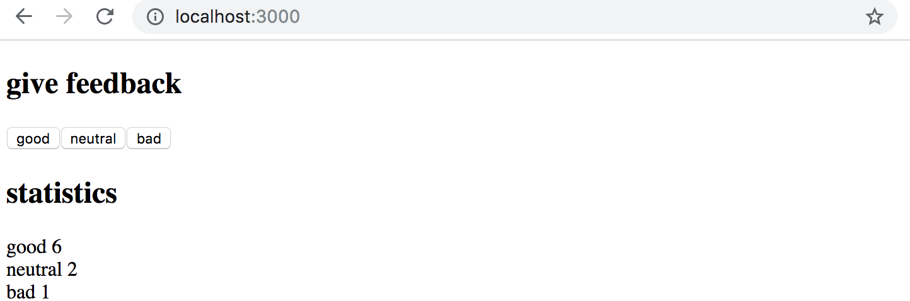
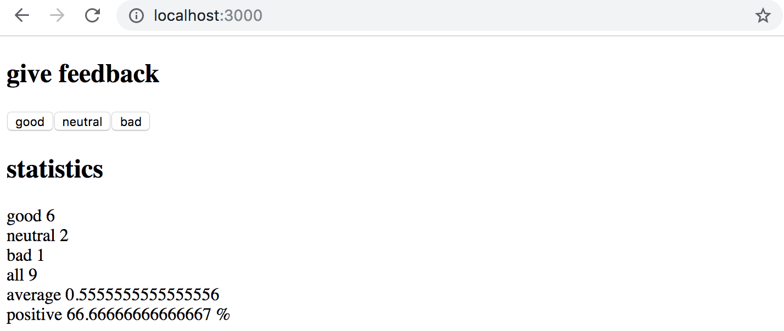
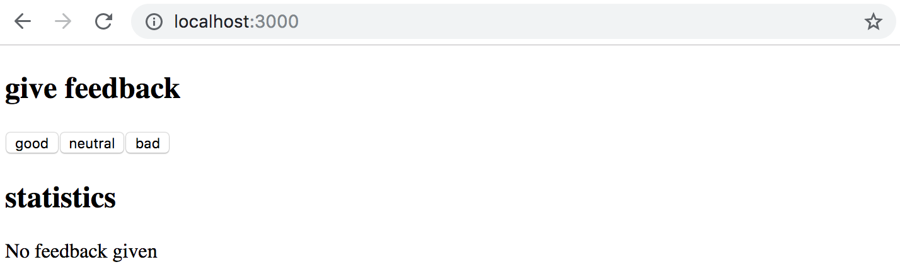
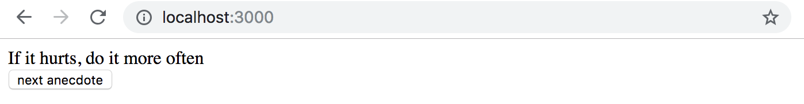
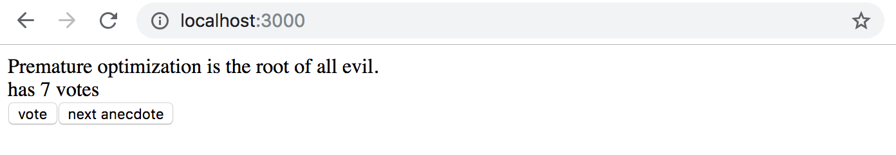
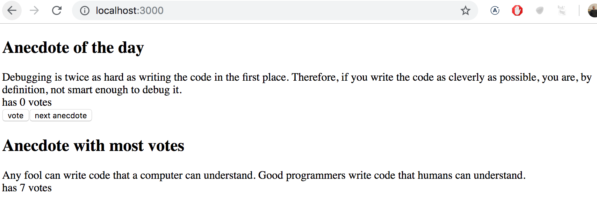

<div class="content">

### الحالة المعقدة (Complex state)

في الأمثلة السابقة، كانت حالة التطبيق بسيطة وتتألف من رقم واحد. ولكن ماذا لو تطلب تطبيقنا حالة أكثر تعقيداً؟

في أغلب الحالات، الطريقة الأسهل والأفضل هي استدعاء دالة `useState` عدة مرات لإنشاء قطع منفصلة من الحالة:

```js
const App = () => {
  const [left, setLeft] = useState(0)
  const [right, setRight] = useState(0)

  return (
    <div>
      {left}
      <button onClick={() => setLeft(left + 1)}>
        left
      </button>
      <button onClick={() => setRight(right + 1)}>
        right
      </button>
      {right}
    </div>
  )
}
```

يمكن أيضاً تخزين حالة العدادين داخل كائن واحد:

```js
const App = () => {
  const [clicks, setClicks] = useState({
    left: 0, right: 0
  })

  const handleLeftClick = () => {
    const newClicks = { 
      left: clicks.left + 1, 
      right: clicks.right 
    }
    setClicks(newClicks)
  }

  const handleRightClick = () => {
    const newClicks = { 
      left: clicks.left, 
      right: clicks.right + 1 
    }
    setClicks(newClicks)
  }

  return (
    <div>
      {clicks.left}
      <button onClick={handleLeftClick}>left</button>
      <button onClick={handleRightClick}>right</button>
      {clicks.right}
    </div>
  )
}
```

يمكننا كتابة كائن الحالة الجديد بشكل أكثر أناقة واختصاراً باستخدام **معامل النشر للكائنات ([Object spread](https://developer.mozilla.org/en-US/docs/Web/JavaScript/Reference/Operators/Spread_syntax))**:

```js
const handleLeftClick = () => {
  const newClicks = { 
    ...clicks, 
    left: clicks.left + 1 
  }
  setClicks(newClicks)
}

const handleRightClick = () => {
  const newClicks = { 
    ...clicks, 
    right: clicks.right + 1 
  }
  setClicks(newClicks)
}
```

يقوم التعبير `{ ...clicks }` بإنشاء كائن جديد يحتوي على نسخ من كافة خصائص الكائن `clicks`. وعند تحديد خاصية معينة، مثل `left: clicks.left + 1`، يتم تعديل قيمة هذه الخاصية المحددة في الكائن الجديد.

> **تحذير بالغ الأهمية**: *يُحظر في React تعديل الحالة بشكل مباشر (مثل `clicks.left++`)*؛ لأن ذلك يسبب أعطالاً خفية في دورة حياة المكونات وتحديث الواجهة. يجب أن يتم تحديث الحالة دائماً بإنشاء كائن أو مصفوفة جديدة.

---

### التعامل مع المصفوفات في الحالة (Handling arrays)

لنضف مصفوفة `allClicks` لتسجيل تاريخ كل نقرة زر:

```js
const App = () => {
  const [left, setLeft] = useState(0)
  const [right, setRight] = useState(0)
  const [allClicks, setAll] = useState([])

  const handleLeftClick = () => {
    setAll(allClicks.concat('L'))
    setLeft(left + 1)
  }

  const handleRightClick = () => {
    setAll(allClicks.concat('R'))
    setRight(right + 1)
  }

  return (
    <div>
      {left}
      <button onClick={handleLeftClick}>left</button>
      <button onClick={handleRightClick}>right</button>
      {right}
      <p>{allClicks.join(' ')}</p>
    </div>
  )
}
```

استخدمنا دالة `concat` لإضافة عنصر إلى المصفوفة لأنها تُرجع مصفوفة جديدة كلياً ولا تُعدل المصفوفة الأصلية مباشرة.

---

### تحديث الحالة يتم بشكل غير متزامن (Update of the state is asynchronous)

تحديث الحالة في React يحدث بشكل **غير متزامن ([Asynchronously](https://react.dev/learn/queueing-a-series-of-state-updates))**؛ أي أن القيمة الجديدة لا تظهر فوراً في السطر التالي لاستدعاء دالة التحديث، بل تتم جدولتها وتطبيقها قبل إعادة تصيير المكون.

إذا أردنا حساب إجمالي عدد النقرات:

```js
const handleLeftClick = () => {
  setAll(allClicks.concat('L'))
  const updatedLeft = left + 1
  setLeft(updatedLeft)
  setTotal(updatedLeft + right) 
}
```

---

### التصيير الشرطي (Conditional rendering)

يمكن للمكون أن يُصيّر عناصر واجهة مختلفة كلياً وفقاً لشرط معين:

```js
const History = (props) => {
  if (props.allClicks.length === 0) {
    return (
      <div>
        the app is used by pressing the buttons
      </div>
    )
  }

  return (
    <div>
      button press history: {props.allClicks.join(' ')}
    </div>
  )
}
```

---

### قواعد خطافات React (Rules of Hooks)

لاستخدام الخطافات بشكل سليم وفق [المعايير الرسمية](https://react.dev/warnings/invalid-hook-call-warning#breaking-rules-of-hooks):
1. **لا تستدعِ الخطافات داخل حلقات التكرار (Loops) أو الشروط (if statements) أو الدوال المتداخلة**.
2. **استدعِ الخطافات دائماً في المستوى الأعلى لدالة مكون React فقط**.

```js
const App = () => {
  // صحيح
  const [age, setAge] = useState(0)
  const [name, setName] = useState('Juha Tauriainen')

  if (age > 10) {
    // غير مسموح وخاطئ!
    const [foobar, setFoobar] = useState(null)
  }
}
```

---

### تصحيح واكتشاف الأخطاء (Debugging React applications)

يقضي المطور جزءاً كبيراً من وقته في قراءة الأكواد واستكشاف الأخطاء وتصحيحها.

- **أبقِ وحدة التحكم مفتوحة دائماً**.
- استخدم `console.log('props is', props)` بدلاً من دمج الكائنات بالنصوص (`'props ' + props`).
- استخدم إضافة [React Developer Tools](https://chrome.google.com/webstore/detail/react-developer-tools/fmkadmapgofadopljbjfkapdkoienihi) لفحص شجرة المكونات وقيم الـ State والـ Props.
- استخدم أمر `debugger;` أو نقاط التوقف (Breakpoints) في تبويب *Sources* لإيقاف تنفيذ الكود سطر بسطر.

---

### الاستفادة المسؤولة من نماذج الذكاء الاصطناعي (Large Language Models / Copilot)

توفر أدوات الذكاء الاصطناعي مثل ChatGPT و Claude و GitHub Copilot دعماً كبيراً في تسريع كتابة الأكواد واقتراح الحلول وتفسير الأخطاء.

إلا أن المبرمج يظل هو المسؤول الأول والوحيد عن جودة الشيفرة وأمانها وصحتها. وتذكر دائماً مقولة برايان كيرنيغان (*Brian Kernighan*):
> *"تصحيح الأخطاء (Debugging) أصعب بمرتين من كتابة الكود لأول مرة. لذا إذا كتبت الكود بأقصى درجات الذكاء والحيل الممكنة، فلن تكون ذكياً بما يكفي لتصحيحه"*

---

### قسم مبرمج الويب (Web Programmer's Oath)

- سأبقي وحدة تحكم المتصفح (Console) مفتوحة في جميع الأوقات.
- سأتقدم في بناء الكود بخطوات صغيرة ومدروسة متأكداً من سلامة كل خطوة.
- سأستخدم `console.log` باستمرار لفهم سلوك الكود وتتبع البيانات.
- إذا لم يعمل الكود، فلن أكتب مزيداً من الأكواد على أمل حدوث معجزة، بل سأعود إلى الحالة السابقة التي كانت تعمل.
- عند طلب المساعدة، سأصيغ سؤالي بدقة ووضوح مع إرفاق الكود والخطأ والمخرجات.

</div>

<div class="tasks">

<h3>التمارين 1.6 - 1.14</h3>

تُسلّم التمارين عبر رفعها على مستودع GitHub وتأكيد الإنجاز في نظام التسليم.

<h4>1.6: مطعم يونيكافيه - الخطوة 1 (unicafe step 1)</h4>

اجمع آراء العملاء حول الخدمة في تطبيق بثلاثة خيارات: **جيد (good)**، **محايد (neutral)**، و **سيئ (bad)**، مع عرض إجمالي الأصوات لكل فئة.

```js
import { useState } from 'react'

const App = () => {
  const [good, setGood] = useState(0)
  const [neutral, setNeutral] = useState(0)
  const [bad, setBad] = useState(0)

  return (
    <div>
      <h1>give feedback</h1>
      <button onClick={() => setGood(good + 1)}>good</button>
      <button onClick={() => setNeutral(neutral + 1)}>neutral</button>
      <button onClick={() => setBad(bad + 1)}>bad</button>

      <h2>statistics</h2>
      <p>good {good}</p>
      <p>neutral {neutral}</p>
      <p>bad {bad}</p>
    </div>
  )
}

export default App
```



<h4>1.7: مطعم يونيكافيه - الخطوة 2 (unicafe step 2)</h4>

قم بتوسيع التطبيق لحساب الإحصائيات الإضافية:
- إجمالي عدد التقييمات (all).
- متوسط الدرجة (average): (good = 1, neutral = 0, bad = -1) مقسوماً على الإجمالي.
- النسبة الإيجابية (positive percentage).



<h4>1.8: مطعم يونيكافيه - الخطوة 3 (unicafe step 3)</h4>

افصل عرض الإحصائيات في مكون مستقل باسم `Statistics` مع إبقاء الحالة في المكون الرئيسي `App`.

<h4>1.9: مطعم يونيكافيه - الخطوة 4 (unicafe step 4)</h4>

استخدم **التصيير الشرطي** لعرض عبارة "No feedback given" في حال لم يتم تسجيل أي تقييم بعد.



<h4>1.10: مطعم يونيكافيه - الخطوة 5 (unicafe step 5)</h4>

استخرج مكونين فرعيين:
- `Button`: لتمثيل زر التقييم.
- `StatisticLine`: لعرض سطر إحصائي واحد (نص وقيمة).

<h4>1.11*: مطعم يونيكافيه - الخطوة 6 (unicafe step 6)</h4>

اعرض الإحصائيات داخل جدول HTML (`<table>`, `<tbody>`, `<tr>`, `<td>`) مع التأكد من عدم وجود أي تحذيرات في الكونسول.


<h4>1.12*: طرائف برمجية - الخطوة 1 (anecdotes step 1)</h4>

أنشئ تطبيقاً يعرض مقولة برمجية عشوائية من مصفوفة الاقتباسات عند النقر على زر:

```js
import { useState } from 'react'

const App = () => {
  const anecdotes = [
    'If it hurts, do it more often.',
    'Adding manpower to a late software project makes it later!',
    'The first 90 percent of the code accounts for the first 90 percent of the development time...The remaining 10 percent of the code accounts for the other 90 percent of the development time.',
    'Any fool can write code that a computer can understand. Good programmers write code that humans can understand.',
    'Premature optimization is the root of all evil.',
    'Debugging is twice as hard as writing the code in the first place. Therefore, if you write the code as cleverly as possible, you are, by definition, not smart enough to debug it.',
    'Programming without an extremely heavy use of console.log is same as if a doctor would refuse to use x-rays or blood tests when diagnosing patients.',
    'The only way to go fast, is to go well.'
  ]
   
  const [selected, setSelected] = useState(0)

  return (
    <div>
      {anecdotes[selected]}
    </div>
  )
}

export default App
```



<h4>1.13*: طرائف برمجية - الخطوة 2 (anecdotes step 2)</h4>

أضف إمكانية التصويت لكل مقولة وتخزين الأصوات في مصفوفة حالة.



<h4>1.14*: طرائف برمجية - الخطوة 3 (anecdotes step 3)</h4>

اعرض المقولة التي حصلت على أعلى عدد من الأصوات أسفل الصفحة مع عدد أصواتها.



</div>
