<div class="content">

### الحالة المعقدة (Complex state)

في مثالنا السابق، كانت حالة التطبيق بسيطة حيث كانت تتألف من عدد صحيح واحد. ولكن ماذا لو تطلب تطبيقنا حالة أكثر تعقيداً؟

في معظم الحالات، أسهل وأفضل طريقة لتحقيق ذلك هي استخدام دالة _useState_ عدة مرات لإنشاء "أجزاء" منفصلة من الحالة.

في الكود التالي، ننشئ جزأين من الحالة للتطبيق باسم _left_ و _right_ ويحصل كلاهما على القيمة الأولية 0:

```js
const App = () => {
  const [left, setLeft] = useState(0)
  const [right, setRight] = useState(0)

  return (
    <div>
      {left}
      <button onClick={() => setLeft(left + 1)}>
        left
      </button>
      <button onClick={() => setRight(right + 1)}>
        right
      </button>
      {right}
    </div>
  )
}
```

يحصل المكوّن على إمكانية الوصول إلى الدالتين _setLeft_ و _setRight_ اللتين يمكنه استخدامهما لتحديث جزأي الحالة بشكل مستقل.

يمكن أن تكون حالة المكوّن أو أي جزء منها من أي نوع من أنواع البيانات. كان بإمكاننا تنفيذ نفس الوظيفة عن طريق حفظ عدد نقرات زري <i>left</i> و <i>right</i> داخل كائن واحد:

```js
{
  left: 0,
  right: 0
}
```

في هذه الحالة، سيبدو التطبيق كما يلي:

```js
const App = () => {
  const [clicks, setClicks] = useState({
    left: 0, right: 0
  })

  const handleLeftClick = () => {
    const newClicks = { 
      left: clicks.left + 1, 
      right: clicks.right 
    }
    setClicks(newClicks)
  }

  const handleRightClick = () => {
    const newClicks = { 
      left: clicks.left, 
      right: clicks.right + 1 
    }
    setClicks(newClicks)
  }

  return (
    <div>
      {clicks.left}
      <button onClick={handleLeftClick}>left</button>
      <button onClick={handleRightClick}>right</button>
      {clicks.right}
    </div>
  )
}
```

الآن يحتوي المكوّن على جزء واحد فقط من الحالة، ويجب على معالجات الأحداث الاهتمام بتغيير <i>حالة التطبيق بأكملها</i>.

يبدو معالج الأحداث غير مرتب بعض الشيء. فعند النقر على الزر الأيسر، يتم استدعاء الدالة التالية:

```js
const handleLeftClick = () => {
  const newClicks = { 
    left: clicks.left + 1, 
    right: clicks.right 
  }
  setClicks(newClicks)
}
```

ويتم تعيين الكائن التالي كحالة جديدة للتطبيق:

```js
{
  left: clicks.left + 1,
  right: clicks.right
}
```

أصبحت القيمة الجديدة للخاصية <i>left</i> مساوية لقيمة <i>left + 1</i> من الحالة السابقة، وقيمة الخاصية <i>right</i> هي نفس قيمة الخاصية <i>right</i> من الحالة السابقة.

يمكننا تعريف كائن الحالة الجديد بشكل أكثر أناقة وتنظيماً باستخدام صيغة [نشر الكائنات (Object Spread)](https://developer.mozilla.org/en-US/docs/Web/JavaScript/Reference/Operators/Spread_syntax) التي تمت إضافتها إلى مواصفات اللغة في صيف 2018:

```js
const handleLeftClick = () => {
  const newClicks = { 
    ...clicks, 
    left: clicks.left + 1 
  }
  setClicks(newClicks)
}

const handleRightClick = () => {
  const newClicks = { 
    ...clicks, 
    right: clicks.right + 1 
  }
  setClicks(newClicks)
}
```

قد تبدو هذه الصيغة غريبة بعض الشيء في البداية. من الناحية العملية، يُنشئ <em>{ ...clicks }</em> كائناً جديداً يحتوي على نسخ من جميع خصائص كائن _clicks_. وعندما نحدد خاصية معينة - مثل <i>right</i> في <em>{ ...clicks, right: 1 }</em>، فستكون قيمة الخاصية _right_ في الكائن الجديد هي 1.

في المثال أعلاه، التعبير التالي:

```js
{ ...clicks, right: clicks.right + 1 }
```

يُنشئ نسخة من كائن _clicks_ مع زيادة قيمة الخاصية _right_ بمقدار واحد.

إن إسناد الكائن إلى متغير وسيط داخل معالجات الأحداث ليس ضرورياً، ويمكننا تبسيط الدوال إلى الشكل التالي:

```js
const handleLeftClick = () =>
  setClicks({ ...clicks, left: clicks.left + 1 })

const handleRightClick = () =>
  setClicks({ ...clicks, right: clicks.right + 1 })
```

قد يتساءل بعض القراء عن سبب عدم قيامنا بتحديث الحالة مباشرة هكذا:

```js
const handleLeftClick = () => {
  clicks.left++
  setClicks(clicks)
}
```

يبدو أن التطبيق يعمل ظاهرياً. ومع ذلك، <i>يُحظر تماماً في React تعديل الحالة (Mutate State) بشكل مباشر</i>، لأن [ذلك يمكن أن يؤدي إلى آثار جانبية غير متوقعة وسلوكيات خاطئة](https://stackoverflow.com/a/40309023). يجب أن يتم تغيير الحالة دائماً عن طريق ضبط الحالة على كائن جديد تماماً. وإذا كانت هناك خصائص من كائن الحالة السابق لم تتغير، فيجب نسخها ببساطة، ويتم ذلك عن طريق نسخ تلك الخصائص داخل كائن جديد وتعيينه كحالة جديدة.

يُعد تخزين كل الحالة في كائن حالة واحد خياراً غير مناسب لهذا التطبيق تحديداً؛ فليس هناك فائدة واضحة والتطبيق الناتج أكثر تعقيداً دون مبرر. في هذه الحالة، يُعد تخزين عدادات النقرات في أجزاء منفصلة من الحالة خياراً أكثر ملاءمة بكثير.

هناك مواقف يكون فيها من المفيد تخزين جزء من حالة التطبيق في هيكل بيانات أكثر تعقيداً. يحتوي [توثيق React الرسمي](https://react.dev/learn/choosing-the-state-structure) على بعض الإرشادات المفيدة حول هذا الموضوع.

### التعامل مع المصفوفات (Handling arrays)

دعونا نضيف جزءاً من الحالة إلى تطبيقنا يحتوي على مصفوفة _allClicks_ لتسجيل وتذكر كل نقرة حدثت في التطبيق.

```js
const App = () => {
  const [left, setLeft] = useState(0)
  const [right, setRight] = useState(0)
  const [allClicks, setAll] = useState([]) // highlight-line

// highlight-start
  const handleLeftClick = () => {
    setAll(allClicks.concat('L'))
    setLeft(left + 1)
  }
// highlight-end  

// highlight-start
  const handleRightClick = () => {
    setAll(allClicks.concat('R'))
    setRight(right + 1)
  }
// highlight-end  

  return (
    <div>
      {left}
      <button onClick={handleLeftClick}>left</button>
      <button onClick={handleRightClick}>right</button>
      {right}
      <p>{allClicks.join(' ')}</p> // highlight-line
    </div>
  )
}
```

يتم تخزين كل نقرة في جزء منفصل من الحالة يسمى _allClicks_ وتهيئته كمصفوفة فارغة:

```js
const [allClicks, setAll] = useState([])
```

عند النقر على الزر <i>left</i>، نضيف الحرف <i>L</i> إلى مصفوفة _allClicks_:

```js
const handleLeftClick = () => {
  setAll(allClicks.concat('L'))
  setLeft(left + 1)
}
```

يتم الآن ضبط جزء الحالة المخزن في _allClicks_ ليكون مصفوفة تحتوي على جميع عناصر مصفوفة الحالة السابقة بالإضافة إلى الحرف <i>L</i>. وتتم إضافة العنصر الجديد إلى المصفوفة باستخدام دالة [concat](https://developer.mozilla.org/en-US/docs/Web/JavaScript/Reference/Global_Objects/Array/concat)، والتي لا تعدل المصفوفة الموجودة بل تُرجع <i>نسخة جديدة من المصفوفة</i> بعد إضافة العنصر إليها.

كما ذكرنا سابقاً، من الممكن أيضاً في JavaScript إضافة عناصر إلى مصفوفة باستخدام دالة [push](https://developer.mozilla.org/en-US/docs/Web/JavaScript/Reference/Global_Objects/Array/push). وإذا أضفنا العنصر عن طريق دفعه إلى مصفوفة _allClicks_ ثم قمنا بتحديث الحالة، فسيظل التطبيق يعمل ظاهرياً:

```js
const handleLeftClick = () => {
  allClicks.push('L')
  setAll(allClicks)
  setLeft(left + 1)
}
```

ومع ذلك، **لا تفعل** هذا على الإطلاق. فكما ذكرنا سابقاً، يجب عدم تعديل حالة مكونات React، مثل _allClicks_، بشكل مباشر أبداً. وحتى لو بدا أن تعديل الحالة المباشر يعمل في بعض الحالات، فإنه قد يؤدي إلى مشكلات برمجية معقدة للغاية ويصعب تصحيحها واكتشافها.

دعونا نلقي نظرة فاحصة على كيفية تصيير النقرات في الصفحة:

```js
const App = () => {
  // ...

  return (
    <div>
      {left}
      <button onClick={handleLeftClick}>left</button>
      <button onClick={handleRightClick}>right</button>
      {right}
      <p>{allClicks.join(' ')}</p> // highlight-line
    </div>
  )
}
```

نستدعي دالة [join](https://developer.mozilla.org/en-US/docs/Web/JavaScript/Reference/Global_Objects/Array/join) على مصفوفة _allClicks_، والتي تدمج جميع العناصر في سلسلة نصية واحدة، مفصولة بالسلسلة الممررة كمعامل للدالة، وهي في حالتنا مسافة فارغة.

### تحديث الحالة غير متزامن (Update of the state is asynchronous)

دعونا نوسع التطبيق بحيث يتتبع إجمالي عدد مرات الضغط على الأزرار في الحالة _total_، والتي يتم تحديث قيمتها دائماً عند الضغط على الأزرار:

```js
const App = () => {
  const [left, setLeft] = useState(0)
  const [right, setRight] = useState(0)
  const [allClicks, setAll] = useState([])
  const [total, setTotal] = useState(0) // highlight-line

  const handleLeftClick = () => {
    setAll(allClicks.concat('L'))
    setLeft(left + 1)
    setTotal(left + right)  // highlight-line
  }

  const handleRightClick = () => {
    setAll(allClicks.concat('R'))
    setRight(right + 1)
    setTotal(left + right)  // highlight-line
  }

  return (
    <div>
      {left}
      <button onClick={handleLeftClick}>left</button>
      <button onClick={handleRightClick}>right</button>
      {right}
      <p>{allClicks.join(' ')}</p>
      <p>total {total}</p>  // highlight-line
    </div>
  )
}
```

هذا الحل لا يعمل تماماً كما ينبغي:

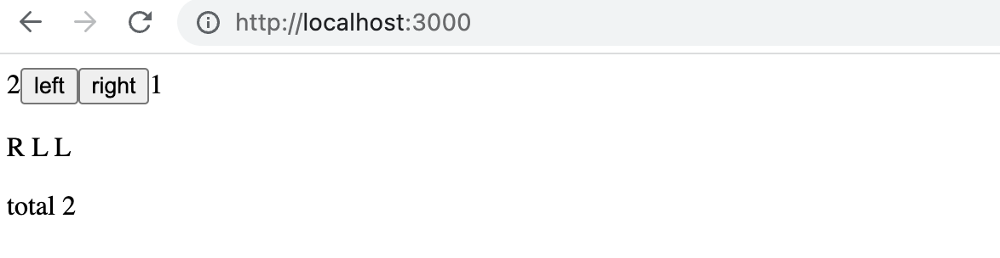

إجمالي عدد ضغطات الأزرار أقل دائماً بواحد من العدد الفعلي للضغطات لسبب ما!

دعونا نضيف بضع جمل console.log داخل معالج الحدث:

```js
const App = () => {
  // ...
  const handleLeftClick = () => {
    setAll(allClicks.concat('L'))
    console.log('left before', left)  // highlight-line
    setLeft(left + 1)
    console.log('left after', left)  // highlight-line
    setTotal(left + right) 
  }

  // ...
}
```

تكشف منصة التحكم عن سبب المشكلة:

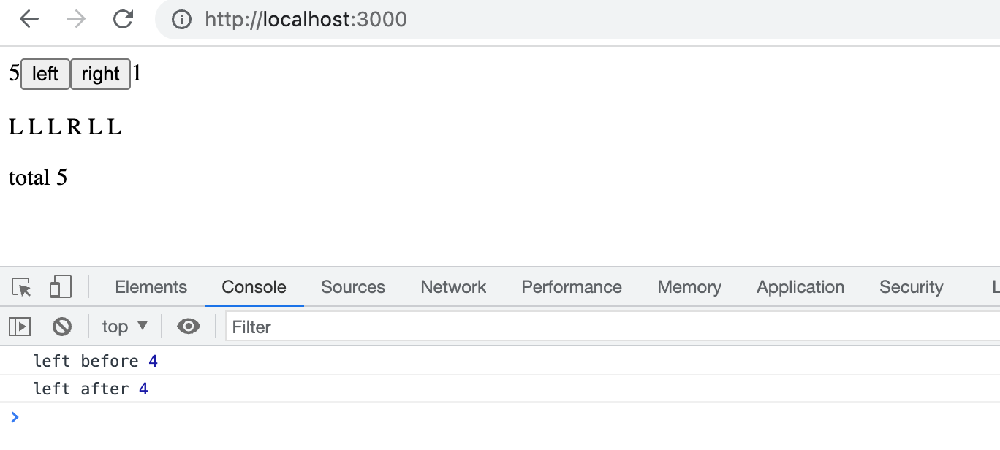

على الرغم من تعيين قيمة جديدة لـ _left_ عن طريق استدعاء _setLeft(left + 1)_، إلا أن القيمة القديمة تظل قائمة ومستمرة بالرغم من التحديث. ونتيجة لذلك، فإن محاولة حساب مجموع ضغطات الأزرار تُنتج قيمة أقل من المتوقع:

```js
setTotal(left + right) 
```

السبب في ذلك هو أن تحديث الحالة في React يتم بطريقة [غير متزامنة (Asynchronous)](https://react.dev/learn/queueing-a-series-of-state-updates)، أي ليس فورياً ومباشراً في نفس اللحظة بل "في وقت لاحق" بعد انتهاء تنفيذ دالة المكوّن الحالية وقبل إعادة تصيير المكوّن مرة أخرى.

يمكننا إصلاح التطبيق على النحو التالي:

```js
const App = () => {
  // ...
  const handleLeftClick = () => {
    setAll(allClicks.concat('L'))
    const updatedLeft = left + 1
    setLeft(updatedLeft)
    setTotal(updatedLeft + right) 
  }

  // ...
}
```

الآن أصبح إجمالي عدد ضغطات الأزرار مبنياً بالتأكيد وبشكل موثوق على العدد الصحيح لضغطات الزر الأيسر.

يمكننا أيضاً معالجة التحديثات غير المتزامنة للزر الأيمن:

```js
const App = () => {
  // ...
  const handleRightClick = () => {
    setAll(allClicks.concat('R'));
    const updatedRight = right + 1;
    setRight(updatedRight);
    setTotal(left + updatedRight);
  };

  // ...
}
```

### التصيير الشرطي (Conditional rendering)

دعونا نعدل تطبيقنا بحيث تتم معالجة تصيير سجل النقرات بواسطة مكوّن جديد يُدعى <i>History</i>:

```js
// highlight-start
const History = (props) => {
  if (props.allClicks.length === 0) {
    return (
      <div>
        the app is used by pressing the buttons
      </div>
    )
  }

  return (
    <div>
      button press history: {props.allClicks.join(' ')}
    </div>
  )
}
// highlight-end

const App = () => {
  // ...

  return (
    <div>
      {left}
      <button onClick={handleLeftClick}>left</button>
      <button onClick={handleRightClick}>right</button>
      {right}
      <History allClicks={allClicks} /> // highlight-line
    </div>
  )
}
```

الآن يعتمد سلوك المكوّن على ما إذا كان قد تم النقر على أي أزرار أم لا. إذا لم يتم النقر، أي أن مصفوفة <em>allClicks</em> فارغة، فإن المكوّن يصيّر عنصر div يحتوي على بعض الإرشادات والتعليمات بدلاً من ذلك:

```js
<div>the app is used by pressing the buttons</div>
```

وفي جميع الحالات الأخرى، يصيّر المكوّن سجل النقرات:

```js
<div>
  button press history: {props.allClicks.join(' ')}
</div>
```

يصيّر المكوّن <i>History</i> عناصر React مختلفة تماماً بناءً على حالة التطبيق. وهذا ما يُعرف بـ <i>التصيير الشرطي (Conditional rendering)</i>.

تقدم React أيضاً العديد من الطرق الأخرى للقيام بـ [التصيير الشرطي](https://react.dev/learn/conditional-rendering). سنلقي نظرة فاحصة على هذا في [الجزء الثاني (Part 2)](/ar/part2).

دعونا نجري تعديلاً أخيراً على تطبيقنا من خلال إعادة هيكلته لاستخدام مكوّن _Button_ الذي قمنا بتعريفه في وقت سابق:

```js
const History = (props) => {
  if (props.allClicks.length === 0) {
    return (
      <div>
        the app is used by pressing the buttons
      </div>
    )
  }

  return (
    <div>
      button press history: {props.allClicks.join(' ')}
    </div>
  )
}

const Button = ({ onClick, text }) => <button onClick={onClick}>{text}</button> // highlight-line

const App = () => {
  const [left, setLeft] = useState(0)
  const [right, setRight] = useState(0)
  const [allClicks, setAll] = useState([])

  const handleLeftClick = () => {
    setAll(allClicks.concat('L'))
    setLeft(left + 1)
  }

  const handleRightClick = () => {
    setAll(allClicks.concat('R'))
    setRight(right + 1)
  }

  return (
    <div>
      {left}
      // highlight-start
      <Button onClick={handleLeftClick} text='left' />
      <Button onClick={handleRightClick} text='right' />
      // highlight-end
      {right}
      <History allClicks={allClicks} />
    </div>
  )
}
```

### ريأكت القديمة (Old React)

في هذه الدورة، نستخدم [خطاف الحالة (State Hook)](https://react.dev/learn/state-a-components-memory) لإضافة الحالة إلى مكونات React الخاصة بنا، وهي ميزة متوفرة في الإصدارات الأحدث من React ومتاحة بدءاً من الإصدار [16.8.0](https://www.npmjs.com/package/react/v/16.8.0) فصاعداً. قبل إضافة الخطافات (Hooks)، لم تكن هناك طريقة لإضافة حالة إلى المكونات المبنية على الدوال (Functional Components). والمكونات التي كانت تتطلب حالة كان لا بد من تعريفها كـ [مكونات فئات (Class Components)](https://react.dev/reference/react/Component) باستخدام صيغة فئات JavaScript.

في هذه الدورة، اتخذنا قراراً جريئاً باستخدام الخطافات (Hooks) حصرياً من اليوم الأول، لضمان أننا نتعلم الأنماط الحالية والمستقبلية لـ React. وعلى الرغم من أن المكونات الوظيفية هي مستقبل React، إلا أنه لا يزال من المهم التعرف على صيغة الفئات، حيث توجد مليارات الأسطر من أكواد React القديمة التي قد تجد نفسك تقوم بصيانتها يوماً ما. وينطبق الشيء نفسه على التوثيقات والأمثلة التي قد تصادفها على الإنترنت.

سنتعلم المزيد عن مكونات الفئات في React لاحقاً في الدورة.

### تصحيح أخطاء تطبيقات React (Debugging React applications)

يُقضى جزء كبير من وقت المطور في تصحيح الأخطاء (Debugging) وقراءة الأكواد الحالية. بين الحين والآخر نكتب سطراً أو سطرين من الكود الجديد، ولكن معظم وقتنا يُقضى في محاولة معرفة سبب تعطل شيء ما أو كيفية عمل جزء معين. لهذا السبب تُعد الممارسات الجيدة والأدوات الفعالة لتصحيح الأخطاء ذات أهمية بالغة.

لحسن حظنا، تُعد React مكتبة صديقة للمطورين إلى أقصى حد عندما يتعلق الأمر باكتشاف الأخطاء وتصحيحها.

قبل أن ننتقل إلى الخطوة التالية، دعونا نذكر أنفسنا بإحدى أهم القواعد الذهبية لتطوير الويب:

<h4>القاعدة الأولى في تطوير الويب</h4>

> **أبقِ منصة تحكم المطور (Developer Console) في المتصفح مفتوحة طوال الوقت.**
>
> يجب أن تظل علامة التبويب <i>Console</i> تحديداً مفتوحة دائماً، ما لم يكن هناك سبب محدد يدعوك لعرض علامة تبويب أخرى.

أبقِ كلاً من محرّر الشيفرة وصفحة الويب مفتوحين معاً جنباً إلى جنب **في نفس الوقت، وطوال الوقت**.

إذا وعندما تفشل الشيفرة في التجميع وتضيء شاشة المتصفح كشجرة عيد الميلاد بالأخطاء الحمراء:

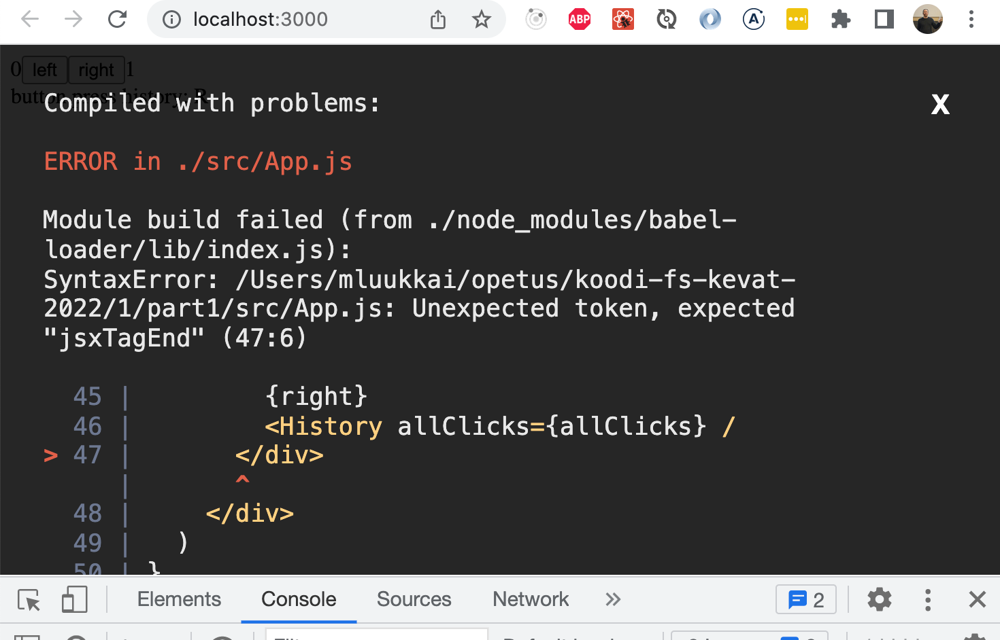

فلا تستمر في كتابة المزيد من الأكواد، بل ابحث عن المشكلة وقم بإصلاحها **على الفور وبشكل عاجل**. لم تكن هناك لحظة في تاريخ البرمجة بدأ فيها كود غير صالح للتجميع بالعمل فجأة وبأعجوبة بعد كتابة كميات كبيرة من الأكواد الإضافية! وأشك بشدة في حدوث مثل هذا الحدث خلال هذه الدورة أيضاً.

إن أسلوب تصحيح الأخطاء الكلاسيكي القائم على طباعة القيم بالمنصة هو دائماً فكرة ممتازة. إذا كان المكوّن:

```js
const Button = ({ onClick, text }) => <button onClick={onClick}>{text}</button>
```

لا يعمل بالشكل المطلوب، فمن المفيد جداً البدء في طباعة متغيراته في منصة التحكم (console). ولكي نفعل ذلك بفعالية، يجب علينا تحويل دالتنا إلى الصيغة الأقل إيجازاً واستقبال كائن props بأكمله دون تفكيكه فورياً:

```js
const Button = (props) => { 
  console.log(props) // highlight-line
  const { onClick, text } = props
  return (
    <button onClick={onClick}>
      {text}
    </button>
  )
}
```

سيكشف هذا على الفور عما إذا كان أحد المعاملات أو الخصائص قد تم كتابة اسمه بشكل خاطئ عند استخدام المكوّن.

**ملاحظة هامة**: عند استخدام _console.log_ لتصحيح الأخطاء، لا تقم بدمج _الكائنات_ بأسلوب Java باستخدام معامل الجمع `+`:

```js
console.log('props value is ' + props)
```
  
إذا قمت بذلك، فستنتهي برسالة سجل غير مفيدة على الإطلاق:

```js
props value is [object Object]
```

بدلاً من ذلك، افصل بين العناصر التي تريد تسجيلها في منصة التحكم باستخدام الفاصلة `,`:

```js
console.log('props value is', props)
```

بهذه الطريقة، ستكون العناصر المفصولة متاحة في منصة تحكم المتصفح ككائنات قابلة للفحص والتوسيع.

إن طباعة المخرجات في منصة التحكم ليست بأي حال من الأحوال الطريقة الوحيدة لتصحيح أخطاء تطبيقاتنا. يمكنك إيقاف تنفيذ كود التطبيق مؤقتاً في مصحح الأخطاء (Debugger) الخاص بمنصة تحكم مطوري Chrome عن طريق كتابة الأمر [debugger](https://developer.mozilla.org/en-US/docs/Web/JavaScript/Reference/Statements/debugger) في أي مكان في الكود الخاص بك.

سيتوقف التنفيذ مؤقتاً بمجرد وصوله إلى النقطة التي يتم فيها تنفيذ أمر _debugger_:

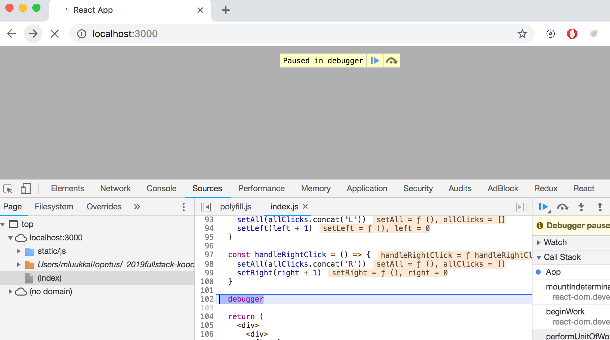

بالانتقال إلى علامة التبويب <i>Console</i>، يصبح من السهل فحص الحالة الحالية للمتغيرات:

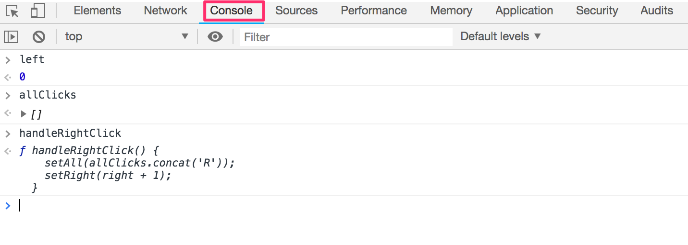

بمجرد اكتشاف سبب الخطأ، يمكنك إزالة أمر _debugger_ وتحديث الصفحة.

يتيح لنا مصحح الأخطاء أيضاً تنفيذ الكود سطراً بسطر باستخدام أزرار التحكم الموجودة على الجانب الأيمن من علامة التبويب <i>Sources</i>.

يمكنك أيضاً الوصول إلى مصحح الأخطاء دون استخدام أمر _debugger_ عن طريق إضافة نقاط توقف (Breakpoints) في علامة التبويب <i>Sources</i>. ويمكن فحص قيم متغيرات المكوّن في قسم _Scope_:

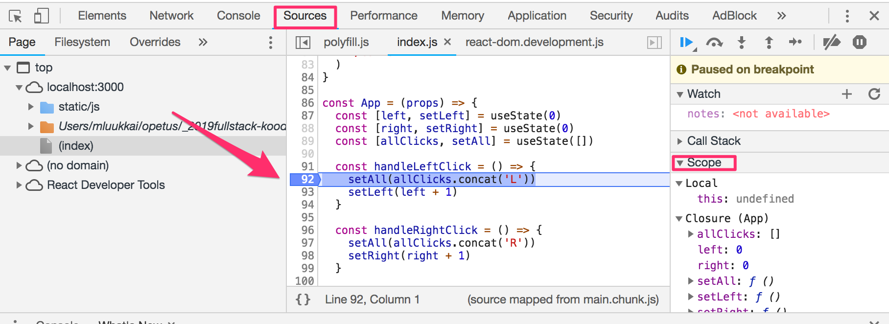

يوصى بشدة بتثبيت إضافة [React Developer Tools](https://chrome.google.com/webstore/detail/react-developer-tools/fmkadmapgofadopljbjfkapdkoienihi) لمتصفح Chrome. حيث تضيف علامة تبويب جديدة باسم _Components_ إلى أدوات المطور. يمكن استخدام علامة التبويب الجديدة لفحص عناصر React المختلفة في التطبيق، جنباً إلى جنب مع حالتها (state) وخصائصها (props):

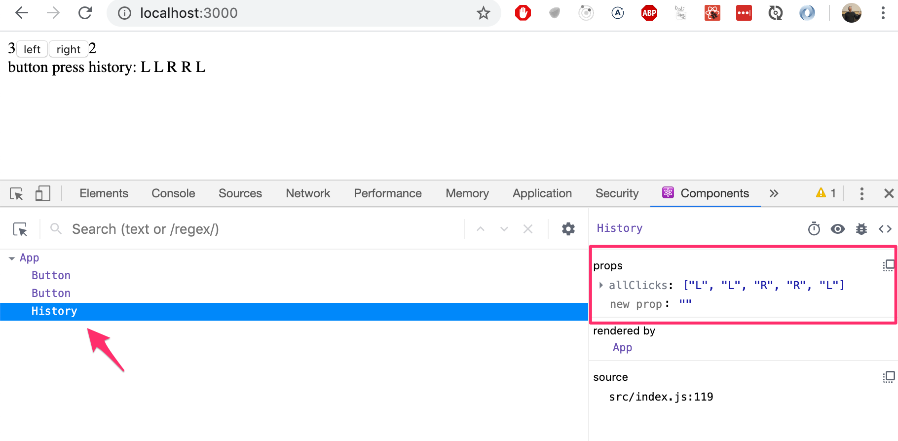

يتم تعريف حالة مكوّن _App_ هكذا:

```js
const [left, setLeft] = useState(0)
const [right, setRight] = useState(0)
const [allClicks, setAll] = useState([])
```

تعرض أدوات المطور حالة الخطافات (Hooks) بترتيب تعريفها:

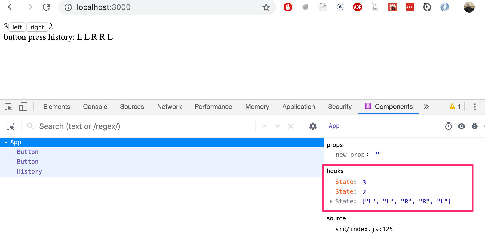

تحتوي أول <i>State</i> على قيمة حالة <i>left</i>، وتحتوي التالية على قيمة حالة <i>right</i>، بينما تحتوي الأخيرة على قيمة حالة <i>allClicks</i>.

يمكنك أيضاً التعرف على تصحيح أخطاء JavaScript في Chrome من خلال [فيديو دليل Chrome DevTools](https://developer.chrome.com/docs/devtools/javascript).

### قواعد الخطافات (Rules of Hooks)

هناك بعض القيود و[القواعد](https://react.dev/warnings/invalid-hook-call-warning#breaking-rules-of-hooks) الصارمة التي يتعين علينا اتباعها لضمان استخدام تطبيقنا لدوال الحالة القائمة على الخطافات بشكل سليم.

دالة _useState_ (وكذلك دالة _useEffect_ التي سيتم تقديمها لاحقاً في الدورة) <i>يجب ألا تُستدعى</i> من داخل حلقة تكرار (Loop)، أو تعبير شرطي (Conditional Statement)، أو أي مكان ليس دالة تُعرّف مكوّن React. يجب الالتزام بهذا لضمان استدعاء الخطافات دائماً بنفس الترتيب في كل تصيير، وإذا لم يكن الأمر كذلك، فسيتصرف التطبيق بشكل غير مستقر وغير متوقع.

للتلخيص، لا يجوز استدعاء الخطافات إلا من داخل جسم الدالة التي تُعرّف مكوّن React بشكل مباشر على المستوى الأعلى:

```js
const App = () => {
  // هذه الاستدعاءات صحيحة تماماً
  const [age, setAge] = useState(0)
  const [name, setName] = useState('Juha Tauriainen')

  if ( age > 10 ) {
    // هذا لا يعمل ويُعد محظوراً!
    const [foobar, setFoobar] = useState(null)
  }

  for ( let i = 0; i < age; i++ ) {
    // هذا أيضاً غير مسموح به
    const [rightWay, setRightWay] = useState(false)
  }

  const notGood = () => {
    // وهذا أيضاً استدعاء غير قانوني
    const [x, setX] = useState(-1000)
  }

  return (
    //...
  )
}
```

### إعادة النظر في معالجة الأحداث (Event Handling Revisited)

أثبتت معالجة الأحداث أنها موضوع شائك ويسبب بعض اللبس في الإصدارات السابقة من هذه الدورة.

لهذا السبب، سنعيد مراجعة الموضوع بتفصيل أكبر.

دعونا نفترض أننا نقوم بتطوير هذا التطبيق البسيط مع المكوّن <i>App</i> التالي:

```js
const App = () => {
  const [value, setValue] = useState(10)

  return (
    <div>
      {value}
      <button>reset to zero</button>
    </div>
  )
}
```

نريد أن يؤدي النقر على الزر إلى إعادة ضبط الحالة المخزنة في المتغير _value_ إلى الصفر.

من أجل جعل الزر يستجيب لحدث النقر، يتعين علينا إضافة <i>معالج حدث (Event Handler)</i> إليه.

يجب أن تكون معالجات الأحداث دائماً عبارة عن دالة أو مرجع لدالة. لن يعمل الزر إذا تم ضبط معالج الحدث على متغير من أي نوع آخر.

إذا قمنا بتعريف معالج الحدث كسلسلة نصية:

```js
<button onClick="crap...">button</button>
```

فستحذرنا React بشأن ذلك في منصة التحكم:

```js
index.js:2178 Warning: Expected `onClick` listener to be a function, instead got a value of `string` type.
    in button (at index.js:20)
    in div (at index.js:18)
    in App (at index.js:27)
```

المحاولة التالية لن تعمل أيضاً:

```js
<button onClick={value + 1}>button</button>
```

لقد حاولنا تعيين معالج الحدث إلى _value + 1_ وهو ببساطة يُرجع ناتج العملية الحسابية (رقم). ستقوم React بتحذيرنا بلطف في منصة التحكم:

```js
index.js:2178 Warning: Expected `onClick` listener to be a function, instead got a value of `number` type.
```

هذه المحاولة لن تعمل أيضاً:

```js
<button onClick={value = 0}>button</button>
```

معالج الحدث هنا ليس دالة بل هو عملية إسناد لمتغير، وستصدر React تحذيراً آخر في منصة التحكم. هذه المحاولة معيبة أيضاً بمعنى أنه يجب ألا نعدل الحالة مباشرة في React أبداً.

ماذا عن التالي:

```js
<button onClick={console.log('clicked the button')}>
  button
</button>
```

تتم طباعة الرسالة في منصة التحكم مرة واحدة عند تصيير المكوّن، ولكن لا يحدث أي شيء عند النقر فوق الزر. لماذا لا يعمل هذا على الرغم من أن معالج الحدث الخاص بنا يحتوي على دالة _console.log_؟

المشكلة هنا هي أن معالج الحدث الخاص بنا تم تعريفه كـ <i>استدعاء لدالة (Function Call)</i> مما يعني أنه يتم إسناد القيمة المرجعة من الدالة إلى معالج الحدث، وهي في حالة _console.log_ القيمة <i>undefined</i>.

يتم تنفيذ استدعاء دالة _console.log_ عند تصيير المكوّن ولهذا السبب تتم طباعتها مرة واحدة في منصة التحكم.

المحاولة التالية معيبة تماماً كذلك:

```js
<button onClick={setValue(0)}>button</button>
```

لقد حاولنا مرة أخرى وضع استدعاء دالة كمعالج للحدث. هذا لا يعمل، كما تسبب هذه المحاولة المحددة مشكلة خطيرة أخرى. فعند تصيير المكوّن، يتم تنفيذ الدالة _setValue(0)_ والتي بدورها تؤدي إلى إعادة تصيير المكوّن. وإعادة التصيير تؤدي إلى استدعاء _setValue(0)_ مرة أخرى، مما ينتج عنه حلقة تكرار لانهائية تكسر التطبيق.

يمكن تحقيق تنفيذ استدعاء دالة معينة عند النقر على الزر على النحو التالي:

```js
<button onClick={() => console.log('clicked the button')}>
  button
</button>
```

الآن أصبح معالج الحدث عبارة عن دالة معرفة بصيغة الدالة السهمية _() => console.log('clicked the button')_. وعندما يتم تصيير المكوّن، لا يتم استدعاء أي دالة، بل يتم فقط إسناد المرجع إلى الدالة السهمية كمعالج للحدث. واستدعاء الدالة الفعلي يحدث فقط بمجرد النقر على الزر.

يمكننا تنفيذ إعادة ضبط الحالة في تطبيقنا باستخدام هذه التقنية نفسها:

```js
<button onClick={() => setValue(0)}>button</button>
```

أصبح معالج الحدث الآن هو الدالة _() => setValue(0)_.

إن تعريف معالجات الأحداث مباشرة داخل سمة الزر ليس بالضرورة هو أفضل فكرة ممكنة دائماً.

سترى غالباً معالجات الأحداث معرفة في مكان منفصل. في الإصدار التالي من تطبيقنا، نُعرّف دالة يتم إسنادها بعد ذلك إلى المتغير _handleClick_ في جسم دالة المكوّن:

```js
const App = () => {
  const [value, setValue] = useState(10)

  const handleClick = () =>
    console.log('clicked the button')

  return (
    <div>
      {value}
      <button onClick={handleClick}>button</button>
    </div>
  )
}
```

يتم تمرير المتغير _handleClick_، الذي يشير إلى تعريف الدالة، إلى الزر كقيمة للسمة <i>onClick</i>:

```js
<button onClick={handleClick}>button</button>
```

بطبيعة الحال، يمكن أن تتكون دالة معالج الأحداث من عدة أوامر. في هذه الحالات، نستخدم صيغة الأقواس المعقوفة للدوال السهمية:

```js
const App = () => {
  const [value, setValue] = useState(10)

  // highlight-start
  const handleClick = () => {
    console.log('clicked the button')
    setValue(0)
  }
   // highlight-end

  return (
    <div>
      {value}
      <button onClick={handleClick}>button</button>
    </div>
  )
}
```

### دالة تُرجع دالة (A function that returns a function)

طريقة أخرى لتعريف معالج الحدث هي استخدام <i>دالة تُرجع دالة أخرى</i>.

من المحتمل ألا تحتاج إلى استخدام دوال تُرجع دوال في أي من تمارين هذه الدورة. وإذا بدا لك هذا الموضوع مربكاً، فيمكنك تخطي هذا القسم في الوقت الحالي والعودة إليه لاحقاً.

دعونا نجري التغييرات التالية على كودنا:

```js
const App = () => {
  const [value, setValue] = useState(10)

  // highlight-start
  const hello = () => {
    const handler = () => console.log('hello world')

    return handler
  }
  // highlight-end

  return (
    <div>
      {value}
      <button onClick={hello()}>button</button>
    </div>
  )
}
```

يعمل الكود بشكل صحيح تماماً على الرغم من أنه يبدو معقداً.

تم ضبط معالج الحدث الآن على استدعاء دالة:

```js
<button onClick={hello()}>button</button>
```

في السابق، ذكرنا أن معالج الحدث لا يجوز أن يكون استدعاءً لدالة، بل يجب أن يكون إما تعريفاً لدالة أو مرجعاً إليها. فلماذا يعمل استدعاء الدالة في هذه الحالة؟

عندما يتم تصيير المكوّن، يتم تنفيذ الدالة التالية:

```js
const hello = () => {
  const handler = () => console.log('hello world')

  return handler
}
```

إن <i>القيمة المرجعة</i> من الدالة هي دالة أخرى تم إسنادها إلى المتغير _handler_.

وعندما تقوم React بتصيير السطر:

```js
<button onClick={hello()}>button</button>
```

فإنها تسند القيمة المرجعة من _hello()_ إلى السمة onClick. وبذلك يتحول السطر في جوهره إلى:

```js
<button onClick={() => console.log('hello world')}>
  button
</button>
```

ونظراً لأن دالة _hello_ تُرجع دالة، فإن معالج الحدث أصبح في النهاية دالة صالحة.

ما الفائدة العملية من هذا المفهوم؟

دعونا نغير الكود قليلاً:

```js
const App = () => {
  const [value, setValue] = useState(10)

  // highlight-start
  const hello = (who) => {
    const handler = () => {
      console.log('hello', who)
    }

    return handler
  }
  // highlight-end  

  return (
    <div>
      {value}
  // highlight-start      
      <button onClick={hello('world')}>button</button>
      <button onClick={hello('react')}>button</button>
      <button onClick={hello('function')}>button</button>
  // highlight-end      
    </div>
  )
}
```

الآن يحتوي التطبيق على ثلاثة أزرار ذات معالجات أحداث محددة بواسطة دالة _hello_ التي تقبل معاملاً.

يتم تعريف الزر الأول على النحو التالي:

```js
<button onClick={hello('world')}>button</button>
```

يتم إنشاء معالج الحدث عن طريق <i>تنفيذ</i> استدعاء الدالة _hello('world')_. يُرجع استدعاء الدالة هذه الدالة:

```js
() => {
  console.log('hello', 'world')
}
```

ويتم تعريف الزر الثاني على النحو التالي:

```js
<button onClick={hello('react')}>button</button>
```

استدعاء الدالة _hello('react')_ الذي يُنشئ معالج الحدث يُرجع:

```js
() => {
  console.log('hello', 'react')
}
```

يحصل كلا الزرين على معالجات أحداث مخصصة ومستقلة.

يمكن استخدام الدوال التي تُرجع دوال في تعريف وظائف عامة وقابلة للتخصيص عبر المعاملات. يمكن التفكير في دالة _hello_ التي تُنشئ معالجات الأحداث كمصنع (Factory) يُنتج معالجات أحداث مخصصة للترحيب بالمستخدمين.

تعريفنا الحالي مفصل ومطول نوعاً ما:

```js
const hello = (who) => {
  const handler = () => {
    console.log('hello', who)
  }

  return handler
}
```

دعونا نتخلص من المتغيرات المساعدة ونُرجع الدالة المُنشأة مباشرة:

```js
const hello = (who) => {
  return () => {
    console.log('hello', who)
  }
}
```

ونظراً لأن دالة _hello_ الخاصة بنا تتكون من أمر return واحد، فيمكننا حذف الأقواس المعقوفة واستخدام الصيغة الأكثر إيجازاً للدوال السهمية:

```js
const hello = (who) =>
  () => {
    console.log('hello', who)
  }
```

وأخيراً، دعونا نكتب كل الأسهم في نفس السطر:

```js
const hello = (who) => () => {
  console.log('hello', who)
}
```

يمكننا استخدام نفس الطريقة لتعريف معالجات الأحداث التي تضبط حالة المكوّن على قيمة معطاة. لنقم بإجراء التغييرات التالية على كودنا:

```js
const App = () => {
  const [value, setValue] = useState(10)
  
  // highlight-start
  const setToValue = (newValue) => () => {
    console.log('value now', newValue)  // طباعة القيمة الجديدة في منصة التحكم
    setValue(newValue)
  }
  // highlight-end
  
  return (
    <div>
      {value}
      // highlight-start
      <button onClick={setToValue(1000)}>thousand</button>
      <button onClick={setToValue(0)}>reset</button>
      <button onClick={setToValue(value + 1)}>increment</button>
      // highlight-end
    </div>
  )
}
```

عندما يتم تصيير المكوّن، يتم إنشاء زر <i>thousand</i>:

```js
<button onClick={setToValue(1000)}>thousand</button>
```

يتم ضبط معالج الحدث على القيمة المرجعة من _setToValue(1000)_ وهي الدالة التالية:

```js
() => {
  console.log('value now', 1000)
  setValue(1000)
}
```

ويتم الإعلان عن زر الزيادة على النحو التالي:

```js
<button onClick={setToValue(value + 1)}>increment</button>
```

يتم إنشاء معالج الحدث بواسطة استدعاء الدالة _setToValue(value + 1)_ والتي تستقبل كمعامل لها القيمة الحالية لمتغير الحالة _value_ مضافاً إليها واحد. وإذا كانت قيمة _value_ هي 10، فإن معالج الحدث المُنشأ سيكون الدالة:

```js
() => {
  console.log('value now', 11)
  setValue(11)
}
```

إن استخدام دوال تُرجع دوال ليس أمراً إلزامياً لتحقيق هذه الوظيفة. دعونا نحول دالة _setToValue_ المسؤولة عن تحديث الحالة إلى دالة عادية:

```js
const App = () => {
  const [value, setValue] = useState(10)

  const setToValue = (newValue) => {
    console.log('value now', newValue)
    setValue(newValue)
  }

  return (
    <div>
      {value}
      <button onClick={() => setToValue(1000)}>
        thousand
      </button>
      <button onClick={() => setToValue(0)}>
        reset
      </button>
      <button onClick={() => setToValue(value + 1)}>
        increment
      </button>
    </div>
  )
}
```

يمكننا الآن تعريف معالج الحدث كدالة تستدعي دالة _setToValue_ مع المعامل المناسب. وسيكون معالج الحدث لإعادة ضبط حالة التطبيق هو:

```js
<button onClick={() => setToValue(0)}>reset</button>
```

إن الاختيار بين الطريقتين المعروضتين لتعريف معالجات الأحداث هو في الغالب مسألة ذوق وتفضيل شخصي.

### تمرير معالجات الأحداث إلى المكونات الفرعية (Passing Event Handlers to Child Components)

دعونا نفصل الزر إلى مكوّن مستقل خاص به:

```js
const Button = (props) => (
  <button onClick={props.onClick}>
    {props.text}
  </button>
)
```

يحصل المكوّن على دالة معالج الأحداث من الخاصية _onClick_، وعلى نص الزر من الخاصية _text_. دعونا نستخدم المكوّن الجديد:

```js
const App = (props) => {
  // ...
  return (
    <div>
      {value}
      <Button onClick={() => setToValue(1000)} text="thousand" /> // highlight-line
      <Button onClick={() => setToValue(0)} text="reset" /> // highlight-line
      <Button onClick={() => setToValue(value + 1)} text="increment" /> // highlight-line
    </div>
  )
}
```

يُعد استخدام مكوّن <i>Button</i> أمراً بسيطاً، على الرغم من أنه يتعين علينا التأكد من أننا نستخدم أسماء الخصائص (props) الصحيحة عند تمريرها إلى المكوّن.

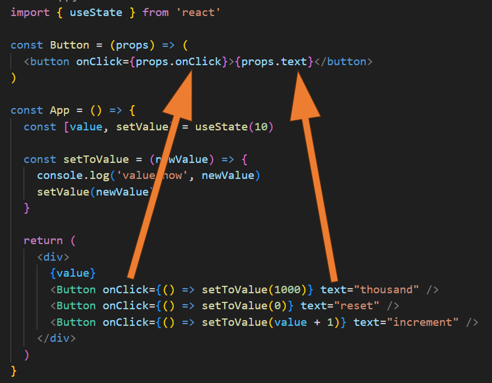

### لا تُعرّف مكونات داخل مكونات أخرى (Do Not Define Components Within Components)

دعونا نبدأ في عرض قيمة التطبيق داخل مكوّن <i>Display</i> خاص به.

سنقوم بتغيير التطبيق عن طريق تعريف مكوّن جديد داخل مكوّن <i>App</i>:

```js
// هذا هو المكان الصحيح لتعريف المكوّن
const Button = (props) => (
  <button onClick={props.onClick}>
    {props.text}
  </button>
)

const App = () => {
  const [value, setValue] = useState(10)

  const setToValue = newValue => {
    console.log('value now', newValue)
    setValue(newValue)
  }

  // لا تُعرّف مكونات داخل مكوّن آخر
  const Display = props => <div>{props.value}</div> // highlight-line

  return (
    <div>
      <Display value={value} /> // highlight-line
      <Button onClick={() => setToValue(1000)} text="thousand" />
      <Button onClick={() => setToValue(0)} text="reset" />
      <Button onClick={() => setToValue(value + 1)} text="increment" />
    </div>
  )
}
```

يبدو التطبيق وكأنه لا يزال يعمل، ولكن **لا تنفذ المكونات بهذه الطريقة أبداً!** إياك أن تُعرّف مكونات داخل مكونات أخرى. هذه الطريقة لا تقدم أي فوائد على الإطلاق وتؤدي فقط إلى مشاكل خطيرة. إحدى هذه المشاكل هي أن React ستعامل المكوّن المُعرّف داخل مكوّن آخر كـ "مكوّن جديد" في كل عملية تصيير، مما يجعل من المستحيل على React تطبيق تحسينات الأداء والذاكرة على المكوّن.

دعونا ننقل دالة المكوّن <i>Display</i> إلى مكانها الصحيح خارج دالة المكوّن <i>App</i>:

```js
const Display = props => <div>{props.value}</div>

const Button = (props) => (
  <button onClick={props.onClick}>
    {props.text}
  </button>
)

const App = () => {
  const [value, setValue] = useState(10)

  const setToValue = newValue => {
    console.log('value now', newValue)
    setValue(newValue)
  }

  return (
    <div>
      <Display value={value} />
      <Button onClick={() => setToValue(1000)} text="thousand" />
      <Button onClick={() => setToValue(0)} text="reset" />
      <Button onClick={() => setToValue(value + 1)} text="increment" />
    </div>
  )
}
```

### قراءات مفيدة (Useful Reading)

الإنترنت مليء بالمواد المتعلقة بـ React. ومع ذلك، فنحن نستخدم الأسلوب الحديث لـ React والذي تُعد الغالبية العظمى من المواد الموجودة على الإنترنت قديمة بالنسبة له.

قد تجد الروابط التالية مفيدة:

- [توثيق React الرسمي](https://react.dev/learn) يستحق الاطلاع عليه في مرحلة ما، على الرغم من أن معظمه سيصبح وثيق الصلة فقط في مراحل لاحقة من الدورة. كما أن كل ما يتعلق بالمكونات القائمة على الفئات لا يهمنا حالياً؛
- بعض الدورات التدريبية على [Egghead.io](https://egghead.io) مثل [Start learning React](https://egghead.io/courses/start-learning-react) ذات جودة عالية، والدورة التي تم تحديثها مؤخراً [Beginner's Guide to React](https://egghead.io/courses/the-beginner-s-guide-to-reactjs) جيدة جداً أيضاً؛ تقدم كلتا الدورتين مفاهيم سيتم تقديمها أيضاً لاحقاً في هذه الدورة. **ملاحظة**: الأولى تستخدم مكونات الفئات بينما تستخدم الأخيرة المكونات الوظيفية الحديثة.

### قَسَم مطوّر الويب (Web Programmer's Oath)

البرمجة مهمة صعبة. ولهذا السبب، كمطور، سأستخدم كل الوسائل الممكنة لجعلها أسهل وأكثر سلاسة:

- سأبقي منصة تحكم المطور في متصفحي مفتوحة طوال الوقت.
- سأتقدم بخطوات صغيرة، متأكداً من أن الكود الخاص بي يعمل بنجاح عند كل خطوة.
- سأكتب العديد من جمل _console.log_ للتأكد من أنني أفهم كيفية تصرف الكود وللمساعدة في تحديد المشكلات بدقة.
- إذا لم يعمل الكود الخاص بي، فلن أكتب المزيد من الأكواد. بدلاً من ذلك، سأبدأ إما بحذف الأكواد تدريجياً حتى يعمل، أو العودة إلى حالة سابقة كان برنامجي يعمل فيها بشكل سليم.
- عندما أطلب المساعدة في قناة الدورة على Discord أو في أي مكان آخر، سأصيغ أسئلتي بشكل صحيح ومحدد. راجع [هذا القسم](http://fullstackopen.com/ar/part0/general_info#how-to-get-help-in-discord) لتتعلم كيف تطلب المساعدة بفعالية.

### استخدام النماذج اللغوية الكبيرة (Utilization of Large language models)

أثبتت النماذج اللغوية الكبيرة مثل [ChatGPT](https://chat.openai.com/auth/login) و [Claude](https://claude.ai/) و [GitHub Copilot](https://github.com/features/copilot) أنها مفيدة للغاية في تطوير البرمجيات.

شخصياً، أستخدم بشكل أساسي GitHub Copilot، المدمج الآن [بشكل أصيل داخل Visual Studio Code](https://code.visualstudio.com/docs/copilot/overview).
للتذكير، إذا كنت طالباً جامعياً، يمكنك الوصول إلى Copilot Pro مجاناً من خلال [GitHub Student Developer Pack](https://education.github.com/pack).

يُعد Copilot مفيداً في مجموعة واسعة من السيناريوهات. على سبيل المثال، يمكن مطالبة Copilot بتوليد كود لملف مفتوح عن طريق وصف الوظيفة المطلوبة نصياً:

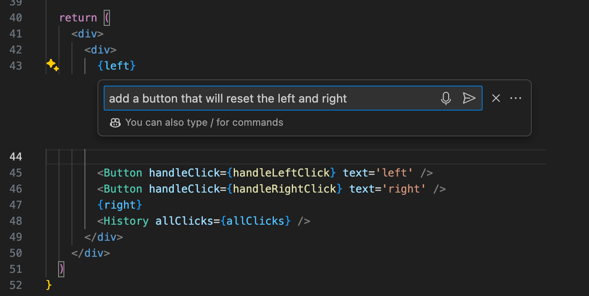

إذا بدا الكود جيداً، يضيفه Copilot إلى الملف:

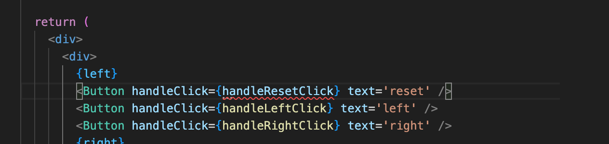

في حالة مثالنا، أنشأ Copilot زراً فقط، وظل معالج الحدث _handleResetClick_ غير معرّف.

يمكن أيضاً توليد معالج الحدث. وبكتابة السطر الأول من الدالة، يقدم Copilot الوظيفة المراد توليدها:

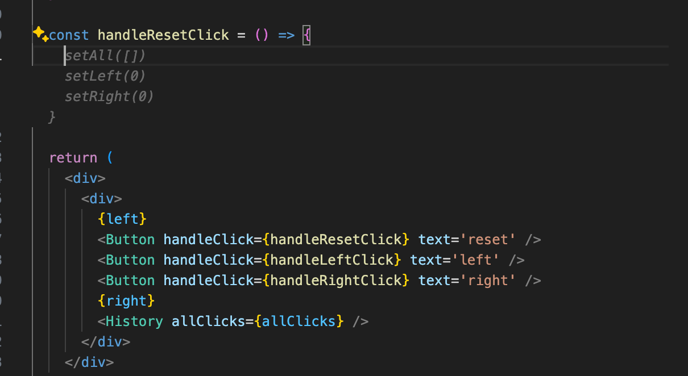

في نافذة محادثة Copilot، من الممكن طلب شرح لوظيفة الكود المحدد:

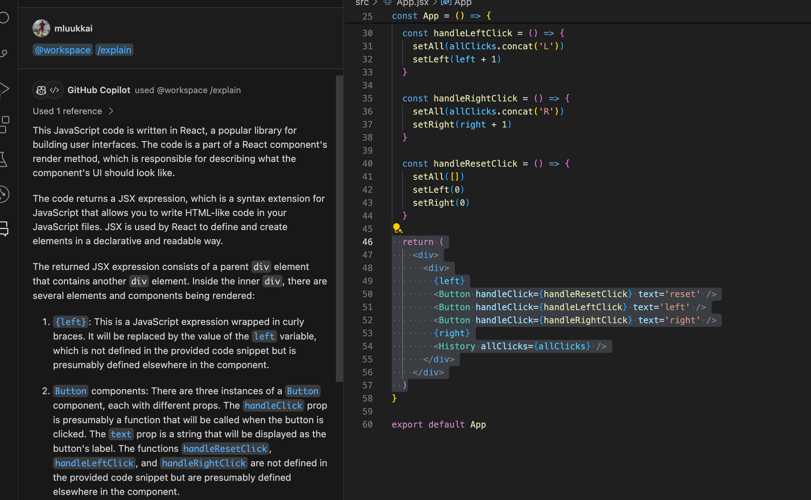

يُعد Copilot مفيداً أيضاً لتصحيح الأخطاء. إذا قمت بنسخ رسالة خطأ ولصقها في محادثة Copilot، فستحصل على شرح للمشكلة وحل مقترح لإصلاحها:

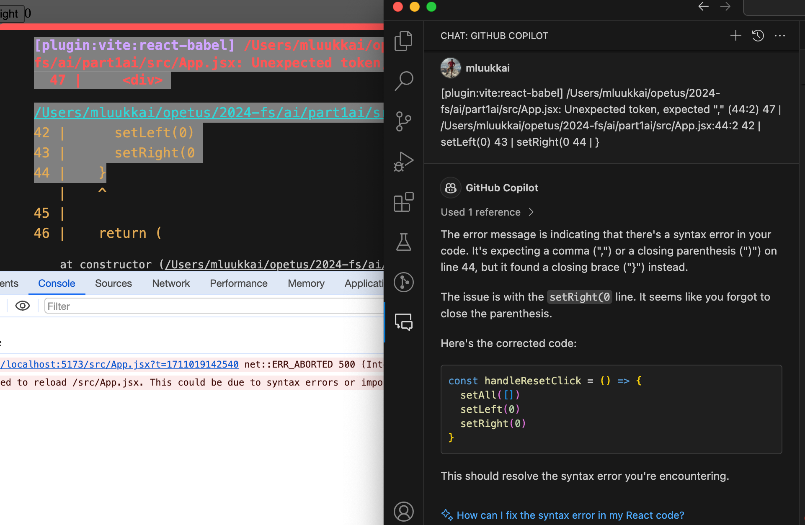

تتيح نافذة محادثة Copilot أيضاً إنشاء مجموعة أكبر من الوظائف البرمجية. على سبيل المثال، توضح الصورة أدناه إنشاء Copilot لمكوّن تسجيل دخول باستخدام خطاف _useState_.

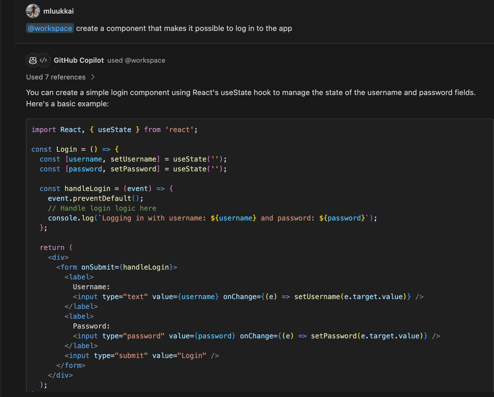

تتباين فائدة Copilot والنماذج اللغوية الأخرى في البرمجة. المشكلة الأكبر في النماذج اللغوية هي [الهلوسة (Hallucination)](https://en.wikipedia.org/wiki/Hallucination_(artificial_intelligence)). تُولد النماذج اللغوية الكبيرة أحياناً إجابات قد تبدو صحيحة ظاهرياً، لكنها خاطئة تماماً. في البرمجة، غالباً ما يتم اكتشاف الأخطاء في الكود المهلوس بسرعة عندما يفشل الكود في التشغيل. ومع ذلك، قد تعمل بعض الأكواد المُولدة بواسطة نموذج لغوي في البداية ولكنها تظل تحتوي على مشكلات خفية، مثل الأخطاء المنطقية أو الثغرات الأمنية.

مشكلة أخرى في تطبيق النماذج اللغوية على تطوير البرمجيات هي أنه من الصعب على النماذج اللغوية "فهم" المشاريع الكبيرة ذات الملفات المتعددة. أحد القيود الرئيسية للنماذج اللغوية هو عدم قدرتها على تنفيذ التغييرات المترابطة عبر عدة ملفات بشكل متسق. كما أن النماذج اللغوية غير قادرة حالياً على تعميم الكود البرمجي بذكاء؛ على سبيل المثال، إذا طلب المبرمج وظيفة جديدة يمكن تنفيذها باستخدام دوال أو مكونات موجودة بالفعل في المشروع (حتى مع تعديلات طفيفة)، فقد يفشل النموذج اللغوي في استخدامها. يؤدي هذا إلى تدهور جودة قاعدة الكود لأن النماذج اللغوية تُولد دوال ومكونات مكررة. لمزيد من المعلومات حول هذا الموضوع، اقرأ [هذه المقالة](https://visualstudiomagazine.com/articles/2024/01/25/copilot-research.aspx).

إذا اخترت استخدام النماذج اللغوية عند البرمجة، فتذكر أن مخرجاتها هي مسؤوليتك الكاملة.

إن التطور السريع للنماذج اللغوية يضع الطلاب المبتدئين في البرمجة في موقف صعب: هل يستحق الأمر، أو هل من الضروري حتى، تعلم البرمجة بمستوى تفصيلي ودقيق عندما يمكنك الحصول على كل شيء تقريباً جاهزاً من النماذج اللغوية؟

في هذه المرحلة، يجدر بنا أن نتذكر الحكمة القديمة لـ [براين كيرنيغان (Brian Kernighan)](https://en.wikipedia.org/wiki/Brian_Kernighan)، المؤلف المشارك لكتاب *The C Programming Language*:

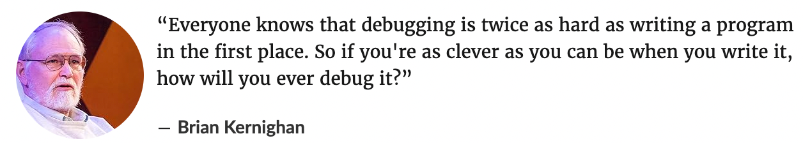

بمعنى آخر، بما أن تصحيح الأخطاء أصعب بمرتين من البرمجة نفسها، فلا فائدة من إنشاء كود بالكاد تفهمه. كيف يمكن أن يكون تصحيح الأخطاء ممكناً عندما لا يفهم مطور البرمجيات الكود الذي يصححه لأنه أسند البرمجة بالكامل إلى نموذج لغوي؟

حتى الآن، لا يزال تطور النماذج اللغوية والذكاء الاصطناعي في مرحلة لا تكفي فيها نفسها بنفسها، وتُترك المشكلات الأكثر تعقيداً للبشر لحلها. ولهذا السبب، يجب حتى على مطوري البرمجيات المبتدئين أن يتعلموا البرمجة بشكل متقن ومحكم تحسباً لأي طارئ. قد يكون الأمر أنه على الرغم من تطور النماذج اللغوية، فإن هناك حاجة إلى معرفة أكثر عمقاً ودقة. يقوم الذكاء الاصطناعي بالأشياء السهلة، ولكن هناك حاجة إلى الإنسان لفرز وحل التعقيدات الأكثر فوضوية التي يسببها الذكاء الاصطناعي. يُعد GitHub Copilot منتجاً ذا اسم دقيق ومناسب للغاية لأنه "مساعد طيار" (Copilot)؛ طيار ثانٍ يساعد الطيار الرئيسي في الطائرة. يظل المبرمج هو الطيار الرئيسي والقبطان والشخص الذي يتحمل المسؤولية في نهاية المطاف.

طوال هذه الدورة، قد يكون من مصلحتك الخاصة إيقاف تشغيل Copilot افتراضياً والاعتماد عليه فقط في حالات الطوارئ الحقيقية.

</div>

<div class="tasks">

<h3>التمارين 1.6.-1.14.</h3>

قم بتسليم حلولك للتمارين عن طريق رفع الكود الخاص بك أولاً إلى GitHub ثم تحديد التمارين المكتملة في علامة التبويب "my submissions" في [تطبيق تسليم المهام](https://studies.cs.helsinki.fi/stats/courses/fullstackopen).

تذكر، قم بتسليم **جميع** تمارين الجزء الواحد **في عملية تسليم واحدة**. بمجرد تسليم حلولك لجزء معين، **فلن تتمكن من تسليم المزيد من التمارين لهذا الجزء بعد ذلك**.

<i>بعض التمارين تعمل على نفس التطبيق. وفي هذه الحالات، يكفي فقط تسليم النسخة النهائية من التطبيق. وإذا رغبت، يمكنك إنشاء Commit بعد كل تمرين مكتمل، ولكن هذا ليس إلزامياً.</i>

في بعض المواقف، قد تضطر أيضاً إلى تشغيل الأمر التالي من المجلد الجذري للمشروع:

```bash
rm -rf node_modules/ && npm i
```

إذا و<i>عندما</i> تصادف رسالة الخطأ:

> <i>Objects are not valid as a React child</i>

تذكر الأشياء الموضحة [هنا](/ar/part1/introduction_to_react#do-not-render-objects).

<h4>1.6: يونيكافيه، الخطوة 1 (unicafe step 1)</h4>

مثل معظم الشركات، يجمع مطعم طلاب جامعة هلسنكي [Unicafe](https://www.unicafe.fi) آراء وملاحظات عملائه. مهمتك هي تنفيذ تطبيق ويب لجمع ملاحظات العملاء. هناك ثلاثة خيارات فقط للتقييم: <i>جيد (good)</i>، و<i>محايد (neutral)</i>، و<i>سيئ (bad)</i>.

يجب أن يعرض التطبيق إجمالي عدد الملاحظات المجمعة لكل فئة. يمكن أن يبدو تطبيقك النهائي كما يلي:


لاحظ أن تطبيقك يحتاج إلى العمل أثناء جلسة تصفح واحدة فقط. وبمجرد تحديث الصفحة، يُسمح باختفاء الملاحظات المجمعة.

يُنصح باستخدام نفس الهيكل المستخدم في المادة والتمارين السابقة. الملف <i>main.jsx</i> يكون على النحو التالي:

```js
import ReactDOM from 'react-dom/client'

import App from './App'

ReactDOM.createRoot(document.getElementById('root')).render(<App />)
```

يمكنك استخدام الكود أدناه كنقطة انطلاق لملف <i>App.jsx</i>:

```js
import { useState } from 'react'

const App = () => {
  // حفظ نقرات كل زر في حالته الخاصة
  const [good, setGood] = useState(0)
  const [neutral, setNeutral] = useState(0)
  const [bad, setBad] = useState(0)

  return (
    <div>
      code here
    </div>
  )
}

export default App
```

<h4>1.7: يونيكافيه، الخطوة 2 (unicafe step 2)</h4>

قم بتوسيع تطبيقك بحيث يعرض المزيد من الإحصائيات حول الملاحظات المجمعة: إجمالي عدد الملاحظات المجمعة، ومتوسط الدرجات (قيم التقييم هي: جيد 1، محايد 0، سيئ -1) والنسبة المئوية للملاحظات الإيجابية.


<h4>1.8: يونيكافيه، الخطوة 3 (unicafe step 3)</h4>

أعد هيكلة تطبيقك بحيث يتم استخراج عرض الإحصائيات داخل مكوّن <i>Statistics</i> مستقل. ويجب أن تظل حالة التطبيق في المكوّن الجذري <i>App</i>.

تذكر أنه يجب عدم تعريف المكونات داخل مكونات أخرى:

```js
// المكان الصحيح لتعريف المكوّن
const Statistics = (props) => {
  // ...
}

const App = () => {
  const [good, setGood] = useState(0)
  const [neutral, setNeutral] = useState(0)
  const [bad, setBad] = useState(0)

  // لا تُعرّف مكوّناً داخل مكوّن آخر
  const Statistics = (props) => {
    // ...
  }

  return (
    // ...
  )
}
```

<h4>1.9: يونيكافيه، الخطوة 4 (unicafe step 4)</h4>

قم بتعديل تطبيقك لعرض الإحصائيات فقط بمجرد جمع بعض الملاحظات (إذا لم تكن هناك أي ملاحظات بعد، اعرض رسالة تفيد بذلك).


<h4>1.10: يونيكافيه، الخطوة 5 (unicafe step 5)</h4>

دعونا نواصل إعادة هيكلة التطبيق. استخرج المكوّنين التاليين:

- <i>Button</i> يتولى وظيفة كل زر من أزرار تقديم الملاحظات.

- <i>StatisticLine</i> لعرض إحصائية فردية واحدة، مثل متوسط الدرجات.

للتوضيح: يعرض مكوّن <i>StatisticLine</i> دائماً إحصائية فردية واحدة، مما يعني أن التطبيق يستخدم مكونات متعددة لتصيير جميع الإحصائيات:

```js
const Statistics = (props) => {
  /// ...
  return(
    <div>
      <StatisticLine text="good" value={...} />
      <StatisticLine text="neutral" value={...} />
      <StatisticLine text="bad" value={...} />
      // ...
    </div>
  )
}
```

يجب أن تظل حالة التطبيق محفوظة في المكوّن الجذري <i>App</i>.

<h4>1.11*: يونيكافيه، الخطوة 6 (unicafe step 6)</h4>

اعرض الإحصائيات في [جدول (Table)](https://developer.mozilla.org/en-US/docs/Learn/HTML/Tables/Basics) بلغة HTML، بحيث يبدو تطبيقك تقريباً كما يلي:


تذكر أن تبقي منصة التحكم مفتوحة طوال الوقت. وإذا رأيت هذا التحذير في منصة التحكم الخاصة بك:

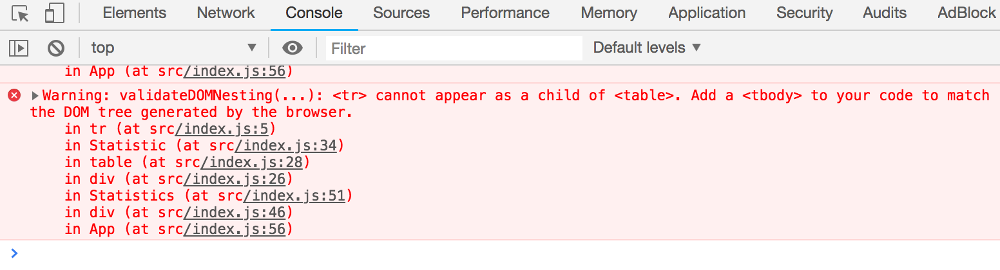

فاتخذ الإجراءات اللازمة لجعل التحذير يختفي. جرب نسخ رسالة الخطأ ولصقها في محرك بحث إذا واجهت صعوبة.

<i>المصدر النموذجي لخطأ _Unchecked runtime.lastError: Could not establish connection. Receiving end does not exist._ يكون ناتجاً عن إحدى إضافات متصفح Chrome. جرب الانتقال إلى _chrome://extensions/_ وتعطيلها واحدة تلو الأخرى ثم إعادة تحديث صفحة تطبيق React؛ وسيختفي الخطأ في النهاية.</i>

**تأكد من الآن فصاعداً أنك لا ترى أي تحذيرات في منصة التحكم الخاصة بك!**

<h4>1.12*: الحكايات والنوادر البرمجية، الخطوة 1 (anecdotes step 1)</h4>

عالم هندسة البرمجيات مليء بـ [الحكايات والنوادر والاقتباسات (Anecdotes)](http://www.comp.nus.edu.sg/~damithch/pages/SE-quotes.htm) التي تلخص الحقائق الخالدة في مجالنا في عبارات قصيرة وموجزة.

قم بتوسيع التطبيق التالي عن طريق إضافة زر يمكن النقر فوقه لعرض حكمة أو نادرة <i>عشوائية</i> من مجال هندسة البرمجيات:

```js
import { useState } from 'react'

const App = () => {
  const anecdotes = [
    'If it hurts, do it more often.',
    'Adding manpower to a late software project makes it later!',
    'The first 90 percent of the code accounts for the first 90 percent of the development time...The remaining 10 percent of the code accounts for the other 90 percent of the development time.',
    'Any fool can write code that a computer can understand. Good programmers write code that humans can understand.',
    'Premature optimization is the root of all evil.',
    'Debugging is twice as hard as writing the code in the first place. Therefore, if you write the code as cleverly as possible, you are, by definition, not smart enough to debug it.',
    'Programming without an extremely heavy use of console.log is same as if a doctor would refuse to use x-rays or blood tests when diagnosing patients.',
    'The only way to go fast, is to go well.'
  ]
   
  const [selected, setSelected] = useState(0)

  return (
    <div>
      {anecdotes[selected]}
    </div>
  )
}

export default App
```

محتوى الملف <i>main.jsx</i> هو نفسه كما في التمارين السابقة.

ابحث عن كيفية توليد أرقام عشوائية في JavaScript، على سبيل المثال عبر محرك بحث أو في [شبكة مطوري موزيلا (Mozilla Developer Network)](https://developer.mozilla.org). وتذكر أنه يمكنك اختبار توليد الأرقام العشوائية مباشرة في منصة تحكم المتصفح.

يمكن أن يبدو تطبيقك المكتمل شيئاً مثل هذا:


<h4>1.13*: الحكايات والنوادر البرمجية، الخطوة 2 (anecdotes step 2)</h4>

قم بتوسيع تطبيقك بحيث يمكنك التصويت للحكمة والنادرة المعروضة حالياً.


**ملاحظة**: قم بتخزين أصوات كل حكمة في مصفوفة أو كائن داخل حالة المكوّن. وتذكر أن الطريقة الصحيحة لتحديث الحالة المخزنة في هياكل بيانات معقدة مثل الكائنات والمصفوفات هي عمل نسخة من الحالة.

يمكنك إنشاء نسخة من كائن على النحو التالي:

```js
const votes = { 0: 1, 1: 3, 2: 4, 3: 2 }

const copy = { ...votes }
// زيادة قيمة الخاصية 2 بمقدار واحد
copy[2] += 1     
```

أو إنشاء نسخة من مصفوفة هكذا:

```js
const votes = [1, 4, 6, 3]

const copy = [...votes]
// زيادة القيمة في الموضع 2 بمقدار واحد
copy[2] += 1     
```

قد يكون استخدام المصفوفة هو الخيار الأبسط في هذه الحالة. سيوفر لك البحث على الإنترنت الكثير من التلميحات حول كيفية [إنشاء مصفوفة مملوءة بالأصفار بالطول المطلوب في JavaScript](https://stackoverflow.com/questions/20222501/how-to-create-a-zero-filled-javascript-array-of-arbitrary-length/22209781).

<h4>1.14*: الحكايات والنوادر البرمجية، الخطوة 3 (anecdotes step 3)</h4>

الآن قم بتنفيذ الإصدار النهائي من التطبيق الذي يعرض الحكمة التي حصلت على أكبر عدد من الأصوات:


إذا تعادلت عدة حكم ونوادر في المركز الأول، فيكفي إظهار واحدة منها فقط.

كان هذا هو التمرين الأخير لهذا الجزء من الدورة، وحان الوقت لرفع الكود الخاص بك إلى GitHub وتحديد جميع التمارين المكتملة في علامة التبويب "my submissions" في [تطبيق تسليم المهام](https://studies.cs.helsinki.fi/stats/courses/fullstackopen).

</div>
