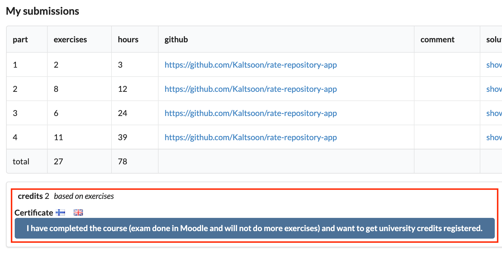
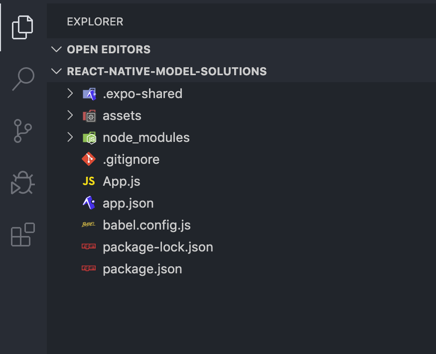
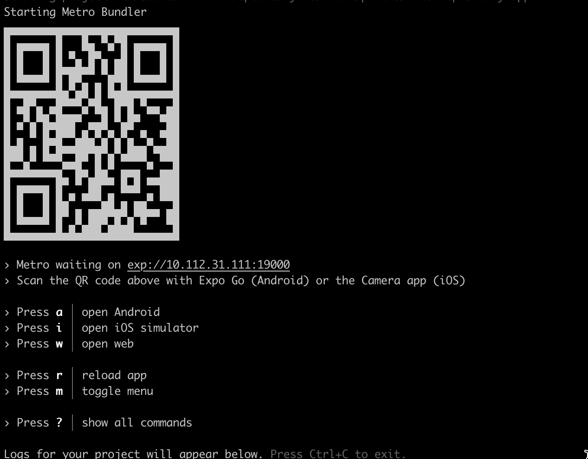
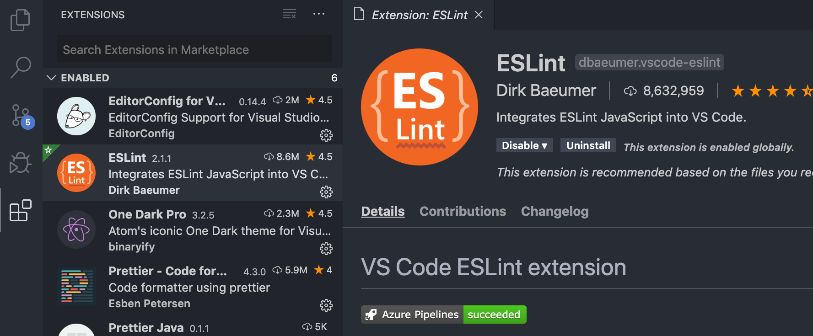

<div class="content">

تقليدياً، كان تطوير تطبيقات iOS و Android الأصلية (Native) يتطلب من المطور استخدام لغات برمجة وبيئات تطوير خاصة بكل منصة على حدة. بالنسبة لتطوير iOS، يعني هذا استخدام Objective-C أو Swift، وبالنسبة لتطوير Android يعني استخدام اللغات القائمة على بيئة تشغيل جافا (JVM) مثل Java أو Scala أو Kotlin. ويتطلب إطلاق تطبيق لكلا النظامين الأساسيين من الناحية التقنية تطوير تطبيقين منفصلين تماماً بلغات برمجة مختلفة، مما يستنزف الكثير من موارد ووقت التطوير.

كان أحد الأساليب الشائعة لتوحيد عملية التطوير عبر المنصات المختلفة هو استخدام متصفح الويب كمحرك للتصيير (Rendering engine). تُعد منصة [Cordova](https://cordova.apache.org/) واحدة من أكثر المنصات شهرة لبناء تطبيقات متعددة المنصات (Cross-platform)؛ حيث تتيح تطوير تطبيقات تعمل على منصات متعددة باستخدام تقنيات الويب القياسية - HTML5 و CSS3 و JavaScript. ومع ذلك، فإن تطبيقات Cordova تعمل داخل نافذة متصفح مدمجة (WebView) في جهاز المستخدم، ولهذا السبب لا يمكن لهذه التطبيقات تحقيق نفس مستوى الأداء ولا نفس المظهر وسلاسة الاستخدام (Look-and-feel) للتطبيقات الأصلية التي تستخدم مكونات واجهة المستخدم الأصلية الحقيقية للجهاز.

[React Native](https://reactnative.dev/) هو إطار عمل لتطوير تطبيقات Android و iOS أصلية بالكامل باستخدام JavaScript و React. يوفر الإطار مجموعة من المكونات العابرة للمنصات (Cross-platform components) التي تستخدم خلف الكواليس المكونات الأصلية للمنصة المستهدفة. يتيح لنا استخدام React Native جلب جميع الميزات المألوفة لـ React مثل JSX والمكونات (Components) والخصائص (Props) والحالة (State) والخطافات (Hooks) إلى عالم تطوير التطبيقات الأصلية. علاوة على ذلك، يمكننا الاستفادة من العديد من المكتبات المألوفة في نظام React البيئي مثل [React Redux](https://react-redux.js.org/) و [Apollo](https://www.apollographql.com/docs/react) و [React Router](https://reactrouter.com/en/main) وغيرها الكثير.

تُعد سرعة التطوير وسهولة التعلم للمطورين الملمين بـ React من أهم الميزات والفوائد لـ React Native. إليك اقتباساً تحفيزياً من مقال Coinbase بعنوان [استقبال آلاف المستخدمين مع React Native](https://benbronsteiny.wordpress.com/2020/02/27/onboarding-thousands-of-users-with-react-native/) حول فوائد React Native:

> <i>إذا أردنا اختصار فوائد React Native في كلمة واحدة، فستكون "السرعة (Velocity)". في المتوسط، تمكن فريقنا من تدريب المهندسين وضمهم في وقت أقل، ومشاركة قدر أكبر من الشيفرة البرمجية (وهو ما نتوقع أن يؤدي إلى تعزيز الإنتاجية مستقبلاً)، وفي النهاية تقديم الميزات وإطلاقها بشكل أسرع بكثير مما لو كنا قد اتبعنا نهجاً أصلياً خالصاً لكل منصة.</i>

### حول هذا الجزء (About this part)

خلال هذا الجزء، سنتعلم كيفية بناء تطبيق React Native حقيقي من الألف إلى الياء. سنتعلم مفاهيم مثل مكونات React Native الأساسية، وكيفية إنشاء واجهات مستخدم جميلة، وكيفية التواصل مع الخادم، وكيفية اختبار تطبيق React Native.

سنقوم بتطوير تطبيق لتقييم مستودعات [GitHub](https://github.com/). سيحتوي تطبيقنا على ميزات مثل فرز وتصفية المستودعات التي تمت مراجعتها، وتسجيل المستخدم، وتسجيل الدخول، وإنشاء مراجعة لمستودع. سيتم توفير الواجهة الخلفية (Backend) للتطبيق لنا حتى نتمكن من التركيز فقط على تطوير React Native. ستبدو النسخة النهائية من تطبيقنا كما يلي:


يجب تسليم جميع التمارين في هذا الجزء في <i>مستودع GitHub واحد</i> والذي سيحتوي في النهاية على الشيفرة المصدرية الكاملة لتطبيقك. ستكون هناك حلول نموذجية متاحة لكل قسم من هذا الجزء والتي يمكنك استخدامها لإكمال التسليمات غير المكتملة. تم تنظيم هذا الجزء بناءً على فكرة أنك تقوم بتطوير تطبيقك تدريجياً أثناء تقدمك في قراءة المادة التعليمية. لذا <i>لا</i> تنتظر حتى تصل إلى قسم التمارين لبدء التطوير؛ بل قم بتطوير تطبيقك بنفس وتيرة تقدم المادة.

سيعتمد هذا الجزء بشكل كبير على المفاهيم التي تمت تغطيتها في الأجزاء السابقة. قبل البدء في هذا الجزء، ستحتاج إلى معرفة أساسية بـ JavaScript و React و GraphQL. لا تشترط معرفة متعمقة بتطوير جانب الخادم، وسيتم توفير جميع شيفرات جانب الخادم لك. ومع ذلك، سنقوم بإجراء طلبات شبكة من تطبيقات React Native الخاصة بك، على سبيل المثال، باستخدام استعلامات GraphQL. الأجزاء الموصى بإكمالها قبل هذا الجزء هي [الجزء 1](/ar/part1) و [الجزء 2](/ar/part2) و [الجزء 5](/ar/part5) و [الجزء 7](/ar/part7) و [الجزء 8](/ar/part8).

### تسليم التمارين والحصول على الساعات المعتمدة (Submitting exercises and earning credits)

تُسلّم التمارين عبر [نظام التسليم](https://studies.cs.helsinki.fi/stats/courses/fs-react-native-2020) تماماً كما في الأجزاء السابقة. لاحظ أن تمارين هذا الجزء يتم تسليمها <i>إلى نسخة دورة دراسية مختلفة</i> عن الأجزاء من 0 إلى 9. تشير الأجزاء من 1 إلى 4 في نظام التسليم إلى الأقسام من a إلى d في هذا الجزء. هذا يعني أنك ستقوم بتسليم التمارين قسماً بقسم في كل مرة بدءاً من هذا القسم، "مقدمة إلى React Native"، وهو الجزء 1 في نظام التسليم.

خلال هذا الجزء، ستحصل على ساعات معتمدة بناءً على عدد التمارين التي تكملها. سيمنحك إكمال <i>25 تمريناً على الأقل</i> في هذا الجزء <i>ساعتين معتمدتين (2 credits)</i>. بمجرد إكمال التمارين والرغبة في اعتماد الساعات، أخبرنا من خلال نظام تسليم التمارين أنك قد أكملت الدورة:



**لاحظ** أنك بحاجة إلى التسجيل في جزء الدورة المقابل لاعتماد وتسجيل الساعات، راجع [هنا](/ar/part0/general_info#parts-and-completion) لمزيد من المعلومات.

يمكنك تنزيل شهادة إتمام هذا الجزء بالنقر فوق أحد أيقونات الأعلام. يمثل رمز العلم لغة الشهادة. لاحظ أنه يجب عليك إكمال ما يعادل ساعة معتمدة واحدة على الأقل من التمارين قبل أن تتمكن من تنزيل الشهادة.

### تهيئة التطبيق (Initializing the application)

للبدء في تطبيقنا، نحتاج إلى إعداد بيئة التطوير الخاصة بنا. لقد تعلمنا من الأجزاء السابقة أن هناك أدوات مفيدة لإعداد تطبيقات React بسرعة مثل Create React App و Vite. ولحسن الحظ، يمتلك React Native مثل هذه الأدوات أيضاً.

لتطوير تطبيقنا، سنستخدم منصة [Expo](https://docs.expo.io/versions/latest/). Expo هي منصة تسهل إعداد وتطوير وبناء ونشر تطبيقات React Native. دعنا نبدأ مع Expo عن طريق تهيئة مشروعنا باستخدام <i>create-expo-app</i>:

```shell
npx create-expo-app rate-repository-app --template expo-template-blank@sdk-50
```
  
لاحظ أن <em>@sdk-50</em> يعين <i>إصدار Expo SDK للمشروع إلى 50</i>، والذي يدعم <i>إصدار React Native رقم 0.73</i>. قد يؤدي استخدام إصدارات Expo SDK أخرى إلى حدوث مشكلات أثناء متابعة هذه المادة التعليمية. كما أن Expo لديها [بعض القيود البسيطة](https://docs.expo.dev/faq/#limitations) عند مقارنتها بـ React Native CLI الصرف. ومع ذلك، فإن هذه القيود لا تؤثر إطلاقاً على التطبيق المنفذ في المنهج.

بعد ذلك، دعنا ننتقل إلى مجلد <i>rate-repository-app</i> المنشأ عبر الطرفية ونقوم بتثبيت بعض الاعتماديات التي سنحتاجها قريباً:

```shell
npx expo install react-native-web@~0.19.6 react-dom@18.2.0 @expo/metro-runtime@~3.1.1
```

الآن بعد أن تمت تهيئة تطبيقنا، افتح مجلد <i>rate-repository-app</i> المنشأ باستخدام محرر مثل [Visual Studio Code](https://code.visualstudio.com/). يجب أن تبدو الهيكلية على النحو التالي تقريباً:



قد نلاحظ بعض الملفات والمجلدات المألوفة مثل <i>package.json</i> و <i>node_modules</i>. بالإضافة إلى ذلك، فإن الملفات الأكثر أهمية هي ملف <i>app.json</i> الذي يحتوي على التكوينات المتعلقة بـ Expo وملف <i>App.js</i> وهو المكون الجذري لتطبيقنا. <i>لا تقم</i> بإعادة تسمية ملف <i>App.js</i> أو نقله لأن Expo تستورده افتراضياً لـ [تسجيل المكون الجذري](https://docs.expo.io/versions/latest/sdk/register-root-component/).

دعنا نلقي نظرة على قسم <i>scripts</i> في ملف <i>package.json</i> والذي يحتوي على نصوص التشغيل التالية:

```javascript
{
  // ...
  "scripts": {
    "start": "expo start",
    "android": "expo start --android",
    "ios": "expo start --ios",
    "web": "expo start --web"
  },
  // ...
}
```

دعونا الآن نقوم بتشغيل النص البرمجي *npm start*:



> <i>إذا فشل النص البرمجي بخطأ،</i>
> <i>فالمشكلة على الأرجح هي إصدار Node لديك. في حالة حدوث مشاكل، انتقل إلى الإصدار *20*. </i>

يبدأ النص البرمجي تشغيل مجمّع الحزم [Metro bundler](https://facebook.github.io/metro/) وهو عبارة عن مجمّع شيفرات JavaScript لـ React Native. بالإضافة إلى مجمّع Metro، يجب أن تكون واجهة سطر أوامر Expo مفتوحة في نافذة الطرفية. تحتوي واجهة سطر الأوامر على مجموعة مفيدة من الأوامر لعرض سجلات التطبيق وبدء تشغيل التطبيق في محاكي (Emulator/Simulator) أو في تطبيق Expo للهواتف المحمولة. سنتطرق إلى المحاكيات وتطبيق Expo للهاتف قريباً، ولكن أولاً، دعنا نفتح تطبيقنا.
  
تقترح واجهة سطر أوامر Expo عدة طرق لفتح تطبيقنا. دعنا نضغط على مفتاح "w" في نافذة الطرفية لفتح التطبيق في المتصفح. من المفترض أن نرى قريباً النص المحدد في ملف <i>App.js</i> في نافذة المتصفح. افتح ملف <i>App.js</i> باستخدام المحرر وقم بإجراء تغيير بسيط على النص داخل مكون <em>Text</em>. بعد حفظ الملف، يجب أن تكون قادراً على رؤية التغييرات التي أجريتها في الشيفرة تظهر في نافذة المتصفح بعد تحديث صفحة الويب.

### إعداد بيئة التطوير (Setting up the development environment)

لقد ألقينا نظرة أولى على تطبيقنا باستخدام عرض المتصفح من Expo. على الرغم من أن عرض المتصفح مفيد للغاية وسريع، إلا أنه لا يزال محاكاة متواضعة للبيئة الأصلية للأجهزة الذكية. دعونا نلقي نظرة على البدائل المتوفرة لدينا فيما يتعلق ببيئة التطوير.

يمكن محاكاة أجهزة Android و iOS مثل الأجهزة اللوحية والهواتف الذكية على أجهزة الكمبيوتر باستخدام <i>المحاكيات (Emulators/Simulators)</i> المخصصة. هذا مفيد للغاية لتطوير التطبيقات الأصلية. يمكن لمستخدمي macOS استخدام محاكيات Android و iOS على أجهزة الكمبيوتر الخاصة بهم. أما مستخدمو أنظمة التشغيل الأخرى مثل Linux أو Windows فيتعين عليهم الاكتفاء بمحاكيات Android فقط. بعد ذلك، وبناءً على نظام التشغيل الخاص بك، اتبع إحدى هذه التعليمات لإعداد المحاكي:

- [إعداد محاكي Android باستخدام Android Studio](https://docs.expo.dev/workflow/android-studio-emulator/) (أي نظام تشغيل)
- [إعداد محاكي iOS باستخدام Xcode](https://docs.expo.dev/workflow/ios-simulator/) (نظام تشغيل macOS)

بعد إعداد المحاكي وتشغيله، ابدأ تشغيل أدوات تطوير Expo كما فعلنا من قبل، عن طريق تشغيل <em>npm start</em>. بناءً على المحاكي الذي تقوم بتشغيله، اضغط على المفتاح المقابل لـ "open Android" أو "open iOS simulator". بعد الضغط على المفتاح، يجب أن تتصل Expo بالمحاكي ويجب أن ترى التطبيق في النهاية داخل المحاكي الخاص بك. تحلَّ بالصبر، فقد يستغرق ذلك بعض الوقت في المرة الأولى.

بالإضافة إلى المحاكيات، هناك طريقة مفيدة للغاية لتطوير تطبيقات React Native باستخدام Expo، وهي تطبيق Expo للهواتف المحمولة (Expo Go). باستخدام تطبيق Expo للهواتف المحمولة، يمكنك معاينة تطبيقك واختباره مباشرة باستخدام جهازك المحمول الفعلي، مما يوفر تجربة تطوير أكثر واقعية وملموسة مقارنة بالمحاكيات. للبدء، قم بتثبيت تطبيق Expo mobile باتباع الإرشادات الموجودة في [توثيق Expo](https://docs.expo.io/get-started/installation/#2-expo-go-app-for-ios-and). لاحظ أن تطبيق Expo mobile لا يمكنه فتح تطبيقك إلا إذا كان جهازك المحمول متصلاً بـ <i>نفس الشبكة المحلية</i> (على سبيل المثال، متصل بنفس شبكة Wi-Fi) مثل الكمبيوتر الذي تستخدمه للتطوير.

عندما ينتهي تثبيت تطبيق Expo mobile، افتحه. بعد ذلك، إذا لم تكن أدوات تطوير Expo قيد التشغيل بالفعل، فابدأ تشغيلها عن طريق تشغيل <em>npm start</em>. من المفترض أن تكون قادراً على رؤية رمز الاستجابة السريعة (QR code) في بداية مخرجات الأمر. افتح التطبيق عن طريق مسح رمز QR ضوئياً، في Android باستخدام تطبيق Expo أو في iOS باستخدام تطبيق الكاميرا.
يجب أن يبدأ تطبيق Expo mobile في بناء وتجميع حزمة JavaScript وبعد الانتهاء من ذلك، ستتمكن من رؤية تطبيقك يعمل على هاتفك. والآن، في كل مرة تريد فيها إعادة فتح تطبيقك في تطبيق Expo mobile، ستتمكن من الوصول إلى التطبيق دون مسح رمز QR ضوئياً بمجرد الضغط عليه في قائمة <i>Recently opened</i> في قسم <i>Projects</i>.

</div>

<div class="tasks">

### التمرين 10.1

#### التمرين 10.1: تهيئة التطبيق (initializing the application)

قم بتهيئة تطبيقك باستخدام واجهة سطر أوامر Expo وقم بإعداد بيئة التطوير إما باستخدام المحاكي أو تطبيق Expo للهاتف المحمول. يوصى بتجربة كليهما لمعرفة بيئة التطوير الأكثر ملاءمة لك. اسم التطبيق ليس مهماً للغاية؛ يمكنك على سبيل المثال اختيار الاسم <i>rate-repository-app</i>.

لتسليم هذا التمرين وجميع التمارين المستقبلية، تحتاج إلى [إنشاء مستودع GitHub جديد](https://github.com/new). يمكن أن يكون اسم المستودع على سبيل المثال هو اسم التطبيق الذي قمت بتهيئته باستخدام <em>expo init</em> أو <em>create-expo-app</em>. إذا قررت إنشاء مستودع خاص (Private)، فأضف مستخدم GitHub المسجل باسم [mluukkai](https://github.com/mluukkai) كـ [متعاون في المستودع (Collaborator)](https://docs.github.com/en/github/setting-up-and-managing-your-github-user-account/inviting-collaborators-to-a-personal-repository). تُستخدم حالة المتعاون فقط للتحقق من تسليماتك.

الآن بعد إنشاء المستودع، شغّل <em>git init</em> داخل المجلد الرئيسي لتطبيقك للتأكد من تهيئة المجلد كمستودع Git. بعد ذلك، لإضافة المستودع المنشأ كمستودع بعيد (remote)، شغّل الأمر <em>git remote add origin git@github.com:<YOUR_GITHUB_USERNAME>/<NAME_OF_YOUR_REPOSITORY>.git</em> (تذكر استبدال القيم النائبة في الأمر بمعلومات حسابك واسم مستودعك). وأخيراً، قم بحفظ التغييرات ورفعها (Commit and Push) إلى المستودع وبذلك تكون قد انتهيت تماماً.

</div>

<div class="content">

### أداة التدقيق اللغوي ESLint (ESLint)

الآن بعد أن أصبحنا على دراية ببيئة التطوير، دعنا نعزز تجربة التطوير لدينا بشكل أكبر من خلال تكوين أداة التدقيق اللغوي البرمجي (Linter). سنستخدم [ESLint](https://eslint.org/) المألوفة لنا بالفعل من الأجزاء السابقة. دعونا نبدأ بتثبيت الاعتماديات:

```shell
npm install --save-dev eslint @babel/eslint-parser eslint-plugin-react eslint-plugin-react-native
```

بعد ذلك، دعنا نضيف ملف <i>.eslintrc.json</i> في مجلد <i>rate-repository-app</i> مع تكوين ESLint بالمحتوى التالي:

```javascript
{
  "plugins": ["react", "react-native"],
  "settings": {
    "react": {
      "version": "detect"
    }
  },
  "extends": ["eslint:recommended", "plugin:react/recommended"],
  "parser": "@babel/eslint-parser",
  "env": {
    "react-native/react-native": true
  },
  "rules": {
    "react/prop-types": "off",
    "react/react-in-jsx-scope": "off"
  }
}
```

وأخيراً، دعنا نضيف نص <em>lint</em> إلى ملف <i>package.json</i> للتحقق من قواعد التدقيق اللغوي في ملفات محددة:

```javascript
{
  // ...
  "scripts": {
    "start": "expo start",
    "android": "expo start --android",
    "ios": "expo start --ios",
    "web": "expo start --web",
    "lint": "eslint ./src/**/*.{js,jsx} App.js --no-error-on-unmatched-pattern" // highlight-line
  },
  // ...
}
```

الآن يمكننا التحقق من الالتزام بقواعد التدقيق اللغوي في ملفات JavaScript في مجلد <i>src</i> وفي ملف <i>App.js</i> عن طريق تشغيل <em>npm run lint</em>. سنضيف شيفرتنا المستقبلية إلى مجلد <i>src</i>، ولكن نظراً لأننا لم نضف أي ملفات هناك بعد، فنحن بحاجة إلى علامة <em>no-error-on-unmatched-pattern</em> لمنع حدوث خطأ عند عدم العثور على ملفات مطابقة. أيضاً، إذا أمكن، قم بدمج ESLint مع محرر الشيفرة الخاص بك. إذا كنت تستخدم Visual Studio Code، فيمكنك القيام بذلك عن طريق الانتقال إلى قسم الامتدادات (Extensions) والتحقق من تثبيت إضافة ESLint وتفعيلها:



يحتوي تكوين ESLint المقدم على الأساس فقط. لا تتردد في تحسين التكوين وإضافة مكونات إضافية جديدة إذا شعرت برغبة في ذلك.

</div>

<div class="tasks">

### التمرين 10.2

#### التمرين 10.2: إعداد ESLint (setting up the ESLint)

قم بإعداد ESLint في مشروعك بحيث يمكنك إجراء فحوصات التدقيق اللغوي عن طريق تشغيل <em>npm run lint</em>. لتحقيق أقصى استفادة من التدقيق، يوصى أيضاً بدمج ESLint مع محرر النصوص الخاص بك.

كان هذا آخر تمرين في هذا القسم. حان الوقت لرفع شيفرتك إلى GitHub وتحديد جميع تمارينك المكتملة في [نظام تسليم التمارين](https://studies.cs.helsinki.fi/stats/courses/fs-react-native-2020). لاحظ أن التمارين في هذا القسم يجب تسليمها إلى الجزء 1 في نظام تسليم التمارين.
</div>

<div class="content">

### تصحيح الأخطاء واكتشافها (Debugging)
  
عندما لا يعمل تطبيقنا على النحو المنشود، يجب أن نبدأ على الفور في <i>تصحيح أخطائه (Debugging)</i>. يعني هذا عملياً أننا سنحتاج إلى إعادة إنتاج السلوك الخاطئ ومراقبة تنفيذ الشيفرة لمعرفة أي جزء من الشيفرة يتصرف بشكل غير صحيح. خلال الدورة، قمنا بالفعل بالكثير من عمليات تصحيح الأخطاء عن طريق تسجيل الرسائل وفحص حركة مرور الشبكة واستخدام أدوات تطوير محددة، مثل <i>أدوات تطوير ريأكت (React Development Tools)</i>. بشكل عام، لا يختلف تصحيح الأخطاء كثيراً في React Native، فنحن نحتاج فقط إلى الأدوات المناسبة للوظيفة.

تظهر رسائل console.log المألوفة القديمة في سطر أوامر أدوات تطوير Expo:


قد يكون ذلك كافياً في الواقع في معظم الحالات، لكننا في بعض الأحيان نحتاج إلى المزيد. يوفر React Native قائمة مطورين مدمجة داخل التطبيق (In-app developer menu) والتي توفر العديد من خيارات تصحيح الأخطاء. اقرأ المزيد حول [تصحيح أخطاء تطبيقات react native](https://reactnative.dev/docs/debugging).

لفحص شجرة عناصر React وخصائصها وحالتها، يمكنك تثبيت React DevTools:

```shell
npx react-devtools
```
اقرأ هنا حول [React DevTools](https://reactnative.dev/docs/react-devtools). لمزيد من أدوات تصحيح أخطاء تطبيقات React Native المفيدة، توجه أيضاً إلى [توثيق تصحيح الأخطاء في Expo](https://docs.expo.io/workflow/debugging).

</div>
