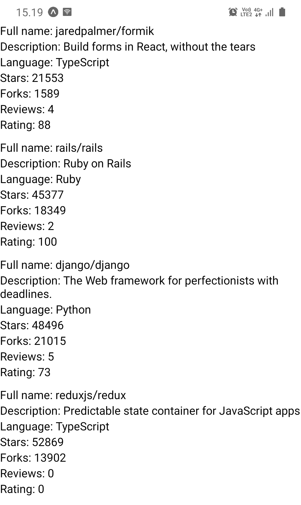
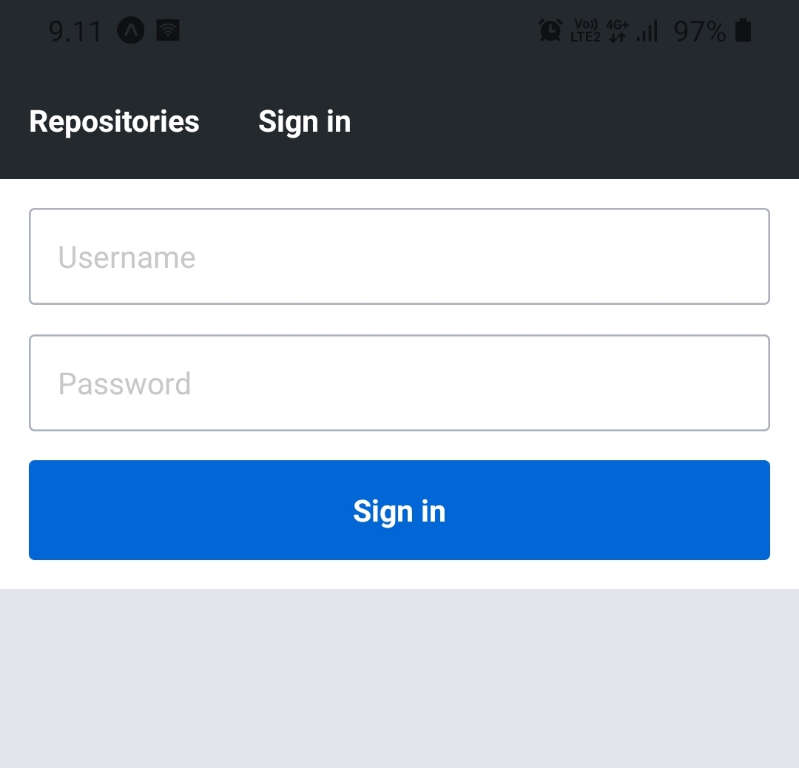
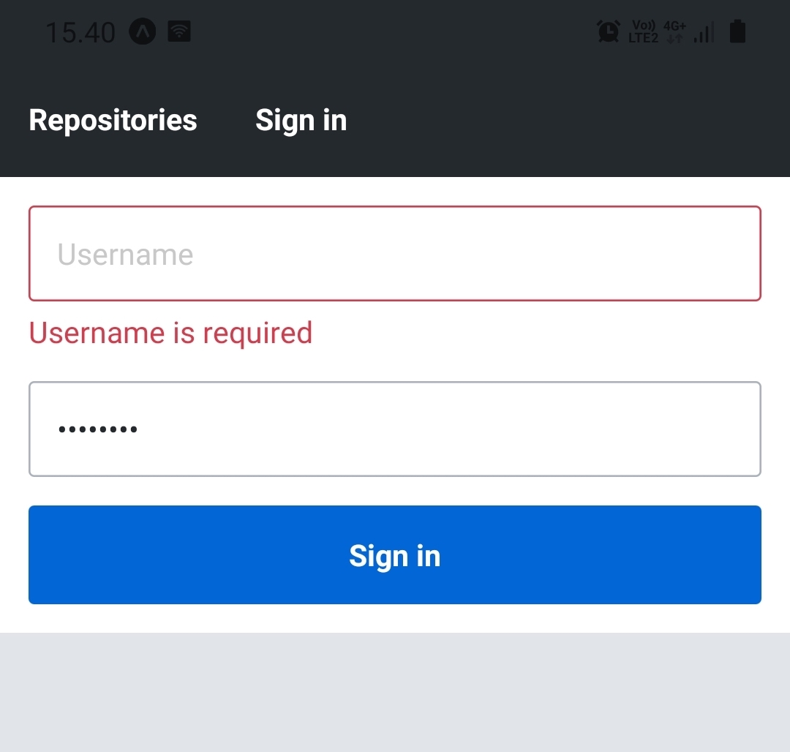

<div class="content">

الآن بعد أن قمنا بإعداد بيئة التطوير الخاصة بنا، يمكننا الدخول في أساسيات React Native والبدء في تطوير تطبيقنا. في هذا القسم، سنتعلم كيفية بناء واجهات المستخدم باستخدام مكونات React Native الأساسية، وكيفية إضافة خصائص التنسيق إلى هذه المكونات الأساسية، وكيفية الانتقال بين عروض الصفحات المختلفة، وكيفية إدارة حالة النماذج (Forms) بكفاءة وفاعلية.

### المكونات الأساسية (Core components)

في الأجزاء السابقة، تعلمنا أنه يمكننا استخدام React لتعريف المكونات كدوال تستقبل الخصائص (Props) كوسيط وتعيد شجرة من عناصر React. عادة ما يتم تمثيل هذه الشجرة باستخدام صيغة JSX. وفي بيئة المتصفح، استخدمنا مكتبة [ReactDOM](https://react.dev/reference/react-dom) لتحويل هذه المكونات إلى شجرة DOM يمكن تصييرها بواسطة المتصفح. إليك مثالاً عملياً لمكون بسيط للغاية:

```javascript
const HelloWorld = props => {
  return <div>Hello world!</div>;
};
```

يعيد المكون <em>HelloWorld</em> عنصر <i>div</i> واحداً تم إنشاؤه باستخدام صيغة JSX. ونتذكر أن صيغة JSX هذه يتم تجميعها وترجمتها إلى استدعاءات دالة <em>React.createElement</em>، مثل:

```javascript
React.createElement('div', null, 'Hello world!');
```

ينشئ هذا السطر البرمجي عنصر <i>div</i> بدون أي خصائص ومع عنصر فرعي وحيد عبارة عن نص <i>"Hello world"</i>. وعندما نقوم بتصيير هذا المكون في عنصر DOM جذري باستخدام دالة <em>ReactDOM.render</em> (أو createRoot)، فسيتم تصيير عنصر <i>div</i> كعنصر DOM المقابل له في المتصفح.

كما نرى، فإن React ليست مقيدة ببيئة معينة، مثل بيئة المتصفح؛ بل توجد مكتبات مثل ReactDOM يمكنها تصيير <i>مجموعة من المكونات المحددة مسبقاً</i>، مثل عناصر DOM، في بيئة محددة. وفي React Native، تسمى هذه المكونات المحددة مسبقاً بـ <i>المكونات الأساسية (Core components)</i>.

[المكونات الأساسية (Core components)](https://reactnative.dev/docs/intro-react-native-components) هي مجموعة من المكونات التي يوفرها React Native، والتي تستخدم خلف الكواليس المكونات الأصلية للمنصة المستهدفة. دعنا ننفذ المثال السابق باستخدام React Native:

```javascript
import { Text } from 'react-native'; // highlight-line

const HelloWorld = props => {
  return <Text>Hello world!</Text>; // highlight-line
};
```

إذن نستورد المكون [Text](https://reactnative.dev/docs/text) من React Native ونستبدل عنصر *div* بعنصر *Text*. العديد من عناصر DOM المألوفة لها "نظيراتها" في React Native. إليك بعض الأمثلة المختارة من [توثيق المكونات الأساسية لـ React Native](https://reactnative.dev/docs/components-and-apis):

- المكون [Text](https://reactnative.dev/docs/text) هو المكون <i>الوحيد</i> في React Native الذي يمكن أن يحتوي على عناصر نصية فرعية. وهو مشابه على سبيل المثال لعناصر _&lt;strong&gt;_ و _&lt;h1&gt;_ في الويب.
- المكون [View](https://reactnative.dev/docs/view) هو لبنة البناء الأساسية لواجهة المستخدم وهو مشابه لعنصر _&lt;div&gt;_.
- المكون [TextInput](https://reactnative.dev/docs/textinput) هو مكون حقل إدخال نصي مشابه لعنصر _&lt;input&gt;_.
- المكون [Pressable](https://reactnative.dev/docs/pressable) مخصص لالتقاط أحداث الضغط واللمس المختلفة، وهو مشابه على سبيل المثال لعنصر _&lt;button&gt;_.

هناك بعض الاختلافات البارزة بين المكونات الأساسية وعناصر DOM. الاختلاف الأول هو أن المكون <em>Text</em> هو المكون <i>الوحيد</i> في React Native الذي يمكن أن يحتوي على نصوص كأبناء فرعيين له. هذا يعني أنه لا يمكنك، على سبيل المثال، استبدال المكون <em>Text</em> بالمكون <em>View</em> في المثال السابق لعرض نص بداخله مباشرة.

الاختلاف الملحوظ الثاني يتعلق بمعالجات الأحداث (Event handlers). أثناء العمل مع عناصر DOM، اعتدنا على إضافة معالجات أحداث مثل <em>onClick</em> إلى أي عنصر أساسي تقريباً مثل _&lt;div&gt;_ و _&lt;button&gt;_. أما في React Native، فيتعين علينا قراءة [توثيق API](https://reactnative.dev/docs/components-and-apis) بعناية لمعرفة معالجات الأحداث (وكذلك الخصائص الأخرى) التي يقبلها المكون. على سبيل المثال، يوفر المكون [Pressable](https://reactnative.dev/docs/pressable) خصائص للاستماع إلى أنواع مختلفة من أحداث الضغط. يمكننا على سبيل المثال استخدام خاصية [onPress](https://reactnative.dev/docs/pressable) الخاصة بالمكون للاستماع إلى أحداث الضغط:

```javascript
import { Text, Pressable, Alert } from 'react-native';

const PressableText = props => {
  return (
    <Pressable
      onPress={() => Alert.alert('You pressed the text!')}
    >
      <Text>You can press me</Text>
    </Pressable>
  );
};
```

الآن بعد أن أصبح لدينا فهم أساسي للمكونات الأساسية، دعنا نبدأ في إعطاء مشروعنا بعض الهيكلية والتنظيم. أنشئ مجلداً باسم <i>src</i> في المجلد الرئيسي لمشروعك، وداخل مجلد <i>src</i> أنشئ مجلداً باسم <i>components</i>. داخل مجلد <i>components</i>، أنشئ ملفاً باسم <i>Main.jsx</i> بالمحتوى التالي:

```javascript
import Constants from 'expo-constants';
import { Text, StyleSheet, View } from 'react-native';

const styles = StyleSheet.create({
  container: {
    marginTop: Constants.statusBarHeight,
    flexGrow: 1,
    flexShrink: 1,
  },
});

const Main = () => {
  return (
    <View style={styles.container}>
      <Text>Rate Repository Application</Text>
    </View>
  );
};

export default Main;
```

بعد ذلك، دعنا نستخدم المكون <em>Main</em> في المكون <em>App</em> في ملف <i>App.js</i> الموجود في المجلد الرئيسي لمشروعنا. استبدل المحتوى الحالي للملف بهذا:

```javascript
import Main from './src/components/Main';

const App = () => {
  return <Main />;
};

export default App;
```

### إعادة تحميل التطبيق يدوياً (Manually reloading the application)

كما رأينا، ستقوم Expo بإعادة تحميل التطبيق تلقائياً عندما نقوم بإجراء تغييرات على الشيفرة. ومع ذلك، قد تكون هناك أوقات لا تعمل فيها إعادة التحميل التلقائي ويتعين فيها إعادة تحميل التطبيق يدوياً. يمكن تحقيق ذلك من خلال قائمة المطورين المدمجة في التطبيق (In-app developer menu).

يمكنك الوصول إلى قائمة المطورين عن طريق هز جهازك المحمول الفعلي أو بتحديد "Shake Gesture" داخل قائمة Hardware في محاكي iOS Simulator. يمكنك أيضاً استخدام اختصار لوحة المفاتيح <em>⌘D</em> عندما يعمل تطبيقك في محاكي iOS Simulator، أو <em>⌘M</em> عند التشغيل في محاكي Android على نظام Mac OS، و <em>Ctrl+M</em> على أنظمة Windows و Linux.

بمجرد فتح قائمة المطورين، ما عليك سوى الضغط على "Reload" لإعادة تحميل التطبيق. وبعد إعادة تحميل التطبيق، من المفترض أن تعمل عمليات إعادة التحميل التلقائية بشكل طبيعي دون الحاجة إلى إعادة تحميل يدوية.

</div>

<div class="tasks">

### التمرين 10.3

#### التمرين 10.3: قائمة المستودعات التي تمت مراجعتها (the reviewed repositories list)

في هذا التمرين، سنقوم بتنفيذ الإصدار الأول من قائمة المستودعات التي تمت مراجعتها. يجب أن تحتوي القائمة على الاسم الكامل للمستودع، والوصف، واللغة، وعدد التفرعات (Forks)، وعدد النجوم (Stars)، ومتوسط التقييم، وعدد المراجعات. ولحسن الحظ، يوفر React Native مكوناً مفيداً للغاية لعرض قائمة البيانات، وهو المكون [FlatList](https://reactnative.dev/docs/flatlist).

قم بتنفيذ المكونين <em>RepositoryList</em> و <em>RepositoryItem</em> في ملفي مجلد <i>components</i> وهما <i>RepositoryList.jsx</i> و <i>RepositoryItem.jsx</i>. يجب أن يقوم المكون <em>RepositoryList</em> بتصيير المكون <em>FlatList</em>، ويجب أن يقوم <em>RepositoryItem</em> بتصيير عنصر واحد في القائمة (تلميح: استخدم خاصية [renderItem](https://reactnative.dev/docs/flatlist#required-renderitem) لمكون <em>FlatList</em>). استخدم ما يلي كأساس لملف <i>RepositoryList.jsx</i>:

```javascript
import { FlatList, View, StyleSheet } from 'react-native';

const styles = StyleSheet.create({
  separator: {
    height: 10,
  },
});

const repositories = [
  {
    id: 'jaredpalmer.formik',
    fullName: 'jaredpalmer/formik',
    description: 'Build forms in React, without the tears',
    language: 'TypeScript',
    forksCount: 1589,
    stargazersCount: 21553,
    ratingAverage: 88,
    reviewCount: 4,
    ownerAvatarUrl: 'https://avatars2.githubusercontent.com/u/4060187?v=4',
  },
  {
    id: 'rails.rails',
    fullName: 'rails/rails',
    description: 'Ruby on Rails',
    language: 'Ruby',
    forksCount: 18349,
    stargazersCount: 45377,
    ratingAverage: 100,
    reviewCount: 2,
    ownerAvatarUrl: 'https://avatars1.githubusercontent.com/u/4223?v=4',
  },
  {
    id: 'django.django',
    fullName: 'django/django',
    description: 'The Web framework for perfectionists with deadlines.',
    language: 'Python',
    forksCount: 21015,
    stargazersCount: 48496,
    ratingAverage: 73,
    reviewCount: 5,
    ownerAvatarUrl: 'https://avatars2.githubusercontent.com/u/27804?v=4',
  },
  {
    id: 'reduxjs.redux',
    fullName: 'reduxjs/redux',
    description: 'Predictable state container for JavaScript apps',
    language: 'TypeScript',
    forksCount: 13902,
    stargazersCount: 52869,
    ratingAverage: 0,
    reviewCount: 0,
    ownerAvatarUrl: 'https://avatars3.githubusercontent.com/u/13142323?v=4',
  },
];

const ItemSeparator = () => <View style={styles.separator} />;

const RepositoryList = () => {
  return (
    <FlatList
      data={repositories}
      ItemSeparatorComponent={ItemSeparator}
      // الخصائص الأخرى
    />
  );
};

export default RepositoryList;
```

<i>لا</i> تقم بتعديل محتويات المتغير <em>repositories</em>؛ فهو يحتوي على كل ما تحتاجه لإكمال هذا التمرين. قم بتصيير المكون <em>RepositoryList</em> داخل المكون <em>Main</em> الذي أضفناه سابقاً إلى ملف <i>Main.jsx</i>. يجب أن تبدو قائمة المستودعات التي تمت مراجعتها تقريباً كما يلي:



</div>

<div class="content">

### التنسيق والمظهر (Style)

الآن بعد أن أصبح لدينا فهم أساسي لكيفية عمل المكونات الأساسية ويمكننا استخدامها لبناء واجهة مستخدم بسيطة، فقد حان الوقت لإضافة بعض التنسيقات والأنماط. في [الجزء 2](/ar/part2/adding_styles_to_react_app)، تعلمنا أنه في بيئة المتصفح يمكننا تحديد خصائص نمط مكون React باستخدام CSS. كان لدينا خيار إما تحديد هذه الأنماط مضمنة في السطر باستخدام الخاصية <em>style</em> أو في ملف CSS مع محدد مناسب.

هناك العديد من أوجه التشابه في طريقة إرفاق خصائص النمط بالمكونات الأساسية لـ React Native والطريقة التي يتم بها إرفاقها بعناصر DOM. في React Native، تقبل معظم المكونات الأساسية خاصية تسمى <em>style</em>. تقبل خاصية <em>style</em> كائناً يحتوي على خصائص النمط وقيمها. هذه الخصائص هي في معظم الحالات مماثلة لتلك الموجودة في CSS، ومع ذلك، فإن أسماء الخصائص تُكتب بصيغة سنام الجمل <i>camelCase</i>. هذا يعني أن خصائص CSS مثل <em>padding-top</em> و <em>font-size</em> تُكتب كـ <em>paddingTop</em> و <em>fontSize</em>. إليك مثالاً بسيطاً على كيفية استخدام خاصية <em>style</em>:

```javascript
import { Text, View } from 'react-native';

const BigBlueText = () => {
  return (
    <View style={{ padding: 20 }}>
      <Text style={{ color: 'blue', fontSize: 24, fontWeight: '700' }}>
        Big blue text
      </Text>
    </View>
  );
};
```

بالإضافة إلى أسماء الخصائص، ربما لاحظت اختلافاً آخر في المثال؛ ففي CSS، تحتوي قيم الخصائص الرقمية عادةً على وحدة قياس مثل <i>px</i> أو <i>%</i> أو <i>em</i> أو <i>rem</i>. أما في React Native، فإن جميع قيم الخصائص المتعلقة بالأبعاد مثل <em>width</em> و <em>height</em> و <em>padding</em> و <em>margin</em> بالإضافة إلى أحجام الخطوط تكون <i>بدون وحدات قياس (Unitless)</i>. تمثل هذه القيم الرقمية بدون وحدات <i>بكسلات مستقلة عن الكثافة (Density-independent pixels - dp)</i>. في حال كنت تتساءل عن خصائص النمط المتاحة لمكونات أساسية معينة، راجع [ورقة الملاحظات لتنسيق React Native](https://github.com/vhpoet/react-native-styling-cheat-sheet).

بشكل عام، لا يُعتبر تحديد الأنماط والتنسيقات مباشرة في خاصية <em>style</em> فكرة جيدة؛ لأنه يجعل المكونات متضخمة وغير واضحة. بدلاً من ذلك، يجب علينا تحديد الأنماط خارج دالة تصيير المكون باستخدام الدالة [StyleSheet.create](https://reactnative.dev/docs/stylesheet#create). تقبل دالة <em>StyleSheet.create</em> وسيطاً واحداً عبارة عن كائن يتكون من كائنات أنماط مسماة، وتنشئ مرجع نمط StyleSheet من الكائن المعطى. إليك مثالاً على كيفية إعادة هيكلة المثال السابق باستخدام دالة <em>StyleSheet.create</em>:

```javascript
import { Text, View, StyleSheet } from 'react-native'; // highlight-line

// highlight-start
const styles = StyleSheet.create({
  container: {
    padding: 20,
  },
  text: {
    color: 'blue',
    fontSize: 24,
    fontWeight: '700',
  },
});
// highlight-end

const BigBlueText = () => {
  return (
    <View style={styles.container}> // highlight-line
      <Text style={styles.text}> // highlight-line
        Big blue text
      </Text>
    </View>
  );
};
```

نقوم بإنشاء كائني أنماط مسميين: <em>styles.container</em> و <em>styles.text</em>. وداخل المكون، يمكننا الوصول إلى كائنات أنماط محددة بنفس الطريقة التي نصل بها إلى أي مفتاح في كائن عادي.

بالإضافة إلى الكائن، تقبل خاصية <em>style</em> أيضاً مصفوفة من الكائنات. وفي حالة المصفوفة، يتم دمج الكائنات من اليسار إلى اليمين بحيث تكون للأسبقية لخصائص النمط اللاحقة. يعمل هذا بشكل تكراري (Recursively)، لذلك يمكن أن يكون لدينا على سبيل المثال مصفوفة تحتوي على مصفوفة من الأنماط وما إلى ذلك. وإذا كانت المصفوفة تحتوي على قيم يتم تقييمها على أنها خاطئة (Falsy)، مثل <em>null</em> أو <em>undefined</em>، فسيتم تجاهل هذه القيم. هذا يجعل من السهل تحديد <i>أنماط شرطية (Conditional styles)</i> على سبيل المثال، بناءً على قيمة خاصية معينة (Prop). إليك مثالاً على الأنماط الشرطية:

```javascript
import { Text, View, StyleSheet } from 'react-native';

const styles = StyleSheet.create({
  text: {
    color: 'grey',
    fontSize: 14,
  },
  blueText: {
    color: 'blue',
  },
  bigText: {
    fontSize: 24,
    fontWeight: '700',
  },
});

const FancyText = ({ isBlue, isBig, children }) => {
  const textStyles = [
    styles.text,
    isBlue && styles.blueText,
    isBig && styles.bigText,
  ];

  return <Text style={textStyles}>{children}</Text>;
};

const Main = () => {
  return (
    <>
      <FancyText>Simple text</FancyText>
      <FancyText isBlue>Blue text</FancyText>
      <FancyText isBig>Big text</FancyText>
      <FancyText isBig isBlue>
        Big blue text
      </FancyText>
    </>
  );
};
```

في المثال، نستخدم المعامل <em>&&</em> مع التعبير <em>condition && exprIfTrue</em>. ينتج هذا التعبير <em>exprIfTrue</em> إذا تم تقييم <em>condition</em> على أنه true، وإلا فإنه سينتج <em>condition</em>، وهو في هذه الحالة قيمة يتم تقييمها على أنها false. هذا اختصار واسع الاستخدام ومفيد للغاية. خيار آخر هو استخدام [المعامل الشرطي الثلاثي (Conditional operator)](https://developer.mozilla.org/en-US/docs/Web/JavaScript/Reference/Operators/Conditional_Operator) مثل:

```js
condition ? exprIfTrue : exprIfFalse
```

### واجهة مستخدم متناسقة باستخدام السمات (Consistent user interface with theming)

دعونا نلتزم بمفهوم التنسيق ولكن من منظور أوسع قليلاً. لقد استخدم معظمنا العديد من التطبيقات المختلفة وقد نتفق على أن إحدى السمات التي تصنع واجهة مستخدم جيدة هي <i>الاتساق والتناغم (Consistency)</i>. هذا يعني أن مظهر مكونات واجهة المستخدم مثل حجم الخط وعائلة الخط ولونه يتبع نمطاً موحداً ومتسقاً. ولتحقيق ذلك، يتعين علينا بطريقة ما <i>تحويل قيم خصائص النمط المختلفة إلى معايير ومتغيرات (Parametrize)</i>. وتُعرف هذه الطريقة بشكل شائع باسم <i>السمات (Theming)</i>.

قد يكون مستخدمو مكتبات واجهات المستخدم الشائعة مثل [Bootstrap](https://getbootstrap.com/docs/4.4/getting-started/theming/) و [Material UI](https://material-ui.com/customization/theming/) على دراية جيدة بالسمات (Theming). وعلى الرغم من اختلاف طرق تنفيذ السمات، إلا أن الفكرة الرئيسية هي دائماً استخدام متغيرات مثل <em>colors.primary</em> بدلاً من ["الأرقام والأكواد السحرية الثابتة"](<https://en.wikipedia.org/wiki/Magic_number_(programming)>) مثل <em>#0366d6</em> عند تحديد الأنماط. وهذا يؤدي إلى زيادة الاتساق والمرونة وسهولة التعديل.

دعونا نرى كيف يمكن للسمات أن تعمل عملياً في تطبيقنا. سنستخدم الكثير من النصوص باختلافات متعددة، مثل أحجام الخطوط والألوان المختلفة. ونظراً لأن React Native لا يدعم الأنماط العامة (Global styles)، فيجب علينا إنشاء مكون <em>Text</em> مخصص خاص بنا للحفاظ على اتساق المحتوى النصي. دعنا نبدأ بإضافة كائن تكوين السمة التالي في ملف <i>theme.js</i> في مجلد <i>src</i>:

```javascript
const theme = {
  colors: {
    textPrimary: '#24292e',
    textSecondary: '#586069',
    primary: '#0366d6',
  },
  fontSizes: {
    body: 14,
    subheading: 16,
  },
  fonts: {
    main: 'System',
  },
  fontWeights: {
    normal: '400',
    bold: '700',
  },
};

export default theme;
```

بعد ذلك، يجب علينا إنشاء مكون <em>Text</em> الفعلي الذي يستخدم تكوين هذه السمة. أنشئ ملف <i>Text.jsx</i> في مجلد <i>components</i> حيث توجد بالفعل مكوناتنا الأخرى. أضف المحتوى التالي إلى ملف <i>Text.jsx</i>:

```javascript
import { Text as NativeText, StyleSheet } from 'react-native';

import theme from '../theme';

const styles = StyleSheet.create({
  text: {
    color: theme.colors.textPrimary,
    fontSize: theme.fontSizes.body,
    fontFamily: theme.fonts.main,
    fontWeight: theme.fontWeights.normal,
  },
  colorTextSecondary: {
    color: theme.colors.textSecondary,
  },
  colorPrimary: {
    color: theme.colors.primary,
  },
  fontSizeSubheading: {
    fontSize: theme.fontSizes.subheading,
  },
  fontWeightBold: {
    fontWeight: theme.fontWeights.bold,
  },
});

const Text = ({ color, fontSize, fontWeight, style, ...props }) => {
  const textStyle = [
    styles.text,
    color === 'textSecondary' && styles.colorTextSecondary,
    color === 'primary' && styles.colorPrimary,
    fontSize === 'subheading' && styles.fontSizeSubheading,
    fontWeight === 'bold' && styles.fontWeightBold,
    style,
  ];

  return <NativeText style={textStyle} {...props} />;
};

export default Text;
```

الآن قمنا بتنفيذ مكون النص الخاص بنا. يحتوي مكون النص هذا على خيارات موحدة ومتسقة للون وحجم الخط ووزن الخط يمكننا استخدامها في أي مكان في تطبيقنا. يمكننا الحصول على أشكال مختلفة للنص باستخدام خصائص مختلفة هكذا:

```javascript
import Text from './Text';

const Main = () => {
  return (
    <>
      <Text>Simple text</Text>
      <Text style={{ paddingBottom: 10 }}>Text with custom style</Text>
      <Text fontWeight="bold" fontSize="subheading">
        Bold subheading
      </Text>
      <Text color="textSecondary">Text with secondary color</Text>
    </>
  );
};

export default Main;
```

لا تتردد في توسيع أو تعديل هذا المكون إذا شعرت برغبة في ذلك. قد يكون من الجيد أيضاً إنشاء مكونات نصية قابلة لإعادة الاستخدام مثل <em>Subheading</em> التي تستخدم مكون <em>Text</em>. واستمر أيضاً في توسيع وتعديل تكوين السمة مع تقدم تطبيقك.

### استخدام Flexbox لتخطيط الواجهة (Using flexbox for layout)

المفهوم الأخير الذي سنغطيه فيما يتعلق بالتنسيق هو تنفيذ التخطيطات باستخدام [flexbox](https://developer.mozilla.org/en-US/docs/Learn/CSS/CSS_layout/Flexbox). أولئك الذين هم أكثر دراية بـ CSS يعرفون أن flexbox لا يتعلق فقط بـ React Native، بل له العديد من حالات الاستخدام في تطوير الويب أيضاً. أولئك الذين يعرفون بالفعل كيفية عمل flexbox في تطوير الويب لن يتعلموا الكثير ربما من هذا القسم. ومع ذلك، دعونا نتعلم أو نراجع أساسيات flexbox.

فليكس بوكس (Flexbox) هو كيان تخطيط يتكون من مكونين منفصلين: <i>حاوية مرنة (Flex container)</i> وداخلها مجموعة من <i>العناصر المرنة (Flex items)</i>. تمتلك الحاوية المرنة مجموعة من الخصائص التي تتحكم في تدفق عناصرها وتوزيعها. ولجعل المكون حاوية مرنة، يجب تعيين خاصية النمط <em>display</em> على <em>flex</em> وهي القيمة الافتراضية لخاصية <em>display</em> في React Native. إليك مثالاً لحاوية مرنة:

```javascript
import { View, StyleSheet } from 'react-native';

const styles = StyleSheet.create({
  flexContainer: {
    flexDirection: 'row',
  },
});

const FlexboxExample = () => {
  return <View style={styles.flexContainer}>{/* ... */}</View>;
};
```

ربما تكون أهم خصائص الحاوية المرنة هي التالية:

- تتحكم خاصية [flexDirection](https://css-tricks.com/almanac/properties/f/flex-direction/) في الاتجاه الذي يتم فيه وضع العناصر المرنة داخل الحاوية. القيم الممكنة لهذه الخاصية هي <em>row</em>، و <em>row-reverse</em>، و <em>column</em> (القيمة الافتراضية)، و <em>column-reverse</em>. سيقوم اتجاه Flex وهو <em>row</em> بوضع العناصر المرنة من اليسار إلى اليمين، بينما يضعها <em>column</em> من الأعلى إلى الأسفل. الاتجاهات المعكوسة <em>\*-reverse</em> تعكس ببساطة ترتيب العناصر المرنة.

- تتحكم خاصية [justifyContent](https://css-tricks.com/almanac/properties/j/justify-content/) في محاذاة وتوزيع العناصر المرنة على طول المحور الرئيسي (المحدد بواسطة خاصية <em>flexDirection</em>). القيم الممكنة لهذه الخاصية هي <em>flex-start</em> (القيمة الافتراضية)، و <em>flex-end</em>، و <em>center</em>، و <em>space-between</em>، و <em>space-around</em>، و <em>space-evenly</em>.
- تقوم خاصية [alignItems](https://css-tricks.com/almanac/properties/a/align-items/) بنفس الشيء مثل <em>justifyContent</em> ولكن بالنسبة للمحور المعاكس (المحور العمودي). القيم الممكنة لهذه الخاصية هي <em>flex-start</em>، و <em>flex-end</em>، و <em>center</em>، و <em>baseline</em>، و <em>stretch</em> (القيمة الافتراضية).

دعونا ننتقل إلى العناصر المرنة (Flex items). كما ذكرنا، يمكن أن تحتوي الحاوية المرنة على عنصر مرن واحد أو عدة عناصر مرنة. تمتلك العناصر المرنة خصائص تتحكم في كيفية تصرفها بالنسبة للعناصر المرنة الأخرى في نفس الحاوية المرنة. لجعل المكون عنصراً مرناً، كل ما عليك فعله هو تعيينه كابن مباشر لحاوية مرنة:

```javascript
import { View, Text, StyleSheet } from 'react-native';

const styles = StyleSheet.create({
  flexContainer: {
    display: 'flex',
  },
  flexItemA: {
    flexGrow: 0,
    backgroundColor: 'green',
  },
  flexItemB: {
    flexGrow: 1,
    backgroundColor: 'blue',
  },
});

const FlexboxExample = () => {
  return (
    <View style={styles.flexContainer}>
      <View style={styles.flexItemA}>
        <Text>Flex item A</Text>
      </View>
      <View style={styles.flexItemB}>
        <Text>Flex item B</Text>
      </View>
    </View>
  );
};
```

إحدى الخصائص الأكثر استخداماً للعناصر المرنة هي خاصية [flexGrow](https://css-tricks.com/almanac/properties/f/flex-grow/). إنها تقبل قيمة رقمية بدون وحدات تحدد قدرة العنصر المرن على التمدد والنمو إذا لزم الأمر. وإذا كانت جميع العناصر المرنة تحتوي على <em>flexGrow</em> بقيمة <em>1</em>، فسوف تتشارك كل المساحة المتاحة بالتساوي. وإذا كان للعنصر المرن <em>flexGrow</em> بقيمة <em>0</em>، فسيستخدم فقط المساحة التي يتطلبها محتواه ويترك باقي المساحة للعناصر المرنة الأخرى.

هنا يمكنك معرفة كيفية تبسيط التخطيطات باستخدام خاصية الفجوة: [Flexbox gap](https://reactnative.dev/blog/2023/01/12/version-071#simplifying-layouts-with-flexbox-gap).

بعد ذلك، اقرأ مقال [دليل شامل لـ Flexbox](https://css-tricks.com/snippets/css/a-guide-to-flexbox/) الذي يحتوي على أمثلة مرئية شاملة لـ flexbox. ومن الجيد أيضاً تجربة خصائص flexbox في [Flexbox Playground](https://flexbox.tech/) لترى كيف تؤثر خصائص flexbox المختلفة على التخطيط. تذكر أنه في React Native تكون أسماء الخصائص هي نفسها الموجودة في CSS باستثناء تسمية <i>camelCase</i>. ومع ذلك، فإن <i>قيم الخصائص</i> مثل <em>flex-start</em> و <em>space-between</em> متطابقة تماماً.

**ملاحظة هامة (NB):** توجد بعض الاختلافات بين React Native و CSS فيما يتعلق بـ flexbox. الاختلاف الأكثر أهمية هو أنه في React Native تكون القيمة الافتراضية لخاصية <em>flexDirection</em> هي <em>column</em> (بدلاً من row في الويب). ومن الجدير بالذكر أيضاً أن اختصار <em>flex</em> لا يقبل قيماً متعددة في React Native. يمكن قراءة المزيد حول تنفيذ flexbox في React Native في [التوثيق](https://reactnative.dev/docs/flexbox).

</div>

<div class="tasks">

### التمارين 10.4 - 10.5

#### التمرين 10.4: شريط التطبيق العلوي (the app bar)

سنحتاج قريباً إلى التنقل بين العروض والصفحات المختلفة في تطبيقنا. ولهذا السبب نحتاج إلى [شريط تطبيق (App bar)](https://material.io/components/app-bars-top/) لعرض علامات التبويب للتبديل بين الصفحات المختلفة. أنشئ ملف <i>AppBar.jsx</i> في مجلد <i>components</i> بالمحتوى التالي:

```javascript
import { View, StyleSheet } from 'react-native';
import Constants from 'expo-constants';

const styles = StyleSheet.create({
  container: {
    paddingTop: Constants.statusBarHeight,
    // ...
  },
  // ...
});

const AppBar = () => {
  return <View style={styles.container}>{/* ... */}</View>;
};

export default AppBar;
```

الآن بعد أن يمنع المكون <em>AppBar</em> شريط الحالة (Status bar) من التداخل مع المحتوى، يمكنك إزالة نمط <em>marginTop</em> الذي أضفناه للمكون <em>Main</em> سابقاً في ملف <i>Main.jsx</i>. يجب أن يحتوي المكون <em>AppBar</em> حالياً على علامة تبويب بالنص <em>"Repositories"</em>. اجعل علامة التبويب قابلة للضغط باستخدام المكون [Pressable](https://reactnative.dev/docs/pressable) ولكن ليس عليك معالجة حدث <em>onPress</em> بأي شكل من الأشكال الآن. أضف المكون <em>AppBar</em> إلى المكون <em>Main</em> بحيث يكون هو المكون الأعلى على الشاشة. يجب أن يبدو المكون <em>AppBar</em> كالتالي تقريباً:


لون خلفية شريط التطبيق في الصورة هو <em>#24292e</em> ولكن يمكنك استخدام أي لون آخر أيضاً. قد تكون فكرة جيدة إضافة لون خلفية شريط التطبيق إلى تكوين السمة (Theme) بحيث يسهل تغييره إذا لزم الأمر. قد تكون هناك فكرة جيدة أخرى تتمثل في فصل علامة تبويب شريط التطبيق إلى مكون منفصل مثل <em>AppBarTab</em> بحيث يسهل إضافة علامات تبويب جديدة في المستقبل.

#### التمرين 10.5: تحسين وتنسيق قائمة المستودعات التي تمت مراجعتها (polished reviewed repositories list)

يبدو الإصدار الحالي من قائمة المستودعات التي تمت مراجعتها بسيطاً للغاية وبحاجة للتحسين. قم بتعديل المكون <i>RepositoryItem</i> بحيث يعرض أيضاً صورة الأفاتار لمؤلف المستودع. يمكنك تنفيذ ذلك باستخدام المكون [Image](https://reactnative.dev/docs/image). ويجب عرض الأعداد الأكبر من أو المساوية لـ 1000، مثل عدد النجوم والتفرعات، بالآلاف بدقة رقم عشري واحد ومع اللاحقة "k". هذا يعني أنه على سبيل المثال يجب عرض عدد تفرعات 8439 كـ "8.4k". وقم أيضاً بتنسيق المظهر العام للمكون بحيث تبدو قائمة المستودعات التي تمت مراجعتها كما يلي تقريباً:


في الصورة، تم تعيين لون خلفية المكون <em>Main</em> على <em>#e1e4e8</em> بينما تم تعيين لون خلفية المكون <em>RepositoryItem</em> على <em>white</em>. لون خلفية شارة لغة البرمجة هو <em>#0366d6</em> وهي قيمة المتغير <em>colors.primary</em> في تكوين السمة. تذكر الاستفادة من المكون <em>Text</em> الذي قمنا بتنفيذه سابقاً. وعند الحاجة، قسّم المكون <em>RepositoryItem</em> إلى مكونات أصغر.

</div>

<div class="content">

### التوجيه والتنقل بين الصفحات (Routing)

عندما نبدأ في توسيع تطبيقنا، سنحتاج إلى طريقة للانتقال بين العروض والصفحات المختلفة مثل عرض المستودعات وعرض تسجيل الدخول. في [الجزء 7](/ar/part7/react_router)، تعرفنا على مكتبة [React Router](https://reactrouter.com/) وتعلمنا كيفية استخدامها لتنفيذ التوجيه في تطبيقات الويب.

يختلف التوجيه في تطبيق React Native قليلاً عن التوجيه في تطبيق الويب. الاختلاف الرئيسي هو أننا لا نستطيع الإشارة إلى الصفحات باستخدام عناوين URL التي نكتبها في شريط عنوان المتصفح، ولا يمكننا التنقل ذهاباً وإياباً عبر سجل تاريخ المستخدم باستخدام [واجهة History API للمتصفح](https://developer.mozilla.org/en-US/docs/Web/API/History_API). ومع ذلك، فهذه مجرد مسألة تتعلق بواجهة الموجه التي نستخدمها.

مع React Native، يمكننا استخدام النواة الأساسية الكاملة لـ React Router، بما في ذلك الخطافات (Hooks) والمكونات. الاختلاف الوحيد عن بيئة المتصفح هو أنه يجب علينا استبدال <em>BrowserRouter</em> بـ [NativeRouter](https://reactrouter.com/en/6.4.5/router-components/native-router) المتوافق مع React Native، والذي توفره مكتبة [react-router-native](https://www.npmjs.com/package/react-router-native). دعونا نبدأ بتثبيت مكتبة <i>react-router-native</i>:

```shell
npm install react-router-native
```

بعد ذلك، افتح ملف <i>App.js</i> وأضف المكون <em>NativeRouter</em> إلى المكون <em>App</em>:

```javascript
import { StatusBar } from 'expo-status-bar';
import { NativeRouter } from 'react-router-native'; // highlight-line

import Main from './src/components/Main';

const App = () => {
  return (
    // highlight-start
    <>
      <NativeRouter>
        <Main />
      </NativeRouter>
      <StatusBar style="auto" />
    </>
    // highlight-end
  );
};

export default App;
```

بمجرد وجود الموجه في مكانه، دعنا نضيف مسارنا الأول إلى المكون <em>Main</em> في ملف <i>Main.jsx</i>:

```javascript
import { StyleSheet, View } from 'react-native';
import { Route, Routes, Navigate } from 'react-router-native'; // highlight-line

import RepositoryList from './RepositoryList';
import AppBar from './AppBar';
import theme from '../theme';

const styles = StyleSheet.create({
  container: {
    backgroundColor: theme.colors.mainBackground,
    flexGrow: 1,
    flexShrink: 1,
  },
});

const Main = () => {
  return (
    <View style={styles.container}>
      <AppBar />
      // highlight-start
      <Routes>
        <Route path="/" element={<RepositoryList />} />
        <Route path="*" element={<Navigate to="/" replace />} />
      </Routes>
      // highlight-end
    </View>
  );
};

export default Main;
```

هذا كل شيء! المسار الأخير <em>Route</em> داخل <em>Routes</em> مخصص لالتقاط المسارات التي لا تتطابق مع أي مسار محدد مسبقاً. في هذه الحالة، نريد الانتقال إلى العرض الرئيسي (Home view).

</div>

<div class="tasks">

### التمارين 10.6 - 10.7

#### التمرين 10.6: عرض تسجيل الدخول (the sign-in view)

سنقوم قريباً بتنفيذ نموذج يمكن للمستخدم استخدامه لـ <i>تسجيل الدخول</i> إلى تطبيقنا. قبل ذلك، يجب علينا تنفيذ عرض يمكن الوصول إليه من شريط التطبيق. أنشئ ملف <i>SignIn.jsx</i> في مجلد <i>components</i> بالمحتوى التالي:

```javascript
import Text from './Text';

const SignIn = () => {
  return <Text>The sign-in view</Text>;
};

export default SignIn;
```

قم بإعداد مسار لمكون <em>SignIn</em> هذا في المكون <em>Main</em>. وأضف أيضاً علامة تبويب بالنص "Sign in" إلى شريط التطبيق بجوار علامة التبويب "Repositories". يجب أن يكون المستخدمون قادرين على التنقل بين العرضين عن طريق الضغط على علامات التبويب (تلميح: يمكنك استخدام مكون [Link](https://reactrouter.com/6.4.5/components/link-native) الخاص بـ React Router).

#### التمرين 10.7: شريط تطبيق قابل للتمرير (scrollable app bar)

مع إضافة المزيد من علامات التبويب إلى شريط التطبيق الخاص بنا، فمن الجيد السماح بالتمرير الأفقي بمجرد ألا تتسع علامات التبويب للشاشة. المكون [ScrollView](https://reactnative.dev/docs/scrollview) هو المكون المناسب تماماً لهذه الوظيفة.

قم بتغليف علامات التبويب في المكون <em>AppBar</em> باستخدام المكون <em>ScrollView</em>:

```javascript
const AppBar = () => {
  return (
    <View style={styles.container}>
      <ScrollView horizontal>{/* ... */}</ScrollView> // highlight-line
    </View>
  );
};
```

سيؤدي تعيين الخاصية [horizontal](https://reactnative.dev/docs/scrollview#horizontal) على <em>true</em> إلى جعل المكون <em>ScrollView</em> يقوم بالتمرير أفقياً بمجرد عدم اتساع المحتوى للشاشة. لاحظ أنك ستحتاج إلى إضافة خصائص نمط مناسبة إلى المكون <em>ScrollView</em> بحيث يتم وضع علامات التبويب في <i>صف (row)</i> داخل الحاوية المرنة. يمكنك التأكد من إمكانية تمرير شريط التطبيق أفقياً عن طريق إضافة علامات تبويب مؤقتة حتى لا تتسع علامة التبويب الأخيرة للشاشة. فقط تذكر إزالة علامات التبويب الإضافية بمجرد أن يعمل شريط التطبيق كما هو منشود.

</div>

<div class="content">

### إدارة حالة النماذج (Form state management)

الآن بعد أن أصبح لدينا عنصر نائب لعرض تسجيل الدخول، ستكون الخطوة التالية هي تنفيذ نموذج تسجيل الدخول. قبل أن نصل إلى ذلك، دعونا نتحدث عن النماذج من منظور أوسع.

يعتمد تنفيذ النماذج بشكل كبير على إدارة الحالة (State management). قد يؤدي استخدام خطاف <em>useState</em> في React لإدارة الحالة إلى إنجاز المهمة للنماذج الصغيرة. ومع ذلك، فإنه سيجعل إدارة الحالة للنماذج الأكثر تعقيداً أمراً مرهقاً للغاية وبسرعة. ولحسن الحظ، هناك العديد من المكتبات الممتازة في نظام React البيئي التي تسهل إدارة حالة النماذج، وإحدى هذه المكتبات هي [Formik](https://formik.org/).

المفاهيم الرئيسية لـ Formik هي <i>السياق (Context)</i> و <i>الحقل (Field)</i>. ومع ذلك، فإن أسهل طريقة لإرسال نموذج بسيط هي باستخدام الخطاف useFormik(). إنه خطاف React مخصص سيعيد جميع حالات ومساعدات Formik مباشرة.

هناك بعض الإرشادات المتعلقة باستخدام useFormik(). اقرأ هذا للتعرف على [useFormik()](https://formik.org/docs/api/useFormik).

دعونا نرى كيف يعمل هذا من خلال إنشاء نموذج لحساب [مؤشر كتلة الجسم (BMI)](https://en.wikipedia.org/wiki/Body_mass_index):

```javascript
import { Text, TextInput, Pressable, View } from 'react-native';
import { useFormik } from 'formik';

const initialValues = {
  mass: '',
  height: '',
};

const getBodyMassIndex = (mass, height) => {
  return Math.round(mass / Math.pow(height, 2));
};

const BodyMassIndexForm = ({ onSubmit }) => {
  const formik = useFormik({
    initialValues,
    onSubmit,
  });

  return (
    <View>
      <TextInput
        placeholder="Weight (kg)"
        value={formik.values.mass}
        onChangeText={formik.handleChange('mass')}
      />
      <TextInput
        placeholder="Height (m)"
        value={formik.values.height}
        onChangeText={formik.handleChange('height')}
      />
      <Pressable onPress={formik.handleSubmit}>
        <Text>Calculate</Text>
      </Pressable>
    </View>
  );
};

const BodyMassIndexCalculator = () => {
  const onSubmit = values => {
    const mass = parseFloat(values.mass);
    const height = parseFloat(values.height);

    if (!isNaN(mass) && !isNaN(height) && height !== 0) {
      console.log(`Your body mass index is: ${getBodyMassIndex(mass, height)}`);
    }
  };

  return <BodyMassIndexForm onSubmit={onSubmit} />;
};

export default BodyMassIndexCalculator;
```

هذا المثال ليس جزءاً من تطبيقنا الفعلي، لذا لا تحتاج إلى إضافة هذه الشيفرة إلى التطبيق. ومع ذلك، يمكنك تجربتها على سبيل المثال في [Expo Snack](https://snack.expo.io/). Expo Snack هو محرر تفاعلي عبر الإنترنت لـ React Native، مشابه لـ [JSFiddle](https://jsfiddle.net/) و [CodePen](https://codepen.io/). إنها منصة مفيدة لتجربة الشيفرات البرمجية بسرعة. يمكنك مشاركة Expo Snacks مع الآخرين باستخدام رابط أو تضمينها كـ <i>Snack Player</i> في موقع ويب.

</div>

<div class="tasks">

### التمرين 10.8

#### التمرين 10.8: نموذج تسجيل الدخول (the sign-in form)

قم بتنفيذ نموذج تسجيل الدخول في المكون <em>SignIn</em> الذي أضفناه سابقاً في ملف <i>SignIn.jsx</i>. يجب أن يتضمن نموذج تسجيل الدخول حقلي نص، أحدهما لاسم المستخدم والآخر لكلمة المرور. ويجب أن يكون هناك أيضاً زر لإرسال النموذج. لا تحتاج إلى تنفيذ دالة استدعاء <em>onSubmit</em> فعلية مع الخادم، ويكفي تسجيل قيم النموذج باستخدام <em>console.log</em> عند إرسال النموذج:

```javascript
const onSubmit = (values) => {
  console.log(values);
};
```

الخطوة الأولى هي تثبيت Formik:

```shell
npm install formik
```

يمكنك استخدام الخاصية [secureTextEntry](https://reactnative.dev/docs/textinput#securetextentry) في المكون <em>TextInput</em> لإخفاء مدخلات كلمة المرور بنجوم أو نقاط.

يجب أن يبدو نموذج تسجيل الدخول كما يلي تقريباً:



</div>

<div class="content">

### التحقق من صحة النماذج (Form validation)

تقدم Formik طريقتين للتحقق من صحة النموذج: دالة التحقق (Validation function) أو مخطط التحقق (Validation schema). دالة التحقق هي دالة يتم تقديمها لمكون <em>Formik</em> كقيمة لخاصية [validate](https://formik.org/docs/guides/validation#validate). وتستقبل قيم النموذج كوسيط وتعيد كائناً يحتوي على رسائل الخطأ المحتملة الخاصة بكل حقل.

النهج الثاني هو مخطط التحقق الذي يتم تقديمه لمكون <em>Formik</em> كقيمة لخاصية [validationSchema](https://formik.org/docs/guides/validation#validationschema). يمكن إنشاء مخطط التحقق هذا باستخدام مكتبة تحقق تسمى [Yup](https://github.com/jquense/yup). دعونا نبدأ بتثبيت Yup:

```shell
npm install yup
```

بعد ذلك، وعلى سبيل المثال، دعنا ننشئ مخطط تحقق لنموذج مؤشر كتلة الجسم الذي نفذناه سابقاً. نريد التحقق من وجود كلا الحقلي <em>mass</em> و <em>height</em> وأنهما حقول رقمية. أيضاً، يجب أن تكون قيمة <em>mass</em> أكبر من أو تساوي 1 وقيمة <em>height</em> أكبر من أو تساوي 0.5. إليك كيفية تعريف المخطط:

```javascript
import * as yup from 'yup'; // highlight-line

// ...

// highlight-start
const validationSchema = yup.object().shape({
  mass: yup
    .number()
    .min(1, 'Weight must be greater or equal to 1')
    .required('Weight is required'),
  height: yup
    .number()
    .min(0.5, 'Height must be greater or equal to 0.5')
    .required('Height is required'),
});
// highlight-end

const BodyMassIndexForm = ({ onSubmit }) => {
  const formik = useFormik({
    initialValues,
    // highlight-start
    validationSchema,
    // highlight-end
    onSubmit,
  });

  return (
    <View>
      <TextInput
        placeholder="Weight (kg)"
        value={formik.values.mass}
        onChangeText={formik.handleChange('mass')}
        onBlur={formik.handleBlur('mass')}
      />
      {formik.touched.mass && formik.errors.mass && (
        <Text style={{ color: 'red' }}>{formik.errors.mass}</Text>
      )}
      <TextInput
        placeholder="Height (m)"
        value={formik.values.height}
        onChangeText={formik.handleChange('height')}
        onBlur={formik.handleBlur('height')}
      />
      {formik.touched.height && formik.errors.height && (
        <Text style={{ color: 'red' }}>{formik.errors.height}</Text>
      )}
      <Pressable onPress={formik.handleSubmit}>
        <Text>Calculate</Text>
      </Pressable>
    </View>
  );
};

const BodyMassIndexCalculator = () => {
  // ...
```

كن على علم بأنك بحاجة إلى تضمين مكونات Text هذه داخل View الذي يعيده النموذج لعرض أخطاء التحقق من الصحة:

```javascript
 {formik.touched.mass && formik.errors.mass && (
  <Text style={{ color: 'red' }}>{formik.errors.mass}</Text>
 )}
```

```javascript
 {formik.touched.height && formik.errors.height && (
  <Text style={{ color: 'red' }}>{formik.errors.height}</Text>
 )}
```

يتم إجراء التحقق من الصحة افتراضياً في كل مرة تتغير فيها قيمة الحقل وعند استدعاء دالة <em>handleSubmit</em>. وإذا فشل التحقق من الصحة، فلن يتم استدعاء الدالة المقدمة لخاصية <em>onSubmit</em> الخاصة بمكون <em>Formik</em>.

</div>

<div class="tasks">

### التمرين 10.9

#### التمرين 10.9: التحقق من صحة نموذج تسجيل الدخول (validating the sign-in form)

تحقق من صحة نموذج تسجيل الدخول بحيث يكون كلا حقلي اسم المستخدم وكلمة المرور مطلوبين وإلزاميين. لاحظ أن دالة رد الاتصال <em>onSubmit</em> المنفذة في التمرين السابق، <i>يجب ألا يتم استدعاؤها</i> إذا فشل التحقق من صحة النموذج.

يجب أن يعرض التنفيذ الحالي لمكون <em>TextInput</em> رسالة خطأ إذا كان الحقل الذي تم لمسه والتفاعل معه يحتوي على خطأ. قم بتمييز رسالة الخطأ هذه بإعطائها لوناً أحمر.

بالإضافة إلى رسالة الخطأ الحمراء، امنح الحقل غير الصالح مؤشراً مرئياً على وجود خطأ عن طريق إعطائه لون إطار أحمر (Red border color).

إليك ما يجب أن يبدو عليه نموذج تسجيل الدخول تقريباً مع وجود حقل غير صالح:



اللون الأحمر المستخدم في هذا التنفيذ هو <em>#d73a4a</em>.

</div>

<div class="content">

### الشيفرة البرمجية المخصصة للمنصة (Platform-specific code)

تتمثل إحدى المزايا الرائعة لـ React Native في أننا لا داعي للقلق بشأن ما إذا كان التطبيق يعمل على جهاز Android أو iOS. ومع ذلك، قد تكون هناك حالات نحتاج فيها إلى تنفيذ <i>شيفرة مخصصة لمنصة محددة (Platform-specific code)</i>. يمكن أن تكون هذه الحالات على سبيل المثال استخدام تنفيذ مختلف لمكون على منصة مختلفة.

يمكننا الوصول إلى نظام تشغيل المستخدم عبر الثابت <em>Platform.OS</em>:

```javascript
import { React } from 'react';
import { Platform, Text, StyleSheet } from 'react-native';

const styles = StyleSheet.create({
  text: {
    color: Platform.OS === 'android' ? 'green' : 'blue',
  },
});

const WhatIsMyPlatform = () => {
  return <Text style={styles.text}>Your platform is: {Platform.OS}</Text>;
};
```

القيم الممكنة لثوابت <em>Platform.OS</em> هي <em>android</em> و <em>ios</em>. وهناك طريقة أخرى مفيدة لتحديد فروع الشيفرة المخصصة للمنصة وهي استخدام الدالة <em>Platform.select</em>. بالنظر إلى كائن حيث تكون المفاتيح واحدة من <em>ios</em> و <em>android</em> و <em>native</em> و <em>default</em>، تعيد الدالة <em>Platform.select</em> القيمة الأكثر ملاءمة للمنصة التي يعمل عليها المستخدم حالياً. يمكننا إعادة كتابة متغير <em>styles</em> في المثال السابق باستخدام دالة <em>Platform.select</em> هكذا:

```javascript
const styles = StyleSheet.create({
  text: {
    color: Platform.select({
      android: 'green',
      ios: 'blue',
      default: 'black',
    }),
  },
});
```

يمكننا حتى استخدام دالة <em>Platform.select</em> لطلب واستيراد مكون خاص بمنصة معينة:

```javascript
const MyComponent = Platform.select({
  ios: () => require('./MyIOSComponent'),
  android: () => require('./MyAndroidComponent'),
})();

<MyComponent />;
```

ومع ذلك، فإن الطريقة الأكثر تطوراً وتنظيماً لتنفيذ واستيراد المكونات الخاصة بالمنصة (أو أي جزء آخر من الشيفرة) هي استخدام امتدادات الملفات <i>.ios.jsx</i> و <i>.android.jsx</i>. لاحظ أن الامتداد <i>.jsx</i> يمكن أن يكون أيضاً امتداداً آخر يتعرف عليه مجمّع الحزم، مثل <i>.js</i>. يمكننا على سبيل المثال الحصول على ملفي <i>Button.ios.jsx</i> و <i>Button.android.jsx</i> والتي يمكننا استيرادها هكذا:

```javascript
import Button from './Button';

const PlatformSpecificButton = () => {
  return <Button />;
};
```

الآن، ستحتوي حزمة Android الخاصة بالتطبيق على المكون المحدد في ملف <i>Button.android.jsx</i> بينما ستحتوي حزمة iOS على المكون المحدد في ملف <i>Button.ios.jsx</i> تلقائياً عند التجميع.

</div>

<div class="tasks">

### التمرين 10.10

#### التمرين 10.10: خط خاص بالمنصة (a platform-specific font)

حالياً، تم تعيين عائلة الخطوط لتطبيقنا على <i>System</i> في تكوين السمة الموجود في ملف <i>theme.js</i>. بدلاً من خط <i>System</i>، استخدم خط [Sans-serif](https://en.wikipedia.org/wiki/Sans-serif) مخصصاً للمنصة. على منصة Android، استخدم خط <i>Roboto</i>، وعلى منصة iOS، استخدم خط <i>Arial</i>. ويمكن أن يكون الخط الافتراضي هو <i>System</i>.

كان هذا آخر تمرين في هذا القسم. حان الوقت لرفع شيفرتك البرمجية إلى GitHub وتحديد جميع تمارينك المكتملة في [نظام تسليم التمارين](https://studies.cs.helsinki.fi/stats/courses/fs-react-native-2020). لاحظ أن التمارين في هذا القسم يجب تسليمها إلى القسم المسمى part 2 في نظام تسليم التمارين.
</div>
