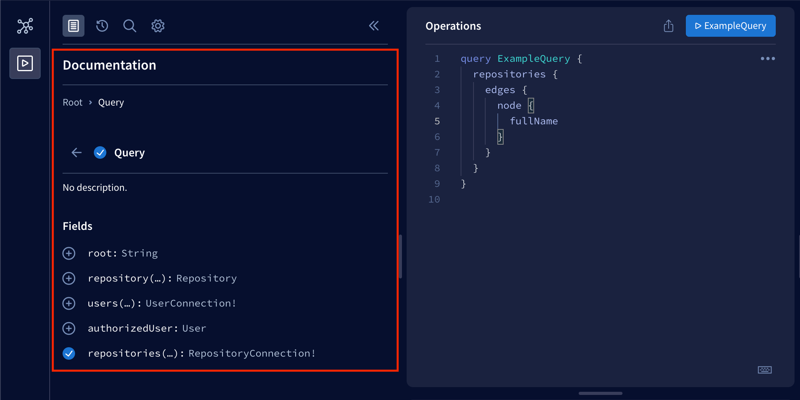
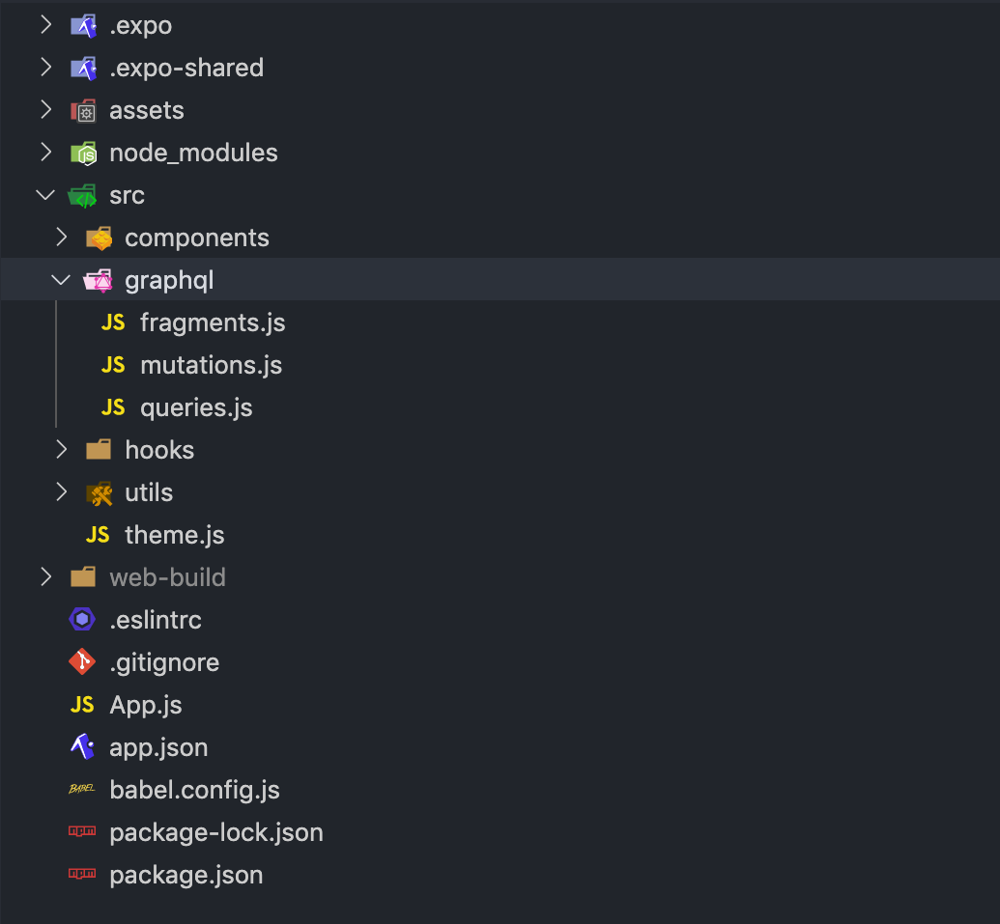

<div class="content">

حتى الآن، قمنا بتنفيذ ميزات في تطبيقنا دون أي تواصل فعلي مع الخادم. على سبيل المثال، تستخدم قائمة المستودعات التي تمت مراجعتها والتي قمنا بتنفيذها بيانات وهمية (Mock data)، ولا يرسل نموذج تسجيل الدخول بيانات اعتماد المستخدم إلى أي نقطة نهاية للمصادقة. في هذا القسم، سنتعلم كيفية التواصل مع الخادم باستخدام طلبات HTTP، وكيفية استخدام Apollo Client في تطبيق React Native، وكيفية تخزين البيانات في جهاز المستخدم.

سنتعلم قريباً كيفية التواصل مع الخادم في تطبيقنا. قبل أن نصل إلى ذلك، نحتاج إلى خادم للتواصل معه. ولهذا الغرض، لدينا خادم مكتمل تم تنفيذه في مستودع [rate-repository-api](https://github.com/fullstack-hy2020/rate-repository-api). يلبي خادم rate-repository-api جميع احتياجات واجهة برمجة التطبيقات (API) لتطبيقنا خلال هذا الجزء. ويستخدم قاعدة بيانات [SQLite](https://www.sqlite.org/index.html) التي لا تحتاج إلى أي إعداد ويوفر واجهة Apollo GraphQL API جنباً إلى جنب مع بعض نقاط نهاية REST API.

قبل المضي قدماً في المادة، قم بإعداد خادم rate-repository-api باتباع إرشادات الإعداد في ملف [README](https://github.com/fullstack-hy2020/rate-repository-api/blob/master/README.md) الخاص بالمستودع. لاحظ أنه إذا كنت تستخدم محاكياً للتطوير، فيوصى بتشغيل الخادم والمحاكي <i>على نفس جهاز الكمبيوتر</i>؛ فهذا يسهل طلبات الشبكة بشكل كبير.

### طلبات HTTP (HTTP requests)

يوفر React Native واجهة [Fetch API](https://developer.mozilla.org/en-US/docs/Web/API/Fetch_API) لإجراء طلبات HTTP في تطبيقاتنا. كما يدعم React Native أيضاً واجهة [XMLHttpRequest API](https://developer.mozilla.org/en-US/docs/Web/API/XMLHttpRequest) المألوفة القديمة والتي تجعل من الممكن استخدام مكتبات الطرف الثالث مثل [Axios](https://github.com/axios/axios). واجهات برمجة التطبيقات هذه هي نفسها الموجودة في بيئة المتصفح وهي متاحة بشكل عام (Globally) دون الحاجة إلى استيراد.

من المرجح أن يتفق الأشخاص الذين استخدموا كلاً من Fetch API و XMLHttpRequest API على أن Fetch API أسهل في الاستخدام وأكثر حداثة. ومع ذلك، هذا لا يعني أن XMLHttpRequest API ليس لها استخداماتها. ولتسهيل الأمور وتبسيطها، سنستخدم فقط Fetch API في أمثلتنا.

يمكن إرسال طلبات HTTP باستخدام Fetch API عبر استخدام الدالة <em>fetch</em>. الوسيط الأول للدالة هو عنوان URL الخاص بالمورد:

```javascript
fetch('https://my-api.com/get-end-point');
```

طريقة الطلب الافتراضية هي <i>GET</i>. الوسيط الثاني لدالة <em>fetch</em> هو كائن خيارات (Options object)، والذي يمكنك استخدامه على سبيل المثال لتحديد طريقة طلب مختلفة، أو ترويسات الطلب (Headers)، أو جسم الطلب (Body):

```javascript
fetch('https://my-api.com/post-end-point', {
  method: 'POST',
  headers: {
    Accept: 'application/json',
    'Content-Type': 'application/json',
  },
  body: JSON.stringify({
    firstParam: 'firstValue',
    secondParam: 'secondValue',
  }),
});
```

لاحظ أن عناوين URL هذه وهمية ولن ترسل (على الأرجح) رداً على طلباتك. وبالمقارنة مع Axios، تعمل Fetch API على مستوى أقل وأكثر تجريداً؛ على سبيل المثال، لا يوجد أي تسلسل وتحليل تلقائي لجسم الطلب أو الاستجابة. هذا يعني أنه يتعين عليك على سبيل المثال تعيين ترويسة <i>Content-Type</i> بنفسك واستخدام دالة <em>JSON.stringify</em> لتحويل جسم الطلب إلى نص متسلسل.

تعيد دالة <em>fetch</em> وعداً (Promise) يتم حله إلى كائن [Response](https://developer.mozilla.org/en-US/docs/Web/API/Response). لاحظ أن رموز حالات الخطأ مثل 400 و 500 <i>لا يتم رفضها وتوليد استثناء لها تلقائياً</i> كما هو الحال في Axios على سبيل المثال. وفي حالة الاستجابة بتنسيق JSON، يمكننا تحليل جسم الاستجابة باستخدام دالة <em>Response.json</em>:

```javascript
const fetchMovies = async () => {
  const response = await fetch('https://reactnative.dev/movies.json');
  const json = await response.json();

  return json;
};
```

للحصول على مقدمة أكثر تفصيلاً لـ Fetch API، اقرأ مقال [استخدام Fetch](https://developer.mozilla.org/en-US/docs/Web/API/Fetch_API/Using_Fetch) في توثيق MDN.

بعد ذلك، دعونا نجرب Fetch API عملياً. يوفر خادم rate-repository-api نقطة نهاية لإرجاع قائمة مقسمة إلى صفحات (Paginated) من المستودعات التي تمت مراجعتها. بمجرد تشغيل الخادم، يجب أن تكون قادراً على الوصول إلى نقطة النهاية على [http://localhost:5000/api/repositories](http://localhost:5000/api/repositories) (ما لم تكن قد غيرت المنفذ). يتم ترقيم الصفحات في [تنسيق تقسيم معتمد على المؤشر (Cursor based pagination)](https://graphql.org/learn/pagination/). بيانات المستودع الفعلية موجودة خلف مفتاح <i>node</i> في مصفوفة <i>edges</i>.

لسوء الحظ، إذا كنا نستخدم جهازاً خارجياً حقيقياً، فلا يمكننا الوصول إلى الخادم مباشرة في تطبيقنا باستخدام عنوان URL وهو <i>http://localhost:5000/api/repositories</i>. ولإجراء طلب إلى نقطة النهاية هذه في تطبيقنا، نحتاج إلى الوصول إلى الخادم باستخدام عنوان IP الخاص به في شبكته المحلية. ولمعرفة ما هو، افتح أدوات تطوير Expo عن طريق تشغيل <em>npm start</em>. في الكونسول، يجب أن تكون قادراً على رؤية عنوان URL يبدأ بـ <i>exp://</i> أسفل رمز QR، بعد نص "Metro waiting on":


انسخ عنوان IP الموجود بين <i>exp://</i> و <i>:</i>، وهو في هذا المثال <i>192.168.1.33</i>. قم بإنشاء عنوان URL بالتنسيق <i><http://><IP_ADDRESS>:5000/api/repositories</i> وافتحه في المتصفح. من المفترض أن ترى نفس الاستجابة التي رأيتها مع عنوان URL لـ <i>localhost</i>.

الآن بعد أن عرفنا عنوان URL لنقطة النهاية، دعنا نستخدم البيانات الفعلية المقدمة من الخادم في قائمة المستودعات التي تمت مراجعتها. نحن نستخدم حالياً بيانات وهمية مخزنة في المتغير <em>repositories</em>. قم بإزالة المتغير <em>repositories</em> واستبدل استخدام البيانات الوهمية بهذه القطعة من الشيفرة في ملف <i>RepositoryList.jsx</i> في مجلد <i>components</i>:

```javascript
import { useState, useEffect } from 'react';
// ...

const RepositoryList = () => {
  const [repositories, setRepositories] = useState();

  const fetchRepositories = async () => {
    // استبدل جزء عنوان IP بعنوان IP الخاص بك!
    const response = await fetch('http://192.168.1.33:5000/api/repositories');
    const json = await response.json();

    console.log(json);

    setRepositories(json);
  };

  useEffect(() => {
    fetchRepositories();
  }, []);

  // استخراج العقد nodes من مصفوفة edges
  const repositoryNodes = repositories
    ? repositories.edges.map(edge => edge.node)
    : [];

  return (
    <FlatList
      data={repositoryNodes}
      // الخصائص الأخرى
    />
  );
};

export default RepositoryList;
```

نحن نستخدم خطاف <em>useState</em> في React للحفاظ على حالة قائمة المستودعات وخطاف <em>useEffect</em> لاستدعاء دالة <em>fetchRepositories</em> عند تركيب المكون <em>RepositoryList</em>. نستخرج المستودعات الفعلية في المتغير <em>repositoryNodes</em> ونستبدل به المتغير <em>repositories</em> المستخدم سابقاً في خاصية <em>data</em> لمكون <em>FlatList</em>. الآن يجب أن تكون قادراً على رؤية البيانات الفعلية المقدمة من الخادم في قائمة المستودعات التي تمت مراجعتها.

من الجيد عادةً تسجيل استجابة الخادم لطباعتها وفحصها كما فعلنا في دالة <em>fetchRepositories</em>. يجب أن تكون قادراً على رؤية رسالة السجل هذه في أدوات تطوير Expo إذا انتقلت إلى سجلات جهازك كما تعلمنا في قسم [تصحيح الأخطاء Debugging](/ar/part10/introduction_to_react_native#debugging). وإذا كنت تستخدم تطبيق Expo للهاتف المحمول للتطوير وكان طلب الشبكة يفشل، فتأكد من أن الكمبيوتر الذي تستخدمه لتشغيل الخادم وهاتفك <i>متصلان بنفس شبكة Wi-Fi</i>. وإذا لم يكن ذلك ممكناً، فإما أن تستخدم محاكياً على نفس الكمبيوتر الذي يعمل عليه الخادم أو تقوم بإعداد نفق إلى localhost، على سبيل المثال، باستخدام [Ngrok](https://ngrok.com/).

يمكن لشيفرة جلب البيانات الحالية في المكون <em>RepositoryList</em> أن تستفيد من بعض إعادة الهيكلة (Refactoring). على سبيل المثال، يدرك المكون تفاصيل طلب الشبكة مثل عنوان URL لنقطة النهاية. بالإضافة إلى ذلك، فإن شيفرة جلب البيانات لديها إمكانات كبيرة لإعادة الاستخدام. دعنا نعيد هيكلة شيفرة المكون عن طريق استخراج شيفرة جلب البيانات في خطاف مخصص خاص بها. أنشئ مجلداً باسم <i>hooks</i> في مجلد <i>src</i> وفي ذلك المجلد <i>hooks</i> أنشئ ملفاً باسم <i>useRepositories.js</i> بالمحتوى التالي:

```javascript
import { useState, useEffect } from 'react';

const useRepositories = () => {
  const [repositories, setRepositories] = useState();
  const [loading, setLoading] = useState(false);

  const fetchRepositories = async () => {
    setLoading(true);

    // استبدل جزء عنوان IP بعنوان IP الخاص بك!
    const response = await fetch('http://192.168.1.33:5000/api/repositories');
    const json = await response.json();

    setLoading(false);
    setRepositories(json);
  };

  useEffect(() => {
    fetchRepositories();
  }, []);

  return { repositories, loading, refetch: fetchRepositories };
};

export default useRepositories;
```

الآن بعد أن أصبح لدينا تجريد نظيف لجلب المستودعات التي تمت مراجعتها، دعنا نستخدم خطاف <em>useRepositories</em> في المكون <em>RepositoryList</em>:

```javascript
// ...
import useRepositories from '../hooks/useRepositories'; // highlight-line

const RepositoryList = () => {
  const { repositories } = useRepositories(); // highlight-line

  const repositoryNodes = repositories
    ? repositories.edges.map(edge => edge.node)
    : [];

  return (
    <FlatList
      data={repositoryNodes}
      // الخصائص الأخرى
    />
  );
};

export default RepositoryList;
```

هذا كل شيء، الآن لم يعد المكون <em>RepositoryList</em> على دراية بالطريقة التي يتم بها جلب المستودعات والحصول عليها. ربما في المستقبل، سنحصل عليها من خلال واجهة GraphQL API بدلاً من REST API. سنرى ما سيحدث.

### لغة GraphQL ومكتبة Apollo Client

في [الجزء 8](https://fullstackopen.com/ar/part8)، تعلمنا عن GraphQL وكيفية إرسال استعلامات GraphQL إلى خادم Apollo Server باستخدام [Apollo Client](https://www.apollographql.com/docs/react/) في تطبيقات React. والخبر السار هو أنه يمكننا استخدام Apollo Client في تطبيق React Native تماماً كما نفعل مع تطبيق React للويب.

كما ذكرنا سابقاً، يوفر خادم rate-repository-api واجهة GraphQL API تم تنفيذها باستخدام Apollo Server. بمجرد تشغيل الخادم، يمكنك الوصول إلى [Apollo Sandbox](https://www.apollographql.com/docs/studio/explorer/) على [http://localhost:4000](http://localhost:4000). Apollo Sandbox هي أداة لإجراء استعلامات GraphQL وفحص مخطط وتوثيق واجهات GraphQL API. وإذا كنت بحاجة إلى إرسال استعلام في تطبيقك، فقم <i>دائماً</i> باختباره باستخدام Apollo Sandbox أولاً قبل تنفيذه في الشيفرة البرمجية؛ فمن الأسهل بكثير تصحيح المشكلات المحتملة في الاستعلام في Apollo Sandbox مقارنة بالتطبيق. وإذا كنت غير متأكد من الاستعلامات المتاحة أو كيفية استخدامها، فيمكنك رؤية التوثيق بجوار محرر العمليات:



في تطبيق React Native الخاص بنا، سنستخدم نفس مكتبة [@apollo/client](https://www.npmjs.com/package/@apollo/client) كما في الجزء 8. دعونا نبدأ بتثبيت المكتبة جنباً إلى جنب مع مكتبة [graphql](https://www.npmjs.com/package/graphql) المطلوبة كاعتمادية ندية (Peer dependency):

```shell
npm install @apollo/client graphql
```

قبل أن نتمكن من البدء في استخدام Apollo Client، سنحتاج إلى تكوين مجمّع الحزم Metro قليلاً بحيث يتعامل مع امتدادات الملفات <i>.cjs</i> التي يستخدمها Apollo Client. أولاً، دعنا نثبت الحزمة <i>@expo/metro-config</i> التي تحتوي على تكوين Metro الافتراضي:

```shell
npm install @expo/metro-config@0.17.4
```

بعد ذلك، يمكننا إضافة التكوين التالي إلى ملف <i>metro.config.js</i> في المجلد الرئيسي لمشروعنا:

```javascript
const { getDefaultConfig } = require('@expo/metro-config');

const defaultConfig = getDefaultConfig(__dirname);

defaultConfig.resolver.sourceExts.push('cjs');

module.exports = defaultConfig;
```

أعد تشغيل أدوات تطوير Expo بحيث يتم تطبيق التغييرات في التكوين.

الآن بعد أن أصبح تكوين Metro على ما يرام، دعنا ننشئ دالة مساعدة لإنشاء Apollo Client مع التكوين المطلوب. أنشئ مجلداً باسم <i>utils</i> في مجلد <i>src</i> وداخل ذلك المجلد <i>utils</i> أنشئ ملفاً باسم <i>apolloClient.js</i>. في هذا الملف، قم بتهيئة وتكوين Apollo Client للاتصال بـ Apollo Server:

```javascript
import { ApolloClient, InMemoryCache } from '@apollo/client';


const createApolloClient = () => {
  return new ApolloClient({
    uri: 'http://192.168.1.100:4000/graphql',
    cache: new InMemoryCache(),
  });
};

export default createApolloClient;
```

عنوان URL المستخدم للاتصال بـ Apollo Server هو نفسه الذي استخدمته مع Fetch API باستثناء أن المنفذ هو <i>4000</i> والمسار هو <i>/graphql</i>. وأخيراً، نحتاج إلى توفير Apollo Client باستخدام سياق [ApolloProvider](https://www.apollographql.com/docs/react/api/react/hooks/#the-apolloprovider-component). سنضيفه إلى المكون <em>App</em> في ملف <i>App.js</i>:

```javascript
import { NativeRouter } from 'react-router-native';
import { ApolloProvider } from '@apollo/client/react'; // highlight-line

import Main from './src/components/Main';
import createApolloClient from './src/utils/apolloClient'; // highlight-line

const apolloClient = createApolloClient(); // highlight-line

const App = () => {
  return (
    <NativeRouter>
      <ApolloProvider client={apolloClient}> // highlight-line
        <Main />
      </ApolloProvider> // highlight-line
    </NativeRouter>
  );
};

export default App;
```

### تنظيم الشيفرة المتعلقة بـ GraphQL (Organizing GraphQL related code)

الأمر متروك لك في كيفية تنظيم الشيفرة المتعلقة بـ GraphQL في تطبيقك. ومع ذلك، من أجل توفير بنية مرجعية، دعونا نلقي نظرة على طريقة بسيطة وفعالة للغاية لتنظيم الشيفرة البرمجية المرتبطة بـ GraphQL. في هذه البنية، نحدد الاستعلامات (Queries)، والطفرات (Mutations)، والقصاصات (Fragments)، وربما الكيانات الأخرى في ملفات خاصة بها. وتقع هذه الملفات في نفس المجلد. إليك مثالاً على الهيكلية التي يمكنك استخدامها للبدء:



يمكنك استيراد وسم القالب الحرفي <em>gql</em> المستخدم لتعريف استعلامات GraphQL من مكتبة <i>@apollo/client</i>. وإذا اتبعنا البنية المقترحة أعلاه، فيمكن أن يكون لدينا ملف <i>queries.js</i> في مجلد <i>graphql</i> لاستعلامات GraphQL الخاصة بتطبيقنا. يمكن تخزين كل استعلام في متغير وتصديره هكذا:

```javascript
import { gql } from '@apollo/client';

export const GET_REPOSITORIES = gql`
  query {
    repositories {
      ${/* ... */}
    }
  }
`;

// الاستعلامات الأخرى...
```

يمكننا استيراد هذه المتغيرات واستخدامها مع خطاف <em>useQuery</em> هكذا:

```javascript
import { useQuery } from '@apollo/client/react';

import { GET_REPOSITORIES } from '../graphql/queries';

const Component = () => {
  const { data, error, loading } = useQuery(GET_REPOSITORIES);
  // ...
};
```

والشيء نفسه ينطبق على تنظيم الطفرات (Mutations)؛ والفرق الوحيد هو أننا نحددها في ملف مختلف وهو <i>mutations.js</i>. ويوصى باستخدام [القصاصات (Fragments)](https://www.apollographql.com/docs/react/data/fragments/) في الاستعلامات لتجنب إعادة كتابة نفس الحقول مراراً وتكراراً.

### تطوير الهيكلية وتنظيم الملفات (Evolving the structure)

بمجرد أن يكبر تطبيقنا، قد تكون هناك أوقات تصبح فيها بعض الملفات كبيرة جداً بحيث يصعب إدارتها. على سبيل المثال، لدينا المكون <em>A</em> الذي يقوم بتصيير المكونين <em>B</em> و <em>C</em>. تم تعريف كل هذه المكونات في ملف <i>A.jsx</i> في مجلد <i>components</i>. ونود استخراج المكونين <em>B</em> و <em>C</em> في ملفاتهما الخاصة <i>B.jsx</i> و <i>C.jsx</i> دون إجراء عمليات إعادة هيكلة كبيرة. لدينا خياران:

- إنشاء الملفين <i>B.jsx</i> و <i>C.jsx</i> في مجلد <i>components</i>. ينتج عن هذا الهيكل التالي:

```bash
components/
  A.jsx
  B.jsx
  C.jsx
  ...
```

- إنشاء مجلد <i>A</i> في مجلد <i>components</i> وإنشاء الملفين <i>B.jsx</i> و <i>C.jsx</i> هناك. ولتجنب كسر المكونات التي تستورد الملف <i>A.jsx</i>، انقل الملف <i>A.jsx</i> إلى المجلد <i>A</i> وأعد تسميته إلى <i>index.jsx</i>. ينتج عن هذا الهيكل التالي:

```bash
components/
  A/
    B.jsx
    C.jsx
    index.jsx
  ...
```

الخيار الأول لائق ومقبول إلى حد ما، ومع ذلك، إذا لم تكن المكونات <em>B</em> و <em>C</em> قابلة لإعادة الاستخدام خارج المكون <em>A</em>، فمن غير المجدي تضخيم مجلد <i>components</i> بإضافتها كملفات منفصلة. والخيار الثاني تركيبي للغاية ولا يكسر أي استيرادات لأن استيراد مسار مثل <i>./A</i> سيتطابق مع كل من <i>A.jsx</i> و <i>A/index.jsx</i>.

</div>

<div class="tasks">

### التمرين 10.11

#### التمرين 10.11: جلب المستودعات باستخدام Apollo Client (fetching repositories with Apollo Client)

نريد استبدال تنفيذ Fetch API في خطاف <em>useRepositories</em> باستعلام GraphQL. افتح Apollo Sandbox على [http://localhost:4000](http://localhost:4000) وألق نظرة على التوثيق بجوار محرر العمليات. ابحث عن استعلام <em>repositories</em>. يحتوي الاستعلام على بعض المعاملات، ومع ذلك، كل هذه المعاملات اختيارية لذا لا تحتاج إلى تحديدها. في Apollo Sandbox، قم بتشكيل استعلام لجلب المستودعات مع الحقول التي تعرضها حالياً في التطبيق. ستكون النتيجة مقسمة إلى صفحات وتحتوي على ما يصل إلى أول 30 نتيجة افتراضياً. في الوقت الحالي، يمكنك تجاهل تقسيم الصفحات تماماً.

بمجرد أن يعمل الاستعلام في Apollo Sandbox، استخدمه لاستبدال تنفيذ Fetch API في خطاف <em>useRepositories</em>. يمكن تحقيق ذلك باستخدام خطاف [useQuery](https://www.apollographql.com/docs/react/api/react/useQuery). يمكن استيراد وسم القالب الحرفي <em>gql</em> من مكتبة <i>@apollo/client</i> كما تم توضيحه سابقاً. فكر في استخدام البنية الموصى بها سابقاً للشيفرة المتعلقة بـ GraphQL. لتجنب مشكلات التخزين المؤقت (Caching) المستقبلية، استخدم سياسة الجلب *cache-and-network* [fetch policy](https://www.apollographql.com/docs/react/data/queries/#setting-a-fetch-policy) في الاستعلام. يمكن استخدامها مع خطاف <em>useQuery</em> هكذا:

```javascript
useQuery(MY_QUERY, {
  fetchPolicy: 'cache-and-network',
  // الخيارات الأخرى
});
```

يجب ألا تؤثر التغييرات في خطاف <em>useRepositories</em> على المكون <em>RepositoryList</em> بأي شكل من الأشكال.

</div>

<div class="content">

### متغيرات البيئة (Environment variables)

من المرجح جداً أن يعمل كل تطبيق في أكثر من بيئة واحدة. هناك مرشحان واضحان لهذه البيئات وهما بيئة التطوير (Development) وبيئة الإنتاج (Production). ومن بين هاتين البيئتين، فإن بيئة التطوير هي البيئة التي نقوم بتشغيل التطبيق فيها الآن. عادة ما يكون للبيئات المختلفة اعتماديات مختلفة؛ على سبيل المثال، قد يستخدم الخادم الذي نقوم بتطويره محلياً قاعدة بيانات محلية بينما يستخدم الخادم المنشور في بيئة الإنتاج قاعدة بيانات الإنتاج. ولجعل الشيفرة مستقلة عن البيئة، نحتاج إلى تحويل هذه الاعتماديات إلى متغيرات ومعايير (Parameterize). في الوقت الحالي، نحن نستخدم قيمة واحدة مشفرة وثابتة وتعتمد بشكل كبير على البيئة في تطبيقنا: عنوان URL الخاص بالخادم.

لقد تعلمنا سابقاً أنه يمكننا تزويد البرامج قيد التشغيل بمتغيرات البيئة (Environment variables). يمكن تحديد هذه المتغيرات في سطر الأوامر أو باستخدام ملفات تكوين البيئة مثل ملفات <i>.env</i> ومكتبات الطرف الثالث مثل <i>Dotenv</i>. لسوء الحظ، لا يمتلك React Native دعماً مباشراً لمتغيرات البيئة. ومع ذلك، يمكننا الوصول إلى تكوين Expo المحدد في ملف <i>app.json</i> (أو <i>app.config.js</i>) في وقت التشغيل من شيفرة JavaScript الخاصة بنا. يمكن استخدام هذا التكوين لتحديد المتغيرات المعتمدة على البيئة والوصول إليها.

يمكن الوصول إلى التكوين عن طريق استيراد الثابت <em>Constants</em> من وحدة <i>expo-constants</i> كما فعلنا عدة مرات من قبل. بمجرد استيرادها، ستحتوي الخاصية <em>Constants.expoConfig</em> على التكوين. دعونا نجرب ذلك عن طريق تسجيل وطباعة <em>Constants.expoConfig</em> في المكون <em>App</em>:

```javascript
import { NativeRouter } from 'react-router-native';
import { ApolloProvider } from '@apollo/client/react';
import Constants from 'expo-constants'; // highlight-line

import Main from './src/components/Main';
import createApolloClient from './src/utils/apolloClient';

const apolloClient = createApolloClient();

const App = () => {
  console.log(Constants.expoConfig); // highlight-line

  return (
    <NativeRouter>
      <ApolloProvider client={apolloClient}>
        <Main />
      </ApolloProvider>
    </NativeRouter>
  );
};

export default App;
```

يجب أن تشاهد الآن التكوين في السجلات المطبوعة.

الخطوة التالية هي استخدام التكوين لتحديد المتغيرات المعتمدة على البيئة في تطبيقنا. دعنا نبدأ بإعادة تسمية ملف <i>app.json</i> إلى <i>app.config.js</i>. بمجرد إعادة تسمية الملف، يمكننا استخدام JavaScript داخل ملف التكوين. قم بتغيير محتويات الملف بحيث يتحول الكائن السابق:

```javascript
{
  "expo": {
    "name": "rate-repository-app",
    // بقية التكوين...
  }
}
```

إلى تصدير افتراضي، يحتوي على محتويات الخاصية <em>expo</em>:

```javascript
export default {
   name: 'rate-repository-app',
   // بقية التكوين...
};
```

حجزت Expo خاصية [extra](https://docs.expo.dev/guides/environment-variables/#using-app-manifest--extra) في التكوين لأي تكوين مخصص خاص بالتطبيق.
ولرؤية كيف يعمل هذا، دعنا نضيف متغير <em>env</em> إلى تكوين تطبيقنا:

```javascript
export default {
   name: 'rate-repository-app',
   // بقية التكوين...
   // highlight-start
   extra: {
     env: 'development'
   },
   // highlight-end
};
```

إذا قمت بإجراء تغييرات في التكوين، فقد لا تكون إعادة التشغيل العادية كافية. قد تحتاج إلى بدء تشغيل التطبيق مع مسح ذاكرة التخزين المؤقت (Cache) بالأمر:

```javascript
npx expo start --clear
```

الآن، أعد تشغيل أدوات تطوير Expo لتطبيق التغييرات ويجب أن ترى أن قيمة خاصية <em>Constants.expoConfig</em> قد تغيرت وتتضمن الآن الخاصية <em>extra</em> التي تحتوي على تكوين تطبيقنا المخصص. والآن يمكن الوصول إلى قيمة المتغير <em>env</em> من خلال الخاصية <em>Constants.expoConfig.extra.env</em>.

نظراً لأن استخدام التكوين المكتوب بشكل ثابت وسخيف بعض الشيء، فلنستخدم متغير بيئة بدلاً من ذلك:

```javascript
export default {
   name: 'rate-repository-app',
   // بقية التكوين...
   // highlight-start
   extra: {
     env: process.env.ENV,
   },
   // highlight-end
};
```

وكما تعلمنا، يمكننا تعيين قيمة متغير البيئة من خلال سطر الأوامر عن طريق تحديد اسم المتغير وقيمته قبل الأمر الفعلي. على سبيل المثال، ابدأ تشغيل أدوات تطوير Expo وقم بتعيين متغير البيئة <em>ENV</em> على أنه <em>test</em> هكذا:

```shell
ENV=test npm start
```

إذا ألقيت نظرة على السجلات، فمن المفترض أن ترى أن خاصية <em>Constants.expoConfig.extra.env</em> قد تغيرت.

يمكننا أيضاً تحميل متغيرات البيئة من ملف <em>.env</em> كما تعلمنا في الأجزاء السابقة. أولاً، نحتاج إلى تثبيت مكتبة [Dotenv](https://www.npmjs.com/package/dotenv):

```shell
npm install dotenv
```

بعد ذلك، أضف ملف <em>.env</em> في المجلد الرئيسي لمشروعنا بالمحتوى التالي:

```text
ENV=development
```

وأخيراً، استورد المكتبة في ملف <i>app.config.js</i>:

```javascript
import 'dotenv/config'; // highlight-line

export default {
   name: 'rate-repository-app',
   // بقية التكوين...
   extra: {
     env: process.env.ENV,
   },
};
```

تحتاج إلى إعادة تشغيل أدوات تطوير Expo لتطبيق التغييرات التي أجريتها على ملف <i>.env</i>.

لاحظ أنه <i>ليس</i> من الجيد أبداً وضع بيانات حساسة في تكوين التطبيق؛ والسبب في ذلك هو أنه بمجرد قيام المستخدم بتنزيل تطبيقك، يمكنه، على الأقل من الناحية النظرية، إجراء هندسة عكسية لتطبيقك ومعرفة البيانات الحساسة التي قمت بتخزينها في الشيفرة.

</div>

<div class="tasks">

### التمرين 10.12

#### التمرين 10.12: متغيرات البيئة (environment variables)

بدلاً من عنوان URL الثابت لخادم Apollo Server، استخدم متغير بيئة محدداً في ملف <i>.env</i> عند تهيئة Apollo Client. يمكنك تسمية متغير البيئة على سبيل المثال <em>APOLLO_URI</em>.

<i>لا</i> تحاول الوصول إلى متغيرات البيئة مثل <em>process.env.APOLLO_URI</em> خارج ملف <i>app.config.js</i>؛ بل استخدم كائن <em>Constants.expoConfig.extra</em> كما في المثال السابق. بالإضافة إلى ذلك، لا تستورد مكتبة dotenv خارج ملف <i>app.config.js</i> وإلا فستواجه أخطاء على الأرجح.

</div>

<div class="content">

### تخزين البيانات في جهاز المستخدم (Storing data in the user's device)

هناك أوقات نحتاج فيها إلى تخزين بعض البيانات الدائمة في جهاز المستخدم. أحد هذه السيناريوهات الشائعة هو تخزين رمز مصادقة المستخدم (Authentication token) حتى نتمكن من استرداده حتى إذا أغلق المستخدم تطبيقنا وأعاد فتحه. في تطوير الويب، استخدمنا كائن <em>localStorage</em> الخاص بالمتصفح لتحقيق مثل هذه الوظيفة. يوفر React Native تخزيناً دائماً مشابهاً وهو [AsyncStorage](https://react-native-async-storage.github.io/async-storage/docs/usage/).

يمكننا استخدام الأمر <em>npx expo install</em> لتثبيت إصدار حزمة <i>@react-native-async-storage/async-storage</i> المناسب لإصدار Expo SDK الخاص بنا:

```shell
npx expo install @react-native-async-storage/async-storage
```

إن واجهة برمجة تطبيقات <em>AsyncStorage</em> تشبه في نواحٍ كثيرة واجهة <em>localStorage</em>؛ فكلاهما عبارة عن مخزن مفتاح-قيمة (Key-value storage) بأساليب ودوال متشابهة. والفرق الأكبر بين الاثنين هو أنه، كما يوحي الاسم، فإن عمليات <em>AsyncStorage</em> <i>غير متزامنة (Asynchronous)</i>.

نظراً لأن <em>AsyncStorage</em> يعمل بمفاتيح نصية في مساحة اسم عامة (Global namespace)، فمن الجيد إنشاء تجريد بسيط لعملياته. يمكن تنفيذ هذا التجريد على سبيل المثال باستخدام [صنف Class](https://developer.mozilla.org/en-US/docs/Web/JavaScript/Reference/Classes). وكمثال على ذلك، يمكننا تنفيذ مخزن لعربة التسوق لتخزين المنتجات التي يرغب المستخدم في شرائها:

```javascript
import AsyncStorage from '@react-native-async-storage/async-storage';

class ShoppingCartStorage {
  constructor(namespace = 'shoppingCart') {
    this.namespace = namespace;
  }

  async getProducts() {
    const rawProducts = await AsyncStorage.getItem(
      `${this.namespace}:products`,
    );

    return rawProducts ? JSON.parse(rawProducts) : [];
  }

  async addProduct(productId) {
    const currentProducts = await this.getProducts();
    const newProducts = [...currentProducts, productId];

    await AsyncStorage.setItem(
      `${this.namespace}:products`,
      JSON.stringify(newProducts),
    );
  }

  async clearProducts() {
    await AsyncStorage.removeItem(`${this.namespace}:products`);
  }
}

const doShopping = async () => {
  const shoppingCartA = new ShoppingCartStorage('shoppingCartA');
  const shoppingCartB = new ShoppingCartStorage('shoppingCartB');

  await shoppingCartA.addProduct('chips');
  await shoppingCartA.addProduct('soda');

  await shoppingCartB.addProduct('milk');

  const productsA = await shoppingCartA.getProducts();
  const productsB = await shoppingCartB.getProducts();

  console.log(productsA, productsB);

  await shoppingCartA.clearProducts();
  await shoppingCartB.clearProducts();
};

doShopping();
```

نظراً لأن مفاتيح <em>AsyncStorage</em> عامة، فمن الجيد عادةً إضافة <i>مساحة اسم (Namespace)</i> للمفاتيح. في هذا السياق، مساحة الاسم هي مجرد بادئة نقدمها لمفاتيح تجريد التخزين. يمنع استخدام مساحة الاسم تعارض مفاتيح التخزين مع مفاتيح <em>AsyncStorage</em> الأخرى. في هذا المثال، يتم تعريف مساحة الاسم كوسيط للدالة البانية (Constructor) ونحن نستخدم التنسيق <em>namespace:key</em> للمفاتيح.

يمكننا إضافة عنصر إلى التخزين باستخدام دالة [AsyncStorage.setItem](https://react-native-async-storage.github.io/async-storage/docs/api#setitem). الوسيط الأول للدالة هو مفتاح العنصر والوسيط الثاني هو قيمته. <i>يجب أن تكون القيمة نصاً string</i>، لذلك نحتاج إلى تسلسل القيم غير النصية كما فعلنا باستخدام دالة <em>JSON.stringify</em>. يمكن استخدام دالة [AsyncStorage.getItem](https://react-native-async-storage.github.io/async-storage/docs/api/#getitem) للحصول على عنصر من التخزين. وسيط الدالة هو مفتاح العنصر الذي سيتم جلب قيمته. ويمكن استخدام دالة [AsyncStorage.removeItem](https://react-native-async-storage.github.io/async-storage/docs/api/#removeitem) لإزالة العنصر بالمفتاح المقدم من التخزين.

**ملاحظة هامة (NB):** تُعد [SecureStore](https://docs.expo.dev/versions/latest/sdk/securestore/) وحدة تخزين دائمة مماثلة لـ <em>AsyncStorage</em> ولكنها تشفر البيانات المخزنة. وهذا يجعلها أكثر ملاءمة لتخزين البيانات الأكثر حساسية مثل رقم بطاقة الائتمان الخاصة بالمستخدم.
  
</div>

<div class="tasks">

### التمارين 10.13 - 10.14

#### التمرين 10.13: طفرة نموذج تسجيل الدخول (the sign in form mutation)

التنفيذ الحالي لنموذج تسجيل الدخول لا يفعل الكثير ببيانات اعتماد المستخدم المرسلة. دعونا نفعل شيئاً حيال ذلك في هذا التمرين. أولاً، اقرأ [توثيق المصادقة](https://github.com/fullstack-hy2020/rate-repository-api#-authentication) لخادم rate-repository-api واختبر الاستعلامات والطفرات المقدمة في Apollo Sandbox. إذا لم تكن قاعدة البيانات تحتوي على أي مستخدمين، فيمكنك ملء قاعدة البيانات ببعض البيانات الأولية. يمكن العثور على تعليمات ذلك في قسم [البدء](https://github.com/fullstack-hy2020/rate-repository-api#-getting-started) في ملف README.

بمجرد معرفة كيفية عمل المصادقة، أنشئ ملف *useSignIn.js* في مجلد <i>hooks</i>. في هذا الملف، قم بتنفيذ خطاف <em>useSignIn</em> الذي يرسل طفرة <em>authenticate</em> باستخدام خطاف [useMutation](https://www.apollographql.com/docs/react/api/react/hooks/#usemutation). لاحظ أن طفرة <em>authenticate</em> لها وسيط <i>واحد</i> يسمى <em>credentials</em>، وهو من النوع <em>AuthenticateInput</em>. يحتوي [نوع الإدخال هذا](https://graphql.org/graphql-js/mutations-and-input-types) على حقلي <em>username</em> و <em>password</em>.

يجب أن تكون القيمة المعادة للخطاف عبارة عن زوج <em>[signIn, result]</em> حيث <em>result</em> هي نتيجة الطفرة كما يعيدها خطاف <em>useMutation</em> و <em>signIn</em> دالة تقوم بتشغيل الطفرة مع وسيط كائن <em>{ username, password }</em>. تلميح: لا تقم بتمرير دالة الطفرة إلى القيمة المعادة مباشرة؛ بل أعد دالة تستدعي دالة الطفرة هكذا:

```javascript
const useSignIn = () => {
  const [mutate, result] = useMutation(/* وسائط الطفرة */);

  const signIn = async ({ username, password }) => {
    // استدعِ دالة mutate هنا بالوسائط الصحيحة
  };

  return [signIn, result];
};
```

بمجرد تنفيذ الخطاف، استخدمه في رد الاتصال <em>onSubmit</em> الخاص بمكون <em>SignIn</em> على سبيل المثال هكذا:

```javascript
const SignIn = () => {
  const [signIn] = useSignIn();

  const onSubmit = async (values) => {
    const { username, password } = values;

    try {
      const { data } = await signIn({ username, password });
      console.log(data);
    } catch (e) {
      console.log(e);
    }
  };

  // ...
};
```

يكتمل هذا التمرين بمجرد أن تتمكن من طباعة نتيجة طفرة <i>authenticate</i> للمستخدم بعد إرسال نموذج تسجيل الدخول. يجب أن تحتوي نتيجة الطفرة على رمز وصول المستخدم (Access token).

#### التمرين 10.14: تخزين رمز الوصول، الخطوة 1 (storing the access token step1)

الآن بعد أن أصبح بإمكاننا الحصول على رمز الوصول، نحتاج إلى تخزينه. أنشئ ملف <i>authStorage.js</i> في مجلد <i>utils</i> بالمحتوى التالي:

```javascript
import AsyncStorage from '@react-native-async-storage/async-storage';

class AuthStorage {
  constructor(namespace = 'auth') {
    this.namespace = namespace;
  }

  getAccessToken() {
    // جلب رمز الوصول من التخزين
  }

  setAccessToken(accessToken) {
    // إضافة رمز الوصول إلى التخزين
  }

  removeAccessToken() {
    // إزالة رمز الوصول من التخزين
  }
}

export default AuthStorage;
```

بعد ذلك، نفذ الدوال <em>AuthStorage.getAccessToken</em> و <em>AuthStorage.setAccessToken</em> و <em>AuthStorage.removeAccessToken</em>. استخدم متغير <em>namespace</em> لمنح مفاتيحك مساحة اسم كما فعلنا في المثال السابق.

</div>

<div class="content">

### تحسين طلبات Apollo Client (Enhancing Apollo Client's requests)

الآن بعد أن قمنا بتنفيذ مخزن لتخزين رمز وصول المستخدم، فقد حان الوقت لبدء استخدامه. قم بتهيئة المخزن في المكون <em>App</em>:

```javascript
import { NativeRouter } from 'react-router-native';
import { ApolloProvider } from '@apollo/client/react';

import Main from './src/components/Main';
import createApolloClient from './src/utils/apolloClient';
import AuthStorage from './src/utils/authStorage'; // highlight-line

const authStorage = new AuthStorage(); // highlight-line
const apolloClient = createApolloClient(authStorage); // highlight-line

const App = () => {
  return (
    <NativeRouter>
      <ApolloProvider client={apolloClient}>
        <Main />
      </ApolloProvider>
    </NativeRouter>
  );
};

export default App;
```

لقد قدمنا أيضاً نسخة المخزن لدالة <em>createApolloClient</em> كوسيط. هذا لأننا بعد ذلك سنرسل رمز الوصول إلى خادم Apollo Server في كل طلب. وسيتوقع خادم Apollo Server وجود رمز الوصول في ترويسة <i>Authorization</i> بالصيغة <i>Bearer <ACCESS_TOKEN></i>. يمكننا تحسين طلبات Apollo Client باستخدام دالة [setContext](https://www.apollographql.com/docs/react/api/link/apollo-link-context). دعنا نرسل رمز الوصول إلى خادم Apollo Server عن طريق تعديل دالة <em>createApolloClient</em> في ملف <i>apolloClient.js</i>:

```javascript
import { ApolloClient, InMemoryCache, createHttpLink } from '@apollo/client';
import Constants from 'expo-constants';
import { setContext } from '@apollo/client/link/context'; // highlight-line

// قد تحتاج إلى تغيير هذا اعتماداً على كيفية تكوين URI لخادم Apollo Server
const { apolloUri } = Constants.expoConfig.extra;

const httpLink = createHttpLink({
  uri: apolloUri,
});

// highlight-start
const createApolloClient = (authStorage) => {
  const authLink = setContext(async (_, { headers }) => {
    try {
      const accessToken = await authStorage.getAccessToken();

      return {
        headers: {
          ...headers,
          authorization: accessToken ? `Bearer ${accessToken}` : '',
        },
      };
    } catch (e) {
      console.log(e);

      return {
        headers,
      };
    }
  });

  return new ApolloClient({
    link: authLink.concat(httpLink),
    cache: new InMemoryCache(),
  });
};
// highlight-end

export default createApolloClient;
```

### استخدام سياق React لحقن الاعتماديات (Using React Context for dependency injection)

الجزء الأخير من لغز تسجيل الدخول هو دمج التخزين في خطاف <em>useSignIn</em>. ولتحقيق ذلك، يجب أن يكون الخطاف قادراً على الوصول إلى نسخة تخزين الرمز التي قمنا بتهيئتها في المكون <em>App</em>. سياق React [Context](https://react.dev/learn/passing-data-deeply-with-context) هو الأداة الدقيقة التي نحتاجها لهذه المهمة. أنشئ مجلداً باسم <i>contexts</i> في مجلد <i>src</i>. في ذلك المجلد، أنشئ ملفاً باسم <i>AuthStorageContext.js</i> بالمحتوى التالي:

```javascript
import { createContext } from 'react';

const AuthStorageContext = createContext();

export default AuthStorageContext;
```

الآن يمكننا استخدام <em>AuthStorageContext.Provider</em> لتوفير نسخة التخزين لأبناء وأحفاد السياق. دعنا نضيفه إلى المكون <em>App</em>:

```javascript
import { NativeRouter } from 'react-router-native';
import { ApolloProvider } from '@apollo/client/react';

import Main from './src/components/Main';
import createApolloClient from './src/utils/apolloClient';
import AuthStorage from './src/utils/authStorage';
import AuthStorageContext from './src/contexts/AuthStorageContext'; // highlight-line

const authStorage = new AuthStorage();
const apolloClient = createApolloClient(authStorage);

const App = () => {
  return (
    <NativeRouter>
      <ApolloProvider client={apolloClient}>
        <AuthStorageContext.Provider value={authStorage}> // highlight-line
          <Main />
        </AuthStorageContext.Provider> // highlight-line
      </ApolloProvider>
    </NativeRouter>
  );
};

export default App;
```

أصبح الوصول إلى نسخة التخزين في خطاف <em>useSignIn</em> ممكناً الآن باستخدام خطاف [useContext](https://react.dev/reference/react/useContext) في React هكذا:

```javascript
// ...
import { useContext } from 'react'; // highlight-line

import AuthStorageContext from '../contexts/AuthStorageContext'; //highlight-line

const useSignIn = () => {
  const authStorage = useContext(AuthStorageContext); //highlight-line
  // ...
};
```

لاحظ أن الوصول إلى قيمة السياق باستخدام خطاف <em>useContext</em> يعمل فقط إذا تم استخدام خطاف <em>useContext</em> في مكون يمثل <i>عنصراً فرعياً أو حفيداَ</i> لمكون [Context.Provider](https://react.dev/reference/react/createContext#provider).

إن الوصول إلى نسخة <em>AuthStorage</em> باستخدام <em>useContext(AuthStorageContext)</em> يعتبر مطولاً بعض الشيء ويكشف تفاصيل التنفيذ. دعنا نحسن هذا من خلال تنفيذ خطاف <em>useAuthStorage</em> في ملف <i>useAuthStorage.js</i> في مجلد <i>hooks</i>:

```javascript
import { useContext } from 'react';
import AuthStorageContext from '../contexts/AuthStorageContext';

const useAuthStorage = () => {
  return useContext(AuthStorageContext);
};

export default useAuthStorage;
```

تنفيذ الخطاف بسيط للغاية ولكنه يحسن قابلية القراءة والصيانة للخطافات والمكونات التي تستخدمه. يمكننا استخدام الخطاف لإعادة هيكلة خطاف <em>useSignIn</em> هكذا:

```javascript
// ...
import useAuthStorage from '../hooks/useAuthStorage'; // highlight-line

const useSignIn = () => {
  const authStorage = useAuthStorage(); //highlight-line
  // ...
};
```

تفتح القدرة على توفير البيانات لأحفاد المكون عدداً هائلاً من حالات الاستخدام لـ React Context، كما رأينا بالفعل في [الفصل الأخير](/ar/part6/react_query_use_reducer_and_the_context) من الجزء 6.

لمعرفة المزيد حول حالات الاستخدام هذه، اقرأ مقال Kent C. Dodds بعنوان [كيفية استخدام React Context بفعالية](https://kentcdodds.com/blog/how-to-use-react-context-effectively) لمعرفة كيفية دمج خطاف [useReducer](https://react.dev/reference/react/useReducer) مع السياق لتنفيذ إدارة الحالة. قد تجد طريقة لاستخدام هذه المعرفة في التمارين القادمة.

</div>

<div class="tasks">

### التمارين 10.15 - 10.16

#### التمرين 10.15: تخزين رمز الوصول، الخطوة 2 (storing the access token step2)

قم بتحسين خطاف <em>useSignIn</em> بحيث يخزن رمز وصول المستخدم المسترد من طفرة <i>authenticate</i>. يجب ألا تتغير القيمة المعادة للخطاف. التغيير الوحيد الذي يجب عليك إجراؤه على المكون <em>SignIn</em> هو أنه يجب عليك إعادة توجيه المستخدم إلى عرض قائمة المستودعات التي تمت مراجعتها بعد تسجيل الدخول بنجاح. يمكنك تحقيق ذلك باستخدام خطاف [useNavigate](https://reactrouter.com/api/hooks/useNavigate).

بعد تنفيذ طفرة <i>authenticate</i> وتخزين رمز وصول المستخدم في التخزين، يجب عليك إعادة تعيين مخزن Apollo Client. سيؤدي هذا إلى مسح ذاكرة التخزين المؤقت لـ Apollo Client وإعادة تنفيذ جميع الاستعلامات النشطة. يمكنك القيام بذلك باستخدام دالة [resetStore](https://www.apollographql.com/docs/react/api/core/ApolloClient#resetstore) الخاصة بـ Apollo Client. يمكنك الوصول إلى Apollo Client في خطاف <em>useSignIn</em> باستخدام خطاف [useApolloClient](https://www.apollographql.com/docs/react/api/react/hooks/#useapolloclient). لاحظ أن ترتيب التنفيذ أمر بالغ الأهمية ويجب أن يكون كالتالي:

```javascript
const { data } = await mutate(/* الخيارات */);
await authStorage.setAccessToken(/* رمز الوصول من البيانات */);
apolloClient.resetStore();
```

#### التمرين 10.16: تسجيل الخروج (sign out)

الخطوة الأخيرة في استكمال ميزة تسجيل الدخول هي تنفيذ ميزة تسجيل الخروج. يمكن استخدام استعلام <em>me</em> للتحقق من معلومات المستخدم المصادق عليه. وإذا كانت نتيجة الاستعلام <em>null</em>، فهذا يعني أن المستخدم لم تتم مصادقته. افتح Apollo Sandbox وقم بتشغيل الاستعلام التالي:

```javascript
{
  me {
    id
    username
  }
}
```

ستنتهي على الأرجح بالنتيجة <em>null</em>. هذا لأن Apollo Sandbox ليس مصادقاً عليه، مما يعني أنه لا يرسل رمز وصول صالحاً مع الطلب. راجع [توثيق المصادقة](https://github.com/fullstack-hy2020/rate-repository-api#-authentication) واسترد رمز وصول باستخدام طفرة <em>authenticate</em>. استخدم رمز الوصول هذا في ترويسة *Authorization* كما هو موضح في التوثيق. الآن، قم بتشغيل استعلام <em>me</em> مرة أخرى ويجب أن تكون قادراً على رؤية معلومات المستخدم المصادق عليه.

افتح المكون <em>AppBar</em> في ملف <i>AppBar.jsx</i> حيث توجد لديك حالياً علامتا التبويب "Repositories" و "Sign in". قم بتغيير علامات التبويب بحيث إذا كان المستخدم قد قام بتسجيل الدخول، فسيتم عرض علامة التبويب "Sign out"، وإلا فسيتم إظهار علامة التبويب "Sign in". يمكنك تحقيق ذلك باستخدام استعلام <em>me</em> مع خطاف [useQuery](https://www.apollographql.com/docs/react/api/react/hooks/#usequery).

يجب أن يؤدي الضغط على علامة التبويب "Sign out" إلى إزالة رمز وصول المستخدم من التخزين وإعادة تعيين مخزن Apollo Client باستخدام دالة [resetStore](https://www.apollographql.com/docs/react/api/core/ApolloClient#resetstore). يجب أن يؤدي استدعاء دالة <em>resetStore</em> تلقائياً إلى إعادة تنفيذ جميع الاستعلامات النشطة مما يعني أنه يجب إعادة تنفيذ استعلام <em>me</em>. لاحظ أن ترتيب التنفيذ أمر بالغ الأهمية: يجب إزالة رمز الوصول من التخزين <i>قبل</i> إعادة تعيين مخزن Apollo Client.

كان هذا آخر تمرين في هذا القسم. حان الوقت لرفع شيفرتك إلى GitHub وتحديد جميع تمارينك المكتملة في [نظام تسليم التمارين](https://studies.cs.helsinki.fi/stats/courses/fs-react-native-2020). لاحظ أن التمارين في هذا القسم يجب تسليمها إلى الجزء 3 في نظام تسليم التمارين.
</div>
