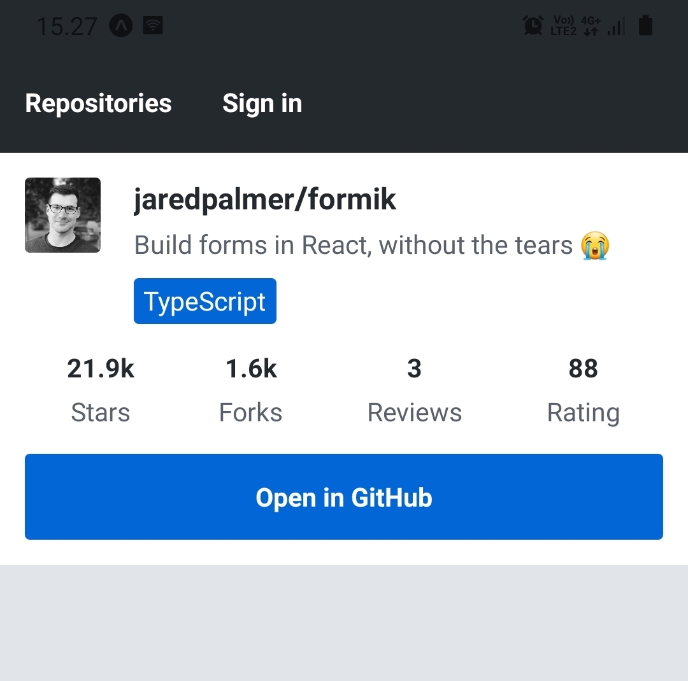
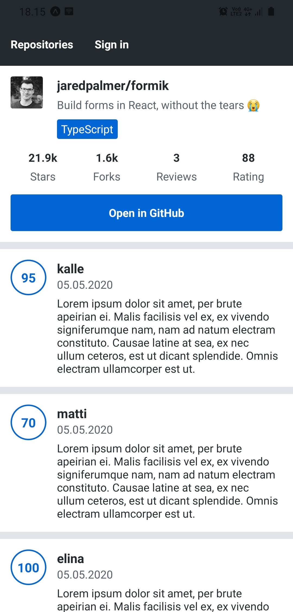
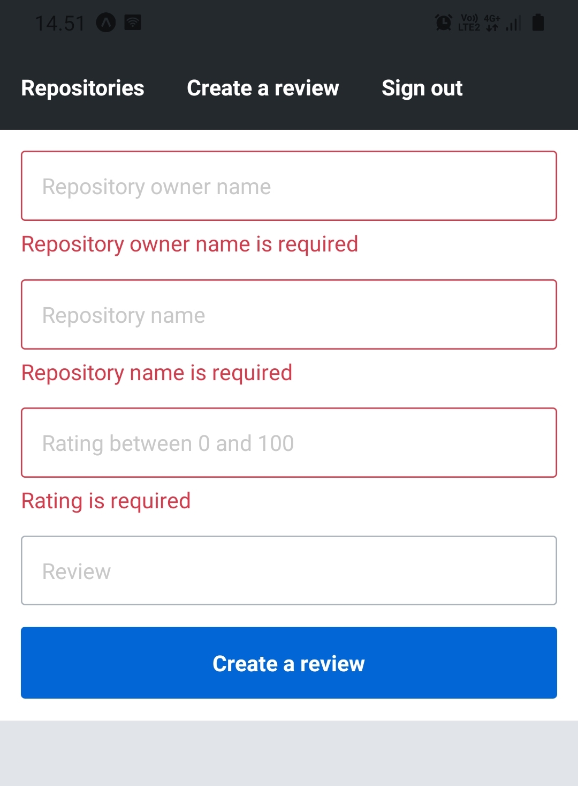
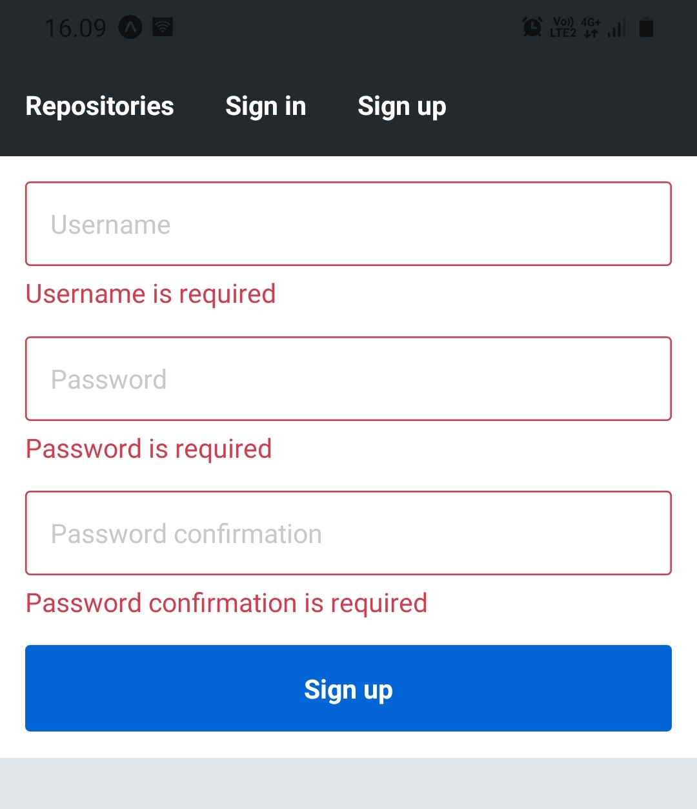
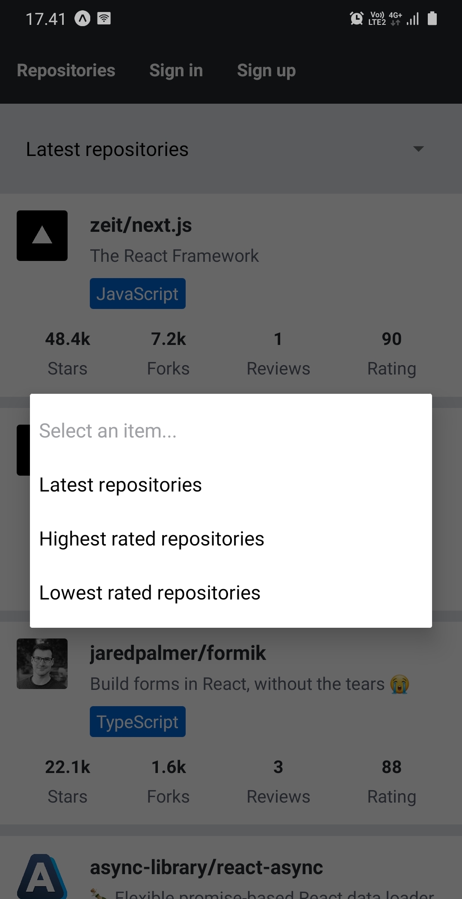
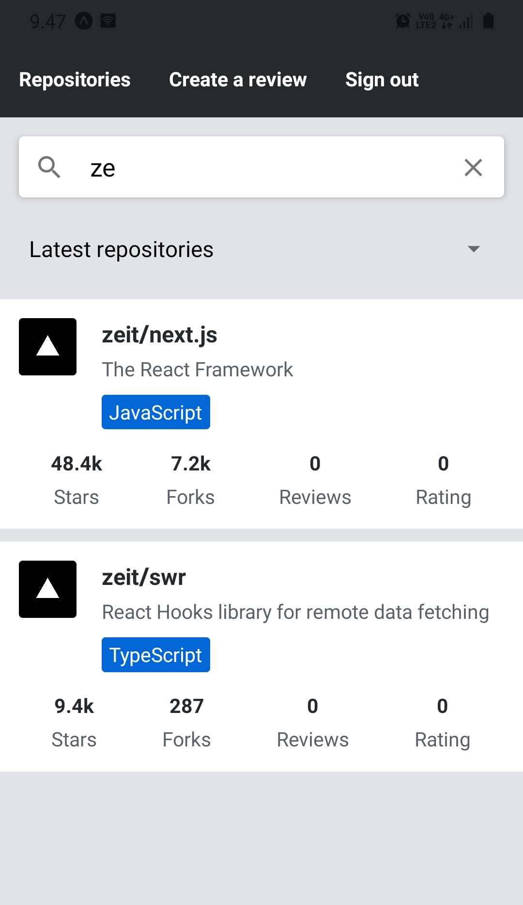
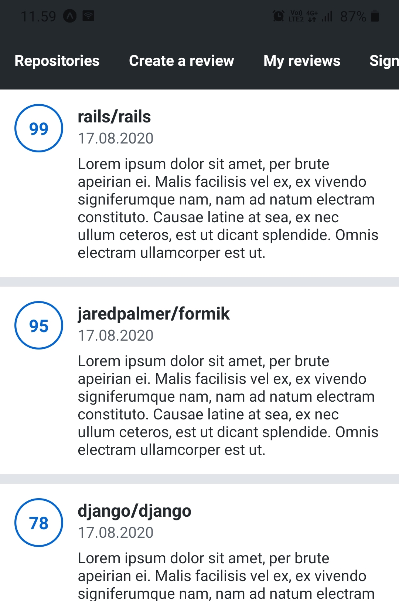
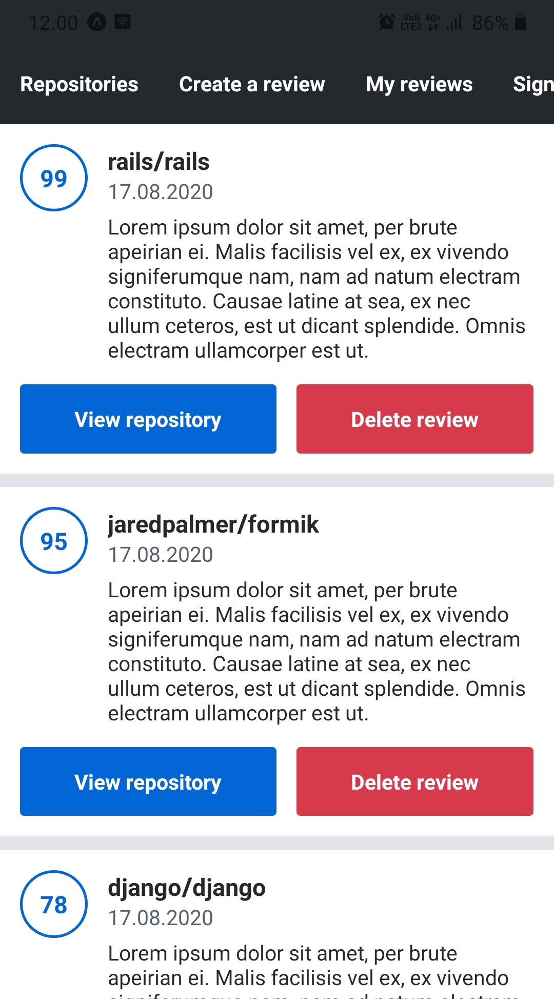

<div class="content">

الآن بعد أن أنشأنا أساساً متيناً لمشروعنا، حان الوقت للبدء في توسيعه. في هذا القسم، يمكنك تطبيق واستخدام جميع المعارف التي اكتسبتها حول React Native حتى الآن. وإلى جانب توسيع تطبيقنا، سنغطي بعض المجالات الجديدة، مثل الاختبارات (Testing) والموارد الإضافية المتقدمة.

### اختبار تطبيقات React Native (Testing React Native applications)

لبدء اختبار أي نوع من الشيفرات البرمجية، فإن أول شيء نحتاجه هو إطار عمل للاختبار (Testing framework)، والذي يمكننا استخدامه لتشغيل مجموعة من حالات الاختبار وفحص نتائجها. لاختبار تطبيق JavaScript، يُعد [Jest](https://jestjs.io/) مرشحاً شائعاً ومثالياً لهذا الغرض. ولاختبار تطبيق React Native القائم على Expo باستخدام Jest، توفر Expo مجموعة من تكوينات Jest المسبقة في شكل حزمة [jest-expo](https://github.com/expo/expo/tree/master/packages/jest-expo). من أجل استخدام ESLint في ملفات اختبار Jest، نحتاج أيضاً إلى المكون الإضافي [eslint-plugin-jest](https://www.npmjs.com/package/eslint-plugin-jest) لـ ESLint. دعونا نبدأ بتثبيت الحزم:

```shell
npm install --save-dev jest jest-expo eslint-plugin-jest
```

لاستخدام تكوين jest-expo المسبق في Jest، نحتاج إلى إضافة تكوين Jest التالي إلى ملف <i>package.json</i> مع نص التشغيل <i>test</i>:

```javascript
{
  // ...
  "scripts": {
    // النصوص الأخرى...
    "test": "jest" // highlight-line
  },
  // highlight-start
  "jest": {
    "preset": "jest-expo",
    "transform": {
      "^.+\\.jsx?$": "babel-jest"
    },
    "transformIgnorePatterns": [
      "node_modules/(?!((jest-)?react-native|@react-native(-community)?)|expo(nent)?|@expo(nent)?/.*|@expo-google-fonts/.*|react-navigation|@react-navigation/.*|@unimodules/.*|unimodules|sentry-expo|native-base|react-native-svg|react-router-native)"
    ]
  },
  // highlight-end
  // ...
}
```

يخبر خيار <em>transform</em> إطار Jest بتحويل وتصريف ملفات <i>.js</i> و <i>.jsx</i> باستخدام مترجم [Babel](https://babeljs.io/). وخيار <em>transformIgnorePatterns</em> مخصص لتجاهل بعض المجلدات في مجلد <i>node_modules</i> أثناء تحويل الملفات. تكوين Jest هذا مطابق تقريباً للتكوين المقترح في [توثيق Expo](https://docs.expo.dev/develop/unit-testing/).

لاستخدام المكون الإضافي eslint-plugin-jest في ESLint، نحتاج إلى تضمينه في مصفوفة المكونات الإضافية والامتدادات في ملف <i>.eslintrc.json</i>:

```javascript
{
  "plugins": ["react", "react-native"],
  "settings": {
    "react": {
      "version": "detect"
    }
  },
  "extends": ["eslint:recommended", "plugin:react/recommended", "plugin:jest/recommended"], // highlight-line
  "parser": "@babel/eslint-parser",
  "env": {
    "react-native/react-native": true
  },
  "rules": {
    "react/prop-types": "off",
    "react/react-in-jsx-scope": "off"
  }
}
```

للتأكد من أن الإعداد يعمل بنجاح، أنشئ مجلداً باسم <i>\_\_tests\_\_</i> في مجلد <i>src</i> وداخل المجلد المنشأ أنشئ ملفاً باسم <i>example.test.js</i>. في هذا الملف، أضف هذا الاختبار البسيط:

```javascript
describe('Example', () => {
  it('works', () => {
    expect(1).toBe(1);
  });
});
```

الآن، دعنا نشغل اختبارنا التجريبي بتشغيل <em>npm test</em>. يجب أن تشير مخرجات الأمر إلى نجاح الاختبار الموجود في ملف <i>src/\_\_tests\_\_/example.test.js</i>.

### تنظيم ملفات الاختبار (Organizing tests)

يُعد تنظيم ملفات الاختبار في مجلد <i>\_\_tests\_\_</i> واحد أحد الأساليب المتبعة في تنظيم الاختبارات. عند اختيار هذا النهج، يوصى بوضع ملفات الاختبار في مجلداتها الفرعية المقابلة تماماً مثل الشيفرة نفسها. هذا يعني أن الاختبارات المتعلقة بالمكونات تكون على سبيل المثال في مجلد <i>components</i>، والاختبارات المتعلقة بالأدوات المساعدة تكون في مجلد <i>utils</i>، وما إلى ذلك. سيؤدي هذا إلى الهيكل التالي:

```bash
src/
  __tests__/
    components/
      AppBar.js
      RepositoryList.js
      ...
    utils/
      authStorage.js
      ...
    ...
```

نهج آخر هو تنظيم الاختبارات بالقرب من ملفات التنفيذ البرمجي نفسه. هذا يعني على سبيل المثال أن ملف الاختبار الذي يحتوي على اختبارات المكون <em>AppBar</em> يكون في نفس المجلد الذي توجد به شيفرة المكون. سيؤدي هذا إلى الهيكل التالي:

```bash
src/
  components/
    AppBar/
      AppBar.test.jsx
      index.jsx
    ...
  ...
```

في هذا المثال، توجد شيفرة المكون في ملف <i>index.jsx</i> والاختبار في ملف <i>AppBar.test.jsx</i>. لاحظ أنه لكي يعثر Jest على ملفات الاختبار الخاصة بك، يتعين عليك إما وضعها في مجلد <i>\_\_tests\_\_</i>، أو استخدام اللاحقة <i>.test</i> أو <i>.spec</i>، أو [تكوين الأنماط العامة يدوياً](https://jestjs.io/docs/en/configuration#testmatch-arraystring).

### اختبار المكونات (Testing components)

الآن بعد أن تمكنا من إعداد Jest وتشغيل اختبار بسيط للغاية، حان الوقت لمعرفة كيفية اختبار المكونات. كما نعلم، يتطلب اختبار المكونات طريقة لتحويل مخرجات تصيير المكون إلى نص وفحصها ومحاكاة إطلاق أنواع مختلفة من الأحداث، مثل الضغط على زر. لهذه الأغراض، توجد عائلة [Testing Library](https://testing-library.com/docs/intro)، والتي توفر مكتبات لاختبار مكونات واجهة المستخدم في منصات مختلفة. تشترك كل هذه المكتبات في واجهة برمجة تطبيقات متشابهة لاختبار مكونات واجهة المستخدم بطريقة تتمحور حول تجربة المستخدم الحقيقية.

في [الجزء 5](/ar/part5/testing_react_apps) تعرفنا على إحدى هذه المكتبات، وهي [React Testing Library](https://testing-library.com/docs/react-testing-library/intro). لسوء الحظ، هذه المكتبة مناسبة فقط لاختبار تطبيقات React للويب. ولحسن الحظ، يوجد نظير لـ React Native لهذه المكتبة، وهو [React Native Testing Library](https://callstack.github.io/react-native-testing-library/). هذه هي المكتبة التي سنستخدمها أثناء اختبار مكونات تطبيق React Native الخاص بنا. والخبر السار هو أن هذه المكتبات تشترك في واجهة برمجة تطبيقات متشابهة للغاية، لذلك لا توجد العديد من المفاهيم الجديدة لتعلمها. بالإضافة إلى React Native Testing Library، نحتاج إلى مجموعة من أدوات المطابقة (Matchers) الخاصة بـ Jest والموجهة لـ React Native مثل <em>toHaveTextContent</em> و <em>toHaveProp</em>. يتم توفير هذه المطابقات من خلال مكتبة [jest-native](https://github.com/testing-library/jest-native). قبل الدخول في التفاصيل، دعنا نثبت هذه الحزم:

```shell
npm install --save-dev --legacy-peer-deps react-test-renderer@18.2.0 @testing-library/react-native @testing-library/jest-native
```

**ملاحظة هامة (NB):** إذا واجهت مشكلات في الاعتماديات الندية (Peer dependencies)، فتأكد من أن إصدار react-test-renderer يتطابق مع إصدار React الخاص بالمشروع في أمر <em>npm install</em> أعلاه. يمكنك التحقق من إصدار React عن طريق تشغيل <em>npm list react --depth=0</em>.

إذا فشل التثبيت بسبب مشكلات الاعتماديات الندية، فحاول مرة أخرى باستخدام علامة <em>--legacy-peer-deps</em> مع أمر <em>npm install</em>.

لتتمكن من استخدام أدوات المطابقة هذه، نحتاج إلى توسيع كائن <em>expect</em> الخاص بـ Jest. يمكن القيام بذلك باستخدام ملف إعداد عام. أنشئ ملفاً باسم <i>setupTests.js</i> في المجلد الرئيسي لمشروعك، أي نفس المجلد الذي يوجد به ملف <i>package.json</i>. في هذا الملف، أضف السطر التالي:

```javascript
import '@testing-library/jest-native/extend-expect';
```

بعد ذلك، قم بتكوين هذا الملف كملف إعداد في تكوين Jest في ملف <i>package.json</i> (لاحظ أن <em>\<rootDir></em> في المسار مقصودة ولا داعي لاستبدالها):

```javascript
{
  // ...
  "jest": {
    "preset": "jest-expo",
    "transform": {
      "^.+\\.jsx?$": "babel-jest"
    },
    "transformIgnorePatterns": [
      "node_modules/(?!(jest-)?react-native|react-clone-referenced-element|@react-native-community|expo(nent)?|@expo(nent)?/.*|react-navigation|@react-navigation/.*|@unimodules/.*|unimodules|sentry-expo|native-base|@sentry/.*|react-router-native)"
    ],
    "setupFilesAfterEnv": ["<rootDir>/setupTests.js"] // highlight-line
  }
  // ...
}
```

المفاهيم الرئيسية لـ React Native Testing Library هي [الاستعلامات (Queries)](https://callstack.github.io/react-native-testing-library/docs/api/queries) و [إطلاق الأحداث (Firing events)](https://callstack.github.io/react-native-testing-library/docs/api#fireevent). تُستخدم الاستعلامات لاستخراج مجموعة من العقد من المكون الذي يتم تصييره باستخدام دالة [render](https://callstack.github.io/react-native-testing-library/docs/api#render). الاستعلامات مفيدة في الاختبارات حيث نتوقع على سبيل المثال وجود نص معين، مثل اسم المستودع، في المكون المصير. إليك مثالاً على كيفية استخدام استعلام [ByText](https://callstack.github.io/react-native-testing-library/docs/api/queries/#bytext) للتحقق مما إذا كان عنصر <em>Text</em> الخاص بالمكون يحتوي على المحتوى النصي الصحيح:

```javascript
import { Text, View } from 'react-native';
import { render, screen } from '@testing-library/react-native';

const Greeting = ({ name }) => {
  return (
    <View>
      <Text>Hello {name}!</Text>
    </View>
  );
};

describe('Greeting', () => {
  it('renders a greeting message based on the name prop', () => {
    render(<Greeting name="Kalle" />);

    screen.debug();

    expect(screen.getByText('Hello Kalle!')).toBeDefined();
  });
});
```

تستخدم الاختبارات الكائن [screen](https://callstack.github.io/react-native-testing-library/docs/api#screen) لإجراء استعلامات على المكون المصير.

نحصل على عقدة <em>Text</em> التي تحتوي على نص معين باستخدام دالة <em>getByText</em>. تُستخدم أداة مطابقة Jest المسماة [toBeDefined](https://jestjs.io/docs/expect#tobedefined) للتأكد من أن الاستعلام قد وجد العنصر بالفعل.

يحتوي توثيق React Native Testing Library على بعض التلميحات الجيدة حول [كيفية الاستعلام عن أنواع مختلفة من العناصر](https://callstack.github.io/react-native-testing-library/docs/guides/how-to-query). ومن الأدلة الأخرى التي تستحق القراءة مقال Kent C. Dodds بعنوان [جعل اختبارات واجهة المستخدم مرنة في مواجهة التغيير](https://kentcdodds.com/blog/making-your-ui-tests-resilient-to-change).

يحتوي الكائن [screen](https://callstack.github.io/react-native-testing-library/docs/api#screen) أيضاً على دالة مساعدة [debug](https://callstack.github.io/react-native-testing-library/docs/api#debug) تطبع شجرة React المصيرة بتنسيق سهل القراءة. استخدمها إذا لم تكن متأكداً من شكل شجرة React التي تصيّرها دالة <em>render</em>.

للاطلاع على جميع الاستعلامات المتاحة، راجع [توثيق](https://callstack.github.io/react-native-testing-library/docs/api/queries) React Native Testing Library. ويمكن العثور على القائمة الكاملة لأدوات المطابقة المتاحة الخاصة بـ React Native في [توثيق](https://github.com/testing-library/jest-native#matchers) مكتبة jest-native. ويحتوي [توثيق](https://jestjs.io/docs/en/expect) Jest على جميع أدوات مطابقة Jest العامة.

المفهوم الثاني المهم للغاية في React Native Testing Library هو إطلاق الأحداث ومحاكاتها. يمكننا إطلاق حدث في عقدة محددة باستخدام دوال كائن [fireEvent](https://callstack.github.io/react-native-testing-library/docs/api#fireevent). هذا مفيد على سبيل المثال لكتابة نص في حقل إدخال أو الضغط على زر. إليك مثالاً على كيفية اختبار إرسال نموذج بسيط:

```javascript
import { useState } from 'react';
import { Text, TextInput, Pressable, View } from 'react-native';
import { render, fireEvent, screen } from '@testing-library/react-native';

const Form = ({ onSubmit }) => {
  const [username, setUsername] = useState('');
  const [password, setPassword] = useState('');

  const handleSubmit = () => {
    onSubmit({ username, password });
  };

  return (
    <View>
      <View>
        <TextInput
          value={username}
          onChangeText={(text) => setUsername(text)}
          placeholder="Username"
        />
      </View>
      <View>
        <TextInput
          value={password}
          onChangeText={(text) => setPassword(text)}
          placeholder="Password"
        />
      </View>
      <View>
        <Pressable onPress={handleSubmit}>
          <Text>Submit</Text>
        </Pressable>
      </View>
    </View>
  );
};

describe('Form', () => {
  it('calls function provided by onSubmit prop after pressing the submit button', () => {
    const onSubmit = jest.fn();
    render(<Form onSubmit={onSubmit} />);

    fireEvent.changeText(screen.getByPlaceholderText('Username'), 'kalle');
    fireEvent.changeText(screen.getByPlaceholderText('Password'), 'password');
    fireEvent.press(screen.getByText('Submit'));

    expect(onSubmit).toHaveBeenCalledTimes(1);

    // onSubmit.mock.calls[0][0] يحتوي على الوسيط الأول للاستدعاء الأول
    expect(onSubmit.mock.calls[0][0]).toEqual({
      username: 'kalle',
      password: 'password',
    });
  });
});
```

في هذا الاختبار، نريد اختبار أنه بعد ملء حقول النموذج باستخدام دالة <em>fireEvent.changeText</em> والضغط على زر الإرسال باستخدام دالة <em>fireEvent.press</em>، يتم استدعاء دالة رد الاتصال <em>onSubmit</em> بشكل صحيح. للتحقق مما إذا تم استدعاء دالة <em>onSubmit</em> ومع أي وسائط، يمكننا استخدام [دالة وهمية Mock function](https://jestjs.io/docs/en/mock-function-api). الدوال الوهمية هي دوال ذات سلوك مبرمج مسبقاً مثل قيمة إرجاع محددة. بالإضافة إلى ذلك، يمكننا إنشاء توقعات للدوال الوهمية مثل "توقع استدعاء الدالة الوهمية مرة واحدة". يمكن العثور على القائمة الكاملة للتوقعات المتاحة في [توثيق expect](https://jestjs.io/docs/en/expect) الخاص بـ Jest.

قبل المضي قدماً في عالم اختبار تطبيقات React Native، جرب هذه الأمثلة عن طريق إضافة ملف اختبار في مجلد <i>\_\_tests\_\_</i> الذي أنشأناه سابقاً.

### التعامل مع الاعتماديات والآثار الجانبية في الاختبارات (Handling dependencies in tests)

المكونات في الأمثلة السابقة سهلة الاختبار للغاية لأنها <i>نقية (Pure)</i> إلى حد ما. لا تعتمد المكونات النقية على <i>آثار جانبية (Side effects)</i> مثل طلبات الشبكة أو استخدام بعض واجهات برمجة التطبيقات الأصلية مثل AsyncStorage. المكون <em>Form</em> أقل نقاءً بكثير من المكون <em>Greeting</em> لأن تغييرات حالته يمكن اعتبارها تأثيراً جانبياً. ومع ذلك، فإن اختباره ليس صعباً للغاية.

بعد ذلك، دعونا نلقي نظرة على استراتيجية لاختبار المكونات ذات الآثار الجانبية. دعنا نأخذ المكون <em>RepositoryList</em> من تطبيقنا كمثال. في الوقت الحالي، يحتوي المكون على تأثير جانبي واحد، وهو استعلام GraphQL لجلب المستودعات التي تمت مراجعتها. يبدو التنفيذ الحالي لمكون <em>RepositoryList</em> كالتالي:

```javascript
const RepositoryList = () => {
  const { repositories } = useRepositories();

  const repositoryNodes = repositories
    ? repositories.edges.map((edge) => edge.node)
    : [];

  return (
    <FlatList
      data={repositoryNodes}
      // ...
    />
  );
};

export default RepositoryList;
```

التأثير الجانبي الوحيد هو استخدام خطاف <em>useRepositories</em>، الذي يرسل استعلام GraphQL. هناك عدة طرق لاختبار هذا المكون؛ إحدى الطرق هي محاكاة استجابات Apollo Client كما هو موضح في [توثيق](https://www.apollographql.com/docs/react/development-testing/testing/) Apollo Client. وهناك طريقة أبسط تتمثل في افتراض أن خطاف <em>useRepositories</em> يعمل على النحو المنشود (ويفضل اختباره بشكل منفصل) واستخراج الشيفرة "النقية" للمكون في مكون آخر، مثل المكون <em>RepositoryListContainer</em>:

```javascript
export const RepositoryListContainer = ({ repositories }) => {
  const repositoryNodes = repositories
    ? repositories.edges.map((edge) => edge.node)
    : [];

  return (
    <FlatList
      data={repositoryNodes}
      // ...
    />
  );
};

const RepositoryList = () => {
  const { repositories } = useRepositories();

  return <RepositoryListContainer repositories={repositories} />;
};

export default RepositoryList;
```

الآن، يحتوي المكون <em>RepositoryList</em> فقط على الآثار الجانبية وتنفيذه بسيط للغاية. يمكننا اختبار المكون <em>RepositoryListContainer</em> عن طريق تزويده ببيانات المستودعات المقسمة إلى صفحات من خلال الخاصية <em>repositories</em> والتحقق من أن المحتوى المصير يحتوي على المعلومات الصحيحة.

</div>

<div class="tasks">

### التمارين 10.17 - 10.18

#### التمرين 10.17: اختبار قائمة المستودعات التي تمت مراجعتها (testing the reviewed repositories list)

قم بتنفيذ اختبار يضمن أن المكون <em>RepositoryListContainer</em> يقوم بتصيير اسم المستودع، ووصفه، ولغته، وعدد تفرعاته، وعدد نجومه، ومتوسط تقييمه، وعدد مراجعاته بشكل صحيح. أحد الأساليب في تنفيذ هذا الاختبار هو إضافة خاصية [testID](https://reactnative.dev/docs/view#testid) للعنصر الذي يغلف معلومات المستودع الواحد:

```javascript
const RepositoryItem = (/* ... */) => {
  // ...

  return (
    <View testID="repositoryItem" {/* ... */}>
      {/* ... */}
    </View>
  )
};
```

بمجرد إضافة خاصية <em>testID</em>، يمكنك استخدام استعلام [getAllByTestId](https://callstack.github.io/react-native-testing-library/docs/api/queries#getallby) للحصول على تلك العناصر:

```javascript
const repositoryItems = screen.getAllByTestId('repositoryItem');
const [firstRepositoryItem, secondRepositoryItem] = repositoryItems;

// توقع ومطابقة البيانات من عنصر المستودع الأول والثاني
```

باستخدام هذه العناصر، يمكنك استخدام أداة المطابقة [toHaveTextContent](https://github.com/testing-library/jest-native#tohavetextcontent) للتحقق مما إذا كان العنصر يحتوي على محتوى نصي معين. قد تجد أيضاً دليل [الاستعلام داخل العناصر (Querying Within Elements)](https://testing-library.com/docs/dom-testing-library/api-within/) مفيداً. إذا لم تكن متأكداً مما يتم تصييره، فاستخدم دالة [debug](https://callstack.github.io/react-native-testing-library/docs/api#debug) لرؤية نتيجة التصيير المتسلسلة.

استخدم ما يلي كأساس لاختبارك:

```javascript
describe('RepositoryList', () => {
  describe('RepositoryListContainer', () => {
    it('renders repository information correctly', () => {
      const repositories = {
        totalCount: 8,
        pageInfo: {
          hasNextPage: true,
          endCursor:
            'WyJhc3luYy1saWJyYXJ5LnJlYWN0LWFzeW5jIiwxNTg4NjU2NzUwMDc2XQ==',
          startCursor: 'WyJqYXJlZHBhbG1lci5mb3JtaWsiLDE1ODg2NjAzNTAwNzZd',
        },
        edges: [
          {
            node: {
              id: 'jaredpalmer.formik',
              fullName: 'jaredpalmer/formik',
              description: 'Build forms in React, without the tears',
              language: 'TypeScript',
              forksCount: 1619,
              stargazersCount: 21856,
              ratingAverage: 88,
              reviewCount: 3,
              ownerAvatarUrl:
                'https://avatars2.githubusercontent.com/u/4060187?v=4',
            },
            cursor: 'WyJqYXJlZHBhbG1lci5mb3JtaWsiLDE1ODg2NjAzNTAwNzZd',
          },
          {
            node: {
              id: 'async-library.react-async',
              fullName: 'async-library/react-async',
              description: 'Flexible promise-based React data loader',
              language: 'JavaScript',
              forksCount: 69,
              stargazersCount: 1760,
              ratingAverage: 72,
              reviewCount: 3,
              ownerAvatarUrl:
                'https://avatars1.githubusercontent.com/u/54310907?v=4',
            },
            cursor:
              'WyJhc3luYy1saWJyYXJ5LnJlYWN0LWFzeW5jIiwxNTg4NjU2NzUwMDc2XQ==',
          },
        ],
      };

      // أضف شيفرة الاختبار الخاصة بك هنا
    });
  });
});
```

يمكنك وضع ملف الاختبار في المكان الذي تريده. ومع ذلك، يوصى باتباع إحدى طرق تنظيم ملفات الاختبار التي تم تقديمها سابقاً. استخدم المتغير <em>repositories</em> كبيانات مستودع للاختبار. لا ينبغي أن تكون هناك حاجة لتعديل قيمة المتغير. لاحظ أن بيانات المستودع تحتوي على مستودعين، مما يعني أنك بحاجة إلى التحقق من وجود معلومات كلا المستودعين.

#### التمرين 10.18: اختبار نموذج تسجيل الدخول (testing the sign in form)

قم بتنفيذ اختبار يضمن أن ملء حقلي اسم المستخدم وكلمة المرور في نموذج تسجيل الدخول والضغط على زر الإرسال <i>سيستدعي</i> معالج <em>onSubmit</em> بـ <i>الوسائط الصحيحة</i>. يجب أن يكون <i>الوسيط الأول</i> للمعالج عبارة عن كائن يمثل قيم النموذج. يمكنك تجاهل الوسائط الأخرى للدالة. تذكر أنه يمكن استخدام دوال [fireEvent](https://callstack.github.io/react-native-testing-library/docs/api#fireevent) لتشغيل الأحداث و [دالة وهمية mock function](https://jestjs.io/docs/en/mock-function-api) للتحقق مما إذا تم استدعاء معالج <em>onSubmit</em> أم لا.

ليس عليك اختبار أي شيفرة متعلقة بـ Apollo Client أو AsyncStorage والموجودة في خطاف <em>useSignIn</em>. كما في التمرين السابق، استخرج الشيفرة النقية في مكون خاص بها واختبرها في الاختبار.

لاحظ أن عمليات إرسال نماذج Formik <i>غير متزامنة (Asynchronous)</i>، لذا فإن توقع استدعاء دالة <em>onSubmit</em> فوراً بعد الضغط على زر الإرسال لن يعمل. يمكنك التغلب على هذه المشكلة بجعل دالة الاختبار دالة غير متزامنة باستخدام الكلمة المفتاحية <em>async</em> واستخدام الدالة المساعدة [waitFor](https://callstack.github.io/react-native-testing-library/docs/api#waitfor) في React Native Testing Library. يمكن استخدام دالة <em>waitFor</em> لانتظار نجاح التوقعات. وإذا لم تنجح التوقعات خلال فترة معينة، فستطرح الدالة خطأ. إليك مثالاً تقريبياً لكيفية استخدامها:

```javascript
import { render, screen, fireEvent, waitFor } from '@testing-library/react-native';
// ...

describe('SignIn', () => {
  describe('SignInContainer', () => {
    it('calls onSubmit function with correct arguments when a valid form is submitted', async () => {
      // تصيير المكون SignInContainer، وملء حقول الإدخال والضغط على زر الإرسال

      await waitFor(() => {
        // توقع استدعاء دالة onSubmit مرة واحدة وبوسيط أول صحيح
      });
    });
  });
});
```

</div>

<div class="content">

### توسيع تطبيقنا (Extending our application)

حان الوقت لوضع كل ما تعلمناه حتى الآن قيد الاستخدام الفعلي والبدء في توسيع تطبيقنا. لا يزال تطبيقنا يفتقر إلى بعض الميزات المهمة مثل مراجعة مستودع وتسجيل مستخدم جديد. ستركز التمارين القادمة على هذه الميزات الأساسية.

</div>

<div class="tasks">

### التمارين 10.19 - 10.26

#### التمرين 10.19: عرض المستودع الفردي (the single repository view)

قم بتنفيذ عرض لمستودع فردي، والذي يحتوي على نفس معلومات المستودع الموجودة في قائمة المستودعات التي تمت مراجعتها ولكن أيضاً زراً لفتح المستودع في GitHub. سيكون من الجيد إعادة استخدام المكون <em>RepositoryItem</em> المستخدم في المكون <em>RepositoryList</em> وعرض زر مستودع GitHub على سبيل المثال بناءً على خاصية منطقية (Boolean prop).

يوجد عنوان URL للمستودع في الحقل <em>url</em> من النوع <em>Repository</em> في مخطط GraphQL. يمكنك جلب مستودع واحد من خادم Apollo باستخدام استعلام <em>repository</em>. يحتوي الاستعلام على وسيط واحد، وهو معرف (id) المستودع. إليك مثالاً بسيطاً لاستعلام <em>repository</em>:

```javascript
{
  repository(id: "jaredpalmer.formik") {
    id
    fullName
    url
  }
}
```

كما هو الحال دائماً، اختبر استعلاماتك في Apollo Sandbox أولاً قبل استخدامها في تطبيقك. وإذا لم تكن متأكداً من مخطط GraphQL أو ما هي الاستعلامات المتاحة، فقم بإلقاء نظرة على التوثيق بجوار محرر العمليات. وإذا واجهت مشكلة في استخدام المعرف كمتغير في الاستعلام، فخذ لحظة لدراسة [توثيق Apollo Client](https://www.apollographql.com/docs/react/data/queries/) حول الاستعلامات.

لمعرفة كيفية فتح عنوان URL في المتصفح، اقرأ [توثيق Linking API في Expo](https://docs.expo.dev/versions/latest/sdk/linking/). ستحتاج إلى هذه الميزة أثناء تنفيذ الزر لفتح المستودع في GitHub. تلميح: ستكون الدالة [Linking.openURL](https://docs.expo.dev/versions/latest/sdk/linking/#linkingopenurlurl) مفيدة جداً.

يجب أن يكون للعرض مساره الخاص (Route). سيكون من الجيد تحديد معرف المستودع في مسار التوجيه كمعامل مسار (Path parameter)، والذي يمكنك الوصول إليه باستخدام خطاف [useParams](https://reactrouter.com/6.14.2/hooks/use-params). يجب أن يكون المستخدم قادراً على الوصول إلى العرض بالضغط على مستودع في قائمة المستودعات التي تمت مراجعتها. يمكنك تحقيق ذلك على سبيل المثال عن طريق تغليف <em>RepositoryItem</em> بمكون [Pressable](https://reactnative.dev/docs/pressable) في المكون <em>RepositoryList</em> واستخدام دالة <em>navigate</em> لتغيير المسار في معالج حدث <em>onPress</em>. يمكنك الوصول إلى دالة <em>navigate</em> باستخدام خطاف [useNavigate](https://reactrouter.com/api/hooks/useNavigate).

يجب أن تبدو النسخة النهائية لعرض المستودع الفردي كما يلي:



**ملاحظة:** إذا منعت مشكلات الاعتماديات الندية تثبيت المكتبة، فجرب خيار *--legacy-peer-deps*:

```bash
npm install expo-linking --legacy-peer-deps
```

#### التمرين 10.20: قائمة مراجعات المستودع (repository's review list)

الآن بعد أن أصبح لدينا عرض لمستودع فردي، دعنا نعرض مراجعات المستودع هناك. توجد مراجعات المستودع في الحقل <em>reviews</em> للنوع <em>Repository</em> في مخطط GraphQL. <em>reviews</em> عبارة عن قائمة مقسمة إلى صفحات مماثلة لتلك الموجودة في استعلام <em>repositories</em>. إليك مثالاً للحصول على مراجعات مستودع:

```javascript
{
  repository(id: "jaredpalmer.formik") {
    id
    fullName
    reviews {
      edges {
        node {
          id
          text
          rating
          createdAt
          user {
            id
            username
          }
        }
      }
    }
  }
}
```

يحتوي حقل <em>text</em> للمراجعة على نص المراجعة، وحقل <em>rating</em> على تقييم رقمي بين 0 و 100، وحقل <em>createdAt</em> على تاريخ إنشاء المراجعة. ويحتوي حقل <em>user</em> للمراجعة على معلومات المراجع، وهي من النوع <em>User</em>.

نريد عرض المراجعات كقائمة قابلة للتمرير، مما يجعل [FlatList](https://reactnative.dev/docs/flatlist) مكوناً مناسباً للوظيفة. ولعرض معلومات مستودع التمرين السابق في الجزء العلوي من القائمة، يمكنك استخدام خاصية [ListHeaderComponent](https://reactnative.dev/docs/flatlist#listheadercomponent) لمكون <em>FlatList</em>. يمكنك استخدام [ItemSeparatorComponent](https://reactnative.dev/docs/flatlist#itemseparatorcomponent) لإضافة بعض المسافة بين العناصر كما في المكون <em>RepositoryList</em>. إليك مثالاً على الهيكلية:

```javascript
const RepositoryInfo = ({ repository }) => {
  // معلومات المستودع المنفذة في التمرين السابق
};

const ReviewItem = ({ review }) => {
  // عنصر مراجعة فردي
};

const SingleRepository = () => {
  // ...

  return (
    <FlatList
      data={reviews}
      renderItem={({ item }) => <ReviewItem review={item} />}
      keyExtractor={({ id }) => id}
      ListHeaderComponent={() => <RepositoryInfo repository={repository} />}
      // ...
    />
  );
};

export default SingleRepository;
```

يجب أن تبدو النسخة النهائية لقائمة مراجعات المستودع كما يلي:



التاريخ الموجود أسفل اسم مستخدم المراجع هو تاريخ إنشاء المراجعة، الموجود في الحقل <em>createdAt</em> من النوع <em>Review</em>. يجب أن يكون تنسيق التاريخ سهل القراءة للمستخدم مثل <i>day.month.year</i>. يمكنك على سبيل المثال تثبيت مكتبة [date-fns](https://date-fns.org/) واستخدام دالة [format](https://date-fns.org/v2.28.0/docs/format) لتنسيق تاريخ الإنشاء.

يمكن تحقيق الشكل الدائري لحاوية التقييم باستخدام خاصية النمط <em>borderRadius</em>. يمكنك جعلها مستديرة عن طريق تثبيت خاصية النمط <em>width</em> و <em>height</em> للحاوية وتعيين نصف قطر الإطار على <em>width / 2</em>.

#### التمرين 10.21: نموذج المراجعة (the review form)

قم بتنفيذ نموذج لإنشاء مراجعة باستخدام Formik. يجب أن يحتوي النموذج على أربعة حقول: اسم مستخدم GitHub لمالك المستودع (على سبيل المثال "jaredpalmer")، واسم المستودع (على سبيل المثال "formik")، وتقييم رقمي، ومراجعة نصية. تحقق من صحة الحقول باستخدام مخطط Yup بحيث يحتوي على عمليات التحقق التالية:

- اسم مستخدم مالك المستودع هو نص مطلوب
- اسم المستودع هو نص مطلوب
- التقييم هو رقم مطلوب بين 0 و 100
- المراجعة هي نص اختياري

استكشف [توثيق Yup](https://github.com/jquense/yup#yup) للعثور على أدوات التحقق المناسبة. استخدم رسائل خطأ واضحة مع أدوات التحقق. يمكن تعريف رسالة التحقق كوسيط <em>message</em> لدالة أداة التحقق. يمكنك جعل حقل المراجعة يتوسع لعدة أسطر باستخدام خاصية [multiline](https://reactnative.dev/docs/textinput#multiline) لمكون <em>TextInput</em>.

يمكنك إنشاء مراجعة باستخدام طفرة <em>createReview</em>. تحقق من وسائط هذه الطفرة في Apollo Sandbox. يمكنك استخدام خطاف [useMutation](https://www.apollographql.com/docs/react/api/react/hooks/#usemutation) لإرسال طفرة إلى Apollo Server.

بعد نجاح طفرة <em>createReview</em>، أعد توجيه المستخدم إلى عرض المستودع الذي قمت بتنفيذه في التمرين السابق. يمكن القيام بذلك باستخدام دالة <em>navigate</em> بعد الحصول عليها باستخدام خطاف [useNavigate](https://reactrouter.com/api/components/Navigate). تحتوي المراجعة التي تم إنشاؤها على حقل <em>repositoryId</em> والذي يمكنك استخدامه لإنشاء مسار التوجيه.

لمنع الحصول على بيانات مخزنة مؤقتاً قديمة مع استعلام <em>repository</em> في عرض المستودع الفردي، استخدم سياسة الجلب *cache-and-network* [fetch policy](https://www.apollographql.com/docs/react/data/queries/#setting-a-fetch-policy) في الاستعلام. يمكن استخدامها مع خطاف <em>useQuery</em> هكذا:

```javascript
useQuery(GET_REPOSITORY, {
  fetchPolicy: 'cache-and-network',
  // الخيارات الأخرى
});
```

لاحظ أنه يمكن فقط مراجعة <i>مستودع GitHub عام وموجود بالفعل</i> ويمكن للمستخدم مراجعة نفس المستودع <i>مرة واحدة فقط</i>. ليس عليك معالجة حالات الخطأ هذه، ولكن حمولة الخطأ تتضمن رموزاً ورسائل محددة لهذه الأخطاء. يمكنك تجربة تنفيذك من خلال مراجعة أحد مستودعاتك العامة أو أي مستودع عام آخر.

يجب أن يكون نموذج المراجعة متاحاً عبر شريط التطبيق. أنشئ علامة تبويب في شريط التطبيق بتسمية "Create a review". يجب أن تكون علامة التبويب هذه مرئية فقط للمستخدمين الذين قاموا بتسجيل الدخول. ستحتاج أيضاً إلى تحديد مسار لنموذج المراجعة.

يجب أن تبدو النسخة النهائية لنموذج المراجعة كما يلي:



تم التقاط لقطة الشاشة هذه بعد إرسال نموذج غير صالح لتوضيح ما يجب أن يبدو عليه النموذج في حالة وجود أخطاء.

#### التمرين 10.22: نموذج إنشاء الحساب (the sign up form)

قم بتنفيذ نموذج تسجيل لإنشاء مستخدم جديد باستخدام Formik. يجب أن يحتوي النموذج على ثلاثة حقول: اسم المستخدم، وكلمة المرور، وتأكيد كلمة المرور. تحقق من صحة النموذج باستخدام مخطط Yup بحيث يحتوي على عمليات التحقق التالية:

- اسم المستخدم هو نص مطلوب يتراوح طوله بين 5 و 30 حرفاً
- كلمة المرور هي نص مطلوب يتراوح طولها بين 5 و 50 حرفاً
- تأكيد كلمة المرور يطابق كلمة المرور تماماً

يمكن أن يكون التحقق من صحة حقل تأكيد كلمة المرور صعباً بعض الشيء، ولكن يمكن إجراؤه على سبيل المثال باستخدام دالتي [oneOf](https://github.com/jquense/yup#schemaoneofarrayofvalues-arrayany-message-string--function-schema-alias-equals) و [ref](https://github.com/jquense/yup#refpath-string-options--contextprefix-string--ref) كما هو مقترح في [هذه المسألة](https://github.com/jaredpalmer/formik/issues/90#issuecomment-354873201).

يمكنك إنشاء مستخدم جديد باستخدام طفرة <em>createUser</em>. اكتشف كيفية عمل هذه الطفرة من خلال استكشاف التوثيق في Apollo Sandbox. بعد نجاح طفرة <em>createUser</em>، قم بتسجيل دخول المستخدم المنشأ باستخدام خطاف <em>useSignIn</em> كما فعلنا في نموذج تسجيل الدخول. وبعد تسجيل دخول المستخدم، أعد توجيهه إلى عرض قائمة المستودعات التي تمت مراجعتها.

يجب أن يكون المستخدم قادراً على الوصول إلى نموذج التسجيل من خلال شريط التطبيق بالضغط على علامة التبويب "Sign up". يجب أن تكون علامة التبويب هذه مرئية فقط للمستخدمين الذين لم يقوموا بتسجيل الدخول.

يجب أن تبدو النسخة النهائية لنموذج التسجيل كما يلي:



#### التمرين 10.23: فرز قائمة المستودعات التي تمت مراجعتها (sorting the reviewed repositories list)

في الوقت الحالي، يتم ترتيب المستودعات في قائمة المستودعات التي تمت مراجعتها حسب تاريخ المراجعة الأولى للمستودع. قم بتنفيذ ميزة تسمح للمستخدمين بتحديد المبدأ المستخدم لترتيب وفرز المستودعات. يجب أن تكون مبادئ الترتيب المتاحة هي:

- أحدث المستودعات (Latest repositories). المستودع الذي يحتوي على أحدث مراجعة أولى يكون في أعلى القائمة. هذا هو السلوك الحالي ويجب أن يكون هو المبدأ الافتراضي.
- المستودعات الأعلى تقييماً (Highest rated repositories). المستودع الحاصل على <i>أعلى</i> متوسط تقييم يكون في أعلى القائمة.
- المستودعات الأقل تقييماً (Lowest rated repositories). المستودع الحاصل على <i>أقل</i> متوسط تقييم يكون في أعلى القائمة.

يحتوي استعلام <em>repositories</em> المستخدم لجلب المستودعات التي تمت مراجعتها على وسيط يسمى <em>orderBy</em>، والذي يمكنك استخدامه لتحديد مبدأ الترتيب. يحتوي الوسيط على قيمتين مسموح بهما: CREATED\_AT (الترتيب حسب تاريخ المراجعة الأولى للمستودع) و RATING\_AVERAGE (الترتيب حسب متوسط تقييم المستودع). يحتوي الاستعلام أيضاً على وسيط يسمى <em>orderDirection</em> والذي يمكن استخدامه لتغيير اتجاه الترتيب. يحتوي الوسيط على قيمتين مسموح بهما: <em>ASC</em> (تصاعدي، أصغر قيمة أولاً) و <em>DESC</em> (تنازلي، أكبر قيمة أولاً).

يمكن الحفاظ على حالة مبدأ الترتيب المحدد على سبيل المثال باستخدام خطاف [useState](https://react.dev/reference/react/useState) في React. ويمكن إعطاء المتغيرات المستخدمة في استعلام <em>repositories</em> إلى خطاف <em>useRepositories</em> كوسيط.

يمكنك استخدام مكتبة [@react-native-picker/picker](https://docs.expo.io/versions/latest/sdk/picker/) على سبيل المثال، أو مكون [Menu](https://callstack.github.io/react-native-paper/docs/components/Menu/) من مكتبة [React Native Paper](https://callstack.github.io/react-native-paper/) لتنفيذ قائمة اختيار مبدأ الترتيب. يمكنك استخدام خاصية [ListHeaderComponent](https://reactnative.dev/docs/flatlist#listheadercomponent) لمكون <em>FlatList</em> لتزويد القائمة بترويسة تحتوي على مكون الاختيار.

يجب أن تبدو النسخة النهائية للميزة، اعتماداً على مكون التحديد قيد الاستخدام، كما يلي تقريباً:



#### التمرين 10.24: تصفية قائمة المستودعات التي تمت مراجعتها (filtering the reviewed repositories list)

يسمح Apollo Server بتصفية المستودعات باستخدام اسم المستودع أو اسم مستخدم المالك. يمكن القيام بذلك باستخدام وسيط <em>searchKeyword</em> في استعلام <em>repositories</em>. إليك مثالاً على كيفية استخدام الوسيط في الاستعلام:

```javascript
{
  repositories(searchKeyword: "ze") {
    edges {
      node {
        id
        fullName
      }
    }
  }
}
```

قم بتنفيذ ميزة لتصفية قائمة المستودعات التي تمت مراجعتها بناءً على كلمة رئيسية. يجب أن يكون المستخدمون قادرين على كتابة كلمة رئيسية في حقل إدخال نصي ويجب تصفية القائمة أثناء كتابة المستخدم. يمكنك استخدام مكون <em>TextInput</em> بسيط أو شيء أكثر تطوراً وتنسيقاً مثل مكون [Searchbar](https://callstack.github.io/react-native-paper/docs/components/Searchbar/) الخاص بـ React Native Paper كمدخل نصي. ضع مكون الإدخال النصي في ترويسة مكون <em>FlatList</em>.

لتجنب كثرة الطلبات غير الضرورية أثناء قيام المستخدم بكتابة الكلمة الرئيسية بسرعة، اختر فقط أحدث مدخلات بعد تأخير قصير. غالباً ما يُشار إلى هذه التقنية باسم [تقليل تواتر الأحداث (Debouncing)](https://lodash.com/docs/4.17.15#debounce). مكتبة [use-debounce](https://www.npmjs.com/package/use-debounce) هي خطاف مفيد لعمل debounce لمتغير الحالة. استخدمه مع وقت تأخير معقول، مثل 500 مللي ثانية. قم بتخزين قيمة إدخال النص باستخدام خطاف <em>useState</em> ثم مرر القيمة المخففة (Debounced value) إلى الاستعلام كقيمة لوسيط <em>searchKeyword</em>.

من المحتمل أن تواجه مشكلة تتمثل في أن مكون إدخال النص يفقد التركيز (Loses focus) بعد كل ضغطة مفتاح. هذا لأن المحتوى المقدم بواسطة خاصية <em>ListHeaderComponent</em> يتم إلغاء تركيبه باستمرار (Unmounted). يمكن حل ذلك عن طريق تحويل المكون الذي يقوم بتصيير المكون <em>FlatList</em> إلى مكون صنف (Class component) وتعريف دالة تصيير الترويسة كخاصية صنف هكذا:

```javascript
export class RepositoryListContainer extends React.Component {
  renderHeader = () => {
    // this.props يحتوي على خصائص المكون
    const props = this.props;

    // ...

    return (
      <RepositoryListHeader
      // ...
      />
    );
  };

  render() {
    return (
      <FlatList
        // ...
        ListHeaderComponent={this.renderHeader}
      />
    );
  }
}
```

يجب أن تبدو النسخة النهائية لميزة التصفية كما يلي تقريباً:



#### التمرين 10.25: عرض مراجعات المستخدم (the user's reviews view)

قم بتنفيذ ميزة تتيح للمستخدم رؤية مراجعاته الخاصة. بمجرد تسجيل الدخول، يجب أن يكون المستخدم قادراً على الوصول إلى هذا العرض بالضغط على علامة التبويب "My reviews" في شريط التطبيق. إليك ما يجب أن يبدو عليه عرض قائمة المراجعات تقريباً:



تذكر أنه يمكنك جلب المستخدم المصادق عليه من Apollo Server باستخدام استعلام <em>me</em>. يعيد هذا الاستعلام النوع <em>User</em>، والذي يحتوي على الحقل <em>reviews</em>. وإذا كنت قد قمت بالفعل بتنفيذ استعلام <em>me</em> قابل لإعادة الاستخدام في شيفرتك، فيمكنك تخصيص هذا الاستعلام لجلب حقل <em>reviews</em> بشكل مشروط. يمكن القيام بذلك باستخدام تعليمة [include](https://graphql.org/learn/queries/#directives) الخاصة بـ GraphQL.

لنفترض أن الاستعلام الحالي تم تنفيذه تقريباً بالطريقة التالية:

```javascript
const GET_CURRENT_USER = gql`
  query {
    me {
      # حقول المستخدم...
    }
  }
`;
```

يمكنك تزويد الاستعلام بوسيط <em>includeReviews</em> واستخدامه مع تعليمة <em>include</em>:

```javascript
const GET_CURRENT_USER = gql`
  query getCurrentUser($includeReviews: Boolean = false) {
    me {
      # حقول المستخدم...
      reviews @include(if: $includeReviews) {
        edges {
          node {
            # حقول المراجعة...
          }
        }
      }
    }
  }
`;
```

يحتوي الوسيط <em>includeReviews</em> على قيمة افتراضية هي <em>false</em>، لأننا لا نريد التسبب في عبء إضافي على الخادم ما لم نكن نريد صراحة جلب مراجعات المستخدم المصادق عليه. إن مبدأ تعليمة <em>include</em> بسيط للغاية: إذا كانت قيمة وسيط <em>if</em> هي <em>true</em>، فقم بتضمين الحقل، وإلا فاحذفه.

#### التمرين 10.26: إجراءات المراجعة (review actions)

الآن بعد أن أصبح بإمكان المستخدم رؤية مراجعاته، دعنا نضيف بعض الإجراءات إلى المراجعات. تحت كل مراجعة في قائمة المراجعات، يجب أن يكون هناك زرّان. زر واحد لعرض مستودع المراجعة؛ يجب أن يؤدي الضغط على هذا الزر إلى نقل المستخدم إلى عرض المستودع الفردي الذي تم تنفيذه في أحد التمارين السابقة. والزر الآخر مخصص لحذف المراجعة؛ يجب أن يؤدي الضغط على هذا الزر إلى حذف المراجعة. إليك ما يجب أن تبدو عليه الإجراءات تقريباً:



يجب أن يتبع الضغط على زر الحذف تنبيه تأكيد (Confirmation alert). إذا أكد المستخدم الحذف، فسيتم حذف المراجعة؛ وإلا فسيتم إلغاء عملية الحذف. يمكنك تنفيذ التأكيد باستخدام وحدة [Alert](https://reactnative.dev/docs/alert). لاحظ أن استدعاء دالة <em>Alert.alert</em> لن يفتح أي نافذة في معاينة الويب لـ Expo. استخدم إما تطبيق Expo للهاتف المحمول أو محاكياً لمعاينة شكل نافذة التنبيه.

إليك تنبيه التأكيد الذي يجب أن ينبثق بمجرد أن يضغط المستخدم على زر الحذف:


يمكنك حذف مراجعة باستخدام طفرة <em>deleteReview</em>. تحتوي هذه الطفرة على وسيط واحد، وهو معرف (id) المراجعة المراد حذفها. وبعد تنفيذ الطفرة، فإن أسهل طريقة لتحديث استعلام قائمة المراجعة هي استدعاء دالة [refetch](https://www.apollographql.com/docs/react/data/queries/#refetching).

</div>

<div class="content">

### تقسيم الصفحات المعتمد على المؤشر (Cursor-based pagination)

عندما تعيد واجهة برمجة التطبيقات (API) قائمة مرتبة من العناصر من مجموعة ما، فإنها عادةً ما تعيد مجموعة فرعية من مجموعة العناصر بأكملها لتقليل عرض النطاق الترددي (Bandwidth) المطلوب وتقليل استخدام الذاكرة لتطبيقات العميل. يمكن تخصيص المجموعة الفرعية المطلوبة من العناصر بحيث يمكن للعميل طلب أول عشرين عنصراً في القائمة بعد فهرس معين على سبيل المثال. وتسمى هذه التقنية عموماً بـ <i>تقسيم الصفحات (Pagination)</i>. وعندما يمكن طلب العناصر بعد عنصر معين يتم تحديده بواسطة <i>مؤشر (Cursor)</i>، فإننا نتحدث عن <i>تقسيم الصفحات المعتمد على المؤشر (Cursor-based pagination)</i>.

المؤشر (Cursor) هو مجرد تمثيل متسلسل لعنصر في قائمة مرتبة. دعنا نلقي نظرة على المستودعات المقسمة إلى صفحات والمعادة بواسطة استعلام <em>repositories</em> باستخدام الاستعلام التالي:

```javascript
{
  repositories(first: 2) {
    totalCount
    edges {
      node {
        id
        fullName
        createdAt
      }
      cursor
    }
    pageInfo {
      endCursor
      startCursor
      hasNextPage
    }
  }
}
```

يخبر الوسيط <em>first</em> واجهة برمجة التطبيقات بإرجاع أول مستودعين فقط. إليك مثالاً لنتيجة الاستعلام:

```javascript
{
  "data": {
    "repositories": {
      "totalCount": 10,
      "edges": [
        {
          "node": {
            "id": "zeit.next.js",
            "fullName": "zeit/next.js",
            "createdAt": "2020-05-15T11:59:57.557Z"
          },
          "cursor": "WyJ6ZWl0Lm5leHQuanMiLDE1ODk1NDM5OTc1NTdd"
        },
        {
          "node": {
            "id": "zeit.swr",
            "fullName": "zeit/swr",
            "createdAt": "2020-05-15T11:58:53.867Z"
          },
          "cursor": "WyJ6ZWl0LnN3ciIsMTU4OTU0MzkzMzg2N10="
        }
      ],
      "pageInfo": {
        "endCursor": "WyJ6ZWl0LnN3ciIsMTU4OTU0MzkzMzg2N10=",
        "startCursor": "WyJ6ZWl0Lm5leHQuanMiLDE1ODk1NDM5OTc1NTdd",
        "hasNextPage": true
      }
    }
  }
}
```

يعتمد تنسيق كائن النتيجة والوسائط على [مواصفات اتصالات مؤشر GraphQL الخاصة بـ Relay](https://relay.dev/graphql/connections.htm)، والتي أصبحت مواصفات شائعة لتقسيم الصفحات وتم اعتمادها على نطاق واسع على سبيل المثال في [GraphQL API الخاصة بـ GitHub](https://docs.github.com/en/graphql). في كائن النتيجة، لدينا مصفوفة <em>edges</em> التي تحتوي على عناصر بها سمات <em>node</em> و <em>cursor</em>. وكما نعلم، تحتوي <em>node</em> على بيانات المستودع نفسه. من ناحية أخرى، فإن <em>cursor</em> هو تمثيل مشفر بنظام Base64 للعقدة. في هذه الحالة، يحتوي على معرف المستودع وتاريخ إنشاء المستودع كطابع زمني. هذه هي المعلومات التي نحتاجها للإشارة إلى العنصر عندما يتم ترتيبها حسب وقت إنشاء المستودع. يحتوي <em>pageInfo</em> على معلومات مثل مؤشر العنصر الأول والأخير في المصفوفة وهل هناك صفحة تالية أم لا.

لنفترض أننا نريد الحصول على المجموعة التالية من العناصر <i>بعد</i> العنصر الأخير من المجموعة الحالية، وهو مستودع "zeit/swr". يمكننا تعيين وسيط <em>after</em> للاستعلام كقيمة لـ <em>endCursor</em> هكذا:

```javascript
{
  repositories(first: 2, after: "WyJ6ZWl0LnN3ciIsMTU4OTU0MzkzMzg2N10=") {
    totalCount
    edges {
      node {
        id
        fullName
        createdAt
      }
      cursor
    }
    pageInfo {
      endCursor
      startCursor
      hasNextPage
    }
  }
}
```

الآن لدينا العنصران التاليان ويمكننا الاستمرار في فعل ذلك حتى تصبح قيمة <em>hasNextPage</em> هي <em>false</em>، مما يعني أننا وصلنا إلى نهاية القائمة. للتعمق في تقسيم الصفحات المعتمد على المؤشر، اقرأ مقال Shopify بعنوان [تقسيم الصفحات باستخدام المؤشرات النسبية](https://shopify.engineering/pagination-relative-cursors). يقدم المقال تفاصيل رائعة حول التنفيذ نفسه والفوائد مقارنة بالتقسيم التقليدي المعتمد على الفهرس.

### التمرير اللانهائي (Infinite scrolling)

عادةً ما يتم تنفيذ القوائم القابلة للتمرير عمودياً في تطبيقات الأجهزة المحمولة وسطح المكتب باستخدام تقنية تسمى <i>التمرير اللانهائي (Infinite scrolling)</i>. مبدأ التمرير اللانهائي بسيط للغاية:

- جلب المجموعة الأولية من العناصر.
- عندما يصل المستخدم إلى العنصر الأخير، يتم جلب المجموعة التالية من العناصر بعد العنصر الأخير.

تتكرر الخطوة الثانية حتى يتوقف المستخدم عن التمرير أو يتم الوصول لنهاية البيانات. يشير اسم "التمرير اللانهائي" إلى الطريقة التي تبدو بها القائمة وكأنها لا نهائية - يمكن للمستخدم فقط الاستمرار في التمرير وتستمر العناصر الجديدة في الظهور في القائمة بسلاسة.

دعونا نلقي نظرة على كيفية عمل هذا عملياً باستخدام خطاف <em>useQuery</em> الخاص بـ Apollo Client. يمتلك Apollo Client [توثيقاً رائعاً](https://www.apollographql.com/docs/react/pagination/cursor-based/) حول تنفيذ تقسيم الصفحات المعتمد على المؤشر. دعونا ننفذ التمرير اللانهائي لقائمة المستودعات التي تمت مراجعتها كمثال.

أولاً، نحتاج إلى معرفة متى وصل المستخدم إلى نهاية القائمة. ولحسن الحظ، يحتوي المكون <em>FlatList</em> على خاصية [onEndReached](https://reactnative.dev/docs/virtualizedlist#onendreached)، والتي ستستدعي الدالة المقدمة بمجرد قيام المستخدم بالتمرير إلى آخر عنصر في القائمة. يمكنك تغيير مدى مبكراً يتم استدعاء دالة <em>onEndReach</em> باستخدام خاصية [onEndReachedThreshold](https://reactnative.dev/docs/virtualizedlist#onendreachedthreshold). قم بتعديل مكون <em>FlatList</em> الخاص بالمكون <em>RepositoryList</em> بحيث يستدعي دالة بمجرد الوصول إلى نهاية القائمة:

```javascript
export const RepositoryListContainer = ({
  repositories,
  onEndReach,
  /* ... */,
}) => {
  const repositoryNodes = repositories
    ? repositories.edges.map((edge) => edge.node)
    : [];

  return (
    <FlatList
      data={repositoryNodes}
      // ...
      onEndReached={onEndReach}
      onEndReachedThreshold={0.5}
    />
  );
};

const RepositoryList = () => {
  // ...

  const { repositories } = useRepositories(/* ... */);

  const onEndReach = () => {
    console.log('You have reached the end of the list');
  };

  return (
    <RepositoryListContainer
      repositories={repositories}
      onEndReach={onEndReach}
      // ...
    />
  );
};

export default RepositoryList;
```

جرب التمرير إلى نهاية قائمة المستودعات التي تمت مراجعتها ويجب أن ترى الرسالة في السجلات.

بعد ذلك، نحتاج إلى جلب المزيد من المستودعات بمجرد الوصول إلى نهاية القائمة. يمكن تحقيق ذلك باستخدام دالة [fetchMore](https://www.apollographql.com/docs/react/pagination/core-api/#the-fetchmore-function) التي يوفرها خطاف <em>useQuery</em>. ولوصف كيفية دمج المستودعات الموجودة في الذاكرة المؤقتة (Cache) مع المجموعة التالية من المستودعات لـ Apollo Client، يمكننا استخدام [سياسة الحقل (Field policy)](https://www.apollographql.com/docs/react/caching/cache-field-behavior/). بشكل عام، يمكن استخدام سياسات الحقول لتخصيص سلوك ذاكرة التخزين المؤقت أثناء عمليات القراءة والكتابة باستخدام دوال [read](https://www.apollographql.com/docs/react/caching/cache-field-behavior/#the-read-function) و [merge](https://www.apollographql.com/docs/react/caching/cache-field-behavior/#the-merge-function).

دعنا نضيف سياسة حقل لاستعلام <em>repositories</em> في ملف <i>apolloClient.js</i>:

```javascript
import { ApolloClient, InMemoryCache, createHttpLink } from '@apollo/client';
import { setContext } from '@apollo/client/link/context';
import Constants from 'expo-constants';
import { relayStylePagination } from '@apollo/client/utilities'; // highlight-line

const { apolloUri } = Constants.manifest.extra;

const httpLink = createHttpLink({
  uri: apolloUri,
});

// highlight-start
const cache = new InMemoryCache({
  typePolicies: {
    Query: {
      fields: {
        repositories: relayStylePagination(),
      },
    },
  },
});
// highlight-end

const createApolloClient = (authStorage) => {
  const authLink = setContext(async (_, { headers }) => {
    try {
      const accessToken = await authStorage.getAccessToken();

      return {
        headers: {
          ...headers,
          authorization: accessToken ? `Bearer ${accessToken}` : '',
        },
      };
    } catch (e) {
      console.log(e);

      return {
        headers,
      };
    }
  });

  return new ApolloClient({
    link: authLink.concat(httpLink),
    cache, // highlight-line
  });
};

export default createApolloClient;
```

وكما ذكرنا سابقاً، يعتمد تنسيق كائن نتيجة تقسيم الصفحات والوسائط على مواصفات تقسيم الصفحات الخاصة بـ Relay. ولحسن الحظ، يوفر Apollo Client سياسة حقل محددة مسبقاً، وهي <em>relayStylePagination</em>، والتي يمكن استخدامها في هذه الحالة مباشرة.

بعد ذلك، دعنا نعدل خطاف <em>useRepositories</em> بحيث يعيد دالة <em>fetchMore</em> مخصصة تستدعي دالة <em>fetchMore</em> الفعلية بالوسائط المناسبة حتى نتمكن من جلب المجموعة التالية من المستودعات:

```javascript
const useRepositories = (variables) => {
  const { data, loading, fetchMore, ...result } = useQuery(GET_REPOSITORIES, {
    variables,
    // ...
  });

  const handleFetchMore = () => {
    const canFetchMore = !loading && data?.repositories.pageInfo.hasNextPage;

    if (!canFetchMore) {
      return;
    }

    fetchMore({
      variables: {
        after: data.repositories.pageInfo.endCursor,
        ...variables,
      },
    });
  };

  return {
    repositories: data?.repositories,
    fetchMore: handleFetchMore,
    loading,
    ...result,
  };
};
```

تأكد من وجود حقلي <em>pageInfo</em> و <em>cursor</em> في استعلام <em>repositories</em> الخاص بك كما هو موضح في أمثلة تقسيم الصفحات. ستحتاج أيضاً إلى تضمين وسيطي <em>after</em> و <em>first</em> للاستعلام.

ستستدعي دالة <em>handleFetchMore</em> دالة <em>fetchMore</em> الخاصة بـ Apollo Client إذا كان هناك المزيد من العناصر لجلبها، وهو ما يتم تحديده بواسطة الخاصية <em>hasNextPage</em>. نريد أيضاً منع جلب المزيد من العناصر إذا كان الجلب قيد المعالجة بالفعل؛ وفي هذه الحالة، ستكون <em>loading</em> بقيمة <em>true</em>. في دالة <em>fetchMore</em>، نزود الاستعلام بمتغير <em>after</em>، والذي يستقبل أحدث قيمة لـ <em>endCursor</em>.

الخطوة الأخيرة هي استدعاء دالة <em>fetchMore</em> في معالج <em>onEndReach</em>:

```javascript
const RepositoryList = () => {
  // ...

  const { repositories, fetchMore } = useRepositories({
    first: 8,
    // ...
  });

  const onEndReach = () => {
    fetchMore();
  };

  return (
    <RepositoryListContainer
      repositories={repositories}
      onEndReach={onEndReach}
      // ...
    />
  );
};

export default RepositoryList;
```

استخدم قيمة وسيط <em>first</em> صغيرة نسبياً مثل 3 أثناء تجربة التمرير اللانهائي؛ بهذه الطريقة لن تحتاج إلى مراجعة عدد كبير جداً من المستودعات. قد تواجه مشكلة تتمثل في استدعاء معالج <em>onEndReach</em> فور تحميل العرض. هذا على الأرجح لأن القائمة تحتوي على عدد قليل جداً من المستودعات بحيث يتم الوصول إلى نهاية القائمة فوراً. يمكنك التغلب على هذه المشكلة عن طريق زيادة قيمة وسيط <em>first</em>. وبمجرد أن تتأكد من أن التمرير اللانهائي يعمل، لا تتردد في استخدام قيمة أكبر لوسيط <em>first</em>.

</div>

<div class="tasks">

### التمرين 10.27

#### التمرين 10.27: التمرير اللانهائي لقائمة مراجعات المستودع (infinite scrolling for the repository's reviews list)

قم بتنفيذ التمرير اللانهائي لقائمة مراجعات المستودع. يحتوي الحقل <em>reviews</em> من النوع <em>Repository</em> على وسيطي <em>first</em> و <em>after</em> المشابهين لاستعلام <em>repositories</em>. يحتوي النوع <em>ReviewConnection</em> أيضاً على الحقل <em>pageInfo</em> تماماً مثل النوع <em>RepositoryConnection</em>.

إليك استعلاماً مثالياً:

```javascript
{
  repository(id: "jaredpalmer.formik") {
    id
    fullName
    reviews(first: 2, after: "WyIxYjEwZTRkOC01N2VlLTRkMDAtODg4Ni1lNGEwNDlkN2ZmOGYuamFyZWRwYWxtZXIuZm9ybWlrIiwxNTg4NjU2NzUwMDgwXQ==") {
      totalCount
      edges {
        node {
          id
          text
          rating
          createdAt
          repositoryId
          user {
            id
            username
          }
        }
        cursor
      }
      pageInfo {
        endCursor
        startCursor
        hasNextPage
      }
    }
  }
}
```

يمكن أن تكون سياسة حقل ذاكرة التخزين المؤقت مماثلة لتلك الموجودة في استعلام <em>repositories</em>:

```javascript
const cache = new InMemoryCache({
  typePolicies: {
    Query: {
      fields: {
        repositories: relayStylePagination(),
      },
    },
    // highlight-start
    Repository: {
      fields: {
        reviews: relayStylePagination(),
      },
    },
    // highlight-end
  },
});
```

كما هو الحال مع قائمة المستودعات التي تمت مراجعتها، استخدم قيمة وسيط <em>first</em> صغيرة نسبياً أثناء تجربة التمرير اللانهائي. قد تحتاج إلى إنشاء بعض المستخدمين الجدد واستخدامهم لإنشاء بعض المراجعات الجديدة لجعل قائمة المراجعات طويلة بما يكفي للتمرير. قم بتعيين قيمة وسيط <em>first</em> عالية بما يكفي بحيث لا يتم استدعاء معالج <em>onEndReach</em> فور تحميل العرض، ولكن منخفضة بما يكفي بحيث يمكنك رؤية جلب المزيد من المراجعات بمجرد وصولك إلى نهاية القائمة. بمجرد أن يعمل كل شيء كما هو منشود، يمكنك استخدام قيمة أكبر لوسيط <em>first</em>.

كان هذا آخر تمرين في هذا القسم. حان الوقت لرفع شيفرتك إلى GitHub وتحديد جميع تمارينك المكتملة في [نظام تسليم التمارين](https://studies.cs.helsinki.fi/stats/courses/fs-react-native-2020). لاحظ أن التمارين في هذا القسم يجب تسليمها إلى الجزء 4 في نظام تسليم التمارين.

</div>

<div class="content">

### مصادر ومراجع إضافية (Additional resources)

مع اقترابنا من نهاية هذا الجزء، دعنا نأخذ لحظة لإلقاء نظرة على بعض الموارد والمكتبات الإضافية المتعلقة بـ React Native. [Awesome React Native](https://github.com/jondot/awesome-react-native) هي قائمة منسقة وشاملة للغاية لموارد React Native مثل المكتبات والدروس والمقالات. نظراً لأن القائمة طويلة جداً، فلنلق نظرة فاحصة على بعض أبرز ما فيها:

#### مكتبة React Native Paper

> Paper هي مجموعة من المكونات القابلة للتخصيص والجاهزة للاستخدام في بيئات الإنتاج لـ React Native، وتتبع إرشادات التصميم Material Design من Google.

تُعد مكتبة [React Native Paper](https://callstack.github.io/react-native-paper/) لـ React Native بمثابة ما تمثله [Material-UI](https://material-ui.com/) لتطبيقات React للويب؛ فهي توفر مجموعة واسعة من مكونات واجهة المستخدم عالية الجودة، ودعماً لـ [السمات المخصصة](https://callstack.github.io/react-native-paper/docs/guides/theming/) وإعداداً بسيطاً للغاية [setup](https://callstack.github.io/react-native-paper/docs/guides/getting-started) لتطبيقات React Native القائمة على Expo.

#### مكتبة Styled-components

> بالاستفادة من وسوم القوالب الحرفية Tagged template literals (إضافة حديثة إلى JavaScript) وقوة CSS، تتيح لك styled-components كتابة شيفرة CSS فعلية لتنسيق مكوناتك. كما أنها تزيل التعيين بين المكونات والأنماط - إن استخدام المكونات كبنية تنسيق منخفضة المستوى لا يمكن أن يكون أسهل من ذلك!

[Styled-components](https://styled-components.com/) هي مكتبة لتنسيق مكونات React باستخدام تقنية [CSS-in-JS](https://en.wikipedia.org/wiki/CSS-in-JS). في React Native، اعتدنا بالفعل على تعريف أنماط المكونات ككائن JavaScript، لذا فإن CSS-in-JS ليست منطقة مجهولة بالنسبة لنا. ومع ذلك، فإن نهج styled-components يختلف تماماً عن استخدام دالة <em>StyleSheet.create</em> والخاصية <em>style</em>.

في styled-components، يتم تعريف أنماط المكونات مع المكون نفسه باستخدام ميزة تسمى [وسم القالب الحرفي Tagged template literal](https://developer.mozilla.org/en-US/docs/Web/JavaScript/Reference/Template_literals#Tagged_templates) أو كائن JavaScript عادي. تجعل styled-components من الممكن تحديد خصائص نمط جديدة للمكون بناءً على خصائصه (Props) *في وقت التشغيل*. هذا يجلب العديد من الإمكانات، مثل التبديل السلس بين السمة الفاتحة والداكنة. كما أن لديها دعماً كاملاً لـ [السمات Theming](https://styled-components.com/docs/advanced#theming). إليك مثالاً على إنشاء مكون <em>Text</em> مع تنوعات في الأنماط بناءً على الخصائص:

```javascript
import styled from 'styled-components/native';
import { css } from 'styled-components';

const FancyText = styled.Text`
  color: grey;
  font-size: 14px;

  ${({ isBlue }) =>
    isBlue &&
    css`
      color: blue;
    `}

  ${({ isBig }) =>
    isBig &&
    css`
      font-size: 24px;
      font-weight: 700;
    `}
`;

const Main = () => {
  return (
    <>
      <FancyText>Simple text</FancyText>
      <FancyText isBlue>Blue text</FancyText>
      <FancyText isBig>Big text</FancyText>
      <FancyText isBig isBlue>
        Big blue text
      </FancyText>
    </>
  );
};
```

نظراً لأن styled-components تعالج تعريفات النمط، فمن الممكن استخدام صيغة snake-case الشبيهة بـ CSS مع أسماء الخصائص والوحدات في قيم الخصائص. ومع ذلك، ليس للوحدات أي تأثير لأن قيم الخصائص تكون داخلياً بدون وحدات. لمزيد من المعلومات حول styled-components، توجه إلى [التوثيق](https://styled-components.com/docs).

#### مكتبة React-spring

> react-spring هي مكتبة رسوم متحركة قائمة على فيزياء الزنبرك (Spring physics) والتي يجب أن تغطي معظم احتياجات الرسوم المتحركة المتعلقة بواجهة المستخدم الخاصة بك. تمنحك أدوات مرنة بما يكفي لتجسيد أفكارك بثقة في واجهات متحركة سلسة.

[React-spring](https://www.react-spring.dev/) هي مكتبة توفر [واجهة برمجة تطبيقات API](https://www.react-spring.dev/docs/getting-started) نظيفة لتحريك مكونات React Native.

#### مكتبة React Navigation

> التوجيه والتنقل لتطبيقات React Native الخاصة بك

[React Navigation](https://reactnavigation.org/) هي مكتبة توجيه لـ React Native. وهي تشترك في بعض أوجه التشابه مع مكتبة React Router التي استخدمناها خلال هذا الجزء والأجزاء السابقة. ومع ذلك، على عكس React Router، تقدم React Navigation المزيد من الميزات الأصلية مثل إيماءات اللمس والحركات الانتقالية الأصلية بين الشاشات.

### كلمات ختامية (Closing words)

هذا كل شيء، تطبيقنا جاهز الآن بالكامل. عمل رائع! لقد تعلمنا العديد من المفاهيم الجديدة خلال رحلتنا مثل إعداد تطبيق React Native الخاص بنا باستخدام Expo، واستخدام المكونات الأساسية لـ React Native وإضافة التنسيقات إليها، والتواصل مع الخادم، واختبار تطبيقات React Native. القطعة الأخيرة من اللغز ستكون نشر التطبيق إلى متجري Apple App Store و Google Play Store.

يُعد نشر التطبيق أمراً <i>اختيارياً</i> تماماً وليس بالأمر البسيط؛ لأنك تحتاج أيضاً إلى نسخ مستودع [rate-repository-api](https://github.com/fullstack-hy2020/rate-repository-api) ونشره في السحابة. وبالنسبة لتطبيق React Native نفسه، تحتاج أولاً إلى إنشاء حزم بناء لنظام iOS أو Android باتباع [توثيق Expo](https://docs.expo.io/distribution/building-standalone-apps/). ثم يمكنك تحميل هذه الحزم المبنية إما إلى متجر Apple App Store أو متجر Google Play Store. وتمتلك Expo [توثيقاً شاملاً](https://docs.expo.dev/submit/introduction/) لهذا أيضاً.

</div>
