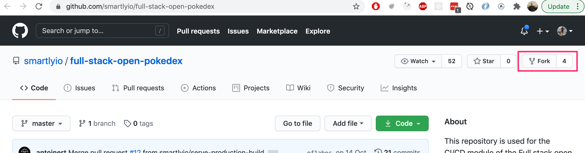

سنتعرف في هذا القسم على المفاهيم الأساسية لمنهجية **CI/CD**، ولماذا أصبحت العمود الفقري لهندسة البرمجيات الحديثة وفرق DevOps.

---

### مفاهيم ومصطلحات CI/CD

1. **التكامل المستمر (Continuous Integration - CI)**:
   ممارسة برمجية يقوم فيها المطورون بدمج تعديلاتهم البرمجية بشكل متكرر في الفرع الرئيسي (Main branch). يتم تشغيل خادم أتمتة يقوم بسحب الكود الجديد، وبنائه، وتشغيل كافة الاختبارات التلقائية وفحوصات الأمان للتأكد من عدم كسر أي وظيفة في النظام.

2. **التسليم المستمر (Continuous Delivery - CD)**:
   امتداد للتكامل المستمر يضمن أن الشيفرة البرمجية جاهزة للنشر في بيئة الإنتاج في أي لحظة بنقرة زر واحدة بعد اجتياز خط الأنابيب بنجاح.

3. **النشر المستمر (Continuous Deployment - CD)**:
   أعلى درجات الأتمتة، حيث يتم نشر التعديل تلقائياً وبشكل فوري إلى خوادم الإنتاج المباشرة للعملاء بمجرد اجتياز كافة اختبارات خط الأنابيب بنجاح دون أي تدخل بشري يدوي.

---

### عناصر خط الأنابيب (Build Pipeline Stages)

يتكون خط الأنابيب المعتاد من المراحل التالية:
1. **فحص الجودة والأنماط (Linting & Static Analysis)**: التحقق من التزام الكود بقواعد ESLint و TypeScript.
2. **بناء الحزم (Building)**: تجميع كود الواجهة الأمامية أو الخادم وإنشاء الملفات الإنتاجية الجاهزة في مجلد `dist/` أو `build/`.
3. **تنفيذ الاختبارات (Testing)**:
   - اختبارات الوحدات والتكامل (Unit & Integration Tests مع Jest / Vitest).
   - الاختبارات الشاملة (End-to-End Tests مع Playwright أو Cypress).
4. **النشر وتحديث الخوادم (Deploying)**: رفع الحزم الإنتاجية أو صورة Docker إلى منصات السحابة (مثل Fly.io أو Render أو AWS).

<h3>التمارين 11.1 - 11.2: مبادئ CI/CD وفهم خطوط الأنابيب</h3>

<h4>11.1: أهمية التكامل المستمر (Importance of CI)</h4>
اشرح باختصار لماذا يُعد التكامل المستمر ممارسة حاسمة في مشاريع البرمجيات الجماعية وما هي المخاطر الناتجة عن تأخير دمج الفروع البرمجية لفترات طويلة.

<h4>11.2: مقارنة بين بيئة التطوير والإنتاج (Dev vs Prod environments)</h4>
وضح الفروقات الجوهرية بين بناء الكود وتشغيله في بيئة التطوير المحلية (Development) وبناء الحزم للإنتاج (Production Build).

