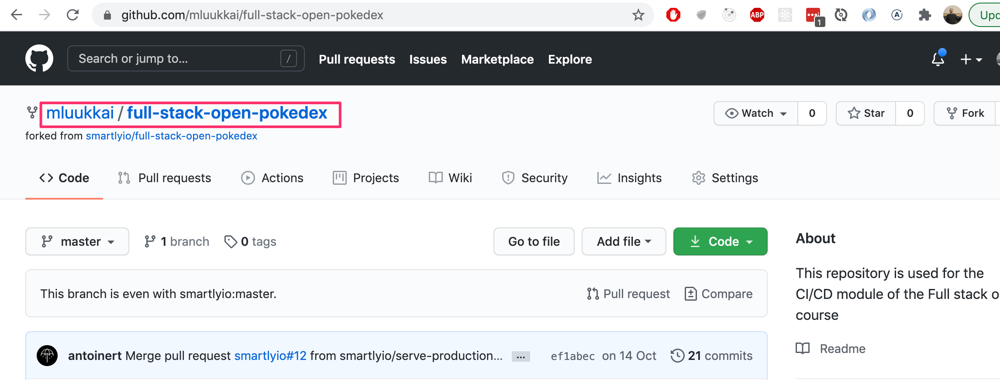
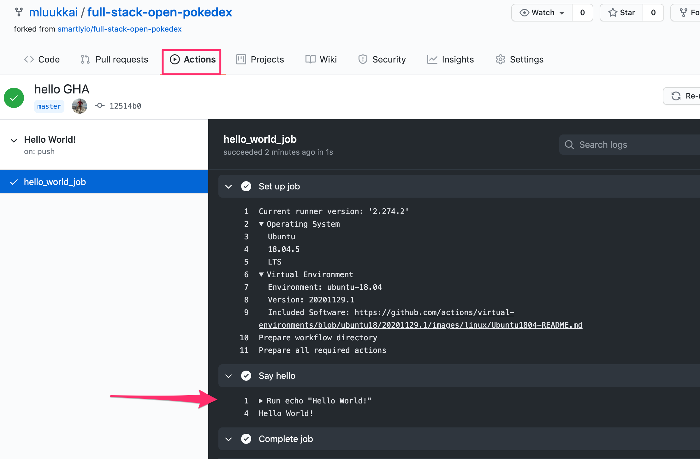
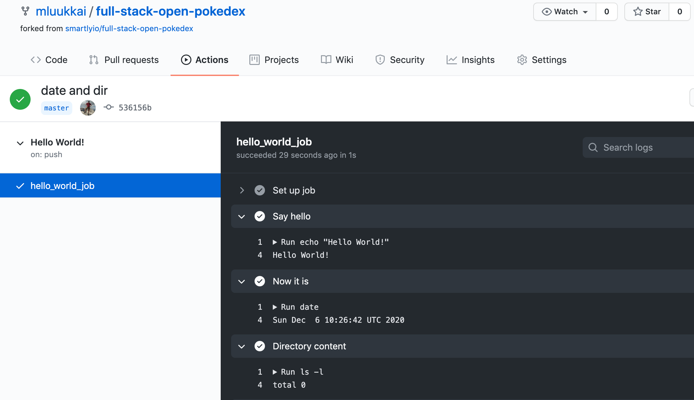
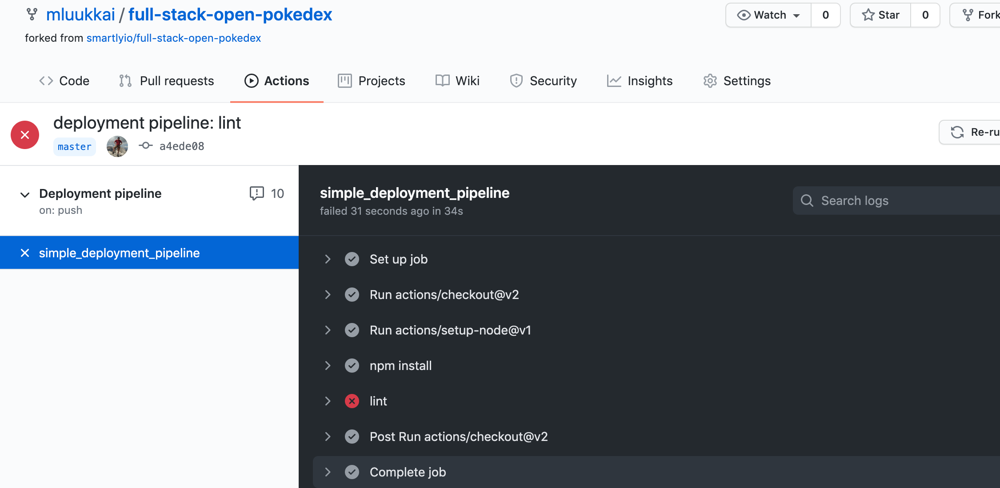
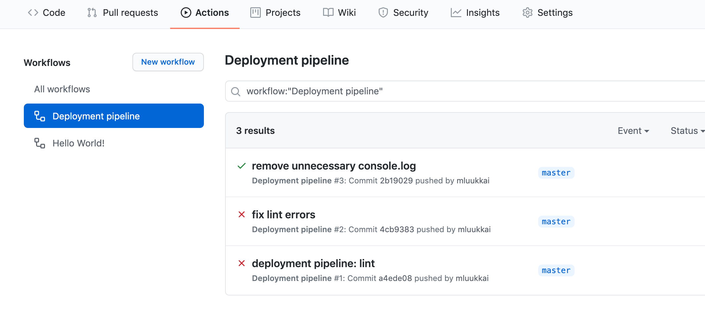
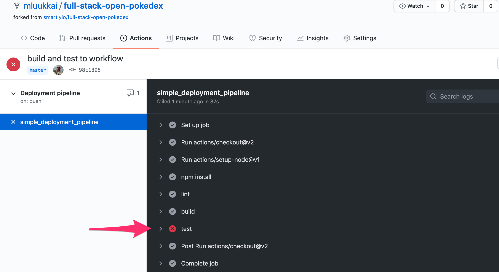
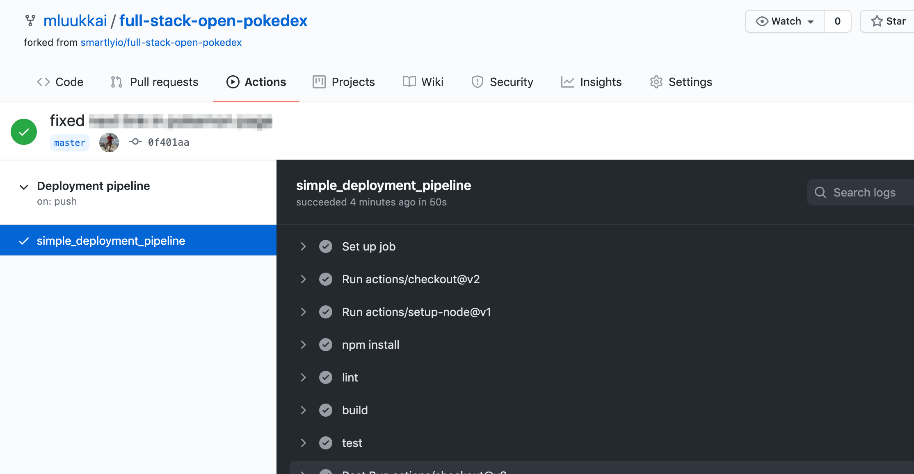
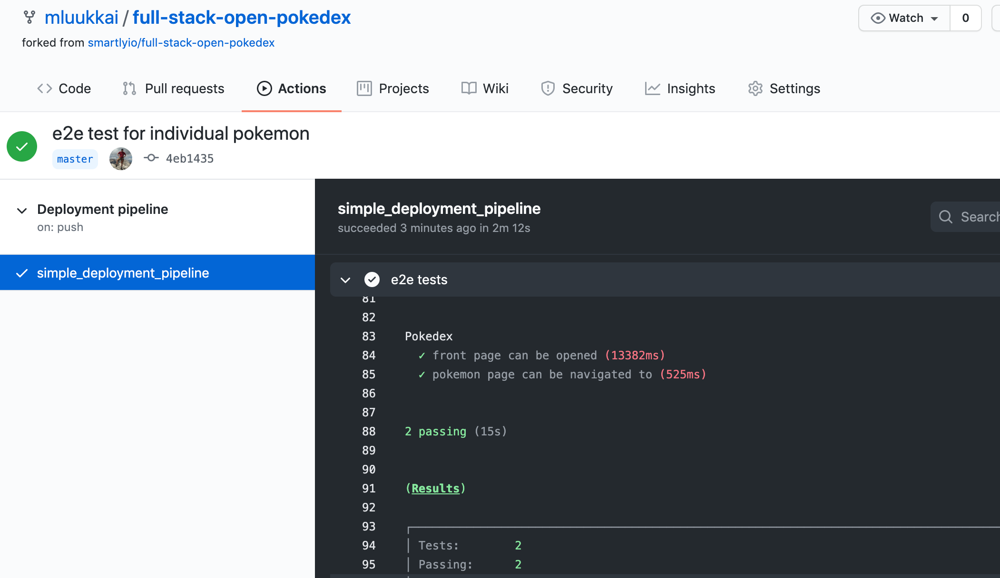

<div class="content">

قبل أن نبدأ في التعامل مع إجراءات جيت هب (GitHub Actions)، دعنا نلقي نظرة على ماهيتها وكيفية عملها.

تعمل إجراءات GitHub Actions بناءً على [سير العمل (Workflows)](https://docs.github.com/en/free-pro-team@latest/actions/learn-github-actions/introduction-to-github-actions#workflows). سير العمل هو عبارة عن سلسلة من [المهام (Jobs)](https://docs.github.com/en/free-pro-team@latest/actions/learn-github-actions/introduction-to-github-actions#jobs) التي تعمل عندما يُطلقها [حدث (Event)](https://docs.github.com/en/free-pro-team@latest/actions/learn-github-actions/introduction-to-github-actions#events) محدد. تحتوي كل مهمة على مجموعة التعليمات الخاصة بها التي تخبر GitHub Actions بما يجب القيام به.

يبدو التنفيذ النموذجي لسير العمل كما يلي:

- وقوع الحدث المُحفز (على سبيل المثال: إرسال دفعة تعديلات `push` إلى الفرع الرئيسي main).
- تنفيذ سير العمل المرتبط بذلك المحفز.
- التنظيف وإزالة الموارد المؤقتة (Cleanup).

### الاحتياجات الأساسية (Basic needs)

بشكل عام، لكي يعمل التكامل المستمر (CI) على مستودع، نحتاج إلى بعض الأمور الأساسية:

- مستودع برمجي (Repository) بطبيعة الحال.
- تعريف لما يحتاج التكامل المستمر CI للقيام به: يمكن أن يكون ذلك على شكل ملف تكوين محدد داخل المستودع أو يمكن تعريفه في نظام الـ CI نفسه.
- يحتاج نظام الـ CI إلى معرفة وجود المستودع (وملف التكوين بداخله).
- يحتاج نظام الـ CI إلى القدرة على الوصول إلى المستودع.
- يحتاج نظام الـ CI إلى أذونات وصلاحيات لتنفيذ الإجراءات المفترض به القيام بها: على سبيل المثال، إذا كان الـ CI بحاجة للنشر إلى بيئة الإنتاج، فإنه يحتاج إلى *بيانات اعتماد (Credentials)* لتلك البيئة.

هذا هو النموذج التقليدي على الأقل، وسنرى بعد قليل كيف تختصر GitHub Actions بعض هذه الخطوات وتجعلك في غنى عن القلق بشأنها!

تتمتع GitHub Actions بميزة كبيرة مقارنة بالحلول المستضافة ذاتياً: المستودع مستضاف لدى نفس مزود خدمة الـ CI. بعبارة أخرى، يوفر GitHub كلاً من المستودع ومنصة التكامل المستمر معاً. هذا يعني أنه إذا قمنا بتمكين Actions لمستودع ما، فإن GitHub يكون على دراية مسبقة بوجود سير العمل لدينا وكيف تبدو تلك التعريفات.

</div>

<div class="tasks">

### التمرين 11.2.

في معظم تمارين هذا الجزء، سنقوم ببناء خط أنابيب CI/CD لمشروع صغير موجود في [مستودع المشروع النموذجي هذا](https://github.com/fullstack-hy2020/full-stack-open-pokedex).

#### 11.2 المشروع النموذجي (The example project)

أول شيء ستحتاج إلى فعله هو إنشاء تفريع (Fork) للمستودع النموذجي تحت حسابك الخاص. ما يفعله هذا الإجراء بشكل أساسي هو إنشاء نسخة من المستودع تحت ملفك الشخصي في GitHub لاستخدامك الخاص.

لتفريع المستودع، يمكنك النقر على زر **Fork** في الزاوية العلوية اليمنى من واجهة المستودع بجوار زر النجمة (Star):


بمجرد النقر فوق زر Fork، سيبدأ GitHub في إنشاء مستودع جديد يسمى `github_username}/full-stack-open-pokedex}`.

بمجرد انتهاء العملية، ستتم إعادة توجيهك إلى مستودعك الجديد كلياً:



قم باستنساخ (Clone) المشروع الآن إلى جهازك المحلي. وكما هو الحال دائماً عند البدء بمشروع برمجي جديد، فإن المكان الأنسب للبدء بالاطلاع عليه هو ملف `package.json`.

*ملاحظة: نظراً لأن المشروع قديم بعض الشيء، فأنت بحاجة إلى استخدام Node 16 أو أعلى للعمل معه!*

جرّب الآن تنفيذ الخطوات التالية:
- تثبيت التبعيات (عبر تشغيل الأمر `npm install`)
- تشغيل التطبيق في وضع التطوير
- تشغيل الاختبارات
- فحص وتدقيق الشيفرة (Linting)

قد تلاحظ أن المشروع يحتوي على بعض الاختبارات المعطلة وأخطاء في التدقيق (Linting errors). **اتركها كما هي في الوقت الحالي.** سنتعامل معها لاحقاً في التمارين.

**ملاحظة**: تم إنشاء اختبارات المشروع باستخدام مكتبة [Jest](https://jestjs.io/). بينما تستخدم مادة الدورة في [الجزء الخامس](/ar/part5/testing_react_apps) مكتبة [Vitest](https://vitest.dev/guide/). من وجهة نظر الاستخدام، لا تكاد توجد فروق تذكر بين المكتبين.

وكما تتذكر من [الجزء 3](/ar/part3/deploying_app_to_internet#frontend-production-build)، فإن كود React *لا ينبغي* تشغيله في وضع التطوير بمجرد نشره في الإنتاج. جرّب الآن الآتي:
- إنشاء نسخة إنتاج مبنية (Production Build) من المشروع
- تشغيل نسخة الإنتاج محلياً على جهازك

لهاتين المهمتين أيضاً نصوص برمجية (npm scripts) جاهزة في المشروع!

ادرس بنية المشروع لبعض الوقت. كما تلاحظ، فإن كود الواجهة الأمامية والخلفية موجودان الآن [في نفس المستودع Monorepo](/ar/part7/class_components_miscellaneous#frontend-and-backend-in-the-same-repository). في الأجزاء السابقة من الدورة كان لدينا مستودع منفصل لكل منهما، ولكن وجودهما في نفس المستودع يجعل الأمور أبسط بكثير عند إعداد بيئة التكامل المستمر CI.

على عكس معظم المشاريع في هذه الدورة، فإن كود الواجهة الأمامية *لا يستخدم* Vite، بل يحتوي على تكوين [Webpack](/ar/part7/webpack) بسيط نسبياً يتولى إنشاء بيئة التطوير وتجميع حزمة الإنتاج.

</div>

<div class="content">

### بدء العمل مع سير العمل (Getting started with workflows)

المكون الأساسي لإنشاء خطوط أنابيب CI/CD باستخدام GitHub Actions هو ما يُعرف بـ [سير العمل (Workflow)](https://docs.github.com/en/free-pro-team@latest/actions/learn-github-actions/introduction-to-github-actions#workflows). خطوط سير العمل هي مسارات عمليات يمكنك إعدادها في مستودعك لتشغيل مهام مؤتمتة مثل البناء والاختبار والفحص والتدقيق والإصدار والنشر وغيرها الكثير! يبدو التسلسل الهرمي لسير العمل كالتالي:

Workflow (سير العمل)

- Job (مهمة)
  - Step (خطوة)
  - Step (خطوة)
- Job (مهمة)
  - Step (خطوة)

يجب أن يحدد كل سير عمل مهمة واحدة على الأقل [Job](https://docs.github.com/en/free-pro-team@latest/actions/learn-github-actions/introduction-to-github-actions#jobs)، والتي تحتوي بدورها على مجموعة من الخطوات [Steps](https://docs.github.com/en/free-pro-team@latest/actions/learn-github-actions/introduction-to-github-actions#steps) لأداء المهام الفردية. يتم تشغيل المهام (Jobs) بالتوازي بشكل افتراضي، بينما يتم تنفيذ الخطوات (Steps) داخل كل مهمة بالتسلسل.

يمكن أن تتنوع الخطوات من تشغيل أمر مخصص إلى استخدام إجراءات محددة مسبقاً، ومن هنا جاء الاسم GitHub Actions. يمكنك إنشاء [إجراءات مخصصة](https://docs.github.com/en/free-pro-team@latest/actions/creating-actions) أو استخدام أي إجراءات ينشرها المجتمع، وهي وفيرة جداً، ولكن دعنا نعد إلى ذلك لاحقاً!

لكي يتعرف GitHub على مسارات سير العمل الخاصة بك، يجب تحديدها في مجلد `.github/workflows` داخل مستودعك. كل سير عمل هو ملف منفصل بحد ذاته يجب تكوينه باستخدام لغة تسلسل البيانات `YAML`.

YAML هو اختصار متكرر لـ "YAML Ain't Markup Language". وكما يوحي الاسم، فإن هدفها هو أن تكون سهلة القراءة للبشر، وتُستخدم بشكل شائع لملفات التكوين. ستلاحظ أدناه أنها في الواقع سهلة الفهم للغاية!

لاحظ أن المسافات البادئة (Indentations) مهمة جداً في YAML. يمكنك معرفة المزيد حول بناء الجملة النحوية [هنا](https://docs.ansible.com/ansible/latest/reference_appendices/YAMLSyntax.html).

يحتوي سير العمل الأساسي على ثلاثة عناصر في مستند YAML:

- `name`: اسم سير العمل.
- `on` (المحفزات Triggers): الأحداث التي تؤدي إلى تشغيل سير العمل.
- `jobs`: المهام المنفصلة التي سيقوم سير العمل بتنفيذها (قد يحتوي سير العمل الأساسي على مهمة واحدة فقط).

يبدو تعريف سير العمل البسيط كالتالي:

```yml
name: Hello World!

on:
  push:
    branches:
      - main

jobs:
  hello_world_job:
    runs-on: ubuntu-latest
    steps:
      - name: Say hello
        run: |
          echo "Hello World!"
```

توجد مهمة واحدة باسم `hello_world_job`، وسيتم تشغيلها في بيئة افتراضية بنظام Ubuntu. تحتوي المهمة على خطوة واحدة فقط تسمى "Say hello"، والتي ستنفذ أمر `echo "Hello World!"` في الصدفة (Shell).

قد تسأل، متى يقوم GitHub بتشغيل سير العمل؟ هناك العديد من [الخيارات](https://docs.github.com/en/free-pro-team@latest/actions/reference/events-that-trigger-workflows) للاختيار من بينها، ولكن بشكل عام، يمكنك تكوين سير العمل ليبدأ بمجرد:

- وقوع *حدث على GitHub* مثل عندما يدفع شخص ما كوميت إلى المستودع أو عند إنشاء مشكلة (Issue) أو طلب سحب (Pull Request).
- وقوع *حدث مجدول* يتم تحديده باستخدام صياغة [cron](https://en.wikipedia.org/wiki/Cron).
- وقوع *حدث خارجي*، على سبيل المثال، تنفيذ أمر في تطبيق خارجي مثل تطبيق المراسلة [Slack](https://slack.com/) أو [Discord](https://discord.com/).

لمعرفة المزيد حول الأحداث التي يمكن استخدامها لتشغيل مسارات سير العمل، يرجى الرجوع إلى [وثائق GitHub Actions الرسمية](https://docs.github.com/en/free-pro-team@latest/actions/reference/events-that-trigger-workflows).

</div>

<div class="tasks">

### التمارين 11.3-11.4.

لربط كل هذا معاً، دعنا الآن نشغّل GitHub Actions في المشروع النموذجي!

#### 11.3 أهلاً بالعالم! (Hello world!)

أنشئ سير عمل جديداً يخرج عبارة "Hello World!" للمستخدم. للإعداد، يجب عليك إنشاء المجلد `.github/workflows` وملف `hello.yml` داخل مستودعك.

لمعرفة ما قام به سير عمل GitHub Action، يمكنك الانتقال إلى تبويب **Actions** في GitHub حيث سترى مسارات سير العمل في مستودعك والخطوات التي تنفذها. يجب أن تبدو مخرجات سير عمل Hello World الخاصة بك بهذا الشكل عند تكوينها بشكل صحيح:



يجب أن تشاهد رسالة "Hello World!" كمخرج. إذا كان الأمر كذلك، فقد نجحت في اجتياز جميع الخطوات اللازمة. لديك الآن أول سير عمل نشط في GitHub Actions!

لاحظ أن GitHub Actions يعلمك أيضاً بالبيئة الدقيقة (نظام التشغيل وإعداده) التي يتم تشغيل سير العمل فيها. هذا مهم لأنه إذا حدث شيء مفاجئ، فإنه يجعل تصحيح الأخطاء أسهل بكثير إذا كان بإمكانك إعادة إنتاج جميع الخطوات على جهازك!

#### 11.4 التاريخ ومحتويات المجلد (Date and directory contents)

قم بتوسيع سير العمل بخطوات تطبع التاريخ والمحتوى الحالي للمجلد بالتنسيق الطويل (Long format).

كلا الخطوتين سهلتان، ومجرد تشغيل الأمرين [date](https://man7.org/linux/man-pages/man1/date.1.html) و [ls](https://man7.org/linux/man-pages/man1/ls.1.html) سيؤدي الغرض.

يجب أن يبدو سير عملك الآن كما يلي:



كما يوضح ناتج الأمر `ls -l`، فإنه بشكل افتراضي، البيئة الافتراضية التي تشغل سير العمل لدينا *لا تحتوي على أي كود برمجيات*!

</div>

<div class="content">

### إعداد خطوات الفحص (Lint) والاختبار (Test) والبناء (Build)

بعد إكمال التمارين الأولى، يجب أن يكون لديك سير عمل بسيط ولكن غير مفيد عملياً. دعنا نجعل سير العمل يقوم بشيء ذي قيمة حقيقية.

دعنا نطبق GitHub Action يقوم بالتدقيق اللغوي للشيفرة (Linting). إذا لم تجتز الشيفرة الفحوصات، فستظهر GitHub Actions حالة حمراء (Red status).

في البداية، سيبدو سير العمل الذي سنحفظه في الملف `pipeline.yml` كما يلي:

```yml
name: Deployment pipeline

on:
  push:
    branches:
      - main

jobs:
```

قبل أن نتمكن من تشغيل أمر لفحص الكود، يتعين علينا تنفيذ إجراءين لإعداد بيئة المهمة.

#### إعداد البيئة (Setting up the environment)

يعد إعداد البيئة مهمة أساسية أثناء تكوين خط الأنابيب. سنستخدم بيئة افتراضية بنظام `ubuntu-latest` لأن هذا هو إصدار Ubuntu الذي سنقوم بتشغيله في الإنتاج.

من المهم تكرار نفس البيئة في الـ CI كما في الإنتاج قدر الإمكان، لتجنب المواقف التي يعمل فيها نفس الكود بشكل مختلف بين الـ CI والإنتاج، وهو ما يبطل الغرض من استخدام الـ CI أساساً.

بعد ذلك، نسرد الخطوات في مهمة "البناء" التي سيحتاج الـ CI إلى أدائها. كما لاحظنا في التمرين السابق، لا تحتوي البيئة الافتراضية افتراضياً على أي كود بداخلها، لذلك نحتاج إلى *استخراج الكود (Checkout the code)* من المستودع.

هذه خطوة بسيطة:

```yml
name: Deployment pipeline

on:
  push:
    branches:
      - main

jobs:
  simple_deployment_pipeline: # highlight-line
    runs-on: ubuntu-latest # highlight-line
    steps: # highlight-line
      - uses: actions/checkout@v4 # highlight-line
```

تخبر الكلمة المفتاحية [uses](https://docs.github.com/en/free-pro-team@latest/actions/reference/workflow-syntax-for-github-actions#jobsjob_idstepsuses) سير العمل بتشغيل *إجراء محدد (Action)*. الإجراء هو قطعة برمجية قابلة لإعادة الاستخدام، مثل الدالة. يمكن تعريف الإجراءات في مستودعك في ملف منفصل أو يمكنك استخدام تلك المتوفرة في المستودعات العامة.

نستخدم هنا إجراءً عاماً [actions/checkout](https://github.com/actions/checkout) ونحدد الإصدار (`@v4`) لتجنب التغييرات الجذرية المحتملة في حال تم تحديث الإجراء. يقوم إجراء `checkout` بما يوحي به اسمه: فهو يجلب الشيفرة المصدرية للمشروع من Git.

ثانياً، نظراً لأن التطبيق مكتوب بلغة JavaScript، فيجب إعداد Node.js للتمكن من استخدام الأوامر المحددة في `package.json`. لإعداد Node.js، يمكن استخدام الإجراء [actions/setup-node](https://github.com/actions/setup-node). يتم تحديد الإصدار `20` لأنه الإصدار الذي يستخدمه التطبيق في بيئة الإنتاج.

```yml
# name and trigger not shown anymore...

jobs:
  simple_deployment_pipeline:
    runs-on: ubuntu-latest
    steps:
      - uses: actions/checkout@v4
      - uses: actions/setup-node@v4 # highlight-line
        with: # highlight-line
          node-version: '20' # highlight-line
```

كما نرى، تُستخدم الكلمة المفتاحية [with](https://docs.github.com/en/free-pro-team@latest/actions/reference/workflow-syntax-for-github-actions#jobsjob_idstepswith) لتمرير "معامل" إلى الإجراء. هنا يحدد المعامل إصدار Node.js الذي نريد استخدامه.

أخيراً، يجب تثبيت تبعيات التطبيق. تماماً كما هو الحال على جهازك الخاص، نقوم بتنفيذ `npm install`. يجب أن تبدو الخطوات في المهمة الآن كالتالي:

```yml
jobs:
  simple_deployment_pipeline:
    runs-on: ubuntu-latest
    steps:
      - uses: actions/checkout@v4
      - uses: actions/setup-node@v4
        with:
          node-version: '20'
      - name: Install dependencies # highlight-line
        run: npm install # highlight-line
```

الآن يجب أن تكون البيئة جاهزة تماماً للمهمة لتشغيل المهام الحقيقية الهامة!

#### فحص وتدقيق التنسيق (Lint)

بعد إعداد البيئة، يمكننا تشغيل جميع البرامج النصية من `package.json` كما نفعل على أجهزتنا الخاصة. لتدقيق الكود، كل ما عليك فعله هو إضافة خطوة لتشغيل الأمر `npm run eslint`.

```yml
jobs:
  simple_deployment_pipeline:
    runs-on: ubuntu-latest
    steps:
      - uses: actions/checkout@v4
      - uses: actions/setup-node@v4
        with:
          node-version: '20'
      - name: Install dependencies 
        run: npm install  
      - name: Check style  # highlight-line
        run: npm run eslint # highlight-line
```

لاحظ أن اسم الخطوة (`name`) اختياري، فإذا قمت بتعريف خطوة كما يلي:

```yml
- run: npm run eslint
```

سيتم استخدام الأمر الذي تم تشغيله كاسم افتراضي للخطوة.

</div>

<div class="tasks">

### التمارين 11.5.-11.9.

#### 11.5 سير عمل التدقيق (Linting workflow)

قم بتطبيق سير عمل "التدقيق" (Lint) وأرسله (Commit) إلى المستودع. استخدم ملف *yml* جديداً لسير العمل هذا، ويمكنك تسميته على سبيل المثال `pipeline.yml`.

ادفع الكود (Push) وانتقل إلى علامة التبويب "Actions" وانقر على سير العمل الذي تم إنشاؤه حديثاً على اليسار. يجب أن ترى أن تشغيل سير العمل قد فشل:



#### 11.6 إصلاح الكود (Fix the code)

هناك بعض المشكلات في الكود التي ستحتاج إلى إصلاحها. افتح سجلات سير العمل وتحقق من الخطأ.

تلميحان لمساعدتك: من الأفضل إصلاح أحد الأخطاء عن طريق تحديد بيئة مناسبة (*env*) للتدقيق، انظر [هنا](/ar/part3/validation_and_es_lint#lint) كيف يمكن القيام بذلك. يمكن معالجة إحدى الشكاوى المتعلقة ببيان `console.log` ببساطة عن طريق تعطيل القاعدة لذلك السطر المحدد. اسأل جوجل عن كيفية القيام بذلك.

قم بإجراء التغييرات اللازمة على الشيفرة المصدرية حتى يجتاز سير عمل التدقيق بنجاح. بمجرد إرسال كود جديد، سيعمل سير العمل مرة أخرى وسترى مخرجات محدثة حيث يتحول كل شيء إلى اللون الأخضر مرة أخرى:



#### 11.7 البناء والاختبار (Building and testing)

دعنا نتوسع في سير العمل السابق الذي يقوم حالياً بتدقيق الكود. قم بتحرير سير العمل وبشكل مشابه لأمر التدقيق، أضف أوامر للبناء (Build) والاختبار (Test). بعد هذه الخطوة، يجب أن تبدو النتيجة كما يلي:



وكما خمنت، هناك بعض المشاكل والأخطاء في الكود...

#### 11.8 العودة إلى اللون الأخضر (Back to green)

تحقق من الاختبار الذي يفشل وقم بإصلاح المشكلة في الكود (لا تقم بتغيير الاختبارات نفسها).

بمجرد إصلاح جميع المشكلات وخلو Pokedex من الأخطاء، سينجح تشغيل سير العمل ويظهر باللون الأخضر!



#### 11.9 اختبارات شاملة بسيطة طرفاً لطرف (Simple end-to-end tests)

تستخدم مجموعة الاختبارات الحالية مكتبة [Jest](https://jestjs.io/) لضمان عمل مكونات React على النحو المنشود. هذا هو في الأساس نفس الشيء الذي تم إنجازه في قسم [اختبار تطبيقات React](/ar/part5/testing_react_apps) من الجزء 5 باستخدام [Vitest](https://vitest.dev/).

يعد اختبار المكونات بمعزل عن غيرها مفيداً للغاية، ولكنه لا يزال لا يضمن أن النظام ككل يعمل كما نتمنى. للحصول على مزيد من الثقة حول هذا الموضوع، دعنا نكتب بضعة اختبارات بسيطة للغاية طرفاً لطرف (E2E) كما فعلنا في قسم [الجزء الخامس](/ar/part5/). يمكنك استخدام [Playwright](https://playwright.dev/) أو [Cypress](https://www.cypress.io/) للاختبارات.

بغض النظر عما تختاره، يجب عليك توسيع تعريف Jest في ملف `package.json` لمنع Jest من محاولة تشغيل اختبارات e2e. بافتراض استخدام المجلد *e2e-tests* لاختبارات e2e، يكون التعريف كالتالي:

```json
{
  // ...
  "jest": {
    "testEnvironment": "jsdom",
    "testPathIgnorePatterns": ["e2e-tests"] // highlight-line
  }
}
```

**استخدام Playwright**

قم بإعداد Playwright (ستجد [هنا](/ar/part5/end_to_end_testing_playwright) كل المعلومات التي تحتاجها) في مستودعك. لاحظ أنه على عكس الجزء 5، يجب عليك الآن تثبيت Playwright في نفس المشروع مع بقية الكود!

استخدم هذا الاختبار أولاً:

```js
const { test, describe, expect, beforeEach } = require('@playwright/test')

describe('Pokedex', () => {
  test('front page can be opened', async ({ page }) => {
    await page.goto('')
    await expect(page.getByText('ivysaur')).toBeVisible()
    await expect(page.getByText('Pokémon and Pokémon character names are trademarks of Nintendo.')).toBeVisible()
  })
})
```

**ملاحظة**: على الرغم من أن الصفحة تصيّر أسماء البوكيمون بحرف استهلالي كبير، إلا أن الأسماء مكتوبة في الواقع بأحرف صغيرة في المصدر، لذا يجب عليك اختبار `ivysaur` بدلاً من `Ivysaur`!

حدد نص npm سكريبت `test:e2e` لتشغيل اختبارات e2e من سطر الأوامر.

تذكر أن اختبارات Playwright *تفترض أن التطبيق قيد التشغيل بالفعل* عند تشغيل الاختبار! بدلاً من بدء تشغيل التطبيق يدوياً، يجب عليك الآن تكوين *خادم تطوير Playwright* لبدء تشغيل التطبيق أثناء تنفيذ الاختبارات، انظر [هنا](https://playwright.dev/docs/next/api/class-testconfig#test-config-web-server) كيف يمكن القيام بذلك.

تأكد من اجتياز الاختبار محلياً. بمجرد أن يعمل الاختبار الشامل طرفاً لطرف على جهازك، قم بتضمينه في سير عمل GitHub Action. يجب أن يكون ذلك سهلاً للغاية باتباع [هذا الدليل](https://playwright.dev/docs/ci-intro#on-pushpull_request).

**استخدام Cypress**

قم بإعداد Cypress (ستجد [هنا](/ar/part5/end_to_end_testing_cypress) كل المعلومات التي تحتاجها) واستخدم هذا الاختبار أولاً:

```js
describe('Pokedex', function() {
  it('front page can be opened', function() {
    cy.visit('http://localhost:5000')
    cy.contains('ivysaur')
    cy.contains('Pokémon and Pokémon character names are trademarks of Nintendo.')
  })
})
```

حدد نص npm سكريبت `test:e2e` لتشغيل اختبارات e2e من سطر الأوامر.

**ملاحظة**: على الرغم من أن الصفحة تصيّر أسماء البوكيمون بحرف استهلالي كبير، إلا أن الأسماء مكتوبة في الواقع بأحرف صغيرة في المصدر، لذا يجب عليك اختبار `ivysaur` بدلاً من `Ivysaur`!

تأكد من اجتياز الاختبار محلياً. تذكر أن اختبارات Cypress *تفترض أن التطبيق قيد التشغيل بالفعل* عند تشغيل الاختبار! إذا نسيت التفاصيل، يرجى الاطلاع على [الجزء الخامس](/ar/part5/end_to_end_testing) حول كيفية بدء التشغيل باستخدام Cypress.

بمجرد أن يعمل الاختبار الشامل طرفاً لطرف على جهازك، قم بتضمينه في سير عمل GitHub Action. أسهل طريقة للقيام بذلك على الإطلاق هي استخدام الإجراء الجاهز [cypress-io/github-action](https://github.com/cypress-io/github-action). الخطوة التي تناسبنا هي كالتالي:

```js
- name: e2e tests
  uses: cypress-io/github-action@v5
  with:
    command: npm run test:e2e
    start: npm run start-prod
    wait-on: http://localhost:5000
```

يتم استخدام ثلاثة خيارات: يحدد [command](https://github.com/cypress-io/github-action#custom-test-command) كيفية تشغيل اختبارات Cypress، ويعطي [start](https://github.com/cypress-io/github-action#start-server) نص npm البرمجي الذي يبدأ تشغيل الخادم، ويحدد [wait-on](https://github.com/cypress-io/github-action#wait-on) أنه قبل تشغيل الاختبارات، يجب أن يكون الخادم قد بدأ العمل بالفعل على العنوان `http://localhost:5000`.

لاحظ أنك بحاجة إلى بناء التطبيق في GitHub Actions قبل أن يمكن تشغيله في وضع الإنتاج!

**بمجرد أن يعمل خط الأنابيب...**

بمجرد أن تتأكد من أن خط الأنابيب يعمل بنجاح، *اكتب اختباراً آخر* يضمن إمكانية الانتقال من الصفحة الرئيسية إلى صفحة بوكيمون معين، على سبيل المثال `ivysaur`. لا يلزم أن يكون الاختبار معقداً، فقط تحقق من أنه عند الانتقال إلى الرابط، تحتوي الصفحة على بعض المحتوى المناسب، مثل النص `chlorophyll` في حالة `ivysaur`.

**ملاحظة**: تمت كتابة قدرات البوكيمون بأحرف صغيرة في الشيفرة المصدرية (تتم كتابة الأحرف الكبيرة في CSS)، لذا *لا تختبر* النص `Chlorophyll` بل اختبر `chlorophyll`.

يجب أن تكون النتيجة النهائية شيئاً مثل هذا:



تعد الاختبارات الشاملة طرفاً لطرف رائعة لأنها تمنحنا الثقة بأن البرنامج يعمل من منظور المستخدم النهائي. الثمن الذي يتعين علينا دفعه هو بطء وقت الاستجابة، حيث يستغرق تنفيذ سير العمل بأكمله الآن وقتاً أطول بكثير.

</div>
