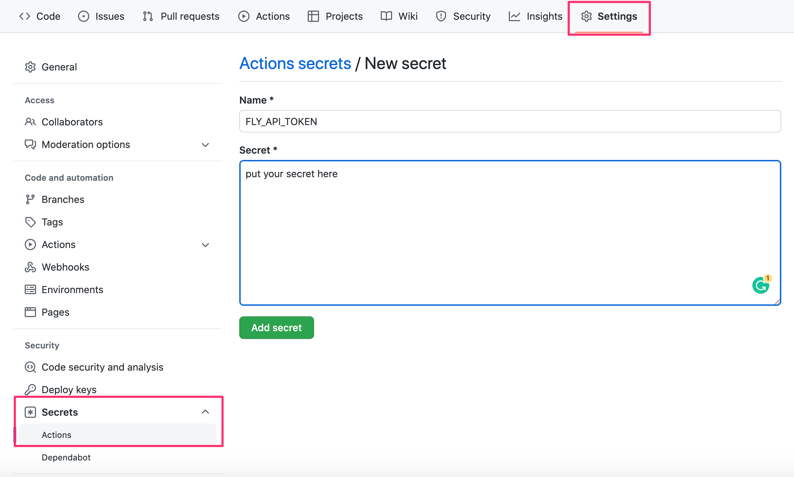
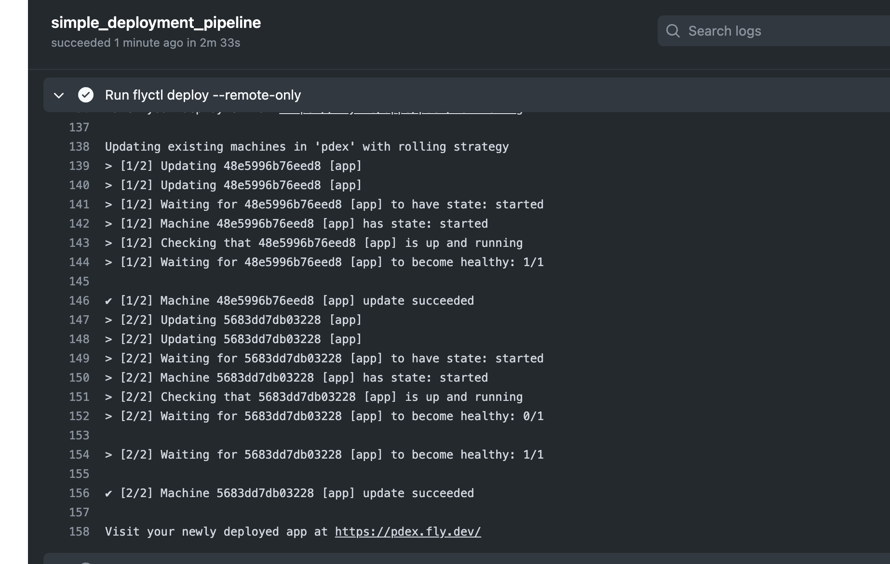
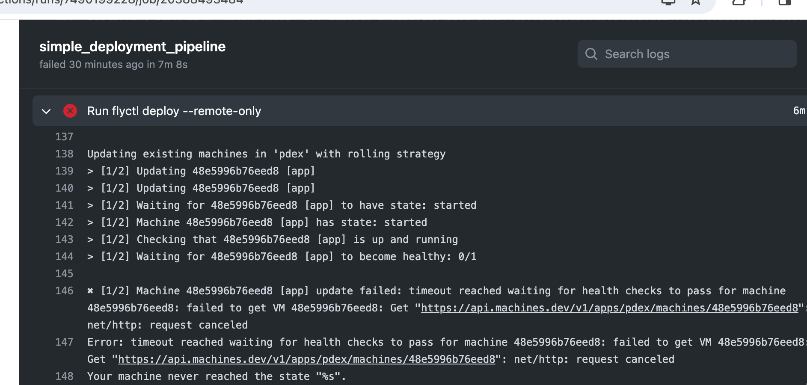
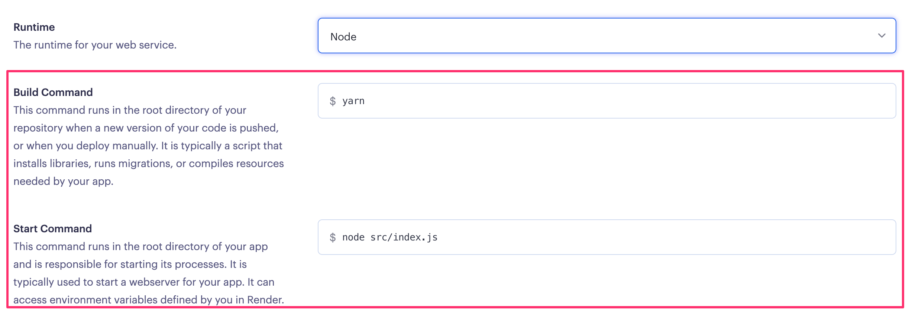
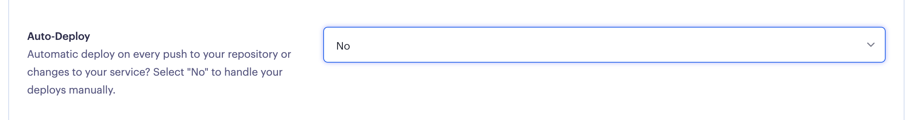
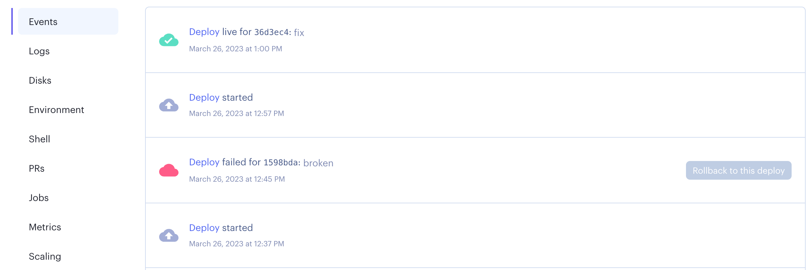

<div class="content">

بعد أن قمنا بكتابة تطبيق متكامل ورائع، حان الوقت للتفكير في كيفية نشره وإتاحته لاستخدام المستخدمين الحقيقيين.

في [الجزء الثالث](/ar/part3/deploying_app_to_internet) من هذه الدورة، قمنا بذلك ببساطة عن طريق تشغيل أمر واحد من الطرفية (Terminal) لتشغيل الكود على خوادم موفر السحابة [Fly.io](https://fly.io/) أو [Render](https://render.com/).

يعد إصدار البرمجيات في Fly.io و Render بسيطاً جداً مقارنة بالعديد من أنواع إعدادات الاستضافة الأخرى، ولكنه لا يزال ينطوي على مخاطر: لا يوجد شيء يمنعنا من نشر كود معطوب عن طريق الخطأ إلى بيئة الإنتاج.

بعد ذلك، سنلقي نظرة على مبادئ إجراء النشر بأمان وبعض مبادئ نشر البرمجيات على المستويين الصغير والواسع.

### أي شيء يمكن أن يسير بشكل خاطئ... (Murphy's Law)

نود تحديد بعض القواعد حول كيفية عمل عملية النشر لدينا، ولكن قبل ذلك، علينا النظر في بعض قيود الواقع.

تنص إحدى صياغات قانون مورفي (Murphy's Law) على ما يلي:
> "كل ما يمكن أن يسير بشكل خاطئ، سوف يسير بشكل خاطئ."

من المهم تذكر ذلك عندما نخطط لنظام النشر الخاص بنا. تتضمن بعض الأشياء التي سنحتاج إلى وضعها في الحسبان ما يلي:
- ماذا لو تعطل جهاز الكمبيوتر الخاص بي أو تجمد أثناء النشر؟
- أنا متصل بالخادم وأنشر عبر الإنترنت، فماذا يحدث إذا انقطع اتصال الإنترنت لدي؟
- ماذا يحدث إذا فشلت أي تعليمة محددة في البرنامج النصي / نظام النشر الخاص بي؟
- ماذا يحدث إذا لم يعمل برنامجي كما هو متوقع على الخادم الذي أنشر عليه لأي سبب كان؟ هل يمكنني التراجع (Rollback) إلى إصدار سابق؟
- ماذا يحدث إذا أجرى مستخدم طلب HTTP لتطبيقنا قبل أن نقوم بالنشر مباشرة (ولم يكن لدينا وقت لإرسال الرد إلى المستخدم)؟

هذه مجرد عينة صغيرة مما يمكن أن يحدث أثناء النشر، أو بالأحرى، أشياء يجب أن نخطط لها. بغض النظر عما يحدث، يجب ألا يترك نظام النشر الخاص بنا برامجنا في حالة معطوبة **أبداً**. يجب أن نعلم دائماً (أو نكون قادرين على معرفة) الحالة التي وصل إليها النشر.

قاعدة مهمة أخرى يجب تذكرها عندما يتعلق الأمر بعمليات النشر (والتكامل المستمر CI بشكل عام) هي:
> "الإخفاقات الصامتة (Silent Failures) سيئة **للغاية**!"

هذا لا يعني ضرورة إظهار حالات الفشل لمستخدمي البرنامج، بل يعني أننا بحاجة إلى أن نكون على علم ودراية إذا حدث أي خطأ. إذا كنا على علم بوجود مشكلة، فيمكننا إصلاحها. إذا لم يظهر نظام النشر أي أخطاء ولكنه فشل في الواقع، فقد ينتهي بنا الأمر في حالة نعتقد فيها أننا أصلحنا خطأً فادحاً بينما فشل النشر، مما يترك الخطأ في بيئة الإنتاج لدينا ونحن غير مدركين للموقف.

### ما الذي يفعله نظام النشر الجيد؟ (What does a good deployment system do?)

يعد تحديد قواعد أو متطلبات قاطعة لنظام النشر أمراً صعباً، ولكن دعنا نحاول على أي حال:
- يجب أن يكون نظام النشر الخاص بنا قادراً على الفشل بلباقة (Fail Gracefully) في **أي** خطوة من خطوات النشر.
- يجب ألا يترك نظام النشر الخاص بنا برامجنا في حالة معطوبة **أبداً**.
- يجب أن يعلمنا نظام النشر الخاص بنا عند حدوث فشل. من المهم الإخطار بالفشل أكثر من الإخطار بالنجاح.
- يجب أن يسمح لنا نظام النشر الخاص بنا بالتراجع (Rollback) إلى نشر سابق:
  - ويفضل أن يكون هذا التراجع أسهل في التنفيذ وأقل عرضة للفشل من النشر الكامل.
  - وبطبيعة الحال، فإن الخيار الأفضل هو التراجع التلقائي في حالة فشل النشر.
- يجب أن يتعامل نظام النشر الخاص بنا مع الموقف الذي يقدم فيه المستخدم طلب HTTP قبل النشر مباشرة أو أثناءه.
- يجب أن يتأكد نظام النشر الخاص بنا من أن البرنامج الذي ننشره يلبي المتطلبات التي حددناها لذلك (على سبيل المثال: عدم النشر إذا لم يتم تشغيل الاختبارات بنجاح).

دعنا نحدد بعض الأشياء التي **نريدها** في هذا النظام الافتراضي أيضاً:
- نود أن يكون سريعاً.
- نود ألا يكون هناك وقت توقف عن العمل (Zero Downtime) أثناء النشر (وهذا يختلف عن المتطلب الذي لدينا للتعامل مع طلبات المستخدمين قبل النشر مباشرة أو أثناءه).

بعد ذلك، سيكون لدينا مجموعتان من التمارين لأتمتة النشر باستخدام GitHub Actions، إحداهما لـ [Fly.io](https://fly.io/) والأخرى لـ [Render](https://render.com/). تختلف عملية النشر دائماً باختلاف موفر السحابة المعني، لذا يمكنك أيضاً أداء كلتا المجموعتين من التمارين إذا كنت ترغب في رؤية الاختلافات حول كيفية عمل هذه الخدمات فيما يتعلق بعمليات النشر.

### هل تم نشر التطبيق بالفعل؟ (Has the app been deployed?)

نظراً لأننا لا نجري أي تغييرات حقيقية على التطبيق، فقد يكون من الصعب بعض الشيء معرفة ما إذا كان نشر التطبيق يعمل حقاً.
دعنا ننشئ نقطة نهاية تجريبية (Dummy Endpoint) في التطبيق تجعل من الممكن إجراء بعض التغييرات في الكود والتأكد من أن الإصدار المنشور قد تغير بالفعل:

```js
app.get('/version', (req, res) => {
  res.send('1') // قم بتغيير هذه السلسلة للتأكد من نشر إصدار جديد
})
```

</div>

<div class="tasks">

### التمارين 11.10-11.12. (Fly.io)

إذا كنت تفضل استخدام خيارات استضافة أخرى، فهناك مجموعة بديلة من التمارين لـ [Render](/ar/part11/deployment#exercises-11-10-11-12-render).

#### 11.10 نشر تطبيقك على Fly.io

قم بإعداد تطبيقك في خدمة استضافة [Fly.io](https://fly.io/) مثلما فعلنا في [الجزء الثالث](/ar/part3/deploying_app_to_internet#application-to-the-internet).

على عكس الجزء الثالث، في هذا الجزء *لا نقوم بنشر الكود* بأنفسنا إلى Fly.io (باستخدام الأمر `flyctl deploy`)، بل نترك سير عمل GitHub Actions يقوم بذلك نيابة عنا.

قبل الانتقال إلى النشر التلقائي، يجب أن نتأكد في هذا التمرين من إمكانية نشر التطبيق يدوياً.

لذا، أنشئ تطبيقاً جديداً في Fly.io. بعد ذلك، قم بإنشاء رمز واجهة برمجة تطبيقات Fly.io (API token) باستخدام الأمر:

```bash
fly tokens create deploy
```

ستحتاج إلى هذا الرمز قريباً لسير عمل النشر الخاص بك، لذا احفظه في مكان آمن (ولكن لا تقم بإرساله إلى GitHub)!

كما ذكرنا، قبل إعداد خط أنابيب النشر في التمرين التالي، سنتأكد الآن من أن النشر اليدوي باستخدام الأمر `flyctl deploy` يعمل بنجاح.

هناك بضعة تغييرات مطلوبة.

يجب تعديل ملف التكوين `fly.toml` ليتضمن ما يلي:

```yml
[env]
  PORT = "3000" # أضف هذا بحيث يتطابق PORT مع internal_port أدناه

[processes]
  app = "node app.js" # أضف هذا

[http_service]
  internal_port = 3000
  force_https = true
  auto_stop_machines = true
  auto_start_machines = true
  min_machines_running = 0
  processes = ["app"]
```

في قسم [processes](https://fly.io/docs/reference/configuration/#the-processes-section) نحدد الأمر الذي يبدأ تشغيل التطبيق. بدون هذا التغيير، يقوم Fly.io فقط ببدء تشغيل خادم تطوير React مما يؤدي إلى إيقاف تشغيله لأن التطبيق نفسه لا يبدأ في العمل. سنقوم أيضاً بإعداد `PORT` ليتم تمريره إلى التطبيق كمتغير بيئة.

نحتاج أيضاً إلى تعديل الملف `.dockerignore` قليلاً، ويجب إزالة السطر التالي منه:

```
dist
```

إذا لم تتم إزالة السطر، فلن يتم تنزيل حزمة الإنتاج للواجهة الأمامية إلى خادم Fly.io.

يجب أن يعمل النشر الآن *إذا* كانت حزمة الإنتاج موجودة على الجهاز المحلي، أي عند تشغيل الأمر `npm run build`.

قبل الانتقال إلى التمرين التالي، تأكد من أن النشر اليدوي بالأمر `flyctl deploy` يعمل بنجاح!

#### 11.11 عمليات النشر التلقائية (Automatic deployments)

قم بتوسيع سير العمل بخطوة لنشر تطبيقك على Fly.io باتباع النصائح الواردة [هنا](https://fly.io/docs/app-guides/continuous-deployment-with-github-actions/).

لاحظ أنه يجب على GitHub Action إنشاء بنية الإنتاج (باستخدام `npm run build`) قبل خطوة النشر!

أنت بحاجة إلى رمز التفويض الذي أنشأته للتو للنشر. الطريقة الصحيحة لتمرير قيمته إلى GitHub Actions هي استخدام *أسرار المستودع (Repository secrets)*:



الآن يمكن لسير العمل الوصول إلى قيمة الرمز المميز كما يلي:

```
${{secrets.FLY_API_TOKEN}}
```

إذا سارت الأمور على ما يرام، فسيبدو سجل سير العمل الخاص بك بهذا الشكل:



**تذكر** أنه من الضروري دائماً مراقبة ما يحدث في سجلات الخادم عند التعامل مع عمليات نشر المنتجات، لذا استخدم `flyctl logs` مبكراً واستخدمه كثيراً!

#### 11.12 فحص السلامة (Health check)

ينشئ كل نشر في Fly.io [إصداراً (Release)](https://fly.io/docs/flyctl/releases/). يمكن التحقق من الإصدارات من سطر الأوامر:

```bash
$ flyctl releases
VERSION	STATUS  	DESCRIPTION	USER           	DATE
v18    	complete	Release    	mluukkai@iki.fi	16h56m ago
v17    	complete	Release    	mluukkai@iki.fi	17h3m ago
v16    	complete	Release    	mluukkai@iki.fi	21h22m ago
v15    	complete	Release    	mluukkai@iki.fi	21h25m ago
v14    	complete	Release    	mluukkai@iki.fi	21h34m ago
```

من الضروري التأكد من أن النشر ينتهي بإصدار *ناجح*، حيث يكون التطبيق في حالة عمل سليمة. لحسن الحظ، لدى Fly.io العديد من خيارات التكوين التي تعتني بفحص سلامة التطبيق (Health check).

إذا قمنا بتغيير التطبيق على النحو التالي، فسوف يفشل في بدء التشغيل:

```js
app.listen(PORT, () => {
  this_causes_error
  // eslint-disable-next-line no-console
  console.log(`server started on port ${PORT}`)
})
```

في هذه الحالة، يفشل النشر:

```bash
$ flyctl releases
VERSION	STATUS  	DESCRIPTION	USER           	DATE
v19    	failed  	Release    	mluukkai@iki.fi	3m52s ago
v18    	complete	Release    	mluukkai@iki.fi	16h56m ago
v17    	complete	Release    	mluukkai@iki.fi	17h3m ago
v16    	complete	Release    	mluukkai@iki.fi	21h22m ago
v15    	complete	Release    	mluukkai@iki.fi	21h25m ago
v14    	complete	Release    	mluukkai@iki.fi	21h34m ago
```

ومع ذلك، يظل التطبيق قيد التشغيل، ولا يستبدل Fly.io الإصدار الفعال السابق (v18) بالإصدار المعطوب (v19).

دعنا نفكر في التغيير التالي:

```js
// تشغيل التطبيق على منفذ خاطئ
app.listen(PORT + 1, () => {
  // eslint-disable-next-line no-console
  console.log(`server started on port ${PORT}`)
})
```

الآن يبدأ التطبيق ولكنه متصل بالمنفذ الخاطئ، وبالتالي لن تكون الخدمة وظيفية. يعتقد Fly.io أن هذا نشر ناجح، لذلك ينشر التطبيق في حالة معطوبة.

تتمثل إحدى الإمكانات لمنع عمليات النشر المعطوبة في استخدام فحص على مستوى HTTP محدد في القسم [http_service.http_checks](https://fly.io/docs/reference/configuration/#http_service-checks). يمكن استخدام هذا النوع من الفحص للتأكد من أن التطبيق في حالة وظيفية حقيقية.

أضف نقطة نهاية بسيطة لإجراء فحص سلامة التطبيق إلى الواجهة الخلفية. يمكنك نسخ هذا الرمز:

```js
app.get('/health', (req, res) => {
  res.send('ok')
})
```

قم بعد ذلك بتكوين [فحص HTTP](https://fly.io/docs/reference/configuration/#http_service-checks) يضمن سلامة عمليات النشر بناءً على طلب HTTP إلى نقطة نهاية فحص السلامة المحددة.

تحتاج أيضاً إلى تعيين [استراتيجية النشر](https://fly.io/docs/reference/configuration/#picking-a-deployment-strategy) (في ملف `fly.toml`) للتطبيق لتكون *canary*. تضمن هذه الاستراتيجيات نشر التطبيق ذي الحالة السليمة فقط.

تأكد من أن GitHub Actions تلاحظ إذا أدى النشر إلى تعطل تطبيقك:



يمكنك محاكاة ذلك على سبيل المثال كما يلي:

```js
app.get('/health', (req, res) => {
  // eslint-disable-next-line no-constant-condition
  if (true) throw('error...  ')
  res.send('ok')
})
```

</div>

<div class="tasks">

### التمارين 11.10-11.12. (Render)

إذا كنت تفضل استخدام خيارات استضافة أخرى، فهناك مجموعة بديلة من التمارين لـ [Fly.io](/ar/part11/deployment/#exercises-11-10-11-12-fly-io).

#### 11.10 نشر تطبيقك على Render

قم بإعداد تطبيقك في [Render](https://render.com/). لم يعد الإعداد بسيطاً تماماً كما كان في [الجزء الثالث](/ar/part3/deploying_app_to_internet#application-to-the-internet). يجب أن تفكر بعناية فيما يجب أن يدخل في هذه الإعدادات:



إذا كنت بحاجة إلى تشغيل عدة أوامر في أمر البناء أو البدء، فيمكنك استخدام نص برمجي shell بسيط لذلك.

أنشئ ملفاً باسم `build_step.sh` بالمحتوى التالي:

```bash
#!/bin/bash

echo "Build script"

# أضف الأوامر هنا
```

امنحه أذونات التنفيذ وتأكد من أنه يمكنك تشغيله من سطر الأوامر:

```bash
$ ./build_step.sh
Build script
```

الخيار الآخر هو استخدام أمر [Pre deploy command](https://docs.render.com/deploys#deploy-steps)، والذي يمكنك من خلاله تشغيل أمر إضافي واحد قبل بدء النشر.

تحتاج أيضاً إلى فتح *الإعدادات المتقدمة (Advanced settings)* وإيقاف النشر التلقائي لأننا نريد التحكم في النشر في GitHub Actions:



تأكد الآن من تشغيل التطبيق باستخدام *النشر اليدوي (Manual deploy)*.

من المرجح أن تفشل الأمور في البداية، لذا تذكر أن تبقي *السجلات (Logs)* مفتوحة طوال الوقت.

#### 11.11 عمليات النشر التلقائية (Automatic deployments)

الخطوة التالية هي أتمتة عملية النشر. هناك خياران، إجراء مخصص جاهز أو استخدام خطاف نشر Render (Render deploy hook).

**النشر باستخدام إجراء مخصص (Custom action)**

انتقل إلى [متجر GitHub Actions](https://github.com/marketplace) وابحث عن إجراء لأغراضنا، مثل البحث عن `render deploy`. هناك العديد من الإجراءات للاختيار من بينها. يمكنك اختيار أي منها. غالباً ما يكون الخيار الأفضل هو الخيار الذي يحصل على أكبر عدد من النجوم (Stars). من الجيد أيضاً معرفة ما إذا كان الإجراء يتم صيانته بنشاط وله مشكلات مفتوحة أو طلبات سحب.

**تحذير**: لسبب ما، كان الخيار الأكثر تفضيلاً [render-action](https://github.com/Bounceapp/render-action) غير موثوق به للغاية عندما تم تحديث هذا الجزء، لذا يفضل تجنبه. إذا واجهت الكثير من المشاكل، فقد يكون خطاف النشر خياراً أفضل!

قم بإعداد الإجراء لسير عملك وتأكد من أن كل كوميت يجتاز جميع الفحوصات ينتج عنه نشر جديد. لاحظ أنك بحاجة إلى مفتاح Render API ومعرف خدمة التطبيق (Service ID) للنشر. انظر [هنا](https://render.com/docs/api) كيف يتم إنشاء مفتاح API. يمكنك الحصول على معرف الخدمة من عنوان URL للوحة معلومات Render لتطبيقك (الجزء الذي يبدأ بـ `srv-`):

```bash
https://dashboard.render.com/web/srv-randomcharachtershere
```

**النشر باستخدام خطاف النشر (Deploy hook)**

الخيار البديل، وربما الأكثر موثوقية، هو استخدام [Render Deploy Hook](https://render.com/docs/deploy-hooks) وهو عنوان URL خاص لتشغيل النشر. يمكنك الحصول عليه من إعدادات تطبيقك:


لا تستخدم عنوان URL العادي في خط الأنابيب الخاص بك مباشرة. بدلاً من ذلك، أنشئ أسرار GitHub لمفتاحك ومعرف الخدمة:


ثم يمكنك استخدامها على النحو التالي:

```bash
- name: Trigger deployment
  run: curl https://api.render.com/deploy/srv-${{ secrets.RENDER_SERVICE_ID }}?key=${{ secrets.RENDER_API_KEY }}
```

يستغرق النشر بعض الوقت. راجع علامة التبويب "الأحداث (Events)" في لوحة تحكم Render لمعرفة متى يكون النشر الجديد جاهزاً:



#### 11.12 فحص السلامة (Health check)

اجتازت جميع الاختبارات وتم نشر الإصدار الجديد من التطبيق تلقائياً على Render، لذا يبدو أن كل شيء على ما يرام. ولكن هل يعمل التطبيق حقاً؟ إلى جانب عمليات الفحص التي يتم إجراؤها في خط أنابيب النشر، من المفيد للغاية أيضاً إجراء بعض عمليات فحص السلامة "على مستوى التطبيق" لضمان أن التطبيق في حالة تشغيل حقيقية.

يجب أن تضمن ميزة [النشر بدون توقف](https://docs.render.com/deploys#zero-downtime-deploys) في Render بقاء تطبيقك وظيفياً طوال الوقت!

أضف نقطة نهاية بسيطة لإجراء فحص سلامة التطبيق إلى الواجهة الخلفية:

```js
app.get('/health', (req, res) => {
  res.send('ok')
})
```

أرسل الكود وادفعه إلى GitHub. تأكد من أنه يمكنك الوصول إلى نقطة نهاية فحص السلامة لتطبيقك.

قم الآن بتكوين *مسار فحص السلامة (Health Check Path)* لتطبيقك في علامة تبويب الإعدادات في لوحة تحكم Render.

قم بإجراء تغيير في الكود الخاص بك، وادفعه إلى GitHub، وتأكد من نجاح النشر.

لاحظ أنه يمكنك رؤية سجل النشر بالنقر فوق أحدث عملية نشر في علامة تبويب الأحداث.

عندما تنتهي من إعداد فحص السلامة، قم بمحاكاة نشر معطوب عن طريق تغيير الكود على النحو التالي:

```js
app.get('/health', (req, res) => {
  // eslint-disable-next-line no-constant-condition
  if (true) throw('error...  ')
  res.send('ok')
})
```

ادفع الكود إلى GitHub وتأكد من عدم نشر الإصدار المعطوب واستمرار تشغيل الإصدار السابق من التطبيق.

قبل المتابعة، أصلح عملية النشر وتأكد من أن التطبيق يعمل مرة أخرى على النحو المنشود.

</div>
