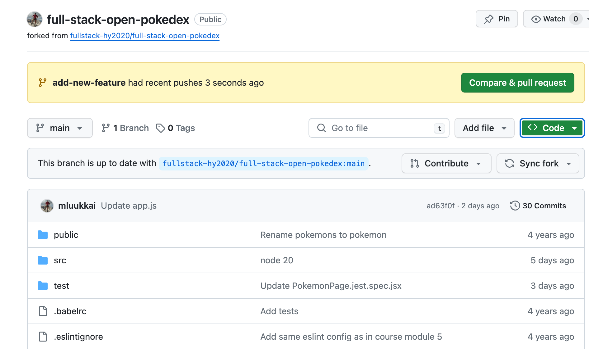
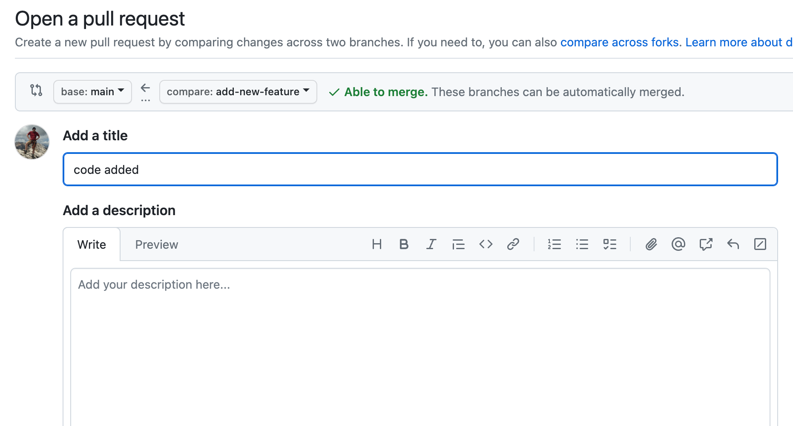
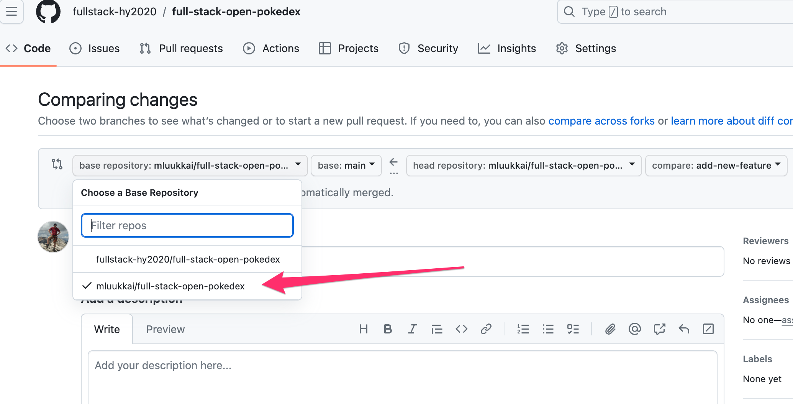
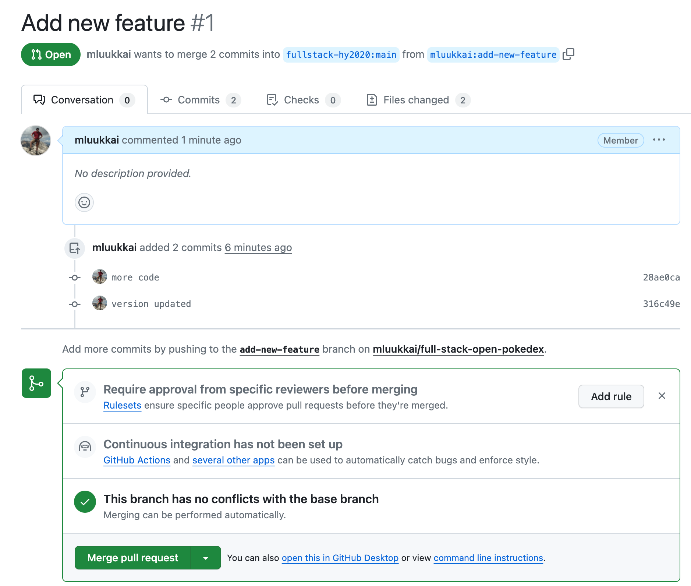
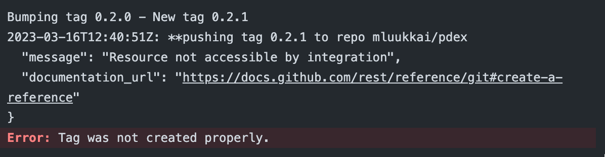
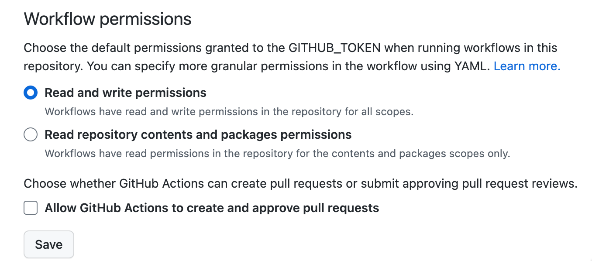
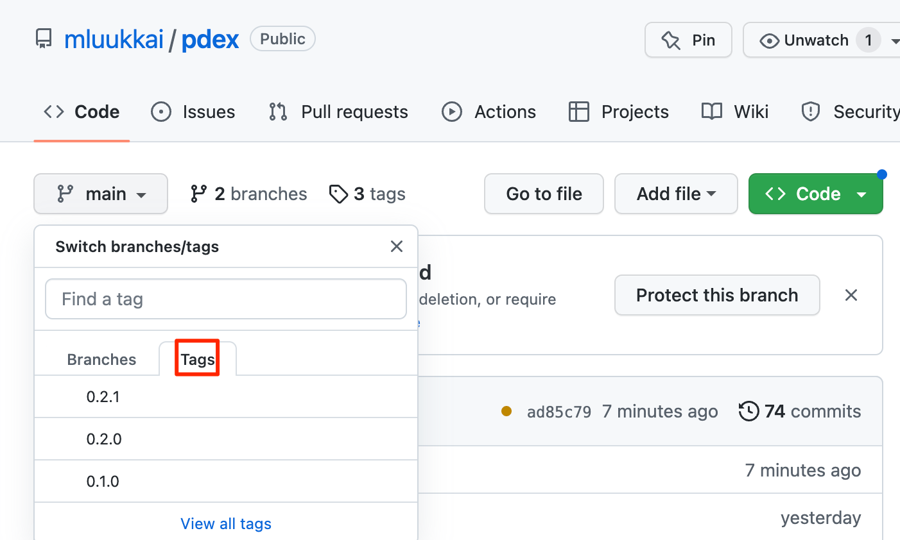
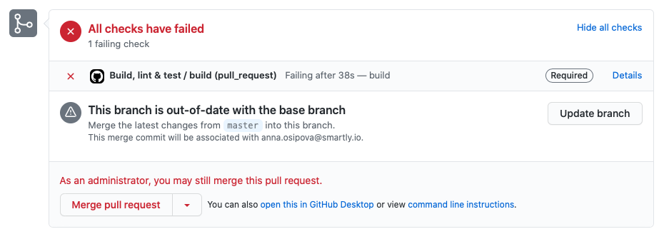
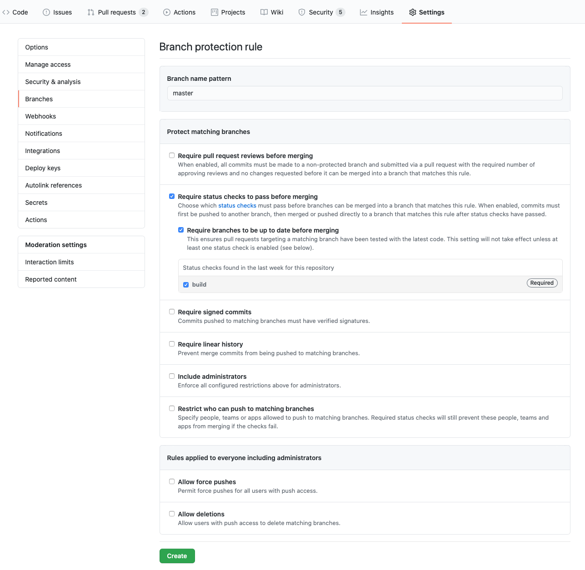

<div class="content">

يجب أن يظل فرعك الرئيسي (main branch) للكود *أخضر* دائماً. يعني كون الفرع أخضر أن جميع خطوات خط أنابيب البناء والتكامل المستمر قد اكتملت بنجاح: تم بناء المشروع بنجاح، وتعمل الاختبارات دون أخطاء، ولا توجد أخطاء يشتكي منها مدقق التنسيق (Linter)، وما إلى ذلك.

لماذا هذا مهم؟ لأنك على الأرجح ستنشر الكود الخاص بك إلى بيئة الإنتاج تحديداً من فرعك الرئيسي. وأي إخفاقات في الفرع الرئيسي تعني أنه لا يمكن نشر الميزات الجديدة في الإنتاج حتى يتم حل المشكلة. وفي بعض الأحيان قد تكتشف خطأً مزعجاً في الإنتاج لم يتم اكتشافه بواسطة خط أنابيب CI/CD. في هذه الحالات، تريد أن تكون قادراً على التراجع ببيئة الإنتاج إلى كوميت سابق بطريقة آمنة وسليمة.

كيف تحافظ على فرعك الرئيسي أخضر دائماً إذن؟ تجنب إرسال أي تغييرات أو كوميتات مباشرة إلى الفرع الرئيسي. بدلاً من ذلك، قم بتسجيل الكود الخاص بك على فرع منفصل يستند إلى أحدث إصدار ممكن من الفرع الرئيسي. بمجرد أن تعتقد أن الفرع جاهز للدمج في الفرع الرئيسي، فإنك تنشئ طلب سحب في GitHub (يشار إليه أيضاً باسم <abbr title="Pull Request">PR</abbr>).

### التعامل مع طلبات السحب (Working with Pull Requests)

تعد طلبات السحب جزءاً أساسياً من عملية التعاون عند العمل في أي مشروع برمجيات يضم مساهمين اثنين على الأقل. عند إجراء تغييرات على مشروع، فإنك تنشئ فرعاً جديداً محلياً، وتجري تغييراتك وتسجلها، وتدفع الفرع إلى المستودع البعيد (في حالتنا إلى GitHub) وتنشئ طلب سحب ليقوم شخص ما بمراجعة تغييراتك قبل أن يتم دمجها في الفرع الرئيسي.

هناك عدة أسباب تجعل استخدام طلبات السحب والحصول على مراجعة الكود الخاص بك من قِبل شخص آخر فكرة جيدة دائماً:
- حتى المطور المتمرس يمكن أن يتغاضى في كثير من الأحيان عن بعض المشكلات في الكود الخاص به: فجميعنا يعرف تأثير الرؤية النفقية (Tunnel Vision).
- يمكن للمراجع أن يقدم منظوراً مختلفاً ووجهة نظر إضافية.
- بعد قراءة التغييرات التي أجريتها، سيكون هناك مطور آخر على الأقل على دراية بالتغييرات التي قمت بها.
- يتيح لك استخدام الـ PR تشغيل جميع المهام تلقائياً في خط أنابيب الـ CI الخاص بك قبل وصول الكود إلى الفرع الرئيسي. توفر GitHub Actions محفزاً مخصصاً لطلبات السحب.

يمكنك تكوين مستودع GitHub الخاص بك بطريقة لا يمكن معها دمج طلبات السحب حتى تتم الموافقة عليها.



لفتح طلب سحب جديد، افتح فرعك في GitHub وانقر على الزر الأخضر "Compare & pull request" في الأعلى. ستظهر لك استمارة حيث يمكنك ملء وصف طلب السحب.



تقدم واجهة طلب السحب في GitHub الوصف وواجهة المناقشة. في الجزء السفلي، تعرض جميع فحوصات الـ CI (في حالتنا كل إجراء من إجراءات GitHub Actions) التي تم تكوينها للتشغيل لكل طلب سحب وحالات هذه الفحوصات. اللوحة الخضراء هي ما تهدف إليه! يمكنك النقر فوق تفاصيل (Details) كل فحص لعرض التفاصيل وسجلات التشغيل.

تم تشغيل جميع مسارات سير العمل التي نظرنا إليها حتى الآن بواسطة عمليات الدفع إلى الفرع الرئيسي. لجعل سير العمل يعمل لكل طلب سحب، سيتعين علينا تحديث جزء المحفز (Trigger) في سير العمل. نستخدم محفز "pull_request" للفرع "main" ونقصر المحفز على الأحداث "opened" و "synchronize". هذا يعني بشكل أساسي أن سير العمل سيعمل عند فتح طلب سحب في الفرع الرئيسي أو تحديثه.

لذا دعنا نغير الأحداث التي [تحفز](https://docs.github.com/en/free-pro-team@latest/actions/reference/events-that-trigger-workflows) سير العمل على النحو التالي:

```yml
on:
  push:
    branches:
      - main
  pull_request: # highlight-line
    branches: [main] # highlight-line
    types: [opened, synchronize] # highlight-line
```

سنجعل من المستحيل قريباً دفع الكود مباشرة إلى الفرع الرئيسي، ولكن في هذه الأثناء، دعنا نستمر في تشغيل سير العمل أيضاً لجميع عمليات الدفع المباشرة المحتملة إلى الفرع الرئيسي.

</div>

<div class="tasks">

### التمارين 11.13-11.14.

يقوم سير العمل لدينا بعمل رائع لضمان جودة الكود الجيدة، ولكن نظراً لأنه يتم تشغيله عند الالتزام بالفرع الرئيسي، فإنه يكتشف المشكلات بعد فوات الأوان!

#### 11.13 طلب السحب (Pull request)

قم بتحديث محفز سير العمل الحالي كما هو موضح أعلاه للتشغيل على طلبات السحب الجديدة إلى فرعك الرئيسي.

أنشئ فرعاً جديداً، وسجل تغييراتك، وافتح طلب سحب إلى فرعك الرئيسي.

إذا لم تكن قد عملت مع الفروع من قبل، فراجع [هذا الدليل التعليمي](https://www.atlassian.com/git/tutorials/using-branches) للبدء.

لاحظ أنه عند فتح طلب السحب، تأكد من تحديد مستودعك *الخاص* كـ *مستودع أساسي (Base repository)* للوجهة، وليس المستودع الأصلي لـ fullstack-hy2020:



في علامة التبويب "Conversation" الخاصة بطلب السحب، يجب أن ترى أحدث كوميتاتك والحالة الصفراء للفحوصات الجارية:



بمجرد تشغيل الفحوصات، يجب أن تتحول الحالة إلى اللون الأخضر. تأكد من اجتياز جميع الفحوصات. لا تقم بدمج فرعك بعد، فلا يزال هناك شيء آخر نحتاج إلى تحسينه في خط الأنابيب الخاص بنا.

#### 11.14 تشغيل خطوة النشر للفرع الرئيسي فقط (Run deployment step only for main)

كل شيء يبدو جيداً، ولكن هناك في الواقع مشكلة خطيرة في سير العمل الحالي. يتم تشغيل جميع الخطوات، بما في ذلك النشر، لطلبات السحب أيضاً. وهذا بالتأكيد شيء لا نريده!

لحسن الحظ، هناك حل سهل للمشكلة! يمكننا إضافة شرط [if](https://docs.github.com/en/actions/using-workflows/workflow-syntax-for-github-actions#jobsjob_idstepsif) إلى خطوة النشر، مما يضمن تنفيذ الخطوة فقط عند دمج الكود أو دفعه إلى الفرع الرئيسي.

يوفر سياق سير العمل [Context](https://docs.github.com/en/free-pro-team@latest/actions/reference/context-and-expression-syntax-for-github-actions#contexts) أنواعاً مختلفة من المعلومات حول الكود الذي يتم تشغيل سير العمل عليه.

توجد المعلومات ذات الصلة في [GitHub context](https://docs.github.com/en/actions/learn-github-actions/contexts#github-context)، حيث يخبرنا الحقل `event_name` باسم الحدث الذي أدى إلى تشغيل سير العمل. عندما يتم دمج طلب السحب، يكون اسم الحدث بشكل متناقض هو `push`، وهو نفس الحدث الذي يحدث عند دفع الكود مباشرة إلى المستودع. وبالتالي، نحصل على السلوك المطلوب عن طريق إضافة الشرط التالي إلى الخطوة التي تنشر الكود:

```js
if: ${{ github.event_name == 'push' }}
```

ادفع المزيد من التعديلات إلى فرعك، وتأكد من أن خطوة النشر *لم تعد تُنفذ* في طلب السحب. ثم ادمج الفرع مع الفرع الرئيسي وتأكد من حدوث النشر بنجاح.

</div>

<div class="content">

### إصدار النسخ وإدارتها (Versioning)

الغرض الأكثر أهمية لتحديد الإصدارات هو تحديد البرنامج الذي نقوم بتشغيله والرمز المرتبط به بشكل فريد.

يعد ترتيب الإصدارات أيضاً معلومة مهمة. على سبيل المثال، إذا تسبب الإصدار الحالي في كسر وظائف هامة ونحتاج إلى تحديد *الإصدار السابق* من البرنامج حتى نتمكن من التراجع عن الإصدار إلى حالة مستقرة.

#### الترقيم الدلالي وترقيم التجزئة (Semantic Versioning & Hash Versioning)

تُسمى كيفية ترقيم التطبيق في بعض الأحيان باستراتيجية تحديد الإصدارات (Versioning Strategy). سننظر ونقارن بين استراتيجيتين من هذا القبيل.

الأولى هي [الترقيم الدلالي (Semantic Versioning)](https://semver.org/)، حيث يكون الإصدار بالصيغة `{major}.{minor}.{patch}`. على سبيل المثال، إذا كان الإصدار هو `1.2.3`، فإن `1` هو الإصدار الرئيسي (Major)، و `2` هو الإصدار الفرعي (Minor)، و `3` هو إصدار الترقيع والإصلاح (Patch).

بشكل عام، التغييرات التي تصلح الوظائف دون تغيير كيفية عمل التطبيق من الخارج هي تغييرات `patch`، والتغييرات التي تجري تغييرات صغيرة على الوظائف (كما يُرى من الخارج) هي تغييرات `minor`، والتغييرات التي تغير التطبيق تماماً (أو تغييرات الوظائف الرئيسية التي تكسر التوافقية) هي تغييرات `major`. يمكن أن تختلف تعريفات كل من هذه المصطلحات من مشروع لآخر.

على سبيل المثال، تتبع مكتبات npm الترقيم الدلالي. الإصدار الأكثر حداثة من React يتبع هذا النمط تماماً.

*ترقيم التجزئة (Hash versioning)* (المعروف أيضاً أحياناً باسم ترقيم SHA) مختلف تماماً. "رقم" الإصدار في ترقيم التجزئة هو تجزئة (تبدو كسلسلة عشوائية) مشتقة من محتويات المستودع والتغييرات التي تم إدخالها في الكوميت الذي أنشأ الإصدار. في Git، يتم ذلك بالفعل نيابة عنك كتجزئة كوميت فريدة لأي مجموعة تغييرات.

يتم استخدام ترقيم التجزئة دائماً تقريباً مع الأتمتة. من غير العملي والمعرض للأخطاء نسخ أرقام الإصدارات الطويلة المكونة من 32 حرفاً للتأكد من نشر كل شيء بشكل صحيح.

#### إلى ماذا يشير الإصدار؟ (What does the version point to?)

يعد تحديد الكود الذي ينتمي إلى إصدار معين أمراً مهماً، والطريقة التي يتم بها تحقيق ذلك تختلف مرة أخرى تماماً بين الترقيم الدلالي وترقيم التجزئة. في ترقيم التجزئة (على الأقل في Git)، الأمر بسيط مثل البحث عن الكوميت بناءً على الـ Hash. سيتيح لنا هذا معرفة الكود الذي تم نشره بالضبط مع إصدار محدد.

الأمر أكثر تعقيداً قليلاً عند استخدام الترقيم الدلالي وهناك عدة طرق للتعامل مع المشكلة. تتلخص هذه في ثلاثة أساليب محتملة: شيء ما في الكود نفسه، أو شيء ما في المستودع أو بياناته الوصفية (Metadata)، أو شيء خارج المستودع تماماً.

بالنسبة للنهجين القائمين على المستودع، فإن النهج الذي يحتوي على شيء ما في الكود يتلخص عادةً في رقم إصدار في ملف (مثل `package.json`)، ويعتمد نهج المستودع/البيانات الوصفية عادةً على [الوسوم (Tags)](https://www.atlassian.com/git/tutorials/inspecting-a-repository/git-tag) أو (في حالة GitHub) الإصدارات (Releases). في حالة العلامات أو الإصدارات، يكون هذا بسيطاً نسبياً، حيث تشير العلامة أو الإصدار إلى كوميت، والكود الموجود في هذا الكوميت هو الكود الموجود في الإصدار.

#### ترتيب الإصدارات (Version order)

في الترقيم الدلالي، حتى لو كانت لدينا قفزات إصدارية من أنواع مختلفة (رئيسية أو ثانوية أو ترقيعية)، فإنه لا يزال من السهل جداً ترتيب الإصدارات: 1.3.7 يأتي قبل 2.0.0 والذي يأتي بدوره قبل 2.1.5 والذي يأتي قبل 2.2.0. لا تزال هناك حاجة إلى قائمة الإصدارات لمعرفة ما هو الإصدار الأخير ولكن من الأسهل النظر إلى تلك القائمة ومناقشتها: من الأسهل أن نقول "نحن بحاجة إلى التراجع إلى 3.2.4" بدلاً من محاولة توصيل كود تجزئة طويل شفهياً.

هذا لا يعني أن الـ Hashes غير ملائمة: إذا كنت تعرف الكوميت الذي تسبب في المشكلة المحددة، فمن السهل بما يكفي النظر إلى سجل Git والحصول على تجزئة الكوميت السابق. ولكن إذا كان لديك اثنان من رموز التجزئة، فلا يمكنك حقاً معرفة أيهما جاء في وقت سابق في التاريخ دون مراجعة سجل Git.

#### الجمع بين أفضل ما في الطريقتين (Best of Both Worlds)

من المقارنة أعلاه، يبدو أن الترقيم الدلالي منطقي لإصدار البرمجيات بينما الترقيم القائم على التجزئة يكون أكثر منطقية أثناء التطوير. هذا لا يسبب بالضرورة تعارضاً.

فكر في الأمر بهذه الطريقة: يتلخص تحديد الإصدارات في تقنية تشير إلى كوميت محدد وتقول "سنعطي هذه النقطة اسماً، وسيكون اسمها 3.5.5". لا يوجد شيء يمنعنا أيضاً من الإشارة إلى نفس الكوميت من خلال الـ Hash الخاص به.

على سبيل المثال، عندما يكون لدينا مشروع يستخدم بنى أصول قائمة على التجزئة للاختبار، فمن الممكن دائماً تتبع نتيجة كل بناء وفحص واختبار لكوميت محدد ويكون المطورون على دراية بالحالة التي يوجد بها الكود الخاص بهم. كل هذا مؤتمت وشفاف للمطورين. عندما يدمج المطورون الكود الخاص بهم في الفرع الرئيسي، يتولى نظام الـ CI الأمر مرة أخرى، حيث يقوم ببناء واختبار جميع الأكواد ومنحها رقم إصدار دلالي في خطوة واحدة، ويربط رقم الإصدار بالكوميت المعني باستخدام علامة Git Tag.

</div>

<div class="tasks">

### التمارين 11.15-11.16.

دعنا نوسع سير العمل لدينا بحيث يزيد الإصدار تلقائياً (Bump) عند دمج طلب السحب في الفرع الرئيسي ويوضع [وسم (Tag)](https://www.atlassian.com/git/tutorials/inspecting-a-repository/git-tag) على الإصدار برقم الإصدار. سنستخدم إجراءً مفتوح المصدر تم تطويره بواسطة طرف ثالث: [anothrNick/github-tag-action](https://github.com/anothrNick/github-tag-action).

#### 11.15 إضافة الإصدارات التلقائية (Adding versioning)

سنقوم بتوسيع سير العمل لدينا بخطوة إضافية:

```js
- name: Bump version and push tag
  uses: anothrNick/github-tag-action@1.64.0
  env:
    GITHUB_TOKEN: ${{ secrets.GITHUB_TOKEN }}
```

ملاحظة: يجب عليك استخدام أحدث إصدار من الإجراء، انظر [هنا](https://github.com/anothrNick/github-tag-action) إذا كان هناك إصدار أحدث متاحاً.

نحن نمرر متغيراً بيئياً `secrets.GITHUB_TOKEN` إلى الإجراء. نظراً لأنه إجراء تابع لجهة خارجية، فإنه يحتاج إلى الرمز المميز للمصادقة في مستودعك.

قد ينتهي بك الأمر بالحصول على رسالة الخطأ هذه:



السبب الأكثر ترجيحاً لذلك هو أن الرمز المميز الخاص بك ليس لديه حق الوصول للكتابة في المستودع. انتقل إلى إعدادات المستودع الخاص بك، وحدد `actions/general`، وتأكد من أن الرمز المميز لديه *أذونات القراءة والكتابة (Read and write permissions)*:



يقبل إجراء [anothrNick/github-tag-action](https://github.com/anothrNick/github-tag-action) بعض متغيرات البيئة التي تعدل طريقة وضع العلامات على إصداراتك. يمكنك الاطلاع عليها في ملف [README](https://github.com/anothrNick/github-tag-action).

بشكل افتراضي، ستتلقى إصداراتك زيادة *ثانوية (Minor bump)*. قم بتعديل التكوين بحيث تكون كل نسخة جديدة بشكل افتراضي زيادة *ترقيعية (Patch bump)* في رقم الإصدار، بحيث يتم زيادة الرقم الأخير افتراضياً.

تذكر أننا نريد فقط زيادة الإصدار عند حدوث التغيير في الفرع الرئيسي! لذا أضف شرط `if` مشابهاً لمنع زيادة الإصدار عند فتح طلب السحب كما تم إجراؤه في [التمرين 11.14](/ar/part11/keeping_green#exercises-11-13-11-14).

أكمل سير العمل الآن. لا تقم بإضافته فقط كخطوة أخرى، بل قم بتكوينه كمهمة منفصلة [تعتمد (depends)](https://docs.github.com/en/actions/using-workflows/advanced-workflow-features#creating-dependent-jobs) على المهمة التي تعتني بالفحص والاختبار والنشر:

```yml
name: Deployment pipeline

on:
  push:
    branches:
      - main
  pull_request:
    branches: [main]
    types: [opened, synchronize]

jobs:
  simple_deployment_pipeline:
    runs-on: ubuntu-latest
    steps:
      // steps here
  tag_release:
    needs: [simple_deployment_pipeline]
    runs-on: ubuntu-latest
    steps:
      // steps here
```

كما ذكرنا سابقاً، يتم تنفيذ مهام سير العمل بالتوازي. ومع ذلك، نظراً لأننا نريد إجراء الفحص والاختبار والنشر أولاً، فإننا نضع اعتمادية تجعل `tag_release` تنتظر اكتمال المهمة السابقة بنجاح.

بمجرد تشغيل سير العمل بنجاح، سيذكر المستودع أن هناك بعض *العلامات (Tags)*:



#### 11.16 تخطي كوميت للوسم والنشر (Skipping a commit)

بشكل عام، كلما زاد تكرار نشر الفرع الرئيسي في الإنتاج، كان ذلك أفضل. ومع ذلك، قد يكون هناك أحياناً سبب وجيه لتخطي/منع كوميت معين أو طلب سحب مدمج من وضع علامة عليه وإصداره للإنتاج.

قم بتعديل إعداداتك بحيث إذا كانت رسالة الكوميت في طلب السحب تحتوي على `#skip`، فلن يتم نشر الدمج في الإنتاج ولن يتم وضع علامة عليه برقم إصدار.

تلميحات: أسهل طريقة لتنفيذ ذلك هي تغيير شروط `if` للخطوات ذات الصلة. وبشكل مشابه لـ [التمرين 11.14](/ar/part11/keeping_green#exercises-11-13-11-14)، يمكنك الحصول على المعلومات ذات الصلة من سياق GitHub لسير العمل.

يمكنك استخدام دالتي `contains` و `join` لشرط `if`.

</div>

<div class="content">

### ملاحظة حول استخدام إجراءات الطرف الثالث (Third-party actions)

عند استخدام إجراء تابع لجهة خارجية مثل `github-tag-action`، قد يكون من الجيد تحديد الإصدار المستخدم باستخدام الـ Hash بدلاً من استخدام رقم الإصدار. والسبب في ذلك هو أن رقم الإصدار، الذي يتم تنفيذه باستخدام علامة Git، يمكن من حيث المبدأ *نقله وتغييره*. وبالتالي، قد يكون الإصدار 1.61.0 اليوم كوداً مختلفاً عن الإصدار 1.61.0 في الأسبوع القادم!

ومع ذلك، فإن الكود الموجود في كوميت له تجزئة معينة لا يتغير تحت أي ظرف من الظروف، لذلك إذا أردنا أن نكون متأكدين بنسبة 100% من الكود الذي نستخدمه، فمن الأكثر أماناً استخدام الـ Hash:

```js
- name: Bump version and push tag
  uses: anothrNick/github-tag-action@8c8163ef62cf9c4677c8e800f36270af27930f42 // highlight-line
  env:
    GITHUB_TOKEN: ${{ secrets.GITHUB_TOKEN }}
```

من خلال الإشارة إلى تجزئة كوميت محدد، يمكننا التأكد من أن الكود الذي نستخدمه عند تشغيل سير العمل لن يتغير أبداً.

### الحفاظ على الفرع الرئيسي محمياً (Keep the main branch protected)

يتيح لك GitHub إعداد فروع محمية (Protected branches). من المهم حماية فرعك الأكثر أهمية والذي لا ينبغي كسره أبداً: *main*. في إعدادات المستودع، يمكنك الاختيار بين عدة مستويات من الحماية.

من وجهة نظر الـ CI، فإن الحماية الأكثر أهمية هي اشتراط اجتياز فحوصات الحالة قبل أن يتم دمج طلب السحب في الفرع الرئيسي. هذا يعني أنه إذا قمت بإعداد GitHub Actions لتشغيل مهام التدقيق والاختبار، فلن يتمكن أي شخص من دمج طلب السحب حتى يتم إصلاح جميع أخطاء التدقيق واجتياز جميع الاختبارات بنجاح.



لإعداد الحماية لفرعك الرئيسي، انتقل إلى "Settings" من القائمة العلوية داخل المستودع. في القائمة الجانبية اليسرى، حدد "Branches". انقر فوق الزر "Add rule" بجوار "Branch protection rules". اكتب نمط اسم الفرع (`main`) وحدد الحماية التي ترغب في إعدادها. على الأقل، يلزم تفعيل "Require status checks to pass before merging" للاستفادة الكاملة من قوة GitHub Actions.



</div>

<div class="tasks">

### التمرين 11.17

#### 11.17 إضافة الحماية إلى فرعك الرئيسي

أضف الحماية إلى فرعك *main*.

يجب عليك حمايته من أجل:
- اشتراط الموافقة على جميع طلبات السحب قبل الدمج
- اشتراط اجتياز جميع فحوصات الحالة بنجاح قبل الدمج

</div>
