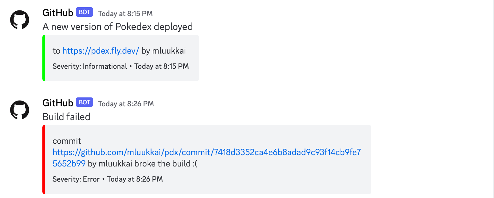

يركز هذا الجزء على بناء نظام تكامل مستمر (CI) بسيط وفعال وقوي يساعد المطورين على العمل معاً، والحفاظ على جودة الشيفرة البرمجية، والنشر بأمان. ما الذي قد يرغب فيه المرء أكثر من ذلك؟ في العالم الحقيقي، هناك أطراف متعددة تشارك في العملية بخلاف المطورين والمستخدمين. وحتى لو لم يكن الأمر كذلك، فحتى بالنسبة للمطورين، هناك قيمة أكبر بكثير يمكن اكتسابها من أنظمة الـ CI بخلاف الأمور المذكورة أعلاه فقط.

### الرؤية والفهم المشترك (Visibility and Understanding)

في معظم الشركات، لا يتم اتخاذ القرارات المتعلقة بما يجب تطويره حصرياً بواسطة المطورين فقط. غالباً ما يُستخدم مصطلح "أصحاب المصلحة (Stakeholders)" للإشارة إلى الأشخاص، داخل فريق التطوير وخارجه، الذين قد يكون لديهم مصلحة في متابعة تقدم التطوير. تحقيقاً لهذه الغاية، غالباً ما توجد عمليات تكامل بين Git وبرامج إدارة المشاريع وتتبع الأخطاء (Bug tracking) التي يستخدمها الفريق (مثل Jira أو Trello أو GitHub Projects).

من الاستخدامات الشائعة لذلك وجود إشارة إلى نظام التتبع في طلبات سحب Git أو الكوميتات. بهذه الطريقة، على سبيل المثال، عندما تعمل على المهمة رقم 123، يمكنك تسمية طلب السحب الخاص بك:
`BUG-123: Fix user copy issue`
وسيقوم نظام تتبع الأخطاء بملاحظة الجزء الأول من اسم الـ PR ونقل المشكلة تلقائياً إلى حالة `Done` (تم الإنجاز) عند دمج طلب السحب.

### الإشعارات (Notifications)

عندما تنتهي عملية الـ CI بسرعة، قد يكون من المناسب مجرد مشاهدتها وهي تنفذ وانتظار النتيجة. ولكن مع زيادة تعقيد المشاريع، تزداد أيضاً عملية بناء الكود واختباره تعقيداً ووقتاً. يمكن أن يؤدي هذا سريعاً إلى موقف يستغرق فيه إنشاء نتيجة البناء وقتاً طويلاً بما يكفي لأن يرغب المطور في بدء العمل على مهمة أخرى، مما يؤدي بدوره إلى نسيان نتيجة البناء.

يمثل هذا مشكلة خاصة إذا كنا نتحدث عن دمج طلبات السحب التي قد تؤثر على عمل مطور آخر، مما يتسبب في مشكلات أو تأخيرات له. يمكن أن يؤدي هذا أيضاً إلى موقف تعتقد فيه أنك قمت بنشر شيء ما ولكنك لم تنتهِ فعلياً من النشر، مما يؤدي إلى سوء فهم مع زملائك في الفريق والعملاء (مثل قول: "تفضل وجرب ذلك مرة أخرى، يجب أن يتم إصلاح الخطأ").

هناك عدة حلول لهذه المشكلة تتراوح من الإشعارات البسيطة إلى العمليات الأكثر تعقيداً التي تدمج الكود الناجح ببساطة إذا تم استيفاء شروط معينة. سنناقش الإشعارات كحل بسيط لأنها الأقل تدخلاً في سير عمل الفريق.

بشكل افتراضي، يرسل GitHub Actions بريداً إلكترونياً عند فشل البناء. يمكن تغيير ذلك لإرسال إشعارات بغض النظر عن حالة البناء، ويمكن أيضاً تكوينه لتنبيهك على واجهة ويب GitHub. ولكن ماذا لو أردنا إرسال تنبيهات لتطبيقات المحادثة مثل Slack أو Discord؟

توجد عمليات تكامل لإرسال الإشعارات إلى تطبيقات المراسلة المختلفة مثل [Slack](https://slack.com/) أو [Discord](https://discord.com/).

### التمرين 11.18

لقد قمنا بإعداد قناة `fullstack_webhook` في مجموعة Discord الخاصة بالدورة على الرابط:
<https://study.cs.helsinki.fi/discord/join/fullstack>
لاختبار التكامل مع برامج المراسلة.

سجل الآن في Discord إذا لم تكن قد قمت بذلك بالفعل. ستحتاج أيضاً إلى *خطاف ويب Discord (Discord webhook)* في هذا التمرين. ستجد خطاف الويب في الرسالة المثبتة في قناة `fullstack_webhook`. يرجى عدم إرسال الـ Webhook إلى GitHub في الكود العام!

#### 11.18 إجراء إشعار نجاح/فشل البناء (Build notification action)

يمكنك العثور على عدد غير قليل من إجراءات الطرف الثالث من [متجر GitHub Actions](https://github.com/marketplace?type=actions) باستخدام عبارة البحث [discord](https://github.com/marketplace?type=actions&query=discord). اختر واحداً لهذا التمرين، مثل [discord-webhook-notify](https://github.com/marketplace/actions/discord-webhook-notify).

قم بإعداد الإجراء بحيث يقدم نوعين من الإشعارات:
- مؤشر نجاح إذا تم نشر إصدار جديد بنجاح.
- مؤشر خطأ إذا فشل البناء.

في حالة حدوث خطأ، يجب أن يكون الإشعار أكثر تفصيلاً لمساعدة المطورين في العثور سريعاً على الكوميت الذي تسبب فيه.

انظر [هنا](https://docs.github.com/en/actions/learn-github-actions/expressions#status-check-functions) كيف تتحقق من حالة المهمة!

قد تبدو إشعاراتك كما يلي:

### المقاييس ومراقبة الأداء (Metrics)

في القسم السابق، ذكرنا أنه مع زيادة تعقيد المشاريع، تزداد بنياتها والمدة التي تستغرقها. هذا بالتأكيد ليس مثالياً: فكلما طالت حلقة التغذية الراجعة، تباطأ التطوير.

من المفيد معرفة المدة التي استغرقها البناء قبل بضعة أشهر مقابل المدة التي يستغرقها الآن. هل كان التقدم خطياً أم قفز فجأة؟ إن معرفة سبب الزيادة في وقت البناء يمكن أن تكون مفيدة للغاية في المساعدة على حلها.

يمكن جمع المقاييس وإرسالها إلى قاعدة بيانات السلاسل الزمنية أو إلى خدمات سحابية مثل [Datadog](https://www.datadoghq.com/).

### المهام الدورية (Periodic tasks)

غالباً ما تكون هناك مهام دورية يجب القيام بها في فريق تطوير البرمجيات. يمكن أتمتة بعض هذه المهام باستخدام الأدوات المتاحة بشكل شائع، مثل فحص الحزم بحثاً عن الثغرات الأمنية. يوفر GitHub أداة مدمجة رائعة تسمى [Dependabot](https://dependabot.com/).

يوفر GitHub Actions أيضاً محفزاً مجدولاً (Scheduled trigger) يمكن استخدامه لتنفيذ مهمة في وقت معين باستخدام صياغة Cron.

### التمارين 11.19-11.21

#### 11.19 فحص السلامة الدوري (Periodic health check)

نحن واثقون تماماً الآن من أن خط الأنابيب الخاص بنا يمنع نشر الكود السيئ. ومع ذلك، هناك العديد من مصادر الأخطاء (مثل تعطل قاعدة البيانات). لهذا السبب سيكون من الجيد إعداد *فحص دوري للسلامة (Periodic health check)* يقوم بانتظام بطلب HTTP GET إلى خادمنا (Ping).

من الممكن [جدولة](https://docs.github.com/en/actions/using-workflows/events-that-trigger-workflows#schedule) إجراءات GitHub لتحدث بانتظام.

استخدم الآن الإجراء [url-health-check](https://github.com/marketplace/actions/url-health-check) أو أي بديل آخر وجدول فحص سلامة دوري لبرنامجك المنشور. حاول محاكاة موقف يتعطل فيه تطبيقك وتأكد من أن الفحص يكتشف المشكلة. اكتب سير العمل الدوري هذا في ملف خاص به.

**ملاحظة**: بمجرد أن تتأكد من عمل الفحص، فمن الأفضل خفض معدل التكرار (إلى مرة واحدة كحد أقصى كل 24 ساعة) أو تعطيل القاعدة تماماً حتى لا تستهلك ساعات التشغيل المجانية الشهرية في GitHub Actions.

#### 11.20 خط الأنابيب الخاص بك (Your own pipeline)

قم ببناء خط أنابيب CI/CD مشابه لأحد تطبيقاتك الخاصة السابقة (مثل تطبيق دليل الهاتف من الجزأين 2 و 3، أو تطبيق المدونات من الجزأين 4 و 5، أو نوادر Redux من الجزء 6).

قم بإنشاء مستودع جديد وقم بإعداد خط أنابيب كامل يشتمل على التدقيق (Linting)، والاختبار (Testing)، والبناء (Building)، والنشر التلقائي (Deployment)، وترقيم الإصدارات التلقائي (Versioning).

#### 11.21 حماية فرعك الرئيسي وطلب المراجعة (Protect main branch)

قم بحماية الفرع الرئيسي للمستودع الذي قمت فيه بالتمرين السابق. هذه المرة امنع أيضاً المشرفين من دمج الكود دون مراجعة معتمدة.

قم بعمل طلب سحب واطلب من مستخدم GitHub `mluukkai` مراجعة الكود الخاص بك. بعد اكتمال المراجعة، ادمج الكود في الفرع الرئيسي.

### تسليم التمارين والحصول على الشهادة

يتم تسليم تمارين هذا الجزء عبر [نظام التسليم](https://studies.cs.helsinki.fi/stats/courses/fs-cicd) تماماً كما في الأجزاء السابقة. تذكر أنه يتعين عليك إنهاء *جميع التمارين* لاجتياز هذا الجزء!

بمجرد إكمال التمارين، يمكنك تنزيل شهادة إتمام هذا الجزء بالنقر فوق أحد أيقونات الأعلام التي تمثل لغة الشهادة.

