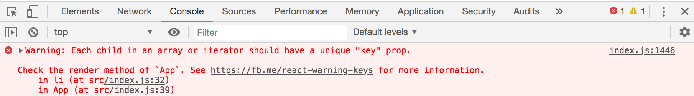
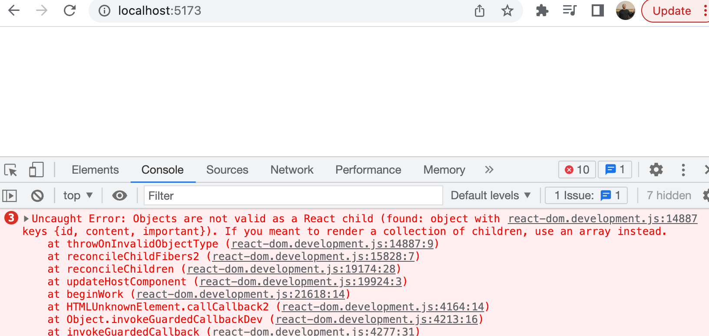
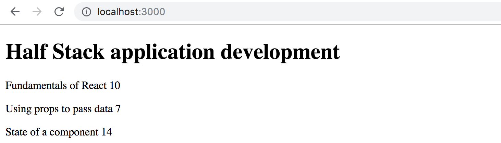
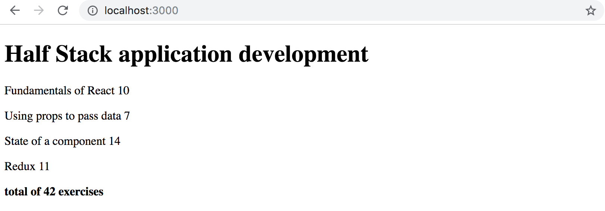
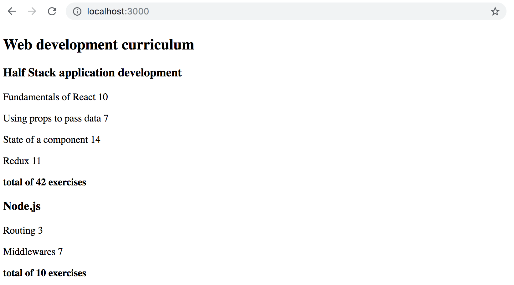

<div class="content">

قبل أن نبدأ في هذا الجزء الجديد، دعونا نراجع بعض المفاهيم الأساسية التي تمثل ركائز جوهرية في تطوير واجهات React.

### استخدام console.log

> ***ما هو الفرق بين مبرمج جافاسكريبت المحترف والمبتدئ؟ المبرمج المحترف يستخدم `console.log` أكثر بـ 10 إلى 100 مرة!***

على الرغم من أن المبرمج المبتدئ هو الأكثر حاجة لتصحيح الأخطاء، إلا أن المحترفين يدركون تماماً أن افتراض وتخمين سبب الخطأ دون طباعة البيانات يؤدي إلى إضاعة الوقت.

عند استخدام `console.log` لتصحيح أخطاء الكائنات:
- **لا تدمج الكائنات مع النصوص باستخدام علامة `+`** (مثل `'props is ' + props`)؛ لأن الناتج سيكون غير مفيد على الإطلاق: `props value is [object Object]`.
- **افصل العناصر المراد طباعتها بفاصلة `,`** (مثل `console.log('props value is', props)`)؛ لتقوم وحدة التحكم بعرض خصائص الكائن وقيمه بشكل تفاعلي ومنظم.

---

### نصيحة احترافية: اختصارات محرر VS Code (Snippets)

يمكنك إنشاء اختصارات (Snippets) مخصصة في Visual Studio Code لتوليد أسطر الطباعة `console.log` بسرعة، أو استخدام الإضافات الجاهزة في متجر VS Code مثل [ES7+ React Snippets](https://marketplace.visualstudio.com/items?itemName=dsznajder.es7-react-js-snippets).

---

### دوال المصفوفات في JavaScript (Functional Array Methods)

سنستخدم من الآن فصاعداً دوال البرمجة الوظيفية للمصفوفات مثل **`map`** و **`filter`** و **`find`** و **`reduce`** في كل مكان داخل تطبيقاتنا.

---

### تصيير المجموعات والقوائم (Rendering Collections)

لنقم الآن ببناء الواجهة الأمامية لقائمة الملاحظات التفاعلية باستخدام React.

لنبدأ بالملف `App.jsx` كالتالي:

```js
const App = (props) => {
  const { notes } = props

  return (
    <div>
      <h1>Notes</h1>
      <ul>
        <li>{notes[0].content}</li>
        <li>{notes[1].content}</li>
        <li>{notes[2].content}</li>
      </ul>
    </div>
  )
}

export default App
```

وملف `main.jsx` يحتوي على مصفوفة الملاحظات:

```js
import ReactDOM from 'react-dom/client'
import App from './App'

const notes = [
  {
    id: 1,
    content: 'HTML is easy',
    important: true
  },
  {
    id: 2,
    content: 'Browser can execute only JavaScript',
    important: false
  },
  {
    id: 3,
    content: 'GET and POST are the most important methods of HTTP protocol',
    important: true
  }
]

ReactDOM.createRoot(document.getElementById('root')).render(
  <App notes={notes} />
)
```

تحتوي كل ملاحظة على نصها `content`، وقيمة منطقية `important`، ومعرف فريد `id`.

إن الوصول لعناصر المصفوفة بأرقام الفهارس اليدوية `notes[0]` ليس عملياً على الإطلاق. لذلك نستخدم دالة **[`map`](https://developer.mozilla.org/en-US/docs/Web/JavaScript/Reference/Global_Objects/Array/map)** لتحويل مصفوفة البيانات إلى مصفوفة من عناصر React:

```js
const App = (props) => {
  const { notes } = props

  return (
    <div>
      <h1>Notes</h1>
      <ul>
        {notes.map(note => 
          <li>
            {note.content}
          </li>
        )}
      </ul>
    </div>
  )
}
```

---

### الخاصية الفريدة Key (Key-attribute)

على الرغم من أن القائمة تظهر على الشاشة، إلا أن وحدة التحكم بالمتصفح ستعرض تحذيراً بارزاً:



كما توضح [إرشادات React الرسمية](https://react.dev/learn/rendering-lists#keeping-list-items-in-order-with-key)، يجب أن يمتلك كل عنصر في القائمة المولدة عبر `map` خاصية فريدة تسمى **`key`**:

```js
const App = (props) => {
  const { notes } = props

  return (
    <div>
      <h1>Notes</h1>
      <ul>
        {notes.map(note => 
          <li key={note.id}>
            {note.content}
          </li>
        )}
      </ul>
    </div>
  )
}
```

تستخدم React الخاصية `key` لمعرفة العناصر التي تمت إضافتها أو تعديلها أو حذفها بدقة عند إعادة تصيير شجرة المكونات وتحديث الـ DOM بأعلى كفاءة.

> **تحذير من النمط المضاد (Anti-pattern)**: لا تستخدم أبداً فهارس المصفوفة (Array indexes مثل `key={i}`) كمفاتيح للعناصر إذا كانت القائمة قابلة لإعادة الترتيب أو الحذف أو الإضافة؛ لأن ذلك يسبب مشاكل وأخطاء في حالة المكونات.

---

### إعادة هيكلة الوحدات البرمجية وفصل المكونات (Refactoring Modules)

من الأفضل دائماً فصل كل مكون في ملف مستقل كوحدة برمجية (ES6 Module):

1. ننشئ مجلداً باسم `src/components/`.
2. ننشئ بداخله ملف المكون `Note.jsx`:

```js
const Note = ({ note }) => {
  return <li>{note.content}</li>
}

export default Note
```

3. نستورد المكون في ملف `App.jsx`:

```js
import Note from './components/Note'

const App = ({ notes }) => {
  return (
    <div>
      <h1>Notes</h1>
      <ul>
        {notes.map(note => 
          <Note key={note.id} note={note} />
        )}
      </ul>
    </div>
  )
}

export default App
```

> **ملاحظة**: يجب أن توضع الخاصية `key` دائماً على المكون الخارجي المباشر داخل دالة `map` (أي على `<Note key={note.id} />` وليس داخل عنصر `<li>` الداخلي).

---

### عندما يتعطل التطبيق وتظهر شاشة الأخطاء

في لغة ديناميكية مثل JavaScript، قد يحدث انهيار مفاجئ للتطبيق (React Explosion):



في هذه الحالة، طوق نجاتك الأفضل هو استخدام `console.log` تدريجياً:
1. تأكد أولاً من عمل المكون الرئيسي `App`.
2. تتبع البيانات الممررة عبر الخصائص (Props) وتأكد من مطابقة أسمائها وأنواعها قبل التفكيك (Destructuring).

</div>

<div class="tasks">

<h3>التمارين 2.1 - 2.5</h3>

تُسلّم حلول التمارين عبر رفعها على مستودع GitHub وتأكيد الإنجاز في نظام التسليم.

<h4>2.1: معلومات الدورة - الخطوة 6 (Course information step 6)</h4>

لنكمل تطبيق معلومات الدورة الذي بدأناه في الجزء السابق. اجعل المكون `App` يمرر كائن الدورة `course` إلى مكون جديد باسم `Course`:

```js
const App = () => {
  const course = {
    id: 1,
    name: 'Half Stack application development',
    parts: [
      {
        name: 'Fundamentals of React',
        exercises: 10,
        id: 1
      },
      {
        name: 'Using props to pass data',
        exercises: 7,
        id: 2
      },
      {
        name: 'State of a component',
        exercises: 14,
        id: 3
      }
    ]
  }

  return <Course course={course} />
}

export default App
```

هيكلية المكونات المقترحة:
```text
App
  Course
    Header
    Content
      Part
      Part
      ...
```

يجب أن يعمل التطبيق بديناميكية تامة **بغض النظر عن عدد أجزاء الدورة** (سواء تمت إضافة أجزاء جديدة أو حذف أجزاء)، مع استخدام دالة `map` وتحديد خاصية `key={part.id}` الفريدة لكل جزء.



<h4>2.2: معلومات الدورة - الخطوة 7 (Course information step 7)</h4>

أضف عرض إجمالي عدد تمارين الدورة أسفل الأجزاء.



<h4>2.3*: معلومات الدورة - الخطوة 8 (Course information step 8)</h4>

احسب إجمالي عدد التمارين باستخدام دالة المصفوفات **[`reduce`](https://developer.mozilla.org/en-US/docs/Web/JavaScript/Reference/Global_Objects/Array/Reduce)**.

> **نصيحة**: عندما تواجه صعوبة في عمل دالة `reduce` مع مصفوفة من الكائنات، استخدم `console.log` لمراقبة القيمة التراكمية والكائن الحالي في كل دورة:
> ```js
> const total = parts.reduce((sum, part) => {
>   console.log('what is happening', sum, part)
>   return sum + part.exercises
> }, 0)
> ```

<h4>2.4: معلومات الدورة - الخطوة 9 (Course information step 9)</h4>

وسّع التطبيق ليتعامل مع **مصفوفة من الدورات المتعددة**، بحيث يقوم بتصيير كل دورة وأجزائها ومجموع تمارينها بشكل ديناميكي عبر دالة `map`:

```js
const App = () => {
  const courses = [
    {
      name: 'Half Stack application development',
      id: 1,
      parts: [
        {
          name: 'Fundamentals of React',
          exercises: 10,
          id: 1
        },
        {
          name: 'Using props to pass data',
          exercises: 7,
          id: 2
        },
        {
          name: 'State of a component',
          exercises: 14,
          id: 3
        },
        {
          name: 'Redux',
          exercises: 11,
          id: 4
        }
      ]
    }, 
    {
      name: 'Node.js',
      id: 2,
      parts: [
        {
          name: 'Routing',
          exercises: 3,
          id: 1
        },
        {
          name: 'Middlewares',
          exercises: 7,
          id: 2
        }
      ]
    }
  ]

  return (
    <div>
      {/* تصيير الدورات هنا */}
    </div>
  )
}
```



<h4>2.5: فصل المكون في وحدة مستقلة (Separate module step 10)</h4>

افصل المكون `Course` وكافة مكوناته الفرعية في ملف وحدة برمجية مستقل (مثلاً `src/components/Course.jsx`)، ثم قم باستيراده داخل `App.jsx`.

</div>
