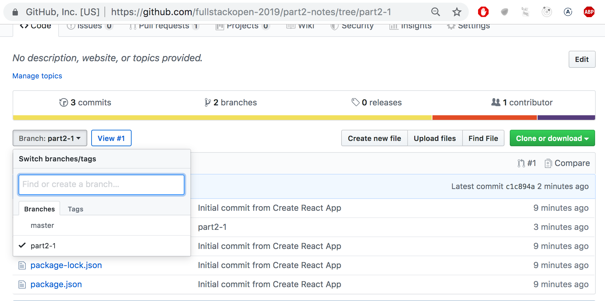
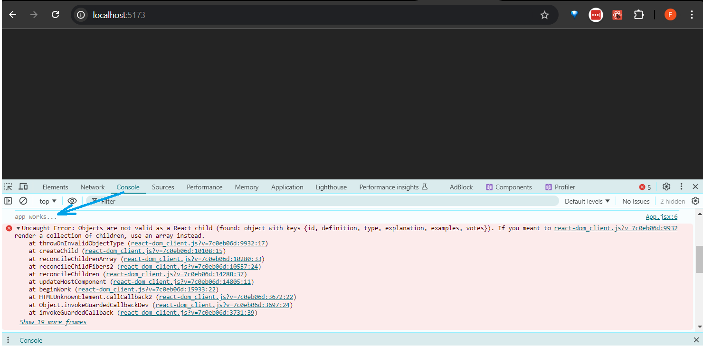

<div class="content">

قبل البدء في جزء جديد، دعونا نلخص ونراجع بعض الموضوعات التي أثبتت التجربة أنها كانت صعبة في العام الماضي.

### console.log

***ما الفرق بين مبرمج JavaScript ذي الخبرة والمبتدئ؟ المبرمج ذو الخبرة يستخدم console.log أكثر بما يتراوح بين 10 إلى 100 مرة.***

من المفارقات أن هذا يبدو صحيحاً تماماً على الرغم من أن المبرمج المبتدئ يحتاج إلى <i>console.log</i> (أو أي وسيلة أخرى لتصحيح الأخطاء) أكثر بكثير من المبرمج الخبير.

عندما لا يعمل شيء ما، لا تخمن سبب المشكلة بمجرد النظر. بدلاً من ذلك، اطبع السجلات أو استخدم طريقة أخرى لتصحيح الأخطاء.

**ملاحظة هامة**: كما تم توضيحه في الجزء 1، عند استخدام الأمر _console.log_ لتصحيح الأخطاء، لا تقم بدمج النصوص والكائنات "بأسلوب لغة Java" باستخدام علامة الجمع `+`. فبدلاً من كتابة:

```js
console.log('props value is ' + props)
```

افصل بين الأشياء المراد طباعتها باستخدام الفاصلة:

```js
console.log('props value is', props)
```

إذا قمت بدمج كائن مع سلسلة نصية وطباعته في منصة التحكم (كما في مثالنا الأول)، فستكون النتيجة عديمة الفائدة تماماً:

```js
props value is [object Object]
```

على العكس من ذلك، عندما تمرر الكائنات كمعاملات مميزة ومفصولة بفواصل إلى _console.log_، كما في مثالنا الثاني أعلاه، تتم طباعة محتوى الكائن في منصة تحكم المطور ككائنات قابلة للفحص وذات فائدة كبيرة.
إذا لزم الأمر، اقرأ المزيد حول [تصحيح أخطاء تطبيقات React](/ar/part1/a_more_complex_state_debugging_react_apps#debugging-react-applications).

### نصيحة احترافية: قصاصات كود Visual Studio Code (Snippets)

باستخدام Visual Studio Code، من السهل إنشاء "قصاصات كود (Snippets)"، أي اختصارات لتوليد أجزاء الكود شائعة الاستخدام بسرعة، تماماً كما تعمل 'sout' في Netbeans.

يمكن العثور على إرشادات إنشاء القصاصات [هنا](https://code.visualstudio.com/docs/editor/userdefinedsnippets#_creating-your-own-snippets).

يمكن أيضاً العثور على قصاصات كود جاهزة ومفيدة كإضافات لـ VS Code في [سوق الإضافات (Marketplace)](https://marketplace.visualstudio.com/items?itemName=dsznajder.es7-react-js-snippets).

أهم قصاصة كود هي تلك المخصصة لأمر <em>console.log()</em>، على سبيل المثال <em>clog</em>. ويمكن إنشاؤها هكذا:

```js
{
  "console.log": {
    "prefix": "clog",
    "body": [
      "console.log('$1')",
    ],
    "description": "Log output to console"
  }
}
```

يُعد تصحيح الأخطاء باستخدام _console.log()_ أمراً شائعاً جداً لدرجة أن Visual Studio Code يحتوي على هذه القصاصة مدمجة فيه بشكل افتراضي. لاستخدامها، اكتب _log_ واضغط على زر Tab للإكمال التلقائي. ويمكن العثور على إضافات قصاصات _console.log()_ الأكثر اكتمالاً في [سوق الإضافات](https://marketplace.visualstudio.com/search?term=console.log&target=VSCode&category=All%20categories&sortBy=Relevance).

### مصفوفات JavaScript (JavaScript Arrays)

من الآن فصاعداً، سنستخدم دوال وعوامل البرمجة الوظيفية لمصفوفات [JavaScript Array](https://developer.mozilla.org/en-US/docs/Web/JavaScript/Reference/Global_Objects/Array)، مثل _find_ و _filter_ و _map_ - طوال الوقت.

إذا كان التعامل مع المصفوفات باستخدام دوال البرمجة الوظيفية يبدو غريباً بالنسبة لك، فمن الجدير بمشاهدة الأجزاء الثلاثة الأولى على الأقل من سلسلة مقاطع الفيديو التعليمية على YouTube بعنوان [Functional Programming in JavaScript](https://www.youtube.com/playlist?list=PL0zVEGEvSaeEd9hlmCXrk5yUyqUag-n84):

- [Higher-order functions](https://www.youtube.com/watch?v=BMUiFMZr7vk&list=PL0zVEGEvSaeEd9hlmCXrk5yUyqUag-n84)
- [Map](https://www.youtube.com/watch?v=bCqtb-Z5YGQ&list=PL0zVEGEvSaeEd9hlmCXrk5yUyqUag-n84&index=2)
- [Reduce basics](https://www.youtube.com/watch?v=Wl98eZpkp-c&t=31s)

### مراجعة معالجات الأحداث (Event Handlers Revisited)

بناءً على تجارب الطلاب السابقة، أثبتت معالجة الأحداث أنها موضوع يحتاج إلى تركيز إضافي.

من الجدير بقراءة فصل المراجعة في نهاية الجزء السابق - [إعادة النظر في معالجة الأحداث](/ar/part1/a_more_complex_state_debugging_react_apps#event-handling-revisited) - إذا شعرت أن معرفتك بهذا الموضوع بحاجة إلى بعض الصقل.

كما أثار تمرير معالجات الأحداث إلى المكونات الفرعية التابعة للمكوّن <i>App</i> بعض التساؤلات. ويمكن العثور على مراجعة موجزة حول هذا الموضوع [هنا](/ar/part1/a_more_complex_state_debugging_react_apps#passing-event-handlers-to-child-components).

### تصيير المجموعات والقوائم (Rendering Collections)

الآن، سنقوم ببناء الواجهة الأمامية، أو واجهة المستخدم (الجزء الذي يراه المستخدمون في متصفحهم)، باستخدام React، على غرار التطبيق النموذجي من [الجزء 0](/ar/part0).

لنبدأ بما يلي (الملف <i>App.jsx</i>):

```js
const App = (props) => {
  const { notes } = props

  return (
    <div>
      <h1>Notes</h1>
      <ul>
        <li>{notes[0].content}</li>
        <li>{notes[1].content}</li>
        <li>{notes[2].content}</li>
      </ul>
    </div>
  )
}

export default App
```

ويبدو الملف <i>main.jsx</i> هكذا:

```js
import ReactDOM from 'react-dom/client'
import App from './App'

const notes = [
  {
    id: 1,
    content: 'HTML is easy',
    important: true
  },
  {
    id: 2,
    content: 'Browser can execute only JavaScript',
    important: false
  },
  {
    id: 3,
    content: 'GET and POST are the most important methods of HTTP protocol',
    important: true
  }
]

ReactDOM.createRoot(document.getElementById('root')).render(
  <App notes={notes} />
)
```

تحتوي كل ملاحظة على محتواها النصي، وقيمة منطقية (_boolean_) لتحديد ما إذا كانت الملاحظة مصنفة على أنها مهمة أم لا، بالإضافة إلى معرف رقمي فريد <i>id</i>.

يعمل المثال أعلاه نظراً لوجود ثلاث ملاحظات بالضبط في المصفوفة.

يتم تصيير ملاحظة مفردة عن طريق الوصول إلى الكائنات في المصفوفة بالإشارة إلى رقم فهرس ثابت ومكتوب يدوياً:

```js
<li>{notes[1].content}</li>
```

هذا الأسلوب، بالطبع، غير عملي بالمرة. يمكننا تحسين ذلك عن طريق توليد عناصر React من كائنات المصفوفة باستخدام دالة [map](https://developer.mozilla.org/en-US/docs/Web/JavaScript/Reference/Global_Objects/Array/map).

```js
notes.map(note => <li>{note.content}</li>)
```

النتيجة هي مصفوفة من عناصر <i>li</i>:

```js
[
  <li>HTML is easy</li>,
  <li>Browser can execute only JavaScript</li>,
  <li>GET and POST are the most important methods of HTTP protocol</li>,
]
```

والتي يمكن بعد ذلك وضعها داخل وسوم <i>ul</i>:

```js
const App = (props) => {
  const { notes } = props

  return (
    <div>
      <h1>Notes</h1>
// highlight-start
      <ul>
        {notes.map(note => <li>{note.content}</li>)}
      </ul>
// highlight-end      
    </div>
  )
}
```

نظراً لأن الكود الذي يولد وسوم <i>li</i> هو شيفرة JavaScript، فيجب تغليفه بين أقواس معقوفة داخل قالب JSX تماماً مثل أي كود JavaScript آخر.

سنقوم أيضاً بجعل الكود أكثر قابلية للقراءة عن طريق فصل تعريف الدالة السهمية عبر عدة أسطر:

```js
const App = (props) => {
  const { notes } = props

  return (
    <div>
      <h1>Notes</h1>
      <ul>
        {notes.map(note => 
        // highlight-start
          <li>
            {note.content}
          </li>
        // highlight-end   
        )}
      </ul>
    </div>
  )
}
```

### سمة المفتاح (Key-attribute)

على الرغم من أن التطبيق يبدو أنه يعمل بنجاح، إلا أن هناك تحذيراً مزعجاً في منصة التحكم:


كما توضح [صفحة React](https://react.dev/learn/rendering-lists#keeping-list-items-in-order-with-key) المرفقة في رسالة الخطأ؛ يجب أن يكون لكل عنصر من عناصر القائمة، أي العناصر التي تولدها دالة _map_، قيمة مفتاح فريدة: وهي سمة تُدعى <i>key</i>.

دعونا نضيف المفاتيح:

```js
const App = (props) => {
  const { notes } = props

  return (
    <div>
      <h1>Notes</h1>
      <ul>
        {notes.map(note => 
          <li key={note.id}> // highlight-line
            {note.content}
          </li>
        )}
      </ul>
    </div>
  )
}
```

وتختفي رسالة الخطأ والتحذير تماماً.

تستخدم React سمات المفاتيح (keys) لكائنات المصفوفة لتحديد كيفية تحديث العرض الذي يولده المكوّن عند إعادة تصييره. لمعرفة المزيد حول هذا الموضوع، راجع [توثيق React](https://react.dev/learn/preserving-and-resetting-state#option-2-resetting-state-with-a-key).

### دالة Map بالتفصيل

يُعد فهم كيفية عمل دالة المصفوفات [`map`](https://developer.mozilla.org/en-US/docs/Web/JavaScript/Reference/Global_Objects/Array/map) أمراً بالغ الأهمية لما تبقى من هذه الدورة.

يحتوي التطبيق على مصفوفة تسمى _notes_:

```js
const notes = [
  {
    id: 1,
    content: 'HTML is easy',
    important: true
  },
  {
    id: 2,
    content: 'Browser can execute only JavaScript',
    important: false
  },
  {
    id: 3,
    content: 'GET and POST are the most important methods of HTTP protocol',
    important: true
  }
]
```

دعونا نتوقف لحظة ونفحص كيف تعمل دالة _map_.

إذا تمت إضافة الكود التالي، لنقل في نهاية الملف مثلاً:

```js
const result = notes.map(note => note.id)
console.log(result)
```

ستتم طباعة <i>[1, 2, 3]</i> في منصة التحكم.
تُنشئ _map_ دائماً مصفوفة جديدة، تم إنشاء عناصرها من عناصر المصفوفة الأصلية عن طريق <i>المطابقة والتحويل (Mapping)</i>: باستخدام الدالة المعطاة كمعامل لدالة _map_.

الدالة هي:

```js
note => note.id
```

وهي دالة سهمية مكتوبة بالصيغة المختصرة. والشكل الكامل لها هو:

```js
(note) => {
  return note.id
}
```

تستقبل الدالة كائن الملاحظة كمعامل و<i>تُرجع</i> قيمة حقل <i>id</i> الخاص به.

تغيير الأمر إلى:

```js
const result = notes.map(note => note.content)
```

سيعطيك مصفوفة تحتوي على محتويات الملاحظات النصية.

هذا قريب جداً بالفعل من كود React الذي استخدمناه:

```js
notes.map(note =>
  <li key={note.id}>
    {note.content}
  </li>
)
```

والذي يولد وسم <i>li</i> يحتوي على نص الملاحظة من كل كائن ملاحظة.

نظراً لأن معامل الدالة الممرر إلى دالة _map_ - 

```js
note => <li key={note.id}>{note.content}</li>
```

&nbsp;- يُستخدم لإنشاء عناصر واجهة العرض، فيجب تصيير قيمة المتغير داخل الأقواس المعقوفة. جرب أن ترى ما يحدث إذا قمت بإزالة الأقواس المعقوفة.

قد يسبب استخدام الأقواس المعقوفة بعض الارتباك في البداية، لكنك ستعتاد عليها بسرعة كافية. فالتغذية الراجعة المرئية من React فورية ومباشرة.

### النمط المضاد: استخدام فهارس المصفوفة كمفاتيح (Anti-pattern: Array Indexes as Keys)

كان بإمكاننا جعل رسالة الخطأ في منصة التحكم تختفي عن طريق استخدام فهارس المصفوفة (Array Indexes) كمفاتيح. ويمكن استرجاع الفهارس عن طريق تمرير معامل ثانٍ إلى دالة رد النداء (Callback) لدالة _map_:

```js
notes.map((note, i) => ...)
```

عند الاستدعاء بهذا الشكل، يتم إسناد قيمة فهرس موضع الملاحظة في المصفوفة إلى المتغير _i_.

وبالتالي، فإن إحدى الطرق لتوليد الأسطر دون الحصول على أخطاء هي:

```js
<ul>
  {notes.map((note, i) => 
    <li key={i}>
      {note.content}
    </li>
  )}
</ul>
```

ومع ذلك، فإن هذا الأسلوب **غير موصى به على الإطلاق** ويمكن أن يخلق مشاكل وسلوكيات غير مرغوب فيها حتى لو بدا أنه يعمل بشكل جيد في البداية.

اقرأ المزيد حول هذا الموضوع في [هذه المقالة](https://robinpokorny.com/blog/index-as-a-key-is-an-anti-pattern/).

### إعادة هيكلة الوحدات البرمجية (Refactoring Modules)

دعونا نرتب الكود قليلاً. نحن مهتمون فقط بالحقل _notes_ من كائن الخصائص props، لذا دعونا نستخرجه مباشرة باستخدام [تفكيك الكائنات (Destructuring)](https://developer.mozilla.org/en-US/docs/Web/JavaScript/Reference/Operators/Destructuring_assignment):

```js
const App = ({ notes }) => { //highlight-line
  return (
    <div>
      <h1>Notes</h1>
      <ul>
        {notes.map(note => 
          <li key={note.id}>
            {note.content}
          </li>
        )}
      </ul>
    </div>
  )
}
```

إذا نسيت ما يعنيه التفكيك وكيف يعمل، يُرجى مراجعة [قسم التفكيك](/ar/part1/component_state_event_handlers#destructuring).

سنفصل عرض الملاحظة المفردة داخل مكوّن خاص بها يُدعى <i>Note</i>:

```js
// highlight-start
const Note = ({ note }) => {
  return (
    <li>{note.content}</li>
  )
}
// highlight-end

const App = ({ notes }) => {
  return (
    <div>
      <h1>Notes</h1>
      <ul>
        // highlight-start
        {notes.map(note => 
          <Note key={note.id} note={note} />
        )}
         // highlight-end
      </ul>
    </div>
  )
}
```

لاحظ أنه يجب الآن تعريف السمة <i>key</i> لمكونات <i>Note</i>، وليس لوسوم <i>li</i> كما كان من قبل.

يمكن كتابة تطبيق React بأكمله في ملف واحد. على الرغم من أن ذلك بالطبع ليس عملياً على الإطلاق. الممارسة الشائعة هي الإعلان عن كل مكوّن في ملفه الخاص كـ <i>وحدة ES6 (ES6-module)</i>.

لقد كنا نستخدم الوحدات النمطية (Modules) طوال الوقت. الأسطر الأولى من الملف <i>main.jsx</i>:

```js
import ReactDOM from "react-dom/client"
import App from "./App"
```

تقوم [باستيراد (import)](https://developer.mozilla.org/en-US/docs/Web/JavaScript/Reference/Statements/import) وحدتين برمجيتين، مما يتيح استخدامهما في ذلك الملف. يتم وضع الوحدة <i>react-dom/client</i> داخل المتغير _ReactDOM_، والوحدة التي تُعرّف المكوّن الرئيسي للتطبيق داخل المتغير _App_.

دعونا ننقل مكوّن <i>Note</i> الخاص بنا إلى وحدة برمجية مستقلة.

في التطبيقات الصغيرة، عادةً ما يتم وضع المكونات في مجلد يسمى <i>components</i> داخل مجلد <i>src</i>. والاصطلاح المتبع هو تسمية الملف على اسم المكوّن. وهيكل المجلدات المحتمل لمشروع يحتوي على مكونات متعددة يمكن أن يكون كالتالي:

```shell
src/
├── main.jsx
├── App.jsx
└── components/           # مجلد المكونات القابلة لإعادة الاستخدام
    ├── Footer.jsx        # ملف مسمى باسم المكوّن
    ├── Note.jsx
    └── Notification.jsx
```

الآن، سننشئ مجلداً باسم <i>components</i> لتطبيقنا ونضع ملفاً باسم <i>Note.jsx</i> بداخله. ومحتوى الملف هو كما يلي:

```js
const Note = ({ note }) => {
  return <li>{note.content}</li>
}

export default Note
```

يقوم السطر الأخير من الوحدة [بتصدير (export)](https://developer.mozilla.org/en-US/docs/Web/JavaScript/Reference/Statements/export) الوحدة المعلنة، أي المتغير <i>Note</i>.

الآن يمكن للملف الذي يستخدم المكوّن - <i>App.jsx</i> - [استيراد](https://developer.mozilla.org/en-US/docs/Web/JavaScript/Reference/Statements/import) الوحدة:

```js
import Note from './components/Note' // highlight-line

const App = ({ notes }) => {
  // ...
}
```

أصبح المكوّن المصدر من الوحدة متاحاً الآن للاستخدام في المتغير <i>Note</i>، تماماً كما كان في السابق.

لاحظ أنه عند استيراد مكوناتنا الخاصة، يجب إعطاء موقعها <i>نسبةً إلى الملف المستورد</i>:

```js
'./components/Note'
```

تشير النقطة - <i>.</i> - في البداية إلى المجلد الحالي، لذا فإن موقع الوحدة هو ملف يسمى <i>Note.jsx</i> في المجلد الفرعي <i>components</i> للمجلد الحالي. ويمكن حذف امتداد الملف _.jsx_.

للوحدات استخدامات عديدة أخرى غير تمكين فصل تعريفات المكونات إلى ملفاتها الخاصة. وسنعود إليها لاحقاً في هذه الدورة.

يمكن العثور على الكود الحالي للتطبيق على [GitHub](https://github.com/fullstack-hy2020/part2-notes-frontend/tree/part2-1).

لاحظ أن الفرع <i>main</i> للمستودع يحتوي على كود إصدار لاحق من التطبيق. والكود الحالي موجود في الفرع [part2-1](https://github.com/fullstack-hy2020/part2-notes-frontend/tree/part2-1):



إذا قمت باستنساخ المشروع، فقم بتشغيل الأمر _npm install_ قبل بدء تشغيل التطبيق باستخدام _npm run dev_.

### عندما يتعطل التطبيق (When the Application Breaks)

في وقت مبكر من مسيرتك البرمجية (وحتى بعد 30 عاماً من كتابة الأكواد مثلي تماماً)، غالباً ما يحدث أن يتعطل التطبيق تماماً وبشكل مفاجئ. ويزداد هذا الأمر تحديداً مع اللغات ذات التحديد الديناميكي للأنواع (Dynamically typed languages)، مثل JavaScript، حيث لا يتحقق المترجم من نوع البيانات؛ على سبيل المثال، متغيرات الدوال أو القيم المرجعة.

يمكن لـ "انفجار React" أن يبدو على سبيل المثال هكذا:


في هذه المواقف، أفضل طريق للخروج هو استخدام دالة <em>console.log</em>.

جزء الكود المسبب للانفجار هو هذا:

```js
const Course = ({ course }) => (
  <div>
    <Header course={course} />
  </div>
)

const App = () => {
  const course = {
    // ...
  }

  return (
    <div>
      <Course course={course} />
    </div>
  )
}
```

سنحدد سبب التعطل بدقة عن طريق إضافة أوامر <em>console.log</em> إلى الكود. ونظراً لأن أول شيء يتم تصييره هو المكوّن <i>App</i>، فمن المفيد وضع أول <em>console.log</em> هناك:

```js
const App = () => {
  const course = {
    // ...
  }

  console.log('App works...') // highlight-line

  return (
    // ..
  )
}
```

لرؤية الطباعة في منصة التحكم، يجب علينا التمرير لأعلى فوق الجدار الأحمر الطويل من رسائل الخطأ.



عندما نجد أن جزءاً معيناً يعمل، يحين الوقت للطباعة في مستوى أعمق. وإذا تم الإعلان عن المكوّن كجملة واحدة أو دالة بدون جملة return، فهذا يجعل الطباعة في منصة التحكم أكثر صعوبة:

```js
const Course = ({ course }) => (
  <div>
    <Header course={course} />
  </div>
)
```

يجب تغيير المكوّن إلى شكله الأطول حتى نتمكن من إضافة الطباعة التشخيصية:

```js
const Course = ({ course }) => { 
  console.log(course) // highlight-line
  return (
    <div>
      <Header course={course} />
    </div>
  )
}
```

في كثير من الأحيان، يكون جذر المشكلة هو أنه يُتوقع أن تكون الخصائص (props) من نوع مختلف، أو تم استدعاؤها باسم مختلف عما هي عليه بالفعل، ويفشل التفكيك نتيجة لذلك. وغالباً ما تبدأ المشكلة في الحل بمجرد إزالة التفكيك ورؤية ما يحتويه كائن <em>props</em> الفعلي:

```js
const Course = (props) => { // highlight-line
  console.log(props)  // highlight-line
  const { course } = props
  return (
    <div>
      <Header course={course} />
    </div>
  )
}
```

إذا لم يتم حل المشكلة بعد، فللأسف لا يوجد الكثير لتفعله سوى الاستمرار في تتبع الأخطاء عن طريق نثر المزيد من جمل _console.log_ في أجزاء مختلفة من كودك.

لقد أضفت هذا الفصل إلى المادة التعليمية بعد أن انفجرت الإجابة النموذجية للسؤال التالي تماماً (بسبب كون props من نوع غير متوقع)، واضطررت إلى تصحيح أخطائها باستخدام <em>console.log</em>.

### قَسَم مطوّر الويب (Web developer's oath)

قبل الشروع في التمارين، دعني أذكرك بما تعهدت به في نهاية الجزء السابق:

البرمجة مهمة صعبة، ولهذا السبب سأستخدم جميع الوسائل الممكنة لجعلها أسهل وأكثر متعة:

- سأبقي منصة تحكم المطور في متصفحي مفتوحة طوال الوقت.
- سأتقدم بخطوات صغيرة ومحسوبة.
- سأكتب الكثير من جمل _console.log_ للتأكد من أنني أفهم كيف يتصرف الكود وللمساعدة في تحديد مواضع المشكلات بدقة.
- إذا لم يعمل الكود الخاص بي، فلن أكتب المزيد من الأكواد؛ بدلاً من ذلك، سأبدأ بحذف الأكواد حتى يعمل أو أعود ببساطة إلى حالة كان كل شيء فيها يعمل بنجاح.
- عندما أطلب المساعدة في قناة الدورة على Discord أو في أي مكان آخر، سأصيغ أسئلتي بشكل صحيح وواضح؛ انظر [هنا](/ar/part0/general_info#how-to-get-help-in-discord) لمعرفة كيفية طلب المساعدة.

</div>

<div class="tasks">

<h3>التمارين 2.1.-2.5.</h3>

يتم تسليم التمارين عبر GitHub، وعن طريق تحديد التمارين المكتملة في [نظام التسليم](https://studies.cs.helsinki.fi/stats/courses/fullstackopen).

يمكنك تسليم جميع التمارين في نفس المستودع، أو استخدام عدة مستودعات مختلفة. وإذا قمت بتسليم تمارين أجزاء مختلفة في نفس المستودع، فاحرص على تسمية مجلداتك بشكل منظم.

تُسلّم التمارين **جزءاً تلو الآخر**. وعندما تقوم بتسليم تمارين جزء معين، فلن تتمكن من تسليم أي تمارين فائتة لذلك الجزء بعد ذلك.

لاحظ أن هذا الجزء يحتوي على تمارين أكثر من الأجزاء السابقة، لذا <i>لا تقم بالتسليم</i> حتى تكمل جميع التمارين التي ترغب في تسليمها لهذا الجزء.

<h4>2.1: معلومات الدورة، الخطوة 6 (Course information step 6)</h4>

دعونا ننهي كود تصيير محتويات الدورة من التمارين 1.1 - 1.5. يمكنك البدء بالكود من الحلول النموذجية. ويمكن العثور على الحلول النموذجية للجزء 1 بالانتقال إلى [نظام التسليم](https://studies.cs.helsinki.fi/stats/courses/fullstackopen)، والنقر على <i>my submissions</i> في الأعلى، وفي السطر المقابل للجزء 1 تحت عمود <i>solutions</i> انقر على <i>show</i>. ولرؤية حل تمرين <i>course info</i>، انقر على _App.jsx_ تحت <i>courseinfo</i>.

**لاحظ أنه إذا قمت بنسخ مشروع من مكان إلى آخر، فقد تضطر إلى حذف المجلد <i>node\_modules</i> وتثبيت الاعتماديات مرة أخرى باستخدام الأمر _npm install_ قبل أن تتمكن من تشغيل التطبيق.**

بشكل عام، لا يُنصح بنسخ محتويات المشروع بالكامل و/أو إضافة مجلد <i>node\_modules</i> إلى نظام إدارة النسخ (Git).

دعونا نغير المكوّن <i>App</i> هكذا:

```js
const App = () => {
  const course = {
    id: 1,
    name: 'Half Stack application development',
    parts: [
      {
        name: 'Fundamentals of React',
        exercises: 10,
        id: 1
      },
      {
        name: 'Using props to pass data',
        exercises: 7,
        id: 2
      },
      {
        name: 'State of a component',
        exercises: 14,
        id: 3
      }
    ]
  }

  return <Course course={course} />
}

export default App
```

قم بتعريف مكوّن مسؤول عن تنسيق وعرض دورة تدريبية واحدة يُدعى <i>Course</i>.

يمكن أن يكون هيكل مكونات التطبيق على سبيل المثال كالتالي:

```
App
  Course
    Header
    Content
      Part
      Part
      ...
```

وبالتالي، يحتوي المكوّن <i>Course</i> على المكونات المُعرّفة في الجزء السابق، والمسؤولة عن تصيير اسم الدورة وأجزائها.

يمكن أن تبدو الصفحة المصيرة على سبيل المثال كما يلي:


لست بحاجة إلى حساب مجموع التمارين بعد في هذه الخطوة.

يجب أن يعمل التطبيق <i>بصرف النظر عن عدد الأجزاء التي تحتوي عليها الدورة</i>، لذا تأكد من أن التطبيق يعمل بكفاءة إذا أضفت أجزاء إلى الدورة أو حذفت منها.

تأكد من أن منصة التحكم لا تظهر أي أخطاء أو تحذيرات!

<h4>2.2: معلومات الدورة، الخطوة 7 (Course information step 7)</h4>

اعرض أيضاً مجموع تمارين الدورة.


<h4>2.3*: معلومات الدورة، الخطوة 8 (Course information step 8)</h4>

إذا لم تكن قد قمت بذلك بالفعل، فاحسب مجموع التمارين باستخدام دالة المصفوفات [reduce](https://developer.mozilla.org/en-US/docs/Web/JavaScript/Reference/Global_Objects/Array/Reduce).

**نصيحة احترافية:** عندما يبدو كودك على النحو التالي:

```js
const total = 
  parts.reduce((s, p) => someMagicHere)
```
  
ولا يعمل، فمن الجدير استخدام <i>console.log</i>، الأمر الذي يتطلب كتابة الدالة السهمية في شكلها الأطول:

```js
const total = parts.reduce((s, p) => {
  console.log('what is happening', s, p)
  return someMagicHere 
})
```

**لا يعمل؟**: استخدم محرك البحث للبحث عن كيفية استخدام دالة _reduce_ في **مصفوفة من الكائنات (Object Array)**.

<h4>2.4: معلومات الدورة، الخطوة 9 (Course information step 9)</h4>

دعونا نوسع تطبيقنا للسماح بوجود <i>عدد عشوائي وغير محدد</i> من الدورات التدريبية:

```js
const App = () => {
  const courses = [
    {
      name: 'Half Stack application development',
      id: 1,
      parts: [
        {
          name: 'Fundamentals of React',
          exercises: 10,
          id: 1
        },
        {
          name: 'Using props to pass data',
          exercises: 7,
          id: 2
        },
        {
          name: 'State of a component',
          exercises: 14,
          id: 3
        },
        {
          name: 'Redux',
          exercises: 11,
          id: 4
        }
      ]
    }, 
    {
      name: 'Node.js',
      id: 2,
      parts: [
        {
          name: 'Routing',
          exercises: 3,
          id: 1
        },
        {
          name: 'Middlewares',
          exercises: 7,
          id: 2
        }
      ]
    }
  ]

  return (
    <div>
      // ...
    </div>
  )
}
```

يمكن للتطبيق على سبيل المثال أن يبدو هكذا:


<h4>2.5: وحدة منفصلة، الخطوة 10 (Separate module step 10)</h4>

أعلن عن المكوّن <i>Course</i> كوحدة برمجية منفصلة (Separate module)، يتم استيرادها بواسطة المكوّن <i>App</i>. ويمكنك تضمين جميع المكونات الفرعية للدورة في نفس الوحدة البرمجية.

</div>
