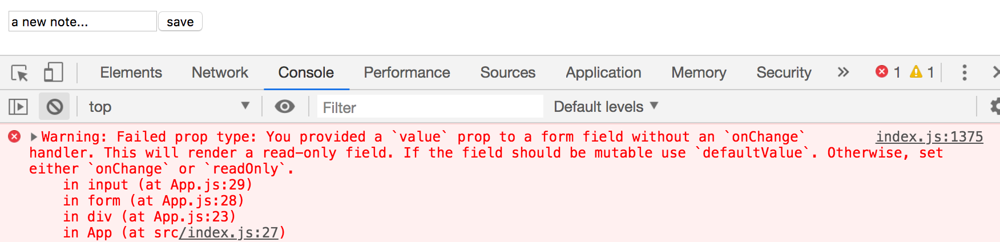
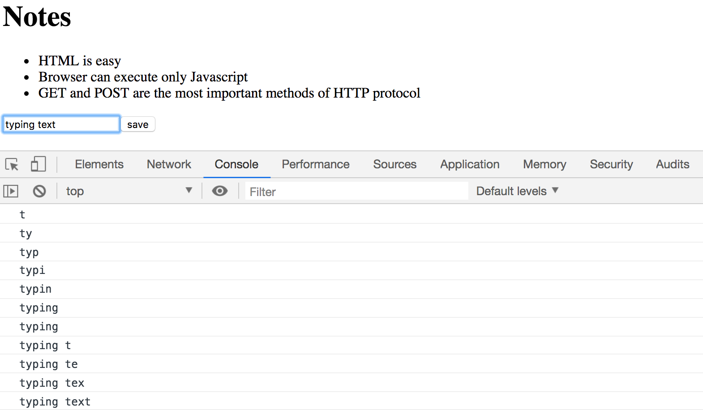
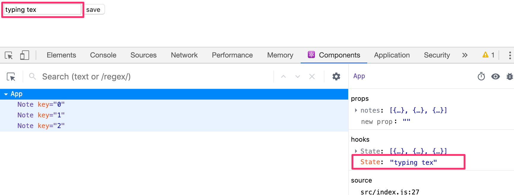

<div class="content">

دعونا نواصل توسيع تطبيقنا من خلال السماح للمستخدمين بإضافة ملاحظات جديدة. يمكنك العثور على الكود الخاص بتطبيقنا الحالي [هنا](https://github.com/fullstack-hy2020/part2-notes-frontend/tree/part2-1).

### حفظ الملاحظات في حالة المكوّن (Saving the notes in the component state)

لكي يتم تحديث صفحتنا عند إضافة ملاحظات جديدة، فمن الأفضل تخزين الملاحظات في حالة المكوّن <i>App</i>. دعونا نستورد دالة [useState](https://react.dev/reference/react/useState) ونستخدمها لتعريف جزء من الحالة يتم تهيئته بمصفوفة الملاحظات الأولية الممررة في الخصائص (props).

```js
import { useState } from 'react' // highlight-line
import Note from './components/Note'

const App = (props) => { // highlight-line
  const [notes, setNotes] = useState(props.notes) // highlight-line

  return (
    <div>
      <h1>Notes</h1>
      <ul>
        {notes.map(note => 
          <Note key={note.id} note={note} />
        )}
      </ul>
    </div>
  )
}

export default App 
```

يستخدم المكوّن دالة <em>useState</em> لتهيئة جزء الحالة المخزن في <em>notes</em> بمصفوفة الملاحظات الممررة في الخصائص:

```js
const App = (props) => { 
  const [notes, setNotes] = useState(props.notes) 

  // ...
}
```

يمكننا أيضاً استخدام أدوات مطوري React (React Developer Tools) للتحقق من حدوث ذلك بالفعل:


إذا أردنا البدء بقائمة فارغة من الملاحظات، فسنقوم بضبط القيمة الأولية كمصفوفة فارغة، وبما أن الخصائص (props) لن تُستخدم، فيمكننا حذف معامل <em>props</em> من تعريف دالة المكوّن:

```js
const App = () => { 
  const [notes, setNotes] = useState([]) 

  // ...
}  
```

دعونا نلتزم بالقيمة الأولية الممررة في الخصائص في الوقت الحالي.

بعد ذلك، دعونا نضيف [نموذج (Form)](https://developer.mozilla.org/en-US/docs/Learn/HTML/Forms) بلغة HTML إلى المكوّن والذي سيُستخدم لإضافة ملاحظات جديدة:

```js
const App = (props) => {
  const [notes, setNotes] = useState(props.notes)

// highlight-start 
  const addNote = (event) => {
    event.preventDefault()
    console.log('button clicked', event.target)
  }
  // highlight-end   

  return (
    <div>
      <h1>Notes</h1>
      <ul>
        {notes.map(note => 
          <Note key={note.id} note={note} />
        )}
      </ul>
      // highlight-start 
      <form onSubmit={addNote}>
        <input />
        <button type="submit">save</button>
      </form>   
      // highlight-end   
    </div>
  )
}
```

لقد أضفنا الدالة _addNote_ كمعالج حدث لعنصر النموذج (form) ليتم استدعاؤها عند إرسال النموذج (Submit)، وذلك بالنقر فوق زر الحفظ.

نستخدم الطريقة التي تمت مناقشتها في [الجزء 1](/ar/part1/component_state_event_handlers#event-handling) لتعريف معالج الأحداث الخاص بنا:

```js
const addNote = (event) => {
  event.preventDefault()
  console.log('button clicked', event.target)
}
```

معامل <em>event</em> هو كائن [الحدث (Event)](https://react.dev/learn/responding-to-events) الذي يطلق استدعاء دالة معالج الحدث.

يستدعي معالج الحدث على الفور دالة <em>event.preventDefault()</em>، والتي تمنع الإجراء الافتراضي لإرسال النموذج. فالإجراء الافتراضي [من بين أمور أخرى](https://developer.mozilla.org/en-US/docs/Web/API/HTMLFormElement/submit_event) يؤدي إلى إعادة تحميل الصفحة بالكامل.

يتم تسجيل الهدف من الحدث المخزن في _event.target_ في منصة التحكم:


الهدف في هذه الحالة هو النموذج (form) الذي قمنا بتعريفه في مكوّننا.

كيف نصل إلى البيانات الموجودة في عنصر الإدخال <i>input</i> داخل النموذج؟

### المكوّن المضبوط (Controlled component)

هناك طرق عديدة لتحقيق ذلك؛ والطريقة الأولى التي سنلقي نظرة عليها هي من خلال استخدام ما يُعرف بـ [المكونات المضبوطة (Controlled Components)](https://react.dev/reference/react-dom/components/input#controlling-an-input-with-a-state-variable).

دعونا نضيف جزءاً جديداً من الحالة يسمى <em>newNote</em> لتخزين المدخلات التي يكتبها المستخدم **و**دعونا نضبطه كقيمة للسمة <i>value</i> لعنصر <i>input</i>:

```js
const App = (props) => {
  const [notes, setNotes] = useState(props.notes)
  // highlight-start
  const [newNote, setNewNote] = useState(
    'a new note...'
  ) 
  // highlight-end

  const addNote = (event) => {
    event.preventDefault()
    console.log('button clicked', event.target)
  }

  return (
    <div>
      <h1>Notes</h1>
      <ul>
        {notes.map(note => 
          <Note key={note.id} note={note} />
        )}
      </ul>
      <form onSubmit={addNote}>
        <input value={newNote} /> //highlight-line
        <button type="submit">save</button>
      </form>   
    </div>
  )
}
```

يظهر النص المبدئي المخزن كقيمة أولية لحالة <em>newNote</em> في عنصر <i>input</i>، ولكن لا يمكن تعديل نص الإدخال أو الكتابة فيه. تعرض منصة التحكم تحذيراً يعطينا تلميحاً حول ما قد يكون خاطئاً:



نظراً لأننا قمنا بتعيين جزء من حالة المكوّن <i>App</i> كقيمة للسمة <i>value</i> لعنصر الإدخال، فإن المكوّن <i>App</i> [يتحكم الآن (Controls)](https://react.dev/reference/react-dom/components/input#controlling-an-input-with-a-state-variable) في سلوك عنصر الإدخال بشكل كامل.

لتمكين تعديل عنصر الإدخال والكتابة فيه، يتعين علينا تسجيل <i>معالج حدث (Event Handler)</i> يقوم بمزامنة التغييرات التي يتم إجراؤها على الإدخال مع حالة المكوّن:

```js
const App = (props) => {
  const [notes, setNotes] = useState(props.notes)
  const [newNote, setNewNote] = useState(
    'a new note...'
  ) 

  // ...

// highlight-start
  const handleNoteChange = (event) => {
    console.log(event.target.value)
    setNewNote(event.target.value)
  }
// highlight-end

  return (
    <div>
      <h1>Notes</h1>
      <ul>
        {notes.map(note => 
          <Note key={note.id} note={note} />
        )}
      </ul>
      <form onSubmit={addNote}>
        <input
          value={newNote}
          onChange={handleNoteChange} // highlight-line
        />
        <button type="submit">save</button>
      </form>   
    </div>
  )
}
```

لقد قمنا الآن بتسجيل معالج حدث للسمة <i>onChange</i> لعنصر <i>input</i> في النموذج:

```js
<input
  value={newNote}
  onChange={handleNoteChange}
/>
```

يتم استدعاء معالج الحدث في كل مرة <i>يحدث فيها تغيير في عنصر الإدخال</i> (أي عند كتابة أي حرف). وتستقبل دالة معالج الحدث كائن الحدث كمعامل <em>event</em> لها:

```js
const handleNoteChange = (event) => {
  console.log(event.target.value)
  setNewNote(event.target.value)
}
```

تتوافق الخاصية <em>target</em> لكائن الحدث الآن مع عنصر <i>input</i> المضبوط، وتشير <em>event.target.value</em> إلى قيمة الإدخال النصي لذلك العنصر.

لاحظ أننا لم نكن بحاجة إلى استدعاء دالة _event.preventDefault()_ كما فعلنا في معالج الحدث <i>onSubmit</i>. وذلك لأنه لا يحدث أي إجراء افتراضي يسبب إعادة تحميل الصفحة عند تغيير الإدخال، على عكس إرسال النماذج.

يمكنك المتابعة في منصة التحكم لترى كيف يتم استدعاء معالج الحدث عند كل ضغطة زر:



لقد تذكرت تثبيت [أدوات مطوري React](https://chrome.google.com/webstore/detail/react-developer-tools/fmkadmapgofadopljbjfkapdkoienihi)، أليس كذلك؟ ممتاز. يمكنك مباشرة مشاهدة كيفية تغير الحالة من علامة تبويب React Devtools:



الآن تعكس حالة <em>newNote</em> للمكوّن <i>App</i> القيمة الحالية للإدخال بدقة، مما يعني أنه يمكننا إكمال الدالة <em>addNote</em> لإنشاء ملاحظات جديدة:

```js
const addNote = (event) => {
  event.preventDefault()
  const noteObject = {
    content: newNote,
    important: Math.random() < 0.5,
    id: String(notes.length + 1),
  }

  setNotes(notes.concat(noteObject))
  setNewNote('')
}
```

أولاً، ننشئ كائناً جديداً للملاحظة يُدعى <em>noteObject</em> والذي سيحصل على محتواه من حالة المكوّن <em>newNote</em>. ويتم توليد المعرف الفريد <i>id</i> بناءً على إجمالي عدد الملاحظات. تعمل هذه الطريقة لتطبيقنا لأن الملاحظات لا تُحذف أبداً. وبمساعدة دالة <em>Math.random()</em>، يكون لملاحظتنا احتمال 50% لأن يتم تمييزها كملاحظة مهمة.

تتم إضافة الملاحظة الجديدة إلى قائمة الملاحظات باستخدام دالة المصفوفات [concat](https://developer.mozilla.org/en-US/docs/Web/JavaScript/Reference/Global_Objects/Array/concat)، والتي تم تقديمها في [الجزء 1](/ar/part1/java_script#arrays):

```js
setNotes(notes.concat(noteObject))
```

لا تقوم هذه الدالة بتعديل مصفوفة <em>notes</em> الأصلية، بل تُنشئ <i>نسخة جديدة من المصفوفة مع إضافة العنصر الجديد في نهايتها</i>. وهذا أمر بالغ الأهمية حيث يجب علينا [ألا نعدل الحالة مباشرة أبداً](https://react.dev/learn/updating-objects-in-state#why-is-mutating-state-not-recommended-in-react) في React!

يقوم معالج الحدث أيضاً بإعادة ضبط وتفريغ قيمة عنصر الإدخال المضبوط عن طريق استدعاء دالة <em>setNewNote</em> لحالة <em>newNote</em>:

```js
setNewNote('')
```

يمكنك العثور على الكود الكامل لتطبيقنا الحالي في الفرع <i>part2-2</i> من [مستودع GitHub هذا](https://github.com/fullstack-hy2020/part2-notes-frontend/tree/part2-2).

### تصفية العناصر المعروضة (Filtering Displayed Elements)

دعونا نضيف وظيفة جديدة إلى تطبيقنا تتيح لنا عرض الملاحظات المهمة فقط.

دعونا نضيف جزءاً من الحالة إلى المكوّن <i>App</i> يتتبع الملاحظات التي يجب عرضها:

```js
const App = (props) => {
  const [notes, setNotes] = useState(props.notes) 
  const [newNote, setNewNote] = useState('')
  const [showAll, setShowAll] = useState(true) // highlight-line
  
  // ...
}
```

دعونا نغير المكوّن بحيث يخزن قائمة بجميع الملاحظات المراد عرضها في المتغير <em>notesToShow</em>. تعتمد العناصر الموجودة في القائمة على حالة المكوّن:

```js
import { useState } from 'react'
import Note from './components/Note'

const App = (props) => {
  const [notes, setNotes] = useState(props.notes)
  const [newNote, setNewNote] = useState('') 
  const [showAll, setShowAll] = useState(true)

  // ...

// highlight-start
  const notesToShow = showAll
    ? notes
    : notes.filter(note => note.important === true)
// highlight-end

  return (
    <div>
      <h1>Notes</h1>
      <ul>
        {notesToShow.map(note => // highlight-line
          <Note key={note.id} note={note} />
        )}
      </ul>
      // ...
    </div>
  )
}
```

إن تعريف المتغير <em>notesToShow</em> موجز وأنيق للغاية:

```js
const notesToShow = showAll
  ? notes
  : notes.filter(note => note.important === true)
```

يستخدم التعريف المعامل [الشرطي الثلاثي (Conditional Operator)](https://developer.mozilla.org/en-US/docs/Web/JavaScript/Reference/Operators/Conditional_Operator) الموجود أيضاً في العديد من لغات البرمجة الأخرى.

يعمل هذا المعامل على النحو التالي: إذا كان لدينا:

```js
const result = condition ? val1 : val2
```

فسيتم ضبط المتغير <em>result</em> على قيمة <em>val1</em> إذا كان الشرط <em>condition</em> صحيحاً (true). وإذا كان الشرط <em>condition</em> خاطئاً (false)، فسيتم ضبط المتغير <em>result</em> على قيمة <em>val2</em>.

إذا كانت قيمة <em>showAll</em> هي false، فسيتم إسناد المتغير <em>notesToShow</em> إلى قائمة تحتوي فقط على الملاحظات التي تم ضبط خاصية <em>important</em> فيها على true. وتتم التصفية بمساعدة دالة المصفوفات [filter](https://developer.mozilla.org/en-US/docs/Web/JavaScript/Reference/Global_Objects/Array/filter):

```js
notes.filter(note => note.important === true)
```

إن معامل المقارنة هنا زائد عن الحاجة، نظراً لأن قيمة <em>note.important</em> هي إما <i>true</i> أو <i>false</i>، مما يعني أنه يمكننا كتابة ما يلي ببساطة:

```js
notes.filter(note => note.important)
```

لقد عرضنا معامل المقارنة أولاً للتأكيد على تفصيل مهم: في JavaScript التعبير <em>val1 == val2</em> لا يتصرف دائماً كما هو متوقع. وعند إجراء المقارنات، يكون من الأكثر أماناً وموثوقية استخدام المقارنة الصارمة <em>val1 === val2</em> حصرياً. يمكنك قراءة المزيد حول هذا الموضوع [هنا](https://developer.mozilla.org/en-US/docs/Web/JavaScript/Equality_comparisons_and_sameness).

يمكنك اختبار وظيفة التصفية عن طريق تغيير القيمة الأولية لحالة <em>showAll</em>.

بعد ذلك، دعونا نضيف وظيفة تمكن المستخدمين من تبديل حالة <em>showAll</em> للتطبيق مباشرة من واجهة المستخدم.

التغييرات ذات الصلة موضحة أدناه:

```js
import { useState } from 'react' 
import Note from './components/Note'

const App = (props) => {
  const [notes, setNotes] = useState(props.notes) 
  const [newNote, setNewNote] = useState('')
  const [showAll, setShowAll] = useState(true)

  // ...

  return (
    <div>
      <h1>Notes</h1>
// highlight-start      
      <div>
        <button onClick={() => setShowAll(!showAll)}>
          show {showAll ? 'important' : 'all'}
        </button>
      </div>
// highlight-end            
      <ul>
        {notesToShow.map(note =>
          <Note key={note.id} note={note} />
        )}
      </ul>
      // ...    
    </div>
  )
}
```

يتم التحكم في الملاحظات المعروضة (الكل مقابل المهمة فقط) بواسطة زر. معالج الحدث للزر بسيط للغاية لدرجة أنه تم تعريفه مباشرة في سمة عنصر الزر. يقوم معالج الحدث بتبديل قيمة _showAll_ من true إلى false والعكس بالعكس:

```js
() => setShowAll(!showAll)
```

يعتمد نص الزر على قيمة حالة <em>showAll</em>:

```js
show {showAll ? 'important' : 'all'}
```

يمكنك العثور على الكود الخاص بتطبيقنا الحالي بالكامل في الفرع <i>part2-3</i> من [مستودع GitHub هذا](https://github.com/fullstack-hy2020/part2-notes-frontend/tree/part2-3).
</div>

<div class="tasks">

<h3>التمارين 2.6.-2.10.</h3>

في التمرين الأول، سنبدأ العمل على تطبيق سيتم تطويره بشكل إضافي في التمارين اللاحقة. في مجموعات التمارين المترابطة، يكفي تسليم النسخة النهائية من تطبيقك فقط. ويمكنك أيضاً إنشاء commit منفصل بعد الانتهاء من كل جزء من مجموعة التمارين، لكن ذلك ليس إلزامياً.

<h4>2.6: دليل الهاتف، الخطوة 1 (The Phonebook Step 1)</h4>

دعونا ننشئ دليل هاتف بسيط. <i>**في هذا الجزء، سنقوم فقط بإضافة أسماء إلى دليل الهاتف.**</i>

دعونا نبدأ بتنفيذ إضافة شخص إلى دليل الهاتف.

يمكنك استخدام الكود أدناه كنقطة انطلاق للمكوّن <i>App</i> لتطبيقك:

```js
import { useState } from 'react'

const App = () => {
  const [persons, setPersons] = useState([
    { name: 'Arto Hellas' }
  ]) 
  const [newName, setNewName] = useState('')

  return (
    <div>
      <h2>Phonebook</h2>
      <form>
        <div>
          name: <input />
        </div>
        <div>
          <button type="submit">add</button>
        </div>
      </form>
      <h2>Numbers</h2>
      ...
    </div>
  )
}

export default App
```

إن حالة <em>newName</em> مخصصة للتحكم في عنصر إدخال النموذج.

في بعض الأحيان، قد يكون من المفيد تصيير الحالة والمتغيرات الأخرى كنص لأغراض تصحيح الأخطاء. يمكنك مؤقتاً إضافة العنصر التالي إلى المكوّن المصير:

```html
<div>debug: {newName}</div>
```

من المهم أيضاً تطبيق ما تعلمناه في فصل [تصحيح أخطاء تطبيقات React](/ar/part1/a_more_complex_state_debugging_react_apps) من الجزء الأول بشكل فعال. تُعد إضافة [أدوات مطوري React](https://chrome.google.com/webstore/detail/react-developer-tools/fmkadmapgofadopljbjfkapdkoienihi) مفيدة <i>للغاية</i> لتتبع التغييرات التي تحدث في حالة التطبيق.

بعد الانتهاء من هذا التمرين، يجب أن يبدو تطبيقك تقريباً كما يلي:


لاحظ استخدام إضافة أدوات مطوري React في الصورة أعلاه!

**ملاحظات**:

- يمكنك استخدام اسم الشخص كقيمة لخاصية <i>key</i>
- تذكر منع الإجراء الافتراضي لإرسال نماذج HTML!

<h4>2.7: دليل الهاتف، الخطوة 2 (The Phonebook Step 2)</h4>

امنع المستخدم من إضافة أسماء موجودة بالفعل في دليل الهاتف. تحتوي مصفوفات JavaScript على العديد من [الدوال](https://developer.mozilla.org/en-US/docs/Web/JavaScript/Reference/Global_Objects/Array) المناسبة لإنجاز هذه المهمة. وتذكر [كيف تعمل مساواة الكائنات](https://developer.mozilla.org/en-US/docs/Web/JavaScript/Equality_comparisons_and_sameness) في Javascript.

قم بإصدار تحذير باستخدام أمر [alert](https://developer.mozilla.org/en-US/docs/Web/API/Window/alert) عند محاولة تنفيذ مثل هذا الإجراء:


**تلميح:** عندما تقوم بتكوين سلاسل نصية تحتوي على قيم من متغيرات، يوصى باستخدام [السلاسل النصية القالبية (Template Strings)](https://developer.mozilla.org/en-US/docs/Web/JavaScript/Reference/Template_literals):

```js
`${newName} is already added to phonebook`
```

إذا كان المتغير <em>newName</em> يحمل القيمة <i>Arto Hellas</i>، فإن تعبير السلسلة القالبية يُرجع السلسلة:

```js
`Arto Hellas is already added to phonebook`
```

يمكن القيام بالشيء نفسه بأسلوب يشبه Java باستخدام معامل الجمع:

```js
newName + ' is already added to phonebook'
```

يُعد استخدام السلاسل القالبية هو الخيار الأكثر فصاحة وأناقة في لغة JavaScript وعلامة على الاحتراف البرمجي.

<h4>2.8: دليل الهاتف، الخطوة 3 (The Phonebook Step 3)</h4>

قم بتوسيع تطبيقك من خلال السماح للمستخدمين بإضافة أرقام هواتف إلى دليل الهاتف. ستحتاج إلى إضافة عنصر <i>input</i> ثانٍ إلى النموذج (جنباً إلى جنب مع معالج الأحداث الخاص به):

```js
<form>
  <div>name: <input /></div>
  <div>number: <input /></div>
  <div><button type="submit">add</button></div>
</form>
```

في هذه المرحلة، يمكن أن يبدو التطبيق شيئاً مثل هذا. تعرض الصورة أيضاً حالة التطبيق بمساعدة [أدوات مطوري React](https://chrome.google.com/webstore/detail/react-developer-tools/fmkadmapgofadopljbjfkapdkoienihi):


<h4>2.9*: دليل الهاتف، الخطوة 4 (The Phonebook Step 4)</h4>

قم بتنفيذ حقل بحث يمكن استخدامه لتصفية قائمة الأشخاص حسب الاسم:


يمكنك تنفيذ حقل البحث كعنصر <i>input</i> يتم وضعه خارج نموذج HTML. منطق التصفية الموضح في الصورة *غير حساس لحالة الأحرف (Case-insensitive)*، مما يعني أن مصطلح البحث <i>arto</i> يُرجع أيضاً النتائج التي تحتوي على Arto بحرف A كبير.

**ملاحظة:** عندما تعمل على وظيفة برمجية جديدة، غالباً ما يكون من المفيد وضع بعض البيانات التجريبية الثابتة في تطبيقك، على سبيل المثال:

```js
const App = () => {
  const [persons, setPersons] = useState([
    { name: 'Arto Hellas', number: '040-123456', id: 1 },
    { name: 'Ada Lovelace', number: '39-44-5323523', id: 2 },
    { name: 'Dan Abramov', number: '12-43-234345', id: 3 },
    { name: 'Mary Poppendieck', number: '39-23-6423122', id: 4 }
  ])

  // ...
}
```

هذا يوفر عليك إدخال البيانات يدوياً في تطبيقك في كل مرة لاختبار وظيفتك الجديدة.

<h4>2.10: دليل الهاتف، الخطوة 5 (The Phonebook Step 5)</h4>

إذا كنت قد قمت بتنفيذ تطبيقك في مكوّن واحد، فأعد هيكلته عن طريق استخراج الأجزاء المناسبة إلى مكونات جديدة مستقلة. واحتفظ بحالة التطبيق وجميع معالجات الأحداث في المكوّن الجذري <i>App</i>.

يكفي استخراج <i>**ثلاثة**</i> مكونات من التطبيق. المرشحون الجيدون للمكونات المنفصلة هم، على سبيل المثال: مرشح البحث (Filter)، والنموذج المخصص لإضافة أشخاص جدد إلى دليل الهاتف (PersonForm)، ومكوّن يصيّر جميع الأشخاص من دليل الهاتف (Persons)، ومكوّن يصيّر تفاصيل شخص واحد.

يمكن أن يبدو المكوّن الجذري للتطبيق مشابهاً لهذا بعد إعادة الهيكلة. المكوّن الجذري المعاد هيكلته أدناه يصيّر العناوين فقط ويترك للمكونات المستخرجة الاهتمام بالباقي:

```js
const App = () => {
  // ...

  return (
    <div>
      <h2>Phonebook</h2>

      <Filter ... />

      <h3>Add a new</h3>

      <PersonForm 
        ...
      />

      <h3>Numbers</h3>

      <Persons ... />
    </div>
  )
}
```

**ملاحظة**: قد تواجه مشكلات في هذا التمرين إذا قمت بتعريف مكوناتك "في المكان الخطأ". الآن هو الوقت المناسب لمراجعة فصل [لا تُعرّف مكونات داخل مكونات أخرى](/ar/part1/a_more_complex_state_debugging_react_apps#do-not-define-components-within-components) من الجزء السابق.

</div>
