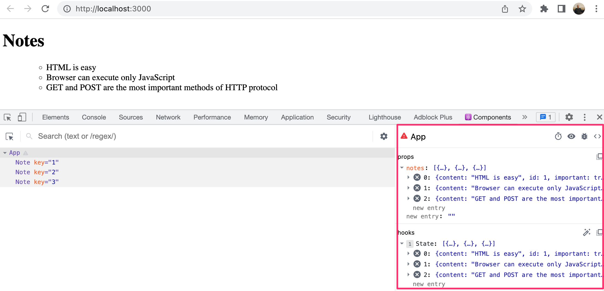
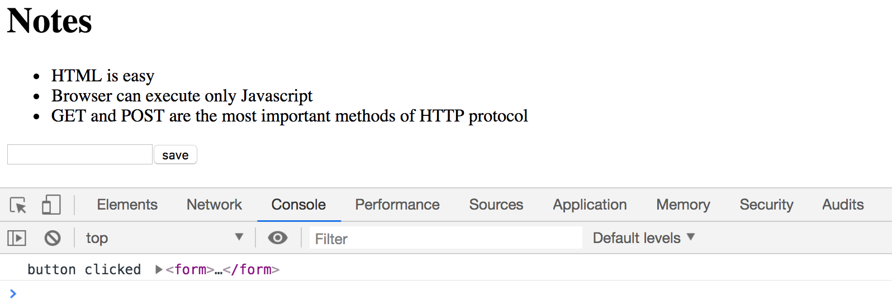
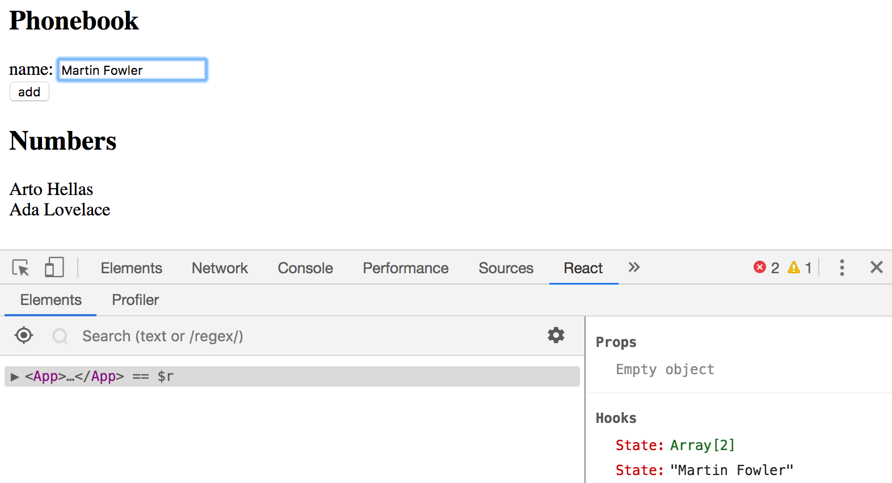
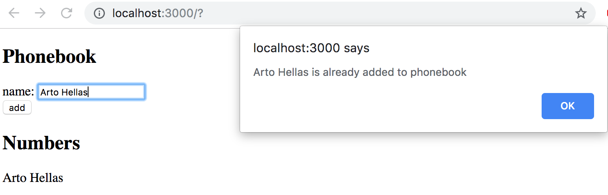
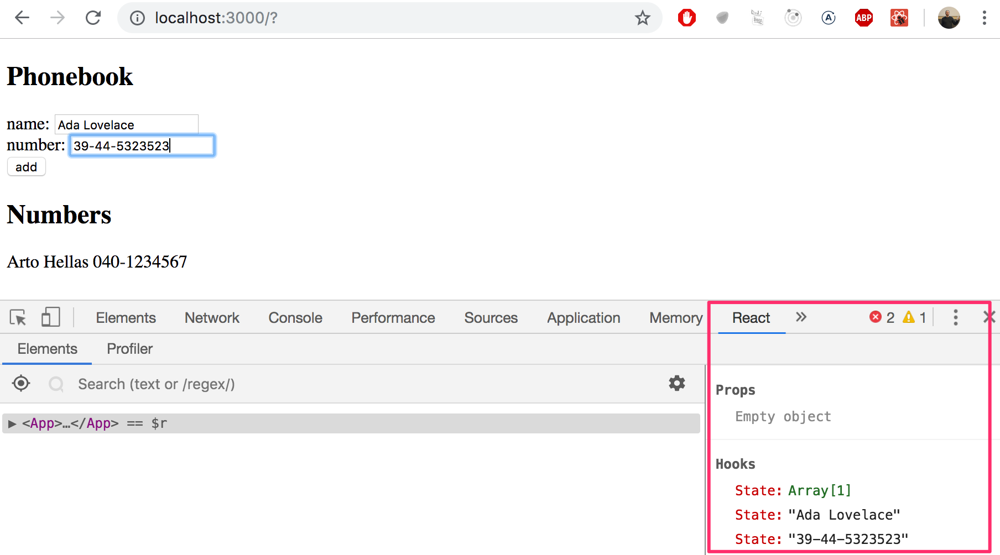
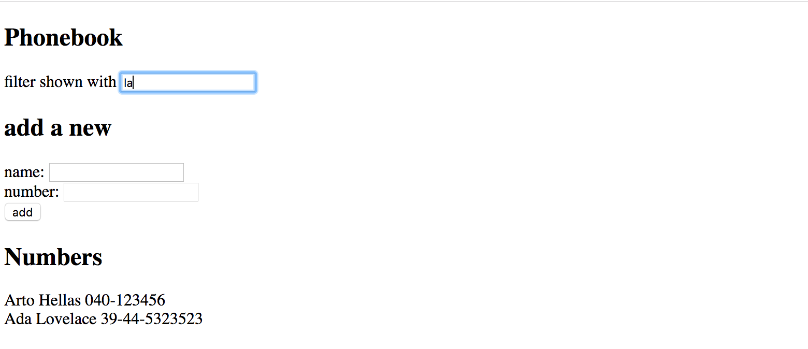

<div class="content">

سنواصل في هذا الدرس توسيع تطبيقنا ليتيح للمستخدمين إمكانية إضافة ملاحظات جديدة عبر واجهة المستخدم.

### حفظ الملاحظات في حالة المكون (Saving the notes in the component state)

لتحديث الصفحة عند إضافة ملاحظات جديدة، يجب حفظ الملاحظات في حالة المكون الرئيسي `App` باستخدام دالة `useState`:

```js
import { useState } from 'react'
import Note from './components/Note'

const App = (props) => {
  const [notes, setNotes] = useState(props.notes)

  return (
    <div>
      <h1>Notes</h1>
      <ul>
        {notes.map(note => 
          <Note key={note.id} note={note} />
        )}
      </ul>
    </div>
  )
}

export default App 
```

يمكننا معاينة هذه الحالة عبر إضافة React Developer Tools:



لنقم الآن بإضافة نموذج HTML ([form](https://developer.mozilla.org/en-US/docs/Learn/HTML/Forms)) لإدخال الملاحظات:

```js
const App = (props) => {
  const [notes, setNotes] = useState(props.notes)

  const addNote = (event) => {
    event.preventDefault()
    console.log('button clicked', event.target)
  }

  return (
    <div>
      <h1>Notes</h1>
      <ul>
        {notes.map(note => 
          <Note key={note.id} note={note} />
        )}
      </ul>
      <form onSubmit={addNote}>
        <input />
        <button type="submit">save</button>
      </form>   
    </div>
  )
}
```

يقوم المعامل `event` بتمثيل الحدث الذي أدى لاستدعاء الدالة. ونستدعي فوراً `event.preventDefault()` لمنع السلوك الافتراضي لإرسال النماذج في HTML (والذي يتسبب عادة بإعادة تحميل الصفحة).



---

### المكونات الموجهة / المدارة (Controlled components)

كيف نقرأ ونتحكم في القيمة المكتوبة داخل حقل الإدخال `<input />`؟
الطريقة القياسية والأكثر أماناً في React هي استخدام **المكونات الموجهة ([Controlled components](https://react.dev/reference/react-dom/components/input#controlling-an-input-with-a-state-variable))**:

1. نُنشئ قطعة حالة جديدة باسم `newNote` لتخزين النص المدخل.
2. نربط قيمة الحقل بخاصية `value={newNote}`.
3. نربط أي تغيير يجريه المستخدم بمعالج حدث `onChange`:

```js
const App = (props) => {
  const [notes, setNotes] = useState(props.notes)
  const [newNote, setNewNote] = useState(
    'a new note...'
  ) 

  const handleNoteChange = (event) => {
    console.log(event.target.value)
    setNewNote(event.target.value)
  }

  const addNote = (event) => {
    event.preventDefault()
    const noteObject = {
      content: newNote,
      important: Math.random() < 0.5,
      id: String(notes.length + 1),
    }

    setNotes(notes.concat(noteObject))
    setNewNote('')
  }

  return (
    <div>
      <h1>Notes</h1>
      <ul>
        {notes.map(note => 
          <Note key={note.id} note={note} />
        )}
      </ul>
      <form onSubmit={addNote}>
        <input
          value={newNote}
          onChange={handleNoteChange}
        />
        <button type="submit">save</button>
      </form>   
    </div>
  )
}
```

تقوم الدالة `handleNoteChange` باستقبال قيمة الحقل الحالية عبر `event.target.value` وتحديث حالة `newNote`.

وعند النقر على زر الحفظ، يُنشئ معالج `addNote` كائناً جديداً للملاحظة ويضيفه لمصفوفة الملاحظات عبر `notes.concat(noteObject)` ثم يُعيد إفراغ حقل الإدخال عبر `setNewNote('')`.

---

### تصفية العناصر المعروضة (Filtering Displayed Elements)

لنضف إمكانية تصفية الملاحظات لعرض الملاحظات الهامة فقط:

```js
import { useState } from 'react'
import Note from './components/Note'

const App = (props) => {
  const [notes, setNotes] = useState(props.notes)
  const [newNote, setNewNote] = useState('')
  const [showAll, setShowAll] = useState(true)

  const notesToShow = showAll
    ? notes
    : notes.filter(note => note.important)

  return (
    <div>
      <h1>Notes</h1>
      <div>
        <button onClick={() => setShowAll(!showAll)}>
          show {showAll ? 'important' : 'all'}
        </button>
      </div>
      <ul>
        {notesToShow.map(note =>
          <Note key={note.id} note={note} />
        )}
      </ul>
      <form onSubmit={addNote}>
        <input value={newNote} onChange={handleNoteChange} />
        <button type="submit">save</button>
      </form>
    </div>
  )
}
```

يتحكم الزر في تبديل حالة `showAll` بين `true` و `false` عبر `setShowAll(!showAll)`. وتستخدم دالة `filter` لترشيح الملاحظات المصيرة في المتغير `notesToShow`.

</div>

<div class="tasks">

<h3>التمارين 2.6 - 2.10: تطبيق دليل الهاتف (The Phonebook)</h3>

سنبدأ في هذا التمرين ببناء تطبيق دليل هاتف بسيط وسنطوره تدريجياً عبر التمارين التالية.

<h4>2.6: دليل الهاتف - الخطوة 1 (The Phonebook Step 1)</h4>

ابدأ بتنفيذ إضافة الأسماء إلى دليل الهاتف باستخدام الكود المبدئي التالي:

```js
import { useState } from 'react'

const App = () => {
  const [persons, setPersons] = useState([
    { name: 'Arto Hellas' }
  ]) 
  const [newName, setNewName] = useState('')

  return (
    <div>
      <h2>Phonebook</h2>
      <form>
        <div>
          name: <input />
        </div>
        <div>
          <button type="submit">add</button>
        </div>
      </form>
      <h2>Numbers</h2>
      ...
    </div>
  )
}

export default App
```

- استخدم المكونات الموجهة (Controlled inputs) بربط `value` و `onChange`.
- امنع السلوك الافتراضي للنموذج عبر `event.preventDefault()`.
- استخدم اسم الشخص كقيمة لخاصية `key`.



<h4>2.7: دليل الهاتف - الخطوة 2 (The Phonebook Step 2)</h4>

امنع إضافة الأسماء المكررة الموجودة مسبقاً في الدليل. واعرض تنبيهاً للمستخدم عبر نافذة `alert()` مثل: `[الاسم] is already added to phonebook`.



<h4>2.8: دليل الهاتف - الخطوة 3 (The Phonebook Step 3)</h4>

أضف حقل إدخال ثانٍ في النموذج لتسجيل أرقام الهواتف بجانب الأسماء:

```js
<form>
  <div>name: <input value={newName} onChange={handleNameChange} /></div>
  <div>number: <input value={newNumber} onChange={handleNumberChange} /></div>
  <div><button type="submit">add</button></div>
</form>
```



<h4>2.9*: دليل الهاتف - الخطوة 4 (The Phonebook Step 4)</h4>

أضف حقل بحث لتصفية قائمة جهات الاتصال حسب الاسم دون حساسية لحالة الأحرف (Case-insensitive):



<h4>2.10: دليل الهاتف - الخطوة 5 (The Phonebook Step 5)</h4>

أعد هيكلة التطبيق بفصل المكونات إلى ملفات مستقلة:
- `Filter`: لحقل التصفية والبحث.
- `PersonForm`: لنموذج إضافة جهة اتصال جديدة.
- `Persons`: لعرض قائمة جهات الاتصال.
- `Person`: لعرض بيانات جهة اتصال واحدة.

مع الإبقاء على الحالة المركزية ومعالجات الأحداث في المكون الرئيسي `App`.

</div>
