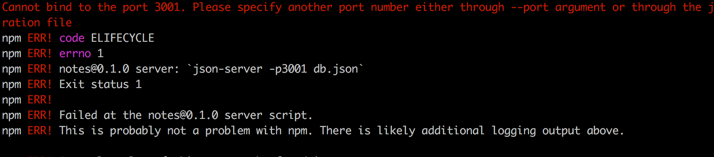
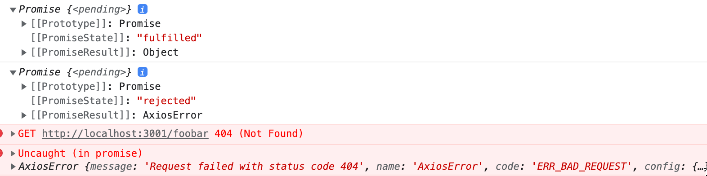
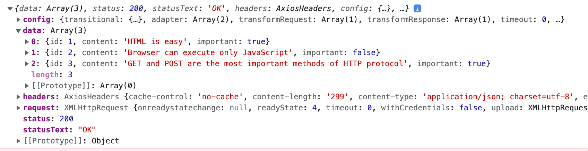
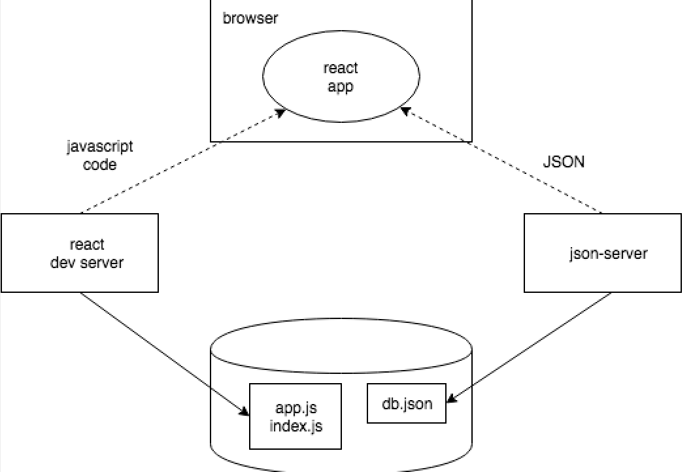

<div class="content">

لفترة من الوقت حتى الآن، كنا نعمل فقط على "الواجهة الأمامية" (Frontend)، أي الوظائف التي تعمل على جانب العميل (المتصفح). وسنبدأ العمل على "الواجهة الخلفية" (Backend)، أي وظائف جانب الخادم في [الجزء الثالث](/ar/part3) من هذه الدورة. ومع ذلك، سنتخذ الآن خطوة في هذا الاتجاه من خلال التعرف على كيفية تواصل الكود البرمجي الذي يتم تنفيذه في المتصفح مع الخادم الخلفي.

دعونا نستخدم أداة مخصصة للاستخدام أثناء مرحلة تطوير البرمجيات تسمى [JSON Server](https://github.com/typicode/json-server) لتعمل كخادم لنا.

أنشئ ملفاً باسم <i>db.json</i> في المجلد الجذري لمشروع <i>notes</i> السابق بالمحتوى التالي:

```json
{
  "notes": [
    {
      "id": "1",
      "content": "HTML is easy",
      "important": true
    },
    {
      "id": "2",
      "content": "Browser can execute only JavaScript",
      "important": false
    },
    {
      "id": "3",
      "content": "GET and POST are the most important methods of HTTP protocol",
      "important": true
    }
  ]
}
```

يمكنك بدء تشغيل JSON Server دون الحاجة إلى تثبيت منفصل عن طريق تنفيذ أمر _npx_ التالي في المجلد الجذري للتطبيق:

```js
npx json-server --port 3001 db.json
```

يبدأ JSON Server بالعمل على المنفذ 3000 افتراضياً، ولكننا سنحدد الآن منفذاً بديلاً وهو 3001. دعونا ننتقل إلى العنوان <http://localhost:3001/notes> في المتصفح. يمكننا أن نرى أن JSON Server يقدم الملاحظات التي كتبناها مسبقاً في الملف بتنسيق JSON:


إذا لم يكن لدى متصفحك طريقة لتنسيق عرض بيانات JSON، فقم بتثبيت إضافة مناسبة، مثل [JSONView](https://chromewebstore.google.com/detail/gmegofmjomhknnokphhckolhcffdaihd) لتسهيل قراءة البيانات.

من الآن فصاعداً، ستكون الفكرة هي حفظ الملاحظات على الخادم، وهو ما يعني في هذه الحالة حفظها في json-server. يقوم كود React بجلب الملاحظات من الخادم وتصييرها على الشاشة. وكلما تمت إضافة ملاحظة جديدة إلى التطبيق، يرسلها كود React أيضاً إلى الخادم لجعل الملاحظة الجديدة محفوظة ومستمرة في "الذاكرة".

يقوم json-server بتخزين جميع البيانات في ملف <i>db.json</i> الموجود على الخادم. في العالم الحقيقي، يتم تخزين البيانات في نوع من قواعد البيانات. ومع ذلك، يُعد json-server أداة مفيدة للغاية تتيح استخدام وظائف جانب الخادم في مرحلة التطوير دون الحاجة إلى برمجة أي كود خلفي فعلي.

سنتعرف على مبادئ تنفيذ وظائف جانب الخادم بمزيد من التفصيل في [الجزء الثالث (Part 3)](/ar/part3) من هذه الدورة.

### المتصفح كبيئة تشغيل (The browser as a runtime environment)

مهمتنا الأولى هي جلب الملاحظات الموجودة بالفعل إلى تطبيق React الخاص بنا من العنوان <http://localhost:3001/notes>.

في [المشروع النموذجي للجزء 0](/ar/part0/fundamentals_of_web_apps#running-application-logic-on-the-browser)، تعلمنا بالفعل طريقة لجلب البيانات من الخادم باستخدام JavaScript. كان الكود في المثال يجلب البيانات باستخدام [XMLHttpRequest](https://developer.mozilla.org/en-US/docs/Web/API/XMLHttpRequest)، والمعروف أيضاً بطلب HTTP عبر كائن XHR. وهذه تقنية تم تقديمها في عام 1999، ويدعمها كل متصفح منذ فترة طويلة.

لم يعد يوصى باستخدام XHR اليوم، حيث تدعم المتصفحات الحديثة على نطاق واسع دالة [fetch](https://developer.mozilla.org/en-US/docs/Web/API/WindowOrWorkerGlobalScope/fetch) المبنية على ما يُعرف بـ [الوعود (Promises)](https://developer.mozilla.org/en-US/docs/Web/JavaScript/Reference/Global_Objects/Promise)، بدلاً من النموذج المعتمد على الأحداث الذي كان يستخدمه XHR.

للتذكير من الجزء 0 (والذي يجب على المرء <i>أن يتذكر عدم استخدامه</i> بدون سبب قاهر)، كان يتم جلب البيانات باستخدام XHR بالطريقة التالية:

```js
const xhttp = new XMLHttpRequest()

xhttp.onreadystatechange = function() {
  if (this.readyState == 4 && this.status == 200) {
    const data = JSON.parse(this.responseText)
    // معالجة الاستجابة المحفوظة في المتغير data
  }
}

xhttp.open('GET', '/data.json', true)
xhttp.send()
```

في البداية مباشرة، نسجل <i>معالج حدث</i> لكائن <em>xhttp</em> الذي يمثل طلب HTTP، والذي سيتم استدعاؤه بواسطة بيئة تشغيل JavaScript كلما تغيرت حالة كائن <em>xhttp</em>. وإذا كان التغيير في الحالة يعني وصول الاستجابة للطلب، فستتم معالجة البيانات وفقاً لذلك.

من الجدير بالذكر أن الكود الموجود في معالج الأحداث يتم تعريفه قبل إرسال الطلب إلى الخادم. وعلى الرغم من ذلك، سيتم تنفيذ الكود الموجود داخل معالج الأحداث في نقطة زمنية لاحقة. وبالتالي، لا يتم تنفيذ الكود بشكل متزامن "من أعلى إلى أسفل"، بل يتم تنفيذه <i>بشكل غير متزامن (Asynchronously)</i>؛ حيث تستدعي JavaScript معالج الأحداث المسجل للطلب في وقت لاحق عند وصول الرد.

إن الطريقة المتزامنة لتقديم الطلبات الشائعة في البرمجة بلغة Java، على سبيل المثال، تسير على النحو التالي (ملاحظة: هذا ليس كود Java صالحاً للتشغيل فعلياً):

```java
HTTPRequest request = new HTTPRequest();

String url = "https://studies.cs.helsinki.fi/exampleapp/data.json";
List<Note> notes = request.get(url);

notes.forEach(m => {
  System.out.println(m.content);
});
```

في Java، يتم تنفيذ الكود سطراً بسطر ويتوقف وينتظر طلب HTTP، مما يعني انتظار انتهاء الأمر _request.get(...)_. ثم يتم تخزين البيانات التي يرجعها الأمر، وهي في هذه الحالة الملاحظات، في متغير، ونبدأ في معالجة البيانات بالطريقة المطلوبة.

في المقابل، تتبع محركات JavaScript وبيئات تشغيلها [النموذج غير المتزامن (Asynchronous Model)](https://developer.mozilla.org/en-US/docs/Web/JavaScript/EventLoop). من حيث المبدأ، يتطلب هذا تنفيذ جميع [عمليات الإدخال/الإخراج (IO Operations)](https://en.wikipedia.org/wiki/Input/output) (مع بعض الاستثناءات) بطريقة غير حاصرة (Non-blocking). وهذا يعني أن تنفيذ الكود يستمر فوراً بعد استدعاء دالة الإدخال/الإخراج، دون الانتظار حتى ترجع نتيجتها.

عند اكتمال عملية غير متزامنة، أو بشكل أكثر تحديداً في وقت ما بعد اكتمالها، يستدعي محرك JavaScript معالجات الأحداث المسجلة لتلك العملية.

حالياً، تُعد محركات JavaScript <i>أحادية الخيط (Single-threaded)</i>، مما يعني أنها لا تستطيع تنفيذ الكود بشكل متوازٍ. ونتيجة لذلك، يُعد استخدام نموذج غير حاصر لتنفيذ عمليات الإدخال/الإخراج مطلباً أساسياً في الممارسة العملية. وإلا فإن المتصفح "سيتجمد" أثناء جلب البيانات من الخادم مثلاً.

إحدى النتائج المترتبة على كون محركات JavaScript أحادية الخيط هي أنه إذا استغرق تنفيذ الكود وقتاً طويلاً، فإن المتصفح يصبح غير مستجيب طوال مدة التنفيذ. إذا تمت إضافة الكود التالي إلى بداية المكوّن <i>App</i>:

```js
const App = (props) => {
  const [notes, setNotes] = useState(props.notes)
  const [newNote, setNewNote] = useState('')
  const [showAll, setShowAll] = useState(true)

  // highlight-start
  setTimeout(() => {
    console.log('loop..')
    let i = 0
    while (i < 99999999999) {
      i++
    }
    console.log('end')
  }, 5000)
  // highlight-end

  // ...
}
```

يعمل كل شيء بشكل طبيعي لمدة خمس ثوانٍ. وعندما يتم تنفيذ الدالة المعرفة كمعامل لـ <em>setTimeout</em>، تصبح صفحة المتصفح غير مستجيبة تماماً طوال مدة حلقة التكرار الطويلة. تتجمد الصفحة تماماً، مما يعني أنه لا يمكنك النقر على أزرارها أو استخدام أي وظيفة أخرى.

لكي يظل المتصفح <i>مستجيباً (Responsive)</i>، أي قادراً على التفاعل باستمرار مع عمليات المستخدم بالسرعة الكافية، يجب أن يكون منطق الكود بحيث لا يستغرق أي حساب فردي وقتاً طويلاً جداً.

هناك مجموعة من المواد الإضافية حول هذا الموضوع يمكن العثور عليها على الإنترنت. وأحد العروض التقديمية الواضحة والممتازة بشكل خاص لهذا الموضوع هي الكلمة الرئيسية لفيليب روبرتس بعنوان [What the heck is the event loop anyway?](https://www.youtube.com/watch?v=8aGhZQkoFbQ).

في متصفحات اليوم، من الممكن تشغيل كود متوازٍ بمساعدة ما يُعرف بـ [عمال الويب (Web Workers)](https://developer.mozilla.org/en-US/docs/Web/API/Web_Workers_API/Using_web_workers). ومع ذلك، لا تزال حلقة الأحداث (Event Loop) لنافذة المتصفح الفردية تتم معالجتها فقط بواسطة [خيط واحد (Single Thread)](https://medium.com/techtrument/multithreading-javascript-46156179cf9a).

### npm

دعونا نعود إلى موضوع جلب البيانات من الخادم.

يمكننا استخدام دالة [fetch](https://developer.mozilla.org/en-US/docs/Web/API/WindowOrWorkerGlobalScope/fetch) المعتمدة على الوعود المذكورة سابقاً لسحب البيانات من الخادم. تُعد Fetch أداة رائعة؛ فهي معيارية ومدعومة من جميع المتصفحات الحديثة (باستثناء IE).

ومع ذلك، سنستخدم مكتبة [axios](https://github.com/axios/axios) بدلاً منها للاتصال بين المتصفح والخادم. وهي تعمل بشكل مشابه لـ fetch ولكنها أكثر راحة وسلاسة في الاستخدام. سبب وجيه آخر لاستخدام Axios هو أنها تساعدنا في التعرف على كيفية إضافة المكتبات الخارجية، أو <i>حزم npm (npm packages)</i>، إلى مشاريع React.

في الوقت الحاضر، يتم تعريف جميع مشاريع JavaScript عملياً باستخدام مدير حزم Node، المعروف اختصاراً بـ [npm](https://docs.npmjs.com/about-npm). تتبع المشاريع التي تم إنشاؤها باستخدام Vite أيضاً تنسيق npm. والمؤشر الواضح على أن المشروع يستخدم npm هو ملف <i>package.json</i> الموجود في جذر المشروع:

```json
{
  "name": "part2-notes-frontend",
  "private": true,
  "version": "0.0.0",
  "type": "module",
  "scripts": {
    "dev": "vite",
    "build": "vite build",
    "lint": "eslint .",
    "preview": "vite preview"
  },
  "dependencies": {
    "react": "^18.3.1",
    "react-dom": "^18.3.1"
  },
  "devDependencies": {
    "@eslint/js": "^9.17.0",
    "@types/react": "^18.3.18",
    "@types/react-dom": "^18.3.5",
    "@vitejs/plugin-react": "^4.3.4",
    "eslint": "^9.17.0",
    "eslint-plugin-react": "^7.37.2",
    "eslint-plugin-react-hooks": "^5.0.0",
    "eslint-plugin-react-refresh": "^0.4.16",
    "globals": "^15.14.0",
    "vite": "^6.0.5"
  }
}
```

في هذه المرحلة، فإن قسم <i>dependencies</i> هو الأكثر أهمية بالنسبة لنا لأنه يحدد <i>الاعتماديات (Dependencies)</i>، أو المكتبات الخارجية، التي يحتاجها المشروع.

نريد الآن استخدام axios. نظرياً، يمكننا تعريف المكتبة مباشرة في ملف <i>package.json</i>، ولكن من الأفضل دائماً تثبيتها من سطر الأوامر:

```js
npm install axios
```

**ملاحظة هامة: يجب تشغيل أوامر _npm_ دائماً في المجلد الجذري للمشروع**، وهو المكان الذي يوجد فيه ملف <i>package.json</i>.

أصبحت Axios الآن مدرجة ضمن الاعتماديات الأخرى:

```json
{
  "name": "part2-notes-frontend",
  "private": true,
  "version": "0.0.0",
  "type": "module",
  "scripts": {
    "dev": "vite",
    "build": "vite build",
    "lint": "eslint .",
    "preview": "vite preview"
  },
  "dependencies": {
    "axios": "^1.7.9", // highlight-line
    "react": "^18.3.1",
    "react-dom": "^18.3.1"
  },
  // ...
}
```

بالإضافة إلى إضافة axios إلى الاعتماديات، قام أمر <em>npm install</em> أيضاً <i>بتنزيل</i> شيفرة المكتبة. وكما هو الحال مع الاعتماديات الأخرى، يمكن العثور على الكود في مجلد <i>node\_modules</i> الموجود في الجذر. وكما قد يكون لاحظ البعض، يحتوي <i>node\_modules</i> على قدر كبير من الملفات الشيقة.

دعونا نجري إضافة أخرى. سنقوم بتثبيت <i>json-server</i> كاعتمادية تطوير (تُستخدم فقط أثناء التطوير) عن طريق تنفيذ الأمر:

```js
npm install json-server --save-dev
```

وإجراء تعديل بسيط على قسم <i>scripts</i> في ملف <i>package.json</i>:

```json
{
  // ... 
  "scripts": {
    "dev": "vite",
    "build": "vite build",
    "lint": "eslint .",
    "preview": "vite preview",
    "server": "json-server -p 3001 db.json" // highlight-line
  },
}
```

يمكننا الآن بسهولة، ودون الحاجة لكتابة المعاملات في كل مرة، تشغيل json-server من المجلد الجذري للمشروع باستخدام الأمر:

```js
npm run server
```

سنتعرف أكثر على أداة _npm_ في [الجزء الثالث من الدورة](/ar/part3).

**ملاحظة**: يجب إنهاء خادم json-server الذي تم تشغيله مسبقاً قبل بدء تشغيل خادم جديد؛ وإلا ستحدث مشكلة:



تخبرنا الطباعة الحمراء في رسالة الخطأ عن المشكلة:

<i>Cannot bind to port 3001. Please specify another port number either through --port argument or through the json-server.json configuration file</i>

كما نرى، لا يستطيع التطبيق ربط نفسه بـ [المنفذ (Port)](https://en.wikipedia.org/wiki/Port_(computer_networking)). والسبب هو أن المنفذ 3001 مشغول بالفعل بواسطة خادم json-server المشغل مسبقاً.

لقد استخدمنا الأمر _npm install_ مرتين، ولكن مع اختلافات طفيفة:

```js
npm install axios
npm install json-server --save-dev
```

هناك فارق دقيق في المعاملات. يتم تثبيت <i>axios</i> كاعتمادية تشغيل عادية للتطبيق لأن تنفيذ البرنامج يتطلب وجود المكتبة في الإنتاج. من ناحية أخرى، تم تثبيت <i>json-server</i> كاعتمادية تطوير (_--save-dev_)، لأن البرنامج نفسه لا يتطلبها في بيئة الإنتاج الفعلية، بل تُستخدم للمساعدة فقط أثناء مرحلة تطوير البرمجيات. وسيكون هناك المزيد حول أنواع الاعتماديات المختلفة في الجزء التالي من الدورة.

### Axios والوعود (Axios and promises)

الآن نحن مستعدون لاستخدام Axios. من الآن فصاعداً، يُفترض أن json-server يعمل على المنفذ 3001.

ملاحظة: لتشغيل json-server وتطبيق react في وقت واحد، قد تحتاج إلى استخدام نافذتي طرفية (Terminal) منفصلتين: واحدة لإبقاء json-server قيد التشغيل والأخرى لتشغيل تطبيق React.

يمكن جلب المكتبة للاستخدام بنفس طريقة المكتبات الأخرى، أي باستخدام عبارة <em>import</em> المناسبة.

أضف ما يلي إلى الملف <i>main.jsx</i>:

```js
import axios from 'axios'

const promise = axios.get('http://localhost:3001/notes')
console.log(promise)

const promise2 = axios.get('http://localhost:3001/foobar')
console.log(promise2)
```

إذا فتحت <http://localhost:5173/> في المتصفح، فسيتم طباعة التالي في منصة التحكم:



تُرجع دالة _get_ الخاصة بـ Axios [وعداً (Promise)](https://developer.mozilla.org/en-US/docs/Web/JavaScript/Guide/Using_promises).

ينص التوثيق على موقع Mozilla على ما يلي حول الوعود:

> <i>الوعد (Promise) هو كائن يمثل الاكتمال النهائي أو الفشل لعملية غير متزامنة.</i>

بمعنى آخر، الوعد هو كائن يمثل عملية غير متزامنة. يمكن أن يكون للوعد ثلاث حالات متميزة:

- الوعد <i>معلق (pending)</i>: يعني أن العملية غير المتزامنة المقابلة للوعد لم تنته بعد والقيمة النهائية غير متوفرة بعد.
- الوعد <i>متحقق أو مُنجز (fulfilled)</i>: يعني أن العملية قد اكتملت بنجاح والقيمة النهائية أصبحت متاحة.
- الوعد <i>مرفوض (rejected)</i>: يعني أن هناك خطأ منع تحديد القيمة النهائية، وهو ما يمثل عموماً عملية فاشلة.

هناك العديد من التفاصيل المتعلقة بالوعود، ولكن فهم هذه الحالات الثلاث كافٍ بالنسبة لنا في الوقت الحالي. وإذا أردت، يمكنك قراءة المزيد حول الوعود في [توثيق موزيلا](https://developer.mozilla.org/en-US/docs/Web/JavaScript/Reference/Global_Objects/Promise).

الوعد الأول في مثالنا <i>متحقق (fulfilled)</i>، ويمثل طلب _axios.get('http://localhost:3001/notes')_ ناجحاً. أما الثاني فهو <i>مرفوض (rejected)</i>، وتخبرنا منصة التحكم بالسبب؛ يبدو أننا كنا نحاول تقديم طلب HTTP GET إلى عنوان غير موجود (404).

إذا وعندما نريد الوصول إلى نتيجة العملية التي يمثلها الوعد، يجب علينا تسجيل معالج أحداث للوعد. ويتم تحقيق ذلك باستخدام دالة <em>then</em>:

```js
const promise = axios.get('http://localhost:3001/notes')

promise.then(response => {
  console.log(response)
})
```

تتم طباعة التالي في منصة التحكم:



تستدعي بيئة تشغيل JavaScript دالة رد النداء (Callback) المسجلة بواسطة دالة <em>then</em> وتزودها بكائن <em>response</em> كمعامل. يحتوي كائن <em>response</em> على جميع البيانات الأساسية المتعلقة بالاستجابة لطلب HTTP GET، والتي تتضمن <i>البيانات (data)</i> المرجعة، و<i>رمز الحالة (status code)</i>، و<i>الترويسات (headers)</i>.

إن تخزين كائن الوعد في متغير ليس ضرورياً بشكل عام، ومن الشائع بدلاً من ذلك ربط وسلسلة استدعاء دالة <em>then</em> مباشرة باستدعاء دالة axios:

```js
axios.get('http://localhost:3001/notes').then(response => {
  const notes = response.data
  console.log(notes)
})
```

تأخذ دالة رد النداء الآن البيانات الموجودة داخل الاستجابة، وتخزنها في متغير، وتطبع الملاحظات في منصة التحكم.

هناك طريقة أكثر قابلية للقراءة لتنسيق استدعاءات الدوال <i>المتسلسلة (Chained Method Calls)</i> وهي وضع كل استدعاء في سطر منفصل:

```js
axios
  .get('http://localhost:3001/notes')
  .then(response => {
    const notes = response.data
    console.log(notes)
  })
```

البيانات التي يرجعها الخادم هي نص عادي، وهي في الأساس مجرد سلسلة نصية طويلة واحدة. ولا تزال مكتبة axios قادرة على تحليل البيانات وتحويلها إلى مصفوفة JavaScript تلقائياً، لأن الخادم حدد أن تنسيق البيانات هو <i>application/json; charset=utf-8</i> (انظر الصورة السابقة) باستخدام ترويسة <i>content-type</i>.

يمكننا أخيراً البدء في استخدام البيانات المجلوبة من الخادم.

دعونا نجرب طلب الملاحظات من خادمنا المحلي وتصييرها، مبدئياً كمكوّن App. يُرجى ملاحظة أن هذا الأسلوب به العديد من المشكلات، حيث إننا نصيّر مكوّن <i>App</i> بالكامل فقط عندما نتلقى الاستجابة بنجاح:

```js
import ReactDOM from 'react-dom/client'
import axios from 'axios'
import App from './App'

axios.get('http://localhost:3001/notes').then(response => {
  const notes = response.data
  ReactDOM.createRoot(document.getElementById('root')).render(<App notes={notes} />)
})
```

قد تكون هذه الطريقة مقبولة في بعض الظروف، ولكنها إشكالية إلى حد ما. دعونا بدلاً من ذلك ننقل جلب البيانات إلى داخل المكوّن <i>App</i> نفسه.

ومع ذلك، ما ليس واضحاً على الفور هو أين يجب وضع الأمر <em>axios.get</em> داخل المكوّن.

### خطافات التأثير الجانبي (Effect-hooks)

لقد استخدمنا بالفعل [خطافات الحالة (State Hooks)](https://react.dev/learn/state-a-components-memory) التي تم تقديمها مع إصدار React [16.8.0](https://www.npmjs.com/package/react/v/16.8.0)، والتي توفر الحالة لمكونات React المعرفة كدوال - ما يُعرف بـ <i>المكونات الوظيفية (Functional Components)</i>. يقدم الإصدار 16.8.0 أيضاً [خطافات التأثير الجانبي (Effect Hooks)](https://react.dev/reference/react/hooks#effect-hooks) كميزة جديدة. ووفقاً للتوثيق الرسمي:

> <i>تتيح التأثيرات الجانبية (Effects) للمكوّن الاتصال بالأنظمة الخارجية والمزامنة معها.</i>
> <i>يتضمن ذلك التعامل مع شبكة الاتصال، و DOM الخاص بالمتصفح، والرسوم المتحركة، وعناصر واجهة المستخدم المكتوبة باستخدام مكتبات أخرى، وأي كود لا يتبع React.</i>

على هذا النحو، فإن خطافات التأثير هي الأداة المناسبة تماماً للاستخدام عند جلب البيانات من الخادم.

دعونا نزيل جلب البيانات من <i>main.jsx</i>. نظراً لأننا سنسترجع الملاحظات من الخادم، لم تعد هناك حاجة لتمرير البيانات كخصائص إلى المكوّن <i>App</i>. لذلك يمكن تبسيط <i>main.jsx</i> إلى:

```js
import ReactDOM from "react-dom/client";
import App from "./App";

ReactDOM.createRoot(document.getElementById("root")).render(<App />);
```

ويتغير المكوّن <i>App</i> كما يلي:

```js
import { useState, useEffect } from 'react' // highlight-line
import axios from 'axios' // highlight-line
import Note from './components/Note'

const App = () => { // highlight-line
  const [notes, setNotes] = useState([]) // highlight-line
  const [newNote, setNewNote] = useState('')
  const [showAll, setShowAll] = useState(true)

// highlight-start
  useEffect(() => {
    console.log('effect')
    axios
      .get('http://localhost:3001/notes')
      .then(response => {
        console.log('promise fulfilled')
        setNotes(response.data)
      })
  }, [])

  console.log('render', notes.length, 'notes')
// highlight-end

  // ...
}
```

لقد أضفنا أيضاً بعض جمل الطباعة المفيدة، والتي توضح وتتبع تسلسل تنفيذ الكود.

تتم طباعة ما يلي في منصة التحكم:

```
render 0 notes
effect
promise fulfilled
render 3 notes
```

أولاً، يتم تنفيذ جسم الدالة التي تُعرّف المكوّن ويتم تصيير المكوّن للمرة الأولى. في هذه المرحلة تتم طباعة <i>render 0 notes</i>، مما يعني أنه لم يتم جلب أي بيانات من الخادم بعد.

الدالة التالية، أو التأثير الجانبي (Effect) بمصطلحات React:

```js
() => {
  console.log('effect')
  axios
    .get('http://localhost:3001/notes')
    .then(response => {
      console.log('promise fulfilled')
      setNotes(response.data)
    })
}
```

يتم تنفيذها مباشرة فور اكتمال التصيير. ينتج عن تنفيذ الدالة طباعة كلمة <i>effect</i> في منصة التحكم، ويبدأ الأمر <em>axios.get</em> في جلب البيانات من الخادم بالإضافة إلى تسجيل الدالة التالية كـ <i>معالج حدث</i> للعملية:

```js
response => {
  console.log('promise fulfilled')
  setNotes(response.data)
})
```

عندما تصل البيانات من الخادم، تستدعي بيئة تشغيل JavaScript الدالة المسجلة كمعالج للحدث، والتي تطبع <i>promise fulfilled</i> في منصة التحكم وتخزن الملاحظات المستلمة من الخادم في الحالة باستخدام دالة <em>setNotes(response.data)</em>.

وكما هو الحال دائماً، يؤدي استدعاء دالة تحديث الحالة إلى إعادة تصيير المكوّن. ونتيجة لذلك، تتم طباعة <i>render 3 notes</i> في منصة التحكم، ويتم تصيير الملاحظات المجلوبة من الخادم على الشاشة.

أخيراً، دعونا نلقي نظرة على تعريف خطاف التأثير ككل:

```js
useEffect(() => {
  console.log('effect')
  axios
    .get('http://localhost:3001/notes').then(response => {
      console.log('promise fulfilled')
      setNotes(response.data)
    })
}, [])
```

دعونا نعيد كتابة الكود بشكل مختلف قليلاً لتوضيح بنيته:

```js
const hook = () => {
  console.log('effect')
  axios
    .get('http://localhost:3001/notes')
    .then(response => {
      console.log('promise fulfilled')
      setNotes(response.data)
    })
}

useEffect(hook, [])
```

الآن يمكننا أن نرى بشكل أكثر وضوحاً أن الدالة [useEffect](https://react.dev/reference/react/useEffect) تأخذ <i>معاملين</i>. المعامل الأول هو دالة، وهي <i>التأثير (Effect)</i> نفسه. ووفقاً للتوثيق:

> <i>افتراضياً، يتم تشغيل التأثيرات الجانبية بعد كل تصيير مكتمل، ولكن يمكنك اختيار تشغيلها فقط عند تغير قيم معينة.</i>

لذلك افتراضياً، يتم تشغيل التأثير <i>دائماً</i> بعد تصيير المكوّن. ومع ذلك، في حالتنا، نريد فقط تنفيذ التأثير مع التصيير الأول فقط.

يُستخدم المعامل الثاني لـ <em>useEffect</em> لـ [تحديد عدد مرات تشغيل التأثير](https://react.dev/reference/react/useEffect#parameters). وإذا كان المعامل الثاني عبارة عن مصفوفة فارغة <em>[]</em>، فسيتم تشغيل التأثير فقط مع التصيير الأول للمكوّن.

هناك العديد من حالات الاستخدام المحتملة لخطاف التأثير غير جلب البيانات من الخادم. ومع ذلك، فإن هذا الاستخدام كافٍ بالنسبة لنا في الوقت الحالي.

فكر في تسلسل الأحداث الذي ناقشناه للتو: ما هي أجزاء الكود التي يتم تشغيلها؟ وبأي ترتيب؟ وكم مرة؟ إن فهم ترتيب الأحداث أمر بالغ الأهمية!

لاحظ أنه كان بإمكاننا أيضاً كتابة كود دالة التأثير بهذه الطريقة:

```js
useEffect(() => {
  console.log('effect')

  const eventHandler = response => {
    console.log('promise fulfilled')
    setNotes(response.data)
  }

  const promise = axios.get('http://localhost:3001/notes')
  promise.then(eventHandler)
}, [])
```

يتم إسناد مرجع لدالة معالج الأحداث إلى المتغير <em>eventHandler</em>. ويتم تخزين الوعد الذي أرجعته دالة <em>get</em> لـ Axios في المتغير <em>promise</em>. ويتم تسجيل دالة رد النداء عن طريق إعطاء المتغير <em>eventHandler</em> كمعطى لدالة <em>then</em> الخاصة بالوعد. ليس من الضروري عادةً إسناد الدوال والوعود إلى متغيرات، ويكفي استخدام الطريقة الأكثر إيجازاً كما هو موضح أدناه:

```js
useEffect(() => {
  console.log('effect')
  axios
    .get('http://localhost:3001/notes')
    .then(response => {
      console.log('promise fulfilled')
      setNotes(response.data)
    })
}, [])
```

لا يزال لدينا مشكلة في تطبيقنا: عند إضافة ملاحظات جديدة، لا يتم تخزينها على الخادم بعد.

يمكن العثور على كود التطبيق كما هو موضح حتى الآن بالكامل على [GitHub](https://github.com/fullstack-hy2020/part2-notes-frontend/tree/part2-4)، في الفرع <i>part2-4</i>.

### بيئة تشغيل التطوير (The development runtime environment)

أصبحت إعدادات التطبيق بأكمله أكثر تعقيداً بشكل تدريجي. دعونا نراجع ما يحدث وأين يحدث. تصف الصورة التالية تركيبة وهيكل التطبيق:



يتم تشغيل كود JavaScript الذي يشكل تطبيق React الخاص بنا داخل المتصفح. ويحصل المتصفح على JavaScript من <i>خادم تطوير React (React Dev Server)</i>، وهو التطبيق الذي يعمل بعد تنفيذ الأمر <em>npm run dev</em>. يقوم خادم التطوير بتحويل JavaScript إلى تنسيق يفهمه المتصفح، ومن بين أمور أخرى يقوم بدمج أكواد JavaScript من ملفات مختلفة في ملف واحد. وسنناقش خادم التطوير بمزيد من التفصيل في الجزء السابع من الدورة.

يجلب تطبيق React الذي يعمل في المتصفح البيانات بتنسيق JSON من <i>json-server</i> الذي يعمل على المنفذ 3001 على الجهاز. ويحصل الخادم الذي نطلب منه البيانات - <i>json-server</i> - على بياناته من الملف <i>db.json</i>.

في هذه المرحلة من التطوير، توجد جميع أجزاء التطبيق على جهاز مطور البرمجيات نفسه، والمعروف باسم المضيف المحلي (localhost). ويتغير الوضع عندما يتم نشر التطبيق على الإنترنت، وسنقوم بذلك في الجزء الثالث.

</div>

<div class="tasks">

<h3>التمرين 2.11.</h3>

<h4>2.11: دليل الهاتف، الخطوة 6 (The Phonebook Step 6)</h4>

نواصل تطوير دليل الهاتف. قم بتخزين الحالة الأولية للتطبيق في الملف <i>db.json</i>، والذي يجب وضعه في جذر المشروع:

```json
{
  "persons":[
    { 
      "name": "Arto Hellas", 
      "number": "040-123456",
      "id": "1"
    },
    { 
      "name": "Ada Lovelace", 
      "number": "39-44-5323523",
      "id": "2"
    },
    { 
      "name": "Dan Abramov", 
      "number": "12-43-234345",
      "id": "3"
    },
    { 
      "name": "Mary Poppendieck", 
      "number": "39-23-6423122",
      "id": "4"
    }
  ]
}
```

ابدأ تشغيل json-server على المنفذ 3001 وتأكد من أن الخادم يُرجع قائمة الأشخاص بالانتقال إلى العنوان <http://localhost:3001/persons> في المتصفح.

إذا تلقيت رسالة الخطأ التالية:

```js
events.js:182
      throw er; // Unhandled 'error' event
      ^

Error: listen EADDRINUSE 0.0.0.0:3001
    at Object._errnoException (util.js:1019:11)
    at _exceptionWithHostPort (util.js:1041:20)
```

فهذا يعني أن المنفذ 3001 قيد الاستخدام بالفعل بواسطة تطبيق آخر، على سبيل المثال بواسطة خادم json-server قيد التشغيل بالفعل. أغلق التطبيق الآخر، أو قم بتغيير رقم المنفذ في حال لم ينجح ذلك.

قم بتعديل التطبيق بحيث يتم جلب الحالة الأولية للبيانات من الخادم باستخدام مكتبة <i>axios</i>. وأكمل عملية الجلب باستخدام [خطاف التأثير الجانبي (Effect hook)](https://react.dev/reference/react/useEffect).

</div>
