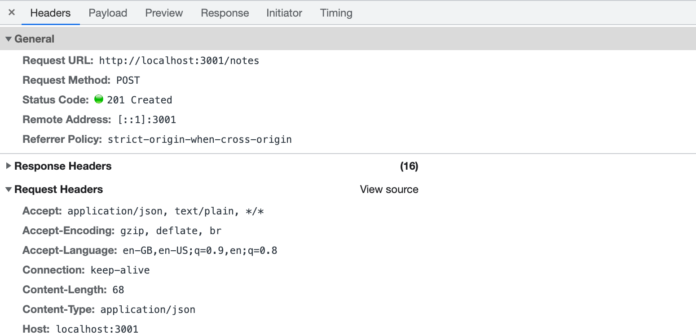
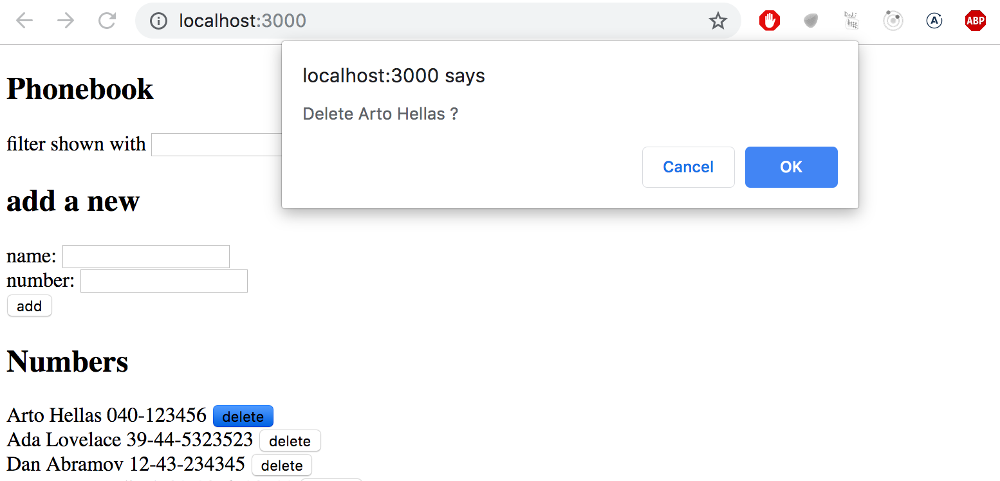
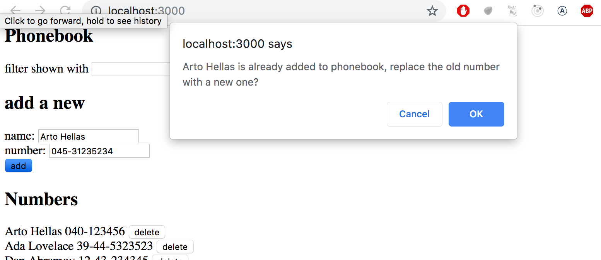

<div class="content">

عند إنشاء الملاحظات أو البيانات في تطبيقنا، نريد بطبيعة الحال حفظها بشكل دائم في خادم خلفي (Backend server). تقدم حزمة `json-server` واجهة برمجية بنمط **RESTful API**.

سنتعمق في معايير REST في [الجزء 3](/ar/part3)، ولكن من المهم هنا استيعاب المفاهيم والاتفاقيات الأساسية لـ REST وطلبات HTTP.

### مفهوم REST والموارد (Resources)

في معمارية REST، تُسمى كائنات البيانات الفردية (مثل كل ملاحظة) **موارداً ([Resources](https://en.wikipedia.org/wiki/Representational_state_transfer))**. يمتلك كل مورد عنوان URL فريداً خاصاً به:
- المسار `notes/3`: يمثل المورد الفردي للملاحظة التي تحمل المعرف `id: 3`.
- المسار `notes`: يمثل مجموعة الموارد (Resource collection) لكافة الملاحظات.

| العملية المطلوبة | نوع طلب HTTP | المسار (URL) | الوصف |
| :--- | :--- | :--- | :--- |
| **جلب كافة الموارد** | `GET` | `/notes` | استرجاع قائمة بجميع الملاحظات |
| **جلب مورد فردي** | `GET` | `/notes/3` | استرجاع الملاحظة رقم 3 |
| **إنشاء مورد جديد** | `POST` | `/notes` | إنشاء ملاحظة جديدة ترسل بياناتها في جسم الطلب (Body) |
| **استبدال مورد وتحديثه بالكامل** | `PUT` | `/notes/3` | تحديث الملاحظة 3 بالكامل بالبيانات الجديدة |
| **تعديل جزئي لمورد** | `PATCH` | `/notes/3` | تعديل خاصية معينة في الملاحظة 3 |
| **حذف مورد** | `DELETE` | `/notes/3` | حذف الملاحظة رقم 3 من الخادم |

---

### إرسال البيانات إلى الخادم (Sending Data to the Server)

لنعدل دالة إضافة الملاحظة لإرسالها للخادم عبر طلب `axios.post`:

```js
const addNote = event => {
  event.preventDefault()
  const noteObject = {
    content: newNote,
    important: Math.random() < 0.5,
  }

  axios
    .post('http://localhost:3001/notes', noteObject)
    .then(response => {
      setNotes(notes.concat(response.data))
      setNewNote('')
    })
}
```

نُنشئ كائن الملاحظة بدون خاصية `id`؛ لأن خوادم الـ REST تتولى تلقائياً توليد المعرفات الفريدة للموارد الجديدة وإرجاع الكائن كاملاً مع الـ `id` الجديد داخل `response.data`.



---

### تغيير أهمية الملاحظة وتحديث الخادم (Changing the Importance of Notes)

لنضف زراً لكل ملاحظة لتبديل حالة الأهمية (`important`):

```js
const toggleImportanceOf = id => {
  const url = `http://localhost:3001/notes/${id}`
  const note = notes.find(n => n.id === id)
  const changedNote = { ...note, important: !note.important }

  axios.put(url, changedNote).then(response => {
    setNotes(notes.map(note => note.id === id ? response.data : note))
  })
}
```

خطوات تنفيذ الدالة:
1. تحديد مسار المورد الفردي `url` باستخدام النصوص القالبية (Template literals).
2. العثور على الملاحظة عبر `notes.find(n => n.id === id)`.
3. إنشاء كائن جديد بنسخ خصائص الملاحظة وعكس قيمة `important` عبر معامل النشر `{ ...note, important: !note.important }` دون تعديل كائن الحالة الأصلي مباشرة.
4. إرسال طلب `axios.put(url, changedNote)`.
5. تحديث مصفوفة الملاحظات في الحالة باستبدال الملاحظة القديمة بالنسخة المحدثة المستلمة من الخادم عبر `notes.map()`.

---

### فصل خدمات الاتصال بالخادم في وحدة برمجية مستقلة (Extracting Backend Services)

التزاماً بمبدأ **المسؤولية الواحدة ([Single Responsibility Principle](https://en.wikipedia.org/wiki/Single_responsibility_principle))**، نفصل كافة اتصالات الشبكة في وحدة مستقلة داخل المجلد `src/services/notes.js`:

```js
import axios from 'axios'
const baseUrl = 'http://localhost:3001/notes'

const getAll = () => {
  const request = axios.get(baseUrl)
  return request.then(response => response.data)
}

const create = newObject => {
  const request = axios.post(baseUrl, newObject)
  return request.then(response => response.data)
}

const update = (id, newObject) => {
  const request = axios.put(`${baseUrl}/${id}`, newObject)
  return request.then(response => response.data)
}

export default { getAll, create, update }
```

ثم نستورد هذه الخدمة في المكون الرئيسي `App.jsx`:

```js
import noteService from './services/notes'

const App = () => {
  // ...
  useEffect(() => {
    noteService
      .getAll()
      .then(initialNotes => {
        setNotes(initialNotes)
      })
  }, [])

  const toggleImportanceOf = id => {
    const note = notes.find(n => n.id === id)
    const changedNote = { ...note, important: !note.important }

    noteService
      .update(id, changedNote)
      .then(returnedNote => {
        setNotes(notes.map(note => note.id === id ? returnedNote : note))
      })
      .catch(error => {
        alert(`the note '${note.content}' was already deleted from server`)
        setNotes(notes.filter(n => n.id !== id))
      })
  }
  // ...
}
```

---

### معالجة الأخطاء والوعود المرفوضة عبر `catch`

عند فشل طلب HTTP (مثل محاولة تعديل مورد تم حذفه من الخادم مما ينتج رمز الحالة **404 Not Found**)، يتحول الوعد إلى حالة **الرفض (Rejected)**.

تتم معالجة الوعود المرفوضة بإضافة دالة **`.catch()`** في نهاية سلسلة الوعد (Promise Chain)، حيث نقوم بتنبيه المستخدم وتحديث حالة التطبيق بحذف العنصر غير الموجود عبر `notes.filter(n => n.id !== id)`.

---

### قسم مبرمج الويب الشامل (Full Stack Developer's Oath)

- سأبقي وحدة تحكم المتصفح (Console) مفتوحة طوال الوقت.
- سأستخدم تبويب الشبكة (Network Tab) للتأكد من تدفق الاتصال بين الواجهة والخادم بالترويسات والبيانات المتوقعة.
- سأراقب حالة الخادم وملف البيانات للتحقق من حفظ التعديلات بدقة.
- سأتقدم بخطوات صغيرة وأستخدم `console.log` باستمرار.

</div>

<div class="tasks">

<h3>التمارين 2.12 - 2.15</h3>

<h4>2.12: دليل الهاتف - الخطوة 7 (The Phonebook step 7)</h4>
احفظ جهات الاتصال الجديدة المضافة إلى الخادم الخلفي بصورة دائمة عبر طلب `HTTP POST` إلى المسار `http://localhost:3001/persons`.

<h4>2.13: دليل الهاتف - الخطوة 8 (The Phonebook step 8)</h4>
افصل كود الاتصال بالخادم في وحدة برمجية مستقلة داخل ملف `src/services/persons.js` واستوردها في `App.jsx`.

<h4>2.14: دليل الهاتف - الخطوة 9 (The Phonebook step 9)</h4>
أضف زراً لحذف جهة الاتصال بجانب كل شخص. اطلب تأكيد المستخدم عبر `window.confirm()` قبل الحذف، ثم أرسل طلب `HTTP DELETE` إلى المسار `http://localhost:3001/persons/{id}` وحدّث حالة التطبيق بإزالة الشخص المحذوف.



<h4>2.15*: دليل الهاتف - الخطوة 10 (The Phonebook step 10)</h4>
إذا قام المستخدم بإدخال اسم موجود مسبقاً في الدليل ولكن برقم هاتف جديد، فاطلب تأكيده لاستبدال الرقم القديم بالرقم الجديد، ونفذ عملية التحديث عبر طلب `HTTP PUT` إلى المسار `http://localhost:3001/persons/{id}`.



</div>
