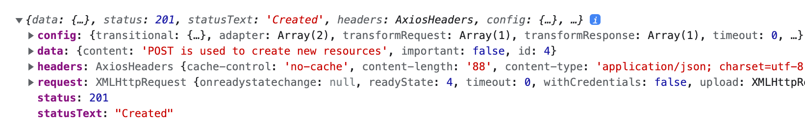
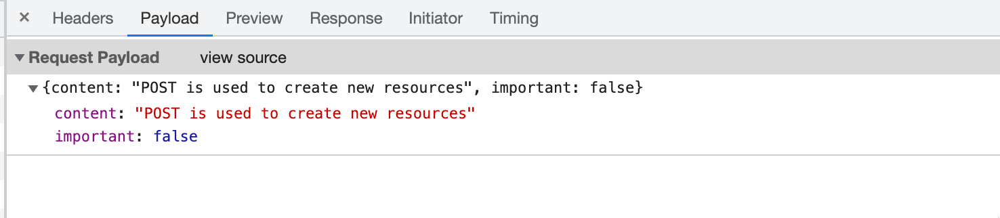
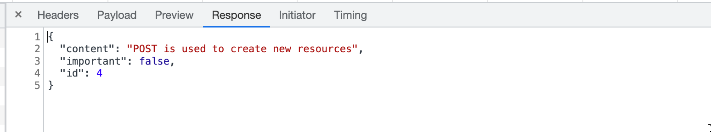
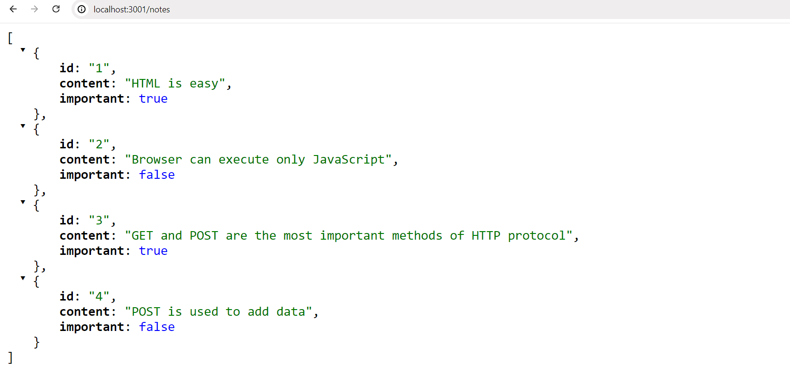
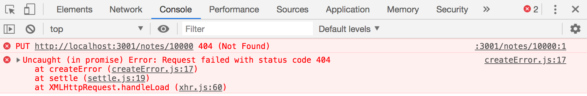

<div class="content">

عند إنشاء الملاحظات في تطبيقنا، نرغب بطبيعة الحال في تخزينها في خادم خلفي دائم. تدعي حزمة [json-server](https://github.com/typicode/json-server) في توثيقها أنها توفر ما يُعرف بـ REST أو RESTful API:

> <i>احصل على واجهة برمجة تطبيقات وهمية وكاملة بنمط REST بدون كتابة أي كود في أقل من 30 ثانية (بكل جدية)</i>

لا يتطابق json-server تماماً مع الوصف الأكاديمي الدقيق لـ [تعريف](https://en.wikipedia.org/wiki/Representational_state_transfer) واجهة برمجة تطبيقات REST، ولكن لا تتطابق أيضاً معظم واجهات برمجة التطبيقات الأخرى التي تدعي أنها تتبع نمط RESTful.

سنلقي نظرة فاحصة على REST في [الجزء التالي](/ar/part3) من الدورة. ولكن من المهم في هذه المرحلة التعرف على بعض [الأعراف والمعايير](https://en.wikipedia.org/wiki/REST#Applied_to_web_services) المستخدمة بواسطة json-server وواجهات برمجة تطبيقات REST بشكل عام. وبشكل خاص، سنلقي نظرة على الاستخدام المعتاد لـ [المسارات (Routes)](https://github.com/typicode/json-server#routes)، أي عناوين URL وأنواع طلبات HTTP، في نمط REST.

### نمط REST

في مصطلحات REST، نشير إلى كائنات البيانات الفردية، مثل الملاحظات في تطبيقنا، كـ <i>موارد (Resources)</i>. ولكل مورد عنوان فريد مرتبط به - وهو عنوان URL الخاص به. وفقاً للعرف العام المستخدم في json-server، سنتمكن من تحديد موقع ملاحظة فردية على عنوان URL للمورد <i>notes/3</i>، حيث 3 هو المعرف الفريد (id) للمورد. ومن ناحية أخرى، يشير عنوان URL الأساسي <i>notes</i> إلى مجموعة الموارد (Collection) التي تحتوي على جميع الملاحظات.

يتم جلب الموارد من الخادم باستخدام طلبات HTTP GET. على سبيل المثال، فإن طلب HTTP GET إلى عنوان URL <i>notes/3</i> سيرجع الملاحظة التي تحمل المعرف رقم 3. بينما طلب HTTP GET إلى عنوان URL <i>notes</i> سيرجع قائمة بجميع الملاحظات.

يتم إنشاء مورد جديد لتخزين ملاحظة عن طريق إرسال طلب HTTP POST إلى عنوان URL <i>notes</i> وفقاً لعرف REST الذي يلتزم به json-server. ويتم إرسال بيانات مورد الملاحظة الجديدة في <i>جسم الطلب (Body)</i>.

يتطلب json-server إرسال جميع البيانات بتنسيق JSON. وما يعنيه هذا من الناحية العملية هو أن البيانات يجب أن تكون سلسلة نصية منسقة بشكل صحيح وأن يحتوي الطلب على ترويسة الطلب <i>Content-Type</i> بقيمة <i>application/json</i>.

### إرسال البيانات إلى الخادم (Sending Data to the Server)

دعونا نجري التغييرات التالية على معالج الحدث المسؤول عن إنشاء ملاحظة جديدة:

```js
const addNote = event => {
  event.preventDefault()
  const noteObject = {
    content: newNote,
    important: Math.random() < 0.5,
  }

// highlight-start
  axios
    .post('http://localhost:3001/notes', noteObject)
    .then(response => {
      console.log(response)
    })
// highlight-end
}
```

ننشئ كائناً جديداً للملاحظة ولكننا نتجاهل خاصية <i>id</i> نظراً لأنه من الأفضل ترك الخادم يولد المعرفات (ids) لمواردنا تلقائياً.

يتم إرسال الكائن إلى الخادم باستخدام دالة <em>post</em> الخاصة بـ axios. ويسجل معالج الأحداث المسجل الاستجابة التي يتم إرسالها مرة أخرى من الخادم في منصة التحكم.

عندما نحاول إنشاء ملاحظة جديدة، تظهر المخرجات التالية في منصة التحكم:



يتم تخزين مورد الملاحظة المنشأ حديثاً في قيمة الخاصية <i>data</i> لكائن _response_.

في كثير من الأحيان، يكون من المفيد جداً فحص طلبات HTTP في علامة التبويب <i>Network</i> في أدوات مطوري Chrome، والتي تم استخدامها بشكل مكثف في بداية [الجزء 0](/ar/part0/fundamentals_of_web_apps#http-get).

يمكننا استخدام أداة الفحص للتأكد من أن الترويسات المرسلة في طلب POST مطابقة لما توقعناه:


نظراً لأن البيانات التي أرسلناها في طلب POST كانت عبارة عن كائن JavaScript، فقد عرفت axios تلقائياً كيفية ضبط القيمة المناسبة <i>application/json</i> لترويسة <i>Content-Type</i>.

يمكن استخدام علامة التبويب <i>payload</i> للتحقق من بيانات الطلب المرسلة:



علامة التبويب <i>response</i> مفيدة أيضاً، حيث توضح البيانات التي رد بها الخادم بالتفصيل:



لم يتم تصيير الملاحظة الجديدة على الشاشة بعد، وذلك لأننا لم نقم بتحديث حالة المكوّن <i>App</i> عند إنشائها. دعونا نصلح هذا:

```js
const addNote = event => {
  event.preventDefault()
  const noteObject = {
    content: newNote,
    important: Math.random() > 0.5,
  }

  axios
    .post('http://localhost:3001/notes', noteObject)
    .then(response => {
      // highlight-start
      setNotes(notes.concat(response.data))
      setNewNote('')
      // highlight-end
    })
}
```

تتم إضافة الملاحظة الجديدة التي أرجعها الخادم الخلفي إلى قائمة الملاحظات في حالة تطبيقنا بالطريقة المعتادة باستخدام دالة <em>setNotes</em> ثم إعادة تعيين وتفريغ نموذج إنشاء الملاحظة. وتذكر دائماً [التفصيل الهام](/ar/part1/a_more_complex_state_debugging_react_apps#handling-arrays) وهو أن دالة <em>concat</em> لا تغير الحالة الأصلية للمكوّن، بل تُنشئ نسخة جديدة من القائمة مع العنصر المضاف.

بمجرد أن تبدأ البيانات المرجعة من الخادم في التأثير على سلوك تطبيقات الويب الخاصة بنا، فإننا نواجه على الفور مجموعة جديدة كاملة من التحديات الناشئة، على سبيل المثال، عن عدم تزامن الاتصال (Asynchronicity). وهذا يستدعي استراتيجيات تصحيح أخطاء جديدة، حيث تزداد أهمية تسجيل المخرجات في منصة التحكم ووسائل تصحيح الأخطاء الأخرى. ويجب علينا أيضاً تطوير فهم كافٍ لمبادئ كل من بيئة تشغيل JavaScript ومكونات React؛ فلن يكون التخمين كافياً على الإطلاق.

من المفيد جداً فحص حالة الخادم الخلفي، على سبيل المثال من خلال المتصفح:



يتيح هذا التحقق من أن جميع البيانات التي أردنا إرسالها قد تم استلامها وحفظها بالفعل بواسطة الخادم.

في الجزء التالي من الدورة، سنتعلم كيفية تنفيذ منطقنا البرمجي الخاص في الواجهة الخلفية. وسنلقي بعد ذلك نظرة فاحصة على أدوات مثل [Postman](https://www.postman.com/downloads/) التي تساعدنا في تصحيح أخطاء تطبيقات الخادم الخاصة بنا. ومع ذلك، فإن فحص حالة json-server من خلال المتصفح كافٍ لاحتياجاتنا الحالية.

يمكن العثور على الكود الخاص بالحالة الحالية لتطبيقنا في الفرع <i>part2-5</i> على [GitHub](https://github.com/fullstack-hy2020/part2-notes-frontend/tree/part2-5).

### تغيير أهمية الملاحظات (Changing the Importance of Notes)

دعونا نضيف زراً لكل ملاحظة يمكن استخدامه لتبديل وتغيير مدى أهميتها.

نجري التغييرات التالية على المكوّن <i>Note</i>:

```js
const Note = ({ note, toggleImportance }) => {
  const label = note.important
    ? 'make not important' : 'make important'

  return (
    <li>
      {note.content} 
      <button onClick={toggleImportance}>{label}</button>
    </li>
  )
}
```

نضيف زراً إلى المكوّن ونعين معالج الحدث الخاص به ليكون الدالة <em>toggleImportance</em> الممررة في خصائص (props) المكوّن.

يُعرّف المكوّن <i>App</i> نسخة أولية من دالة معالج الأحداث <em>toggleImportanceOf</em> ويمررها إلى كل مكوّن <i>Note</i>:

```js
const App = () => {
  const [notes, setNotes] = useState([]) 
  const [newNote, setNewNote] = useState('')
  const [showAll, setShowAll] = useState(true)

  // ...

  // highlight-start
  const toggleImportanceOf = (id) => {
    console.log('importance of ' + id + ' needs to be toggled')
  }
  // highlight-end

  // ...

  return (
    <div>
      <h1>Notes</h1>
      <div>
        <button onClick={() => setShowAll(!showAll)}>
          show {showAll ? 'important' : 'all' }
        </button>
      </div>      
      <ul>
        {notesToShow.map(note => 
          <Note
            key={note.id}
            note={note} 
            toggleImportance={() => toggleImportanceOf(note.id)} // highlight-line
          />
        )}
      </ul>
      // ...
    </div>
  )
}
```

لاحظ كيف تستقبل كل ملاحظة دالة معالج أحداث <i>فريدة</i> خاصة بها نظراً لأن <i>id</i> كل ملاحظة فريد ومستقل.

على سبيل المثال، إذا كان <i>note.id</i> هو 3، فستكون دالة معالج الحدث التي تُرجعها _toggleImportance(note.id)_ هي:

```js
() => { console.log('importance of 3 needs to be toggled') }
```

تذكير سريع هنا: السلسلة النصية المطبوعة بواسطة معالج الحدث تم تعريفها بأسلوب Java عن طريق دمج السلاسل النصية:

```js
console.log('importance of ' + id + ' needs to be toggled')
```

يمكن استخدام صيغة [السلاسل القالبية (Template Strings)](https://developer.mozilla.org/en-US/docs/Web/JavaScript/Reference/Template_literals) المضافة في ES6 لكتابة سلاسل مماثلة بطريقة أكثر أناقة وفصاحة:

```js
console.log(`importance of ${id} needs to be toggled`)
```

يمكننا الآن استخدام صيغة `${}` لإضافة أجزاء إلى السلسلة تقوم بتقييم تعبيرات JavaScript، مثل قيمة متغير. وتذكر أننا نستخدم علامات الباك تيك (Backticks) في السلاسل القالبية بدلاً من علامات الاقتباس المستخدمة في سلاسل JavaScript العادية.

يمكن تعديل الملاحظات الفردية المخزنة في خادم json-server الخلفي بطريقتين مختلفتين عن طريق إرسال طلبات HTTP إلى عنوان URL الفريد للملاحظة: يمكننا إما <i>استبدال</i> الملاحظة بأكملها بطلب HTTP PUT أو تغيير بعض خصائص الملاحظة فقط بطلب HTTP PATCH.

الشكل النهائي لدالة معالج الحدث هو كما يلي:

```js
const toggleImportanceOf = id => {
  const url = `http://localhost:3001/notes/${id}`
  const note = notes.find(n => n.id === id)
  const changedNote = { ...note, important: !note.important }

  axios.put(url, changedNote).then(response => {
    setNotes(notes.map(note => note.id === id ? response.data : note))
  })
}
```

يحتوي كل سطر كود في جسم الدالة تقريباً على تفاصيل بالغة الأهمية:
السطر الأول يُعرّف عنوان URL الفريد لمورد الملاحظة بناءً على معرفها id.

تُستخدم دالة المصفوفات [find](https://developer.mozilla.org/en-US/docs/Web/JavaScript/Reference/Global_Objects/Array/find) للعثور على الملاحظة التي نريد تعديلها، ثم نسندها إلى المتغير _note_.

بعد ذلك، ننشئ <i>كائناً جديداً</i> يمثل نسخة مطابقة تماماً للملاحظة القديمة، باستثناء خاصية important التي تم عكس قيمتها (من true إلى false أو من false إلى true).

قد يبدو الكود الخاص بإنشاء الكائن الجديد باستخدام صيغة [نشر الكائنات (Object Spread)](https://developer.mozilla.org/en-US/docs/Web/JavaScript/Reference/Operators/Spread_syntax) غريباً بعض الشيء في البداية:

```js
const changedNote = { ...note, important: !note.important }
```

من الناحية العملية، يُنشئ <em>{ ...note }</em> كائناً جديداً بنسخ من جميع خصائص كائن _note_. وعندما نضيف خصائص داخل الأقواس المعقوفة بعد كائن النشر، مثل <em>{ ...note, important: true }</em>، فستكون قيمة الخاصية _important_ للكائن الجديد هي _true_. وفي مثالنا، تحصل الخاصية <em>important</em> على نفي قيمتها السابقة في الكائن الأصلي.

هناك بعض النقاط التي يجب توضيحها: لماذا أنشأنا نسخة من كائن الملاحظة الذي أردنا تعديله بينما يبدو الكود التالي أنه يعمل أيضاً؟

```js
const note = notes.find(n => n.id === id)
note.important = !note.important

axios.put(url, note).then(response => {
  // ...
```

هذا الأسلوب غير موصى به ومحظور لأن المتغير <em>note</em> هو مرجع لعنصر في مصفوفة <em>notes</em> في حالة المكوّن، وكما نتذكر يجب [ألا نعدل الحالة مباشرة أبداً](https://react.dev/learn/updating-objects-in-state#why-is-mutating-state-not-recommended-in-react) في React.

من الجدير بالذكر أيضاً أن الكائن الجديد _changedNote_ هو مجرد [نسخة سطحية (Shallow copy)](https://en.wikipedia.org/wiki/Object_copying#Shallow_copy)، مما يعني أن قيم الكائن الجديد هي نفس قيم الكائن القديم. وإذا كانت قيم الكائن القديم كائنات في حد ذاتها، فإن القيم المنسوخة في الكائن الجديد ستشير إلى نفس الكائنات التي كانت موجودة في الكائن القديم.

ثم يتم إرسال الملاحظة الجديدة بطلب PUT إلى الخادم الخلفي حيث ستحل محل الكائن القديم.

تقوم دالة رد النداء بضبط حالة <em>notes</em> للمكوّن على مصفوفة جديدة تحتوي على جميع العناصر من مصفوفة <em>notes</em> السابقة، باستثناء الملاحظة القديمة التي يتم استبدالها بالنسخة المحدثة منها التي أرجعها الخادم:

```js
axios.put(url, changedNote).then(response => {
  setNotes(notes.map(note => note.id === id ? response.data : note))
})
```

يتم إنجاز ذلك باستخدام دالة <em>map</em>:

```js
notes.map(note => note.id === id ? response.data : note)
```

تُنشئ دالة map مصفوفة جديدة عن طريق مطابقة وتحويل كل عنصر من المصفوفة القديمة إلى عنصر في المصفوفة الجديدة. في مثالنا، يتم إنشاء المصفوفة الجديدة شرطياً بحيث إذا كان <em>note.id === id</em> صحيحاً، تتم إضافة كائن الملاحظة الذي أرجعه الخادم إلى المصفوفة. وإذا كان الشرط خاطئاً، فإننا نقوم ببساطة بنسخ العنصر كما هو من المصفوفة القديمة إلى المصفوفة الجديدة بدلاً من ذلك.

قد تبدو حيلة <em>map</em> هذه غريبة بعض الشيء في البداية، لكن الأمر يستحق قضاء بعض الوقت في استيعابها وإتقانها؛ حيث سنستخدم هذه الطريقة عدة مرات طوال الدورة.

### فصل الاتصال بالخادم الخلفي في وحدة برمجية مستقلة (Extracting Communication with the Backend into a Separate Module)

أصبح المكوّن <i>App</i> كبيراً ومحملاً بشكل زائد بعد إضافة كود الاتصال بالخادم الخلفي. وتطبيقاً لـ [مبدأ المسؤولية الواحدة (Single Responsibility Principle)](https://en.wikipedia.org/wiki/Single_responsibility_principle)، نرى أنه من الحكمة فصل واستخراج هذا الاتصال في [وحدة مستقلة (Module)](/ar/part2/rendering_a_collection_modules#refactoring-modules) خاصة به.

دعونا ننشئ مجلداً باسم <i>src/services</i> ونضف ملفاً هناك يسمى <i>notes.js</i>:

```js
import axios from 'axios'
const baseUrl = 'http://localhost:3001/notes'

const getAll = () => {
  return axios.get(baseUrl)
}

const create = newObject => {
  return axios.post(baseUrl, newObject)
}

const update = (id, newObject) => {
  return axios.put(`${baseUrl}/${id}`, newObject)
}

export default { 
  getAll: getAll, 
  create: create, 
  update: update 
}
```

تُرجع الوحدة كائناً يحتوي على ثلاث دوال (<i>getAll</i> و <i>create</i> و <i>update</i>) كخصائص له للتعامل مع الملاحظات. وتُرجع الدوال مباشرة الوعود التي تُرجعها دوال axios.

يستخدم المكوّن <i>App</i> دالة <em>import</em> للوصول إلى الوحدة:

```js
import noteService from './services/notes' // highlight-line

const App = () => {
```

يمكن استخدام دوال الوحدة مباشرة مع المتغير المستورد _noteService_ على النحو التالي:

```js
const App = () => {
  // ...

  useEffect(() => {
    // highlight-start
    noteService
      .getAll()
      .then(response => {
        setNotes(response.data)
      })
    // highlight-end
  }, [])

  const toggleImportanceOf = id => {
    const note = notes.find(n => n.id === id)
    const changedNote = { ...note, important: !note.important }

    // highlight-start
    noteService
      .update(id, changedNote)
      .then(response => {
        setNotes(notes.map(note => note.id === id ? response.data : note))
      })
    // highlight-end
  }

  const addNote = (event) => {
    event.preventDefault()
    const noteObject = {
      content: newNote,
      important: Math.random() > 0.5
    }

// highlight-start
    noteService
      .create(noteObject)
      .then(response => {
        setNotes(notes.concat(response.data))
        setNewNote('')
      })
// highlight-end
  }

  // ...
}

export default App
```

يمكننا أخذ تنفيذنا خطوة إلى الأمام. فعندما يستخدم المكوّن <i>App</i> الدوال، فإنه يستقبل كائناً يحتوي على الاستجابة الكاملة لطلب HTTP:

```js
noteService
  .getAll()
  .then(response => {
    setNotes(response.data)
  })
```

المكوّن <i>App</i> يستخدم فقط الخاصية <i>response.data</i> من كائن الاستجابة.

ستكون الوحدة النمطية أكثر راحة وأناقة في الاستخدام إذا حصلنا على بيانات الاستجابة مباشرة بدلاً من استجابة HTTP بأكملها. وسيبدو استخدام الوحدة بعد ذلك كما يلي:

```js
noteService
  .getAll()
  .then(initialNotes => {
    setNotes(initialNotes)
  })
```

يمكننا تحقيق ذلك عن طريق تغيير الكود في الوحدة على النحو التالي (يحتوي الكود الحالي على بعض التكرار، لكننا سنتحمل ذلك في الوقت الحالي):

```js
import axios from 'axios'
const baseUrl = 'http://localhost:3001/notes'

const getAll = () => {
  const request = axios.get(baseUrl)
  return request.then(response => response.data)
}

const create = newObject => {
  const request = axios.post(baseUrl, newObject)
  return request.then(response => response.data)
}

const update = (id, newObject) => {
  const request = axios.put(`${baseUrl}/${id}`, newObject)
  return request.then(response => response.data)
}

export default { 
  getAll: getAll, 
  create: create, 
  update: update 
}
```

لم نعد نرجع الوعد الذي يرجعه axios مباشرة. بدلاً من ذلك، نسند الوعد إلى المتغير <em>request</em> ونستدعي دالة <em>then</em> الخاصة به:

```js
const getAll = () => {
  const request = axios.get(baseUrl)
  return request.then(response => response.data)
}
```

السطر الأخير في دالتنا هو ببساطة تعبير أكثر إيجازاً لنفس الكود الموضح أدناه:

```js
const getAll = () => {
  const request = axios.get(baseUrl)
  // highlight-start
  return request.then(response => {
    return response.data
  })
  // highlight-end
}
```

لا تزال دالة <em>getAll</em> المعدلة تُرجع وعداً، نظراً لأن دالة <em>then</em> الخاصة بالوعد [تُرجع وعداً أيضاً (Returns a promise)](https://developer.mozilla.org/en-US/docs/Web/JavaScript/Reference/Global_Objects/Promise/then).

بعد تحديد معامل دالة <em>then</em> ليرجع مباشرة <i>response.data</i>، نكون قد جعلنا دالة <em>getAll</em> تعمل بالطريقة التي أردناها تماماً. وعندما ينجح طلب HTTP، يرجع الوعد البيانات المرسلة في الاستجابة من الخادم الخلفي.

يتعين علينا تحديث المكوّن <i>App</i> ليعمل مع التغييرات التي تم إجراؤها على وحدتنا. يجب علينا تعديل دوال رد النداء المعطاة كمعاملات لطرق كائن <em>noteService</em> بحيث تستخدم بيانات الاستجابة المرجعة مباشرة:

```js
const App = () => {
  // ...

  useEffect(() => {
    noteService
      .getAll()
      // highlight-start      
      .then(initialNotes => {
        setNotes(initialNotes)
      // highlight-end
      })
  }, [])

  const toggleImportanceOf = id => {
    const note = notes.find(n => n.id === id)
    const changedNote = { ...note, important: !note.important }

    noteService
      .update(id, changedNote)
      // highlight-start      
      .then(returnedNote => {
        setNotes(notes.map(note => note.id === id ? returnedNote : note))
      // highlight-end
      })
  }

  const addNote = (event) => {
    event.preventDefault()
    const noteObject = {
      content: newNote,
      important: Math.random() > 0.5
    }

    noteService
      .create(noteObject)
      // highlight-start      
      .then(returnedNote => {
        setNotes(notes.concat(returnedNote))
      // highlight-end
        setNewNote('')
      })
  }

  // ...
}
```

هذا كله متقدم نوعاً ما، ومحاولة شرحه قد تجعله أكثر صعوبة في الاستيعاب. والإنترنت مليء بالمواد التي تناقش هذا الموضوع بالتفصيل، مثل [هذا المقال](https://javascript.info/promise-chaining).

يوضح كتاب "Async and performance" من سلسلة كتب [You Don't Know JS](https://github.com/getify/You-Dont-Know-JS/tree/1st-ed) [هذا الموضوع بشكل ممتاز ومفصل](https://github.com/getify/You-Dont-Know-JS/blob/1st-ed/async%20%26%20performance/ch3.md).

تعتبر الوعود محورية في تطوير JavaScript الحديث ويوصى بشدة باستثمار قدر مناسب من الوقت لفهمها بعمق.

### صياغة أكثر أناقة لتعريف الكائنات الحرفية (Cleaner Syntax for Defining Object Literals)

تقوم الوحدة التي تُعرّف الخدمات المتعلقة بالملاحظات حالياً بتصدير كائن بالخصائص <i>getAll</i> و <i>create</i> و <i>update</i> التي تم تعيينها لدوال معالجة الملاحظات.

كان تعريف الوحدة كما يلي:

```js
import axios from 'axios'
const baseUrl = 'http://localhost:3001/notes'

const getAll = () => {
  const request = axios.get(baseUrl)
  return request.then(response => response.data)
}

const create = newObject => {
  const request = axios.post(baseUrl, newObject)
  return request.then(response => response.data)
}

const update = (id, newObject) => {
  const request = axios.put(`${baseUrl}/${id}`, newObject)
  return request.then(response => response.data)
}

export default { 
  getAll: getAll, 
  create: create, 
  update: update 
}
```

تُصدّر الوحدة الكائن التالي ذو المظهر المميز:

```js
{ 
  getAll: getAll, 
  create: create, 
  update: update 
}
```

المسميات الموجودة على يسار النقطتين الرأسيتين في تعريف الكائن هي *مفاتيح (Keys)* الكائن، بينما المسميات الموجودة على يمينها هي *المتغيرات (Variables)* المعرفة داخل الوحدة.

نظراً لأن أسماء المفاتيح والمتغيرات المسندة هي نفسها تماماً، فيمكننا كتابة تعريف الكائن بصيغة أكثر إيجازاً:

```js
{ 
  getAll, 
  create, 
  update 
}
```

ونتيجة لذلك، يتم تبسيط تعريف الوحدة إلى الشكل التالي:

```js
import axios from 'axios'
const baseUrl = 'http://localhost:3001/notes'

const getAll = () => {
  const request = axios.get(baseUrl)
  return request.then(response => response.data)
}

const create = newObject => {
  const request = axios.post(baseUrl, newObject)
  return request.then(response => response.data)
}

const update = (id, newObject) => {
  const request = axios.put(`${baseUrl}/${id}`, newObject)
  return request.then(response => response.data)
}

export default { getAll, create, update } // highlight-line
```

في تعريف الكائن باستخدام هذا الترميز الأقصر، نستفيد من [ميزة جديدة](https://developer.mozilla.org/en-US/docs/Web/JavaScript/Reference/Operators/Object_initializer#Property_definitions) تم إدخالها إلى JavaScript من خلال ES6، والتي تتيح طريقة أكثر إيجازاً لتعريف الكائنات باستخدام المتغيرات.

لتوضيح هذه الميزة، دعونا نفكر في موقف لدينا فيه القيم التالية المسندة إلى متغيرات:

```js
const name = 'Leevi'
const age = 0
```

في الإصدارات القديمة من JavaScript كان علينا تعريف كائن هكذا:

```js
const person = {
  name: name,
  age: age
}
```

ومع ذلك، نظراً لأن كلاً من حقول الخصائص وأسماء المتغيرات في الكائن متطابقة، فيكفي ببساطة كتابة ما يلي في JavaScript الحديثة ES6:

```js
const person = { name, age }
```

النتيجة متطابقة لكلا التعبيرين؛ حيث ينشئ كلاهما كائناً بخاصية <i>name</i> تحمل القيمة <i>Leevi</i> وخاصية <i>age</i> تحمل القيمة <i>0</i>.

### الوعود والأخطاء (Promises and Errors)

إذا كان تطبيقنا يسمح للمستخدمين بحذف الملاحظات، فقد ينتهي بنا الأمر في موقف يحاول فيه المستخدم تغيير أهمية ملاحظة تم حذفها بالفعل من النظام.

دعونا نحاكي هذا الموقف بجعل دالة <em>getAll</em> لخدمة الملاحظات تُرجع ملاحظة "ثابتة ومصطنعة" غير موجودة فعلياً على الخادم الخلفي:

```js
const getAll = () => {
  const request = axios.get(baseUrl)
  const nonExisting = {
    id: 10000,
    content: 'This note is not saved to server',
    important: true,
  }
  return request.then(response => response.data.concat(nonExisting))
}
```

عندما نحاول تغيير أهمية هذه الملاحظة المصطنعة، نرى رسالة الخطأ التالية في منصة التحكم. يفيد الخطأ بأن الخادم الخلفي استجاب لطلب HTTP PUT الخاص بنا برمز الحالة 404 <i>not found</i> (غير موجود).



يجب أن يكون التطبيق قادراً على التعامل مع هذه الأنواع من حالات الخطأ بلباقة وسلاسة. فلن يتمكن المستخدمون من معرفة حدوث خطأ ما لم تكن منصة التحكم مفتوحة لديهم بالصدفة. والطريقة الوحيدة لرؤية الخطأ في التطبيق هي أن النقر فوق الزر لا يؤثر على أهمية الملاحظة.

لقد [ذكرنا سابقاً](/ar/part2/getting_data_from_server#axios-and-promises) أن الوعد يمكن أن يكون في واحدة من ثلاث حالات مختلفة. وعندما يفشل طلب HTTP لـ axios، يكون الوعد المرتبط به <i>مرفوضاً (rejected)</i>. كودنا الحالي لا يعالج هذا الرفض بأي شكل من الأشكال.

تتم معالجة رفض الوعد [عن طريق تزويد](https://developer.mozilla.org/en-US/docs/Web/JavaScript/Guide/Using_promises) دالة <em>then</em> بدالة رد نداء ثانية، والتي يتم استدعاؤها في الموقف الذي يتم فيه رفض الوعد.

والطريقة الأكثر شيوعاً لإضافة معالج للوعود المرفوضة هي استخدام دالة [catch](https://developer.mozilla.org/en-US/docs/Web/JavaScript/Reference/Global_Objects/Promise/catch).

من الناحية العملية، يتم تعريف معالج الأخطاء للوعود المرفوضة كما يلي:

```js
axios
  .get('http://example.com/probably_will_fail')
  .then(response => {
    console.log('success!')
  })
  .catch(error => {
    console.log('fail')
  })
```

إذا فشل الطلب، يتم استدعاء معالج الأحداث المسجل بواسطة دالة <em>catch</em>.

غالباً ما تُستخدم دالة <em>catch</em> بوضعها في نهاية سلسلة الوعود.

عندما يتم ربط عدة دوال _.then_ معاً، فإننا في الواقع ننشئ [سلسلة وعود (Promise Chain)](https://javascript.info/promise-chaining):

```js
axios
  .get('http://...')
  .then(response => response.data)
  .then(data => {
    // ...
  })
```

يمكن استخدام دالة <em>catch</em> لتعريف دالة معالج في نهاية سلسلة الوعود، والتي يتم استدعاؤها بمجرد أن يرمي أي وعد في السلسلة خطأً ويصبح الوعد <i>مرفوضاً</i>:

```js
axios
  .get('http://...')
  .then(response => response.data)
  .then(data => {
    // ...
  })
  .catch(error => {
    console.log('fail')
  })
```

دعونا نستفيد من هذه الميزة. سنضع معالج الأخطاء لتطبيقنا في المكوّن <i>App</i>:

```js
const toggleImportanceOf = id => {
  const note = notes.find(n => n.id === id)
  const changedNote = { ...note, important: !note.important }

  noteService
    .update(id, changedNote).then(returnedNote => {
      setNotes(notes.map(note => note.id === id ? returnedNote : note))
    })
    // highlight-start
    .catch(error => {
      alert(
        `the note '${note.content}' was already deleted from server`
      )
      setNotes(notes.filter(n => n.id !== id))
    })
    // highlight-end
}
```

يتم عرض رسالة الخطأ للمستخدم باستخدام مربع حوار التنبيه [alert](https://developer.mozilla.org/en-US/docs/Web/API/Window/alert) التقليدي، وتتم إزالة وتصفية الملاحظة المحذوفة من حالة التطبيق.

تتم إزالة الملاحظة المحذوفة بالفعل من حالة التطبيق باستخدام دالة المصفوفات [filter](https://developer.mozilla.org/en-US/docs/Web/JavaScript/Reference/Global_Objects/Array/filter)، والتي تُرجع مصفوفة جديدة تشتمل فقط على العناصر التي تُرجع لها الدالة الممررة كمعامل القيمة true:

```js
notes.filter(n => n.id !== id)
```

من المحتمل ألا يكون استخدام alert فكرة جيدة في تطبيقات React الحقيقية والاحترافية. وسنتعلم قريباً طريقة أكثر تقدماً لعرض الرسائل والإشعارات للمستخدمين. ومع ذلك، هناك حالات يمكن أن تعمل فيها طريقة بسيطة ومجربة مثل <em>alert</em> كنقطة انطلاق ممتازة، ويمكن دائماً إضافة طريقة أكثر تقدماً لاحقاً عند توفر الوقت.

يمكن العثور على الكود الخاص بالحالة الحالية لتطبيقنا في الفرع <i>part2-6</i> على [GitHub](https://github.com/fullstack-hy2020/part2-notes-frontend/tree/part2-6).

### قَسَم مطوّر الويب المتكامل (Full stack developer's oath)

حان الوقت مرة أخرى للتمارين. يتعاظم تعقيد تطبيقنا الآن بشكل ملحوظ؛ حيث بالإضافة إلى الاهتمام بمكونات React في الواجهة الأمامية، لدينا أيضاً واجهة خلفية تقوم بحفظ بيانات التطبيق واستدامتها.

للتعامل مع هذا التعقيد المتزايد، يجب علينا تمديد قسم مطور الويب إلى <i>قَسَم مطوّر الويب المتكامل (Full Stack Developer)</i>، والذي يذكرنا بالتأكد من أن الاتصال بين الواجهة الأمامية والخلفية يسير بالشكل المتوقع:

تطوير الويب المتكامل (Full Stack Development) أمر <i>شديد الصعوبة والتعقيد</i>، ولهذا السبب سأستخدم جميع الوسائل الممكنة لجعله أسهل وأكثر سلاسة:

- سأبقي منصة تحكم المطور في متصفحي مفتوحة طوال الوقت.
- <i>سأستخدم علامة التبويب Network في أدوات مطوري المتصفح للتأكد من أن الواجهة الأمامية والخلفية تتواصلان كما أتوقع تماماً</i>.
- <i>سأراقب باستمرار حالة الخادم للتأكد من أن البيانات المرسلة من الواجهة الأمامية يتم حفظها هناك كما أتوقع</i>.
- سأتقدم بخطوات صغيرة ومحسوبة.
- سأكتب الكثير من جمل _console.log_ للتأكد من أنني أفهم كيف يتصرف الكود وللمساعدة في تحديد المشكلات بدقة.
- إذا لم يعمل الكود الخاص بي، فلن أكتب المزيد من الأكواد؛ بدلاً من ذلك، سأبدأ بحذف الأكواد حتى يعمل أو أعود إلى حالة سابقة كان كل شيء فيها يعمل بنجاح.
- عندما أطلب المساعدة في قناة الدورة على Discord أو في أي مكان آخر، سأصيغ أسئلتي بشكل صحيح ومحدد؛ انظر [هنا](/ar/part0/general_info#how-to-get-help-in-discord) لمعرفة كيفية طلب المساعدة.

</div>

<div class="tasks">

<h3>التمارين 2.12.-2.15.</h3>

<h4>2.12: دليل الهاتف، الخطوة 7 (The Phonebook step 7)</h4>

دعونا نعد إلى تطبيق دليل الهاتف الخاص بنا.

حالياً، الأرقام التي تتم إضافتها إلى دليل الهاتف لا يتم حفظها في خادم خلفي. قم بإصلاح هذا الوضع وحفظ الأرقام في الخادم.

<h4>2.13: دليل الهاتف، الخطوة 8 (The Phonebook step 8)</h4>

افصل الكود الذي يتعامل مع الاتصال بالواجهة الخلفية في وحدة برمجية مستقلة خاصة به باتباع المثال الموضح سابقاً في هذا الجزء من المادة التعليمية.

<h4>2.14: دليل الهاتف، الخطوة 9 (The Phonebook step 9)</h4>

اجعل من الممكن للمستخدمين حذف المدخلات من دليل الهاتف. يمكن إجراء الحذف من خلال زر مخصص لكل شخص في قائمة دليل الهاتف. يمكنك تأكيد الإجراء من المستخدم باستخدام دالة [window.confirm](https://developer.mozilla.org/en-US/docs/Web/API/Window/confirm):


يمكن حذف المورد المرتبط بشخص ما في الواجهة الخلفية عن طريق إرسال طلب HTTP DELETE إلى عنوان URL الخاص بالمورد. فإذا كنا نقوم بحذف شخص يحمل المعرف <i>id</i> رقم 2، على سبيل المثال، فسيتعين علينا إرسال طلب HTTP DELETE إلى عنوان URL: <i>localhost:3001/persons/2</i>. ولا يتم إرسال أي بيانات مع هذا الطلب.

يمكنك إجراء طلب HTTP DELETE باستخدام مكتبة [axios](https://github.com/axios/axios) بنفس الطريقة التي نجري بها جميع الطلبات الأخرى.

**ملاحظة هامة:** لا يمكنك استخدام الاسم <em>delete</em> كاسم لمتغير لأنه كلمة محجوزة في لغة JavaScript. على سبيل المثال، الكود التالي غير مسموح به برمجياً:

```js
// استخدم اسماً آخر للمتغير أو الدالة!
const delete = (id) => {
  // ...
}
```

<h4>2.15*: دليل الهاتف، الخطوة 10 (The Phonebook step 10)</h4>

<i>لماذا توجد علامة نجمة في التمرين؟ راجع [هنا](/ar/part0/general_info#taking-the-course) للحصول على التفسير.</i>

قم بتغيير الوظيفة بحيث إذا تمت إضافة رقم لمستخدم موجود بالفعل في الدليل، فإن الرقم الجديد يحل محل الرقم القديم. ويوصى باستخدام طريقة HTTP PUT لتحديث رقم الهاتف.

إذا كانت معلومات الشخص موجودة بالفعل في دليل الهاتف، فيمكن للتطبيق أن يطلب من المستخدم تأكيد الإجراء:


</div>
