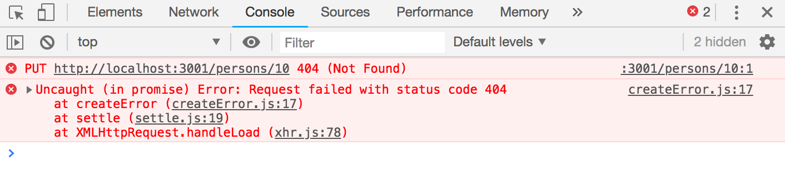
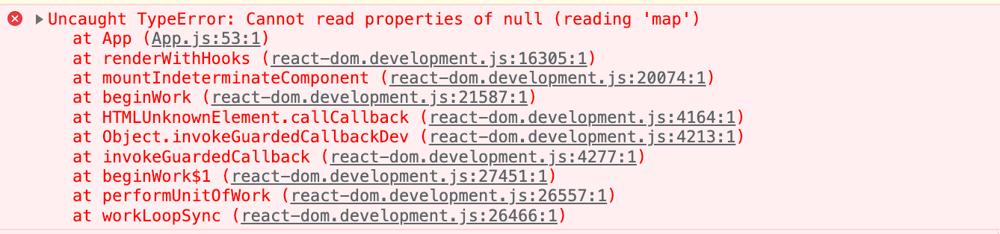
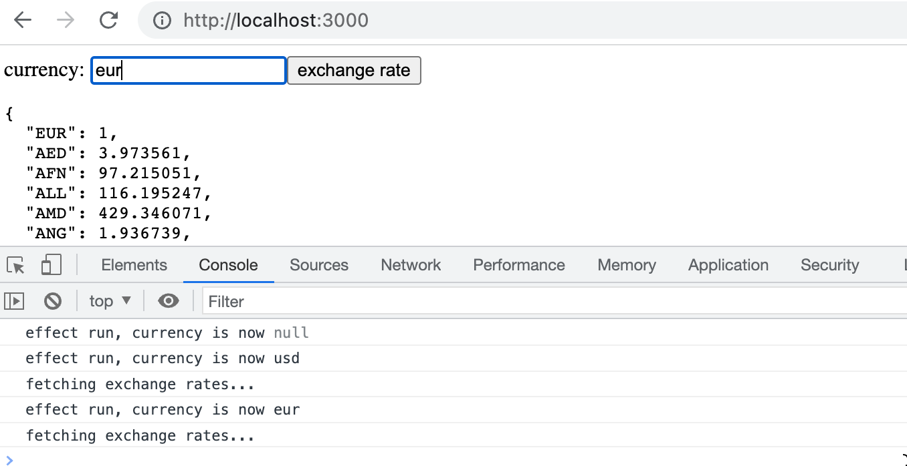
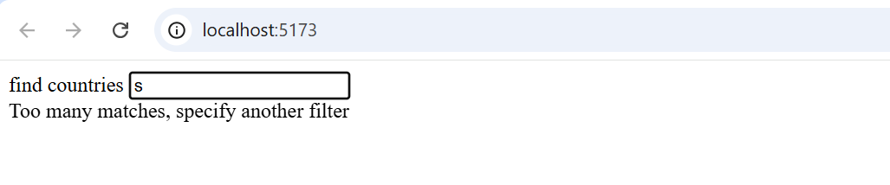
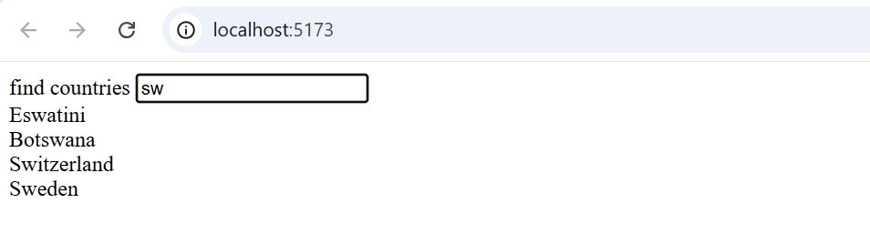

<div class="content">

يبدو المظهر الحالي لتطبيق الملاحظات متواضعاً وبسيطاً للغاية. في [التمرين 0.2](/ar/part0/fundamentals_of_web_apps#exercises-0-1-0-6)، كانت المهمة هي الاطلاع على [الدليل التعليمي لـ CSS](https://developer.mozilla.org/en-US/docs/Learn/Getting_started_with_the_web/CSS_basics) من Mozilla.

دعونا نلقي نظرة على كيفية إضافة التنسيقات والأنماط (Styles) إلى تطبيق React. هناك عدة طرق مختلفة للقيام بذلك وسنلقي نظرة على الطرق الأخرى لاحقاً. أولاً، سنضيف CSS إلى تطبيقنا بالطريقة الكلاسيكية التقليدية؛ في ملف واحد دون استخدام [معالج CSS مسبق (CSS Preprocessor)](https://developer.mozilla.org/en-US/docs/Glossary/CSS_preprocessor) (على الرغم من أن هذا ليس دقيقاً تماماً كما سنتعلم لاحقاً).

دعونا نضيف ملف <i>index.css</i> جديداً تحت مجلد <i>src</i> ثم نضمه إلى التطبيق عن طريق استيراده في ملف <i>main.jsx</i>:

```js
import './index.css'
```

دعونا نضيف قاعدة CSS التالية إلى ملف <i>index.css</i>:

```css
h1 {
  color: green;
}
```

تتكون قواعد CSS من <i>محددات (Selectors)</i> و<i>تصريحات (Declarations)</i>. يحدد المحدد العناصر التي يجب تطبيق القاعدة عليها. المحدد أعلاه هو <i>h1</i>، والذي سيتطابق مع جميع وسوم العناوين <i>h1</i> في تطبيقنا.

يضبط التصريح خاصية _color_ على القيمة <i>green</i>.

يمكن أن تحتوي قاعدة CSS واحدة على أي عدد من الخصائص. دعونا نعدل القاعدة السابقة لجعل النص مائلاً، عن طريق تحديد نمط الخط كـ <i>italic</i>:

```css
h1 {
  color: green;
  font-style: italic;  // highlight-line
}
```

هناك طرق عديدة لمطابقة العناصر باستخدام [أنواع مختلفة من محددات CSS](https://developer.mozilla.org/en-US/docs/Web/CSS/CSS_Selectors).

إذا أردنا استهداف كل واحدة من الملاحظات بأنماطنا على سبيل المثال، فيمكننا استخدام المحدد <i>li</i>، حيث إن جميع الملاحظات مغلفة داخل وسوم <i>li</i>:

```js
const Note = ({ note, toggleImportance }) => {
  const label = note.important 
    ? 'make not important' 
    : 'make important'

  return (
    <li>
      {note.content} 
      <button onClick={toggleImportance}>{label}</button>
    </li>
  )
}
```

دعونا نضيف القاعدة التالية إلى ورقة الأنماط الخاصة بنا (نظراً لأن معرفتي بالتصميم الأنيق تقترب من الصفر، فإن الأنماط قد لا تبدو منطقية جداً):

```css
li {
  color: grey;
  padding-top: 3px;
  font-size: 15px;
}
```

يُعد استخدام أنواع العناصر لتحديد قواعد CSS أمراً إشكالياً نوعاً ما؛ فإذا كان تطبيقنا يحتوي على وسوم <i>li</i> أخرى، فسيتم تطبيق نفس قاعدة النمط عليها أيضاً.

إذا أردنا تطبيق نمطنا على الملاحظات تحديداً، فمن الأفضل استخدام [محددات الأصناف والفئات (Class Selectors)](https://developer.mozilla.org/en-US/docs/Web/CSS/Class_selectors).

في HTML العادي، يتم تعريف الفئات كقيمة لسمة <i>class</i>:

```html
<li class="note">some text...</li>
```

في React، يتعين علينا استخدام سمة [className](https://react.dev/learn#adding-styles) بدلاً من سمة class. مع وضع هذا في الاعتبار، دعونا نجري التغييرات التالية على مكوّن <i>Note</i>:

```js
const Note = ({ note, toggleImportance }) => {
  const label = note.important 
    ? 'make not important' 
    : 'make important'

  return (
    <li className='note'> // highlight-line
      {note.content} 
      <button onClick={toggleImportance}>{label}</button>
    </li>
  )
}
```

يتم تعريف محددات الأصناف بصيغة النقطة _.classname_:

```css
.note {
  color: grey;
  padding-top: 5px;
  font-size: 15px;
}
```

إذا أضفت الآن عناصر <i>li</i> أخرى إلى التطبيق، فلن تتأثر بقاعدة النمط أعلاه.

### رسائل خطأ محسنة (Improved error message)

لقد قمنا سابقاً بتنفيذ رسالة الخطأ التي تم عرضها عندما حاول المستخدم تبديل أهمية ملاحظة محذوفة باستخدام دالة <em>alert</em>. دعونا ننفذ رسالة الخطأ كمكوّن React مستقل خاص بها في الملف <i>src/components/Notification.jsx</i>.

المكوّن بسيط للغاية:

```js
const Notification = ({ message }) => {
  if (message === null) {
    return null
  }

  return (
    <div className="error">
      {message}
    </div>
  )
}

export default Notification
```

إذا كانت قيمة الخاصية <em>message</em> هي <em>null</em>، فلن يتم تصيير أي شيء على الشاشة، وفي الحالات الأخرى، يتم تصيير الرسالة داخل عنصر div.

دعونا نضيف جزءاً جديداً من الحالة يسمى <i>errorMessage</i> إلى المكوّن <i>App</i>. ولنقم بتهيئته ببعض رسائل الخطأ حتى نتمكن من اختبار مكوّننا على الفور:

```js
import { useState, useEffect } from 'react'
import Note from './components/Note'
import noteService from './services/notes'
import Notification from './components/Notification' // highlight-line

const App = () => {
  const [notes, setNotes] = useState([]) 
  const [newNote, setNewNote] = useState('')
  const [showAll, setShowAll] = useState(true)
  const [errorMessage, setErrorMessage] = useState('some error happened...') // highlight-line

  // ...

  return (
    <div>
      <h1>Notes</h1>
      <Notification message={errorMessage} /> // highlight-line
      <div>
        <button onClick={() => setShowAll(!showAll)}>
          show {showAll ? 'important' : 'all' }
        </button>
      </div>      
      // ...
    </div>
  )
}
```

ثم دعونا نضيف قاعدة نمط تناسب رسالة الخطأ:

```css
.error {
  color: red;
  background: lightgrey;
  font-size: 20px;
  border-style: solid;
  border-radius: 5px;
  padding: 10px;
  margin-bottom: 10px;
}
```

الآن نحن جاهزون لإضافة المنطق البرمجي لعرض رسالة الخطأ. دعونا نغير دالة <em>toggleImportanceOf</em> بالطريقة التالية:

```js
  const toggleImportanceOf = id => {
    const note = notes.find(n => n.id === id)
    const changedNote = { ...note, important: !note.important }

    noteService
      .update(id, changedNote).then(returnedNote => {
        setNotes(notes.map(note => note.id !== id ? note : returnedNote))
      })
      .catch(error => {
        // highlight-start
        setErrorMessage(
          `Note '${note.content}' was already removed from server`
        )
        setTimeout(() => {
          setErrorMessage(null)
        }, 5000)
        // highlight-end
        setNotes(notes.filter(n => n.id !== id))
      })
  }
```

عند حدوث الخطأ، نضيف رسالة خطأ وصفية إلى حالة <em>errorMessage</em>. وفي الوقت نفسه، نبدأ مؤقتاً زمنياً يقوم بضبط حالة <em>errorMessage</em> على <em>null</em> بعد خمس ثوانٍ.

تبدو النتيجة كما يلي:


يمكن العثور على الكود الخاص بالحالة الحالية لتطبيقنا في الفرع <i>part2-7</i> على [GitHub](https://github.com/fullstack-hy2020/part2-notes-frontend/tree/part2-7).

### التنسيقات المضمنة (Inline styles)

تتيح React أيضاً إمكانية كتابة التنسيقات مباشرة في الكود كـ [تنسيقات مضمنة (Inline Styles)](https://react-cn.github.io/react/tips/inline-styles.html).

الفكرة الكامنة وراء تعريف التنسيقات المضمنة بسيطة للغاية: يمكن تزويد أي مكوّن أو عنصر React بمجموعة من خصائص CSS ككائن JavaScript من خلال السمة [style](https://react.dev/reference/react-dom/components/common#applying-css-styles).

يتم تعريف قواعد CSS بشكل مختلف قليلاً في JavaScript مقارنة بملفات CSS العادية. لنفترض أننا أردنا إعطاء عنصر ما اللون الأخضر وخطاً مائلاً. في CSS، سيبدو الأمر هكذا:

```css
{
  color: green;
  font-style: italic;
}
```

ولكن ككائن تنسيق مضمن في React سيبدو هكذا:

```js
{
  color: 'green',
  fontStyle: 'italic'
}
```

يتم تعريف كل خاصية CSS كخاصية منفصلة لكائن JavaScript. ويمكن ببساطة تعريف القيم الرقمية للبكسل كأعداد صحيحة. وأحد الاختلافات الرئيسية مقارنة بـ CSS العادي هو أن خصائص CSS التي تحتوي على شرطات (kebab-case) تُكتب بأسلوب سنام الجمل (camelCase).

دعونا نضيف مكوّن تذييل الصفحة، <i>Footer</i>، إلى تطبيقنا ونحدد أنماطاً مضمنة له. يتم تعريف المكوّن في الملف _components/Footer.jsx_ واستخدامه في الملف _App.jsx_ كما يلي:

```js
const Footer = () => {
  const footerStyle = {
    color: 'green',
    fontStyle: 'italic'
  }

  return (
    <div style={footerStyle}>
      <br />
      <p>
        Note app, Department of Computer Science, University of Helsinki 2025
      </p>
    </div>
  )
}

export default Footer
```

```js
import { useState, useEffect } from 'react'
import Footer from './components/Footer' // highlight-line
import Note from './components/Note'
import Notification from './components/Notification'
import noteService from './services/notes'

const App = () => {
  // ...

  return (
    <div>
      <h1>Notes</h1>

      <Notification message={errorMessage} />

      // ...  

      <Footer /> // highlight-line
    </div>
  )
}
```

تأتي التنسيقات المضمنة مع بعض القيود؛ على سبيل المثال، لا يمكن استخدام ما يُعرف بـ [الأصناف الزائفة (Pseudo-classes)](https://developer.mozilla.org/en-US/docs/Web/CSS/Pseudo-classes) مثل `:hover` بشكل مباشر.

تتعارض التنسيقات المضمنة وبعض الطرق الأخرى لإضافة الأنماط إلى مكونات React تماماً مع الأعراف القديمة. تقليدياً، كان يُعتبر من أفضل الممارسات فصل CSS تماماً عن المحتوى (HTML) والوظائف البرمجية (JavaScript). ووفقاً لهذه المدرسة الفكرية القديمة، كان الهدف هو كتابة CSS و HTML و JavaScript في ملفات منفصلة تماماً.

في الواقع، فإن فلسفة React هي النقيض التام لذلك. نظراً لأن فصل CSS و HTML و JavaScript في ملفات منفصلة لم يكن يتوسع بشكل جيد في التطبيقات الكبيرة، فإن React تبني تقسيم التطبيق على أساس كياناته الوظيفية والمنطقية.

الوحدات الهيكلية التي تشكل الكيانات الوظيفية للتطبيق هي مكونات React. يُعرّف مكوّن React لغة HTML لهيكلة المحتوى، ودوال JavaScript لتحديد الوظائف، وتنسيقات المكوّن أيضاً؛ كل ذلك في مكان واحد متكامل. وذلك لإنشاء مكونات فردية مستقلة وقابلة لإعادة الاستخدام بأقصى قدر ممكن.

يمكن العثور على كود النسخة النهائية لتطبيقنا في الفرع <i>part2-8</i> على [GitHub](https://github.com/fullstack-hy2020/part2-notes-frontend/tree/part2-8).

</div>

<div class="tasks">

<h3>التمارين 2.16.-2.17.</h3>

<h4>2.16: دليل الهاتف، الخطوة 11 (Phonebook step 11)</h4>

استخدم مثال [رسائل الخطأ المحسنة](/ar/part2/adding_styles_to_react_app#improved-error-message) من الجزء 2 كدليل لعرض إشعار يستمر لبضع ثوانٍ بعد تنفيذ عملية ناجحة (إضافة شخص أو تغيير رقم هاتف):


<h4>2.17*: دليل الهاتف، الخطوة 12 (Phonebook step 12)</h4>

افتح تطبيقك في متصفحين. **إذا قمت بحذف شخص في المتصفح 1** قبل وقت قصير من محاولة <i>تغيير رقم هاتف نفس الشخص</i> في المتصفح 2، فستحصل على رسائل الخطأ التالية:



أصلح المشكلة وفقاً للمثال الموضح في [الوعود والأخطاء](/ar/part2/altering_data_in_server#promises-and-errors) في الجزء 2. وقم بتعديل المثال بحيث تظهر للمستخدم رسالة واضحة عند عدم نجاح العملية. ويجب أن تبدو الرسائل المعروضة للأحداث الناجحة وغير الناجحة مختلفة بوضوح في المظهر والتنسيق:


**ملاحظة**: حتى لو قمت بمعالجة الاستثناء، فإن رسالة الخطأ الأولى "404" ستظل تُطبع في منصة التحكم. ولكن يجب ألا ترى خطأ "Uncaught (in promise) Error".

</div>

<div class="content">

### بضع ملاحظات هامة (Couple of important remarks)

في نهاية هذا الجزء توجد بعض التمارين الأكثر تحدياً. في هذه المرحلة، يمكنك تخطي التمارين إذا كانت تسبب لك صداعاً شديداً، وسنعود إلى نفس الموضوعات مرة أخرى لاحقاً. ومع ذلك، فإن المادة تستحق القراءة المتأنية في جميع الأحوال.

لقد فعلنا شيئاً واحداً في تطبيقنا كان يحجب ويخفي مصدراً نموذجياً وشائعاً جداً للأخطاء:

قمنا بضبط الحالة _notes_ لتكون قيمتها الأولية عبارة عن مصفوفة فارغة:

```js
const App = () => {
  const [notes, setNotes] = useState([])

  // ...
}
```

هذه قيمة أولية طبيعية جداً نظراً لأن الملاحظات عبارة عن مجموعة، أي أن هناك العديد من الملاحظات التي ستخزنها الحالة.

إذا كانت الحالة تحفظ "شيئاً واحداً" فقط، فستكون القيمة الأولية الأكثر ملاءمة هي _null_ للإشارة إلى أنه *لا يوجد شيء* في الحالة في البداية. دعونا نرى ما يحدث إذا استخدمنا هذه القيمة الأولية:

```js
const App = () => {
  const [notes, setNotes] = useState(null) // highlight-line

  // ...
}
```

يتعطل التطبيق وينهار تماماً:



توضح رسالة الخطأ سبب الخطأ ومكانه. الكود الذي تسبب في المشاكل هو ما يلي:

```js
  // يحصل notesToShow على قيمة notes
  const notesToShow = showAll
    ? notes
    : notes.filter(note => note.important)

  // ...

  {notesToShow.map(note =>  // highlight-line
    <Note key={note.id} note={note} />
  )}
```

رسالة الخطأ هي:

```bash
Cannot read properties of null (reading 'map')
```

يتم إسناد قيمة الحالة _notes_ أولاً إلى المتغير _notesToShow_ ثم يحاول الكود استدعاء دالة _map_ على كائن غير موجود، أي على _null_.

ما هو السبب وراء ذلك؟

يستخدم خطاف التأثير (Effect Hook) الدالة _setNotes_ لضبط _notes_ لتحتوي على الملاحظات التي يرجعها الخادم الخلفي:

```js
  useEffect(() => {
    noteService
      .getAll()
      .then(initialNotes => {
        setNotes(initialNotes)  // highlight-line
      })
  }, [])
```

ومع ذلك، فإن المشكلة تكمن في أن التأثير يتم تنفيذه فقط <i>بعد التصيير الأول (After the first render)</i>.
ولأن _notes_ لها القيمة الأولية null:

```js
const App = () => {
  const [notes, setNotes] = useState(null) // highlight-line

  // ...
```

فعند التصيير الأول، يتم تنفيذ الكود التالي:

```js
notesToShow = notes

// ...

notesToShow.map(note => ...)
```

وهذا يكسر التطبيق لأننا لا نستطيع استدعاء دالة _map_ على القيمة _null_.

عندما قمنا بضبط _notes_ لتكون مصفوفة فارغة في البداية، لم يظهر أي خطأ لأنه يُسمح باستدعاء _map_ على مصفوفة فارغة.

وبالتالي، فإن تهيئة الحالة كمصفوفة فارغة "حجبت وأخفت" المشكلة الناتجة عن حقيقة أن البيانات لم يتم جلبها بعد من الخادم الخلفي في لحظة التصيير الأولى.

طريقة أخرى للتغلب على هذه المشكلة هي استخدام <i>التصيير الشرطي (Conditional Rendering)</i> وإرجاع null إذا لم تتم تهيئة حالة المكوّن بشكل صحيح بعد:

```js
const App = () => {
  const [notes, setNotes] = useState(null) // highlight-line
  // ... 

  useEffect(() => {
    noteService
      .getAll()
      .then(initialNotes => {
        setNotes(initialNotes)
      })
  }, [])

  // لا تصيّر أي شيء إذا كانت notes لا تزال null
  // highlight-start
  if (!notes) { 
    return null 
  }
  // highlight-end

  // ...
} 
```

وبالتالي عند التصيير الأول، لا يتم تصيير أي شيء على الشاشة. وعندما تصل الملاحظات من الخادم الخلفي، يستخدم التأثير الدالة _setNotes_ لضبط قيمة حالة _notes_. وهذا يؤدي إلى تصيير المكوّن مرة أخرى، وفي التصيير الثاني، يتم تصيير الملاحظات على الشاشة بنجاح.

تُعد الطريقة المعتمدة على التصيير الشرطي مناسبة في الحالات التي يكون فيها من المستحيل تحديد الحالة بطريقة تجعل التصيير الأولي ممكناً.

الشيء الآخر الذي ما زلنا بحاجة إلى إلقاء نظرة فاحصة عليه هو المعامل الثاني لـ useEffect:

```js
  useEffect(() => {
    noteService
      .getAll()
      .then(initialNotes => {
        setNotes(initialNotes)  
      })
  }, []) // highlight-line
```

يُستخدم المعامل الثاني لـ <em>useEffect</em> لـ [تحديد متى وكم مرة يتم تشغيل التأثير](https://react.dev/reference/react/useEffect#parameters). والمبدأ هو أن التأثير يتم تنفيذه دائماً بعد التصيير الأول للمكوّن <i>و</i>عندما تتغير قيمة المعامل الثاني (مصفوفة الاعتماديات).

إذا كان المعامل الثاني عبارة عن مصفوفة فارغة <em>[]</em>، فلن يتغير محتواها أبداً ويتم تشغيل التأثير فقط بعد التصيير الأول للمكوّن. وهذا هو بالضبط ما نريده عندما نقوم بتهيئة حالة التطبيق من الخادم لأول مرة.

ومع ذلك، هناك مواقف نريد فيها تنفيذ التأثير في أوقات أخرى، على سبيل المثال عندما تتغير حالة المكوّن بطريقة معينة.

تأمل التطبيق البسيط التالي للاستعلام عن أسعار صرف العملات من [واجهة برمجة تطبيقات أسعار الصرف (Exchange rate API)](https://www.exchangerate-api.com/):

```js
import { useState, useEffect } from 'react'
import axios from 'axios'

const App = () => {
  const [value, setValue] = useState('')
  const [rates, setRates] = useState({})
  const [currency, setCurrency] = useState(null)

  useEffect(() => {
    console.log('effect run, currency is now', currency)

    // تخطي الطلب إذا لم تكن العملة محددة
    if (currency) {
      console.log('fetching exchange rates...')
      axios
        .get(`https://open.er-api.com/v6/latest/${currency}`)
        .then(response => {
          setRates(response.data.rates)
        })
    }
  }, [currency])

  const handleChange = (event) => {
    setValue(event.target.value)
  }

  const onSearch = (event) => {
    event.preventDefault()
    setCurrency(value)
  }

  return (
    <div>
      <form onSubmit={onSearch}>
        currency: <input value={value} onChange={handleChange} />
        <button type="submit">exchange rate</button>
      </form>
      <pre>
        {JSON.stringify(rates, null, 2)}
      </pre>
    </div>
  )
}

export default App
```

تحتوي واجهة المستخدم الخاصة بالتطبيق على نموذج، يُكتب في حقل الإدخال الخاص به اسم العملة المطلوبة. وإذا كانت العملة موجودة، يصيّر التطبيق أسعار صرف تلك العملة مقابل العملات الأخرى:



يضبط التطبيق اسم العملة المدخلة في النموذج في حالة _currency_ في اللحظة التي يتم فيها الضغط على الزر.

وعندما تحصل _currency_ على قيمة جديدة، يجلب التطبيق أسعار الصرف الخاصة بها من API في دالة التأثير:

```js
const App = () => {
  // ...
  const [currency, setCurrency] = useState(null)

  useEffect(() => {
    console.log('effect run, currency is now', currency)

    // تخطي إذا لم تكن العملة محددة
    if (currency) {
      console.log('fetching exchange rates...')
      axios
        .get(`https://open.er-api.com/v6/latest/${currency}`)
        .then(response => {
          setRates(response.data.rates)
        })
    }
  }, [currency]) // highlight-line
  // ...
}
```

يحتوي خطاف useEffect الآن على _[currency]_ كمعامل ثانٍ. وبالتالي يتم تنفيذ دالة التأثير بعد التصيير الأول، و<i>دائماً</i> بعد تغير مصفوفة الاعتماديات المعطاة كمعامل ثانٍ _[currency]_. أي أنه عندما تحصل حالة _currency_ على قيمة جديدة، يتغير محتوى مصفوفة الاعتماديات ويتم تنفيذ دالة التأثير من جديد.

من الطبيعي اختيار _null_ كقيمة أولية للمتغير _currency_، لأن _currency_ يمثل عنصراً واحداً. وتشير القيمة الأولية _null_ إلى عدم وجود أي شيء في الحالة بعد، ومن السهل أيضاً التحقق باستخدام جملة if بسيطة مما إذا تم تعيين قيمة للمتغير. يحتوي التأثير على الشرط التالي:

```js
if (currency) { 
  // يتم جلب أسعار الصرف
}
```

والذي يمنع طلب أسعار الصرف مباشرة بعد التصيير الأول عندما لا يزال المتغير _currency_ يحمل القيمة الأولية، أي قيمة _null_.

لذا، إذا كتب المستخدم <i>eur</i> مثلاً في حقل البحث، يستخدم التطبيق Axios لإجراء طلب HTTP GET إلى العنوان <https://open.er-api.com/v6/latest/eur> ويخزن الاستجابة في حالة _rates_.

وعندما يدخل المستخدم قيمة أخرى في حقل البحث، مثل <i>usd</i>، يتم تنفيذ دالة التأثير مرة أخرى ويتم طلب أسعار صرف العملة الجديدة من API.

قد تبدو الطريقة المعروضة هنا لتقديم طلبات API غير مألوفة نوعاً ما.
كان بإمكاننا إنشاء هذا التطبيق المحدد بالكامل دون استخدام useEffect، عن طريق إجراء طلبات API مباشرة داخل دالة معالج إرسال النموذج:

```js
  const onSearch = (event) => {
    event.preventDefault()
    axios
      .get(`https://open.er-api.com/v6/latest/${value}`)
      .then(response => {
        setRates(response.data.rates)
      })
  }
```

ومع ذلك، هناك مواقف لا تنجح فيها تلك التقنية المباشرة. على سبيل المثال، قد تواجه موقفاً مشابهاً في التمرين 2.20 حيث يمكن أن يوفر استخدام useEffect حلاً مناسباً. لاحظ أن هذا يعتمد إلى حد كبير على النهج الذي تختاره، فعلى سبيل المثال الحل النموذجي لا يستخدم هذه الحيلة.

</div>

<div class="tasks">

<h3>التمارين 2.18.-2.20.</h3>

<h4>2.18* بيانات الدول، الخطوة 1 (Data for countries, step 1)</h4>

على الرابط [https://studies.cs.helsinki.fi/restcountries/](https://studies.cs.helsinki.fi/restcountries/) يمكنك العثور على خدمة تقدم الكثير من المعلومات المتعلقة بالدول المختلفة بتنسيق مقروء آلياً عبر واجهة برمجة تطبيقات REST. أنشئ تطبيقاً يتيح لك عرض معلومات من بلدان مختلفة.

واجهة المستخدم بسيطة جداً. يتم العثور على البلد المراد إظهاره عن طريق كتابة استعلام بحث في حقل البحث.

إذا كان هناك عدد كبير جداً من البلدان (أكثر من 10) التي تطابق الاستعلام، فسيُطلب من المستخدم تحديد استعلامه بشكل أكثر دقة:



إذا كان هناك عشرة بلدان أو أقل، ولكن أكثر من بلد واحد، فسيتم عرض جميع البلدان المطابقة للاستعلام في قائمة:



عندما يكون هناك بلد واحد فقط يطابق الاستعلام، يتم عرض البيانات الأساسية للبلد (مثل العاصمة والمساحة)، وعلمه، واللغات المتحدث بها:


**ملاحظة**: يكفي أن يعمل تطبيقك مع معظم البلدان. قد يكون من الصعب دعم بعض البلدان، مثل <i>السودان (Sudan)</i>، لأن اسم البلد جزء من اسم بلد آخر وهو <i>جنوب السودان (South Sudan)</i>. لا داعي للقلق بشأن هذه الحالات الخاصة.

<h4>2.19*: بيانات الدول، الخطوة 2 (Data for countries, step 2)</h4>

**لا يزال هناك الكثير لتفعله في هذا الجزء، فلا تتعطل طويلاً عند هذا التمرين!**

قم بتحسين التطبيق في التمرين السابق، بحيث عندما تظهر أسماء دول متعددة على الصفحة يكون هناك زر بجوار اسم كل دولة، وعند الضغط عليه يعرض تفاصيل تلك الدولة:


في هذا التمرين أيضاً، يكفي أن يعمل تطبيقك مع معظم البلدان. والبلدان التي يظهر اسمها ضمن اسم بلد آخر، مثل <i>السودان</i>، يمكن تجاهلها.

<h4>2.20*: بيانات الدول، الخطوة 3 (Data for countries, step 3)</h4>

أضف إلى العرض الذي يوضح بيانات بلد واحد تقرير الطقس لعاصمة ذلك البلد. هناك العشرات من موفري بيانات الطقس، ومن واجهات برمجة التطبيقات المقترحة: [https://openweathermap.org](https://openweathermap.org). لاحظ أنه قد يستغرق الأمر بضع دقائق حتى يصبح مفتاح API الذي تم إنشاؤه صالحاً ومفعلاً.


إذا كنت تستخدم Open weather map، فهناك وصف [هنا](https://openweathermap.org/weather-conditions#Icon-list) لكيفية الحصول على أيقونات الطقس.

**ملاحظة**: في بعض المتصفحات (مثل Firefox)، قد ترسل واجهة برمجة التطبيقات المختارة استجابة خطأ تفيد بأن تشفير HTTPS غير مدعوم على الرغم من أن عنوان URL للطلب يبدأ بـ _http://_. يمكن حل هذه المشكلة بإكمال التمرين باستخدام متصفح Chrome.

**ملاحظة هامة**: تحتاج إلى مفتاح API لاستخدام كل خدمات الطقس تقريباً. لا تحفظ مفتاح API في نظام التحكم في النسخ (Git)! ولا تضع مفتاح API في الكود المصدري مباشرة. بل استخدم [متغير البيئة (Environment Variable)](https://vitejs.dev/guide/env-and-mode.html) لحفظ المفتاح في هذا التمرين. في التطبيقات الحقيقية، يُعتبر إرسال هذه المفاتيح مباشرة من المتصفح أمراً غير آمن؛ حيث يمكن لأي شخص يفتح منصة تحكم المتصفح اعتراض مفاتيحك! سنركز على تنفيذ خادم خلفي مستقل في الجزء التالي من الدورة.

بافتراض أن مفتاح API هو <i>54l41n3n4v41m34rv0</i>، فعند بدء تشغيل التطبيق كما يلي:

```bash
export VITE_SOME_KEY=54l41n3n4v41m34rv0 && npm run dev // For Linux/macOS Bash
($env:VITE_SOME_KEY="54l41n3n4v41m34rv0") -and (npm run dev) // For Windows PowerShell
set "VITE_SOME_KEY=54l41n3n4v41m34rv0" && npm run dev // For Windows cmd.exe
```

يمكنك الوصول إلى قيمة المفتاح من كائن _import.meta.env_:

```js
const api_key = import.meta.env.VITE_SOME_KEY
// يحتوي المتغير api_key الآن على القيمة التي تم ضبطها عند بدء التشغيل
```

**ملاحظة**: لمنع تسريب متغيرات البيئة إلى العميل عن طريق الخطأ، يتم فقط كشف المتغيرات التي تبدأ بالبادئة `VITE_` في Vite.

تذكر أيضاً أنه إذا قمت بإجراء تغييرات على متغيرات البيئة، فيجب عليك إعادة تشغيل خادم التطوير لتصبح التغييرات سارية المفعول.

كان هذا هو التمرين الأخير في هذا الجزء من الدورة. حان الوقت لرفع الكود الخاص بك إلى GitHub وتحديد جميع التمارين المكتملة في [نظام تسليم التمارين](https://studies.cs.helsinki.fi/stats/courses/fullstackopen).

</div>
