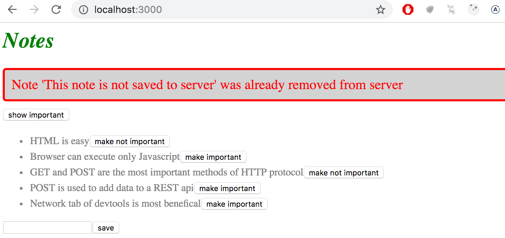
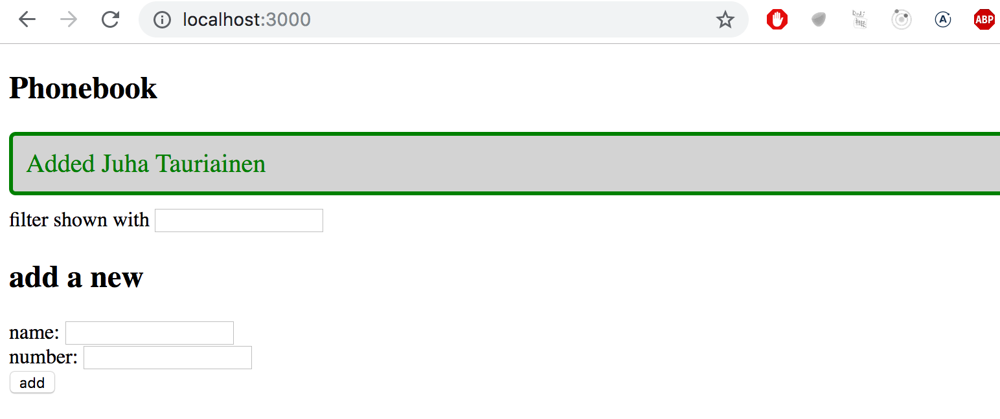
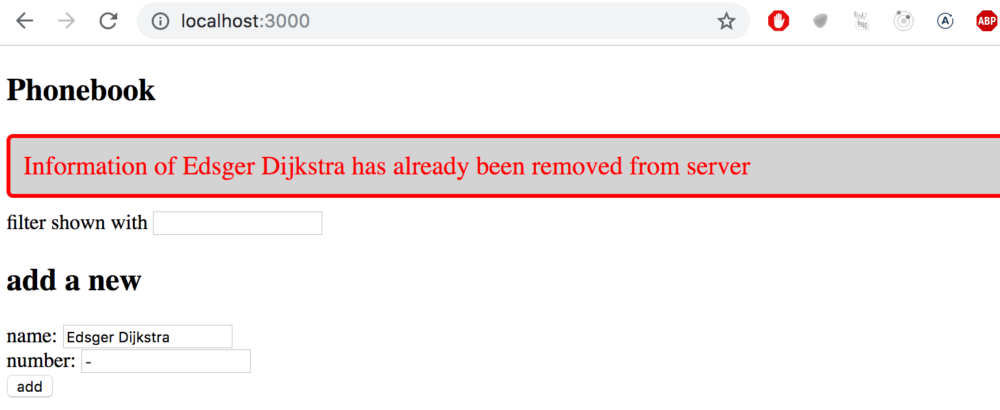
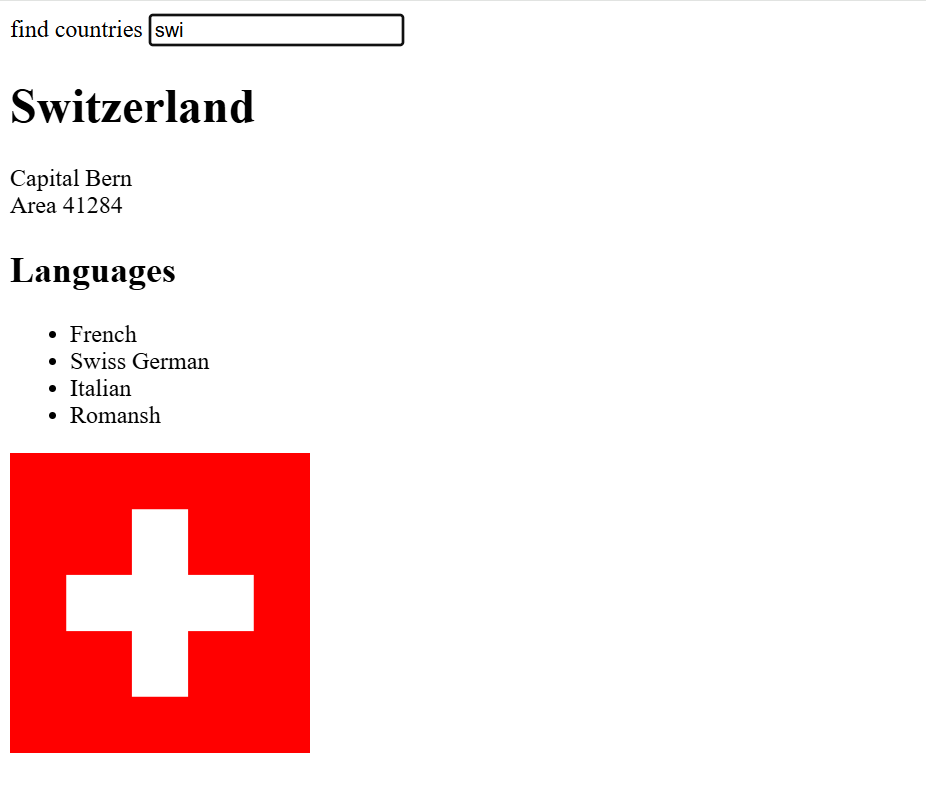
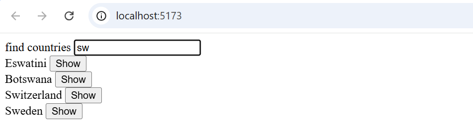
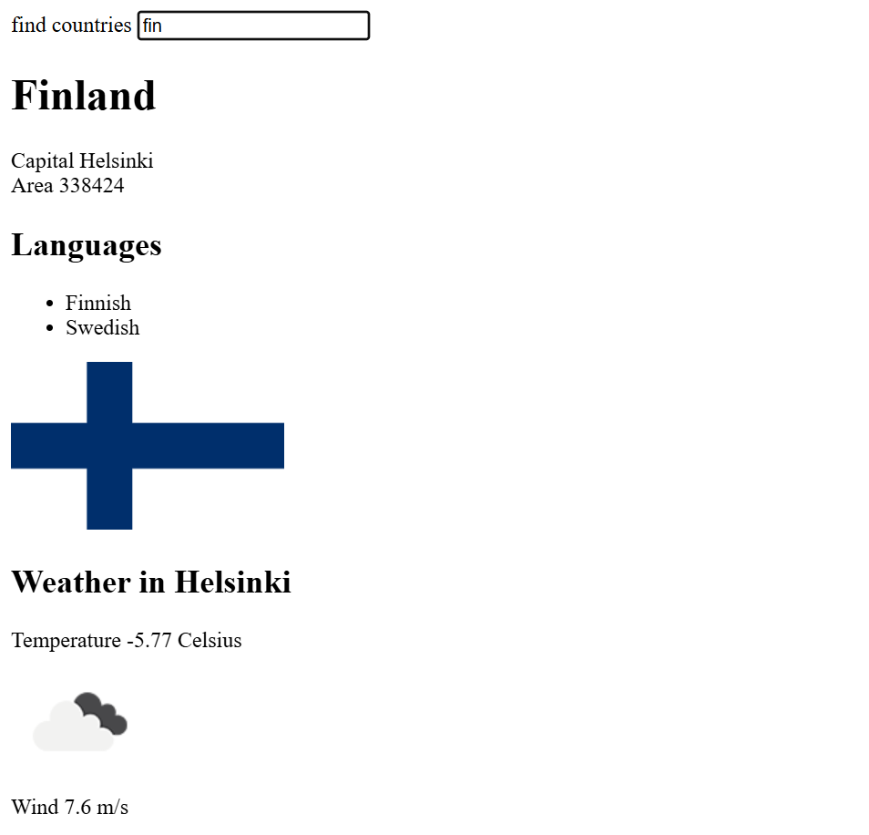

<div class="content">

يبدو مظهر تطبيق الملاحظات الحالي متواضعاً للغاية. سنتعرف في هذا الدرس على كيفية إضافة التنسيقات وجماليات CSS إلى تطبيقات React بأساليب مختلفة.

سنبدأ بإضافة التنسيقات بالطريقة التقليدية عبر ملف CSS واحد.

أنشئ ملفاً باسم `src/index.css` واستورده في ملف `main.jsx`:

```js
import './index.css'
```

لنضف القاعدة التالية إلى ملف `index.css`:

```css
h1 {
  color: green;
  font-style: italic;
}
```

تتكون قواعد CSS من **محددات (Selectors)** و **إعلانات الخصائص (Declarations)**.

لتطبيق التنسيقات على مكون الملاحظة تحديداً دون التأثير على بقية عناصر القائمة، نستخدم **محدد الفئات (Class Selector)**. وفي React نستخدم الخاصية **`className`** بدلاً من خاصية `class` في HTML:

```js
const Note = ({ note, toggleImportance }) => {
  const label = note.important ? 'make not important' : 'make important'

  return (
    <li className="note">
      {note.content} 
      <button onClick={toggleImportance}>{label}</button>
    </li>
  )
}
```

وقاعدة الـ CSS المطابقة:

```css
.note {
  color: grey;
  padding-top: 5px;
  font-size: 15px;
}
```

---

### تحسين رسائل التنبيه والخطأ (Improved Error Messages)

بدلاً من استخدام نافذة `alert()` المنبثقة، لنبني مكون تنبيهات احترافي في ملف `src/components/Notification.jsx`:

```js
const Notification = ({ message }) => {
  if (message === null) {
    return null
  }

  return (
    <div className="error">
      {message}
    </div>
  )
}

export default Notification
```

إذا كانت قيمة `message` تساوي `null`، يُرجع المكون `null` ولا يُصيّر أي شيء على الشاشة.

ونضيف تنسيقات رسالة الخطأ في `index.css`:

```css
.error {
  color: red;
  background: lightgrey;
  font-size: 20px;
  border-style: solid;
  border-radius: 5px;
  padding: 10px;
  margin-bottom: 10px;
}
```

ثم ندمج رسالة الخطأ في المكون الرئيسي `App.jsx` مع مؤقت زمني لإخفائها بعد 5 ثوانٍ:

```js
const App = () => {
  const [errorMessage, setErrorMessage] = useState(null)

  const toggleImportanceOf = id => {
    const note = notes.find(n => n.id === id)
    const changedNote = { ...note, important: !note.important }

    noteService
      .update(id, changedNote)
      .then(returnedNote => {
        setNotes(notes.map(note => note.id !== id ? note : returnedNote))
      })
      .catch(error => {
        setErrorMessage(
          `Note '${note.content}' was already removed from server`
        )
        setTimeout(() => {
          setErrorMessage(null)
        }, 5000)
        setNotes(notes.filter(n => n.id !== id))
      })
  }

  return (
    <div>
      <h1>Notes</h1>
      <Notification message={errorMessage} />
      {/* ... */}
    </div>
  )
}
```



---

### التنسيقات المضمنة (Inline Styles)

تتيح React أيضاً كتابة التنسيقات المباشرة داخل كود JavaScript ككائن يُمرر لخاصية `style`:

```js
const Footer = () => {
  const footerStyle = {
    color: 'green',
    fontStyle: 'italic',
    fontSize: 16
  }

  return (
    <div style={footerStyle}>
      <br />
      <p>
        Note app, Department of Computer Science, University of Helsinki 2025
      </p>
    </div>
  )
}

export default Footer
```

> **ملاحظة**: في التنسيقات المضمنة بجافاسكريبت، تُكتب أسماء خصائص CSS بصيغة **camelCase** (مثل `fontStyle` بدلاً من `font-style`، و `fontSize` بدلاً من `font-size`).

---

### ملاحظات هامة: التهيئة بالقيمة `null` والتصيير الشرطي

إذا كانت الحالة الأولية تساوي `null` بدلاً من مصفوفة فارغة `[]`:
```js
const [notes, setNotes] = useState(null)
```
فسيتعطل التطبيق عند أول تصيير برسالة: `Cannot read properties of null (reading 'map')`. لأن الأثر `useEffect` لا يُنفذ إلا **بعد** انتهاء أول تصيير (First render).

لحل هذه المشكلة نستخدم **التصيير الشرطي (Conditional Rendering)**:

```js
if (!notes) { 
  return null 
}
```

---

### تبعيات `useEffect` والتنفيذ المعتمد على الحالة

عند تمرير متغير داخل مصفوفة التبعيات `[currency]`، يُنفذ الأثر عند أول تصيير **وكذلك في كل مرة تتغير فيها قيمة `currency`**:

```js
useEffect(() => {
  if (currency) {
    axios
      .get(`https://open.er-api.com/v6/latest/${currency}`)
      .then(response => {
        setRates(response.data.rates)
      })
  }
}, [currency])
```

</div>

<div class="tasks">

<h3>التمارين 2.16 - 2.20</h3>

<h4>2.16: دليل الهاتف - الخطوة 11 (Phonebook step 11)</h4>
اعرض رسالة نجاح خضراء منسقة لبضع ثوانٍ عند إضافة شخص جديد أو تحديث رقمه بنجاح.



<h4>2.17*: دليل الهاتف - الخطوة 12 (Phonebook step 12)</h4>
عند حدوث خطأ (مثل محاولة تعديل شخص تم حذفه مسبقاً من المتصفح الآخر)، اعرض رسالة خطأ حمراء منسقة على الواجهة مع التقاط الخطأ عبر `.catch()`.



<h4>2.18*: بيانات الدول - الخطوة 1 (Data for countries, step 1)</h4>
يقدم الرابط <https://studies.cs.helsinki.fi/restcountries/> واجهة REST API لبيانات دول العالم.
ابنِ تطبيقاً يتيح البحث عن الدول:
- إذا كان عدد الدول المطابقة أكثر من 10: اعرض عبارة تنبه المستخدم لتحديد البحث بدقة.
- إذا كان بين 2 و 10: اعرض قائمة بأسماء الدول.
- إذا كانت دولة واحدة فقط: اعرض تفاصيلها الأساسية وعاصمتها ومساحتها ولغاتها وصورة علمها.



<h4>2.19*: بيانات الدول - الخطوة 2 (Data for countries, step 2)</h4>
أضف زر "show" بجانب كل دولة في القائمة لعرض تفاصيلها مباشرة عند النقر.



<h4>2.20*: بيانات الدول - الخطوة 3 (Data for countries, step 3)</h4>
أضف بيانات الطقس الحالية لعاصمة الدولة من خلال خدمة مثل [OpenWeatherMap](https://openweathermap.org).
احفظ مفتاح الـ API داخل متغير بيئة يبدأ بـ `VITE_` (مثل `VITE_WEATHER_KEY`) ولا تضعه مباشرة في الكود المصدري.



هذا هو التمرين الأخير في هذا الجزء. ارفع حلولك إلى GitHub وسجل إنجاز التمارين في نظام التسليم.

</div>
