<div class="content">

في هذا الجزء، يتحول تركيزنا نحو الواجهة الخلفية (Backend): أي نحو تنفيذ الوظائف البرمجية على جانب الخادم (Server-side) من حزمة التطوير.

سنقوم ببناء واجهتنا الخلفية بالاعتماد على [NodeJS](https://nodejs.org/en/)، وهي بيئة تشغيل لجافاسكريبت (JavaScript runtime) مبنية على محرك جافاسكريبت [Chrome V8](https://developers.google.com/v8/) من Google.

كُتبت مادة هذا المنهج باستخدام الإصدار <i>v22.3.0</i> من Node.js. يُرجى التأكد من أن إصدار Node لديك حديث على الأقل مثل الإصدار المستخدم في المادة (يمكنك التحقق من الإصدار عبر تشغيل الأمر _node -v_ في سطر الأوامر).

كما ذكرنا في [الجزء 1](/ar/part1/java_script)، لا تدعم المتصفحات بعد أحدث ميزات جافاسكريبت، ولهذا السبب يجب تحويل الشيفرة (Transpiled) التي تعمل في المتصفح باستخدام أداة مثل [babel](https://babeljs.io/). أما الوضع مع جافاسكريبت التي تعمل في الواجهة الخلفية فمختلف تماماً. يدعم أحدث إصدار من Node الغالبية العظمى من أحدث ميزات جافاسكريبت، لذا يمكننا استخدام أحدث الميزات دون الحاجة إلى تحويل شيفرتنا البرمجية.

هدفنا هو تنفيذ واجهة خلفية تعمل بالتكامل مع تطبيق الملاحظات من [الجزء 2](/ar/part2/). ومع ذلك، دعونا نبدأ بالأساسيات من خلال تنفيذ تطبيق "hello world" كلاسيكي.

**تنبيه:** لاحظ أن التطبيقات والتمارين في هذا الجزء ليست جميعها تطبيقات React، ولن نستخدم أداة <i>create vite@latest -- --template react</i> لتهيئة المشروع لهذا التطبيق.

لقد ذكرنا بالفعل [npm](/ar/part2/getting_data_from_server#npm) سابقاً في الجزء الثاني، وهي أداة تُستخدم لإدارة حزم جافاسكريبت. في الواقع، نشأت npm من بيئة Node.

دعنا ننتقل إلى مجلد مناسب، وننشئ قالباً جديداً لتطبيقنا باستخدام الأمر _npm init_. سنجيب على الأسئلة التي تطرحها الأداة، وستكون النتيجة ملف <i>package.json</i> تم إنشاؤه تلقائياً في جذر المشروع يحتوي على معلومات حول المشروع.

```json
{
  "name": "backend",
  "version": "0.0.1",
  "description": "",
  "main": "index.js",
  "scripts": {
    "test": "echo \"Error: no test specified\" && exit 1"
  },
  "author": "Matti Luukkainen",
  "license": "MIT"
}
```

يحدد الملف، على سبيل المثال، أن نقطة الدخول (Entry point) للتطبيق هي الملف <i>index.js</i>.

دعنا نجري تغييراً صغيراً على الكائن <i>scripts</i> عن طريق إضافة أمر سكربت جديد.

```json
{
  // ...
  "scripts": {
    "start": "node index.js", // highlight-line
    "test": "echo \"Error: no test specified\" && exit 1"
  },
  // ...
}
```

بعد ذلك، دعنا ننشئ الإصدار الأول من تطبيقنا بإضافة ملف <i>index.js</i> في جذر المشروع مع الشيفرة التالية:

```js
console.log('hello world')
```

يمكننا تشغيل البرنامج مباشرة باستخدام Node من سطر الأوامر:

```bash
node index.js
```

أو يمكننا تشغيله كسكربت [npm script](https://docs.npmjs.com/misc/scripts):

```bash
npm start
```

يعمل سكربت npm المسمى <i>start</i> لأننا عرّفناه في ملف <i>package.json</i>:

```json
{
  // ...
  "scripts": {
    "start": "node index.js",
    "test": "echo \"Error: no test specified\" && exit 1"
  },
  // ...
}
```

على الرغم من أن تنفيذ المشروع يعمل عند تشغيله عن طريق استدعاء _node index.js_ من سطر الأوامر، إلا أنه من المعتاد في مشاريع npm تنفيذ مثل هذه المهام كسكربتات npm.

افتراضياً، يحدد ملف <i>package.json</i> أيضاً سكربت npm شائع الاستخدام يسمى <i>npm test</i>. نظراً لأن مشروعنا لا يحتوي بعد على مكتبة اختبار، فإن الأمر _npm test_ ينفذ ببساطة الأمر التالي:

```bash
echo "Error: no test specified" && exit 1
```

### خادم ويب بسيط (Simple web server)

دعنا نحول التطبيق إلى خادم ويب عن طريق تعديل ملف _index.js_ على النحو التالي:

```js
const http = require('http')

const app = http.createServer((request, response) => {
  response.writeHead(200, { 'Content-Type': 'text/plain' })
  response.end('Hello World')
})

const PORT = 3001
app.listen(PORT)
console.log(`Server running on port ${PORT}`)
```

بمجرد تشغيل التطبيق، تُطبع الرسالة التالية في وحدة التحكم (Console):

```bash
Server running on port 3001
```

يمكننا فتح تطبيقنا البسيط في المتصفح عبر زيارة العنوان <http://localhost:3001>:

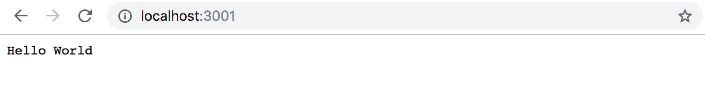

يعمل الخادم بنفس الطريقة بغض النظر عن الجزء الأخير من عنوان URL. كما أن العنوان <http://localhost:3001/foo/bar> سيعرض نفس المحتوى أيضاً.

**ملاحظة:** إذا كان المنفذ (Port) 3001 مستخدماً بالفعل بواسطة تطبيق آخر، فسيؤدي بدء تشغيل الخادم إلى رسالة الخطأ التالية:

```bash
➜  hello npm start

> hello@1.0.0 start /Users/mluukkai/opetus/_2019fullstack-code/part3/hello
> node index.js

Server running on port 3001
events.js:167
      throw er; // Unhandled 'error' event
      ^

Error: listen EADDRINUSE :::3001
    at Server.setupListenHandle [as _listen2] (net.js:1330:14)
    at listenInCluster (net.js:1378:12)
```

لديك خياران: إما إيقاف التطبيق الذي يستخدم المنفذ 3001 (كان خادم JSON Server في الجزء السابق من المادة يستخدم المنفذ 3001)، أو استخدام منفذ مختلف لهذا التطبيق.

دعنا نلقي نظرة فاحصة على السطر الأول من الشيفرة:

```js
const http = require('http')
```

في السطر الأول، يستورد التطبيق وحدة [خادم الويب (web server)](https://nodejs.org/docs/latest-v18.x/api/http.html) المدمجة في Node. هذا عملياً هو ما كنا نفعله بالفعل في شيفرة جانب المتصفح، ولكن بصيغة بناء (Syntax) مختلفة قليلاً:

```js
import http from 'http'
```

في هذه الأيام، تستخدم الشيفرة التي تعمل في المتصفح وحدات ES6 (ES6 modules). تُعرَّف الوحدات باستخدام [export](https://developer.mozilla.org/en-US/docs/Web/JavaScript/Reference/Statements/export) ويتم تضمينها في الملف الحالي باستخدام [import](https://developer.mozilla.org/en-US/docs/Web/JavaScript/Reference/Statements/import).

تستخدم Node.js وحدات [CommonJS](https://en.wikipedia.org/wiki/CommonJS). والسبب في ذلك هو أن منظومة Node كانت بحاجة إلى وحدات نمطية قبل فترة طويلة من دعم جافاسكريبت لها في مواصفات اللغة الرسمية. حالياً، تدعم Node أيضاً استخدام وحدات ES6، ولكن نظراً لأن الدعم ليس مثالياً بعد، فسنلتزم بوحدات CommonJS.

تعمل وحدات CommonJS بنفس طريقة وحدات ES6 تقريباً، على الأقل فيما يتعلق باحتياجاتنا في هذه الدورة.

الكتلة التالية في شيفرتنا تبدو هكذا:

```js
const app = http.createServer((request, response) => {
  response.writeHead(200, { 'Content-Type': 'text/plain' })
  response.end('Hello World')
})
```

تستخدم الشيفرة دالة _createServer_ من وحدة [http](https://nodejs.org/docs/latest-v18.x/api/http.html) لإنشاء خادم ويب جديد. يتم تسجيل *معالج أحداث (Event handler)* في الخادم يُستدعى *في كل مرة* يتم فيها إرسال طلب HTTP إلى عنوان الخادم <http://localhost:3001>.

يتم الرد على الطلب برمز الحالة (Status code) 200، مع تعيين ترويسة (Header) الـ <i>Content-Type</i> إلى <i>text/plain</i>، ومحتوى الموقع المُراد إرجاعه إلى <i>Hello World</i>.

تقوم الأسطر الأخيرة بربط خادم http المُسند إلى المتغير _app_، للاستماع إلى طلبات HTTP المرسلة إلى المنفذ 3001:

```js
const PORT = 3001
app.listen(PORT)
console.log(`Server running on port ${PORT}`)
```

الغرض الأساسي من خادم الواجهة الخلفية في هذه الدورة هو تقديم بيانات خام بتنسيق JSON إلى الواجهة الأمامية. لهذا السبب، دعونا نغير خادمنا على الفور ليعيد قائمة ملاحظات ثابتة ومكتوبة مسبقاً (Hardcoded) بتنسيق JSON:

```js
const http = require('http')

// highlight-start
let notes = [
  {
    id: "1",
    content: "HTML is easy",
    important: true
  },
  {
    id: "2",
    content: "Browser can execute only JavaScript",
    important: false
  },
  {
    id: "3",
    content: "GET and POST are the most important methods of HTTP protocol",
    important: true
  }
]

const app = http.createServer((request, response) => {
  response.writeHead(200, { 'Content-Type': 'application/json' })
  response.end(JSON.stringify(notes))
})
// highlight-end

const PORT = 3001
app.listen(PORT)
console.log(`Server running on port ${PORT}`)
```

دعنا نعيد تشغيل الخادم (يمكنك إيقاف الخادم بالضغط على _Ctrl+C_ في الطرفية/وحدة التحكم) ونقوم بتحديث المتصفح.

تخبر القيمة <i>application/json</i> في ترويسة <i>Content-Type</i> المستلم بأن البيانات بتنسيق JSON. يتم تحويل مصفوفة _notes_ إلى نص بتنسيق JSON باستخدام التابع <em>JSON.stringify(notes)</em>. هذا ضروري لأن التابع ()response.end يتوقع نصاً (String) أو مخزناً مؤقتاً (Buffer) لإرساله كجسم للاستجابة (Response body).

عندما نفتح المتصفح، يكون التنسيق المعروض مطابقاً تماماً لما رأيناه في [الجزء 2](/ar/part2/getting_data_from_server/) عندما استخدمنا [json-server](https://github.com/typicode/json-server) لتقديم قائمة الملاحظات:

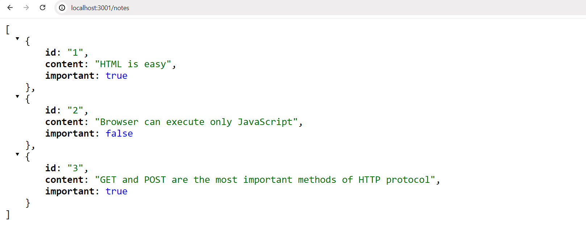

### إكسبريس (Express)

إن كتابة شيفرة الخادم مباشرة باستخدام خادم الويب [http](https://nodejs.org/docs/latest-v18.x/api/http.html) المدمج في Node أمر ممكن. ومع ذلك، فهو مرهق ومعقد، خاصة عندما يكبر حجم التطبيق.

تم تطوير العديد من المكتبات لتسهيل التطوير من جانب الخادم باستخدام Node، من خلال تقديم واجهة أكثر مرونة وسهولة للتعامل مع وحدة http المدمجة. تهدف هذه المكتبات إلى توفير تجريد أفضل لحالات الاستخدام العامة التي نحتاجها عادةً لبناء خادم واجهة خلفية. وتُعد مكتبة [Express](http://expressjs.com) المكتبة الأكثر شعبية على الإطلاق المخصصة لهذا الغرض.

دعونا نستخدم Express من خلال تعريفها كتبعية للمشروع (Project dependency) باستخدام الأمر:

```bash
npm install express
```

تتم إضافة التبعية أيضاً إلى ملف <i>package.json</i> الخاص بنا:

```json
{
  // ...
  "dependencies": {
    "express": "^5.1.0"
  }
}
```

يتم تثبيت الشيفرة المصدرية للتبعية في المجلد <i>node\_modules</i> الموجود في جذر المشروع. بالإضافة إلى Express، يمكنك العثور على عدد كبير جداً من التبعيات الأخرى في المجلد:

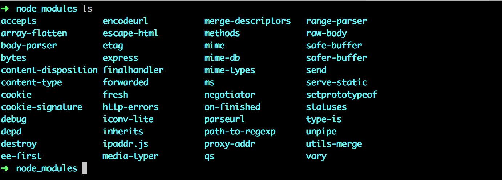

هذه هي تبعيات مكتبة Express وتبعيات جميع تبعياتها، وهكذا دواليك. وتسمى هذه [التبعيات المتعدية (Transitive dependencies)](https://lexi-lambda.github.io/blog/2016/08/24/understanding-the-npm-dependency-model/) لمشروعنا.

تم تثبيت الإصدار 5.1.0 من Express في مشروعنا. ماذا تعني علامة الإقحام (Caret `^`) الموجودة أمام رقم الإصدار في <i>package.json</i>؟

```json
"express": "^5.1.0"
```

يُطلق على نموذج تحديد الإصدارات المستخدم في npm اسم [الترقيم الدلالي للإصدارات (Semantic Versioning)](https://docs.npmjs.com/about-semantic-versioning).

تعني علامة الإقحام الموجودة أمام <i>^5.1.0</i> أنه إذا وعندما يتم تحديث تبعيات المشروع، فإن إصدار Express الذي سيتم تثبيته سيكون على الأقل <i>5.1.0</i>. ومع ذلك، يمكن أن يحتوي إصدار Express المثبت أيضاً على رقم *تصحيحي (Patch)* أكبر (الرقم الأخير)، أو رقم *فرعي (Minor)* أكبر (الرقم الأوسط). بينما يجب أن يظل رقم الإصدار *الرئيسي (Major)* للمكتبة، والذي يُشير إليه الرقم الأول، كما هو دون تغيير.

يمكننا تحديث تبعيات المشروع باستخدام الأمر:

```bash
npm update
```

وبالمثل، إذا بدأنا العمل على المشروع على جهاز كمبيوتر آخر، فيمكننا تثبيت جميع التبعيات المحدثة للمشروع والمحددة في <i>package.json</i> عن طريق تشغيل الأمر التالي في المجلد الجذري للمشروع:

```bash
npm install
```

إذا لم يتغير الرقم *الرئيسي (Major)* للتبعية، فيجب أن تكون الإصدارات الأحدث [متوافقة مع الإصدارات السابقة (Backwards compatible)](https://en.wikipedia.org/wiki/Backward_compatibility). هذا يعني أنه إذا تصادف أن تطبيقنا استخدم الإصدار 5.99.175 من Express في المستقبل، فإن جميع الأكواد المنفذة في هذا الجزء ستظل تعمل دون الحاجة إلى إجراء تعديلات عليها. في المقابل، قد يحتوي الإصدار المستقبلي 6.0.0 من Express على تغييرات قد تؤدي إلى توقف تطبيقنا عن العمل.

### الويب وإكسبريس (Web and Express)

دعنا نعود إلى تطبيقنا ونجري التغييرات التالية:

```js
const express = require('express')
const app = express()

let notes = [
  ...
]

app.get('/', (request, response) => {
  response.send('<h1>Hello World!</h1>')
})

app.get('/api/notes', (request, response) => {
  response.json(notes)
})

const PORT = 3001
app.listen(PORT, () => {
  console.log(`Server running on port ${PORT}`)
})
```

لاستخدام الإصدار الجديد من تطبيقنا، يتعين علينا أولاً إعادة تشغيله.

لم يتغير التطبيق كثيراً. في بداية الشيفرة تماماً، نستورد _express_، وهي هذه المرة عبارة عن *دالة (Function)* تُستخدم لإنشاء تطبيق Express مخزن في المتغير _app_:

```js
const express = require('express')
const app = express()
```

بعد ذلك، نحدد *مسارين (Routes)* للتطبيق. يحدد المسار الأول معالج أحداث يُستخدم للتعامل مع طلبات HTTP GET المرسلة إلى الجذر <i>/</i> للتطبيق:

```js
app.get('/', (request, response) => {
  response.send('<h1>Hello World!</h1>')
})
```

تقبل دالة معالج الأحداث معاملين (Parameters). يحتوي المعامل الأول [request](https://expressjs.com/en/5x/api/request/) على جميع معلومات طلب HTTP، ويُستخدم المعامل الثاني [response](https://expressjs.com/en/5x/api/response/) لتحديد كيفية الرد على الطلب.

في شيفرتنا، تتم الإجابة على الطلب باستخدام التابع [send](https://expressjs.com/en/5x/api/response/#ressendbody) لكائن _response_. يؤدي استدعاء التابع إلى جعل الخادم يستجيب لطلب HTTP عن طريق إرسال استجابة تحتوي على النص <code>\<h1>Hello World!\</h1></code> الذي تم تمريره إلى التابع _send_. نظراً لأن المعامل عبارة عن نص، يقوم Express تلقائياً بتعيين قيمة ترويسة <i>Content-Type</i> لتكون <i>text/html</i>. رمز الحالة الافتراضي للاستجابة هو 200.

يمكننا التحقق من ذلك من تبويب *الشبكة (Network)* في أدوات المطور:

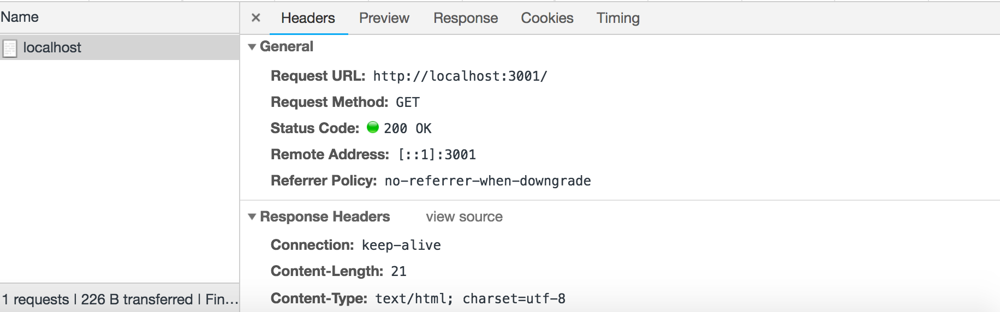

يحدد المسار الثاني معالج أحداث يتعامل مع طلبات HTTP GET المرسلة إلى المسار <i>notes</i> للتطبيق:

```js
app.get('/api/notes', (request, response) => {
  response.json(notes)
})
```

يتم الرد على الطلب باستخدام التابع [json](https://expressjs.com/en/5x/api/response/#resjsonbody) لكائن _response_. يؤدي استدعاء التابع إلى إرسال مصفوفة **notes** التي تم تمريرها إليه كنص بتنسيق JSON. يضبط Express ترويسة <i>Content-Type</i> تلقائياً بالقيمة المناسبة <i>application/json</i>.

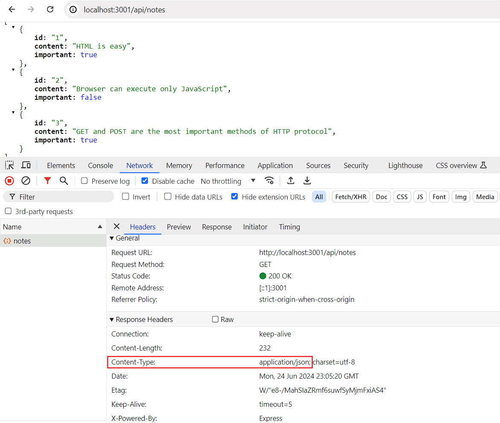

بعد ذلك، دعنا نلقي نظرة سريعة على البيانات المرسلة بتنسيق JSON.

في الإصدار السابق حيث كنا نستخدم Node فقط، كان علينا تحويل البيانات إلى نص بتنسيق JSON باستخدام التابع _JSON.stringify_:

```js
response.end(JSON.stringify(notes))
```

مع Express، لم يعد هذا مطلوباً، لأن هذا التحويل يحدث تلقائياً.

تجدر الإشارة إلى أن [JSON](https://en.wikipedia.org/wiki/JSON) هو تنسيق بيانات. ومع ذلك، غالباً ما يتم تمثيله كنص (String) وهو ليس نفس كائن جافاسكريبت (JavaScript object)، مثل القيمة المسندة إلى _notes_.

توضح التجربة الموضحة أدناه هذه النقطة:

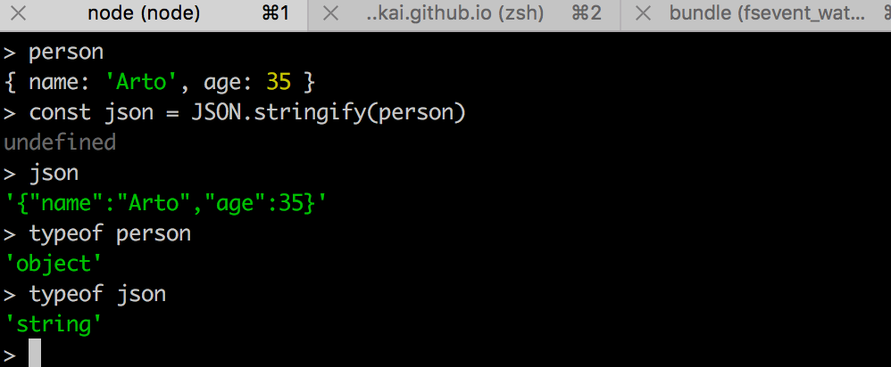

أُجريت التجربة المذكورة أعلاه في بيئة [node-repl](https://nodejs.org/docs/latest-v18.x/api/repl.html) التفاعلية. يمكنك بدء تشغيل node-repl التفاعلي بكتابة _node_ في سطر الأوامر. يعتبر repl مفيداً بشكل خاص لاختبار كيفية عمل الأوامر أثناء كتابة شيفرة التطبيق. نوصي بشدة بالقيام بذلك!

### التتبع التلقائي للتغييرات (Automatic Change Tracking)

إذا قمنا بتغيير شيفرة التطبيق، نحتاج أولاً إلى إيقاف التطبيق من وحدة التحكم (_Ctrl_ + _C_) ثم إعادة تشغيله حتى تدخل التغييرات حيز التنفيذ. تبدو إعادة التشغيل مرهقة مقارنة بسير عمل React السلس، حيث يتم تحديث المتصفح تلقائياً عند تغيير الشيفرة.

يمكنك جعل الخادم يتتبع تغييراتنا عن طريق بدء تشغيله باستخدام الخيار _--watch_:

```bash
node --watch index.js
```

الآن، ستؤدي التغييرات في شيفرة التطبيق إلى إعادة تشغيل الخادم تلقائياً. لاحظ أنه على الرغم من إعادة تشغيل الخادم تلقائياً، فلا يزال يتعين عليك تحديث المتصفح يدوياً. على عكس React، ليس لدينا، ولا يمكن أن يكون لدينا، وظيفة التحديث الفوري (Hot reload) التي تُحدث المتصفح في هذا السيناريو (حيث نقوم بإرجاع بيانات JSON).

دعنا نحدد *سكربت npm مخصصاً* في ملف <i>package.json</i> لبدء تشغيل خادم التطوير:

```json
{
  // ..
  "scripts": {
    "start": "node index.js",
    "dev": "node --watch index.js", // highlight-line
    "test": "echo \"Error: no test specified\" && exit 1"
  },
  // ..
}
```

يمكننا الآن بدء تشغيل الخادم في وضع التطوير باستخدام الأمر:

```bash
npm run dev
```

على عكس تشغيل سكربتات <i>start</i> أو <i>test</i>، يجب أن يتضمن الأمر كلمة <i>run</i>.

### بنية REST البرمجية

دعنا نوسع تطبيقنا بحيث يوفر نفس واجهة برمجة تطبيقات HTTP RESTful مثل [json-server](https://github.com/typicode/json-server#routes).

تم تقديم بنية نقل الحالة التمثيلية (Representational State Transfer)، والمعروفة باسم REST، في عام 2000 في [أطروحة دكتوراه](https://www.ics.uci.edu/~fielding/pubs/dissertation/rest_arch_style.htm) روي فيلدينغ (Roy Fielding). REST هو أسلوب معماري يهدف إلى بناء تطبيقات ويب قابلة للتوسع (Scalable).

لن نتعمق في تعريف فيلدينغ لـ REST أو نقضي وقتاً في التفكير فيما يُعد RESTful وما ليس كذلك. بدلاً من ذلك، نأخذ [منظوراً أكثر تحديداً](https://en.wikipedia.org/wiki/Representational_state_transfer#Applied_to_web_services) من خلال الاهتمام فقط بكيفية فهم واجهات برمجة تطبيقات RESTful عادةً في تطبيقات الويب. إن التعريف الأصلي لـ REST لا يقتصر حتى على تطبيقات الويب وحدها.

ذكرنا في [الجزء السابق](/ar/part2/altering_data_in_server#rest) أن العناصر الفردية، مثل الملاحظات في حالة تطبيقنا، تسمى *موارد (Resources)* في التفكير المعماري لـ REST. كل مورد له عنوان URL مرتبط به وهو العنوان الفريد للمورد.

تتمثل إحدى الاصطلاحات لإنشاء عناوين فريدة في دمج اسم نوع المورد مع المعرف الفريد للمورد.

دعنا نفترض أن عنوان URL الأساسي لخدمتنا هو <i>www.example.com/api</i>.

إذا حددنا نوع مورد الملاحظة ليكون <i>notes</i>، فإن عنوان مورد ملاحظة يحمل المعرف 10، يكون له العنوان الفريد <i>www.example.com/api/notes/10</i>.

عنوان URL للمجموعة الكاملة لجميع موارد الملاحظات هو <i>www.example.com/api/notes</i>.

يمكننا تنفيذ عمليات مختلفة على الموارد. يتم تحديد العملية المراد تنفيذها بواسطة *فعل* HTTP (HTTP verb):

| الرابط (URL) | الفعل (Verb) | الوظيفة (Functionality) |
| :--- | :--- | :--- |
| notes/10 | GET | جلب مورد واحد محدد |
| notes | GET | جلب جميع الموارد في المجموعة |
| notes | POST | إنشاء مورد جديد بناءً على بيانات الطلب |
| notes/10 | DELETE | حذف المورد المحدد |
| notes/10 | PUT | استبدال المورد المحدد بالكامل ببيانات الطلب |
| notes/10 | PATCH | استبدال جزء من المورد المحدد ببيانات الطلب |

هكذا نتمكن تقريباً من تعريف ما تشير إليه REST باسم [الواجهة الموحدة (Uniform interface)](https://en.wikipedia.org/wiki/Representational_state_transfer#Architectural_constraints)، والتي تعني طريقة متسقة لتحديد الواجهات تجعل من الممكن للأنظمة المختلفة التعاون والعمل معاً.

يندرج هذا التفسير لـ REST تحت [المستوى الثاني من نضج RESTful](https://martinfowler.com/articles/richardsonMaturityModel.html) في نموذج نضج ريتشاردسون (Richardson Maturity Model). ووفقاً للتعريف الذي قدمه روي فيلدينغ، فإننا لم نعرّف [REST API](http://roy.gbiv.com/untangled/2008/rest-apis-must-be-hypertext-driven) حقيقية وكاملة. في الواقع، فإن الغالبية العظمى من واجهات برمجة التطبيقات المزعومة في العالم باسم "REST" لا تفي بمعايير فيلدينغ الأصلية الموضحة في أطروحته.

في بعض المصادر (انظر على سبيل المثال [Richardson, Ruby: RESTful Web Services](http://shop.oreilly.com/product/9780596529260.do))، ستجد أن نموذجنا الخاص بواجهة [CRUD](https://en.wikipedia.org/wiki/Create,_read,_update_and_delete) المباشرة يُشار إليه كمثال على [البنية الموجهة نحو الموارد (Resource-oriented architecture)](https://en.wikipedia.org/wiki/Resource-oriented_architecture) بدلاً من REST. سنتجنب الخوض في الجدال حول المصطلحات وسنعود بدلاً من ذلك إلى العمل على تطبيقنا.

### جلب مورد واحد (Fetching a single resource)

دعنا نوسع تطبيقنا بحيث يوفر واجهة REST للتعامل مع الملاحظات الفردية. أولاً، دعنا ننشئ [مساراً (Route)](https://expressjs.com/en/5x/guide/routing/) لجلب مورد واحد.

العنوان الفريد الذي سنستخدمه لملاحظة فردية يكون على شكل <i>notes/10</i>، حيث يشير الرقم الموجود في النهاية إلى رقم المعرف (ID) الفريد للملاحظة.

يمكننا تحديد [معاملات المسار (Route parameters)](https://expressjs.com/en/5x/guide/routing/#route-parameters) في Express باستخدام صيغة النقطتين الرأسيتين:

```js
app.get('/api/notes/:id', (request, response) => {
  const id = request.params.id
  const note = notes.find(note => note.id === id)
  response.json(note)
})
```

الآن سيتعامل <code>app.get('/api/notes/:id', ...)</code> مع جميع طلبات HTTP GET التي تأتي على شكل <i>/api/notes/SOMETHING</i>، حيث <i>SOMETHING</i> هو نص عشوائي.

يمكن الوصول إلى المعامل <i>id</i> في مسار الطلب من خلال كائن [request](https://expressjs.com/en/5x/api/request/):

```js
const id = request.params.id
```

يتم استخدام تابع المصفوفات المألوف الآن _find_ للعثور على الملاحظة ذات المعرف المطابق للمعامل. ثم يتم إرجاع الملاحظة إلى مرسل الطلب.

يمكننا الآن اختبار تطبيقنا بالانتقال إلى <http://localhost:3001/api/notes/1> في متصفحنا:

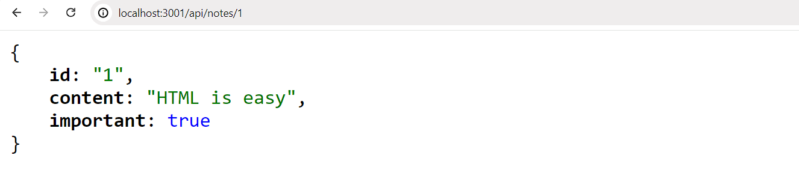

ومع ذلك، هناك مشكلة أخرى في تطبيقنا.

إذا بحثنا عن ملاحظة بمعرف غير موجود، يستجيب الخادم بما يلي:

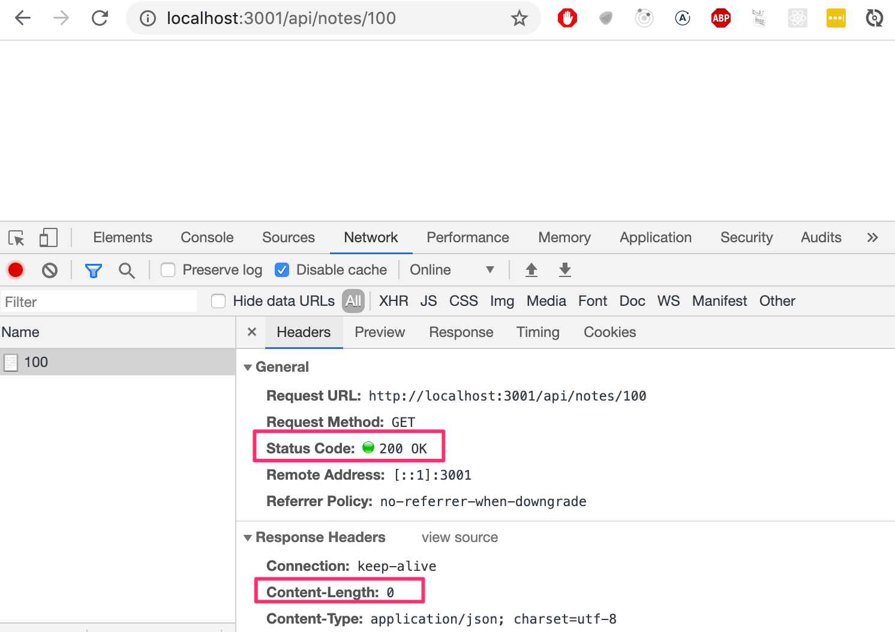

رمز حالة HTTP الذي يتم إرجاعه هو 200، مما يعني أن الاستجابة تمت بنجاح. لا توجد بيانات مرسلة مع الاستجابة، نظراً لأن قيمة ترويسة <i>content-length</i> هي 0، ويمكن التحقق من نفس الشيء من المتصفح.

السبب وراء هذا السلوك هو أن المتغير _note_ يتم تعيينه إلى _undefined_ إذا لم يتم العثور على ملاحظة مطابقة. يجب التعامل مع الموقف على الخادم بطريقة أفضل. إذا لم يتم العثور على أي ملاحظة، يجب أن يستجيب الخادم برمز الحالة [404 not found](https://www.rfc-editor.org/rfc/rfc9110.html#name-404-not-found) بدلاً من 200.

دعنا نجري التغيير التالي على شيفرتنا:

```js
app.get('/api/notes/:id', (request, response) => {
  const id = request.params.id
  const note = notes.find(note => note.id === id)
  
  // highlight-start
  if (note) {
    response.json(note)
  } else {
    response.status(404).end()
  }
  // highlight-end
})
```

نظراً لعدم إرفاق أي بيانات بالاستجابة، فإننا نستخدم التابع [status](https://expressjs.com/en/5x/api/response/#resstatuscode) لتعيين رمز الحالة والتابع [end](https://expressjs.com/en/5x/api/response/#resenddata-encoding-callback) للرد على الطلب دون إرسال أي بيانات.

يستفيد شرط if من حقيقة أن جميع كائنات جافاسكريبت هي [قيم حقيقية (Truthy)](https://developer.mozilla.org/en-US/docs/Glossary/Truthy)، مما يعني أنها تُقيّم إلى true في عمليات المقارنة. ومع ذلك، فإن _undefined_ هي [قيمة زائفة (Falsy)](https://developer.mozilla.org/en-US/docs/Glossary/Falsy) مما يعني أنها ستُقيّم إلى false.

يعمل تطبيقنا الآن ويرسل رمز حالة الخطأ إذا لم يتم العثور على الملاحظة. ومع ذلك، لا يُرجع التطبيق أي شيء لعرضه للمستخدم، كما تفعل تطبيقات الويب عادةً عندما نزور صفحة غير موجودة. لسنا بحاجة إلى عرض أي شيء في المتصفح لأن واجهات برمجة تطبيقات REST هي واجهات مخصصة للاستخدام البرمجي، ورمز حالة الخطأ هو كل ما هو مطلوب.

على أية حال، من الممكن إعطاء تلميح حول سبب إرسال خطأ 404 من خلال [تجاوز رسالة NOT FOUND الافتراضية](https://stackoverflow.com/questions/14154337/how-to-send-a-custom-http-status-message-in-node-express/36507614#36507614).

### حذف الموارد (Deleting resources)

بعد ذلك، دعنا ننفذ مساراً لحذف الموارد. يتم الحذف عن طريق إجراء طلب HTTP DELETE إلى عنوان URL الخاص بالمورد:

```js
app.delete('/api/notes/:id', (request, response) => {
  const id = request.params.id
  notes = notes.filter(note => note.id !== id)

  response.status(204).end()
})
```

إذا نجح حذف المورد، بمعنى أن الملاحظة كانت موجودة وتمت إزالتها، فإننا نستجيب للطلب برمز الحالة [204 no content](https://www.rfc-editor.org/rfc/rfc9110.html#name-204-no-content) ولا نرجع أي بيانات مع الاستجابة.

لا يوجد إجماع كامل حول رمز الحالة الذي يجب إرجاعه لطلب DELETE إذا كان المورد غير موجود أصلاً. الخياران الوحيدان هما 204 و 404. من أجل البساطة، سيستجيب تطبيقنا برمز 204 في كلتا الحالتين.

### بوستمان (Postman)

إذن كيف نختبر عملية الحذف؟ من السهل إجراء طلبات HTTP GET من المتصفح. يمكننا كتابة بعض أكواد جافاسكريبت لاختبار الحذف، لكن كتابة كود الاختبار ليست دائماً الحل الأفضل في كل موقف.

توجد العديد من الأدوات لجعل اختبار الواجهات الخلفية أسهل. إحدى هذه الأدوات هي برنامج سطر الأوامر [curl](https://curl.haxx.se). ومع ذلك، بدلاً من curl، سنلقي نظرة على استخدام [Postman](https://www.postman.com) لاختبار التطبيق.

دعنا نثبت تطبيق Postman لسطح المكتب [من هنا](https://www.postman.com/downloads/) ونجربه:

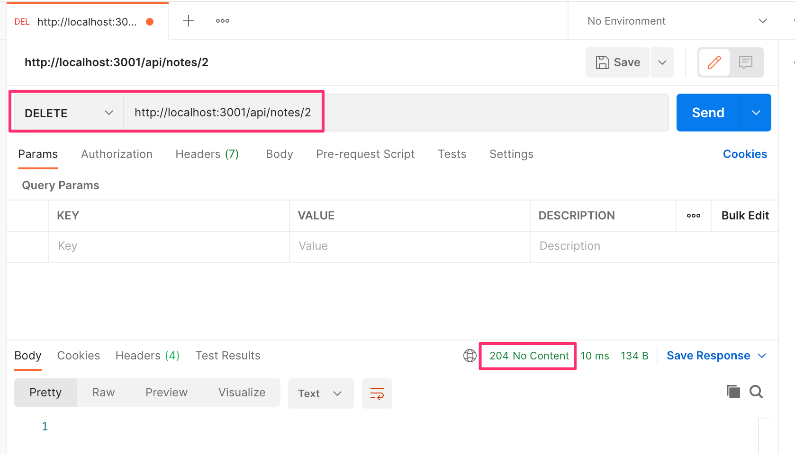

ملاحظة: يتوفر Postman أيضاً في VS Code حيث يمكن تنزيله من تبويب الإضافات (Extensions) على اليسار -> ابحث عن Postman -> النتيجة الأولى (Verified Publisher) -> تثبيت (Install).
سترى بعد ذلك أيقونة إضافية تمت إضافتها على شريط النشاط أسفل تبويب الإضافات. بمجرد تسجيل الدخول، يمكنك اتباع الخطوات أدناه.

استخدام Postman سهل للغاية في هذه الحالة. يكفي تحديد عنوان URL ثم اختيار نوع الطلب الصحيح (DELETE).

يبدو أن خادم الواجهة الخلفية يستجيب بشكل صحيح. من خلال إجراء طلب HTTP GET إلى <http://localhost:3001/api/notes> نرى أن الملاحظة ذات المعرف 2 لم تعد موجودة في القائمة، مما يشير إلى أن الحذف كان ناجحاً.

حالياً، الملاحظات في التطبيق مكتوبة في الشيفرة برمجياً ولم يتم حفظها بعد في قاعدة بيانات، لذلك ستتم إعادة تعيين قائمة الملاحظات إلى حالتها الأصلية عند إعادة تشغيل التطبيق.

### عميل REST في Visual Studio Code

إذا كنت تستخدم Visual Studio Code، فيمكنك استخدام إضافة [REST client](https://marketplace.visualstudio.com/items?itemName=humao.rest-client) في VS Code بدلاً من Postman.

بمجرد تثبيت الإضافة، يصبح استخدامها بسيطاً جداً. ننشئ مجلداً في جذر التطبيق باسم <i>requests</i>. نحفظ جميع طلبات عميل REST في هذا المجلد كملفات تنتهي بالامتداد <i>.rest</i>.

دعنا ننشئ ملفاً جديداً باسم <i>get\_all\_notes.rest</i> ونحدد الطلب الذي يجلب جميع الملاحظات.

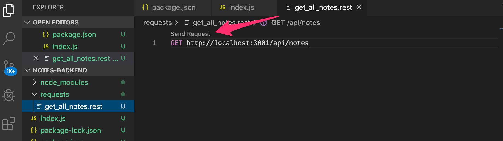

بالنقر فوق نص <i>Send Request</i>، سيقوم عميل REST بتنفيذ طلب HTTP ويتم فتح الاستجابة الواردة من الخادم داخل المحرر.

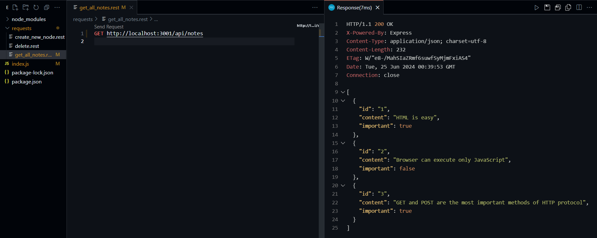

### عميل HTTP في WebStorm

إذا كنت تستخدم *IntelliJ WebStorm* بدلاً من ذلك، فيمكنك استخدام إجراء مماثل مع عميل HTTP المدمج فيه. أنشئ ملفاً جديداً بالامتداد `.rest` وسيعرض المحرر خياراتك لإنشاء وتشغيل طلباتك. يمكنك معرفة المزيد حول هذا الموضوع باتباع [هذا الدليل](https://www.jetbrains.com/help/webstorm/http-client-in-product-code-editor.html).

### استلام البيانات (Receiving data)

بعد ذلك، دعونا نجعل من الممكن إضافة ملاحظات جديدة إلى الخادم. تتم إضافة ملاحظة عن طريق إجراء طلب HTTP POST إلى العنوان <http://localhost:3001/api/notes>، وإرسال جميع المعلومات الخاصة بالملاحظة الجديدة في [جسم الطلب (Request body)](https://www.rfc-editor.org/rfc/rfc9112#name-message-body) بتنسيق JSON.

للوصول إلى البيانات بسهولة، نحتاج إلى مساعدة [محلل JSON (Express json-parser)](https://expressjs.com/en/5x/api/express/#expressjsonoptions) الذي يمكننا استخدامه بالأمر _app.use(express.json())_.

دعنا نفعّل json-parser وننفذ معالجاً أولياً للتعامل مع طلبات HTTP POST:

```js
const express = require('express')
const app = express()

app.use(express.json())  // highlight-line

//...

// highlight-start
app.post('/api/notes', (request, response) => {
  const note = request.body
  console.log(note)

  response.json(note)
})
// highlight-end
```

يمكن لدالة معالج الأحداث الوصول إلى البيانات من خاصية <i>body</i> لكائن _request_.

بدون محلل json-parser، ستكون خاصية <i>body</i> غير محددة (undefined). يأخذ json-parser بيانات JSON الخاصة بالطلب، ويحولها إلى كائن جافاسكريبت ثم يرفقها بخاصية <i>body</i> لكائن _request_ قبل استدعاء معالج المسار.

في الوقت الحالي، لا يقوم التطبيق بأي شيء بالبيانات المستلمة بخلاف طباعتها في وحدة التحكم وإرسالها مرة أخرى في الاستجابة.

قبل أن ننفذ بقية منطق التطبيق، دعنا نتحقق باستخدام Postman من أن البيانات قد استلمها الخادم بالفعل. بالإضافة إلى تحديد عنوان URL ونوع الطلب في Postman، يتعين علينا أيضاً تحديد البيانات المرسلة في <i>body</i>:

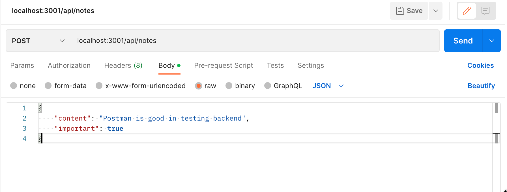

يطبع التطبيق البيانات التي أرسلناها في الطلب إلى وحدة التحكم:

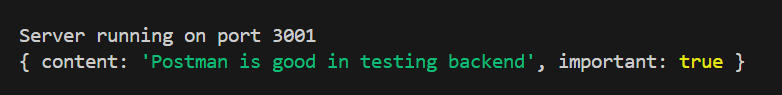

**ملاحظة:** عند برمجة الواجهة الخلفية، <i>احتفظ بوحدة التحكم التي تشغل التطبيق مرئية في جميع الأوقات</i>. سيعاد تشغيل خادم التطوير إذا تم إجراء تغييرات على الشيفرة، لذلك من خلال مراقبة وحدة التحكم، ستلاحظ على الفور ما إذا كان هناك خطأ في كود التطبيق:

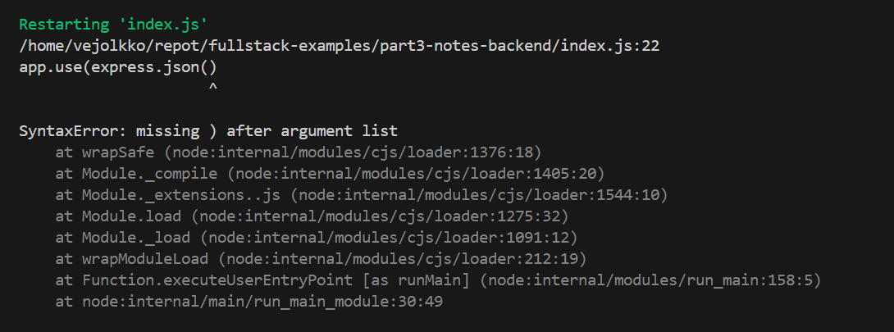

وبالمثل، من المفيد فحص وحدة التحكم للتأكد من أن الواجهة الخلفية تتصرف كما نتوقع منها في المواقف المختلفة، مثل عندما نرسل بيانات باستخدام طلب HTTP POST. وبطبيعة الحال، من الجيد إضافة الكثير من أوامر <em>console.log</em> إلى الشيفرة أثناء استمرار تطوير التطبيق.

السبب المحتمل لحدوث المشكلات هو تعيين ترويسة <i>Content-Type</i> بشكل غير صحيح في الطلبات. يمكن أن يحدث هذا مع Postman إذا لم يتم تحديد نوع الجسم (Body) بشكل صحيح:

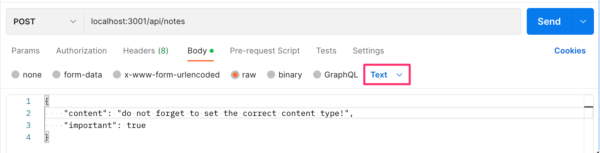

ترويسة <i>Content-Type</i> مضبوطة على <i>text/plain</i>:

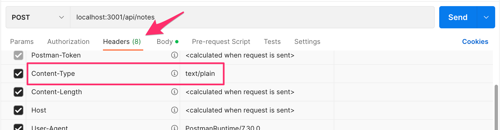

يبدو أن الخادم يستقبل كائناً فارغاً فقط:

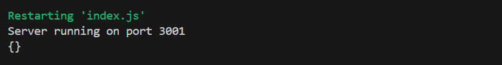

لن يتمكن الخادم من تحليل البيانات بشكل صحيح بدون القيمة الصحيحة في الترويسة. ولن يحاول حتى تخمين تنسيق البيانات نظراً لوجود [عدد هائل](https://developer.mozilla.org/en-US/docs/Web/HTTP/Basics_of_HTTP/MIME_types) من أنواع <i>Content-Types</i> المحتملة.

إذا كنت تستخدم VS Code، فيجب عليك تثبيت عميل REST من الفصل السابق *الآن، إذا لم تكن قد قمت بذلك بالفعل*. يمكن إرسال طلب POST باستخدام عميل REST على النحو التالي:

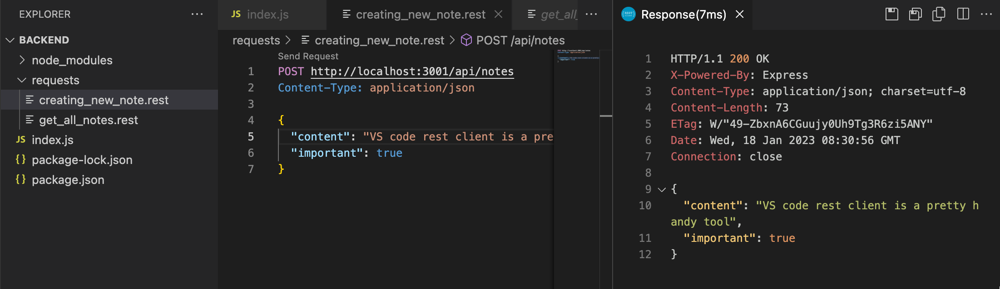

أنشأنا ملفاً جديداً باسم <i>create\_note.rest</i> للطلب. يتم تنسيق الطلب وفقاً [للتعليمات الواردة في التوثيق](https://github.com/Huachao/vscode-restclient/blob/master/README.md#usage).

تتمثل إحدى الفوائد التي يتمتع بها عميل REST مقارنة بـ Postman في أن الطلبات متاحة بسهولة في جذر مستودع المشروع، ويمكن توزيعها على جميع أعضاء فريق التطوير. يمكنك أيضاً إضافة طلبات متعددة في نفس الملف باستخدام الفواصل `###`:

```text
GET http://localhost:3001/api/notes/

###
POST http://localhost:3001/api/notes/ HTTP/1.1
content-type: application/json

{
    "name": "sample",
    "time": "Wed, 21 Oct 2015 18:27:50 GMT"
}
```

يتيح Postman للمستخدمين أيضاً حفظ الطلبات، ولكن قد يصبح الوضع فوضوياً تماماً خاصة عندما تعمل على مشاريع متعددة غير مرتبطة ببعضها.

> **ملاحظة جانبية هامة**
>
> في بعض الأحيان أثناء تنقيح الأخطاء (Debugging)، قد ترغب في معرفة الترويسات (Headers) التي تم تعيينها في طلب HTTP. تتمثل إحدى طرق تحقيق ذلك في استخدام التابع [get](https://expressjs.com/en/5x/api/request/#reqgetfield) لكائن _request_، والذي يمكن استخدامه للحصول على قيمة ترويسة واحدة. يحتوي كائن _request_ أيضاً على خاصية <i>headers</i>، التي تحتوي على جميع ترويسات طلب معين.
>
> يمكن أن تحدث مشكلات مع عميل VS REST إذا أضفت عن طريق الخطأ سطراً فارغاً بين الصف العلوي والصف الذي يحدد ترويسات HTTP. في هذه الحالة، يفسر عميل REST هذا على أنه يعني ترك جميع الترويسات فارغة، مما يؤدي إلى عدم معرفة خادم الواجهة الخلفية بأن البيانات التي تلقاها بتنسيق JSON.
>
> ستتمكن من اكتشاف ترويسة <i>Content-Type</i> المفقودة هذه إذا قمت في مرحلة ما من كودك بطباعة جميع ترويسات الطلب باستخدام الأمر _console.log(request.headers)_.

دعنا نعود إلى التطبيق. بمجرد أن نتأكد من أن التطبيق يستقبل البيانات بشكل صحيح، يحين الوقت لوضع اللمسات الأخيرة على معالجة الطلب:

```js
app.post('/api/notes', (request, response) => {
  const maxId = notes.length > 0
    ? Math.max(...notes.map(n => Number(n.id))) 
    : 0

  const note = request.body
  note.id = String(maxId + 1)

  notes = notes.concat(note)

  response.json(note)
})
```

نحتاج إلى معرف (id) فريد للملاحظة. أولاً، نكتشف أكبر رقم معرف في القائمة الحالية ونسنده إلى المتغير _maxId_. بعد ذلك، يتم تعريف معرف الملاحظة الجديدة كـ _maxId + 1_ كنص. هذه الطريقة غير موصى بها للإنتاج، ولكننا سنتعايش معها في الوقت الحالي حيث سنستبدلها قريباً بما فيه الكفاية.

لا يزال الإصدار الحالي يعاني من مشكلة تتمثل في إمكانية استخدام طلب HTTP POST لإضافة كائنات ذات خصائص عشوائية. دعنا نحسن التطبيق من خلال تحديد أن خاصية <i>content</i> لا يجوز أن تكون فارغة. وسيتم إعطاء خاصية <i>important</i> قيمة افتراضية هي false، مع تجاهل أي خصائص أخرى:

```js
const generateId = () => {
  const maxId = notes.length > 0
    ? Math.max(...notes.map(n => Number(n.id)))
    : 0
  return String(maxId + 1)
}

app.post('/api/notes', (request, response) => {
  const body = request.body

  if (!body.content) {
    return response.status(400).json({ 
      error: 'content missing' 
    })
  }

  const note = {
    content: body.content,
    important: body.important || false,
    id: generateId(),
  }

  notes = notes.concat(note)

  response.json(note)
})
```

تم استخراج المنطق الخاص بتوليد رقم المعرف الجديد للملاحظات في دالة منفصلة _generateId_.

إذا كانت البيانات المستلمة تفتقر إلى قيمة لخاصية <i>content</i>، فسيستجيب الخادم للطلب برمز الحالة [400 bad request](https://www.rfc-editor.org/rfc/rfc9110.html#name-400-bad-request):

```js
if (!body.content) {
  return response.status(400).json({ 
    error: 'content missing' 
  })
}
```

لاحظ أن استدعاء return أمر حاسم وجوهري لأنه بدونها سيستمر تنفيذ الشيفرة حتى النهاية وسيتم حفظ الملاحظة المشوهة أو غير المكتملة في التطبيق.

إذا كانت خاصية content تحتوي على قيمة، فستعتمد الملاحظة على البيانات المستلمة.
إذا كانت خاصية <i>important</i> مفقودة، فسنقوم بتعيين القيمة الافتراضية إلى <i>false</i>. يتم إنشاء القيمة الافتراضية حالياً بطريقة تبدو غريبة بعض الشيء:

```js
important: body.important || false,
```

إذا كانت البيانات المحفوظة في المتغير _body_ تحتوي على خاصية <i>important</i> وكانت قيمتها [حقيقية (Truthy)](https://developer.mozilla.org/en-US/docs/Glossary/Truthy)، فسيتم تقييم التعبير إلى تلك القيمة. إذا لم تكن الخاصية موجودة، فستكون قيمتها <i>undefined</i>، وهي [قيمة زائفة (Falsy)](https://developer.mozilla.org/en-US/docs/Glossary/Falsy)، وبالتالي سيتم تقييم التعبير إلى false، المحدد على الجانب الأيمن من الخطين العموديين (`||`).

> لنكون دقيقين، عندما تكون خاصية <i>important</i> تساوي <i>false</i>، فإن التعبير <em>body.important || false</em> سيعيد في الواقع القيمة <i>false</i> من الجانب الأيمن. وإذا كانت الخاصية تحتوي على أي قيمة حقيقية (Truthy)، فسيتم إرجاع تلك القيمة نفسها.

يمكنك العثور على شيفرة تطبيقنا الحالي بالكامل في الفرع <i>part3-1</i> من [مستودع GitHub هذا](https://github.com/fullstack-hy2020/part3-notes-backend/tree/part3-1).

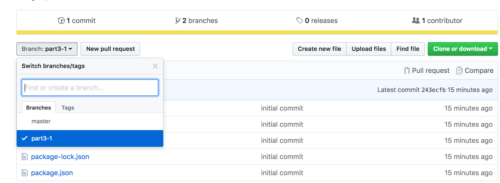

إذا قمت باستنساخ المشروع (Clone)، فقم بتشغيل الأمر _npm install_ قبل بدء تشغيل التطبيق باستخدام _npm start_ أو _npm run dev_.

شيء واحد آخر قبل أن ننتقل إلى التمارين. تبدو دالة إنشاء المعرفات حالياً هكذا:

```js
const generateId = () => {
  const maxId = notes.length > 0
    ? Math.max(...notes.map(n => Number(n.id)))
    : 0
  return String(maxId + 1)
}
```

يحتوي جسم الدالة على سطر يبدو مثيراً للاهتمام بعض الشيء:

```js
Math.max(...notes.map(n => Number(n.id)))
```

ما الذي يحدث بالضبط في هذا السطر من الشيفرة؟ ينشئ <em>notes.map(n => Number(n.id))</em> مصفوفة جديدة تحتوي على جميع معرفات الملاحظات في شكل أرقام. يُرجع [Math.max](https://developer.mozilla.org/en-US/docs/Web/JavaScript/Reference/Global_Objects/Math/max) القيمة القصوى للأرقام التي يتم تمريرها إليه. ومع ذلك، فإن <em>notes.map(n => Number(n.id))</em> هي *مصفوفة (Array)* لذا لا يمكن إعطاؤها مباشرة كمعامل لـ _Math.max_. يمكن تحويل المصفوفة إلى أرقام فردية باستخدام صيغة النشر [نشر المصفوفات (Spread syntax)](https://developer.mozilla.org/en-US/docs/Web/JavaScript/Reference/Operators/Spread_syntax) ذات "النقاط الثلاث" <em>...</em>.

</div>

<div class="tasks">

### تمارين 3.1.-3.6.

**تنبيه:** نظراً لأن هذا لا يتعلق بالواجهة الأمامية و React، فإن التطبيق **لا يتم إنشاؤه** باستخدام Vite، ولكن باستخدام الأمر _npm init_، كما هو موضح سابقاً في هذا الجزء من المادة.

لا تقم بإضافة المجلد *node_modules* إلى نظام التحكم في الإصدارات (Git). لا يقوم الأمر _npm init_ بإنشاء ملف <i>.gitignore</i> تلقائياً، لذا قم بإنشاء ملف في جذر مشروعك وأضف السطر *node_modules* إليه. بهذه الطريقة لن يقوم Git بعد الآن بتتبع هذا المجلد في التحكم في الإصدارات.

**توصية قوية:** عندما تعمل على كود الواجهة الخلفية، راقب دائماً ما يحدث في الطرفية التي تشغل تطبيقك.

#### 3.1: الواجهة الخلفية لدليل الهاتف - الخطوة 1

قم بتنفيذ تطبيق Node يُرجع قائمة مكتوبة مسبقاً (Hardcoded) لمدخلات دليل الهاتف من العنوان <http://localhost:3001/api/persons>.

البيانات:

```js
[
    { 
      "id": "1",
      "name": "Arto Hellas", 
      "number": "040-123456"
    },
    { 
      "id": "2",
      "name": "Ada Lovelace", 
      "number": "39-44-5323523"
    },
    { 
      "id": "3",
      "name": "Dan Abramov", 
      "number": "12-43-234345"
    },
    { 
      "id": "4",
      "name": "Mary Poppendieck", 
      "number": "39-23-6423122"
    }
]
```

المخرجات في المتصفح بعد طلب GET:


لاحظ أن الشرطة المائلة للأمام في المسار <i>api/persons</i> ليست حرفاً خاصاً، وهي تشبه تماماً أي حرف آخر في النص.

يجب أن يبدأ تشغيل التطبيق بالأمر _npm start_.

يجب أن يوفر التطبيق أيضاً أمر _npm run dev_ الذي سيشغل التطبيق ويعيد تشغيل الخادم كلما تم إجراء تغييرات وحفظها في ملف في الشيفرة المصدرية.

#### 3.2: الواجهة الخلفية لدليل الهاتف - الخطوة 2

قم بتنفيذ صفحة على العنوان <http://localhost:3001/info> تبدو تقريباً هكذا:


يجب أن تعرض الصفحة وقت استلام الطلب وعدد المدخلات الموجودة في دليل الهاتف في وقت معالجة الطلب.

#### 3.3: الواجهة الخلفية لدليل الهاتف - الخطوة 3

قم بتنفيذ الوظيفة لعرض المعلومات لمدخل واحد في دليل الهاتف. يجب أن يكون عنوان url للحصول على بيانات شخص بالمعرف 5 هو <http://localhost:3001/api/persons/5>

إذا لم يتم العثور على إدخال للمعرف المحدد، فيجب على الخادم الرد برمز الحالة المناسب.

#### 3.4: الواجهة الخلفية لدليل الهاتف - الخطوة 4

قم بتنفيذ الوظيفة التي تجعل من الممكن حذف إدخال واحد في دليل الهاتف عن طريق إجراء طلب HTTP DELETE إلى عنوان URL الفريد لإدخال دليل الهاتف هذا.

اختبر أن وظيفتك تعمل إما باستخدام Postman أو عميل REST في Visual Studio Code.

#### 3.5: الواجهة الخلفية لدليل الهاتف - الخطوة 5

قم بتوسيع الواجهة الخلفية بحيث يمكن إضافة إدخالات جديدة إلى دليل الهاتف عن طريق إجراء طلبات HTTP POST إلى العنوان <http://localhost:3001/api/persons>.

قم بإنشاء معرف جديد لإدخال دليل الهاتف باستخدام دالة [Math.random](https://developer.mozilla.org/en-US/docs/Web/JavaScript/Reference/Global_Objects/Math/random). استخدم نطاقاً كبيراً بما يكفي لقيمك العشوائية بحيث يكون احتمال إنشاء معرفات مكررة ضئيلاً.

#### 3.6: الواجهة الخلفية لدليل الهاتف - الخطوة 6

قم بتنفيذ معالجة الأخطاء لإنشاء إدخالات جديدة. لا يُسمح للطلب بالنجاح إذا:

- كان الاسم أو الرقم مفقوداً
- كان الاسم موجوداً بالفعل في دليل الهاتف

استجب لطلبات كهذه برمز الحالة المناسب، وأرسل أيضاً معلومات تشرح سبب الخطأ، على سبيل المثال:

```js
{ error: 'name must be unique' }
```

</div>

<div class="content">

### حول أنواع طلبات HTTP

يتحدث [معيار HTTP](https://www.rfc-editor.org/rfc/rfc9110.html#name-common-method-properties) عن خاصيتين مرتبطتين بأنواع الطلبات، وهما **الأمان (Safety)** و **التكرارية المتماثلة (Idempotency)**.

يجب أن يكون طلب HTTP GET *آمناً (Safe)*:

> *على وجه الخصوص، تم وضع اصطلاح مفاده أن طريقتي GET و HEAD لا ينبغي أن يكون لهما مغزى اتخاذ إجراء بخلاف الاسترجاع. يجب اعتبار هذه الطرق "آمنة".*

الأمان يعني أن الطلب المنفذ يجب ألا يسبب أي *آثار جانبية (Side effects)* على الخادم. ونعني بالآثار الجانبية أن حالة قاعدة البيانات يجب ألا تتغير نتيجة للطلب، ويجب أن تُرجع الاستجابة فقط البيانات الموجودة بالفعل على الخادم.

لا شيء يمكن أن يضمن أبداً أن طلب GET *آمن*، فهذه مجرد توصية محددة في معيار HTTP. من خلال الالتزام بمبادئ RESTful في واجهة برمجة التطبيقات الخاصة بنا، يتم دائماً استخدام طلبات GET بطريقة تجعلها *آمنة*.

يحدد معيار HTTP أيضاً نوع الطلب [HEAD](https://www.rfc-editor.org/rfc/rfc9110.html#name-head), والذي يجب أن يكون آمناً. من الناحية العملية، يجب أن يعمل HEAD تماماً مثل GET ولكنه لا يرجع أي شيء سوى رمز الحالة وترويسات الاستجابة. لن يتم إرجاع جسم الاستجابة عند إجراء طلب HEAD.

يجب أن تكون جميع طلبات HTTP باستثناء POST *متماثلة التكرار (Idempotent)*:

> *يمكن أن تتمتع الطرق أيضاً بخاصية "التكرارية المتماثلة" (Idempotence) بحيث (باستثناء مشكلات الخطأ أو انتهاء الصلاحية) تكون الآثار الجانبية لـ N > 0 من الطلبات المتطابقة هي نفسها بالنسبة لطلب واحد. تشترك الطرق GET و HEAD و PUT و DELETE في هذه الخاصية.*

هذا يعني أنه إذا أحدث الطلب آثاراً جانبية، فيجب أن تكون النتيجة هي نفسها بغض النظر عن عدد مرات إرسال الطلب.

إذا أجرينا طلب HTTP PUT إلى عنوان URL المسار <i>/api/notes/10</i> وأرسلنا مع الطلب البيانات <em>{ content: "no side effects!", important: true }</em>، فإن النتيجة تكون واحدة بغض النظر عن عدد مرات إرسال الطلب.

مثل *الأمان* لطلب GET، فإن *التكرارية المتماثلة* هي أيضاً مجرد توصية في معيار HTTP وليست شيئاً يمكن ضمانه ببساطة بناءً على نوع الطلب. ومع ذلك، عندما تلتزم واجهة برمجة التطبيقات الخاصة بنا بمبادئ RESTful، يتم استخدام طلبات GET و HEAD و PUT و DELETE بطريقة تجعلها متماثلة التكرار.

يعد POST هو النوع الوحيد من طلبات HTTP الذي ليس *آمناً* ولا *متماثل التكرار*. إذا أرسلنا 5 طلبات HTTP POST مختلفة إلى <i>/api/notes</i> بجسم يحتوي على <em>{content: "many same", important: true}</em>، فإن الملاحظات الخمس الناتجة على الخادم سيكون لها جميعاً نفس المحتوى ولكن بمعرفات مختلفة كإدخالات مستقلة.

### الوسيط / البرمجيات الوسيطة (Middleware)

إن [محلل JSON (json-parser)](https://expressjs.com/en/5x/api/express/#expressjsonoptions) في Express المستخدم سابقاً هو عبارة عن [برمجية وسيطة (Middleware)](https://expressjs.com/en/resources/middleware/body-parser/).

البرمجيات الوسيطة هي دوال يمكن استخدامها للتعامل مع كائنات _request_ و _response_.

يأخذ json-parser الذي استخدمناه سابقاً البيانات الخام من الطلبات المخزنة في كائن _request_، ويحللها إلى كائن جافاسكريبت ويسندها إلى كائن _request_ كخاصية جديدة <i>body</i>.

عملياً، يمكنك استخدام عدة برمجيات وسيطة في نفس الوقت. عندما يكون لديك أكثر من واحدة، يتم تنفيذها واحدة تلو الأخرى بالترتيب الذي تم إدراجها به في شيفرة التطبيق.

دعنا ننفذ برمجيتنا الوسيطة الخاصة التي تطبع معلومات حول كل طلب يتم إرساله إلى الخادم.

البرمجية الوسيطة هي دالة تستقبل ثلاثة معاملات:

```js
const requestLogger = (request, response, next) => {
  console.log('Method:', request.method)
  console.log('Path:  ', request.path)
  console.log('Body:  ', request.body)
  console.log('---')
  next()
}
```

في نهاية جسم الدالة، يتم استدعاء دالة _next_ التي تم تمريرها كمعامل. تسلم دالة _next_ التحكم إلى البرمجية الوسيطة التالية.

يتم استخدام البرمجية الوسيطة هكذا:

```js
app.use(requestLogger)
```

تذكر، يتم استدعاء دوال البرمجيات الوسيطة بالترتيب الذي يصادفه محرك جافاسكريبت. لاحظ أن _json-parser_ مدرج قبل _requestLogger_، لأنه بخلاف ذلك لن تتم تهيئة <i>request.body</i> عند تنفيذ المسجل (Logger)!

يجب استخدام دوال البرمجيات الوسيطة قبل المسارات (Routes) عندما نريد تنفيذها بواسطة معالجات أحداث المسار. في بعض الأحيان، نريد استخدام دوال البرمجيات الوسيطة بعد المسارات. نفعل ذلك عندما نريد استدعاء دوال البرمجيات الوسيطة فقط في حالة عدم قيام أي معالج مسار بمعالجة طلب HTTP.

دعنا نضيف البرمجية الوسيطة التالية بعد مساراتنا. سيتم استخدام هذه البرمجية الوسيطة للتقاط الطلبات المقدمة إلى مسارات غير موجودة. بالنسبة لهذه الطلبات، ستعيد البرمجية الوسيطة رسالة خطأ بتنسيق JSON.

```js
const unknownEndpoint = (request, response) => {
  response.status(404).send({ error: 'unknown endpoint' })
}

app.use(unknownEndpoint)
```

يمكنك العثور على شيفرة تطبيقنا الحالي بالكامل في الفرع <i>part3-2</i> من [مستودع GitHub هذا](https://github.com/fullstack-hy2020/part3-notes-backend/tree/part3-2).

</div>

<div class="tasks">

### تمارين 3.7.-3.8.

#### 3.7: الواجهة الخلفية لدليل الهاتف - الخطوة 7

أضف البرمجية الوسيطة [morgan](https://github.com/expressjs/morgan) إلى تطبيقك لتسجيل السجلات (Logging). قم بتهيئتها لتسجيل الرسائل في وحدة التحكم الخاصة بك بناءً على تكوين <i>tiny</i>.

توثيق Morgan ليس هو الأفضل، وقد تضطر إلى قضاء بعض الوقت في معرفة كيفية تهيئته بشكل صحيح. ومع ذلك، فإن معظم التوثيقات في العالم تندرج تحت نفس الفئة، لذا من الجيد أن تتعلم فك رموز وتفسير التوثيق الغامض على أي حال.

يتم تثبيت Morgan تماماً مثل جميع المكتبات الأخرى باستخدام الأمر _npm install_. يتم استخدام morgan بنفس طريقة تهيئة أي برمجية وسيطة أخرى باستخدام الأمر _app.use_.

#### 3.8*: الواجهة الخلفية لدليل الهاتف - الخطوة 8

قم بتهيئة morgan بحيث يعرض أيضاً البيانات المرسلة في طلبات HTTP POST:


لاحظ أن تسجيل البيانات حتى في وحدة التحكم يمكن أن يكون خطيراً لأنه قد يحتوي على بيانات حساسة وقد ينتهك قانون الخصوصية المحلي (مثل GDPR في الاتحاد الأوروبي) أو معايير الأعمال. في هذا التمرين، لا داعي للقلق بشأن مشكلات الخصوصية، ولكن عملياً، حاول ألا تسجل أي بيانات حساسة أبداً.

يمكن أن يكون هذا التمرين صعباً للغاية، على الرغم من أن الحل لا يتطلب الكثير من الشيفرات البرمجية.

يمكن إكمال هذا التمرين بعدة طرق مختلفة. يستخدم أحد الحلول الممكنة هاتين التقنيتين:

- [إنشاء رموز جديدة (creating new tokens)](https://github.com/expressjs/morgan#creating-new-tokens)
- [JSON.stringify](https://developer.mozilla.org/en-US/docs/Web/JavaScript/Reference/Global_Objects/JSON/stringify)

</div>
