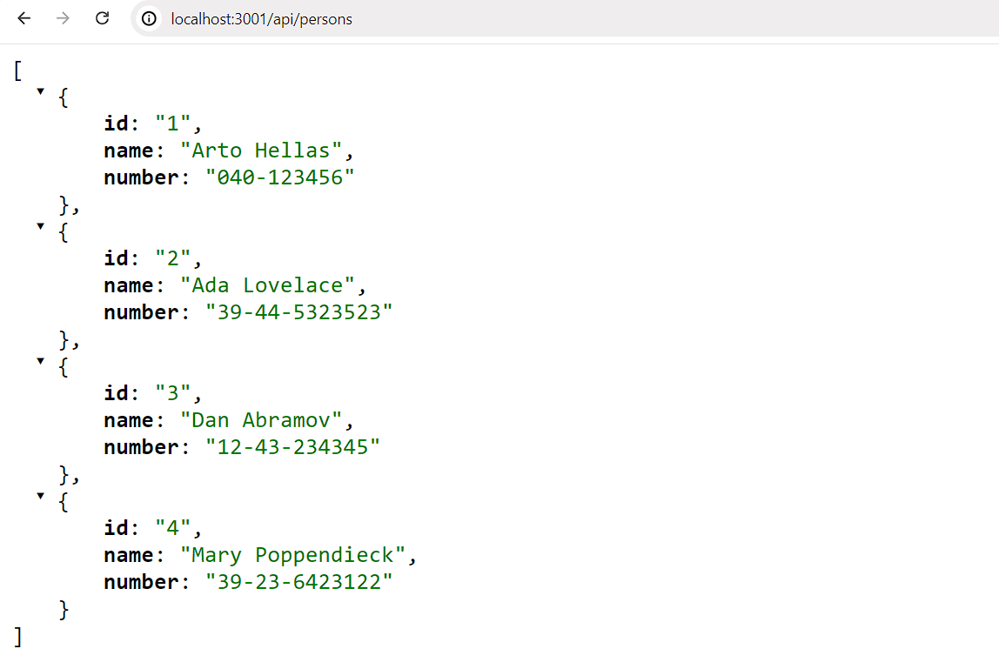
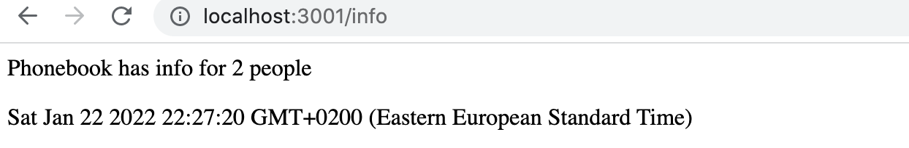

<div class="content">

ينتقل تركيزنا في هذا الجزء نحو **الواجهة الخلفية (Backend)**: أي بناء منطق وبرمجيات الخوادم.

سنبني خادمنا الخلفي اعتماداً على بيئة **[NodeJS](https://nodejs.org/en/)**، وهي بيئة تشغيل لجافاسكريبت مبنية على محرك [Google Chrome V8](https://developers.google.com/v8/).

على عكس بيئة المتصفح التي تتطلب تحويلاً برمجياً (Transpiling) عبر أدوات مثل Babel لدعم المتصفحات القديمة، فإن بيئة Node.js الحديثة (الإصدار 20 و 22) تدعم الغالبية العظمى من أحدث ميزات ومعايير لغة JavaScript مباشرة.

> **تنبيه**: مشاريع الواجهة الخلفية في هذا الجزء ليست تطبيقات React، ولن نستخدم أداة `create-vite`، بل سنقوم بتهيئة المشروع مباشرة باستخدام أداة `npm init`.

---

### تهيئة مشروع Node.js

أنشئ مجلداً جديداً للمشروع ونفذ بداخله:

```bash
npm init -y
```

سيتم إنشاء ملف `package.json` في المجلد الجذري. عدل قسم `scripts` ليصبح كالتالي:

```json
{
  "name": "backend",
  "version": "0.0.1",
  "description": "",
  "main": "index.js",
  "scripts": {
    "start": "node index.js",
    "dev": "node --watch index.js",
    "test": "echo \"Error: no test specified\" && exit 1"
  },
  "author": "Matti Luukkainen",
  "license": "MIT"
}
```

أنشئ الملف `index.js`:

```js
console.log('hello world')
```

يمكن تشغيل البرنامج عبر الأمر:

```bash
npm start
```

---

### بناء خادم ويب بسيط بلغة Node.js الأصلية

لنعدل ملف `index.js` لإنشاء خادم ويب باستخدام مكتبة `http` المدمجة في Node:

```js
const http = require('http')

let notes = [
  {
    id: "1",
    content: "HTML is easy",
    important: true
  },
  {
    id: "2",
    content: "Browser can execute only JavaScript",
    important: false
  },
  {
    id: "3",
    content: "GET and POST are the most important methods of HTTP protocol",
    important: true
  }
]

const app = http.createServer((request, response) => {
  response.writeHead(200, { 'Content-Type': 'application/json' })
  response.end(JSON.stringify(notes))
})

const PORT = 3001
app.listen(PORT)
console.log(`Server running on port ${PORT}`)
```

يستخدم كود Node.js نظام الوحدات **CommonJS** عبر `require('http')` بدلاً من `import`. ويقوم الخادم بالاستماع للطلبات الواردة على المنفذ 3001 وإرجاع مصفوفة الملاحظات كنص JSON بعد تحويلها بواسطة `JSON.stringify(notes)`.

---

### إطار عمل Express

يُعد بناء الخوادم الكبيرة باستخدام مكتبة `http` الأساسية أمراً معقداً وشاقاً. لذلك، نستخدم إطار العمل الأكثر انتشاراً وشهرة في بيئة Node وهو **[Express](http://expressjs.com)**.

لنقم بتثبيت Express:

```bash
npm install express
```

تعتمد إدارة الحزم في npm على **نظام الترقيم الدلالي ([Semantic Versioning](https://docs.npmjs.com/about-semantic-versioning))**:
- الرمز `^5.1.0`: يعني تثبيت أي إصدار فرعي أحدث متوافق في الإصدار الرئيسي 5 (مثل 5.2.0)، دون الترقية إلى الإصدار الرئيسي 6 الذي قد يحمل تغييرات غير متوافقة (Breaking changes).

---

### بناء مسارات الويب مع Express

لنعدل ملف `index.js` باستخدام Express:

```js
const express = require('express')
const app = express()

let notes = [
  {
    id: "1",
    content: "HTML is easy",
    important: true
  },
  {
    id: "2",
    content: "Browser can execute only JavaScript",
    important: false
  },
  {
    id: "3",
    content: "GET and POST are the most important methods of HTTP protocol",
    important: true
  }
]

app.get('/', (request, response) => {
  response.send('<h1>Hello World!</h1>')
})

app.get('/api/notes', (request, response) => {
  response.json(notes)
})

const PORT = 3001
app.listen(PORT, () => {
  console.log(`Server running on port ${PORT}`)
})
```

تتولى دالة `response.json(notes)` تلقائياً تحويل مصفوفة الكائنات إلى نص JSON وضبط ترويسة الاستجابة `Content-Type: application/json`.

---

### المراقبة وإعادة التشغيل التلقائي عبر `node --watch`

بدلاً من إيقاف الخادم يدوياً وإعادة تشغيله مع كل تعديل، نستخدم خيار المراقبة المدمج في Node.js:

```bash
node --watch index.js
```

والذي قمنا بضبطه في أمر `npm run dev`.

---

### معمارية REST والعمليات على الموارد (CRUD)

| العملية | نوع طلب HTTP | المسار | الوظيفة |
| :--- | :--- | :--- | :--- |
| **قراءة الكل** | `GET` | `/api/notes` | استرجاع كافة الملاحظات |
| **قراءة مورد واحد** | `GET` | `/api/notes/:id` | استرجاع ملاحظة محددة بمعرفها |
| **إنشاء مورد** | `POST` | `/api/notes` | إنشاء ملاحظة جديدة |
| **حذف مورد** | `DELETE` | `/api/notes/:id` | حذف الملاحظة المحددة |
| **تحديث مورد** | `PUT` | `/api/notes/:id` | استبدال وتحديث الملاحظة المحددة |

---

### جلب مورد فردي والتعامل مع 404 Not Found

```js
app.get('/api/notes/:id', (request, response) => {
  const id = request.params.id
  const note = notes.find(note => note.id === id)
  
  if (note) {
    response.json(note)
  } else {
    response.status(404).end()
  }
})
```

نصل للمعرف عبر `request.params.id`. وإذا لم تكن الملاحظة موجودة، نرد برمز الحالة **404 Not Found**.

---

### حذف الموارد (Deleting resources)

```js
app.delete('/api/notes/:id', (request, response) => {
  const id = request.params.id
  notes = notes.filter(note => note.id !== id)

  response.status(204).end()
})
```

عند نجاح الحذف، يرد الخادم برمز الحالة **204 No Content** بدون بيانات.

---

### أدوات اختبار الواجهات الخلفية (Postman و REST Client)

- **[Postman](https://www.postman.com/downloads/)**: برنامج متكامل لإرسال كافة أنواع طلبات HTTP وفحص الاستجابات والترويسات.
- **[VS Code REST Client](https://marketplace.visualstudio.com/items?itemName=humao.rest-client)**: إضافة لمحرر VS Code تتيح كتابة وحفظ طلبات HTTP في ملفات `.rest` داخل المشروع ومشاركتها مع الفريق:

```text
GET http://localhost:3001/api/notes/

###
POST http://localhost:3001/api/notes/ HTTP/1.1
content-type: application/json

{
    "content": "VS Code REST client is great",
    "important": false
}
```

---

### استقبال البيانات ومحلل JSON البرمجي (express.json)

لاستقبال البيانات المرسلة في جسم الطلب (Request Body) بصيغة JSON، يجب تفعيل برمجية **`express.json()`**:

```js
app.use(express.json())

const generateId = () => {
  const maxId = notes.length > 0
    ? Math.max(...notes.map(n => Number(n.id)))
    : 0
  return String(maxId + 1)
}

app.post('/api/notes', (request, response) => {
  const body = request.body

  if (!body.content) {
    return response.status(400).json({ 
      error: 'content missing' 
    })
  }

  const note = {
    content: body.content,
    important: Boolean(body.important) || false,
    id: generateId(),
  }

  notes = notes.concat(note)
  response.json(note)
})
```

إذا كانت البيانات المرسلة تفتقر إلى الخاصية `content`، يرد الخادم برمز الخطأ **400 Bad Request**.

---

### خصائص طلبات HTTP: الأمان والتكرارية المحايدة (Safety & Idempotence)

- **الأمان (Safety)**: طلبات `GET` و `HEAD` يجب أن تكون آمنة، أي لا تتسبب في أي آثار جانبية (Side effects) تؤدي لتعديل البيانات في قاعدة البيانات.
- **التكرارية المحايدة (Idempotence)**: طلبات `GET` و `HEAD` و `PUT` و `DELETE` يجب أن تكون محايدة التكرار؛ أي أن إرسال الطلب $N$ مرة يُعطي نفس النتيجة تماماً على الخادم كما لو أُرسل مرة واحدة.
- طلبات `POST` **ليست آمنة وليست محايدة التكرار**؛ فإرسال 5 طلبات POST متطابقة يؤدي لإنشاء 5 موارد مكررة جديدة.

---

### البرمجيات الوسيطة (Middleware)

البرمجية الوسيطة (Middleware) هي دالة تعترض وتتعامل مع كائني الطلب `request` والاستجابة `response`:

```js
const requestLogger = (request, response, next) => {
  console.log('Method:', request.method)
  console.log('Path:  ', request.path)
  console.log('Body:  ', request.body)
  console.log('---')
  next() // تمرير التحكم للبرمجية التالية
}

app.use(requestLogger)
```

تُنفذ البرمجيات الوسيطة بالترتيب المتسلسل لتعريفها في الكود.

للتعامل مع المسارات غير الموجودة، نضع برمجية وسيطة في نهاية الملف بعد كافة المسارات:

```js
const unknownEndpoint = (request, response) => {
  response.status(404).send({ error: 'unknown endpoint' })
}

app.use(unknownEndpoint)
```

</div>

<div class="tasks">

<h3>التمارين 3.1 - 3.8: خادم دليل الهاتف</h3>

<h4>3.1: خادم دليل الهاتف - الخطوة 1 (Phonebook backend step 1)</h4>
أنشئ تطبيق Node.js مع Express يُرجع قائمة جهات الاتصال الأولية كبيانات JSON عبر المسار `http://localhost:3001/api/persons`.

```json
[
  { "id": "1", "name": "Arto Hellas", "number": "040-123456" },
  { "id": "2", "name": "Ada Lovelace", "number": "39-44-5323523" },
  { "id": "3", "name": "Dan Abramov", "number": "12-43-234345" },
  { "id": "4", "name": "Mary Poppendieck", "number": "39-23-6423122" }
]
```



<h4>3.2: خادم دليل الهاتف - الخطوة 2 (Phonebook backend step 2)</h4>
أنشئ صفحة عبر المسار `http://localhost:3001/info` تعرض إجمالي عدد جهات الاتصال وتاريخ ووقت استلام الطلب:



<h4>3.3: خادم دليل الهاتف - الخطوة 3 (Phonebook backend step 3)</h4>
اعرض بيانات جهة اتصال فردية عبر المسار `http://localhost:3001/api/persons/:id`. وإذا لم يُعثر على المعرف، أرجع رمز الحالة 404.

<h4>3.4: خادم دليل الهاتف - الخطوة 4 (Phonebook backend step 4)</h4>
أتح حذف جهة اتصال عبر طلب `HTTP DELETE` إلى المسار `http://localhost:3001/api/persons/:id`.

<h4>3.5: خادم دليل الهاتف - الخطوة 5 (Phonebook backend step 5)</h4>
أتح إضافة جهة اتصال جديدة عبر طلب `HTTP POST` إلى المسار `http://localhost:3001/api/persons`. ولّد معرفاً فريداً عشوائياً باستخدام `Math.random()`.

<h4>3.6: خادم دليل الهاتف - الخطوة 6 (Phonebook backend step 6)</h4>
أضف التحقق من المدخلات:
- إذا كان الاسم أو الرقم مفقوداً: أرجع رمز الحالة 400 مع رسالة خطأ `{ error: 'name or number missing' }`.
- إذا كان الاسم موجوداً مسبقاً في الدليل: أرجع رمز الحالة 400 مع رسالة `{ error: 'name must be unique' }`.

<h4>3.7: خادم دليل الهاتف - الخطوة 7 (Phonebook backend step 7)</h4>
ثبّت وسيط التسجيل **[morgan](https://github.com/expressjs/morgan)** وفعله بالتكوين `tiny`:
```js
const morgan = require('morgan')
app.use(morgan('tiny'))
```

<h4>3.8*: خادم دليل الهاتف - الخطوة 8 (Phonebook backend step 8)</h4>
خصص وسيط `morgan` بحيث يطبع في الكونسول جسم الطلب (Request Body) للبيانات المرسلة في طلبات HTTP POST باستخدام `morgan.token()` و `JSON.stringify(request.body)`.


</div>
