<div class="content">

بعد ذلك، دعونا نربط الواجهة الأمامية (Frontend) التي أنشأناها في [الجزء 2](/ar/part2) بالواجهة الخلفية المعتمدة على Express التي بنيناها في الجزء 3a.

في الجزء 2، كانت الواجهة الأمامية تجلب الملاحظات من json-server عبر الرابط http://localhost:3001/notes. أما الواجهة الخلفية التي بنيناها باستخدام Express في هذا الجزء فلها بنية عنوان URL مختلفة قليلاً — حيث تتوفر الملاحظات الآن على http://localhost:3001/api/notes. دعنا نغير السمة __baseUrl__ في تطبيق الملاحظات للواجهة الأمامية في الملف <i>src/services/notes.js</i> هكذا:

```js
import axios from 'axios'
const baseUrl = 'http://localhost:3001/api/notes' //highlight-line

const getAll = () => {
  const request = axios.get(baseUrl)
  return request.then(response => response.data)
}

// ...

export default { getAll, create, update }
```

الآن، لسبب ما، لا يعمل طلب GET الصادر من الواجهة الأمامية إلى <http://localhost:3001/api/notes>:


ما الذي يحدث هنا؟ يمكننا الوصول إلى الواجهة الخلفية من المتصفح ومن Postman دون أي مشاكل على الإطلاق.

### سياسة نفس الأصل و CORS (Same origin policy and CORS)

تكمن المشكلة فيما يسمى *سياسة نفس الأصل (Same-origin policy)*. يتحدد أصل عنوان URL (Origin) من خلال الجمع بين البروتوكول (Protocol أو Scheme)، واسم المضيف (Hostname)، والمنفذ (Port).

```text
http://example.com:80/index.html
  
protocol: http
host: example.com
port: 80
```

عندما تزور موقع ويب (مثل <http://example.com>)، يرسل المتصفح طلباً إلى الخادم الذي يستضيف الموقع (example.com). الاستجابة المرسلة من الخادم عبارة عن ملف HTML قد يحتوي على مرجع أو أكثر لملفات/موارد خارجية مستضافة إما على نفس الخادم الذي يستضيف <i>example.com</i> أو على موقع ويب مختلف. عندما يرى المتصفح مراجع لعنوان URL في كود HTML المصدر، فإنه يرسل طلباً. إذا تم إرسال الطلب باستخدام نفس عنوان URL الذي تم جلب كود HTML المصدر منه، فإن المتصفح يعالج الاستجابة دون أي مشاكل. ومع ذلك، إذا تم جلب المورد باستخدام عنوان URL لا يشترك في نفس الأصل (البروتوكول، والمضيف، والمنفذ) مثل كود HTML المصدر، فسيتعين على المتصفح التحقق من ترويسة استجابة _Access-Control-Allow-Origin_. إذا كانت تحتوي على _*_ أو على عنوان URL الخاص بكود HTML المصدر، فسيقوم المتصفح بمعالجة الاستجابة، وإلا فإن المتصفح سيرفض معالجتها ويطلق خطأ.
  
تُعد **سياسة نفس الأصل (Same-origin policy)** آلية أمان مطبقة بواسطة المتصفحات لمنع اختطاف الجلسات (Session hijacking) وغيرها من الثغرات الأمنية.

من أجل تمكين الطلبات المشروعة عبر الأصول المختلفة (الطلبات المرسلة إلى عناوين URL التي لا تشترك في نفس الأصل)، ابتكرت منظمة W3C آلية تسمى **CORS** (مشاركة الموارد عبر الأصول المختلفة - Cross-Origin Resource Sharing). وفقاً لموقع [ويكيبيديا](https://en.wikipedia.org/wiki/Cross-origin_resource_sharing):

> *تعد مشاركة الموارد عبر الأصول المختلفة (CORS) آلية تسمح بطلب الموارد المقيدة (مثل الخطوط) على صفحة ويب من نطاق آخر خارج النطاق الذي تم تقديم المورد الأول منه. يجوز لصفحة الويب تضمين الصور وأوراق الأنماط والسكربتات والأطر المضمنة (iframes) ومقاطع الفيديو من أصول مختلفة بحرية. تُحظر بعض الطلبات "عبر النطاقات"، ولا سيما طلبات Ajax، افتراضياً بواسطة سياسة أمان نفس الأصل.*

المشكلة هي أنه، بشكل افتراضي، لا يمكن لشيفرة جافاسكريبت لتطبيق يعمل في المتصفح التواصل إلا مع خادم يقع في نفس [الأصل (Origin)](https://developer.mozilla.org/en-US/docs/Web/Security/Same-origin_policy).
نظراً لأن خادمنا يعمل على المنفذ 3001 في localhost، بينما تعمل واجهتنا الأمامية على المنفذ 5173 في localhost، فإنهما لا يشتركان في نفس الأصل.

ضع في اعتبارك أن [سياسة نفس الأصل](https://developer.mozilla.org/en-US/docs/Web/Security/Same-origin_policy) و CORS ليسا خاصين بـ React أو Node. بل هما مبادئ عالمية تتعلق بالتشغيل الآمن لتطبيقات الويب.

يمكننا السماح بالطلبات من *أصول أخرى* باستخدام البرمجية الوسيطة [cors](https://github.com/expressjs/cors) في Node.

في مستودع الواجهة الخلفية لديك، قم بتثبيت *cors* باستخدام الأمر:

```bash
npm install cors
```

استخدم البرمجية الوسيطة واسمح بالطلبات من جميع الأصول:

```js
const cors = require('cors')

app.use(cors())
```

**ملاحظة:** عندما تقوم بتمكين cors، يجب أن تفكر في كيفية تهيئته. في حالة تطبيقنا، نظراً لأنه من غير المتوقع أن تكون الواجهة الخلفية مرئية للعامة في بيئة الإنتاج، فقد يكون من المنطقي أكثر تمكين cors فقط من أصل محدد (مثل الواجهة الأمامية).

الآن تعمل معظم الميزات في الواجهة الأمامية! لم يتم بعد تنفيذ وظيفة تغيير أهمية الملاحظات على الواجهة الخلفية، لذا بطبيعة الحال لا تعمل تلك الميزة بعد في الواجهة الأمامية. سنصلح ذلك لاحقاً.

يمكنك قراءة المزيد حول CORS من [صفحة موزيلا (MDN)](https://developer.mozilla.org/en-US/docs/Web/HTTP/CORS).

يبدو إعداد تطبيقنا الآن كما يلي:

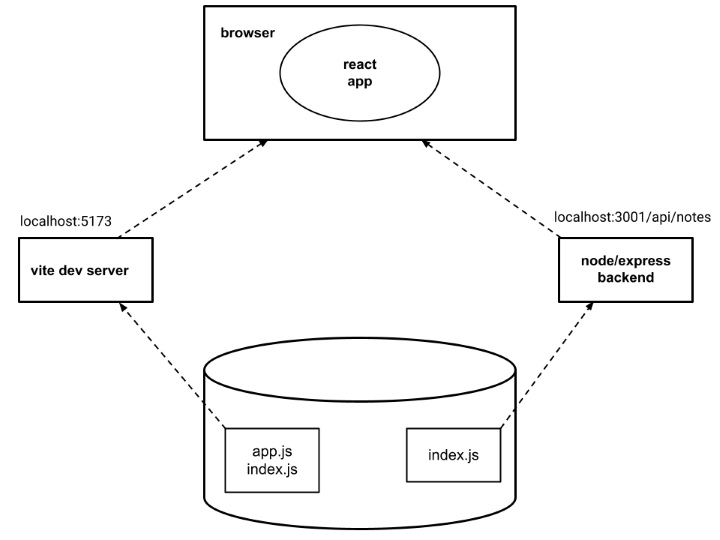

يقوم تطبيق react الذي يعمل في المتصفح الآن بجلب البيانات من خادم node/express الذي يعمل على localhost:3001.

### نشر التطبيق على الإنترنت (Application to the Internet)

الآن بعد أن أصبحت حزمة التطوير الكاملة (Full Stack) جاهزة، دعنا ننقل تطبيقنا إلى الإنترنت.

هناك عدد متزايد باستمرار من الخدمات التي يمكن استخدامها لاستضافة تطبيق على الإنترنت. تهتم الخدمات الصديقة للمطورين مثل PaaS (أي النظام الأساسي كخدمة - Platform as a Service) بتثبيت بيئة التشغيل (مثل Node.js) ويمكنها أيضاً توفير خدمات متنوعة مثل قواعد البيانات.

لعقد من الزمان، كانت [Heroku](http://heroku.com) تهيمن على ساحة خدمات PaaS. للأسف، انتهت الخطة المجانية لـ Heroku في 27 نوفمبر 2022. هذا أمر مؤسف للغاية للعديد من المطورين، وخاصة الطلاب. لا تزال Heroku خياراً قابلاً للتطبيق بشكل كبير إذا كنت على استعداد لإنفاق بعض المال. ولديهم أيضاً [برنامج للطلاب](https://www.heroku.com/students) يقدم بعض الرصيد المجاني.

نقدم الآن خدمتين هما [Fly.io](https://fly.io/) و [Render](https://render.com/). توفر Fly.io مرونة أكبر كخدمة، لكنها أصبحت أيضاً مدفوعة مؤخراً. تقدم Render بعض وقت الحوسبة المجاني، لذا إذا كنت ترغب في إكمال الدورة دون تكاليف، فاختر Render. قد يكون إعداد Render أسهل أيضاً في بعض الحالات، حيث لا تتطلب Render أي تثبيتات على جهازك الخاص.

هناك أيضاً بعض خيارات الاستضافة المجانية الأخرى التي تعمل بشكل جيد لهذه الدورة، على الأقل لجميع الأجزاء بخلاف الجزء 11 (CI/CD) والذي قد يحتوي على تمرين واحد صعب على منصات أخرى.

استخدم بعض المشاركين في الدورة الخدمات التالية أيضاً:

- [Replit](https://replit.com)
- [Railway](https://railway.app)
- [CodeSandBox](https://codesandbox.io)

إذا كنت تعرف خدمات مجانية وسهلة الاستخدام لاستضافة NodeJS، فيرجى إخبارنا بذلك!

لكل من Fly.io و Render، نحتاج إلى تغيير تعريف المنفذ الذي يستخدمه تطبيقنا في الجزء السفلي من ملف <i>index.js</i> في الواجهة الخلفية هكذا:

```js
const PORT = process.env.PORT || 3001  // highlight-line
app.listen(PORT, () => {
  console.log(`Server running on port ${PORT}`)
})
```

الآن نحن نستخدم المنفذ المحدد في [متغير البيئة (Environment variable)](https://en.wikipedia.org/wiki/Environment_variable) _PORT_ أو المنفذ 3001 إذا كان متغير البيئة _PORT_ غير محدد. من الممكن تكوين منفذ التطبيق بناءً على متغير البيئة في كل من Fly.io و Render.

#### منصة Fly.io

<i>لاحظ أنك قد تحتاج إلى تقديم رقم بطاقتك الائتمانية لـ Fly.io!</i>

إذا قررت استخدام [Fly.io](https://fly.io/)، فابدأ بتثبيت ملف flyctl التنفيذي باتباع [هذا الدليل](https://fly.io/docs/hands-on/install-flyctl/). بعد ذلك، يجب عليك [إنشاء حساب Fly.io](https://fly.io/docs/hands-on/sign-up/).

ابدأ بـ [تسجيل الدخول والمصادقة](https://fly.io/docs/hands-on/sign-in/) عبر سطر الأوامر باستخدام الأمر:

```bash
fly auth login
```

لاحظ إذا كان الأمر _fly_ لا يعمل على جهازك، يمكنك تجربة الإصدار الأطول _flyctl_. على سبيل المثال في نظام MacOS، يعمل كلا شكلي الأمر.

<i>إذا لم تتمكن من تشغيل flyctl على جهازك، فيمكنك تجربة Render (انظر القسم التالي)، فهي لا تتطلب تثبيت أي شيء على جهازك.</i>

تتم تهيئة التطبيق عن طريق تشغيل الأمر التالي في المجلد الجذري للتطبيق:

```bash
fly launch --no-deploy
```

امنح التطبيق اسماً أو اترك Fly.io ينشئ اسماً تلقائياً. اختر منطقة (Region) سيتم تشغيل التطبيق فيها. لا تنشئ قاعدة بيانات Postgres للتطبيق ولا تنشئ قاعدة بيانات Upstash Redis، حيث إن هذه الأشياء ليست مطلوبة في الوقت الحالي.
  
تنشئ Fly.io ملف <i>fly.toml</i> في جذر تطبيقك حيث يمكننا تهيئته. لتشغيل التطبيق، *قد* نحتاج إلى إجراء إضافة صغيرة إلى التهيئة:

```bash
[build]

[env]
  PORT = "3001" # add this

[http_service]
  internal_port = 3001 # ensure that this is same as PORT
  force_https = true
  auto_stop_machines = true
  auto_start_machines = true
  min_machines_running = 0
  processes = ["app"]
```

لقد حددنا الآن في الجزء [env] أن متغير البيئة PORT سيحصل على المنفذ الصحيح (المحدد في الجزء [http_service]) حيث يجب على التطبيق إنشاء الخادم.

نحن الآن جاهزون لنشر التطبيق على خوادم Fly.io. يتم ذلك باستخدام الأمر التالي:

```bash
fly deploy
```

إذا سارت الأمور على ما يرام، فيجب أن يكون التطبيق قيد التشغيل الآن. يمكنك فتحه في المتصفح باستخدام الأمر:

```bash
fly apps open
```

من الأوامر المهمة بشكل خاص أمر _fly logs_. يمكن استخدام هذا الأمر لعرض سجلات الخادم. من الأفضل إبقاء السجلات مرئية دائماً!

**ملاحظة:** قد تنشئ Fly جهازين (2 machines) لتطبيقك، وإذا حدث ذلك، فستكون حالة البيانات في تطبيقك غير متسقة بين الطلبات، أي سيكون لديك جهازان لكل منهما متغير الملاحظات notes الخاص به؛ يمكنك إجراء POST لجهاز واحد ثم قد يذهب طلب GET التالي إلى الجهاز الآخر. يمكنك التحقق من عدد الأجهزة باستخدام الأمر `fly scale show$`، وإذا كان الـ COUNT أكبر من 1، فيمكنك فرض أن يكون 1 باستخدام الأمر `fly scale count 1$`. يمكن أيضاً التحقق من عدد الأجهزة على لوحة التحكم (Dashboard).

**ملاحظة:** في بعض الحالات (السبب غير معروف حتى الآن) تسبب تشغيل أوامر Fly.io خاصة على Windows WSL (نظام Windows الفرعي للينكس) في حدوث مشكلات. إذا توقف الأمر التالي دون استجابة:

```bash
flyctl ping -o personal
```

فإن جهاز الكمبيوتر الخاص بك لا يمكنه لسبب ما الاتصال بـ Fly.io. إذا حدث هذا معك، فإن [هذا الرابط](https://github.com/fullstack-hy2020/misc/blob/master/fly_io_problem.md) يصف إحدى الطرق الممكنة للمتابعة.

إذا كانت مخرجات الأمر أدناه تبدو هكذا:

```bash
$ flyctl ping -o personal
35 bytes from fdaa:0:8a3d::3 (gateway), seq=0 time=65.1ms
35 bytes from fdaa:0:8a3d::3 (gateway), seq=1 time=28.5ms
35 bytes from fdaa:0:8a3d::3 (gateway), seq=2 time=29.3ms
...
```

فلا توجد مشكلات في الاتصال!

كلما أجريت تغييرات على التطبيق، يمكنك نقل الإصدار الجديد إلى الإنتاج باستخدام الأمر:

```bash
fly deploy
```

#### منصة Render

<i>لاحظ أنك قد تحتاج إلى تقديم رقم بطاقتك الائتمانية لـ Render!</i>

يفترض ما يلي أن [تسجيل الدخول](https://dashboard.render.com/) قد تم باستخدام حساب GitHub.

بعد تسجيل الدخول، دعنا ننشئ "خدمة ويب (Web Service)" جديدة:

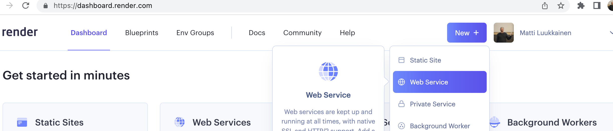

يتم بعد ذلك ربط مستودع التطبيق بـ Render:

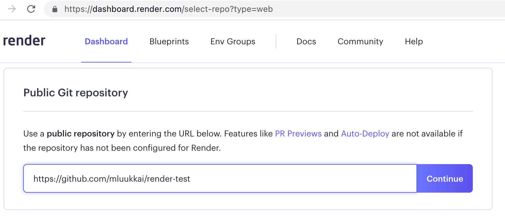

يبدو أن الاتصال يتطلب أن يكون مستودع التطبيق عاماً (Public).

بعد ذلك سنحدد التكوينات الأساسية. إذا كان التطبيق *ليس* في جذر المستودع، فيجب إعطاء *Root directory* قيمة مناسبة:

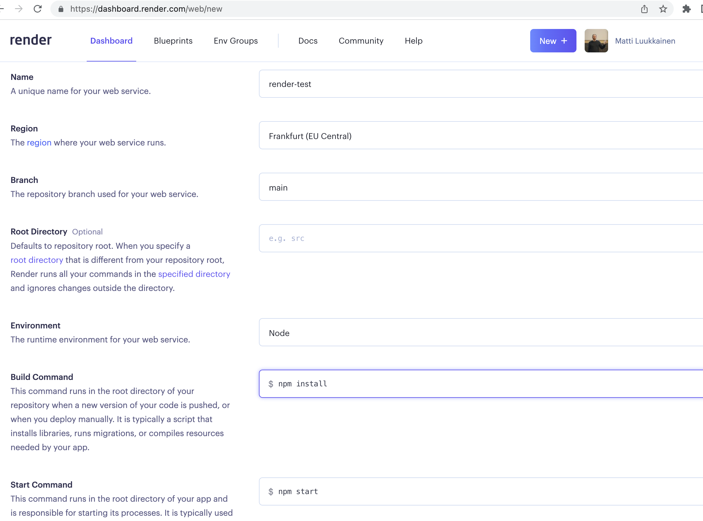

بعد ذلك، يبدأ التطبيق في العمل على Render. تخبرنا لوحة التحكم بحالة التطبيق وعنوان URL الذي يعمل عليه التطبيق:

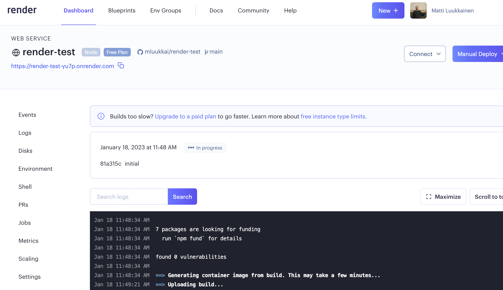

وفقاً لـ [التوثيق](https://render.com/docs/deploys)، يجب أن تؤدي كل عملية إيداع (Commit) إلى GitHub إلى إعادة نشر التطبيق تلقائياً. لسبب ما، هذا لا يعمل دائماً.

لحسن الحظ، من الممكن أيضاً إعادة نشر التطبيق يدوياً:

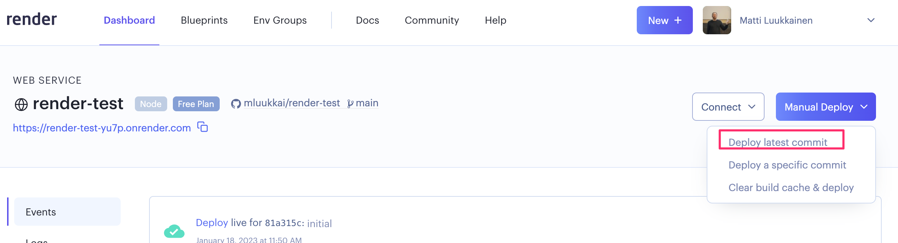

أيضاً، يمكن رؤية سجلات التطبيق في لوحة التحكم:


نلاحظ الآن من السجلات أن التطبيق قد تم تشغيله على المنفذ 10000. تحصل شيفرة التطبيق على المنفذ الصحيح من خلال متغير البيئة PORT لذا من الضروري تحديث الملف <i>index.js</i> في الواجهة الخلفية على النحو التالي:

```js
const PORT = process.env.PORT || 3001  // highlight-line
app.listen(PORT, () => {
  console.log(`Server running on port ${PORT}`)
})
```

### بناء الواجهة الأمامية للإنتاج (Frontend production build)

حتى الآن، كنا نقوم بتشغيل كود React في *وضع التطوير (Development mode)*. في وضع التطوير، يتم تكوين التطبيق لتقديم رسائل خطأ واضحة، وتصيير تغييرات الكود على الفور في المتصفح، وما إلى ذلك.

عندما يتم نشر التطبيق، يجب علينا إنشاء [بناء الإنتاج (Production build)](https://vitejs.dev/guide/build.html) أو نسخة من التطبيق محسنة للإنتاج.

يمكن إنشاء بناء إنتاج للتطبيقات التي تم إنشاؤها باستخدام Vite باستخدام الأمر [npm run build](https://vitejs.dev/guide/build.html).

دعنا نشغل هذا الأمر من *جذر مشروع الواجهة الأمامية للملاحظات* الذي طورناه في [الجزء 2](/ar/part2).

يؤدي هذا إلى إنشاء مجلد يسمى <i>dist</i> يحتوي على ملف HTML الوحيد لتطبيقنا (<i>index.html</i>) والمجلد <i>assets</i>. سيتم إنشاء نسخة [مختزلة/مصغرة (Minified)](<https://en.wikipedia.org/wiki/Minification_(programming)>) من كود جافاسكريبت الخاص بتطبيقنا في مجلد <i>dist</i>. على الرغم من أن شيفرة التطبيق موزعة عبر ملفات متعددة، إلا أنه سيتم تجميع وتصغير جميع أكواد جافاسكريبت في ملف واحد. كما سيتم أيضاً تقليص جميع الأكواد من جميع تبعيات التطبيق في هذا الملف الفردي.

الشيفرة المصغرة ليست قابلة للقراءة بسهولة. بداية الشيفرة تبدو هكذا:

```js
!function(e){function r(r){for(var n,f,i=r[0],l=r[1],a=r[2],c=0,s=[];c<i.length;c++)f=i[c],o[f]&&s.push(o[f][0]),o[f]=0;for(n in l)Object.prototype.hasOwnProperty.call(l,n)&&(e[n]=l[n]);for(p&&p(r);s.length;)s.shift()();return u.push.apply(u,a||[]),t()}function t(){for(var e,r=0;r<u.length;r++){for(var t=u[r],n=!0,i=1;i<t.length;i++){var l=t[i];0!==o[l]&&(n=!1)}n&&(u.splice(r--,1),e=f(f.s=t[0]))}return e}var n={},o={2:0},u=[];function f(r){if(n[r])return n[r].exports;var t=n[r]={i:r,l:!1,exports:{}};return e[r].call(t.exports,t,t.exports,f),t.l=!0,t.exports}f.m=e,f.c=n,f.d=function(e,r,t){f.o(e,r)||Object.defineProperty(e,r,{enumerable:!0,get:t})},f.r=function(e){"undefined"!==typeof Symbol&&Symbol.toStringTag&&Object.defineProperty(e,Symbol.toStringTag,{value:"Module"})
```

### تقديم الملفات الثابتة من الواجهة الخلفية (Serving static files from the backend)

تتمثل إحدى طرق نشر الواجهة الأمامية في نسخ بناء الإنتاج (المجلد <i>dist</i>) إلى جذر مجلد الواجهة الخلفية وتهيئة الواجهة الخلفية لعرض *الصفحة الرئيسية* للواجهة الأمامية (الملف <i>dist/index.html</i>) كصفحتها الرئيسية.

نبدأ بنسخ بناء الإنتاج للواجهة الأمامية إلى جذر الواجهة الخلفية. في أجهزة Mac أو Linux، يمكن إجراء النسخ من مجلد الواجهة الأمامية باستخدام الأمر:

```bash
cp -r dist ../backend
```

إذا كنت تستخدم جهاز كمبيوتر يعمل بنظام Windows، فيمكنك استخدام إما أمر [copy](https://www.windows-commandline.com/windows-copy-command-syntax-examples/) أو أمر [xcopy](https://www.windows-commandline.com/xcopy-command-syntax-examples/) بدلاً من ذلك. خلاف ذلك، ما عليك سوى النسخ واللصق يدوياً.

يجب أن يبدو مجلد الواجهة الخلفية الآن كما يلي:

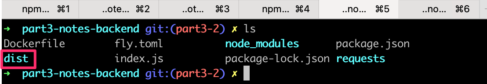

لجعل Express يعرض *المحتوى الثابت (Static content)*، مثل الصفحة <i>index.html</i> وجافاسكريبت وغيرها من الموارد التي تجلبها، نحتاج إلى برمجية وسيطة مدمجة من Express تسمى [static](http://expressjs.com/en/starter/static-files.html).

عندما نضيف السطر التالي وسط تعريفات البرمجيات الوسيطة:

```js
app.use(express.static('dist'))
```

كلما استقبل Express طلب HTTP GET، فإنه سيتحقق أولاً مما إذا كان المجلد <i>dist</i> يحتوي على ملف يتوافق مع عنوان الطلب. إذا تم العثور على ملف مطابق، فسيقوم Express بإرجاعه.

الآن، ستعرض طلبات HTTP GET المرسلة إلى العنوان <i>www.serversaddress.com/index.html</i> أو <i>www.serversaddress.com</i> واجهة React الأمامية. بينما ستتم معالجة طلبات GET المرسلة إلى العنوان <i>www.serversaddress.com/api/notes</i> بواسطة كود الواجهة الخلفية.

نظراً لوضعنا، حيث توجد كل من الواجهة الأمامية والواجهة الخلفية في نفس العنوان، يمكننا الإعلان عن _baseUrl_ كعنوان URL [نسبي (Relative)](https://www.w3.org/TR/WD-html40-970917/htmlweb.html#h-5.1.2). هذا يعني أنه يمكننا ترك الجزء الذي يحدد الخادم.

```js
import axios from 'axios'
const baseUrl = '/api/notes' // highlight-line

const getAll = () => {
  const request = axios.get(baseUrl)
  return request.then(response => response.data)
}

// ...
```

بعد هذا التغيير، يتعين علينا إنشاء بناء إنتاج جديد للواجهة الأمامية ونسخه إلى جذر مجلد الواجهة الخلفية.

يمكن الآن استخدام التطبيق من عنوان *الواجهة الخلفية* <http://localhost:3001>:

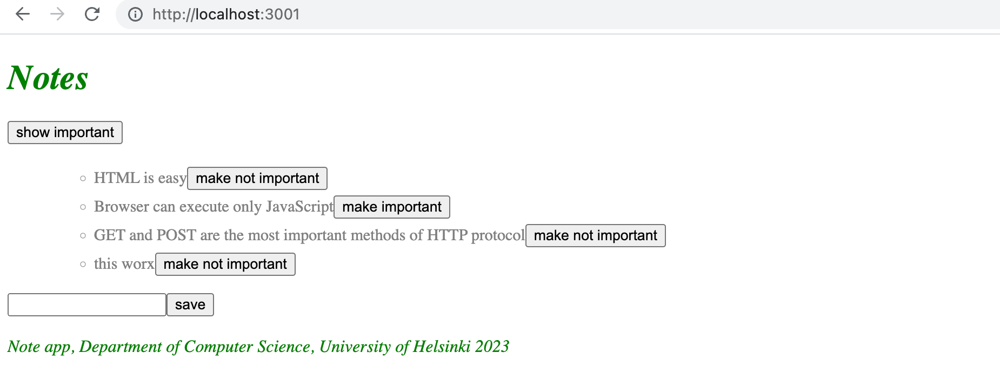

يعمل تطبيقنا الآن تماماً مثل تطبيق [تطبيق الصفحة الواحدة (Single-page app)](/ar/part0/fundamentals_of_web_apps#single-page-app) النموذجي الذي درسناه في الجزء 0.

عندما نستخدم متصفحاً للذهاب إلى العنوان <http://localhost:3001>، يرجع الخادم ملف <i>index.html</i> من مجلد <i>dist</i>. محتويات الملف هي كما يلي:

```html
<!doctype html>
<html lang="en">
  <head>
    <meta charset="UTF-8" />
    <link rel="icon" type="image/svg+xml" href="/vite.svg" />
    <meta name="viewport" content="width=device-width, initial-scale=1.0" />
    <title>Vite + React</title>
    <script type="module" crossorigin src="/assets/index-5f6faa37.js"></script>
    <link rel="stylesheet" href="/assets/index-198af077.css">
  </head>
  <body>
    <div id="root"></div>
    
  </body>
</html>
```

يحتوي الملف على تعليمات لجلب ورقة أنماط CSS التي تحدد أنماط التطبيق، ووسم <i>script</i> واحد يوجه المتصفح لجلب كود جافاسكريبت الخاص بالتطبيق - تطبيق React الفعلي.

يجلب كود React الملاحظات من عنوان الخادم <http://localhost:3001/api/notes> ويصيرها على الشاشة. يمكن رؤية الاتصال بين الخادم والمتصفح في تبويب *الشبكة (Network)* في وحدة تحكم المطور:

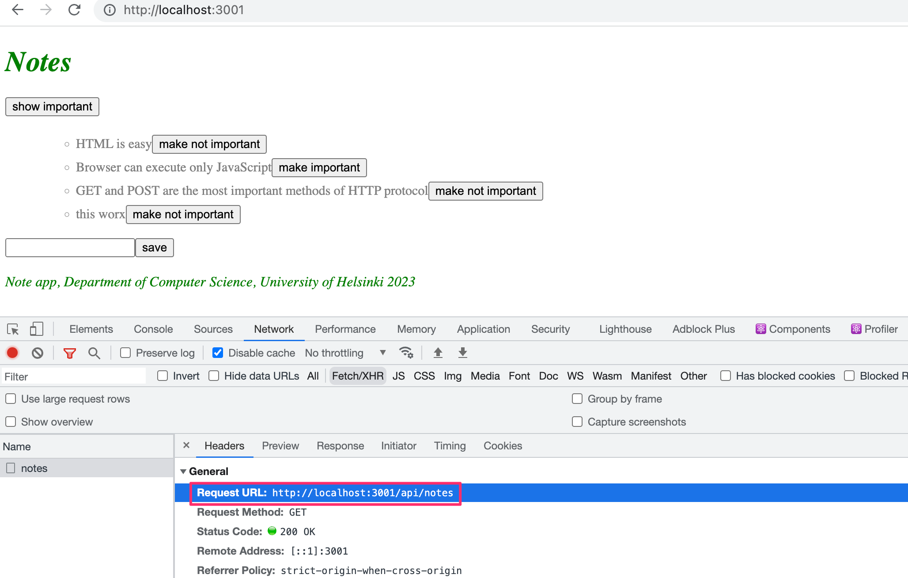

يبدو الإعداد الجاهز لنشر المنتج كما يلي:

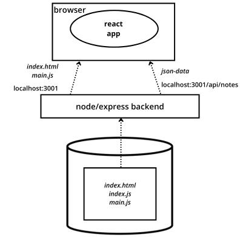

على عكس تشغيل التطبيق في بيئة التطوير، أصبح كل شيء الآن في نفس واجهة node/express الخلفية التي تعمل على localhost:3001. عندما ينتقل المتصفح إلى الصفحة، يتم تصيير الملف <i>index.html</i>. يؤدي ذلك إلى قيام المتصفح بجلب نسخة الإنتاج من تطبيق React. بمجرد أن يبدأ في العمل، فإنه يجلب بيانات json من العنوان localhost:3001/api/notes.

### التطبيق كاملاً إلى الإنترنت (The whole app to the internet)

بعد التأكد من أن نسخة الإنتاج من التطبيق تعمل محلياً، نحن مستعدون لنقل التطبيق بأكمله إلى خدمة الاستضافة المختارة.

**في حالة Fly.io** يتم إجراء النشر الجديد بالأمر:

```bash
fly deploy
```

**ملاحظة:** يسرد ملف _.dockerignore_ في مجلد مشروعك الملفات التي لم يتم تحميلها أثناء النشر. قد يتم تضمين مجلد dist افتراضياً. إذا كان الأمر كذلك، فقم بإزالة إشارته من ملف dockerignore.، مع التأكد من نشر تطبيقك بشكل صحيح.

**في حالة Render**، قم بإيداع التغييرات (Commit)، ودفع الشيفرة إلى GitHub مرة أخرى. تأكد من عدم تجاهل المجلد <i>dist</i> بواسطة git على الواجهة الخلفية. *قد* يكون الدفع إلى GitHub كافياً. إذا لم ينجح النشر التلقائي، فحدد "manual deploy" من لوحة تحكم Render.

يعمل التطبيق بشكل مثالي، باستثناء أننا لم نضف وظيفة تغيير أهمية الملاحظة إلى الواجهة الخلفية بعد.

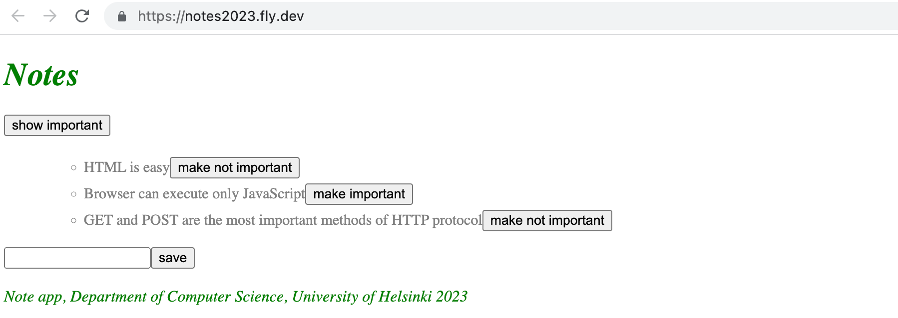

<i>**ملاحظة:** تغيير الأهمية لا يعمل بعد لأن الواجهة الخلفية ليس لديها تنفيذ برمجي له حتى الآن.</i>

يحفظ تطبيقنا الملاحظات في متغير في الذاكرة. إذا تعطل التطبيق أو تمت إعادة تشغيله، فستختفي جميع البيانات.

يحتاج التطبيق إلى قاعدة بيانات. قبل أن نقدم واحدة، دعنا نمر ببعض الأمور.

يبدو الإعداد الآن كما يلي:

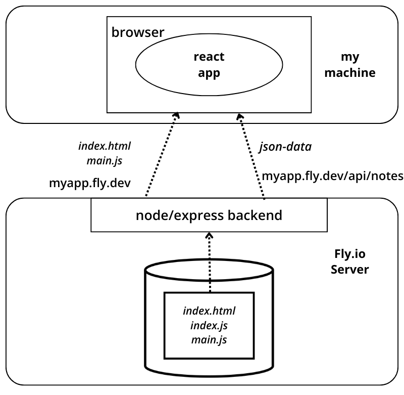

توجد واجهة node/express الخلفية الآن في خادم Fly.io/Render. عند الوصول إلى العنوان الأساسي، يقوم المتصفح بتحميل وتنفيذ تطبيق React الذي يجلب بيانات json من خادم Fly.io/Render.

### تبسيط وأتمتة نشر الواجهة الأمامية (Streamlining deploying of the frontend)

لإنشاء بناء إنتاج جديد للواجهة الأمامية دون عمل يدوي إضافي، دعنا نضيف بعض سكربتات npm إلى <i>package.json</i> في مستودع الواجهة الخلفية.

#### سكربت Fly.io

تبدو السكربتات هكذا:

```json
{
  "scripts": {
    // ...
    "build:ui": "rm -rf dist && cd ../notes-frontend/ && npm run build && cp -r dist ../notes-backend",
    "deploy": "fly deploy",
    "deploy:full": "npm run build:ui && npm run deploy",    
    "logs:prod": "fly logs"
  }
}
```

يقوم السكربت _npm run build:ui_ ببناء الواجهة الأمامية ونسخ نسخة الإنتاج تحت مستودع الواجهة الخلفية. يُصدر السكربت _npm run deploy_ الواجهة الخلفية الحالية إلى Fly.io.

يجمع _npm run deploy:full_ بين هذين السكربتين، أي _npm run build:ui_ و _npm run deploy_.

يوجد أيضاً سكربت _npm run logs:prod_ لعرض سجلات Fly.io.

لاحظ أن مسارات المجلدات في السكربت <i>build:ui</i> تعتمد على موقع مجلدي الواجهة الأمامية والواجهة الخلفية في نظام الملفات لديك.
  
##### ملاحظة لمستخدمي Windows

لاحظ أن أوامر shell القياسية في `build:ui` لا تعمل محلياً في Windows بنفس الطريقة. يعمل Powershell في Windows بشكل مختلف، وفي هذه الحالة يمكن كتابة السكربت كالتالي:

```json
"build:ui": "@powershell Remove-Item -Recurse -Force dist && cd ../frontend && npm run build && @powershell Copy-Item dist -Recurse ../backend",
```
  
إذا لم يعمل السكربت على Windows، فتأكد من أنك تستخدم Powershell وليس Command Prompt. إذا قمت بتثبيت Git Bash أو طرفية أخرى تشبه Linux، فقد تتمكن من تشغيل أوامر شبيهة بـ Linux على Windows أيضاً.

#### سكربت Render

ملاحظة: عندما تحاول نشر واجهتك الخلفية في Render، تأكد من أن لديك مستودعاً منفصلاً للواجهة الخلفية وقم بنشر مستودع github هذا من خلال Render، حيث إن محاولة النشر من خلال مستودع Fullstackopen الخاص بك غالباً ما تطلق الخطأ "ERR path ....package.json".

في حالة Render، تبدو السكربتات كما يلي:

```json
{
  "scripts": {
    //...
    "build:ui": "rm -rf dist && cd ../frontend && npm run build && cp -r dist ../backend",
    "deploy:full": "npm run build:ui && git add . && git commit -m uibuild && git push"
  }
}
```

يقوم السكربت _npm run build:ui_ ببناء الواجهة الأمامية ونسخ نسخة الإنتاج تحت مستودع الواجهة الخلفية. يحتوي _npm run deploy:full_ أيضاً على أوامر <i>git</i> اللازمة لتحديث مستودع الواجهة الخلفية.

لاحظ أن مسارات المجلدات في السكربت <i>build:ui</i> تعتمد على موقع مجلدي الواجهة الأمامية والواجهة الخلفية في نظام الملفات لديك.

>**ملاحظة:** في نظام Windows، يتم تنفيذ سكربتات npm في cmd.exe كغلاف افتراضي لا يدعم أوامر bash. لكي تعمل أوامر bash المذكورة أعلاه، يمكنك تغيير الغلاف الافتراضي إلى Bash (المتوفر في تثبيت Git for Windows الافتراضي) على النحو التالي:

```md
npm config set script-shell "C:\\Program Files\\git\\bin\\bash.exe"
```

خيار آخر هو استخدام حزمة [shx](https://www.npmjs.com/package/shx).

### الخادم الوكيل (Proxy)

تسببت التغييرات في الواجهة الأمامية في توقفها عن العمل في وضع التطوير (عند بدء تشغيلها باستخدام الأمر _npm run dev_)، حيث لا يعمل الاتصال بالواجهة الخلفية.

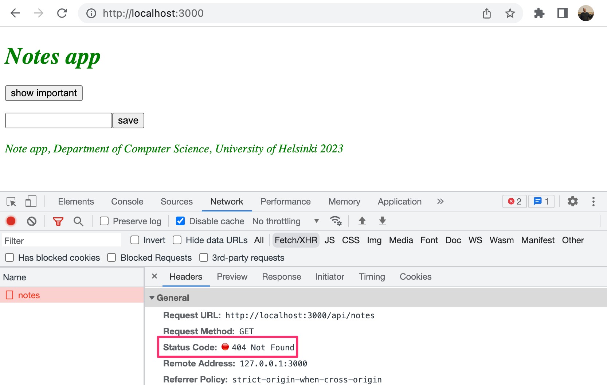

ويرجع ذلك إلى تغيير عنوان الواجهة الخلفية إلى عنوان URL نسبي:

```js
const baseUrl = '/api/notes'
```

نظراً لأن الواجهة الأمامية في وضع التطوير موجودة على العنوان <i>localhost:5173</i>، فإن الطلبات المرسلة إلى الواجهة الخلفية تذهب إلى العنوان الخطأ <i>localhost:5173/api/notes</i>. بينما تقع الواجهة الخلفية في <i>localhost:3001</i>.

إذا تم إنشاء المشروع باستخدام Vite، فمن السهل حل هذه المشكلة. يكفي إضافة الإعلان التالي إلى ملف <i>vite.config.js</i> الخاص بمجلد الواجهة الأمامية.

```js
import { defineConfig } from 'vite'
import react from '@vitejs/plugin-react'

// https://vitejs.dev/config/
export default defineConfig({
  plugins: [react()],
  // highlight-start
  server: {
    proxy: {
      '/api': {
        target: 'http://localhost:3001',
        changeOrigin: true,
      },
    }
  },
  // highlight-end
})
```

بعد إعادة التشغيل، ستعمل بيئة تطوير React كـ [خادم وكيل (Proxy)](https://vitejs.dev/config/server-options.html#server-proxy). إذا أجرى كود React طلب HTTP إلى مسار يبدأ بـ <i>http://localhost:5173/api</i>، فسيتم إعادة توجيه الطلب إلى الخادم في <i>http://localhost:3001</i>. سيتم التعامل مع الطلبات المقدمة إلى المسارات الأخرى بشكل طبيعي بواسطة خادم التطوير.

الآن تعمل الواجهة الأمامية بشكل صحيح أيضاً. تعمل في كل من وضع التطوير ووضع الإنتاج جنباً إلى جنب مع الخادم. نظراً لأنه من منظور الواجهة الأمامية يتم تقديم جميع الطلبات إلى http://localhost:5173، وهو الأصل الوحيد، لم تعد هناك حاجة لبرمجية cors الوسيطة في الواجهة الخلفية. لذلك، يمكننا إزالة الإشارات إلى مكتبة cors من ملف <i>index.js</i> الخاص بالواجهة الخلفية وإزالة <i>cors</i> من تبعيات المشروع:

```bash
npm remove cors
```

لقد نجحنا الآن في نشر التطبيق بالكامل على الإنترنت. هناك العديد من الطرق الأخرى لتنفيذ عمليات النشر. على سبيل المثال، قد يكون نشر كود الواجهة الأمامية كتطبيق خاص به أمراً منطقياً في بعض الحالات، حيث يمكن أن يسهل تنفيذ [مسار نشر مؤتمت (Deployment pipeline)](https://martinfowler.com/bliki/DeploymentPipeline.html). يشير مسار النشر إلى طريقة آلية ومنضبطة لنقل الكود من جهاز المطور عبر مراحل الاختبار ومراقبة الجودة المختلفة إلى بيئة الإنتاج. يتم تناول هذا الموضوع في [الجزء 11](/ar/part11) من الدورة.

يمكن العثور على شيفرة الواجهة الخلفية الحالية على [Github](https://github.com/fullstack-hy2020/part3-notes-backend/tree/part3-3)، في الفرع <i>part3-3</i>. والتغييرات في كود الواجهة الأمامية موجودة في فرع <i>part3-1</i> من [مستودع الواجهة الأمامية](https://github.com/fullstack-hy2020/part2-notes-frontend/tree/part3-1).

</div>

<div class="tasks">

### تمارين 3.9.-3.11

لا تتطلب التمارين التالية العديد من أسطر الشيفرة البرمجية. ومع ذلك، يمكن أن تكون صعبة، لأنه يجب عليك فهم ما يحدث وأين يحدث بالضبط، ويجب أن تكون التكوينات والإعدادات دقيقة تماماً.

#### 3.9 الواجهة الخلفية لدليل الهاتف - الخطوة 9

اجعل الواجهة الخلفية تعمل مع الواجهة الأمامية لدليل الهاتف من تمارين الجزء السابق. لا تنفذ وظيفة إجراء تغييرات على أرقام الهواتف بعد، سيتم تنفيذ ذلك في التمرين 3.17.

سيتعين عليك على الأرجح إجراء بعض التغييرات الصغيرة على الواجهة الأمامية، على الأقل على عناوين URL الخاصة بالواجهة الخلفية. تذكر إبقاء وحدة تحكم المطور مفتوحة في متصفحك. إذا فشلت بعض طلبات HTTP، فيجب عليك التحقق من تبويب *الشبكة (Network)* لمعرفة ما يحدث. راقب وحدة تحكم الواجهة الخلفية أيضاً. إذا لم تقم بالتمرين السابق، فمن المفيد طباعة بيانات الطلب أو <i>request.body</i> في وحدة التحكم داخل معالج الأحداث المسؤول عن طلبات POST.

#### 3.10 الواجهة الخلفية لدليل الهاتف - الخطوة 10

انشر الواجهة الخلفية على الإنترنت، على سبيل المثال على Fly.io أو Render. إذا كنت تستخدم Fly.io، فيجب تشغيل الأوامر في المجلد الجذري للواجهة الخلفية (أي في نفس المجلد حيث يوجد ملف package.json الخاص بالواجهة الخلفية).

**نصيحة احترافية:** عندما تنشر تطبيقك على الإنترنت، يجدر بك على الأقل في البداية مراقبة سجلات التطبيق **في جميع الأوقات**.

اختبر الواجهة الخلفية المنشورة باستخدام متصفح و Postman أو عميل REST في VS Code للتأكد من أنها تعمل.

أنشئ ملف README.md في جذر المستودع الخاص بك، وأضف رابطاً لتطبيقك المتصل بالإنترنت إليه.

#### 3.11 دليل الهاتف بنظام Full Stack

قم بإنشاء بناء إنتاج لواجهتك الأمامية، وأضفه إلى تطبيق الإنترنت باستخدام الطريقة المقدمة في هذا الجزء.

تأكد أيضاً من أن الواجهة الأمامية لا تزال تعمل محلياً (في وضع التطوير عند بدء تشغيلها باستخدام الأمر _npm run dev_).

إذا كنت تستخدم Render، فتأكد من عدم تجاهل المجلد <i>dist</i> بواسطة git في الواجهة الخلفية.

**تنبيه:** لا يجوز لك نشر الواجهة الأمامية مباشرة في أي مرحلة من هذا الجزء. يتم نشر مستودع الواجهة الخلفية فقط طوال هذا الجزء بأكمله. تتم إضافة بناء الإنتاج للواجهة الأمامية إلى مستودع الواجهة الخلفية، وتقدمه الواجهة الخلفية كما هو موضح في قسم [تقديم الملفات الثابتة من الواجهة الخلفية](/ar/part3/deploying_app_to_internet#serving-static-files-from-the-backend).

</div>
