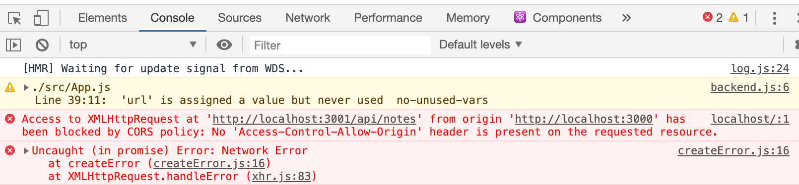

<div class="content">

سنقوم الآن بربط تطبيق الواجهة الأمامية (Frontend) الذي بنيناه في [الجزء 2](/ar/part2) بخادم Express الخلفي الذي أنشأناه للتو.

في الجزء 2، كان تطبيق React يجلب الملاحظات من المسار `http://localhost:3001/notes`. أما في خادمنا الجديد، فقد أصبح المسار `http://localhost:3001/api/notes`.

إذا قمنا بتعديل المتغير `baseUrl` في ملف `src/services/notes.js`:

```js
import axios from 'axios'
const baseUrl = 'http://localhost:3001/api/notes'

const getAll = () => {
  const request = axios.get(baseUrl)
  return request.then(response => response.data)
}
```

فسيتعطل طلب الـ GET وتظهر في وحدة تحكم المتصفح رسالة خطأ باللون الأحمر:



---

### سياسة المصدر نفسه ومشاركة الموارد عبر الأصول (Same-Origin Policy & CORS)

تُحدد هوية **المصدر (Origin)** لأي رابط URL بمزيج من ثلاثة عناصر: **البروتوكول (Protocol)**، و **اسم المضيف (Hostname)**، و **رقم المنفذ (Port)**:

```text
http://example.com:80/index.html

البروتوكول (Protocol): http
المضيف (Host):        example.com
المنفذ (Port):         80
```

تُطبق المتصفحات آلية أمان صارمة تسمى **سياسة المصدر نفسه ([Same-Origin Policy](https://developer.mozilla.org/en-US/docs/Web/Security/Same-origin_policy))** لمنع سرقة الجلسات وهجمات الاختراق عبر المواقع. وبموجب هذه السياسة، لا يُسمح لكود JavaScript المنفذ في المتصفح بالتواصل عبر AJAX إلا مع خادم يحمل نفس المصدر تماماً.

وبما أن تطبيق React يعمل على المنفذ `localhost:5173`، بينما يعمل خادم Express على المنفذ `localhost:3001`، فإنهما يُعتبران **مصدرين مختلفين (Cross-origin)**، ويرفض المتصفح استلام البيانات ما لم يسمح الخادم بذلك صراحة.

للسماح بالاتصال بين المصادر المختلفة، وضعت منظمة W3C معيار **[CORS (Cross-Origin Resource Sharing)](https://developer.mozilla.org/en-US/docs/Web/HTTP/CORS)**.

في بيئة Node.js و Express، نقوم بتثبيت وسيط **[cors](https://github.com/expressjs/cors)**:

```bash
npm install cors
```

وتفعيله في ملف `index.js`:

```js
const cors = require('cors')

app.use(cors())
```

---

### نشر التطبيق على شبكة الإنترنت (Application to the Internet)

تتوفر خدمات استضافة سحابية متعددة (PaaS) تتيح تشغيل تطبيقات Node.js ونشرها بسهولة؛ وأشهرها حالياً:
- **[Render](https://render.com/)**: يوفر باقة مجانية سهلة الإعداد عبر ربط مستودع GitHub مباشرة دون الحاجة لتثبيت برمجيات إضافية على جهازك.
- **[Fly.io](https://fly.io/)**: منصة سحابية متقدمة تعتمد على أداة الطرفية `flyctl`.

في خادم Express، يجب قراءة المنفذ ديناميكياً من **متغير البيئة `PORT`** المخصص من قِبل منصة الاستضافة:

```js
const PORT = process.env.PORT || 3001
app.listen(PORT, () => {
  console.log(`Server running on port ${PORT}`)
})
```

---

### بناء نسخة الإنتاج للواجهة الأمامية (Frontend Production Build)

أثناء مرحلة التطوير، يعمل كود React في **بيئة التطوير (Development mode)**. وعند النشر، يجب تحويل وضغط وتصريف كافة ملفات التطبيق والمكتبات إلى حزمة مصغرة ومحسنة للإنتاج (**Production build**).

في مشاريع Vite، يتم إنشاء حزمة الإنتاج بتنفيذ الأمر في مجلد الواجهة الأمامية:

```bash
npm run build
```

يُنشئ هذا الأمر مجلداً باسم **`dist`** يحتوي على ملف `index.html` وملفات JavaScript و CSS المصغرة والمدمجة (Minified bundle).

---

### خدمة الملفات الثابتة من الخادم الخلفي (Serving Static Files)

لدمج الواجهة الأمامية والخلفية في تطبيق واحد متكامل، نقوم بنسخ مجلد الإنتاج `dist` إلى المجلد الجذري للخادم الخلفي:

```bash
cp -r dist ../backend
```

ثم نفعّل برمجية Express الوسيطة المدمجة لخدمة الملفات الثابتة داخل `index.js`:

```js
app.use(express.static('dist'))
```

عند استقبال أي طلب HTTP GET، يفحص Express أولاً ما إذا كان الملف المطلوب موجوداً داخل مجلد `dist`. وإذا وجده (مثل `index.html`) يقوم بإرجاعه مباشرة.

وبما أن الواجهة الأمامية والخلفية تعملان الآن على نفس العنوان والمصدر، يمكننا استخدام **مسار نسبي (Relative URL)** لخدمات الـ API في ملف `src/services/notes.js`:

```js
const baseUrl = '/api/notes'
```

---

### خادم الوكيل في بيئة التطوير (Vite Proxy)

استخدام المسار النسبي `/api/notes` يجعل الواجهة الأمامية تبحث عن الـ API على المنفذ `localhost:5173/api/notes` أثناء تشغيل `npm run dev`، في حين أن الخادم يعمل على `localhost:3001`.

لحل هذه المشكلة وجعل التطبيق يعمل بسلاسة في بيئتي التطوير والإنتاج معاً، نقوم بإعداد **خادم الوكيل (Proxy)** داخل ملف `vite.config.js` في مجلد الواجهة الأمامية:

```js
import { defineConfig } from 'vite'
import react from '@vitejs/plugin-react'

export default defineConfig({
  plugins: [react()],
  server: {
    proxy: {
      '/api': {
        target: 'http://localhost:3001',
        changeOrigin: true,
      },
    }
  },
})
```

يقوم خادم التطوير الآن بتوجيه أي طلب يبدأ بـ `/api` تلقائياً إلى الخادم الخلفي على المنفذ 3001.

---

### أتمتة عملية البناء والنشر (Streamlining Deployment)

لتسهيل بناء الواجهة ودمجها مع الخادم بأمر واحد، نضيف سكربتات مخصصة في ملف `package.json` الخاص بالواجهة الخلفية:

```json
{
  "scripts": {
    "start": "node index.js",
    "dev": "node --watch index.js",
    "build:ui": "rm -rf dist && cd ../notes-frontend && npm run build && cp -r dist ../notes-backend",
    "deploy:full": "npm run build:ui && git add . && git commit -m 'build ui' && git push"
  }
}
```

</div>

<div class="tasks">

<h3>التمارين 3.9 - 3.11</h3>

<h4>3.9: خادم دليل الهاتف - الخطوة 9 (Phonebook backend step 9)</h4>
اربط الواجهة الأمامية لدليل الهاتف بالخادم الخلفي، واضبط خادم الوكيل (Proxy) في `vite.config.js` ليعمل التطبيق محلياً في بيئة التطوير.

<h4>3.10: خادم دليل الهاتف - الخطوة 10 (Phonebook backend step 10)</h4>
انشر خادم دليل الهاتف على إحدى منصات الاستضافة السحابية (مثل Render أو Fly.io)، وتأكد من عمل المسارات `/api/persons` و `/info` عبر الإنترنت. وأضف رابط التطبيق الحي في ملف `README.md` بمستودع المشروع.

<h4>3.11: دليل الهاتف الشامل (Full Stack Phonebook)</h4>
أنشئ نسخة الإنتاج (Production Build) للواجهة الأمامية لدليل الهاتف، وادمج مجلد `dist` داخل مستودع الخادم الخلفي ليقوم الخادم بخدمة الواجهة وتوفير الـ API معاً من نفس العنوان السحابي.

</div>
