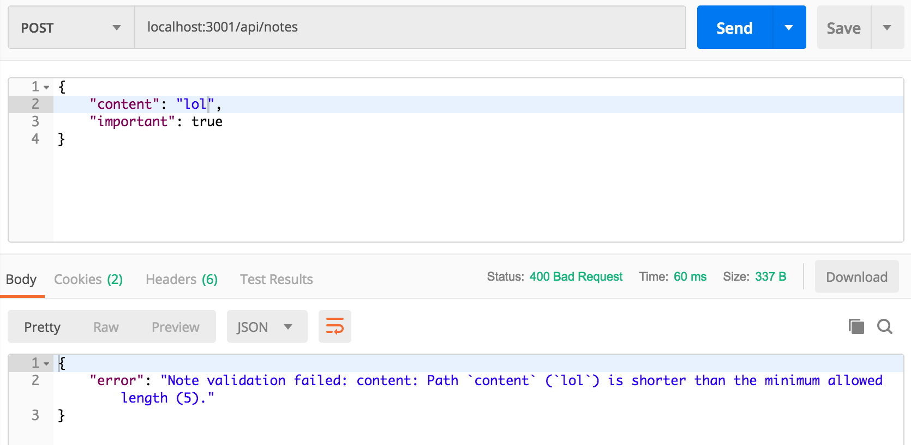
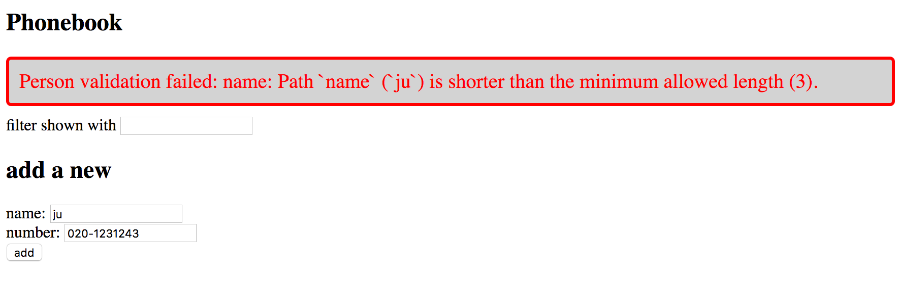

<div class="content">

غالباً ما تكون هناك قيود وقواعد تحقق نريد تطبيقها على البيانات المخزنة في قاعدة البيانات؛ كأن نمنع حفظ ملاحظة بدون نص أو بنص قصير جداً.

### التحقق من صحة البيانات في Mongoose (Validation)

توفر Mongoose آلية مدمجة وقوية للتحقق من صحة البيانات ([Validation](https://mongoosejs.com/docs/validation.html)) يتم تحديدها مباشرة في المخطط (Schema):

```js
const noteSchema = new mongoose.Schema({
  content: {
    type: String,
    minLength: 5,
    required: true
  },
  important: Boolean
})
```

- **`required: true`**: يمنع الحقل من أن يكون فارغاً أو مفقوداً.
- **`minLength: 5`**: يشترط ألا يقل طول النص عن 5 أحرف.

عند محاولة حفظ كائن يخالف هذه الشروط، تطلق Mongoose استثناءً من نوع **`ValidationError`**.

لنقم بتحديث وسيط معالجة الأخطاء للتعامل مع هذا الخطأ وإرجاع رسالة توضيحية برمز الحالة **400 Bad Request**:

```js
const errorHandler = (error, request, response, next) => {
  console.error(error.message)

  if (error.name === 'CastError') {
    return response.status(400).send({ error: 'malformatted id' })
  } else if (error.name === 'ValidationError') {
    return response.status(400).json({ error: error.message })
  }

  next(error)
}
```



> **ملاحظة هامة عند التحديث**: في عمليات التحديث `findByIdAndUpdate`، تكون قواعد التحقق معطلة افتراضياً ويجب تفعيلها صراحة بتمرير خيار `{ runValidators: true }`.

---

### الفحص الساكن للكود وتوحيد الأسلوب عبر ESLint

يُعد **[ESLint](https://eslint.org/)** الأداة القياسية الأولى في مجتمع JavaScript لإجراء التحليل الساكن للكود (Static Analysis) واكتشاف الأخطاء البرمجية وفرض معايير التنسيق والمسافات والأسلوب البرمجي المتسق (Linting).

لنقم بتثبيت ESLint كحزمة تطوير (Dev dependency):

```bash
npm install eslint @eslint/js @stylistic/eslint-plugin --save-dev
```

نُنشئ ملف الإعداد الحديث `eslint.config.mjs`:

```js
import globals from 'globals'
import js from '@eslint/js'
import stylisticJs from '@stylistic/eslint-plugin'

export default [
  js.configs.recommended,
  {
    files: ['**/*.js'],
    languageOptions: {
      sourceType: 'commonjs',
      globals: { ...globals.node },
      ecmaVersion: 'latest',
    },
    plugins: {
      '@stylistic/js': stylisticJs,
    },
    rules: {
      '@stylistic/js/indent': ['error', 2],
      '@stylistic/js/linebreak-style': ['error', 'unix'],
      '@stylistic/js/quotes': ['error', 'single'],
      '@stylistic/js/semi': ['error', 'never'],
      eqeqeq: 'error',
      'no-trailing-spaces': 'error',
      'object-curly-spacing': ['error', 'always'],
      'arrow-spacing': ['error', { before: true, after: true }],
      'no-console': 'off',
    },
  },
  {
    ignores: ['dist/**'],
  },
]
```

شرح أهم القواعد المطبقة:
- **`indent: 2`**: استخدام مسافتين للمحاذاة البادئة.
- **`quotes: single`**: فرض علامات الاقتباس المفردة `'...'`.
- **`semi: never`**: منع الفواصل المنقوطة الزائدة في نهاية الأسطر.
- **`eqeqeq: error`**: فرض استخدام المساواة الثلاثية الصارمة `===` بدلاً من `==`.
- **`ignores: ['dist/**']`**: تجاهل فحص مجلد الإنتاج `dist`.

نضيف أمر الفحص في `package.json`:

```json
{
  "scripts": {
    "lint": "eslint ."
  }
}
```

يمكن تشغيل الفحص عبر الأمر: `npm run lint`. وتتيح إضافة VS Code ESLint إبراز الأخطاء بخطوط حمراء فور كتابة الكود داخل المحرر.

</div>

<div class="tasks">

<h3>التمارين 3.19 - 3.22: التحقق و ESLint في دليل الهاتف</h3>

<h4>3.19*: قاعدة بيانات دليل الهاتف - الخطوة 7 (Phonebook database step 7)</h4>
أضف قواعد التحقق في مخطط `models/person.js`:
- يجب أن يتكون الاسم من **3 أحرف على الأقل**.
- اعرض رسالة خطأ واضحة في الواجهة الأمامية عند فشل التحقق بالتقاط `error.response.data.error`.



<h4>3.20*: قاعدة بيانات دليل الهاتف - الخطوة 8 (Phonebook database step 8)</h4>
أضف محققاً مخصصاً (Custom validator) لرقم الهاتف ليطابق الشروط التالية:
- يتكون من 8 خانات أو أكثر.
- يتألف من جزأين مفصولين بشرطة `-` (مثال: `09-1234556` أو `040-22334455`).

<h4>3.21: نشر النسخة الشاملة إلى الإنتاج (Deploying to production)</h4>
أعد بناء نسخة الإنتاج للواجهة الأمامية `npm run build` وانقلها إلى مجلد الخادم الخلفي، ثم انشر التحديث إلى Render / Fly.io وتأكد من حفظ وقراءة جهات الاتصال من قاعدة بيانات MongoDB السحابية.

<h4>3.22: إعداد ESLint (Lint configuration)</h4>
ثبّت واضبط أداة ESLint في مشروع الخادم الخلفي وأصلح كافة التحذيرات البرمجية والمسافات.

هذا هو التمرين الأخير في هذا الجزء. ارفع حلولك إلى GitHub وسجل إنجاز التمارين في نظام التسليم.

</div>
