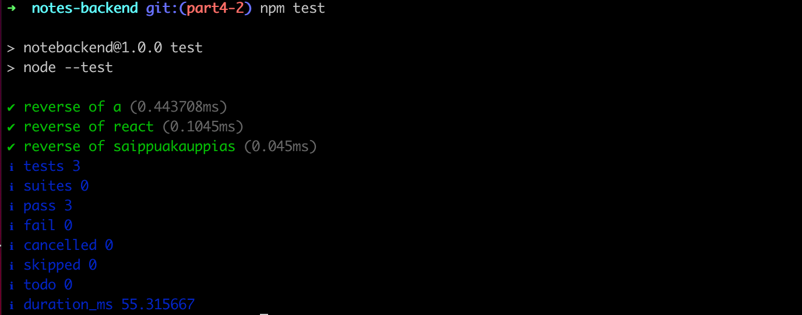

<div class="content">

سنواصل في هذا الجزء عملنا على الواجهة الخلفية لتطبيق الملاحظات.

### هيكلية المشروع وفق أفضل الممارسات (Project Structure)

قبل الخوض في كتابة الاختبارات، سنقوم بإعادة تنظيم وهيكلة المشروع وفقاً للمعايير الهندسية وأفضل الممارسات في بيئة Node.js.

ستكون الهيكلية النظيفة للمشروع كالتالي:

```bash
├── controllers
│   └── notes.js
├── dist
│   └── ...
├── models
│   └── note.js
├── utils
│   ├── config.js
│   ├── logger.js
│   └── middleware.js  
├── app.js
├── index.js
├── package-lock.json
├── package.json
```

1. **`utils/logger.js`**: وحدة تسجيل وفصل طباعة الرسائل في الكونسول:

```js
const info = (...params) => {
  console.log(...params)
}

const error = (...params) => {
  console.error(...params)
}

module.exports = { info, error }
```

2. **`utils/config.js`**: وحدة إدارة متغيرات البيئة:

```js
require('dotenv').config()

const PORT = process.env.PORT
const MONGODB_URI = process.env.MONGODB_URI

module.exports = { MONGODB_URI, PORT }
```

3. **`controllers/notes.js`**: وحدة التحكم بالمسارات باستخدام **Express Router**:

```js
const notesRouter = require('express').Router()
const Note = require('../models/note')

notesRouter.get('/', (request, response) => {
  Note.find({}).then(notes => {
    response.json(notes)
  })
})

notesRouter.get('/:id', (request, response, next) => {
  Note.findById(request.params.id)
    .then(note => {
      if (note) {
        response.json(note)
      } else {
        response.status(404).end()
      }
    })
    .catch(error => next(error))
})

notesRouter.post('/', (request, response, next) => {
  const body = request.body

  const note = new Note({
    content: body.content,
    important: body.important || false,
  })

  note.save()
    .then(savedNote => {
      response.json(savedNote)
    })
    .catch(error => next(error))
})

notesRouter.delete('/:id', (request, response, next) => {
  Note.findByIdAndDelete(request.params.id)
    .then(() => {
      response.status(204).end()
    })
    .catch(error => next(error))
})

notesRouter.put('/:id', (request, response, next) => {
  const { content, important } = request.body

  Note.findById(request.params.id)
    .then(note => {
      if (!note) {
        return response.status(404).end()
      }

      note.content = content
      note.important = important

      return note.save().then((updatedNote) => {
        response.json(updatedNote)
      })
    })
    .catch(error => next(error))
})

module.exports = notesRouter
```

كائن **Router** هو "تطبيق مصغر" مستقل للمسارات والبرمجيات الوسيطة ذات الصلة.

4. **`app.js`**: تهيئة التطبيق وقاعدة البيانات وربط الموجهات:

```js
const express = require('express')
const mongoose = require('mongoose')
const config = require('./utils/config')
const logger = require('./utils/logger')
const middleware = require('./utils/middleware')
const notesRouter = require('./controllers/notes')

const app = express()

logger.info('connecting to', config.MONGODB_URI)

mongoose
  .connect(config.MONGODB_URI, { family: 4 })
  .then(() => {
    logger.info('connected to MongoDB')
  })
  .catch((error) => {
    logger.error('error connection to MongoDB:', error.message)
  })

app.use(express.static('dist'))
app.use(express.json())
app.use(middleware.requestLogger)

app.use('/api/notes', notesRouter)

app.use(middleware.unknownEndpoint)
app.use(middleware.errorHandler)

module.exports = app
```

5. **`index.js`**: نقطة الدخول لتشغيل الخادم فقط:

```js
const app = require('./app')
const config = require('./utils/config')
const logger = require('./utils/logger')

app.listen(config.PORT, () => {
  logger.info(`Server running on port ${config.PORT}`)
})
```

فصل ملف التطبيق `app.js` عن خادم الويب `index.js` يتيح لنا اختبار التطبيق مباشرة على مستوى طلبات HTTP دون الحاجة للاستماع عبر منافذ الشبكة الفعلية.

---

### اختبار تطبيقات Node.js (Unit Testing with node:test)

تتضمن بيئة Node.js الحديثة مكتبة اختبار مدمجة قياسية **`node:test`** ومكتبة التحقق **`node:assert`**.

لنقم بإعداد أمر تشغيل الاختبارات في `package.json`:

```json
{
  "scripts": {
    "test": "node --test"
  }
}
```

لننشئ ملف دوال مساعدة `utils/for_testing.js`:

```js
const reverse = (string) => {
  return string.split('').reverse().join('')
}

const average = (array) => {
  const reducer = (sum, item) => sum + item
  return array.length === 0
    ? 0
    : array.reduce(reducer, 0) / array.length
}

module.exports = { reverse, average }
```

ونكتب الاختبارات في مجلد `tests/reverse.test.js` و `tests/average.test.js`:

```js
const { test, describe } = require('node:test')
const assert = require('node:assert')
const { reverse, average } = require('../utils/for_testing')

describe('reverse', () => {
  test('reverse of a', () => {
    const result = reverse('a')
    assert.strictEqual(result, 'a')
  })

  test('reverse of react', () => {
    const result = reverse('react')
    assert.strictEqual(result, 'tcaer')
  })
})

describe('average', () => {
  test('of one value is the value itself', () => {
    assert.strictEqual(average([1]), 1)
  })

  test('of many is calculated right', () => {
    assert.strictEqual(average([1, 2, 3, 4, 5, 6]), 3.5)
  })

  test('of empty array is zero', () => {
    assert.strictEqual(average([]), 0)
  })
})
```

تُستخدم كتل **`describe`** لتجميع الاختبارات منطقياً، وتوفر دالة **`assert.strictEqual(actual, expected)`** التحقق الصارم من صحة النتيجة.



</div>

<div class="tasks">

<h3>التمارين 4.1 - 4.7: تطبيق قائمة المدونات (Blog List Application)</h3>

سنقوم في هذا الجزء ببناء تطبيق لإدارة وقراءة المدونات (Blog List).

<h4>4.1: قائمة المدونات - الخطوة 1 (Blog List step 1)</h4>
قم بتهيئة مشروع Node.js جديد لـ Blog List مع إعداد المسارين `GET /api/blogs` و `POST /api/blogs`، واربطه بقاعدة بيانات MongoDB Atlas.

```js
const blogSchema = mongoose.Schema({
  title: String,
  author: String,
  url: String,
  likes: Number,
})
```

<h4>4.2: قائمة المدونات - الخطوة 2 (Blog List step 2)</h4>
أعد هيكلة تطبيق المدونات بفصل الملفات إلى: `app.js`، `index.js`، `models/blog.js`، `controllers/blogs.js`، و `utils/config.js` و `utils/logger.js`.

<h4>4.3: الدوال المساعدة واختبارات الوحدة - الخطوة 1 (Helper Functions step 1)</h4>
أنشئ ملف `utils/list_helper.js` وعرف به دالة `dummy(blogs)` التي تُرجع دائماً القيمة 1، واكتب لها اختبار وحدة في `tests/list_helper.test.js`.

<h4>4.4: الدوال المساعدة واختبارات الوحدة - الخطوة 2 (Helper Functions step 2)</h4>
عرّف دالة `totalLikes(blogs)` لحساب إجمالي عدد الإعجابات (Likes) لكافة المدونات، واكتب لها اختبارات تغطي: قائمة فارغة (0)، قائمة تحتوي على مدونة واحدة، وقائمة تحتوي على عدة مدونات.

<h4>4.5*: الدوال المساعدة واختبارات الوحدة - الخطوة 3 (Helper Functions step 3)</h4>
عرّف دالة `favoriteBlog(blogs)` التي تُرجع المدونة الحاصلة على أعلى عدد من الإعجابات. واستخدم `assert.deepStrictEqual` في اختبار المقارنة بين الكائنات.

<h4>4.6*: الدوال المساعدة واختبارات الوحدة - الخطوة 4 (Helper Functions step 4)</h4>
عرّف دالة `mostBlogs(blogs)` التي تُرجع اسم الكاتب الأكثر نشراً وإجمالي عدد مدوناته:
```js
{
  author: "Robert C. Martin",
  blogs: 3
}
```

<h4>4.7*: الدوال المساعدة واختبارات الوحدة - الخطوة 5 (Helper Functions step 5)</h4>
عرّف دالة `mostLikes(blogs)` التي تُرجع الكاتب الحاصل على أكبر عدد إجمالي من الإعجابات ومجموع إعجاباته:
```js
{
  author: "Edsger W. Dijkstra",
  likes: 17
}
```

</div>

