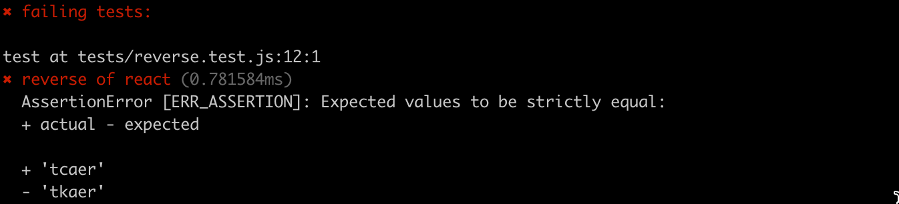
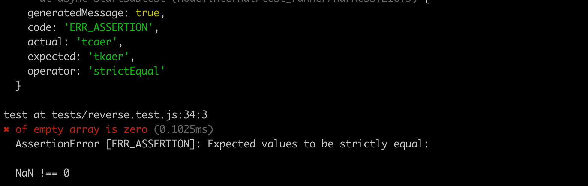
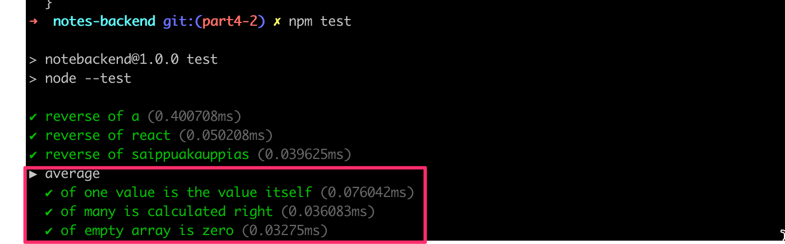
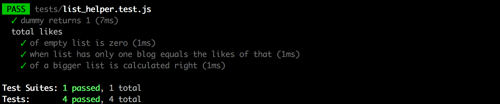

<div class="content">

دعونا نواصل عملنا على الواجهة الخلفية لتطبيق الملاحظات الذي بدأناه في [الجزء 3](/ar/part3).

### بنية وهيكلية المشروع (Project structure)

**ملاحظة:** كُتبت مادة هذا المنهج باستخدام الإصدار v22.3.0 من Node.js. يُرجى التأكد من أن إصدار Node لديك حديث على الأقل مثل الإصدار المستخدم في المادة (يمكنك التحقق من الإصدار عبر تشغيل الأمر _node -v_ في سطر الأوامر).

قبل أن ننتقل إلى موضوع الاختبارات (Testing)، سنقوم بتعديل بنية مشروعنا لتتوافق مع أفضل الممارسات المتبعة في Node.js.

بمجرد إجراء التغييرات على بنية مجلدات مشروعنا، سننتهي بالهيكل التالي:

```bash
├── controllers
│   └── notes.js
├── dist
│   └── ...
├── models
│   └── note.js
├── utils
│   ├── config.js
│   ├── logger.js
│   └── middleware.js  
├── app.js
├── index.js
├── package-lock.json
├── package.json
```

حتى الآن، كنا نستخدم <i>console.log</i> و <i>console.error</i> لطباعة معلومات مختلفة من الشيفرة البرمجية.
ومع ذلك، فهذه ليست طريقة جيدة جداً للقيام بالأشياء في المشاريع الكبيرة.
دعونا نفصل جميع عمليات الطباعة في وحدة التحكم إلى وحدة نمطية خاصة بها <i>utils/logger.js</i>:

```js
const info = (...params) => {
  console.log(...params)
}

const error = (...params) => {
  console.error(...params)
}

module.exports = { info, error }
```

تحتوي وحدة التسجيل (Logger) على دالتين: __info__ لطباعة رسائل السجل العادية، و __error__ لجميع رسائل الأخطاء.

يُعد استخراج التسجيل في وحدة نمطية خاصة به فكرة جيدة بعدة طرق. إذا أردنا البدء في كتابة السجلات في ملف أو إرسالها إلى خدمة تسجيل خارجية مثل [graylog](https://www.graylog.org/) أو [papertrail](https://papertrailapp.com)، فسيتعين علينا فقط إجراء تغييرات في مكان واحد.

يتم استخراج معالجة متغيرات البيئة في ملف منفصل <i>utils/config.js</i>:

```js
require('dotenv').config()

const PORT = process.env.PORT
const MONGODB_URI = process.env.MONGODB_URI

module.exports = { MONGODB_URI, PORT }
```

يمكن للأجزاء الأخرى من التطبيق الوصول إلى متغيرات البيئة عن طريق استيراد وحدة التكوين:

```js
const config = require('./utils/config')

logger.info(`Server running on port ${config.PORT}`)
```

تم أيضاً نقل معالجات المسارات إلى وحدة نمطية مخصصة. عادة ما يشار إلى معالجات أحداث المسارات باسم *وحدات التحكم (Controllers)*، ولهذا السبب أنشأنا مجلداً جديداً باسم <i>controllers</i>. توجد الآن جميع المسارات المتعلقة بالملاحظات في وحدة <i>notes.js</i> النمطية تحت مجلد <i>controllers</i>.

محتويات وحدة <i>notes.js</i> النمطية هي كالتالي:

```js
const notesRouter = require('express').Router()
const Note = require('../models/note')

notesRouter.get('/', (request, response) => {
  Note.find({}).then(notes => {
    response.json(notes)
  })
})

notesRouter.get('/:id', (request, response, next) => {
  Note.findById(request.params.id)
    .then(note => {
      if (note) {
        response.json(note)
      } else {
        response.status(404).end()
      }
    })
    .catch(error => next(error))
})

notesRouter.post('/', (request, response, next) => {
  const body = request.body

  const note = new Note({
    content: body.content,
    important: body.important || false,
  })

  note.save()
    .then(savedNote => {
      response.json(savedNote)
    })
    .catch(error => next(error))
})

notesRouter.delete('/:id', (request, response, next) => {
  Note.findByIdAndDelete(request.params.id)
    .then(() => {
      response.status(204).end()
    })
    .catch(error => next(error))
})

notesRouter.put('/:id', (request, response, next) => {
  const { content, important } = request.body

  Note.findById(request.params.id)
    .then(note => {
      if (!note) {
        return response.status(404).end()
      }

      note.content = content
      note.important = important

      return note.save().then((updatedNote) => {
        response.json(updatedNote)
      })
    })
    .catch(error => next(error))
})

module.exports = notesRouter
```

هذا تقريباً نسخ ولصق دقيق لملفنا السابق <i>index.js</i>.

ومع ذلك، هناك بعض التغييرات الهامة. في بداية الملف تماماً، ننشئ كائن [موجه (Router)](http://expressjs.com/en/api.html#router) جديداً:

```js
const notesRouter = require('express').Router()

//...

module.exports = notesRouter
```

تقوم الوحدة بتصدير الموجه ليكون متاحاً لجميع مستخدمي الوحدة النمطية.

يتم الآن تعريف جميع المسارات لكائن الموجه، على غرار ما تم إجراؤه سابقاً مع الكائن الذي يمثل التطبيق بأكمله.

تجدر الإشارة إلى أن المسارات في معالجات المسارات قد أصبحت أقصر. في الإصدار السابق، كان لدينا:

```js
app.delete('/api/notes/:id', (request, response, next) => {
```

وفي الإصدار الحالي، أصبح لدينا:

```js
notesRouter.delete('/:id', (request, response, next) => {
```

إذن ما هي كائنات الموجه هذه بالضبط؟ يقدم دليل Express التفسير التالي:

> *كائن الموجه (Router object) هو نسخة معزولة من البرمجيات الوسيطة والمسارات. يمكنك التفكير فيه على أنه "تطبيق مصغر"، قادر فقط على أداء وظائف التوجيه والبرمجيات الوسيطة. يحتوي كل تطبيق Express على موجه تطبيقات مدمج.*

الموجه في الواقع عبارة عن *برمجية وسيطة (Middleware)*، يمكن استخدامها لتعريف "المسارات ذات الصلة" في مكان واحد، والذي يتم وضعه عادةً في وحدة نمطية خاصة به.

يستخدم الملف <i>app.js</i> الذي ينشئ التطبيق الفعلي الموجه كما هو موضح أدناه:

```js
const notesRouter = require('./controllers/notes')
app.use('/api/notes', notesRouter)
```

يتم استخدام الموجه الذي حددناه سابقاً *إذا* كان عنوان URL للطلب يبدأ بـ <i>/api/notes</i>. لهذا السبب، يجب ألا يحدد كائن notesRouter إلا الأجزاء النسبية من المسارات، أي المسار الفارغ <i>/</i> أو المعامل فقط <i>/:id</i>.

تم إنشاء ملف يحدد التطبيق، <i>app.js</i>، في جذر المستودع:

```js
const express = require('express')
const mongoose = require('mongoose')
const config = require('./utils/config')
const logger = require('./utils/logger')
const middleware = require('./utils/middleware')
const notesRouter = require('./controllers/notes')

const app = express()

logger.info('connecting to', config.MONGODB_URI)

mongoose
  .connect(config.MONGODB_URI, { family: 4 })
  .then(() => {
    logger.info('connected to MongoDB')
  })
  .catch((error) => {
    logger.error('error connection to MongoDB:', error.message)
  })

app.use(express.static('dist'))
app.use(express.json())
app.use(middleware.requestLogger)

app.use('/api/notes', notesRouter)

app.use(middleware.unknownEndpoint)
app.use(middleware.errorHandler)

module.exports = app
```

يستخدم الملف برمجيات وسيطة مختلفة، وإحداها هي <i>notesRouter</i> المرتبطة بالمسار <i>/api/notes</i>.

تم نقل برمجياتنا الوسيطة المخصصة إلى وحدة <i>utils/middleware.js</i> النمطية الجديدة:

```js
const logger = require('./logger')

const requestLogger = (request, response, next) => {
  logger.info('Method:', request.method)
  logger.info('Path:  ', request.path)
  logger.info('Body:  ', request.body)
  logger.info('---')
  next()
}

const unknownEndpoint = (request, response) => {
  response.status(404).send({ error: 'unknown endpoint' })
}

const errorHandler = (error, request, response, next) => {
  logger.error(error.message)

  if (error.name === 'CastError') {
    return response.status(400).send({ error: 'malformatted id' })
  } else if (error.name === 'ValidationError') {
    return response.status(400).json({ error: error.message })
  }

  next(error)
}

module.exports = {
  requestLogger,
  unknownEndpoint,
  errorHandler
}
```

أُعطيت مسؤولية إنشاء الاتصال بقاعدة البيانات لوحدة <i>app.js</i>. يحدد الملف <i>note.js</i> الموجود أسفل مجلد <i>models</i> فقط مخطط Mongoose للملاحظات.

```js
const mongoose = require('mongoose')

const noteSchema = new mongoose.Schema({
  content: {
    type: String,
    required: true,
    minlength: 5
  },
  important: Boolean,
})

noteSchema.set('toJSON', {
  transform: (document, returnedObject) => {
    returnedObject.id = returnedObject._id.toString()
    delete returnedObject._id
    delete returnedObject.__v
  }
})

module.exports = mongoose.model('Note', noteSchema)
```

أصبحت محتويات ملف <i>index.js</i> المستخدم لبدء تشغيل التطبيق مبسطة على النحو التالي:

```js
const app = require('./app') // تطبيق Express الفعلي
const config = require('./utils/config')
const logger = require('./utils/logger')

app.listen(config.PORT, () => {
  logger.info(`Server running on port ${config.PORT}`)
})
```

يستورد ملف <i>index.js</i> التطبيق الفعلي فقط من ملف <i>app.js</i> ثم يبدأ تشغيل التطبيق. تُستخدم الدالة _info_ من وحدة logger للطباعة في وحدة التحكم التي توضح أن التطبيق قيد التشغيل.

الآن تم فصل تطبيق Express والشيفرة المسؤولة عن خادم الويب عن بعضهما البعض باتباع [أفضل الممارسات](https://dev.to/nermineslimane/always-separate-app-and-server-files--1nc7). تتمثل إحدى مزايا هذه الطريقة في أنه يمكن الآن اختبار التطبيق على مستوى استدعاءات HTTP API دون إجراء استدعاءات فعلية عبر HTTP عبر الشبكة، مما يجعل تنفيذ الاختبارات أسرع.

للتلخيص، تبدو بنية المجلدات هكذا بعد إجراء التغييرات:

```bash
├── controllers
│   └── notes.js
├── dist
│   └── ...
├── models
│   └── note.js
├── utils
│   ├── config.js
│   ├── logger.js
│   └── middleware.js  
├── app.js
├── index.js
├── package-lock.json
├── package.json
```

بالنسبة للتطبيقات الأصغر، لا تهم البنية كثيراً. ولكن بمجرد أن يبدأ التطبيق في النمو من حيث الحجم، سيتعين عليك إنشاء نوع من الهيكلية وفصل المسؤوليات المختلفة للتطبيق إلى وحدات نمطية منفصلة. سيجعل هذا تطوير التطبيق أسهل بكثير.

لا توجد بنية مجلدات صارمة أو اصطلاح لتسمية الملفات مطلوب لتطبيقات Express. في المقابل، يتطلب Ruby on Rails بنية محددة. يتبع هيكلنا الحالي ببساطة بعضاً من أفضل الممارسات التي يمكنك مصادفتها على الإنترنت.

يمكنك العثور على شيفرة تطبيقنا الحالي بالكامل في الفرع <i>part4-1</i> من [مستودع GitHub هذا](https://github.com/fullstack-hy2020/part3-notes-backend/tree/part4-1).

إذا قمت باستنساخ المشروع لنفسك، فقم بتشغيل الأمر _npm install_ قبل بدء تشغيل التطبيق باستخدام _npm run dev_.

### ملاحظة حول عمليات التصدير (Exports)

لقد استخدمنا نوعين مختلفين من عمليات التصدير في هذا الجزء. أولاً، على سبيل المثال، يقوم الملف <i>utils/logger.js</i> بالتصدير على النحو التالي:

```js
const info = (...params) => {
  console.log(...params)
}

const error = (...params) => {
  console.error(...params)
}

module.exports = { info, error } // highlight-line
```

يقوم الملف بتصدير *كائن* يحتوي على حقلين، كلاهما عبارة عن دوال. يمكن استخدام الدوال بطريقتين مختلفتين. الخيار الأول هو استيراد الكائن بالكامل والرجوع إلى الدوال من خلال الكائن باستخدام تدوين النقطة (Dot notation):

```js
const logger = require('./utils/logger')

logger.info('message')

logger.error('error message')
```

الخيار الآخر هو [تفكيك الكائنات (Destructuring)](/ar/part1/java_script#destructuring) للدوال إلى متغيراتها الخاصة في عبارة <i>require</i>:

```js
const { info, error } = require('./utils/logger')

info('message')
error('error message')
```

قد تكون الطريقة الثانية للتصدير مفضلة إذا تم استخدام جزء صغير فقط من الدوال المصدرة في ملف ما.

ومع ذلك، في بعض الحالات، يتم تصدير "شيء واحد" فقط. على سبيل المثال، يقوم <i>controller/notes.js</i> بتصدير شيء واحد هكذا:

```js
const notesRouter = require('express').Router()
const Note = require('../models/note')

// ...

module.exports = notesRouter // highlight-line
```

نظراً لأنه يتم تصدير "شيء واحد" فقط، فلا يمكن استيراده واستخدامه إلا ككائن واحد:

```js
const notesRouter = require('./controllers/notes')

// ...

app.use('/api/notes', notesRouter)
```

الآن، يتم إسناد "الشيء" المصدر (في هذه الحالة، كائن الموجه) إلى متغير _notesRouter_ ويتم استخدامه ككائن مفرد.

#### البحث عن استخدامات التصدير الخاصة بك باستخدام VS Code

يحتوي VS Code على ميزة مفيدة تتيح لك معرفة مكان تصدير وحداتك النمطية. يمكن أن يكون هذا مفيداً جداً لإعادة الهيكلة (Refactoring). على سبيل المثال، إذا قررت تقسيم دالة إلى دالتين منفصلتين، فقد يتعطل كودك إذا لم تقم بتعديل جميع الاستخدامات. يكون هذا صعباً إذا كنت لا تعرف مكان وجودها. ومع ذلك، تحتاج إلى تحديد عمليات التصدير الخاصة بك بطريقة معينة حتى يعمل هذا.

إذا قمت بالنقر بزر الماوس الأيمن فوق متغير في الموقع الذي تم تصديره منه وحددت "Find All References"، فسيظهر لك في كل مكان يتم فيه استيراد المتغير. ومع ذلك، إذا قمت بتعيين كائن مباشرة إلى module.exports، فلن يعمل ذلك. أحد الحلول البديلة هو تعيين الكائن الذي تريد تصديره إلى متغير مسمى ثم تصدير المتغير المسمى. كما أنه لن يعمل إذا قمت بتفكيك الكائن في مكان الاستيراد؛ يجب عليك استيراد المتغير المسمى ثم تفكيكه، أو مجرد استخدام تدوين النقطة لاستخدام الدوال الموجودة في المتغير المسمى.

إن طبيعة تأثير VS Code على كيفية كتابة الشيفرة الخاصة بك قد لا تكون مثالية، لذا يتعين عليك أن تقرر بنفسك ما إذا كانت المقايضة تستحق العناء.

</div>

<div class="tasks">

### تمارين 4.1.-4.2.

**ملاحظة:** كُتبت مادة هذا المنهج باستخدام الإصدار v22.3.0 من Node.js. يُرجى التأكد من أن إصدار Node لديك حديث على الأقل مثل الإصدار المستخدم في المادة (يمكنك التحقق من الإصدار عبر تشغيل الأمر _node -v_ في سطر الأوامر).

في التمارين الخاصة بهذا الجزء، سنقوم ببناء *تطبيق قائمة المدونات (Blog list application)*، والذي يسمح للمستخدمين بحفظ معلومات حول المدونات المثيرة للاهتمام التي عثروا عليها على الإنترنت. لكل مدونة مدرجة سنحفظ المؤلف والعنوان ورابط URL وعدد الأصوات المؤيدة (Upvotes/Likes) من مستخدمي التطبيق.

#### 4.1 قائمة المدونات، الخطوة 1

دعنا نتخيل موقفاً تتلقى فيه رسالة بريد إلكتروني تحتوي على نص التطبيق والتعليمات التالية:

```js
const express = require('express')
const mongoose = require('mongoose')

const app = express()

const blogSchema = mongoose.Schema({
  title: String,
  author: String,
  url: String,
  likes: Number,
})

const Blog = mongoose.model('Blog', blogSchema)

const mongoUrl = 'mongodb://localhost/bloglist'
mongoose.connect(mongoUrl, { family: 4 })

app.use(express.json())

app.get('/api/blogs', (request, response) => {
  Blog.find({}).then((blogs) => {
    response.json(blogs)
  })
})

app.post('/api/blogs', (request, response) => {
  const blog = new Blog(request.body)

  blog.save().then((result) => {
    response.status(201).json(result)
  })
})

const PORT = 3003
app.listen(PORT, () => {
  console.log(`Server running on port ${PORT}`)
})
```

حوّل التطبيق إلى مشروع <i>npm</i> يعمل بشكل صحيح. للحفاظ على إنتاجية التطوير، قم بتهيئة التطبيق ليتم تنفيذه باستخدام <i>node --watch</i>. يمكنك إنشاء قاعدة بيانات جديدة لتطبيقك باستخدام MongoDB Atlas، أو استخدام نفس قاعدة البيانات من تمارين الجزء السابق.

تحقق من إمكانية إضافة مدونات إلى القائمة باستخدام Postman أو عميل REST في VS Code وأن التطبيق يُرجع المدونات المضافة عند نقطة النهاية الصحيحة.

#### 4.2 قائمة المدونات، الخطوة 2

أعد هيكلة التطبيق (Refactor) إلى وحدات نمطية منفصلة كما هو موضح سابقاً في هذا الجزء من مادة الدورة التدريبية.

**ملاحظة:** أعد هيكلة تطبيقك بخطوات صغيرة وتدريجية وتحقق من أنه يعمل بعد كل تغيير تجريه. إذا حاولت اتخاذ "طريق مختصر" بإعادة هيكلة العديد من الأشياء دفعة واحدة، فسيتحقق [قانون ميرفي (Murphy's law)](https://en.wikipedia.org/wiki/Murphy%27s_law) ومن المؤكد تقريباً أن شيئاً ما سيتعطل في تطبيقك. سينتهي الأمر بأن "الطريق المختصر" يستغرق وقتاً أطول من المضي قدماً ببطء وبشكل منهجي.

تتمثل إحدى أفضل الممارسات في إيداع الكود الخاص بك (Git commit) في كل مرة يكون فيها في حالة مستقرة. هذا يجعل من السهل الرجوع إلى حالة لا يزال التطبيق يعمل فيها.

إذا كنت تواجه مشكلات مع كون <i>content.body</i> أو <i>request.body</i> هي <i>undefined</i> بدون سبب واضح على ما يبدو، فتأكد من أنك لم تنس إضافة <i>app.use(express.json())</i> بالقرب من أعلى الملف.

</div>

<div class="content">

### اختبار تطبيقات Node (Testing Node applications)

لقد أهملنا تماماً أحد المجالات الأساسية في تطوير البرمجيات، وهو الاختبار المؤتمت (Automated testing).

دعونا نبدأ رحلة الاختبار الخاصة بنا من خلال النظر في [اختبارات الوحدات (Unit tests)](https://en.wikipedia.org/wiki/Unit_testing). إن منطق تطبيقنا بسيط للغاية، لدرجة أنه ليس هناك الكثير مما يكون من المنطقي اختباره باستخدام اختبارات الوحدات. دعنا ننشئ ملفاً جديداً <i>utils/for_testing.js</i> ونكتب دالتين بسيطتين يمكننا استخدامهما لممارسة كتابة الاختبارات:

```js
const reverse = (string) => {
  return string
    .split('')
    .reverse()
    .join('')
}

const average = (array) => {
  const reducer = (sum, item) => {
    return sum + item
  }

  return array.reduce(reducer, 0) / array.length
}

module.exports = {
  reverse,
  average,
}
```

> تستخدم دالة _average_ تابع المصفوفات [reduce](https://developer.mozilla.org/en-US/docs/Web/JavaScript/Reference/Global_Objects/Array/Reduce). إذا لم يكن التابع مألوفاً لك بعد، فهذا هو الوقت المناسب لمشاهدة مقاطع الفيديو الثلاثة الأولى من سلسلة [Functional JavaScript](https://www.youtube.com/watch?v=BMUiFMZr7vk&list=PL0zVEGEvSaeEd9hlmCXrk5yUyqUag-n84) على YouTube.

هناك عدد كبير من مكتبات الاختبار، أو *مشغلات الاختبارات (Test runners)*، المتاحة لجافاسكريبت.
الملك القديم لمكتبات الاختبار هو [Mocha](https://mochajs.org/)، والذي تم استبداله قبل بضع سنوات بـ [Jest](https://jestjs.io/). الوافد الجديد إلى المكتبات هو [Vitest](https://vitest.dev/)، الذي يقدم نفسه كجيل جديد من مكتبات الاختبار.

في الوقت الحاضر، تمتلك Node أيضاً مكتبة اختبار مدمجة [node:test](https://nodejs.org/docs/latest/api/test.html)، وهي مناسبة تماماً لاحتياجات هذه الدورة.

دعنا نحدد <i>سكربت npm المسمى test</i> لتنفيذ الاختبارات:

```js
{
  // ...
  "scripts": {
    "start": "node index.js",
    "dev": "node --watch index.js",
    "test": "node --test", // highlight-line
    "lint": "eslint ."
  },
  // ...
}
```

دعنا ننشئ مجلداً منفصلاً لاختباراتنا يسمى <i>tests</i> وننشئ ملفاً جديداً يسمى <i>reverse.test.js</i> بالمحتويات التالية:

```js
const { test } = require('node:test')
const assert = require('node:assert')

const reverse = require('../utils/for_testing').reverse

test('reverse of a', () => {
  const result = reverse('a')

  assert.strictEqual(result, 'a')
})

test('reverse of react', () => {
  const result = reverse('react')

  assert.strictEqual(result, 'tcaer')
})

test('reverse of saippuakauppias', () => {
  const result = reverse('saippuakauppias')

  assert.strictEqual(result, 'saippuakauppias')
})
```

يحدد الاختبار الكلمة الأساسية _test_ والمكتبة [assert](https://nodejs.org/docs/latest/api/assert.html)، والتي تستخدمها الاختبارات للتحقق من نتائج الدوال قيد الاختبار.

في السطر التالي، يستورد ملف الاختبار الدالة المراد اختبارها ويسندها إلى متغير يسمى _reverse_:

```js
const reverse = require('../utils/for_testing').reverse
```

يتم تعريف حالات الاختبار الفردية باستخدام دالة _test_. المعامل الأول للدالة هو وصف الاختبار كنص. المعامل الثاني عبارة عن *دالة* تحدد الوظيفة لحالة الاختبار. تبدو وظيفة حالة الاختبار الثانية هكذا:

```js
() => {
  const result = reverse('react')

  assert.strictEqual(result, 'tcaer')
}
```

أولاً، ننفذ الشيفرة المراد اختبارها، أي أننا نقوم بعكس النص <i>react</i>. بعد ذلك، نتحقق من النتائج باستخدام التابع [strictEqual](https://nodejs.org/docs/latest/api/assert.html#assertstrictequalactual-expected-message) لمكتبة [assert](https://nodejs.org/docs/latest/api/assert.html).

كما هو متوقع، تجتاز جميع الاختبارات بنجاح:


في الدورة، نتبع الاصطلاح حيث تنتهي أسماء ملفات الاختبار بـ <i>.test.js</i>، حيث تقوم مكتبة الاختبار <i>node:test</i> تلقائياً بتنفيذ ملفات الاختبار المسماة بهذه الطريقة.

دعنا نكسر الاختبار عمداً:

```js
test('reverse of react', () => {
  const result = reverse('react')

  assert.strictEqual(result, 'tkaer')
})
```

يؤدي تشغيل هذا الاختبار إلى رسالة الخطأ التالية:



دعنا نضيف بعض الاختبارات لدالة average أيضاً. دعنا ننشئ ملفاً جديداً <i>tests/average.test.js</i> ونضيف المحتوى التالي إليه:

```js
const { test, describe } = require('node:test')
const assert = require('node:assert')

const average = require('../utils/for_testing').average

describe('average', () => {
  test('of one value is the value itself', () => {
    assert.strictEqual(average([1]), 1)
  })

  test('of many is calculated right', () => {
    assert.strictEqual(average([1, 2, 3, 4, 5, 6]), 3.5)
  })

  test('of empty array is zero', () => {
    assert.strictEqual(average([]), 0)
  })
})
```

يكشف الاختبار أن الدالة لا تعمل بشكل صحيح مع مصفوفة فارغة (هذا لأنه في جافاسكريبت يؤدي القسمة على صفر إلى <i>NaN</i>):



إصلاح الدالة سهل للغاية:

```js
const average = array => {
  const reducer = (sum, item) => {
    return sum + item
  }

  return array.length === 0
    ? 0
    : array.reduce(reducer, 0) / array.length
}
```

إذا كان طول المصفوفة 0 فإننا نرجع 0، وفي جميع الحالات الأخرى، نستخدم التابع _reduce_ لحساب المتوسط.

هناك بعض الأشياء التي يجب ملاحظتها حول الاختبارات التي كتبناها للتو. لقد عرّفنا كتلة <i>describe</i> حول الاختبارات التي أُعطيت الاسم _average_:

```js
describe('average', () => {
  // الاختبارات
})
```

يمكن استخدام كتل Describe لتجميع الاختبارات في مجموعات منطقية. يستخدم تقرير نتائج الاختبار أيضاً اسم كتلة describe:



كما سنرى لاحقاً، فإن كتل <i>describe</i> ضرورية عندما نريد تشغيل بعض عمليات الإعداد (Setup) أو التنظيف (Teardown) المشتركة لمجموعة من الاختبارات.

شيء آخر يجب ملاحظته هو أننا كتبنا الاختبارات بطريقة مدمجة للغاية، دون إسناد ناتج الدالة التي يتم اختبارها إلى متغير:

```js
test('of empty array is zero', () => {
  assert.strictEqual(average([]), 0)
})
```

</div>

<div class="tasks">

### تمارين 4.3.-4.7.

دعنا ننشئ مجموعة من الدوال المساعدة (Helper functions) الأنسب للعمل مع أقسام قائمة المدونات. أنشئ الدوال في ملف يسمى <i>utils/list_helper.js</i>. اكتب اختباراتك في ملف اختبار مسمى بشكل مناسب تحت مجلد <i>tests</i>.

#### 4.3: الدوال المساعدة واختبارات الوحدات، الخطوة 1

أولاً، حدد دالة _dummy_ تستقبل مصفوفة من منشورات المدونة كمعامل وترجع دائماً القيمة 1. يجب أن تكون محتويات ملف <i>list_helper.js</i> في هذه المرحلة كما يلي:

```js
const dummy = (blogs) => {
  // ...
}

module.exports = {
  dummy
}
```

تحقق من أن تكوين الاختبار الخاص بك يعمل مع الاختبار التالي:

```js
const { test, describe } = require('node:test')
const assert = require('node:assert')
const listHelper = require('../utils/list_helper')

test('dummy returns one', () => {
  const blogs = []

  const result = listHelper.dummy(blogs)
  assert.strictEqual(result, 1)
})
```

#### 4.4: الدوال المساعدة واختبارات الوحدات، الخطوة 2

حدد دالة _totalLikes_ جديدة تستقبل قائمة بمنشورات المدونة كمعامل. تُرجع الدالة المجموع الكلي لـ *الإعجابات (Likes)* في جميع منشورات المدونة.

اكتب الاختبارات المناسبة للدالة. يوصى بوضع الاختبارات داخل كتلة <i>describe</i> بحيث يتم تجميع مخرجات تقرير الاختبار بشكل جيد:



يمكن تحديد مدخلات الاختبار للدالة هكذا:

```js
describe('total likes', () => {
  const listWithOneBlog = [
    {
      _id: '5a422aa71b54a676234d17f8',
      title: 'Go To Statement Considered Harmful',
      author: 'Edsger W. Dijkstra',
      url: 'https://homepages.cwi.nl/~storm/teaching/reader/Dijkstra68.pdf',
      likes: 5,
      __v: 0
    }
  ]

  test('when list has only one blog, equals the likes of that', () => {
    const result = listHelper.totalLikes(listWithOneBlog)
    assert.strictEqual(result, 5)
  })
})
```

إذا كان تحديد قائمة المدونات الخاصة بك لاختبار المدخلات يمثل الكثير من العمل، فيمكنك استخدام القائمة الجاهزة [هنا](https://github.com/fullstack-hy2020/misc/blob/master/blogs_for_test.md).

لا بد أن تواجه مشكلات أثناء كتابة الاختبارات. تذكر الأشياء التي تعلمناها حول [تنقيح الأخطاء (Debugging)](/ar/part3/saving_data_to_mongo_db#debugging-node-applications) في الجزء 3. يمكنك طباعة الأشياء في وحدة التحكم باستخدام _console.log_ حتى أثناء تنفيذ الاختبار.

#### 4.5*: الدوال المساعدة واختبارات الوحدات، الخطوة 3

حدد دالة _favoriteBlog_ جديدة تستقبل قائمة بالمدونات كمعامل. ترجع الدالة المدونة التي حصلت على أكبر عدد من الإعجابات. إذا كانت هناك عدة مدونات مفضلة بنفس العدد، فيكفي للدالة أن تُرجع أياً منها.

**ملاحظة:** عندما تقارن بين الكائنات، فإن التابع [deepStrictEqual](https://nodejs.org/api/assert.html#assertdeepstrictequalactual-expected-message) هو على الأرجح ما تريد استخدامه، لأنه يضمن أن الكائنات لها نفس السمات والخصائص المتطابقة. لمعرفة الفروق بين دوال وحدة assert المختلفة، يمكنك الرجوع إلى [إجابة Stack Overflow هذه](https://stackoverflow.com/a/73937068/15291501).

اكتب الاختبارات الخاصة بهذا التمرين داخل كتلة <i>describe</i> جديدة. افعل الشيء نفسه بالنسبة للتمارين المتبقية أيضاً.

#### 4.6*: الدوال المساعدة واختبارات الوحدات، الخطوة 4

هذا التمرين والتمرين التالي يمثلان تحدياً أكبر قليلاً. إن إنهاء هذين التمرينين ليس مطلوباً للتقدم في مادة الدورة، لذلك قد تكون فكرة جيدة العودة إليهما بمجرد الانتهاء من الاطلاع على مادة هذا الجزء بالكامل.

يمكن إنهاء هذا التمرين دون استخدام مكتبات إضافية. ومع ذلك، فإن هذا التمرين يمثل فرصة رائعة لتعلم كيفية استخدام مكتبة [Lodash](https://lodash.com/).

حدد دالة تسمى _mostBlogs_ تستقبل مصفوفة من المدونات كمعامل. تُرجع الدالة *المؤلف* الذي لديه أكبر عدد من المدونات. تحتوي القيمة المعادة أيضاً على عدد المدونات التي يمتلكها الكاتب الأفضل:

```js
{
  author: "Robert C. Martin",
  blogs: 3
}
```

إذا كان هناك العديد من كبار المدونين بنفس العدد، فيكفي إرجاع أي واحد منهم.

#### 4.7*: الدوال المساعدة واختبارات الوحدات، الخطوة 5

حدد دالة تسمى _mostLikes_ تستقبل مصفوفة من المدونات كمعامل لها. تُرجع الدالة المؤلف الذي حصلت منشورات مدونته على أكبر عدد من الإعجابات. تحتوي القيمة المعادة أيضاً على إجمالي عدد الإعجابات التي تلقاها المؤلف:

```js
{
  author: "Edsger W. Dijkstra",
  likes: 17
}
```

إذا كان هناك العديد من كبار المدونين، فيكفي إظهار أي واحد منهم.

</div>
