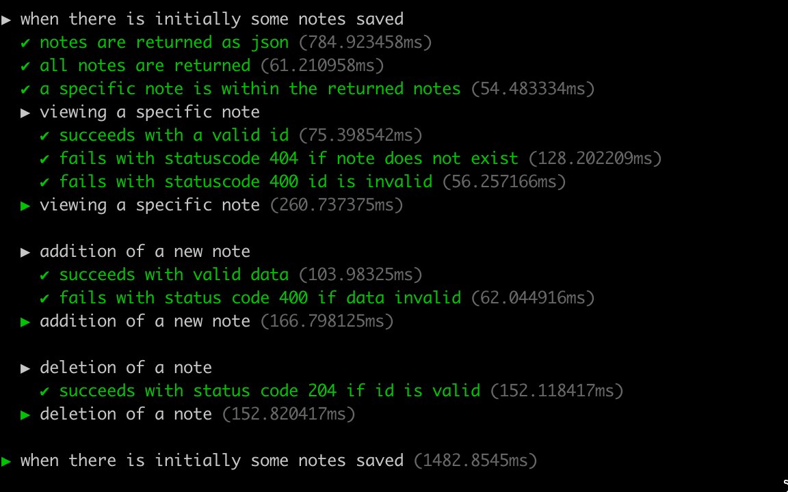

<div class="content">

سنبدأ الآن في كتابة **الاختبارات التكاملية (Integration Tests)** للواجهة الخلفية. في هذا النوع من الاختبارات، يتم فحص واجهات البرمجة (REST API) بالكامل والتحقق من تفاعلها الصحيح مع قاعدة البيانات.

### بيئة الاختبار وقاعدة بيانات مستقلة (Test Environment)

من الممارسات القياسية في Node.js فصل بيئة التطوير عن بيئة الاختبار عن بيئة الإنتاج باستخدام متغير البيئة `NODE_ENV`.

لنقم بتثبيت حزمة **[cross-env](https://www.npmjs.com/package/cross-env)** لضمان التوافق بين مختلف أنظمة التشغيل (Linux و macOS و Windows):

```bash
npm install cross-env
```

ونعدل `package.json`:

```json
{
  "scripts": {
    "start": "cross-env NODE_ENV=production node index.js",
    "dev": "cross-env NODE_ENV=development node --watch index.js",
    "test": "cross-env NODE_ENV=test node --test",
    "lint": "eslint ."
  }
}
```

في ملف `utils/config.js`، نوجه التطبيق لاستخدام قاعدة بيانات مخصصة للاختبار `TEST_MONGODB_URI` أثناء تنفيذ الاختبارات:

```js
require('dotenv').config()

const PORT = process.env.PORT
const MONGODB_URI = process.env.NODE_ENV === 'test' 
  ? process.env.TEST_MONGODB_URI
  : process.env.MONGODB_URI

module.exports = { MONGODB_URI, PORT }
```

---

### مكتبة Supertest وفحص واجهات REST API

تتيح مكتبة **[supertest](https://github.com/visionmedia/supertest)** إرسال طلبات HTTP ومحاكاة استجابة الخادم بسهولة فائقة دون الحاجة لتشغيل خادم الويب على منفذ حقيقي:

```bash
npm install --save-dev supertest
```

لنكتب أول اختبار تكاملي في `tests/note_api.test.js`:

```js
const { test, after, beforeEach, describe } = require('node:test')
const assert = require('node:assert')
const mongoose = require('mongoose')
const supertest = require('supertest')
const app = require('../app')
const Note = require('../models/note')

const api = supertest(app)

const initialNotes = [
  { content: 'HTML is easy', important: false },
  { content: 'Browser can execute only JavaScript', important: true },
]

beforeEach(async () => {
  await Note.deleteMany({})
  await Note.insertMany(initialNotes)
})

test('notes are returned as json', async () => {
  await api
    .get('/api/notes')
    .expect(200)
    .expect('Content-Type', /application\/json/)
})

test('all notes are returned', async () => {
  const response = await api.get('/api/notes')
  assert.strictEqual(response.body.length, initialNotes.length)
})

after(async () => {
  await mongoose.connection.close()
})
```

- تقوم الدالة **`beforeEach`** بإعادة ضبط وتنظيف قاعدة بيانات الاختبار وحفظ البيانات الأولية قبل كل اختبار، لضمان استقلالية نتائج الاختبارات.
- تقوم الدالة **`after`** بإغلاق الاتصال بقاعدة البيانات `mongoose.connection.close()` عند انتهاء الاختبارات.

---

### بناء الدوال غير المتزامنة عبر async / await

تتيح بنية **`async/await`** (من معيار ES7) كتابة العمليات غير المتزامنة (Asynchronous Promises) بأسلوب خطي ونظيف يماثل الكود المتزامن:

```js
// جلب الملاحظات
notesRouter.get('/', async (request, response) => { 
  const notes = await Note.find({})
  response.json(notes)
})

// إضافة ملاحظة جديدة
notesRouter.post('/', async (request, response) => {
  const body = request.body

  const note = new Note({
    content: body.content,
    important: body.important || false,
  })

  const savedNote = await note.save()
  response.status(201).json(savedNote)
})

// جلب ملاحظة فردية
notesRouter.get('/:id', async (request, response) => {
  const note = await Note.findById(request.params.id)
  if (note) {
    response.json(note)
  } else {
    response.status(404).end()
  }
})

// حذف ملاحظة
notesRouter.delete('/:id', async (request, response) => {
  await Note.findByIdAndDelete(request.params.id)
  response.status(204).end()
})
```

> **ميزة Express 5**: في الإصدار 5 من Express، يتم تلقائياً التقاط الاستثناءات الناتجة عن دوال `async/await` وتحويلها لوسيط معالجة الأخطاء دون الحاجة لكتابة كتل `try/catch` متكررة.

---

### تنظيم وتجميع الاختبارات بكتل describe

```js
describe('viewing a specific note', () => {
  test('succeeds with a valid id', async () => {
    const notesAtStart = await helper.notesInDb()
    const noteToView = notesAtStart[0]

    const resultNote = await api
      .get(`/api/notes/${noteToView.id}`)
      .expect(200)
      .expect('Content-Type', /application\/json/)

    assert.deepStrictEqual(resultNote.body, noteToView)
  })

  test('fails with statuscode 404 if note does not exist', async () => {
    const validNonexistingId = await helper.nonExistingId()
    await api.get(`/api/notes/${validNonexistingId}`).expect(404)
  })
})
```



</div>

<div class="tasks">

<h3>التمارين 4.8 - 4.14: اختبارات وتوسيع تطبيق قائمة المدونات</h3>

<h4>4.8: اختبارات قائمة المدونات - الخطوة 1 (Blog List tests step 1)</h4>
اكتب اختباراً باستخدام SuperTest للتحقق من مسار `GET /api/blogs` والتأكد من إرجاع العدد الصحيح من المدونات بصيغة JSON. ثم حول مسار الجلب لاستخدام `async/await`.

<h4>4.9: اختبارات قائمة المدونات - الخطوة 2 (Blog List tests step 2)</h4>
اكتب اختباراً يتحقق من أن المعرف الفريد للمدونة يُسمى `id` وليس `_id`.

<h4>4.10: اختبارات قائمة المدونات - الخطوة 3 (Blog List tests step 3)</h4>
اكتب اختباراً للتحقق من نجاح طلب `POST /api/blogs` في إضافة مدونة جديدة وزيادة العدد الإجمالي للمدونات بواحد، وحول المسار إلى `async/await`.

<h4>4.11*: اختبارات قائمة المدونات - الخطوة 4 (Blog List tests step 4)</h4>
اكتب اختباراً للتحقق من أن غياب خاصية الإعجابات `likes` في طلب الإنشاء يجعل قيمتها الافتراضية 0.

<h4>4.12*: اختبارات قائمة المدونات - الخطوة 5 (Blog List tests step 5)</h4>
اكتب اختباراً يتحقق من إرجاع رمز الحالة **400 Bad Request** إذا كان الحقل `title` أو `url` مفقوداً في طلب إنشاء المدونة.

<h4>4.13: توسيع قائمة المدونات - الخطوة 1 (Blog List expansions step 1)</h4>
أضف مسار حذف مدونة فردية `DELETE /api/blogs/:id` باستخدام `async/await`، واكتب له اختبارات شاملة.

<h4>4.14: توسيع قائمة المدونات - الخطوة 2 (Blog List expansions step 2)</h4>
أضف مسار تعديل مدونة `PUT /api/blogs/:id` لتحديث عدد الإعجابات (Likes)، واكتب له اختبارات للتحقق من نجاح التعديل.

</div>

