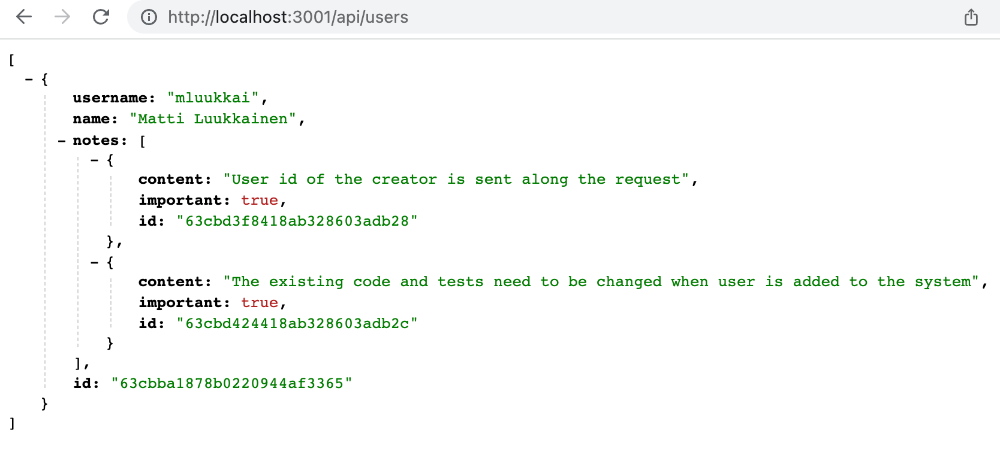

<div class="content">

سنقوم الآن بإضافة إدارة المستخدمين (User Administration) والمصادقة (Authentication) والتفويض (Authorization) إلى تطبيقنا.

نريد حفظ المستخدمين في قاعدة البيانات وربط كل ملاحظة بالمستخدم الذي أنشأها؛ وتوجد علاقة واحد لمتعدد (One-to-Many) بين المستخدم والملاحظات:


---

### نمذجة العلاقات والمراجع بين المجموعات (References across collections)

في قواعد البيانات العلائقية (Relational Databases)، تُخزن المعرفات كمفاتيح أجنبية (Foreign Keys). أما في قواعد البيانات المستندية (Document Databases مثل MongoDB)، فلدينا مرونة أكبر لتمثيل العلاقات:
1. تخزين معرف المستخدم في مستند الملاحظة.
2. تخزين مصفوفة معرفات الملاحظات داخل مستند المستخدم.
3. أو تخزين المراجع في كلا المستندين معاً.

سنعتمد تخزين المراجع في الاتجاهين لسهولة وسرعة الاستعلام.

---

### مخطط المستخدم وتشفير كلمات المرور (bcrypt)

**قاعدة أمنية بالغة الأهمية**: *يُمنع منعاً باتاً تخزين كلمات المرور كنصوص عادية (Plaintext) في قاعدة البيانات*. بدلاً من ذلك، نستخدم دوال التجزئة الرياضية أحادية الاتجاه (Cryptographic Hash Functions) لتخزين الـ **`passwordHash`**.

لنقم بتثبيت حزمة **[bcrypt](https://github.com/kelektiv/node.bcrypt.js)**:

```bash
npm install bcrypt
```

لننشئ مخطط المستخدم `models/user.js`:

```js
const mongoose = require('mongoose')

const userSchema = new mongoose.Schema({
  username: {
    type: String,
    required: true,
    unique: true
  },
  name: String,
  passwordHash: String,
  notes: [
    {
      type: mongoose.Schema.Types.ObjectId,
      ref: 'Note'
    }
  ],
})

userSchema.set('toJSON', {
  transform: (document, returnedObject) => {
    returnedObject.id = returnedObject._id.toString()
    delete returnedObject._id
    delete returnedObject.__v
    // إخفاء الهاش السري وعدم كشفه في الاستجابة
    delete returnedObject.passwordHash
  }
})

const User = mongoose.model('User', userSchema)
module.exports = User
```

ونقوم بتحديث مخطط الملاحظة `models/note.js` للإشارة إلى المستخدم:

```js
const noteSchema = new mongoose.Schema({
  content: {
    type: String,
    required: true,
    minlength: 5
  },
  important: Boolean,
  user: {
    type: mongoose.Schema.Types.ObjectId,
    ref: 'User'
  }
})
```

---

### مسار إنشاء المستخدمين (User Creation)

نُنشئ موجه المستخدمين `controllers/users.js`:

```js
const bcrypt = require('bcrypt')
const usersRouter = require('express').Router()
const User = require('../models/user')

// إنشاء مستخدم جديد
usersRouter.post('/', async (request, response) => {
  const { username, name, password } = request.body

  if (!password || password.length < 3) {
    return response.status(400).json({ error: 'password must be at least 3 characters long' })
  }

  const saltRounds = 10
  const passwordHash = await bcrypt.hash(password, saltRounds)

  const user = new User({
    username,
    name,
    passwordHash,
  })

  const savedUser = await user.save()
  response.status(201).json(savedUser)
})

// جلب قائمة المستخدمين
usersRouter.get('/', async (request, response) => {
  const users = await User.find({})
  response.json(users)
})

module.exports = usersRouter
```

---

### ربط الملاحظات بالمستخدمين ودمج البيانات عبر `populate`

عند إضافة ملاحظة جديدة، نقوم بحفظ معرف المستخدم داخل الملاحظة وإضافة معرف الملاحظة إلى مصفوفة ملاحظات المستخدم في `controllers/notes.js`:

```js
notesRouter.post('/', async (request, response) => {
  const body = request.body

  const user = await User.findById(body.userId)
  if (!user) {
    return response.status(400).json({ error: 'userId missing or not valid' })
  }

  const note = new Note({
    content: body.content,
    important: body.important || false,
    user: user._id
  })

  const savedNote = await note.save()
  user.notes = user.notes.concat(savedNote._id)
  await user.save()

  response.status(201).json(savedNote)
})
```

لاسترجاع البيانات المرجعية المترابطة (على غرار استعلامات `JOIN` في SQL)، توفر Mongoose الدالة **`populate()`**:

```js
// جلب المستخدمين مع تضمين تفاصيل ملاحظاتهم
usersRouter.get('/', async (request, response) => {
  const users = await User
    .find({})
    .populate('notes', { content: 1, important: 1 })

  response.json(users)
})

// جلب الملاحظات مع تضمين بيانات المستخدم
notesRouter.get('/', async (request, response) => {
  const notes = await Note
    .find({})
    .populate('user', { username: 1, name: 1 })

  response.json(notes)
})
```



</div>

