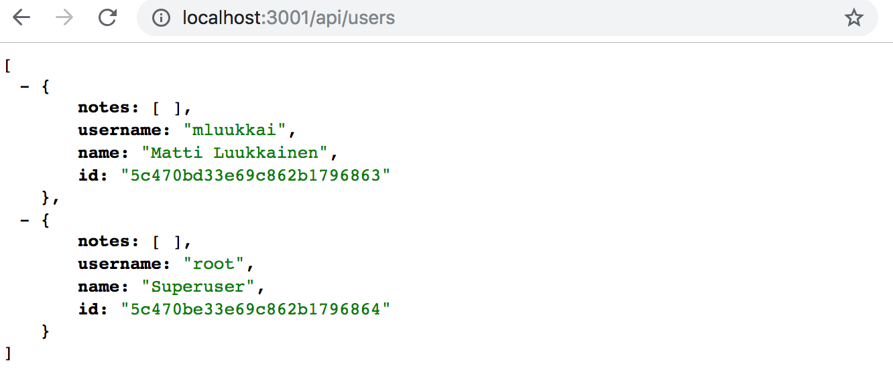
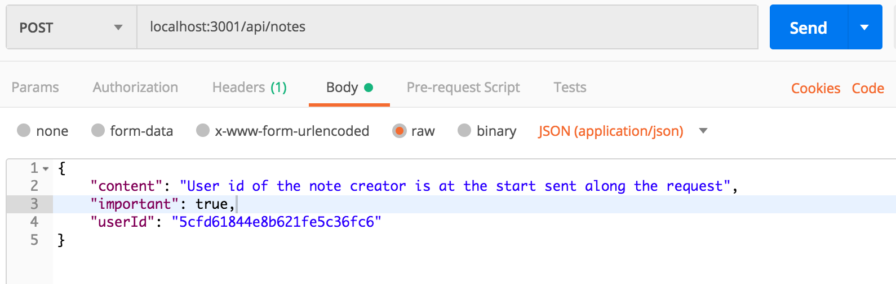
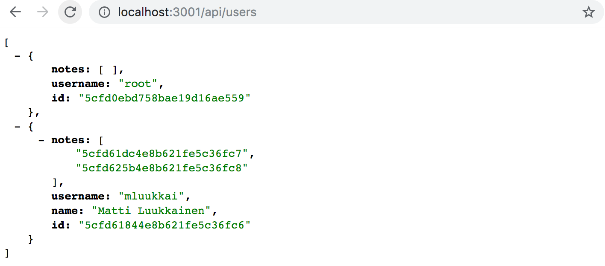
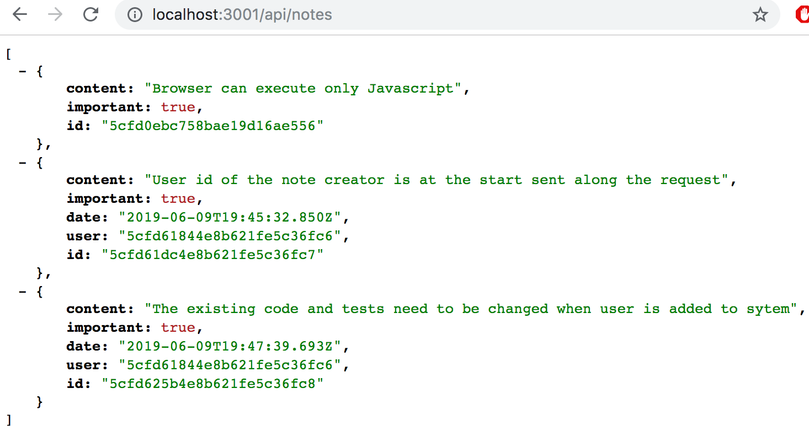
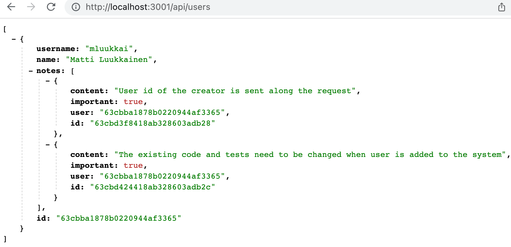
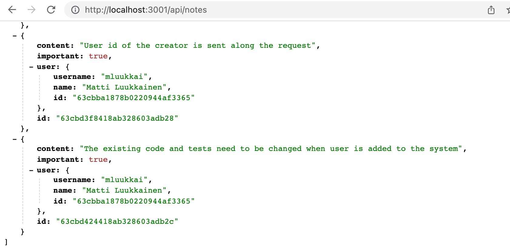

<div class="content">

نريد إضافة مصادقة المستخدمين وتفويض الصلاحيات (User authentication and authorization) إلى تطبيقنا. يجب تخزين المستخدمين في قاعدة البيانات، ويجب ربط كل ملاحظة بالمستخدم الذي أنشأها. يجب ألا يُسمح بحذف الملاحظة وتعديلها إلا للمستخدم الذي أنشأها.

دعونا نبدأ بإضافة معلومات حول المستخدمين إلى قاعدة البيانات. توجد علاقة واحد إلى متعدد (One-to-many relationship) بين المستخدم (<i>User</i>) والملاحظات (<i>Note</i>):


إذا كنا نعمل مع قاعدة بيانات علائقية (Relational database)، فسيكون التنفيذ مباشراً وبسيطاً. سيكون لكلا الموردين جداول قاعدة بيانات منفصلة، وسيتم تخزين معرف (ID) المستخدم الذي أنشأ الملاحظة في جدول الملاحظات كمفتاح أجنبي (Foreign key).

عند العمل مع قواعد البيانات الوثائقية (Document databases)، يكون الوضع مختلفاً قليلاً، حيث توجد العديد من الطرق المختلفة لنمذجة هذه الحالة وتصميمها.

يحفظ الحل الحالي كل ملاحظة في *مجموعة الملاحظات (Notes collection)* في قاعدة البيانات. إذا كنا لا نريد تغيير هذه المجموعة الحالية، فإن الخيار الطبيعي هو حفظ المستخدمين في مجموعتهم الخاصة، مثل <i>users</i> على سبيل المثال.

كما هو الحال مع جميع قواعد البيانات الوثائقية، يمكننا استخدام معرفات الكائنات (Object IDs) في Mongo للإشارة إلى الوثائق في المجموعات الأخرى. وهذا مشابه لاستخدام المفاتيح الأجنبية في قواعد البيانات العلائقية.

تقليدياً، لا تدعم قواعد البيانات الوثائقية مثل Mongo *استعلامات الربط (Join queries)* المتوفرة في قواعد البيانات العلائقية، والتي تُستخدم لتجميع البيانات من جداول متعددة. ومع ذلك، بدءاً من الإصدار 3.2، دعمت Mongo [استعلامات تجميع البحث (Lookup aggregation queries)](https://docs.mongodb.com/manual/reference/operator/aggregation/lookup/). لن نتطرق إلى هذه الوظيفة في هذه الدورة.

إذا احتجنا إلى وظائف مشابهة لاستعلامات الربط، فسنقوم بتنفيذها في كود تطبيقنا عن طريق إجراء استعلامات متعددة. في بعض الحالات، يمكن لـ Mongoose الاهتمام بربط البيانات وتجميعها، مما يعطي مظهر استعلام الربط. ومع ذلك، حتى في هذه الحالات، تجري Mongoose استعلامات متعددة لقاعدة البيانات في الخلفية.

### المراجع عبر المجموعات (References across collections)

إذا كنا نستخدم قاعدة بيانات علائقية، فستحتوي الملاحظة على *مفتاح مرجعي (Reference key)* يشير إلى المستخدم الذي أنشأها. في قواعد البيانات الوثائقية، يمكننا فعل الشيء نفسه.

دعنا نفترض أن مجموعة <i>users</i> تحتوي على مستخدمين اثنين:

```js
[
  {
    username: 'mluukkai',
    _id: 123456,
  },
  {
    username: 'hellas',
    _id: 141414,
  },
]
```

تحتوي مجموعة <i>notes</i> على ثلاث ملاحظات تحتوي جميعها على حقل <i>user</i> يشير إلى مستخدم في مجموعة <i>users</i>:

```js
[
  {
    content: 'HTML is easy',
    important: false,
    _id: 221212,
    user: 123456,
  },
  {
    content: 'The most important operations of HTTP protocol are GET and POST',
    important: true,
    _id: 221255,
    user: 123456,
  },
  {
    content: 'A proper dinosaur codes with Java',
    important: false,
    _id: 221244,
    user: 141414,
  },
]
```

لا تتطلب قواعد البيانات الوثائقية تخزين المفتاح الأجنبي في موارد الملاحظات بالضرورة، بل يمكن *أيضاً* تخزينه في مجموعة المستخدمين، أو حتى في كليهما:

```js
[
  {
    username: 'mluukkai',
    _id: 123456,
    notes: [221212, 221255],
  },
  {
    username: 'hellas',
    _id: 141414,
    notes: [221244],
  },
]
```

نظراً لأنه يمكن أن يكون للمستخدمين العديد من الملاحظات، يتم تخزين المعرفات ذات الصلة في مصفوفة في حقل <i>notes</i>.

توفر قواعد البيانات الوثائقية أيضاً طريقة مختلفة جذرياً لتنظيم البيانات: في بعض الحالات، قد يكون من المفيد تضمين (Nest) مصفوفة الملاحظات بأكملها كجزء من الوثائق في مجموعة المستخدمين:

```js
[
  {
    username: 'mluukkai',
    _id: 123456,
    notes: [
      {
        content: 'HTML is easy',
        important: false,
      },
      {
        content: 'The most important operations of HTTP protocol are GET and POST',
        important: true,
      },
    ],
  },
  {
    username: 'hellas',
    _id: 141414,
    notes: [
      {
        content:
          'A proper dinosaur codes with Java',
        important: false,
      },
    ],
  },
]
```

في هذا المخطط، سيتم تضمين الملاحظات بإحكام تحت المستخدمين ولن تقوم قاعدة البيانات بإنشاء معرفات منفصلة لها.

إن بنية ومخطط قاعدة البيانات ليسا بديهيين كما كان الحال مع قواعد البيانات العلائقية. يجب أن يدعم المخطط المختار حالات استخدام التطبيق بأفضل شكل ممكن. هذا ليس قرار تصميم بسيط، حيث لا تكون جميع حالات استخدام التطبيقات معروفة مسبقاً عند اتخاذ قرار التصميم.

من المفارقات أن قواعد البيانات عديمة المخطط (Schemaless) مثل Mongo تتطلب من المطورين اتخاذ قرارات تصميم أكثر جذرية حول تنظيم البيانات في بداية المشروع مقارنة بقواعد البيانات العلائقية ذات المخططات الصارمة. في المتوسط، توفر قواعد البيانات العلائقية طريقة مناسبة إلى حد ما لتنظيم البيانات للعديد من التطبيقات تلقائياً.

### مخطط Mongoose للمستخدمين (Mongoose schema for users)

في هذه الحالة، نقرر تخزين معرفات الملاحظات التي أنشأها المستخدم في وثيقة المستخدم. دعنا نحدد نموذج تمثيل المستخدم في ملف <i>models/user.js</i>:

```js
const mongoose = require('mongoose')

const userSchema = new mongoose.Schema({
  username: String,
  name: String,
  passwordHash: String,
  notes: [
    {
      type: mongoose.Schema.Types.ObjectId,
      ref: 'Note'
    }
  ],
})

userSchema.set('toJSON', {
  transform: (document, returnedObject) => {
    returnedObject.id = returnedObject._id.toString()
    delete returnedObject._id
    delete returnedObject.__v
    // يجب عدم كشف passwordHash أبداً
    delete returnedObject.passwordHash
  }
})

const User = mongoose.model('User', userSchema)

module.exports = User
```

يتم تخزين معرفات الملاحظات داخل وثيقة المستخدم كمصفوفة من معرفات Mongo. التعريف كالتالي:

```js
{
  type: mongoose.Schema.Types.ObjectId,
  ref: 'Note'
}
```

نوع الحقل هو <i>ObjectId</i>، مما يعني أنه يشير إلى وثيقة أخرى. يحدد حقل <i>ref</i> اسم النموذج الذي تتم الإشارة إليه. لا تعرف Mongo بطبيعتها أن هذا حقل يشير إلى الملاحظات، فهذه الصيغة مرتبطة ومحددة بالكامل بواسطة Mongoose فقط.

دعنا نوسع مخطط الملاحظة المحدد في ملف <i>models/note.js</i> بحيث تحتوي الملاحظة على معلومات حول المستخدم الذي أنشأها:

```js
const noteSchema = new mongoose.Schema({
  content: {
    type: String,
    required: true,
    minlength: 5
  },
  important: Boolean,
  // highlight-start
  user: {
    type: mongoose.Schema.Types.ObjectId,
    ref: 'User'
  }
  // highlight-end
})
```

في تناقض صارخ مع اصطلاحات قواعد البيانات العلائقية، *يتم الآن تخزين المراجع في كلتا الوثيقتين*: تشير الملاحظة إلى المستخدم الذي أنشأها، ولدى المستخدم مصفوفة من المراجع لجميع الملاحظات التي أنشأها.

### إنشاء المستخدمين (Creating users)

دعونا ننفذ مساراً لإنشاء مستخدمين جدد. لدى المستخدمين <i>username</i> فريد، و <i>name</i> وشيء يسمى <i>passwordHash</i>. تجزئة كلمة المرور (Password hash) هي ناتج [دالة تجزئة أحادية الاتجاه (One-way cryptographic hash function)](https://en.wikipedia.org/wiki/Cryptographic_hash_function) مطبقة على كلمة مرور المستخدم. ليس من الحكمة أبداً تخزين كلمات المرور كنص عادي غير مشفر في قاعدة البيانات!

دعنا نثبت حزمة [bcrypt](https://github.com/kelektiv/node.bcrypt.js) لتوليد تجزئات كلمات المرور:

```bash
npm install bcrypt
```

يتم إنشاء مستخدمين جدد بما يتوافق مع اصطلاحات RESTful التي تمت مناقشتها في [الجزء 3](/ar/part3/node_js_and_express#rest)، عن طريق إجراء طلب HTTP POST إلى مسار <i>users</i>.

دعنا نحدد *موجهاً (Router)* منفصلاً للتعامل مع المستخدمين في ملف <i>controllers/users.js</i> جديد. دعنا نستخدم الموجه في تطبيقنا في ملف <i>app.js</i>، بحيث يتعامل مع الطلبات المقدمة إلى عنوان <i>/api/users</i>:

```js
// ...
const notesRouter = require('./controllers/notes')
const usersRouter = require('./controllers/users') // highlight-line

// ...

app.use('/api/notes', notesRouter)
app.use('/api/users', usersRouter) // highlight-line

// ...
```

محتويات ملف <i>controllers/users.js</i>، الذي يحدد الموجه هي كما يلي:

```js
const bcrypt = require('bcrypt')
const usersRouter = require('express').Router()
const User = require('../models/user')

usersRouter.post('/', async (request, response) => {
  const { username, name, password } = request.body

  const saltRounds = 10
  const passwordHash = await bcrypt.hash(password, saltRounds)

  const user = new User({
    username,
    name,
    passwordHash,
  })

  const savedUser = await user.save()

  response.status(201).json(savedUser)
})

module.exports = usersRouter
```

كلمة المرور المرسلة في الطلب *لا* تُحفظ في قاعدة البيانات. نحن نخزن *تجزئة (Hash)* كلمة المرور التي تم إنشاؤها باستخدام دالة _bcrypt.hash_.

إن أساسيات [تخزين كلمات المرور](https://bytebytego.com/guides/how-to-store-passwords-in-the-database/) تقع خارج نطاق مادة هذه الدورة. لن نناقش ما يعنيه الرقم السحري 10 المسند إلى متغير [saltRounds](https://github.com/kelektiv/node.bcrypt.js/#a-note-on-rounds)، ولكن يمكنك قراءة المزيد عنه في المواد المرتبطة.

لا يحتوي كودنا الحالي على أي معالجة للأخطاء أو تحقق من صحة المدخلات للتحقق من أن اسم المستخدم وكلمة المرور بالتنسيق المطلوب.

يمكن ويجب في البداية اختبار الميزة الجديدة يدوياً باستخدام أداة مثل Postman. ومع ذلك، سرعان ما سيصبح اختبار الأشياء يدوياً مرهقاً للغاية، خاصة بمجرد تنفيذ وظيفة تفرض أن تكون أسماء المستخدمين فريدة.

يتطلب كتابة الاختبارات المؤتمتة جهداً أقل بكثير، وسيجعل تطوير تطبيقنا أسهل بكثير.

يمكن أن تبدو اختباراتنا الأولية هكذا:

```js
const bcrypt = require('bcrypt')
const User = require('../models/user')

//...

describe('when there is initially one user in db', () => {
  beforeEach(async () => {
    await User.deleteMany({})

    const passwordHash = await bcrypt.hash('sekret', 10)
    const user = new User({ username: 'root', passwordHash })

    await user.save()
  })

  test('creation succeeds with a fresh username', async () => {
    const usersAtStart = await helper.usersInDb()

    const newUser = {
      username: 'mluukkai',
      name: 'Matti Luukkainen',
      password: 'salainen',
    }

    await api
      .post('/api/users')
      .send(newUser)
      .expect(201)
      .expect('Content-Type', /application\/json/)

    const usersAtEnd = await helper.usersInDb()
    assert.strictEqual(usersAtEnd.length, usersAtStart.length + 1)

    const usernames = usersAtEnd.map(u => u.username)
    assert(usernames.includes(newUser.username))
  })
})
```

تستخدم الاختبارات الدالة المساعدة <i>()usersInDb</i> التي قمنا بتنفيذها في ملف <i>tests/test_helper.js</i>. تُستخدم الدالة لمساعدتنا في التحقق من حالة قاعدة البيانات بعد إنشاء مستخدم:

```js
const User = require('../models/user')

// ...

const usersInDb = async () => {
  const users = await User.find({})
  return users.map(u => u.toJSON())
}

module.exports = {
  initialNotes,
  nonExistingId,
  notesInDb,
  usersInDb,
}
```

تضيف كتلة <i>beforeEach</i> مستخدماً يحمل اسم المستخدم <i>root</i> إلى قاعدة البيانات. يمكننا كتابة اختبار جديد يتحقق من أنه لا يمكن إنشاء مستخدم جديد بنفس اسم المستخدم:

```js
describe('when there is initially one user in db', () => {
  // ...

  test('creation fails with proper statuscode and message if username already taken', async () => {
    const usersAtStart = await helper.usersInDb()

    const newUser = {
      username: 'root',
      name: 'Superuser',
      password: 'salainen',
    }

    const result = await api
      .post('/api/users')
      .send(newUser)
      .expect(400)
      .expect('Content-Type', /application\/json/)

    const usersAtEnd = await helper.usersInDb()
    assert(result.body.error.includes('expected `username` to be unique'))

    assert.strictEqual(usersAtEnd.length, usersAtStart.length)
  })
})
```

من الواضح أن حالة الاختبار لن تجتاز في هذه المرحلة. نحن في الأساس نمارس [التطوير الموجه بالاختبارات (TDD)](https://en.wikipedia.org/wiki/Test-driven_development)، حيث تُكتب اختبارات الوظائف الجديدة قبل تنفيذ الوظيفة نفسها.

لا توفر عمليات التحقق من صحة Mongoose طريقة مباشرة للتحقق من فرادة (Uniqueness) قيمة الحقل. ومع ذلك، من الممكن تحقيق الفرادة عن طريق تحديد [فهرس الفرادة (Uniqueness index)](https://mongoosejs.com/docs/schematypes.html) للحقل. يتم التعريف على النحو التالي:

```js
const mongoose = require('mongoose')

const userSchema = mongoose.Schema({
  // highlight-start
  username: {
    type: String,
    required: true,
    unique: true // هذا يضمن فرادة اسم المستخدم وعدم تكراره
  },
  // highlight-end
  name: String,
  passwordHash: String,
  notes: [
    {
      type: mongoose.Schema.Types.ObjectId,
      ref: 'Note'
    }
  ],
})

// ...
```

ومع ذلك، نريد أن نكون حذرين عند استخدام فهرس الفرادة. إذا كانت هناك وثائق موجودة بالفعل في قاعدة البيانات تنتهك شرط الفرادة، [فلن يتم إنشاء الفهرس](https://dev.to/akshatsinghania/mongoose-unique-not-working-16bf). لذلك عند إضافة فهرس الفرادة، تأكد من أن قاعدة البيانات في حالة سليمة! أضاف الاختبار أعلاه المستخدم باسم المستخدم _root_ إلى قاعدة البيانات مرتين، ويجب إزالة هذه التكرارات حتى يتم تشكيل الفهرس ويعمل الكود.

لا تكتشف عمليات التحقق في Mongoose انتهاك الفهرس، وبدلاً من _ValidationError_ تُرجع خطأ من نوع _MongoServerError_. لذلك نحتاج إلى توسيع معالج الأخطاء لهذه الحالة:

```js
const errorHandler = (error, request, response, next) => {
  if (error.name === 'CastError') {
    return response.status(400).send({ error: 'malformatted id' })
  } else if (error.name === 'ValidationError') {
    return response.status(400).json({ error: error.message })
// highlight-start
  } else if (error.name === 'MongoServerError' && error.message.includes('E11000 duplicate key error')) {
    return response.status(400).json({ error: 'expected `username` to be unique' })
  }
  // highlight-end

  next(error)
}
```

بعد هذه التغييرات، ستجتاز الاختبارات بنجاح.

يمكننا أيضاً تنفيذ عمليات تحقق أخرى في إنشاء المستخدم. يمكننا التحقق من أن اسم المستخدم طويل بما فيه الكفاية، وأن اسم المستخدم يتكون فقط من الأحرف المسموح بها، أو أن كلمة المرور قوية بما فيه الكفاية. يُترك تنفيذ هذه الوظائف كتمرين اختياري.

قبل أن نمضي قدماً، دعنا نضيف تنفيذاً أولياً لمعالج مسار يُرجع جميع المستخدمين في قاعدة البيانات:

```js
usersRouter.get('/', async (request, response) => {
  const users = await User.find({})
  response.json(users)
})
```

لإنشاء مستخدمين جدد في بيئة الإنتاج أو التطوير، يمكنك إرسال طلب POST إلى ```/api/users/``` عبر Postman أو عميل REST بالتنسيق التالي:

```js
{
    "username": "root",
    "name": "Superuser",
    "password": "salainen"
}
```

تبدو القائمة هكذا:



يمكنك العثور على شيفرة تطبيقنا الحالي بالكامل في الفرع <i>part4-7</i> من [مستودع GitHub هذا](https://github.com/fullstack-hy2020/part3-notes-backend/tree/part4-7).

### إنشاء ملاحظة جديدة (Creating a new note)

يجب تحديث الشيفرة الخاصة بإنشاء ملاحظة جديدة بحيث يتم إسناد الملاحظة إلى المستخدم الذي أنشأها.

دعونا نوسع تنفيذنا الحالي في <i>controllers/notes.js</i> بحيث يتم إرسال المعلومات حول المستخدم الذي أنشأ الملاحظة في حقل <i>userId</i> لجسم الطلب:

```js
const notesRouter = require('express').Router()
const Note = require('../models/note')
const User = require('../models/user') //highlight-line

//...

notesRouter.post('/', async (request, response) => {
  const body = request.body

  const user = await User.findById(body.userId)// highlight-line

  // highlight-start
  if (!user) {
    return response.status(400).json({ error: 'userId missing or not valid' })
  }
  // highlight-end

  const note = new Note({
    content: body.content,
    important: body.important || false,
    user: user._id //highlight-line
  })

  const savedNote = await note.save()
  user.notes = user.notes.concat(savedNote._id) //highlight-line
  await user.save()  //highlight-line

  response.status(201).json(savedNote)
})

// ...
```

يتم أولاً الاستعلام في قاعدة البيانات عن مستخدم باستخدام <i>userId</i> المقدم في الطلب. إذا لم يتم العثور على المستخدم، فسيتم إرسال الاستجابة برمز الحالة 400 (<i>Bad Request</i>) ورسالة خطأ: <i>"userId missing or not valid"</i>.

تجدر الإشارة إلى أن كائن <i>user</i> يتغير أيضاً. يتم تخزين <i>id</i> الملاحظة في حقل <i>notes</i> لكائن <i>user</i>:

```js
const user = await User.findById(body.userId)

// ...

user.notes = user.notes.concat(savedNote._id)
await user.save()
```

دعنا نحاول إنشاء ملاحظة جديدة:



يبدو أن العملية تعمل. دعنا نضيف ملاحظة أخرى ثم نزور المسار لجلب جميع المستخدمين:



يمكننا أن نرى أن المستخدم لديه ملاحظتان.

وبالمثل، يمكن رؤية معرفات المستخدمين الذين أنشأوا الملاحظات عندما نزور المسار لجلب جميع الملاحظات:



بسبب التغييرات التي أجريناها، لم تعد الاختبارات تجتاز، لكننا نترك إصلاح الاختبارات كتمرين اختياري. كما أن التغييرات التي أجريناها لم تؤخذ في الحسبان في الواجهة الأمامية، وبالتالي فإن وظيفة إنشاء الملاحظات لم تعد تعمل هناك. سنصلح الواجهة الأمامية في الجزء 5 من الدورة.

### التعبئة والتضمين (Populate)

نود أن تعمل واجهة برمجة التطبيقات الخاصة بنا بطريقة تجعل كائنات المستخدم تحتوي أيضاً على محتويات ملاحظات المستخدم وليس فقط معرفاتها عند إجراء طلب HTTP GET إلى مسار <i>/api/users</i>. في قاعدة البيانات العلائقية، سيتم تنفيذ هذه الوظيفة باستخدام *استعلام الربط (Join query)*.

كما ذكرنا سابقاً، لا تدعم قواعد البيانات الوثائقية استعلامات الربط بين المجموعات بشكل أصيل، ولكن يمكن لمكتبة Mongoose إجراء بعض عمليات الربط هذه نيابة عنا. تنجز Mongoose عملية الربط عن طريق إجراء استعلامات متعددة، وهو ما يختلف عن استعلامات الربط في قواعد البيانات العلائقية والتي تكون *معاملاتية متكاملة (Transactional)*، مما يعني أن حالة قاعدة البيانات لا تتغير خلال الوقت الذي يتم فيه إجراء الاستعلام. مع استعلامات الربط في Mongoose، لا يمكن لأي شيء أن يضمن أن الحالة بين المجموعات التي يتم ربطها متسقة، مما يعني أنه إذا أجرينا استعلاماً يربط مجموعات المستخدمين والملاحظات، فقد تتغير حالة المجموعات أثناء الاستعلام.

يتم إجراء ربط Mongoose باستخدام التابع [populate](http://mongoosejs.com/docs/populate.html). دعنا نحدث المسار الذي يُرجع جميع المستخدمين أولاً في ملف <i>controllers/users.js</i>:

```js
usersRouter.get('/', async (request, response) => {
  const users = await User  // highlight-line
    .find({}).populate('notes') // highlight-line

  response.json(users)
})
```

يتم ربط التابع [populate](http://mongoosejs.com/docs/populate.html) بعد تابع <i>find</i> الذي يجري الاستعلام الأولي. يحدد المعامل المعطى لتابع populate أنه سيتم استبدال <i>معرفات ids</i> التي تشير إلى كائنات <i>note</i> في حقل <i>notes</i> لوثيقة <i>user</i> بوثائق <i>note</i> المشار إليها الفعلية. تستعلم Mongoose أولاً عن مجموعة <i>users</i> لقائمة المستخدمين، ثم تستعلم عن المجموعة المقابلة لكائن النموذج المحدد بواسطة خاصية <i>ref</i> في مخطط المستخدمين للبيانات ذات معرف الكائن المحدد.

النتيجة هي بالضبط ما أردناه تقريباً:



يمكننا استخدام تابع populate لاختيار الحقول التي نريد تضمينها من الوثائق. بالإضافة إلى حقل <i>id</i>، نحن مهتمون الآن فقط بـ <i>content</i> و <i>important</i>.

يتم اختيار الحقول باستخدام [صيغة استعلام](https://www.mongodb.com/docs/manual/tutorial/project-fields-from-query-results/#return-the-specified-fields-and-the-_id-field-only) Mongo:

```js
usersRouter.get('/', async (request, response) => {
  const users = await User
    .find({}).populate('notes', { content: 1, important: 1 })

  response.json(users)
})
```

النتيجة الآن تماماً كما نريدها أن تكون:


دعنا نضيف أيضاً تعبئة وتضميناً مناسباً لمعلومات المستخدم إلى الملاحظات في ملف <i>controllers/notes.js</i>:

```js
notesRouter.get('/', async (request, response) => {
  const notes = await Note
    .find({}).populate('user', { username: 1, name: 1 })

  response.json(notes)
})
```

الآن تتم إضافة معلومات المستخدم إلى حقل <i>user</i> لكائنات الملاحظات.



من المهم أن نفهم أن قاعدة البيانات لا تعرف أن المعرفات المخزنة في حقل <i>user</i> لمجموعة الملاحظات تشير إلى وثائق في مجموعة المستخدمين.

تعتمد وظيفة التابع <i>populate</i> في Mongoose على حقيقة أننا حددنا "أنواعاً" للمراجع في مخطط Mongoose باستخدام خيار <i>ref</i>:

```js
const noteSchema = new mongoose.Schema({
  content: {
    type: String,
    required: true,
    minlength: 5
  },
  important: Boolean,
  user: {
    type: mongoose.Schema.Types.ObjectId,
    ref: 'User'
  }
})
```

يمكنك العثور على شيفرة تطبيقنا الحالي بالكامل في الفرع <i>part4-8</i> من [مستودع GitHub هذا](https://github.com/fullstack-hy2020/part3-notes-backend/tree/part4-8).

</div>
