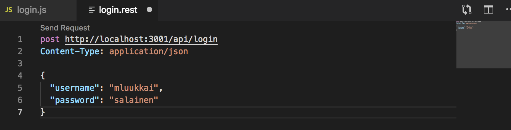
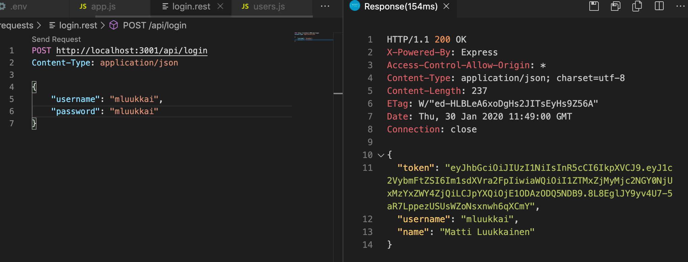
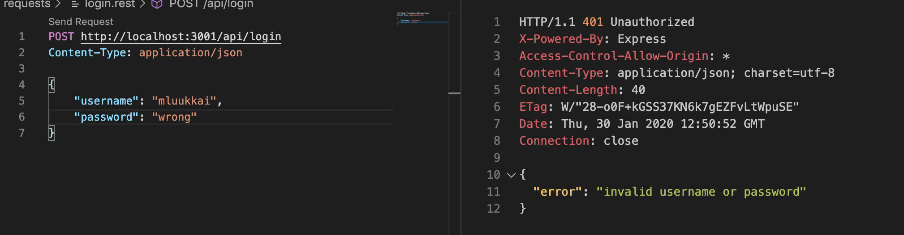
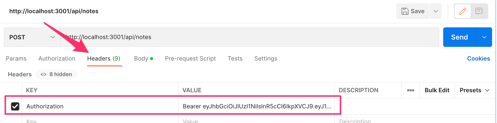
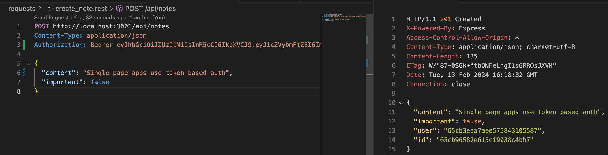
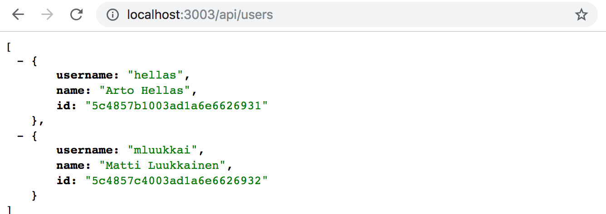
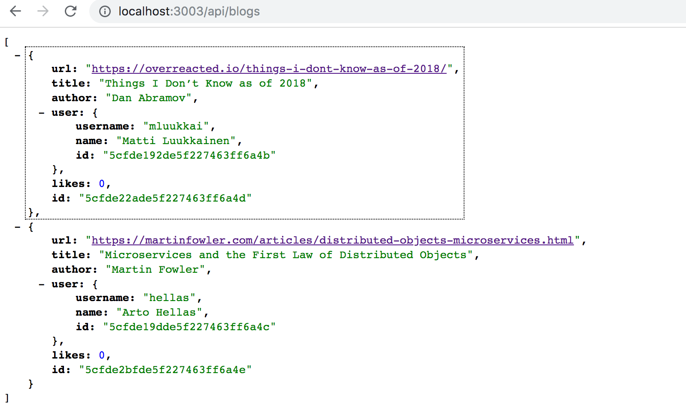
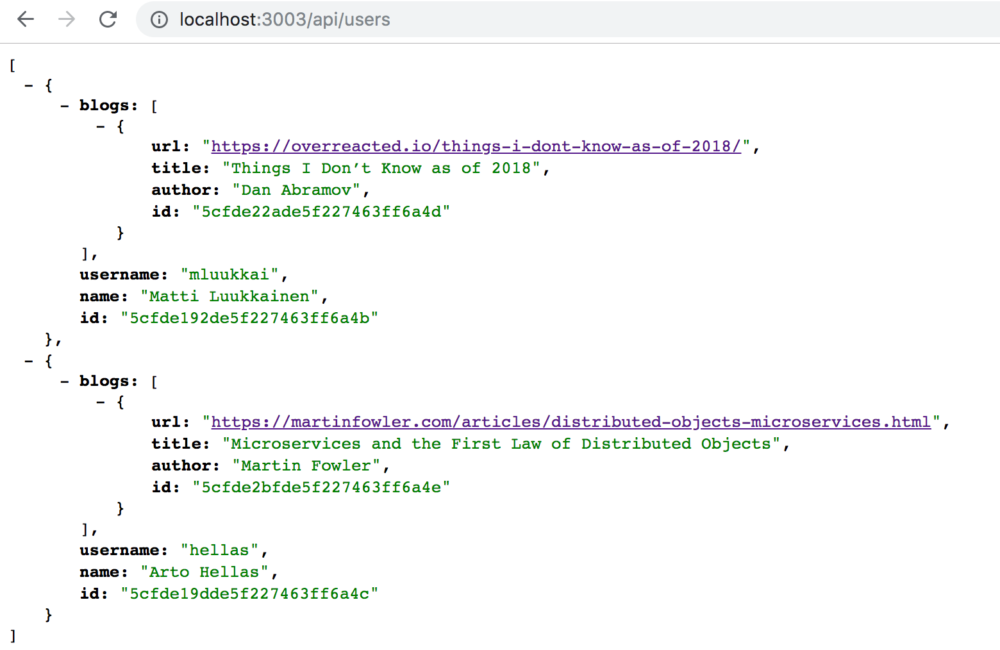

<div class="content">

يجب أن يكون المستخدمون قادرين على تسجيل الدخول إلى تطبيقنا، وعندما يقوم المستخدم بتسجيل الدخول، يجب إرفاق معلومات المستخدم تلقائياً بأي ملاحظات جديدة ينشئها.

سنقوم الآن بتنفيذ دعم [المصادقة المعتمدة على الرمز المميز (Token-based authentication)](https://www.okta.com/identity-101/what-is-token-based-authentication/) في الواجهة الخلفية.

مبادئ المصادقة المعتمدة على الرمز موضحة في مخطط التسلسل التالي:


- يبدأ المستخدم بتسجيل الدخول باستخدام نموذج تسجيل دخول تم تنفيذه باستخدام React
    - سنضيف نموذج تسجيل الدخول إلى الواجهة الأمامية في [الجزء 5](/ar/part5)
- يؤدي هذا إلى قيام كود React بإرسال اسم المستخدم وكلمة المرور إلى عنوان الخادم <i>/api/login</i> كطلب HTTP POST.
- إذا كان اسم المستخدم وكلمة المرور صحيحين، يُنشئ الخادم *رمزاً مميزاً (Token)* يحدد هوية المستخدم الذي قام بتسجيل الدخول بطريقة ما.
    - الرمز المميز موقّع رقمياً، مما يجعل من المستحيل تزويره (بالوسائل التشفيرية)
- يستجيب الخادم برمز حالة يشير إلى نجاح العملية ويُرجع الرمز المميز مع الاستجابة.
- يحفظ المتصفح الرمز المميز، على سبيل المثال في حالة (State) تطبيق React.
- عندما ينشئ المستخدم ملاحظة جديدة (أو يقوم بعملية أخرى تتطلب التحقق من الهوية)، يرسل كود React الرمز المميز إلى الخادم مع الطلب.
- يستخدم الخادم الرمز المميز لتحديد هوية المستخدم.

دعونا أولاً ننفذ وظيفة تسجيل الدخول. قم بتثبيت مكتبة [jsonwebtoken](https://github.com/auth0/node-jsonwebtoken)، والتي تتيح لنا إنشاء [رموز ويب JSON (JSON Web Tokens - JWT)](https://jwt.io/).

```bash
npm install jsonwebtoken
```

توضع الشيفرة البرمجية لوظيفة تسجيل الدخول في الملف <i>controllers/login.js</i>.

```js
const jwt = require('jsonwebtoken')
const bcrypt = require('bcrypt')
const loginRouter = require('express').Router()
const User = require('../models/user')

loginRouter.post('/', async (request, response) => {
  const { username, password } = request.body

  const user = await User.findOne({ username })
  const passwordCorrect = user === null
    ? false
    : await bcrypt.compare(password, user.passwordHash)

  if (!(user && passwordCorrect)) {
    return response.status(401).json({
      error: 'invalid username or password'
    })
  }

  const userForToken = {
    username: user.username,
    id: user._id,
  }

  const token = jwt.sign(userForToken, process.env.SECRET)

  response
    .status(200)
    .send({ token, username: user.username, name: user.name })
})

module.exports = loginRouter
```

تبدأ الشيفرة بالبحث عن المستخدم من قاعدة البيانات بواسطة <i>username</i> المرفق بالطلب.

```js
const user = await User.findOne({ username })
```

بعد ذلك، تتحقق من <i>password</i>، المرفقة أيضاً بالطلب.

```js
const passwordCorrect = user === null
  ? false
  : await bcrypt.compare(password, user.passwordHash)
```

نظراً لأن كلمات المرور نفسها لا يتم حفظها في قاعدة البيانات، بل *تجزئات (Hashes)* محسوبة من كلمات المرور، يُستخدم التابع _bcrypt.compare_ للتحقق مما إذا كانت كلمة المرور صحيحة:

```js
await bcrypt.compare(password, user.passwordHash)
```

إذا لم يتم العثور على المستخدم، أو كانت كلمة المرور غير صحيحة، تتم الاستجابة للطلب برمز الحالة [401 unauthorized](https://www.rfc-editor.org/rfc/rfc9110.html#name-401-unauthorized). ويتم شرح سبب الفشل في جسم الاستجابة.

```js
if (!(user && passwordCorrect)) {
  return response.status(401).json({
    error: 'invalid username or password'
  })
}
```

إذا كانت كلمة المرور صحيحة، يتم إنشاء رمز مميز باستخدام التابع _jwt.sign_. يحتوي الرمز المميز على اسم المستخدم ومعرف المستخدم في شكل موقّع رقمياً.

```js
const userForToken = {
  username: user.username,
  id: user._id,
}

const token = jwt.sign(userForToken, process.env.SECRET)
```

تم توقيع الرمز المميز رقمياً باستخدام نص من متغير البيئة <i>SECRET</i> كـ *سر (Secret)*.
يضمن التوقيع الرقمي أن الأطراف التي تعرف السر فقط هي التي يمكنها إنشاء رمز مميز صالح.
يجب تعيين قيمة متغير البيئة في ملف <i>.env</i>.

تتم الاستجابة للطلب الناجح برمز الحالة <i>200 OK</i>. ويتم إرسال الرمز المميز المُنشأ واسم المستخدم للمستخدم مرة أخرى في جسم الاستجابة.

```js
response
  .status(200)
  .send({ token, username: user.username, name: user.name })
```

الآن يجب فقط إضافة كود تسجيل الدخول إلى التطبيق عن طريق إضافة الموجه الجديد إلى <i>app.js</i>.

```js
const loginRouter = require('./controllers/login')

//...

app.use('/api/login', loginRouter)
```

دعنا نحاول تسجيل الدخول باستخدام عميل REST في VS Code:



إنه لا يعمل. يتم طباعة ما يلي في وحدة التحكم:

```bash
(node:32911) UnhandledPromiseRejectionWarning: Error: secretOrPrivateKey must have a value
    at Object.module.exports [as sign] (/Users/mluukkai/opetus/_2019fullstack-koodit/osa3/notes-backend/node_modules/jsonwebtoken/sign.js:101:20)
    at loginRouter.post (/Users/mluukkai/opetus/_2019fullstack-koodit/osa3/notes-backend/controllers/login.js:26:21)
(node:32911) UnhandledPromiseRejectionWarning: Unhandled promise rejection. This error originated either by throwing inside of an async function without a catch block, or by rejecting a promise which was not handled with .catch(). (rejection id: 2)
```

فشل الأمر _jwt.sign(userForToken, process.env.SECRET)_. لقد نسينا تعيين قيمة لمتغير البيئة <i>SECRET</i>. يمكن أن تكون أي نص عشوائي. عندما نحدد القيمة في ملف <i>.env</i> (ونعيد تشغيل الخادم)، يعمل تسجيل الدخول بنجاح.

يُرجع تسجيل الدخول الناجح تفاصيل المستخدم والرمز المميز:



اسم مستخدم أو كلمة مرور خاطئة يُرجع رسالة خطأ ورمز الحالة المناسب:



### قصر إنشاء ملاحظات جديدة على المستخدمين المسجلين فقط

دعنا نغير عملية إنشاء ملاحظات جديدة بحيث لا تكون ممكنة إلا إذا كان طلب post يحتوي على رمز مميز صالح مرفق به. ثم يتم حفظ الملاحظة في قائمة ملاحظات المستخدم المحدد بواسطة الرمز المميز.

هناك عدة طرق لإرسال الرمز المميز من المتصفح إلى الخادم. سنستخدم ترويسة [Authorization](https://developer.mozilla.org/en-US/docs/Web/HTTP/Headers/Authorization). تخبر الترويسة أيضاً عن [مخطط المصادقة (Authentication scheme)](https://developer.mozilla.org/en-US/docs/Web/HTTP/Authentication#Authentication_schemes) المستخدم. يمكن أن يكون هذا ضرورياً إذا كان الخادم يقدم طرقاً متعددة للمصادقة.
يخبر تحديد المخطط الخادم بكيفية تفسير بيانات الاعتماد المرفقة.

يُعد مخطط *الحامل (Bearer scheme)* مناسباً لاحتياجاتنا.

من الناحية العملية، هذا يعني أنه إذا كان الرمز المميز، على سبيل المثال، هو النص <i>eyJhbGciOiJIUzI1NiIsInR5c2VybmFtZSI6Im1sdXVra2FpIiwiaW</i>، فستكون قيمة ترويسة Authorization:

```
Bearer eyJhbGciOiJIUzI1NiIsInR5c2VybmFtZSI6Im1sdXVra2FpIiwiaW
```

سيتغير إنشاء ملاحظات جديدة هكذا (<i>controllers/notes.js</i>):

```js
const jwt = require('jsonwebtoken') //highlight-line

// ...
  //highlight-start
const getTokenFrom = request => {
  const authorization = request.get('authorization')
  if (authorization && authorization.startsWith('Bearer ')) {
    return authorization.replace('Bearer ', '')
  }
  return null
}
  //highlight-end

notesRouter.post('/', async (request, response) => {
  const body = request.body
//highlight-start
  const decodedToken = jwt.verify(getTokenFrom(request), process.env.SECRET)
  if (!decodedToken.id) {
    return response.status(401).json({ error: 'token invalid' })
  }

  const user = await User.findById(decodedToken.id)
//highlight-end

  if (!user) {
    return response.status(400).json({ error: 'UserId missing or not valid' })
  }

  const note = new Note({
    content: body.content,
    important: body.important || false,
    user: user._id
  })

  const savedNote = await note.save()
  user.notes = user.notes.concat(savedNote._id)
  await user.save()

  response.status(201).json(savedNote)
})
```

تعزل الدالة المساعدة _getTokenFrom_ الرمز المميز من ترويسة <i>authorization</i>. يتم التحقق من صحة الرمز المميز باستخدام _jwt.verify_. يقوم التابع أيضاً بفك تشفير الرمز المميز، أو إرجاع الكائن الذي استند إليه الرمز المميز.

```js
const decodedToken = jwt.verify(token, process.env.SECRET)
```

إذا كان الرمز المميز مفقوداً أو غير صالح، يتم إطلاق الاستثناء <i>JsonWebTokenError</i>. نحتاج إلى توسيع البرمجية الوسيطة لمعالجة الأخطاء للتعامل مع هذه الحالة بالذات:

```js
const errorHandler = (error, request, response, next) => {
  if (error.name === 'CastError') {
    return response.status(400).send({ error: 'malformatted id' })
  } else if (error.name === 'ValidationError') {
    return response.status(400).json({ error: error.message })
  } else if (error.name === 'MongoServerError' && error.message.includes('E11000 duplicate key error')) {
    return response.status(400).json({ error: 'expected `username` to be unique' })
  } else if (error.name ===  'JsonWebTokenError') { // highlight-line
    return response.status(401).json({ error: 'token invalid' }) // highlight-line
  }

  next(error)
}
```

يحتوي الكائن المفكك من الرمز المميز على حقلي <i>username</i> و <i>id</i>، اللذين يخبران الخادم بمن أجرى الطلب.

إذا كان الكائن المفكك من الرمز المميز لا يحتوي على هوية المستخدم (_decodedToken.id_ غير محددة)، فسيتم إرجاع رمز حالة الخطأ [401 unauthorized](https://www.rfc-editor.org/rfc/rfc9110.html#name-401-unauthorized) ويتم شرح سبب الفشل في جسم الاستجابة.

```js
if (!decodedToken.id) {
  return response.status(401).json({
    error: 'token invalid'
  })
}
```

عندما يتم حل وتحديد هوية صانع الطلب، يستمر التنفيذ كما كان من قبل.

يمكن الآن إنشاء ملاحظة جديدة باستخدام Postman إذا تم إعطاء ترويسة <i>authorization</i> القيمة الصحيحة، وهي النص <i>Bearer eyJhbGciOiJIUzI1NiIsInR5cCI6IkpXVCJ</i>، حيث القيمة الثانية هي الرمز المميز الذي أرجعته عملية <i>login</i>.

باستخدام Postman يبدو هذا كما يلي:



ومع عميل REST في Visual Studio Code:



يمكن العثور على شيفرة التطبيق الحالية على [GitHub](https://github.com/fullstack-hy2020/part3-notes-backend/tree/part4-9)، الفرع <i>part4-9</i>.

إذا كان للتطبيق واجهات متعددة تتطلب التحقق من الهوية، فيجب فصل التحقق من صحة JWT في برمجية وسيطة خاصة به. يمكن أيضاً استخدام مكتبة حالية مثل [express-jwt](https://www.npmjs.com/package/express-jwt).

### مشكلات المصادقة المعتمدة على الرمز المميز

من السهل جداً تنفيذ المصادقة بالرمز المميز، لكنها تحتوي على مشكلة واحدة. بمجرد أن يحصل مستخدم API، مثل تطبيق React، على رمز مميز، يكون لدى API ثقة عمياء في حامل الرمز المميز. ماذا لو كان يجب إلغاء حقوق الوصول لحامل الرمز المميز فوراً؟

هناك حلان لهذه المشكلة. الحل الأسهل هو تحديد فترة صلاحية الرمز المميز:

```js
loginRouter.post('/', async (request, response) => {
  const { username, password } = request.body

  const user = await User.findOne({ username })
  const passwordCorrect = user === null
    ? false
    : await bcrypt.compare(password, user.passwordHash)

  if (!(user && passwordCorrect)) {
    return response.status(401).json({
      error: 'invalid username or password'
    })
  }

  const userForToken = {
    username: user.username,
    id: user._id,
  }

  // تنتهي صلاحية الرمز المميز خلال 60*60 ثانية، أي في غضون ساعة واحدة
  // highlight-start
  const token = jwt.sign(
    userForToken, 
    process.env.SECRET,
    { expiresIn: 60*60 }
  )
  // highlight-end

  response
    .status(200)
    .send({ token, username: user.username, name: user.name })
})
```

بمجرد انتهاء صلاحية الرمز المميز، يحتاج تطبيق العميل إلى الحصول على رمز مميز جديد. عادةً ما يحدث هذا عن طريق إجبار المستخدم على إعادة تسجيل الدخول إلى التطبيق.

يجب توسيع البرمجية الوسيطة لمعالجة الأخطاء لإعطاء خطأ مناسب في حالة انتهاء صلاحية الرمز المميز:

```js
const errorHandler = (error, request, response, next) => {
  logger.error(error.message)

  if (error.name === 'CastError') {
    return response.status(400).send({ error: 'malformatted id' })
  } else if (error.name === 'ValidationError') {
    return response.status(400).json({ error: error.message })
  } else if (error.name === 'MongoServerError' && error.message.includes('E11000 duplicate key error')) {
    return response.status(400).json({
      error: 'expected `username` to be unique'
    })
  } else if (error.name === 'JsonWebTokenError') {
    return response.status(401).json({
      error: 'invalid token'
    })
  // highlight-start  
  } else if (error.name === 'TokenExpiredError') {
    return response.status(401).json({
      error: 'token expired'
    })
  }
  // highlight-end

  next(error)
}
```

كلما كان وقت انتهاء الصلاحية أقصر، كان الحل أكثر أماناً. إذا وقع الرمز المميز في الأيدي الخطأ أو كانت هناك حاجة لإلغاء وصول المستخدم إلى النظام، فإن الرمز المميز يكون قابلاً للاستخدام فقط لفترة محدودة من الوقت. ومع ذلك، فإن وقت انتهاء الصلاحية القصير يمثل نقطة إزعاج محتملة للمستخدم، لأنه يتطلب منه تسجيل الدخول بشكل متكرر.

الحل الآخر هو حفظ معلومات حول كل رمز مميز في قاعدة بيانات الواجهة الخلفية والتحقق من كل طلب API مما إذا كانت حقوق الوصول المقابلة للرموز المميزة لا تزال صالحة. مع هذا المخطط، يمكن إلغاء حقوق الوصول في أي وقت. غالباً ما يسمى هذا النوع من الحلول *جلسة جانب الخادم (Server-side session)*.

الجانب السلبي لجلسات جانب الخادم هو التعقيد المتزايد في الواجهة الخلفية وأيضاً التأثير على الأداء نظراً لأن صلاحية الرمز المميز تحتاج إلى التحقق منها مع كل طلب API إلى قاعدة البيانات. يعد الوصول إلى قاعدة البيانات أبطأ بكثير مقارنة بالتحقق من صلاحية الرمز المميز نفسه رياضياً وتشفيرياً. ولهذا السبب من الشائع جداً حفظ الجلسة المقابلة لرمز مميز في *قاعدة بيانات مفتاح-قيمة (Key-value database)* مثل [Redis](https://redis.io/)، وهي محدودة الوظائف مقارنة بـ MongoDB أو قاعدة البيانات العلائقية، ولكنها سريعة للغاية في بعض سيناريوهات الاستخدام.

عند استخدام جلسات جانب الخادم، غالباً ما يكون الرمز المميز مجرد نص عشوائي لا يتضمن أي معلومات حول المستخدم كما هو الحال غالباً عند استخدام رموز jwt المميزة. لكل طلب API، يجلب الخادم المعلومات ذات الصلة حول هوية المستخدم من قاعدة البيانات. من المعتاد أيضاً أنه بدلاً من استخدام ترويسة Authorization، تُستخدم *ملفات تعريف الارتباط (Cookies)* كآلية لنقل الرمز المميز بين العميل والخادم.

### ملاحظات ختامية (End notes)

كانت هناك العديد من التغييرات على الشيفرة والتي تسببت في مشكلة نموذجية لمشروع برمجي سريع الخطى: تعطلت معظم الاختبارات. نظراً لأن هذا الجزء من الدورة مزدحم بالفعل بالمعلومات الجديدة، فسنترك إصلاح الاختبارات لتمرين غير إجباري.

يجب دائماً استخدام أسماء المستخدمين وكلمات المرور والتطبيقات التي تستخدم مصادقة الرمز المميز عبر [HTTPS](https://en.wikipedia.org/wiki/HTTPS). يمكننا استخدام خادم Node [HTTPS](https://nodejs.org/docs/latest-v18.x/api/https.html) في تطبيقنا بدلاً من خادم [HTTP](https://nodejs.org/docs/latest-v18.x/api/http.html) (يتطلب مزيداً من التهيئة). من ناحية أخرى، فإن نسخة الإنتاج من تطبيقنا موجودة في Fly.io، لذا يظل تطبيقنا آمناً: حيث تقوم Fly.io بتوجيه جميع الزيارات بين المتصفح وخادم Fly.io عبر HTTPS.

سنقوم بتنفيذ تسجيل الدخول إلى الواجهة الأمامية في [الجزء التالي](/ar/part5).

</div>

<div class="tasks">

### تمارين 4.15.-4.23.

في التمارين التالية، سيتم تنفيذ أساسيات إدارة المستخدمين لتطبيق قائمة المدونات (Bloglist). الطريقة الأكثر أماناً هي اتباع مادة الدورة التدريبية من الجزء 4 فصل [إدارة المستخدمين](/ar/part4/user_administration) إلى فصل [المصادقة بالرمز المميز](/ar/part4/token_authentication). يمكنك بالطبع أيضاً استخدام إبداعك.

**تحذير آخر:** إذا لاحظت أنك تخلط بين استدعاءات async/await و _then_، فمن المؤكد بنسبة 99% أنك تفعل شيئاً خاطئاً. استخدم أحدهما أو الآخر، وليس كلاهما معاً أبداً.

#### 4.15: توسيع قائمة المدونات، الخطوة 3

قم بتنفيذ طريقة لإنشاء مستخدمين جدد عن طريق إجراء طلب HTTP POST إلى العنوان <i>api/users</i>. لدى المستخدمين <i>username و password و name</i>.

لا تحفظ كلمات المرور في قاعدة البيانات كنص واضح، ولكن استخدم مكتبة <i>bcrypt</i> كما فعلنا في الجزء 4 فصل [إنشاء المستخدمين](/ar/part4/user_administration#creating-users).

**ملاحظة:** واجه بعض مستخدمي Windows مشكلات مع <i>bcrypt</i>. إذا واجهت مشكلات، فقم بإزالة المكتبة باستخدام الأمر:

```bash
npm uninstall bcrypt 
```

وقم بتثبيت [bcryptjs](https://www.npmjs.com/package/bcryptjs) بدلاً منها.

قم بتنفيذ طريقة لرؤية تفاصيل جميع المستخدمين عن طريق إجراء طلب HTTP مناسب.

يمكن أن تبدو قائمة المستخدمين، على سبيل المثال، كما يلي:



#### 4.16*: توسيع قائمة المدونات، الخطوة 4

أضف ميزة تضيف القيود التالية إلى إنشاء مستخدمين جدد: يجب توفير كل من اسم المستخدم وكلمة المرور ويجب أن يتكون كلاهما من 3 أحرف على الأقل. ويجب أن يكون اسم المستخدم فريداً.

يجب أن تستجيب العملية برمز حالة مناسب ونوع من رسائل الخطأ إذا تم إنشاء مستخدم غير صالح.

**ملاحظة:** لا تختبر قيود كلمة المرور باستخدام عمليات التحقق من Mongoose. إنها ليست فكرة جيدة لأن كلمة المرور التي تتلقاها الواجهة الخلفية وتجزئة كلمة المرور المحفوظة في قاعدة البيانات ليسا نفس الشيء. يجب التحقق من صحة طول كلمة المرور في وحدة التحكم كما فعلنا في [الجزء 3](/ar/part3/validation_and_es_lint) قبل استخدام التحقق من صحة Mongoose.

أيضاً، **قم بتنفيذ اختبارات** تضمن عدم إنشاء مستخدمين غير صالحين وأن عملية إضافة مستخدم غير صالحة تُرجع رمز حالة ورسالة خطأ مناسبين.

**ملاحظة:** إذا قررت تحديد اختبارات في ملفات متعددة، فيجب أن تلاحظ أنه بشكل افتراضي يتم تنفيذ كل ملف اختبار في عمليته الخاصة (انظر _Test execution model_ في [التوثيق](https://nodejs.org/api/test.html#test-runner-execution-model)). والنتيجة المترتبة على ذلك هي أنه يتم تنفيذ ملفات اختبار مختلفة في نفس الوقت. نظراً لأن الاختبارات تشترك في نفس قاعدة البيانات، فقد يتسبب التنفيذ المتزامن في حدوث مشكلات، والتي يمكن تجنبها عن طريق تنفيذ الاختبارات بالخيار _--test-concurrency=1_، أي تحديد تنفيذها بالتتابع واحداً تلو الآخر.

#### 4.17: توسيع قائمة المدونات، الخطوة 5

قم بتوسيع المدونات بحيث تحتوي كل مدونة على معلومات حول منشئ المدونة.

قم بتعديل إضافة مدونات جديدة بحيث عندما يتم إنشاء مدونة جديدة، يتم تعيين *أي* مستخدم من قاعدة البيانات كمنشئ لها (على سبيل المثال المستخدم الذي تم العثور عليه أولاً). نفذ هذا وفقاً للجزء 4 فصل [populate](/ar/part4/user_administration#populate).
أي مستخدم يتم تعيينه كمنشئ لا يهم بعد في هذه اللحظة. سيتم الانتهاء من الوظيفة في التمرين 4.19.

قم بتعديل إدراج جميع المدونات بحيث يتم عرض معلومات مستخدم المنشئ مع المدونة:



وعرض جميع المستخدمين يعرض أيضاً المدونات التي أنشأها كل مستخدم:



#### 4.18: توسيع قائمة المدونات، الخطوة 6

قم بتنفيذ المصادقة المعتمدة على الرمز المميز وفقاً للجزء 4 فصل [المصادقة بالرمز المميز](/ar/part4/token_authentication).

#### 4.19: توسيع قائمة المدونات، الخطوة 7

قم بتعديل إضافة مدونات جديدة بحيث لا يكون ذلك ممكناً إلا إذا تم إرسال رمز مميز صالح مع طلب HTTP POST. يتم تعيين المستخدم المحدد بواسطة الرمز المميز كمنشئ للمدونة.

#### 4.20*: توسيع قائمة المدونات، الخطوة 8

يوضح [هذا المثال](/ar/part4/token_authentication#limiting-creating-new-notes-to-logged-in-users) من الجزء 4 أخذ الرمز المميز من الترويسة باستخدام الدالة المساعدة _getTokenFrom_ في <i>controllers/blogs.js</i>.

إذا استخدمت نفس الحل، فأعد هيكلة أخذ الرمز المميز إلى [برمجية وسيطة (Middleware)](/ar/part3/node_js_and_express#middleware). يجب أن تأخذ البرمجية الوسيطة الرمز المميز من ترويسة <i>Authorization</i> وتسنده إلى حقل <i>token</i> لكائن <i>request</i>.

بمعنى آخر، إذا قمت بتسجيل هذه البرمجية الوسيطة في ملف <i>app.js</i> قبل جميع المسارات:

```js
app.use(middleware.tokenExtractor)
```

يمكن للمسارات الوصول إلى الرمز المميز باستخدام _request.token_:

```js
blogsRouter.post('/', async (request, response) => {
  // ..
  const decodedToken = jwt.verify(request.token, process.env.SECRET)
  // ..
})
```

تذكر أن [دالة البرمجية الوسيطة](/ar/part3/node_js_and_express#middleware) العادية هي دالة تحتوي على ثلاثة معاملات، والتي تستدعي في النهاية المعامل الأخير <i>next</i> لنقل التحكم إلى البرمجية الوسيطة التالية:

```js
const tokenExtractor = (request, response, next) => {
  // الشيفرة التي تستخرج الرمز المميز

  next()
}
```

#### 4.21*: توسيع قائمة المدونات، الخطوة 9

قم بتغيير عملية حذف المدونة بحيث لا يمكن حذف المدونة إلا بواسطة المستخدم الذي أضافها. لذلك، لا يمكن حذف المدونة إلا إذا كان الرمز المميز المرسل مع الطلب هو نفسه الخاص بمنشئ المدونة.

إذا جرت محاولة حذف مدونة بدون رمز مميز أو بواسطة مستخدم غير صالح، فيجب أن تُرجع العملية رمز حالة مناسباً.

لاحظ أنه إذا جلبت مدونة من قاعدة البيانات:

```js
const blog = await Blog.findById(...)
```

فإن الحقل <i>blog.user</i> لا يحتوي على نص، بل على كائن. لذا إذا كنت تريد مقارنة معرف الكائن المجلوب من قاعدة البيانات ومعرف نصي، فلن تعمل عملية المقارنة العادية. يجب تحويل المعرف المجلوب من قاعدة البيانات إلى نص أولاً:

```js
if ( blog.user.toString() === userid.toString() ) ...
```

#### 4.22*: توسيع قائمة المدونات، الخطوة 10

تحتاج كل من عمليات إنشاء المدونة الجديدة وحذف المدونة إلى معرفة هوية المستخدم الذي يقوم بالعملية. تساعد البرمجية الوسيطة _tokenExtractor_ التي قمنا بها في التمرين 4.20 ولكن لا يزال يتعين على معالجات عمليات <i>post</i> و <i>delete</i> معرفة من هو المستخدم الذي يحمل رمزاً مميزاً معيناً.

الآن قم بإنشاء برمجية وسيطة جديدة تسمى userExtractor تحدد هوية المستخدم المرتبط بالطلب وترفقه بكائن الطلب. بعد تسجيل البرمجية الوسيطة، يجب أن تكون معالجات post و delete قادرة على الوصول إلى المستخدم مباشرة من خلال الإشارة إلى request.user:

```js
blogsRouter.post('/', userExtractor, async (request, response) => {
  // الحصول على المستخدم من كائن الطلب
  const user = request.user
  // ..
})

blogsRouter.delete('/:id', userExtractor, async (request, response) => {
  // الحصول على المستخدم من كائن الطلب
  const user = request.user
  // ..
})
```

لاحظ أنه في هذه الحالة، تم تسجيل البرمجية الوسيطة userExtractor مع مسارات فردية، لذلك يتم تنفيذها فقط في حالات معينة. لذا بدلاً من استخدام _userExtractor_ مع جميع المسارات:

```js
// استخدام البرمجية الوسيطة في جميع المسارات
app.use(middleware.userExtractor) // highlight-line

app.use('/api/blogs', blogsRouter)  
app.use('/api/users', usersRouter)
app.use('/api/login', loginRouter)
```

يمكننا تسجيلها ليتم تنفيذها فقط مع مسارات <i>/api/blogs</i>:

```js
// استخدام البرمجية الوسيطة فقط في مسارات /api/blogs
app.use('/api/blogs', middleware.userExtractor, blogsRouter) // highlight-line
app.use('/api/users', usersRouter)
app.use('/api/login', loginRouter)
```

يتم ذلك عن طريق ربط دوال البرمجيات الوسيطة المتعددة كمعاملات لدالة <i>use</i>. وبنفس الطريقة، يمكن أيضاً تسجيل البرمجية الوسيطة للمسارات الفردية فقط:

```js
router.post('/', userExtractor, async (request, response) => {
  // ...
})
```

تأكد من أن جلب جميع المدونات بطلب GET لا يزال يعمل دون الحاجة إلى رمز مميز.

#### 4.23*: توسيع قائمة المدونات، الخطوة 11

بعد إضافة المصادقة المعتمدة على الرمز المميز، تعطلت اختبارات إضافة مدونة جديدة. قم بإصلاحها. واكتب أيضاً اختباراً جديداً للتأكد من أن إضافة مدونة تفشل برمز الحالة المناسب <i>401 Unauthorized</i> إذا لم يتم توفير رمز مميز.

من المرجح أن يكون [هذا الرابط](https://github.com/visionmedia/supertest/issues/398) مفيداً عند إجراء الإصلاح.

هذا هو التمرين الأخير في هذا الجزء من الدورة، وقد حان الوقت لدفع الكود الخاص بك إلى GitHub وتحديد جميع تمارينك المكتملة في [نظام إرسال التمارين](https://studies.cs.helsinki.fi/stats/courses/fullstackopen).

</div>
