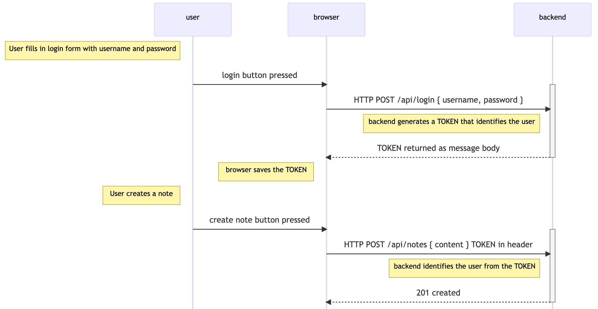

<div class="content">

يجب أن يتمكن المستخدمون من تسجيل الدخول إلى تطبيقنا، وعندما يسجل المستخدم دخوله، تُربط الملاحظات الجديدة المنشأة بحسابه تلقائياً.

سنقوم ببناء نظام المصادقة القائم على **الرموز المميزة ([Token-Based Authentication / JWT](https://jwt.io/))**.

---

### آلية عمل المصادقة بالرموز المميزة (Token Authentication Flow)



1. يقوم المستخدم بتسجيل الدخول بإرسال اسم المستخدم وكلمة المرور عبر طلب `POST /api/login`.
2. يتحقق الخادم من صحة كلمة المرور باستخدام `bcrypt.compare`.
3. إذا كانت صحيحة، يُنشئ الخادم **رمزاً مميزاً مشفراً وموقعاً رقمياً (Signed JSON Web Token - JWT)** يحتوي على هوية المستخدم.
4. يحفظ المتصفح الرمز المميز (في حالة التطبيق أو التخزين المحلي).
5. عند إجراء عمليات تتطلب المصادقة (كإنشاء أو حذف ملاحظة)، يرسل المتصفح الرمز المميز في ترويسة الطلب `Authorization: Bearer <token>`.
6. يتحقق الخادم من صحة التوقيع الرقمي للرمز عبر المفتاح السري، ويستخرج هوية المستخدم مباشرة دون الحاجة للرجوع لقاعدة البيانات.

---

### بناء مسار تسجيل الدخول مع `jsonwebtoken`

لنقم بتثبيت حزمة **[jsonwebtoken](https://github.com/auth0/node-jsonwebtoken)**:

```bash
npm install jsonwebtoken
```

نُنشئ موجه تسجيل الدخول `controllers/login.js`:

```js
const jwt = require('jsonwebtoken')
const bcrypt = require('bcrypt')
const loginRouter = require('express').Router()
const User = require('../models/user')

loginRouter.post('/', async (request, response) => {
  const { username, password } = request.body

  const user = await User.findOne({ username })
  const passwordCorrect = user === null
    ? false
    : await bcrypt.compare(password, user.passwordHash)

  if (!(user && passwordCorrect)) {
    return response.status(401).json({
      error: 'invalid username or password'
    })
  }

  const userForToken = {
    username: user.username,
    id: user._id,
  }

  // إنشاء الرمز وتوقيعه رقمياً مع تحديد مدة صلاحية (ساعة واحدة)
  const token = jwt.sign(
    userForToken, 
    process.env.SECRET,
    { expiresIn: 60 * 60 }
  )

  response
    .status(200)
    .send({ token, username: user.username, name: user.name })
})

module.exports = loginRouter
```

> **ملاحظة أمنية**: *يجب تعيين قيمة سرية عشوائية وقوية لمتغير البيئة `SECRET` داخل ملف `.env`.*

---

### تقييد العمليات بالتحقق من الرمز المميز (Authorization Header)

في مخطط ترخيص **`Bearer`**، تُرسل الترويسة بالشكل:
`Authorization: Bearer eyJhbGciOi...`

لنعدل مسار إنشاء الملاحظة في `controllers/notes.js`:

```js
const jwt = require('jsonwebtoken')

const getTokenFrom = request => {
  const authorization = request.get('authorization')
  if (authorization && authorization.startsWith('Bearer ')) {
    return authorization.replace('Bearer ', '')
  }
  return null
}

notesRouter.post('/', async (request, response) => {
  const body = request.body
  const decodedToken = jwt.verify(getTokenFrom(request), process.env.SECRET)
  
  if (!decodedToken.id) {
    return response.status(401).json({ error: 'token invalid' })
  }

  const user = await User.findById(decodedToken.id)
  if (!user) {
    return response.status(400).json({ error: 'userId missing or not valid' })
  }

  const note = new Note({
    content: body.content,
    important: body.important || false,
    user: user._id
  })

  const savedNote = await note.save()
  user.notes = user.notes.concat(savedNote._id)
  await user.save()

  response.status(201).json(savedNote)
})
```

---

### معالجة أخطاء الرموز في البرمجية الوسيطة

```js
const errorHandler = (error, request, response, next) => {
  logger.error(error.message)

  if (error.name === 'CastError') {
    return response.status(400).send({ error: 'malformatted id' })
  } else if (error.name === 'ValidationError') {
    return response.status(400).json({ error: error.message })
  } else if (error.name === 'MongoServerError' && error.message.includes('E11000 duplicate key error')) {
    return response.status(400).json({ error: 'expected `username` to be unique' })
  } else if (error.name === 'JsonWebTokenError') {
    return response.status(401).json({ error: 'token invalid' })
  } else if (error.name === 'TokenExpiredError') {
    return response.status(401).json({ error: 'token expired' })
  }

  next(error)
}
```

</div>

<div class="tasks">

<h3>التمارين 4.15 - 4.23: إدارة المستخدمين والمصادقة في تطبيق قائمة المدونات</h3>

<h4>4.15: توسيع قائمة المدونات - الخطوة 3 (Blog List expansion step 3)</h4>
أضف إدارة المستخدمين بإنشاء مسار `POST /api/users` لتسجيل المستخدمين الجدد مع تشفير كلمة المرور بـ `bcrypt`، ومسار `GET /api/users` لعرض المستخدمين.

<h4>4.16*: توسيع قائمة المدونات - الخطوة 4 (Blog List expansion step 4)</h4>
أضف قيود التحقق عند إنشاء المستخدم:
- يجب ألا يقل كل من اسم المستخدم وكلمة المرور عن 3 أحرف.
- يجب أن يكون اسم المستخدم فريداً (`unique: true`).
- اكتب اختبارات تكاملية للتحقق من رفض إنشاء مستخدم غير صالح وإرجاع رمز الحالة 400.

<h4>4.17: توسيع قائمة المدونات - الخطوة 5 (Blog List expansion step 5)</h4>
اربط المدونات بالمستخدمين، واستخدم `populate` لعرض تفاصيل المستخدم في مسار جلب المدونات وعرض قائمة المدونات في مسار جلب المستخدمين.

<h4>4.18: توسيع قائمة المدونات - الخطوة 6 (Blog List expansion step 6)</h4>
ابنِ مسار تسجيل الدخول `POST /api/login` وتوليد رموز JWT المميزة.

<h4>4.19: توسيع قائمة المدونات - الخطوة 7 (Blog List expansion step 7)</h4>
قيد إضافة المدونات الجديدة بحيث تتطلب إرسال رمز JWT صالح في ترويسة الطلب، ويتم تعيين المستخدم صاحب الرمز كصاحب المدونة.

<h4>4.20*: توسيع قائمة المدونات - الخطوة 8 (Blog List expansion step 8)</h4>
انقل استخراج الرمز المميز إلى برمجية وسيطة مخصصة `tokenExtractor` في `utils/middleware.js` تضع الرمز في `request.token`.

<h4>4.21*: توسيع قائمة المدونات - الخطوة 9 (Blog List expansion step 9)</h4>
قيد عملية حذف المدونة `DELETE /api/blogs/:id` بحيث لا يُسمح بحذف المدونة إلا للمستخدم الذي أنشأها فقط.

<h4>4.22*: توسيع قائمة المدونات - الخطوة 10 (Blog List expansion step 10)</h4>
أنشئ وسيط `userExtractor` يقوم باستخراج المستخدم من الرمز وربطه مباشرة في `request.user` لاستخدامه في مسارات الإنشاء والحذف.

<h4>4.23*: توسيع قائمة المدونات - الخطوة 11 (Blog List expansion step 11)</h4>
أصلح اختبارات إضافة المدونات بعد تفعيل نظام المصادقة، وأضف اختباراً للتحقق من فشل إضافة مدونة برمز الحالة **401 Unauthorized** عند غياب الرمز المميز.

هذا هو التمرين الأخير في هذا الجزء. ارفع حلولك إلى GitHub وسجل إنجاز التمارين في نظام التسليم.

</div>
