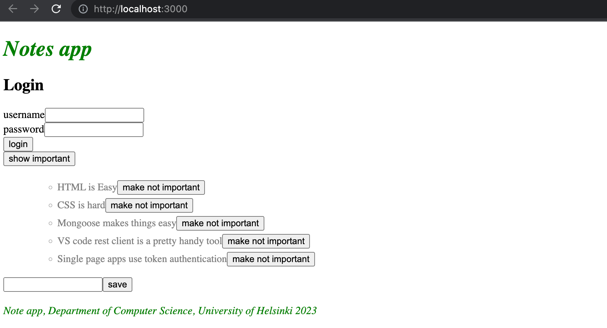
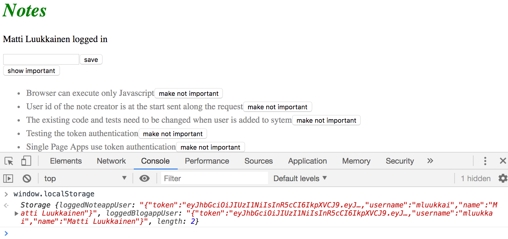
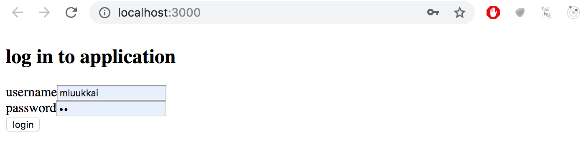
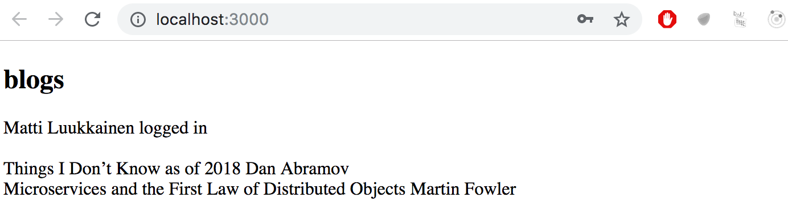
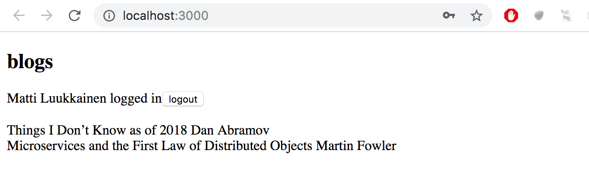
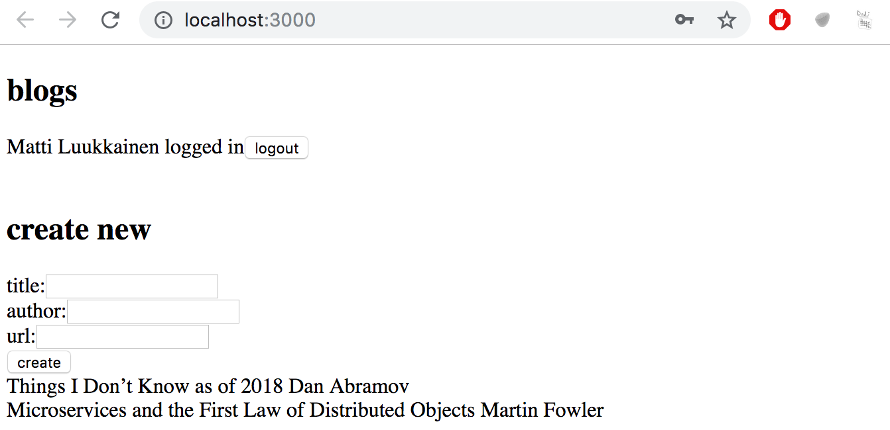
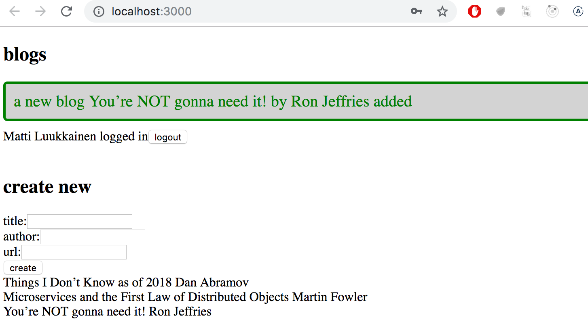
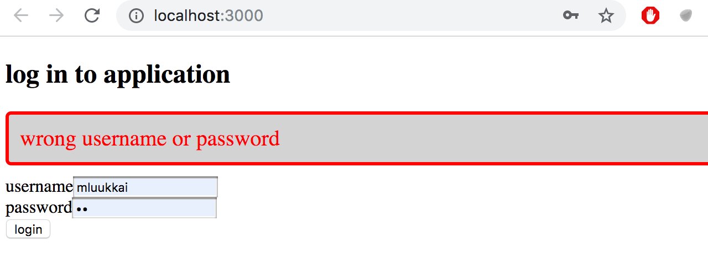

<div class="content">

في الجزأين السابقين، ركّزنا بشكل أساسي على الواجهة الخلفية (Backend). إن الواجهة الأمامية (Frontend) التي طورناها في [الجزء 2](/ar/part2) لا تدعم بعد إدارة المستخدمين التي نفذناها في الواجهة الخلفية في الجزء 4.

في الوقت الحالي، تعرض الواجهة الأمامية الملاحظات الموجودة وتتيح للمستخدمين تغيير حالة الملاحظة من مهمة إلى غير مهمة والعكس صحيح. لكن لا يمكن إضافة ملاحظات جديدة بعد الآن بسبب التغييرات التي أُجريت على الواجهة الخلفية في الجزء 4: فالواجهة الخلفية تتوقع الآن إرسال رمز مميز (Token) للتحقق من هوية المستخدم مع الملاحظة الجديدة.

سنقوم الآن بتنفيذ جزء من وظائف إدارة المستخدمين المطلوبة في الواجهة الأمامية. لنبدأ بتسجيل دخول المستخدم (User Login). وطوال هذا الجزء، سنفترض أنه لن تتم إضافة مستخدمين جدد من الواجهة الأمامية.

### إضافة نموذج تسجيل الدخول (Adding a Login Form)

تمت الآن إضافة نموذج لتسجيل الدخول في أعلى الصفحة:



أصبح كود المكوّن <i>App</i> يبدو كما يلي:

```js
const App = () => {
  const [notes, setNotes] = useState([]) 
  const [newNote, setNewNote] = useState('')
  const [showAll, setShowAll] = useState(true)
  const [errorMessage, setErrorMessage] = useState(null)
  // highlight-start
  const [username, setUsername] = useState('') 
  const [password, setPassword] = useState('') 
// highlight-end

  useEffect(() => {
    noteService
      .getAll().then(initialNotes => {
        setNotes(initialNotes)
      })
  }, [])

  // ...

// highlight-start
  const handleLogin = (event) => {
    event.preventDefault()
    console.log('logging in with', username, password)
  }
  // highlight-end

  return (
    <div>
      <h1>Notes</h1>
      <Notification message={errorMessage} />
      
      // highlight-start
      <h2>Login</h2>
      <form onSubmit={handleLogin}>
        <div>
          <label>
            username
            <input
              type="text"
              value={username}
              onChange={({ target }) => setUsername(target.value)}
            />
          </label>
        </div>
        <div>
          <label>
            password
            <input
              type="password"
              value={password}
              onChange={({ target }) => setPassword(target.value)}
            />
          </label>
        </div>
        <button type="submit">login</button>
      </form>
    // highlight-end

      // ...
    </div>
  )
}

export default App
```

يمكن العثور على كود التطبيق الحالي على [GitHub](https://github.com/fullstack-hy2020/part2-notes-frontend/tree/part5-1)، في الفرع <i>part5-1</i>. إذا قمت بنسخ المستودع (Clone)، فلا تنسَ تشغيل _npm install_ قبل محاولة تشغيل الواجهة الأمامية.

لن تعرض الواجهة الأمامية أي ملاحظات إذا لم تكن متصلة بالواجهة الخلفية. يمكنك تشغيل الواجهة الخلفية باستخدام _npm run dev_ في مجلدها من الجزء 4. سيؤدي هذا إلى تشغيل الواجهة الخلفية على المنفذ 3001. وبينما هي نشطة، يمكنك في نافذة طرفية منفصلة تشغيل الواجهة الأمامية باستخدام _npm run dev_، والآن يمكنك رؤية الملاحظات المحفوظة في قاعدة بيانات MongoDB الخاصة بك من الجزء 4.

ضع هذا في اعتبارك من الآن فصاعداً.

يتم التعامل مع نموذج تسجيل الدخول بنفس الطريقة التي تعاملنا بها مع النماذج في [الجزء 2](/ar/part2/forms). تحتوي حالة التطبيق على حقلي <i>username</i> و <i>password</i> لتخزين البيانات القادمة من النموذج. وتحتوي حقول النموذج على معالجات أحداث (Event Handlers) تقوم بمزامنة التغييرات في الحقل مع حالة المكوّن <i>App</i>. معالجات الأحداث بسيطة: يتم تمرير كائن إليها كمعامل، وتقوم بتفكيك الحقل <i>target</i> من الكائن وحفظ قيمته في الحالة (State).

```js
({ target }) => setUsername(target.value)
```

الدالة _handleLogin_، المسؤولة عن معالجة البيانات في النموذج، لم يتم تنفيذ منطقها بالكامل بعد.

### إضافة المنطق البرمجي لنموذج تسجيل الدخول (Adding Logic to the Login Form)

يتم تسجيل الدخول عن طريق إرسال طلب HTTP POST إلى عنوان الخادم <i>api/login</i>. دعنا نفصل الكود المسؤول عن هذا الطلب في وحدة نمطية خاصة به، في الملف <i>services/login.js</i>.

سنستخدم صيغة <i>async/await</i> بدلاً من الوعود (Promises) لطلب HTTP:

```js
import axios from 'axios'
const baseUrl = '/api/login'

const login = async credentials => {
  const response = await axios.post(baseUrl, credentials)
  return response.data
}

export default { login }
```

يمكن تنفيذ الدالة المسؤولة عن معالجة تسجيل الدخول كما يلي:

```js
import loginService from './services/login' // highlight-line

const App = () => {
  // ...
  const [username, setUsername] = useState('') 
  const [password, setPassword] = useState('') 
// highlight-start
  const [user, setUser] = useState(null)
// highlight-end

  // ...

  const handleLogin = async event => { // highlight-line
    event.preventDefault()
    
    // highlight-start
    try {
      const user = await loginService.login({ username, password })
      setUser(user)
      setUsername('')
      setPassword('')
    } catch {
      setErrorMessage('wrong credentials')
      setTimeout(() => {
        setErrorMessage(null)
      }, 5000)
    }
    // highlight-end
  }

  // ...
}
```

إذا نجح تسجيل الدخول، يتم تفريغ حقول النموذج <i>و</i>يتم حفظ استجابة الخادم (بما في ذلك <i>الرمز المميز (Token)</i> وتفاصيل المستخدم) في حقل <i>user</i> في حالة التطبيق.

إذا فشل تسجيل الدخول أو أدى تشغيل الدالة _loginService.login_ إلى حدوث خطأ، فسيتم إخطار المستخدم.

### التصيير المشروط لنموذج تسجيل الدخول (Conditional Rendering of the Login Form)

لا يتم إخطار المستخدم بنجاح تسجيل الدخول بأي طريقة. دعنا نعدل التطبيق لإظهار نموذج تسجيل الدخول فقط <i>إذا لم يكن المستخدم مسجلاً للدخول</i>، أي عندما يكون _user === null_. بينما يظهر نموذج إضافة ملاحظات جديدة فقط إذا كان <i>المستخدم مسجلاً للدخول</i>، أي عندما تحتوي حالة <i>user</i> على تفاصيل المستخدم.

دعنا نضيف دالتين مساعدتين إلى المكوّن <i>App</i> لإنشاء النماذج:

```js
const App = () => {
  // ...

  const loginForm = () => (
    <form onSubmit={handleLogin}>
      <div>
        <label>
          username
          <input
            type="text"
            value={username}
            onChange={({ target }) => setUsername(target.value)}
          />
        </label>
      </div>
      <div>
        <label>
          password
          <input
            type="password"
            value={password}
            onChange={({ target }) => setPassword(target.value)}
          />
        </label>
      </div>
      <button type="submit">login</button>
    </form>
  )

  const noteForm = () => (
    <form onSubmit={addNote}>
      <input value={newNote} onChange={handleNoteChange} />
      <button type="submit">save</button>
    </form>
  )

  return (
    // ...
  )
}
```

وتصييرهما بشكل مشروط:

```js
const App = () => {
  // ...

  const loginForm = () => (
    // ...
  )

  const noteForm = () => (
    // ...
  )

  return (
    <div>
      <h1>Notes</h1>
      <Notification message={errorMessage} />

      {!user && loginForm()} // highlight-line
      {user && noteForm()} // highlight-line

      <div>
        <button onClick={() => setShowAll(!showAll)}>
          show {showAll ? 'important' : 'all'}
        </button>
      </div>
      <ul>
        {notesToShow.map(note => (
          <Note
            key={note.id}
            note={note}
            toggleImportance={() => toggleImportanceOf(note.id)}
          />
        ))}
      </ul>

      <Footer />
    </div>
  )
}
```

يتم استخدام [حيلة شائعة في React](https://react.dev/learn/conditional-rendering#logical-and-operator-)، وإن بدت غريبة بعض الشيء، لتصيير النماذج بشكل مشروط:

```js
{!user && loginForm()}
```

إذا كانت العبارة الأولى خاطئة (False) أو [Falsy](https://developer.mozilla.org/en-US/docs/Glossary/Falsy)، فلن يتم تنفيذ العبارة الثانية (توليد النموذج) على الإطلاق.

دعنا نُجري تعديلاً إضافياً. إذا كان المستخدم مسجلاً للدخول، فسيظهر اسمه على الشاشة:

```js
return (
  <div>
    <h1>Notes</h1>
    <Notification message={errorMessage} />

    {!user && loginForm()}
    // highlight-start
    {user && (
      <div>
        <p>{user.name} logged in</p>
        {noteForm()}
      </div>
    )}
    // highlight-end

    <div>
      <button onClick={() => setShowAll(!showAll)}>
    // ...
```

الحل ليس مثالياً، لكننا سنتركه هكذا في الوقت الحالي.

مكوننا الرئيسي <i>App</i> كبير جداً في الوقت الحالي. التغييرات التي أجريناها الآن هي إشارة واضحة إلى أنه يجب إعادة هيكلة النماذج (Refactoring) ونقلها إلى مكونات خاصة بها. ومع ذلك، سنترك ذلك كتمرين اختياري.

يمكن العثور على كود التطبيق الحالي على [GitHub](https://github.com/fullstack-hy2020/part2-notes-frontend/tree/part5-2)، في الفرع <i>part5-2</i>.

### ملاحظة حول استخدام وسم التسمية (Label Element)

لقد استخدمنا عنصر [label](https://developer.mozilla.org/en-US/docs/Web/HTML/Reference/Elements/label) لحقول <i>input</i> في نموذج تسجيل الدخول. يتم وضع حقل <i>input</i> الخاص باسم المستخدم داخل عنصر <i>label</i> المقابل له:

```js
<div>
  <label>
    username
    <input
      type="text"
      value={username}
      onChange={({ target }) => setUsername(target.value)}
    />
  </label>
</div>
// ...
```

لماذا نفذنا النموذج بهذه الطريقة؟ من الناحية المرئية، يمكن تحقيق نفس النتيجة بكود أبسط، دون عنصر <i>label</i> منفصل:

```js
<div>
  username
  <input
    type="text"
    value={username}
    onChange={({ target }) => setUsername(target.value)}
  />
</div>
// ...
```

يُستخدم عنصر <i>label</i> في النماذج لوصف وتسمية حقول <i>input</i>. فهو يقدم وصفاً لحقل الإدخال، مما يساعد المستخدم على فهم المعلومات التي يجب إدخالها في كل حقل. يتم ربط هذا الوصف برمجياً بحقل الإدخال المقابل، مما يُحسّن من إمكانية الوصول (Accessibility) للنموذج.

بهذه الطريقة، يمكن لقارئات الشاشة (Screen Readers) قراءة اسم الحقل للمستخدم عند تحديد حقل الإدخال، كما أن النقر على نص التسمية (Label) يضع التركيز تلقائياً على حقل الإدخال الصحيح. يوصى دائماً باستخدام عنصر <i>label</i> مع حقول <i>input</i>، حتى لو كان بالإمكان تحقيق نفس النتيجة المرئية بدونه.

توجد [عدة طرق](https://react.dev/reference/react-dom/components/input#providing-a-label-for-an-input) لربط <i>label</i> معين بعنصر <i>input</i>. أسهل طريقة هي وضع عنصر <i>input</i> داخل عنصر <i>label</i> المقابل له، كما هو موضح في هذه المادة التعليمية. يؤدي هذا تلقائياً إلى ربط الـ <i>label</i> بحقل الإدخال الصحيح دون الحاجة إلى أي إعدادات إضافية.

### إنشاء ملاحظات جديدة (Creating new notes)

يتم حفظ الرمز المميز (Token) الذي يتم إرجاعه عند تسجيل الدخول بنجاح في حالة التطبيق - في حقل <i>token</i> الخاص بكائن <i>user</i>:

```js
const handleLogin = async (event) => {
  event.preventDefault()
  try {
    const user = await loginService.login({
      username, password,
    })

    setUser(user) // highlight-line
    setUsername('')
    setPassword('')
  } catch (exception) {
    // ...
  }
}
```

دعنا نصلح عملية إنشاء ملاحظات جديدة لتعمل بالتوافق مع الواجهة الخلفية. هذا يعني إضافة الرمز المميز للمستخدم الذي قام بتسجيل الدخول إلى ترويسة التفويض (Authorization header) لطلب HTTP.

تتغير الوحدة النمطية <i>noteService</i> كما يلي:

```js
import axios from 'axios'
const baseUrl = '/api/notes'

let token = null // highlight-line

// highlight-start
const setToken = newToken => {
  token = `Bearer ${newToken}`
}
// highlight-end

const getAll = () => {
  const request = axios.get(baseUrl)
  return request.then(response => response.data)
}

const create = async newObject => {
  // highlight-start
  const config = {
    headers: { Authorization: token }
  }
// highlight-end

  const response = await axios.post(baseUrl, newObject, config) // highlight-line
  return response.data
}

const update = (id, newObject) => {
  const request = axios.put(`${ baseUrl }/${id}`, newObject)
  return request.then(response => response.data)
}

export default { getAll, create, update, setToken } // highlight-line
```

تحتوي وحدة noteService النمطية على متغير خاص يُدعى _token_. يمكن تغيير قيمته باستخدام الدالة _setToken_، التي تُصدّرها الوحدة. تقوم الدالة _create_، الآن بصيغة async/await، بتعيين الرمز المميز في ترويسة <i>Authorization</i>. يتم تمرير الترويسة إلى axios كمعامل ثالث للتابع <i>post</i>.

يجب تغيير معالج الأحداث المسؤول عن تسجيل الدخول ليستدعي الدالة <code>noteService.setToken(user.token)</code> عند تسجيل الدخول بنجاح:

```js
const handleLogin = async (event) => {
  event.preventDefault()

  try {
    const user = await loginService.login({ username, password })
    noteService.setToken(user.token) // highlight-line
    setUser(user)
    setUsername('')
    setPassword('')
  } catch {
    // ...
  }
}
```

والآن تعمل إضافة الملاحظات الجديدة مجدداً!

### حفظ الرمز المميز في التخزين المحلي للمتصفح (Saving the token to the browser's local storage)

يحتوي تطبيقنا على عيب صغير: إذا تم تحديث المتصفح (بالضغط على F5 مثلاً)، تختفي معلومات تسجيل دخول المستخدم.

يتم حل هذه المشكلة بسهولة عن طريق حفظ تفاصيل تسجيل الدخول في [التخزين المحلي (Local Storage)](https://developer.mozilla.org/en-US/docs/Web/API/Storage). إن التخزين المحلي هو قاعدة بيانات من نوع [مفتاح-قيمة (key-value)](https://en.wikipedia.org/wiki/Key-value_database) داخل المتصفح.

التخزين المحلي سهل الاستخدام للغاية. يتم حفظ <i>قيمة (value)</i> مطابقة لـ <i>مفتاح (key)</i> معين في قاعدة البيانات باستخدام التابع [setItem](https://developer.mozilla.org/en-US/docs/Web/API/Storage/setItem). على سبيل المثال:

```js
window.localStorage.setItem('name', 'juha tauriainen')
```

يحفظ السلسلة النصية المُمررة كمعامل ثانٍ كقيمة للمفتاح <i>name</i>.

يمكن الحصول على قيمة المفتاح باستخدام التابع [getItem](https://developer.mozilla.org/en-US/docs/Web/API/Storage/getItem):

```js
window.localStorage.getItem('name')
```

بينما يقوم [removeItem](https://developer.mozilla.org/en-US/docs/Web/API/Storage/removeItem) بحذف المفتاح.

تظل القيم الموجودة في التخزين المحلي محفوظة وثابتة حتى عند إعادة تصيير الصفحة أو تحديثها. التخزين خاص بـ [الأصل (Origin)](https://developer.mozilla.org/en-US/docs/Glossary/Origin)، لذا فإن كل تطبيق ويب يمتلك مساحة تخزين خاصة به ومستقلة.

دعنا نوسّع تطبيقنا بحيث يحفظ تفاصيل المستخدم المسجّل دخوله في التخزين المحلي.

القيم المحفوظة في التخزين المحلي هي من نوع [DOMStrings](https://docs.w3cub.com/dom/domstring)، لذا لا يمكننا حفظ كائن جافاسكريبت مباشرة كما هو. يجب تحويل الكائن إلى نص بتنسيق JSON أولاً باستخدام التابع _JSON.stringify_. وبالمثل، عند قراءة كائن JSON من التخزين المحلي، يجب تحليله وإعادته إلى كائن جافاسكريبت باستخدام _JSON.parse_.

التغييرات على دالة تسجيل الدخول هي كالتالي:

```js
  const handleLogin = async (event) => {
    event.preventDefault()
    try {
      const user = await loginService.login({ username, password })

      // highlight-start
      window.localStorage.setItem(
        'loggedNoteappUser', JSON.stringify(user)
      ) 
      // highlight-end
      noteService.setToken(user.token)
      setUser(user)
      setUsername('')
      setPassword('')
    } catch (exception) {
      // ...
    }
  }
```

يتم الآن حفظ تفاصيل المستخدم المسجّل دخوله في التخزين المحلي، ويمكن عرضها في الطرفية (Console) (عن طريق كتابة _window.localStorage_ فيها):



يمكنك أيضاً فحص التخزين المحلي باستخدام أدوات المطورين (Developer Tools). في متصفح Chrome، انتقل إلى تبويب <i>Application</i> واختر <i>Local Storage</i> (مزيد من التفاصيل [هنا](https://developer.chrome.com/docs/devtools/storage/localstorage)). وفي متصفح Firefox، انتقل إلى تبويب <i>Storage</i> واختر <i>Local Storage</i> (التفاصيل [هنا](https://firefox-source-docs.mozilla.org/devtools-user/storage_inspector/index.html)).

ما يزال يتعين علينا تعديل تطبيقنا بحيث عندما ندخل إلى الصفحة، يتحقق التطبيق مما إذا كانت تفاصيل المستخدم المسجّل دخوله موجودة بالفعل في التخزين المحلي. إذا كانت موجودة، فسيتم حفظ التفاصيل في حالة التطبيق وفي <i>noteService</i>.

الطريقة الصحيحة للقيام بذلك هي استخدام [خطاف التأثير (Effect Hook)](https://react.dev/reference/react/useEffect): وهي آلية واجهناها لأول مرة في [الجزء 2](/ar/part2/getting_data_from_server#effect-hooks)، واستخدمناها لجلب الملاحظات من الخادم.

يمكننا استخدام خطافات تأثير متعددة، لذلك دعنا ننشئ خطافاً ثانياً للتعامل مع التحميل الأولي للصفحة:

```js
const App = () => {
  const [notes, setNotes] = useState([])
  const [newNote, setNewNote] = useState('')
  const [showAll, setShowAll] = useState(true)
  const [errorMessage, setErrorMessage] = useState(null)
  const [username, setUsername] = useState('')
  const [password, setPassword] = useState('')
  const [user, setUser] = useState(null)

  useEffect(() => {
    noteService.getAll().then(initialNotes => {
      setNotes(initialNotes)
    })
  }, [])
  
  // highlight-start
  useEffect(() => {
    const loggedUserJSON = window.localStorage.getItem('loggedNoteappUser')
    if (loggedUserJSON) {
      const user = JSON.parse(loggedUserJSON)
      setUser(user)
      noteService.setToken(user.token)
    }
  }, [])
  // highlight-end

  // ...
}
```

المصفوفة الفارغة الممررة كمعامل لخطاف التأثير تضمن تنفيذ التأثير فقط عند تصيير المكوّن [لأول مرة](https://react.dev/reference/react/useEffect#parameters).

الآن يظل المستخدم مسجلاً للدخول في التطبيق إلى الأبد. يجب أن نضيف على الأرجح وظيفة <i>تسجيل الخروج (Logout)</i>، والتي تحذف تفاصيل تسجيل الدخول من التخزين المحلي. ومع ذلك، سنترك هذا كتمرين.

من الممكن تسجيل خروج المستخدم باستخدام كونسول المتصفح، وهذا كافٍ في الوقت الحالي.
يمكنك تسجيل الخروج بالأمر التالي:

```js
window.localStorage.removeItem('loggedNoteappUser')
```

أو بالأمر الذي يقوم بتفريغ <i>localstorage</i> بالكامل:

```js
window.localStorage.clear()
```

يمكن العثور على كود التطبيق الحالي على [GitHub](https://github.com/fullstack-hy2020/part2-notes-frontend/tree/part5-3)، في الفرع <i>part5-3</i>.

</div>

<div class="tasks">

### التمارين 5.1.-5.4.

سنقوم الآن بإنشاء واجهة أمامية للواجهة الخلفية لقائمة المدونات (Blog List) التي أنشأناها في الجزء السابق. يمكنك استخدام [هذا التطبيق](https://github.com/fullstack-hy2020/bloglist-frontend) من GitHub كأساس لحلك. تحتاج إلى ربط واجهتك الخلفية باستخدام وكيل (Proxy) كما هو موضح في [الجزء 3](/ar/part3/deploying_app_to_internet#proxy).

يكفي تسليم حلك النهائي المكتمل. يمكنك إجراء التزام (Commit) بعد كل تمرين، ولكن هذا ليس إلزامياً.

تراجع التمارين الأولى كل ما تعلمناه عن React حتى الآن. قد تكون هذه التمارين صعبة ومليئة بالتحديات، خاصة إذا كانت واجهتك الخلفية غير مكتملة.
قد يكون من الأفضل استخدام الواجهة الخلفية التي قدمناها كحل نموذجي للجزء 4.

أثناء حل التمارين، تذكر جميع طرق تصحيح الأخطاء (Debugging) التي تحدثنا عنها، وخاصة مراقبة الكونسول (Console) باستمرار.

**تحذير:** إذا لاحظت أنك تخلط بين أوامر _async/await_ و _then_، فمن المؤكد بنسبة 99.9% أنك تفعل شيئاً خاطئاً. استخدم أحدهما أو الآخر، ولا تخلط بينهما أبداً.

#### 5.1: الواجهة الأمامية لقائمة المدونات، الخطوة 1

انسخ التطبيق من [GitHub](https://github.com/fullstack-hy2020/bloglist-frontend) باستخدام الأمر:

```bash
git clone https://github.com/fullstack-hy2020/bloglist-frontend
```

<i>احذف إعدادات git للتطبيق المنسوخ</i>:

```bash
cd bloglist-frontend   // الانتقال إلى المستودع المنسوخ
rm -rf .git
```

يتم تشغيل التطبيق بالطريقة المعتادة، ولكن يجب عليك تثبيت حزم الاعتماديات الخاصة به أولاً:

```bash
npm install
npm run dev
```

قم بتنفيذ وظيفة تسجيل الدخول في الواجهة الأمامية. يتم حفظ الرمز المميز (Token) المرتجع مع تسجيل الدخول الناجح في حالة التطبيق <i>user</i>.

إذا لم يكن المستخدم مسجلاً للدخول، فيكون نموذج تسجيل الدخول <i>فقط</i> هو المرئي.



إذا كان المستخدم مسجلاً للدخول، فسيتم عرض اسم المستخدم وقائمة بالمدونات.



لا يلزم حفظ تفاصيل المستخدم المسجل في التخزين المحلي بعد.

**ملاحظة:** يمكنك تنفيذ التصيير المشروط لنموذج تسجيل الدخول بهذا الشكل على سبيل المثال:

```js
  if (user === null) {
    return (
      <div>
        <h2>Log in to application</h2>
        <form>
          //...
        </form>
      </div>
    )
  }

  return (
    <div>
      <h2>blogs</h2>
      {blogs.map(blog =>
        <Blog key={blog.id} blog={blog} />
      )}
    </div>
  )
}
```

#### 5.2: الواجهة الأمامية لقائمة المدونات، الخطوة 2

اجعل تسجيل الدخول "دائماً" باستخدام التخزين المحلي (Local Storage). ونفّذ أيضاً طريقة لتسجيل الخروج.



تأكد من أن المتصفح لا يتذكر تفاصيل المستخدم بعد تسجيل الخروج.

#### 5.3: الواجهة الأمامية لقائمة المدونات، الخطوة 3

وسّع تطبيقك للسماح للمستخدم المسجل دخوله بإضافة مدونات جديدة:



#### 5.4: الواجهة الأمامية لقائمة المدونات، الخطوة 4

قم بتنفيذ إشعارات تُعلم المستخدم بالعمليات الناجحة وغير الناجحة في أعلى الصفحة. على سبيل المثال، عند إضافة مدونة جديدة، يمكن إظهار الإشعار التالي:



يمكن أن يظهر فشل تسجيل الدخول الإشعار التالي:



يجب أن تكون الإشعارات مرئية لبضع ثوانٍ. ليس من الإلزامي إضافة الألوان.

</div>

<div class="content">

### ملاحظة حول استخدام التخزين المحلي (A note on using local storage)

في [نهاية](/ar/part4/token_authentication#problems-of-token-based-authentication) الجزء السابق، ذكرنا أن التحدي في المصادقة القائمة على الرمز المميز هو كيفية التعامل مع الموقف الذي يلزم فيه إلغاء وصول حامل الرمز إلى واجهة برمجة التطبيقات (API).

هناك حلان لهذه المشكلة. الأول هو تحديد فترة صلاحية الرمز المميز. وهذا يُجبر المستخدم على إعادة تسجيل الدخول إلى التطبيق بمجرد انتهاء صلاحية الرمز. والنهج الآخر هو حفظ معلومات الصلاحية لكل رمز مميز في قاعدة بيانات الواجهة الخلفية. وغالباً ما يُطلق على هذا الحل اسم <i>جلسة من جانب الخادم (Server-side session)</i>.

بغض النظر عن كيفية فحص صلاحية الرموز المميزة وضمانها، فإن حفظ الرمز المميز في التخزين المحلي قد ينطوي على مخاطر أمنية إذا كان التطبيق يحتوي على ثغرة أمنية تسمح بهجمات [البرمجة النصية عبر المواقع (Cross Site Scripting - XSS)](https://owasp.org/www-community/attacks/xss/). يكون هجوم XSS ممكناً إذا سمح التطبيق للمستخدم بحقن كود جافاسكريبت عشوائي (باستخدام نموذج مثلاً) ثم يقوم التطبيق بتنفيذه. عند استخدام React بطريقة صحيحة ومنطقية، لا ينبغي أن يكون هذا ممكناً لأن [React تقوم بتطهير (Sanitize)](https://legacy.reactjs.org/docs/introducing-jsx.html#jsx-prevents-injection-attacks) جميع النصوص التي تصيّرها، مما يعني أنها لا تنفذ المحتوى المُصيَّر ككود جافاسكريبت.

إذا أراد المرء أن يكون في أمان تام، فإن الخيار الأفضل هو عدم تخزين الرمز المميز في التخزين المحلي. قد يكون هذا خياراً في المواقف التي قد يؤدي فيها تسريب الرمز المميز إلى عواقب وخيمة ومأساوية.

لقد تم اقتراح حفظ هوية المستخدم المسجل كـ [ملفات تعريف ارتباط httpOnly (httpOnly cookies)](https://developer.mozilla.org/en-US/docs/Web/HTTP/Cookies#restrict_access_to_cookies)، بحيث لا تتمكن أي تعليمات برمجية لجافاسكريبت من الوصول إلى الرمز المميز. العيب في هذا الحل هو أنه يجعل تنفيذ تطبيقات الصفحة الواحدة (SPA) أكثر تعقيداً بعض الشيء. سيحتاج المرء على الأقل إلى تنفيذ صفحة منفصلة لتسجيل الدخول.

ومع ذلك، من الجيد ملاحظة أنه حتى استخدام ملفات تعريف ارتباط httpOnly لا يضمن كل شيء. بل لقد قيل إن ملفات تعريف ارتباط httpOnly [ليست أكثر أماناً من](https://academind.com/tutorials/localstorage-vs-cookies-xss/) استخدام التخزين المحلي.

لذا، وبغض النظر عن الحل المستخدم، فإن الشيء الأكثر أهمية هو [تقليل مخاطر](https://cheatsheetseries.owasp.org/cheatsheets/DOM_based_XSS_Prevention_Cheat_Sheet.html) هجمات XSS تماماً وبشكل جذري.

</div>
