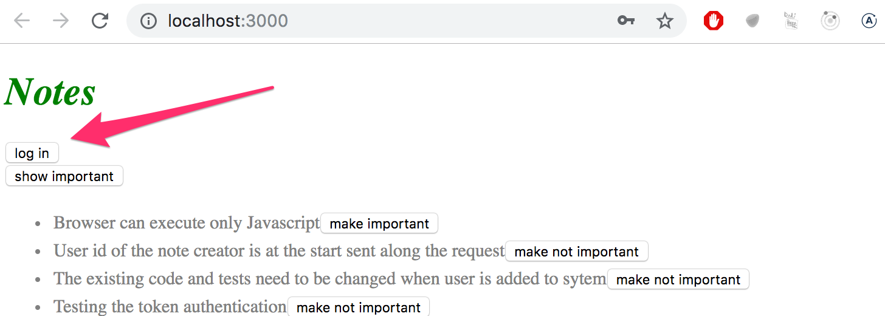
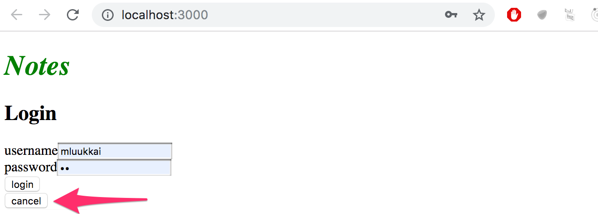
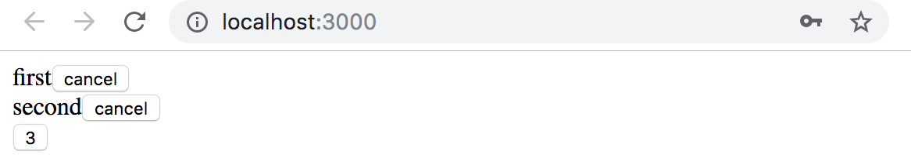
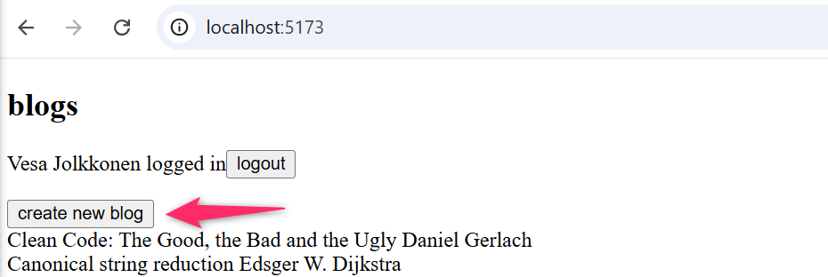
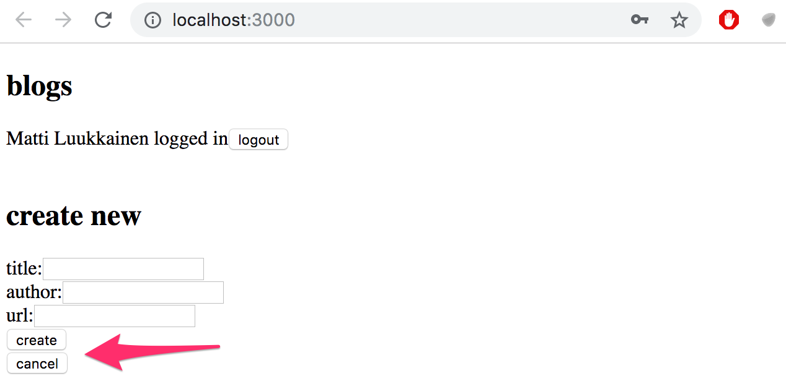
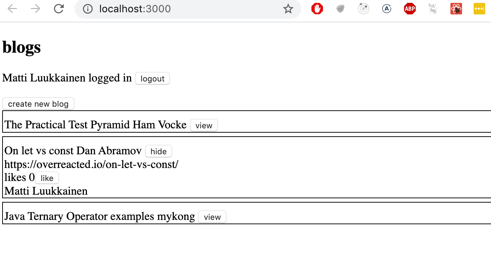
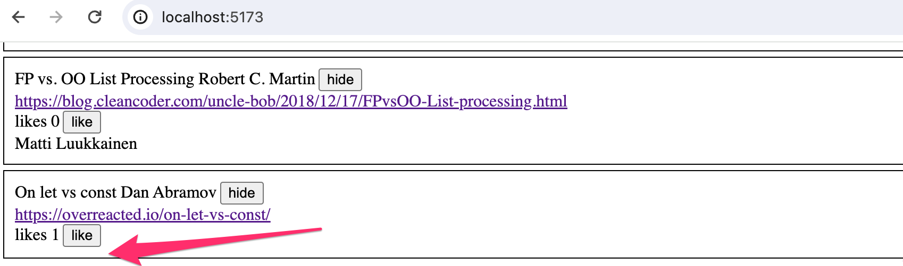
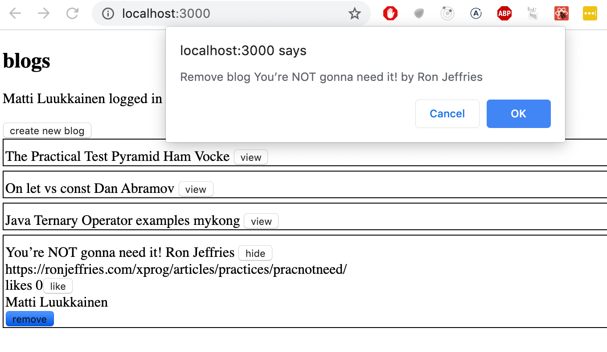

<div class="content">

كُتب هذا القسم باستخدام React 19، وبعض ميزات React المقدمة في هذا الفصل لا تعمل مع الإصدارات الأقدم من React. الأجزاء السابقة من الدورة التدريبية كُتبت باستخدام الإصدار 18 من React، لذا تأكد من أن مشروعك يحتوي الآن على الإصدار 19 من React مثبتًا.

يمكنك فحص ملف <i>package.json</i> للتحقق من أن الإصدار 19 من مكتبتي <i>react</i> و <i>react-dom</i> قيد الاستخدام:

```json
{
  // ...
  "dependencies": {
    "axios": "^1.9.0",
    "react": "^19.1.0", // highlight-line
    "react-dom": "^19.1.0" // highlight-line
  },
  // ...
}
```

قم أيضاً بتشغيل الأمر _npm install_، الذي يقوم بتثبيت التبعيات وفقاً لملف <i>package.json</i>. هذا الأمر ضروري إذا قمت، على سبيل المثال، باستنساخ مستودع الأمثلة في مرحلة سابقة من الدورة عندما كان إصدار أقدم من React لا يزال قيد الاستخدام.

### إظهار نموذج تسجيل الدخول فقط عند الحاجة (Displaying the login form only when appropriate)

دعنا نعدل التطبيق بحيث لا يتم عرض نموذج تسجيل الدخول بشكل افتراضي:



يظهر نموذج تسجيل الدخول عندما يضغط المستخدم على زر <i>login</i>:



يمكن للمستخدم إغلاق نموذج تسجيل الدخول بالضغط على زر <i>cancel</i>.

لنبدأ باستخراج نموذج تسجيل الدخول في مكوّن منفصل خاص به:

```js
const LoginForm = ({
   handleSubmit,
   handleUsernameChange,
   handlePasswordChange,
   username,
   password
  }) => {
  return (
    <div>
      <h2>Login</h2>

      <form onSubmit={handleSubmit}>
        <div>
          username
          <input
            value={username}
            onChange={handleUsernameChange}
          />
        </div>
        <div>
          password
          <input
            type="password"
            value={password}
            onChange={handlePasswordChange}
          />
      </div>
        <button type="submit">login</button>
      </form>
    </div>
  )
}

export default LoginForm
```

تُعرّف الحالة وجميع الدوال المرتبطة بها خارج المكوّن، وتُمرر إلى المكوّن عبر الخصائص (Props).

لاحظ أنه يتم إسناد الخصائص إلى المتغيرات من خلال <i>التفكيك (Destructuring)</i>، مما يعني أنه بدلاً من كتابة:

```js
const LoginForm = (props) => {
  return (
    <div>
      <h2>Login</h2>
      <form onSubmit={props.handleSubmit}>
        <div>
          username
          <input
            value={props.username}
            onChange={props.handleChange}
            name="username"
          />
        </div>
        // ...
        <button type="submit">login</button>
      </form>
    </div>
  )
}
```

حيث يتم الوصول إلى خصائص الكائن _props_ عبر _props.handleSubmit_ على سبيل المثال، يتم إسناد الخصائص مباشرة إلى متغيراتها المستقلة.

تتمثل إحدى الطرق السريعة لتنفيذ هذه الوظيفة في تغيير دالة _loginForm_ في المكوّن <i>App</i> كما يلي:

```js
const App = () => {
  const [loginVisible, setLoginVisible] = useState(false) // highlight-line

  // ...

  const loginForm = () => {
    const hideWhenVisible = { display: loginVisible ? 'none' : '' }
    const showWhenVisible = { display: loginVisible ? '' : 'none' }

    return (
      <div>
        <div style={hideWhenVisible}>
          <button onClick={() => setLoginVisible(true)}>log in</button>
        </div>
        <div style={showWhenVisible}>
          <LoginForm
            username={username}
            password={password}
            handleUsernameChange={({ target }) => setUsername(target.value)}
            handlePasswordChange={({ target }) => setPassword(target.value)}
            handleSubmit={handleLogin}
          />
          <button onClick={() => setLoginVisible(false)}>cancel</button>
        </div>
      </div>
    )
  }

  // ...
}
```

تحتوي حالة المكوّن <i>App</i> الآن على القيمة المنطقية (Boolean) المسماة <i>loginVisible</i>، والتي تحدد ما إذا كان يجب إظهار نموذج تسجيل الدخول للمستخدم أم لا.

يتم تبديل قيمة _loginVisible_ باستخدام زرين. كِلا الزرين يحتويان على معالجات أحداث محددة مباشرة داخل المكوّن:

```js
<button onClick={() => setLoginVisible(true)}>log in</button>

<button onClick={() => setLoginVisible(false)}>cancel</button>
```

يتم تحديد رؤية المكوّن من خلال إعطاء المكوّن قاعدة تنسيق [مضمنة (Inline Style)](/ar/part2/adding_styles_to_react_app#inline-styles)، حيث تكون قيمة خاصية [display](https://developer.mozilla.org/en-US/docs/Web/CSS/display) هي <i>none</i> إذا كنا لا نريد عرض المكوّن:

```js
const hideWhenVisible = { display: loginVisible ? 'none' : '' }
const showWhenVisible = { display: loginVisible ? '' : 'none' }

<div style={hideWhenVisible}>
  // زر
</div>

<div style={showWhenVisible}>
  // زر
</div>
```

نحن نستخدم مرة أخرى العامل الثلاثي الشرطي (Ternary Operator). إذا كانت قيمة _loginVisible_ هي <i>true</i>، فستكون قاعدة CSS الخاصة بالمكوّن:

```css
display: 'none';
```

وإذا كانت قيمة _loginVisible_ هي <i>false</i>، فلن تتلقى <i>display</i> أي قيمة تؤثر على ظهور المكوّن.

### العناصر الفرعية للمكونات أو ما يُعرف بـ props.children (The components children, aka. props.children)

يمكن اعتبار الكود المتعلق بإدارة ظهور نموذج تسجيل الدخول كياناً منطقياً قائماً بذاته، ولهذا السبب، سيكون من الجيد استخراجه من المكوّن <i>App</i> ونقله إلى مكوّن منفصل.

هدفنا هو إنشاء مكوّن <i>Togglable</i> جديد يمكن استخدامه بالطريقة التالية:

```js
<Togglable buttonLabel='login'>
  <LoginForm
    username={username}
    password={password}
    handleUsernameChange={({ target }) => setUsername(target.value)}
    handlePasswordChange={({ target }) => setPassword(target.value)}
    handleSubmit={handleLogin}
  />
</Togglable>
```

إن طريقة استخدام المكوّن تختلف قليلاً عن مكوناتنا السابقة. يحتوي المكوّن على وسمي فتح وإغلاق يحيطان بمكوّن <i>LoginForm</i>. في مصطلحات React، يُعد <i>LoginForm</i> مكوّناً فرعياً (Child Component) للمكوّن <i>Togglable</i>.

يمكننا إضافة أي عناصر React نريدها بين وسمي الفتح والإغلاق لـ <i>Togglable</i>، مثل هذا على سبيل المثال:

```js
<Togglable buttonLabel="reveal">
  <p>this line is at start hidden</p>
  <p>also this is hidden</p>
</Togglable>
```

كود المكوّن <i>Togglable</i> موضح أدناه:

```js
import { useState } from 'react'

const Togglable = (props) => {
  const [visible, setVisible] = useState(false)

  const hideWhenVisible = { display: visible ? 'none' : '' }
  const showWhenVisible = { display: visible ? '' : 'none' }

  const toggleVisibility = () => {
    setVisible(!visible)
  }

  return (
    <div>
      <div style={hideWhenVisible}>
        <button onClick={toggleVisibility}>{props.buttonLabel}</button>
      </div>
      <div style={showWhenVisible}>
        {props.children}
        <button onClick={toggleVisibility}>cancel</button>
      </div>
    </div>
  )
}

export default Togglable
```

الجزء الجديد والمثير للاهتمام في الكود هو [props.children](https://react.dev/learn/passing-props-to-a-component#passing-jsx-as-children)، والذي يُستخدم للإشارة إلى المكونات والعناصر الفرعية للمكوّن. المكونات الفرعية هي عناصر React التي نحددها بين وسمي الفتح والإغلاق لأي مكوّن.

هذه المرة يتم تصيير العناصر الفرعية داخل الكود المستخدم لتصيير المكوّن نفسه:

```js
<div style={showWhenVisible}>
  {props.children}
  <button onClick={toggleVisibility}>cancel</button>
</div>
```

على عكس الخصائص "العادية" التي رأيناها سابقاً، تتم إضافة <i>children</i> تلقائياً بواسطة React وهي موجودة دائماً. إذا تم تعريف مكوّن باستخدام وسم الإغلاق الذاتي _/>_، مثل هذا:

```js
<Note
  key={note.id}
  note={note}
  toggleImportance={() => toggleImportanceOf(note.id)}
/>
```

فإن <i>props.children</i> تكون عبارة عن مصفوفة فارغة.

مكوّن <i>Togglable</i> قابل لإعادة الاستخدام (Reusable) ويمكننا استخدامه لإضافة وظيفة تبديل الرؤية المماثلة إلى النموذج المستخدم لإنشاء ملاحظات جديدة.

قبل أن نفعل ذلك، دعنا نستخرج نموذج إنشاء الملاحظات في مكوّن مستقل:

```js
const NoteForm = ({ onSubmit, handleChange, value}) => {
  return (
    <div>
      <h2>Create a new note</h2>

      <form onSubmit={onSubmit}>
        <input
          value={value}
          onChange={handleChange}
        />
        <button type="submit">save</button>
      </form>
    </div>
  )
}
```

بعد ذلك، دعنا نُعرّف مكوّن النموذج داخل مكوّن <i>Togglable</i>:

```js
<Togglable buttonLabel="new note">
  <NoteForm
    onSubmit={addNote}
    value={newNote}
    handleChange={handleNoteChange}
  />
</Togglable>
```

يمكنك العثور على كود تطبيقنا الحالي بالكامل في الفرع <i>part5-4</i> من [مستودع GitHub هذا](https://github.com/fullstack-hy2020/part2-notes-frontend/tree/part5-4).

### حالة النماذج (State of the forms)

توجد حالة التطبيق حالياً في المكوّن _App_.

تقول وثائق React [ما يلي](https://react.dev/learn/sharing-state-between-components) حول مكان وضع الحالة:

<i>في بعض الأحيان، تريد أن تتغير حالة مكوّنين معاً دائماً. للقيام بذلك، قم بإزالة الحالة من كِليهما، وانقلها إلى أقرب عنصر أب مشترك بينهما، ثم مررها إليهما عبر الخصائص (Props). يُعرف هذا باسم رفع الحالة إلى الأعلى (Lifting State Up)، وهو أحد أكثر الأشياء شيوعاً التي ستقوم بها عند كتابة كود React.</i>

إذا فكرنا في حالة النماذج، على سبيل المثال محتويات ملاحظة جديدة قبل إنشائها، فإن المكوّن _App_ لا يحتاج إليها في أي شيء.
يمكننا تماماً نقل حالة النماذج إلى المكونات المقابلة لها.

يتغير مكوّن إنشاء ملاحظة جديدة كما يلي:

```js
import { useState } from 'react'

const NoteForm = ({ createNote }) => {
  const [newNote, setNewNote] = useState('')

  const addNote = (event) => {
    event.preventDefault()
    createNote({
      content: newNote,
      important: true
    })

    setNewNote('')
  }

  return (
    <div>
      <h2>Create a new note</h2>

      <form onSubmit={addNote}>
        <input
          value={newNote}
          onChange={event => setNewNote(event.target.value)}
        />
        <button type="submit">save</button>
      </form>
    </div>
  )
}

export default NoteForm
```

**ملاحظة:** في الوقت نفسه، قمنا بتغيير سلوك التطبيق بحيث تكون الملاحظات الجديدة مهمة بشكل افتراضي، أي أن الحقل <i>important</i> يحصل على القيمة <i>true</i>.

تم نقل متغير الحالة <i>newNote</i> ومعالج الأحداث المسؤول عن تغييره من المكوّن _App_ إلى المكوّن المسؤول عن نموذج الملاحظة.

لم يتبق سوى خاصية واحدة (Prop)، وهي الدالة _createNote_، التي يستدعيها النموذج عند إنشاء ملاحظة جديدة.

يصبح المكوّن _App_ أبسط الآن بعد أن تخلصنا من حالة <i>newNote</i> ومعالج الأحداث الخاص بها.
تستقبل الدالة _addNote_ لإنشاء ملاحظات جديدة ملاحظة جديدة كمعامل، والدالة هي الخاصية الوحيدة التي نرسلها إلى النموذج:

```js
const App = () => {
  // ...
  const addNote = (noteObject) => { // highlight-line
    noteService
      .create(noteObject)
      .then(returnedNote => {
        setNotes(notes.concat(returnedNote))
      })
  }
  // ...
  const noteForm = () => (
    <Togglable buttonLabel='new note'>
      <NoteForm createNote={addNote} />
    </Togglable>
  )

  // ...
}
```

يمكننا أن نفعل الشيء نفسه لنموذج تسجيل الدخول، لكننا سنترك ذلك كتمرين اختياري.

يمكن العثور على كود التطبيق في [GitHub](https://github.com/fullstack-hy2020/part2-notes-frontend/tree/part5-5)، الفرع <i>part5-5</i>.

### المراجع إلى المكونات باستخدام ref (References to components with ref)

تنفيذنا الحالي جيد جداً؛ ومع ذلك يحتوي على جانب واحد يمكن تحسينه.

بعد إنشاء ملاحظة جديدة، سيكون من المنطقي إخفاء نموذج إنشاء الملاحظة. حالياً، يظل النموذج مرئياً. توجد مشكلة بسيطة في إخفائه، وهي أن مستوى الرؤية يتم التحكم فيه بواسطة متغير الحالة <i>visible</i> داخل المكوّن <i>Togglable</i>.

أحد الحلول لهذه المشكلة هو نقل التحكم في حالة مكوّن Togglable إلى خارج المكوّن. ومع ذلك، لن نفعل ذلك الآن لأننا نريد أن يكون المكوّن مسؤولاً عن حالته الخاصة. لذا يتعين علينا إيجاد حل آخر، وآلية لتغيير حالة المكوّن من الخارج.

هناك عدة طرق مختلفة لتنفيذ الوصول إلى دوال المكوّن من خارج المكوّن، ولكن دعنا نستخدم آلية [ref](https://react.dev/learn/referencing-values-with-refs) في React، والتي توفر مرجعاً للمكوّن.

دعنا نجري التغييرات التالية على المكوّن <i>App</i>:

```js
import { useState, useEffect, useRef } from 'react' // highlight-line

const App = () => {
  // ...
  const noteFormRef = useRef() // highlight-line

  const noteForm = () => (
    <Togglable buttonLabel='new note' ref={noteFormRef}>  // highlight-line
      <NoteForm createNote={addNote} />
    </Togglable>
  )

  // ...
}
```

يُستخدم الخطاف [useRef](https://react.dev/reference/react/useRef) لإنشاء المرجع <i>noteFormRef</i>، الذي يتم إسناده إلى مكوّن <i>Togglable</i> الذي يحتوي على نموذج إنشاء الملاحظة. يعمل المتغير <i>noteFormRef</i> كمرجع للمكوّن. يضمن هذا الخطاف الاحتفاظ بنفس المرجع (Ref) عبر عمليات إعادة تصيير المكوّن.

نجري أيضاً التغييرات التالية على مكوّن <i>Togglable</i>:

```js
import { useState, useImperativeHandle } from 'react' // highlight-line

const Togglable = (props) => { // highlight-line
  const [visible, setVisible] = useState(false)

  const hideWhenVisible = { display: visible ? 'none' : '' }
  const showWhenVisible = { display: visible ? '' : 'none' }

  const toggleVisibility = () => {
    setVisible(!visible)
  }

// highlight-start
  useImperativeHandle(props.ref, () => {
    return { toggleVisibility }
  })
// highlight-end

  return (
    <div>
      <div style={hideWhenVisible}>
        <button onClick={toggleVisibility}>{props.buttonLabel}</button>
      </div>
      <div style={showWhenVisible}>
        {props.children}
        <button onClick={toggleVisibility}>cancel</button>
      </div>
    </div>
  )
}

export default Togglable
```

يستخدم المكوّن الخطاف [useImperativeHandle](https://react.dev/reference/react/useImperativeHandle) لإتاحة دالته <i>toggleVisibility</i> للاستخدام من خارج المكوّن.

يمكننا الآن إخفاء النموذج عن طريق استدعاء <i>noteFormRef.current.toggleVisibility()</i> بعد إنشاء ملاحظة جديدة:

```js
const App = () => {
  // ...
  const addNote = (noteObject) => {
    noteFormRef.current.toggleVisibility() // highlight-line
    noteService
      .create(noteObject)
      .then(returnedNote => {     
        setNotes(notes.concat(returnedNote))
      })
  }
  // ...
}
```

للتلخيص، فإن الدالة [useImperativeHandle](https://react.dev/reference/react/useImperativeHandle) هي خطاف من خطافات React يُستخدم لتعريف دوال داخل مكوّن يمكن استدعاؤها والوصول إليها من خارج هذا المكوّن.

تعمل هذه الحيلة لتغيير حالة المكوّن، لكنها تبدو غير محببة نوعاً ما. كان بإمكاننا إنجاز نفس الوظيفة بكود أنظف قليلاً باستخدام مكونات الفئات (Class-based Components) في "React القديمة". سنلقي نظرة على هذه المكونات الفئوية خلال الجزء 7 من المادة التعليمية. حتى الآن، هذه هي الحالة الوحيدة التي يؤدي فيها استخدام خطافات React إلى كود ليس أنظف مقارنة بمكونات الفئات.

توجد أيضاً [حالات استخدام أخرى](https://react.dev/learn/manipulating-the-dom-with-refs) للمراجع (Refs) بخلاف الوصول إلى مكونات React (مثل الوصول المباشر إلى عناصر شجرة DOM).

يمكنك العثور على كود تطبيقنا الحالي بالكامل في الفرع <i>part5-6</i> من [مستودع GitHub هذا](https://github.com/fullstack-hy2020/part2-notes-frontend/tree/part5-6).

### نقطة هامة حول المكونات (One point about components)

عندما نُعرّف مكوّناً في React:

```js
const Togglable = () => ...
  // ...
}
```

ونستخدمه هكذا:

```js
<div>
  <Togglable buttonLabel="1" ref={togglable1}>
    first
  </Togglable>

  <Togglable buttonLabel="2" ref={togglable2}>
    second
  </Togglable>

  <Togglable buttonLabel="3" ref={togglable3}>
    third
  </Togglable>
</div>
```

فإننا ننشئ <i>ثلاث نسخ مستقلة من المكوّن (Three separate instances)</i> لكل منها حالتها المنفصلة الخاصة:



تُستخدم الخاصية <i>ref</i> لإسناد مرجع لكل مكوّن في المتغيرات <i>togglable1</i> و <i>togglable2</i> و <i>togglable3</i>.

### قَسَم مطوّر الويب المتكامل المحدّث (The updated full stack developer's oath)

يتزايد عدد الأجزاء المتحركة في تطبيقاتنا. وفي الوقت نفسه، يزداد احتمال الوقوع في موقف نبحث فيه عن خطأ برمجي (Bug) في المكان الخطأ. لذلك نحن بحاجة إلى أن نكون أكثر منهجية وتنظيماً.

لذا علينا تجديد وتوسيع قَسَمنا مرة أخرى:

إن تطوير الويب المتكامل (Full stack development) <i>صعب للغاية</i>، ولهذا السبب سأستخدم كل الوسائل الممكنة لتسهيل الأمر:

- سأبقي شاشة كونسول أدوات مطوري المتصفح مفتوحة طوال الوقت.
- سأستخدم تبويب الشبكة (Network tab) في أدوات مطوري المتصفح للتأكد من أن الواجهة الأمامية والواجهة الخلفية تتواصلان بالشكل المتوقع.
- سأراقب حالة الخادم باستمرار للتأكد من حفظ البيانات المرسلة إليه من الواجهة الأمامية بالصورة المتوقعة.
- سأراقب قاعدة البيانات باستمرار: هل تحفظ الواجهة الخلفية البيانات بالتنسيق الصحيح؟
- سأتقدم بخطوات صغيرة وتدريجية.
- <i>عندما أشك بوجود خطأ برمجي في الواجهة الأمامية، سأتأكد أولاً من أن الواجهة الخلفية تعمل بالشكل المتوقع.</i>
- <i>عندما أشك بوجود خطأ برمجي في الواجهة الخلفية، سأتأكد أولاً من أن الواجهة الأمامية تعمل بالشكل المتوقع.</i>
- سأكتب الكثير من عبارات _console.log_ للتأكد من فهمي لكيفية تصرف الكود والاختبارات وللمساعدة في تحديد المشاكل بدقة.
- إذا لم يعمل الكود الخاص بي، فلن أكتب المزيد من الأكواد. وبدلاً من ذلك، سأبدأ في حذف الكود حتى يعمل أو سأعود إلى حالة كان فيها كل شيء لا يزال يعمل بشكل سليم.
- إذا لم ينجح أحد الاختبارات، فسأتأكد من أن الوظيفة المختبرة تعمل بشكل صحيح في التطبيق الفعلي.
- عندما أطلب المساعدة في قناة الديسكورد للدورة أو في أي مكان آخر، سأصيغ أسئلتي بشكل سليم، انظر [هنا](/ar/part0/general_info#how-to-get-help-in-discord) لكيفية طلب المساعدة.

</div>

<div class="tasks">

### التمارين 5.5.-5.11.

#### 5.5 الواجهة الأمامية لقائمة المدونات، الخطوة 5

قم بتغيير نموذج إنشاء منشورات المدونة بحيث يتم عرضه فقط عند الحاجة. استخدم وظائف مشابهة لما تم توضيحه [سابقاً في هذا الجزء من المادة التعليمية](/ar/part5/props_children_and_component_refs#displaying-the-login-form-only-when-appropriate). إذا كنت ترغب في ذلك، يمكنك استخدام مكوّن <i>Togglable</i> المُعرّف في الجزء 5.

بشكل افتراضي لا يكون النموذج مرئياً:



يتوسع ويظهر عند النقر على زر <i>create new blog</i>:



يختفي النموذج مرة أخرى بعد إنشاء مدونة جديدة أو عند الضغط على زر <i>cancel</i>.

#### 5.6 الواجهة الأمامية لقائمة المدونات، الخطوة 6

افصل نموذج إنشاء مدونة جديدة في مكوّن خاص به (إذا لم تكن قد قمت بذلك بالفعل)، وانقل جميع الحالات المطلوبة لإنشاء مدونة جديدة إلى هذا المكوّن.

يجب أن يعمل المكوّن مثل مكوّن <i>NoteForm</i> الموضح في [شرح](/ar/part5/props_children_and_component_refs#state-of-the-forms) هذا الجزء.

#### 5.7 الواجهة الأمامية لقائمة المدونات، الخطوة 7

دعنا نضيف زراً لكل مدونة، يتحكم فيما إذا كان سيتم عرض جميع تفاصيل المدونة أم لا.

تفتح التفاصيل الكاملة للمدونة عند النقر فوق الزر:



وتُخفى التفاصيل عند النقر فوق الزر مرة أخرى.

في هذه المرحلة، لا يحتاج زر <i>like</i> إلى القيام بأي شيء.

يحتوي التطبيق الموضح في الصورة على القليل من تنسيقات CSS الإضافية لتحسين مظهره.

من السهل إضافة التنسيقات إلى التطبيق كما هو موضح في الجزء 2 باستخدام التنسيقات [المضمنة (Inline Styles)](/ar/part2/adding_styles_to_react_app#inline-styles):

```js
const Blog = ({ blog }) => {
  const blogStyle = {
    paddingTop: 10,
    paddingLeft: 2,
    border: 'solid',
    borderWidth: 1,
    marginBottom: 5
  }

  return (
    <div style={blogStyle}> // highlight-line
      <div>
        {blog.title} {blog.author}
      </div>
      // ...
  </div>
)}
```

**ملاحظة:** على الرغم من أن الوظيفة المنفذة في هذا الجزء مطابقة تقريباً للوظيفة التي يوفرها مكوّن <i>Togglable</i>، إلا أنه لا يمكن استخدامها مباشرة لتحقيق السلوك المطلوب. سيكون أسهل حل هو إضافة حالة إلى مكوّن المدونة للتحكم في عرض التفاصيل من عدمه.

#### 5.8: الواجهة الأمامية لقائمة المدونات، الخطوة 8

نفّذ وظيفة زر الإعجاب (Like). تتم زيادة الإعجابات عن طريق إجراء طلب HTTP _PUT_ إلى العنوان الفريد لمنشور المدونة في الواجهة الخلفية.

نظراً لأن عملية الواجهة الخلفية تستبدل منشور المدونة بالكامل، فسيتعين عليك إرسال جميع حقوله في جسم الطلب (Request Body). إذا كنت ترغب في إضافة إعجاب لمنشور المدونة التالي:

```js
{
  _id: "5a43fde2cbd20b12a2c34e91",
  user: {
    _id: "5a43e6b6c37f3d065eaaa581",
    username: "mluukkai",
    name: "Matti Luukkainen"
  },
  likes: 0,
  author: "Joel Spolsky",
  title: "The Joel Test: 12 Steps to Better Code",
  url: "https://www.joelonsoftware.com/2000/08/09/the-joel-test-12-steps-to-better-code/"
},
```

فسيتعين عليك إرسال طلب HTTP PUT إلى العنوان <i>/api/blogs/5a43fde2cbd20b12a2c34e91</i> ببيانات الطلب التالية:

```js
{
  user: "5a43e6b6c37f3d065eaaa581",
  likes: 1,
  author: "Joel Spolsky",
  title: "The Joel Test: 12 Steps to Better Code",
  url: "https://www.joelonsoftware.com/2000/08/09/the-joel-test-12-steps-to-better-code/"
}
```

يجب تحديث الواجهة الخلفية أيضاً للتعامل مع مرجع المستخدم (User Reference).

#### 5.9: الواجهة الأمامية لقائمة المدونات، الخطوة 9

نلاحظ أن هناك شيئاً خاطئاً. عند الإعجاب بمدونة في التطبيق، لا يظهر اسم المستخدم الذي أضاف المدونة في تفاصيلها:



عند إعادة تحميل المتصفح، يتم عرض معلومات الشخص. هذا غير مقبول، اكتشف أين تكمن المشكلة وقم بإجراء التصحيح اللازم.

بالطبع، من المحتمل أنك قمت بالفعل بكل شيء بشكل صحيح ولا تحدث المشكلة في كودك. في هذه الحالة، يمكنك المتابعة إلى الخطوة التالية.

#### 5.10: الواجهة الأمامية لقائمة المدونات، الخطوة 10

عدل التطبيق لفرز وترتيب منشورات المدونة حسب عدد <i>الإعجابات (Likes)</i>. يمكن إجراء الفرز باستخدام التابع [sort](https://developer.mozilla.org/en-US/docs/Web/JavaScript/Reference/Global_Objects/Array/sort) الخاص بالمصفوفات.

#### 5.11: الواجهة الأمامية لقائمة المدونات، الخطوة 11

أضف زراً جديداً لحذف منشورات المدونة. ونفّذ أيضاً منطق حذف منشورات المدونة في الواجهة الأمامية.

يمكن أن يبدو تطبيقك هكذا:



من السهل تنفيذ مربع حوار التأكيد لحذف منشور المدونة باستخدام دالة [window.confirm](https://developer.mozilla.org/en-US/docs/Web/API/Window/confirm).

أظهر زر حذف منشور المدونة فقط إذا تمت إضافة منشور المدونة بواسطة المستخدم الحالي المسجل دخوله.

</div>

<div class="content">

### أداة فحص وتنسيق الكود ESlint (ESlint)

في الجزء 3 قمنا بتهيئة أداة أسلوب الكود [ESlint](/ar/part3/validation_and_es_lint#lint) في الواجهة الخلفية. دعنا نستخدم ESlint في الواجهة الأمامية أيضاً.

قام Vite بتثبيت ESlint في المشروع بشكل افتراضي، لذلك كل ما يتبقى لنا فعله هو تحديد الإعدادات المطلوبة في ملف <i>eslint.config.js</i>.

دعنا ننشئ ملف <i>eslint.config.js</i> بالمحتويات التالية:

```js
import js from '@eslint/js'
import globals from 'globals'
import reactHooks from 'eslint-plugin-react-hooks'
import reactRefresh from 'eslint-plugin-react-refresh'

export default [
  { ignores: ['dist'] },
  {
    files: ['**/*.{js,jsx}'],
    languageOptions: {
      ecmaVersion: 2020,
      globals: globals.browser,
      parserOptions: {
        ecmaVersion: 'latest',
        ecmaFeatures: { jsx: true },
        sourceType: 'module'
      }
    },
    plugins: {
      'react-hooks': reactHooks,
      'react-refresh': reactRefresh
    },
    rules: {
      ...js.configs.recommended.rules,
      ...reactHooks.configs.recommended.rules,
      'no-unused-vars': ['error', { varsIgnorePattern: '^[A-Z_]' }],
      'react-refresh/only-export-components': [
        'warn',
        { allowConstantExport: true }
      // highlight-start
      ],
      indent: ['error', 2],
      'linebreak-style': ['error', 'unix'],
      quotes: ['error', 'single'],
      semi: ['error', 'never'],
      eqeqeq: 'error',
      'no-trailing-spaces': 'error',
      'object-curly-spacing': ['error', 'always'],
      'arrow-spacing': ['error', { before: true, after: true }],
      'no-console': 'off'
      //highlight-end
    }
  }
]
```

ملاحظة: إذا كنت تستخدم Visual Studio Code مع إضافة ESLint، فقد تحتاج إلى إضافة إعداد لمساحة العمل حتى تعمل الإضافة. إذا كنت ترى الخطأ <i>Failed to load plugin react: Cannot find module 'eslint-plugin-react'</i>، فستكون هناك حاجة إلى إعدادات إضافية. قد تساعد إضافة السطر التالي إلى ملف settings.json:

```js
"eslint.workingDirectories": [{ "mode": "auto" }]
```

راجع [هنا](https://github.com/microsoft/vscode-eslint/issues/880#issuecomment-578052807) للحصول على مزيد من المعلومات.

كالعادة، يمكنك إجراء الفحص (Linting) إما من سطر الأوامر باستخدام الأمر:

```bash
npm run lint
```

أو باستخدام إضافة ESlint الخاصة بمحرر الأكواد.

يمكنك العثور على كود تطبيقنا الحالي بالكامل في الفرع <i>part5-7</i> من [مستودع GitHub هذا](https://github.com/fullstack-hy2020/part2-notes-frontend/tree/part5-7).

</div>

<div class="tasks">

### التمرين 5.12.

#### 5.12: الواجهة الأمامية لقائمة المدونات، الخطوة 12

أضف ESlint إلى المشروع. حدد الإعدادات وفقاً لتفضيلاتك. أصلح جميع أخطاء أداة الفحص (Linter errors).

قام Vite بتثبيت ESlint في المشروع بشكل افتراضي، لذلك كل ما يتبقى لك فعله هو تحديد الإعدادات المطلوبة في ملف <i>eslint.config.js</i>.

</div>
