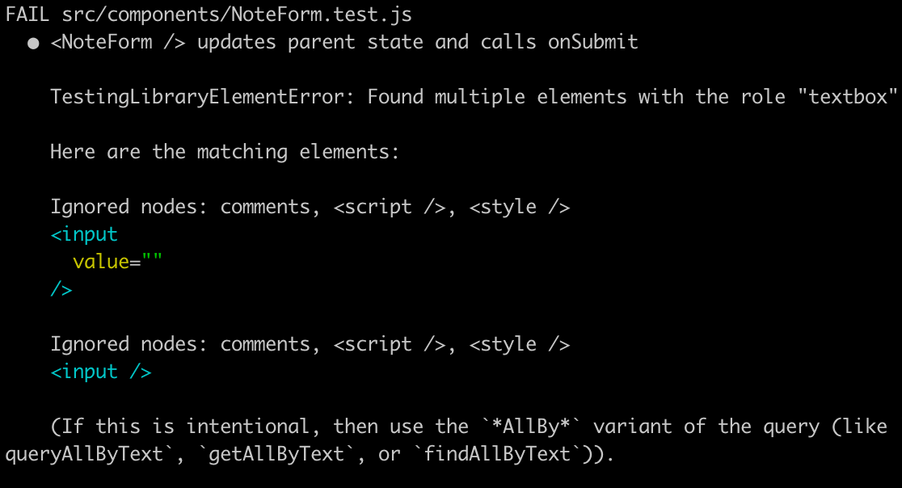
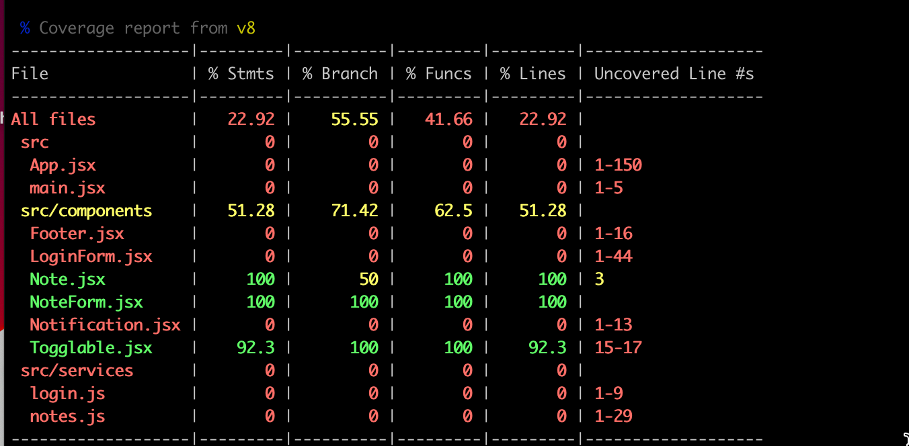
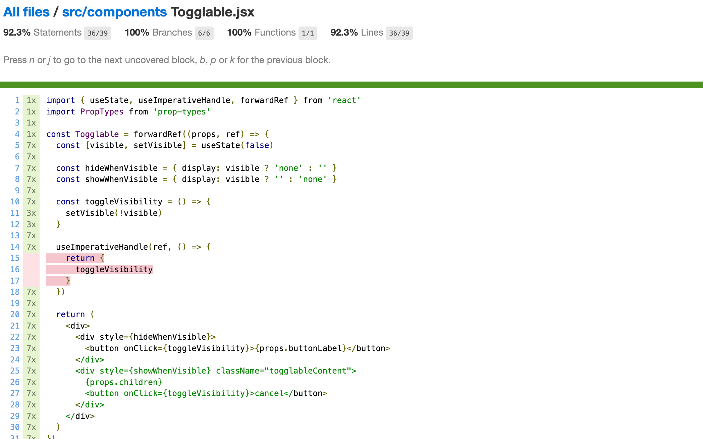

<div class="content">

هناك العديد من الطرق المختلفة لاختبار تطبيقات React. دعنا نلقي نظرة عليها تالياً.

كانت الدورة التدريبية تستخدم سابقاً مكتبة [Jest](http://jestjs.io/) التي طورتها شركة Facebook لاختبار مكونات React. نحن نستخدم الآن الجيل الجديد من أدوات الاختبار المطورة من قِبل مطوري Vite والتي تُسمى [Vitest](https://vitest.dev/). وبصرف النظر عن الإعدادات، توفر المكتبتان نفس واجهة البرمجة (API)، لذلك لا يوجد فرق يُذكر تقريباً في كود الاختبار.

لنبدأ بتثبيت Vitest ومكتبة [jsdom](https://github.com/jsdom/jsdom) التي تحاكي متصفح الويب:

```bash
npm install --save-dev vitest jsdom
```

بالإضافة إلى Vitest، نحتاج أيضاً إلى مكتبة اختبار أخرى تساعدنا في تصيير المكونات لأغراض الاختبار. أفضل خيار حالي لذلك هو [react-testing-library](https://github.com/testing-library/react-testing-library) التي شهدت نمواً سريعاً في شعبيتها مؤخراً. ومن المفيد أيضاً تعزيز القدرة التعبيرية للاختبارات باستخدام مكتبة [jest-dom](https://github.com/testing-library/jest-dom).

دعنا نثبت المكتبات بالأمر:

```bash
npm install --save-dev @testing-library/react @testing-library/jest-dom
```

قبل أن نتمكن من كتابة أول اختبار، نحتاج إلى بعض الإعدادات والتهيئة.

نضيف سكربت إلى ملف <i>package.json</i> لتشغيل الاختبارات:

```json
{
  "scripts": {
    // ...
    "test": "vitest run"
  }
  // ...
}
```

دعنا ننشئ ملفاً باسم _testSetup.js_ في المجلد الجذري للمشروع بالمحتوى التالي:

```js
import { afterEach } from 'vitest'
import { cleanup } from '@testing-library/react'
import '@testing-library/jest-dom/vitest'

afterEach(() => {
  cleanup()
})
```

الآن، بعد كل اختبار، يتم تنفيذ الدالة _cleanup_ لإعادة تعيين jsdom، الذي يحاكي المتصفح.

قم بتوسيع ملف _vite.config.js_ كما يلي:

```js
export default defineConfig({
  // ...
  test: {
    environment: 'jsdom',
    globals: true,
    setupFiles: './testSetup.js', 
  }
})
```

مع تفعيل _globals: true_، لا توجد حاجة لاستيراد الكلمات المفتاحية مثل _describe_ و _test_ و _expect_ في ملفات الاختبارات.

دعنا نكتب أولاً اختبارات للمكوّن المسؤول عن تصيير الملاحظة:

```js
const Note = ({ note, toggleImportance }) => {
  const label = note.important
    ? 'make not important'
    : 'make important'

  return (
    <li className='note'> // highlight-line
      {note.content}
      <button onClick={toggleImportance}>{label}</button>
    </li>
  )
}
```

لاحظ أن عنصر <i>li</i> يحتوي على القيمة <i>note</i> لخاصية [CSS](https://react.dev/learn#adding-styles) المسماة className، والتي يمكن استخدامها للوصول إلى المكوّن في اختباراتنا.

### تصيير المكوّن لأغراض الاختبار (Rendering the component for tests)

سنكتب اختبارنا في الملف <i>src/components/Note.test.jsx</i>، الموجود في نفس المجلد مع المكوّن نفسه.

يتحقق الاختبار الأول من أن المكوّن يصيّر محتوى الملاحظة:

```js
import { render, screen } from '@testing-library/react'
import Note from './Note'

test('renders content', () => {
  const note = {
    content: 'Component testing is done with react-testing-library',
    important: true
  }

  render(<Note note={note} />)

  const element = screen.getByText('Component testing is done with react-testing-library')
  expect(element).toBeDefined()
})
```

بعد الإعداد الأولي، يصيّر الاختبار المكوّن باستخدام دالة [render](https://testing-library.com/docs/react-testing-library/api#render) التي توفرها مكتبة react-testing-library:

```js
render(<Note note={note} />)
```

عادةً ما يتم تصيير مكونات React إلى [شجرة DOM](https://developer.mozilla.org/en-US/docs/Web/API/Document_Object_Model). تقوم طريقة render التي استخدمناها بتصيير المكونات بتنسيق مناسب للاختبارات دون الحاجة لتصييرها في شجرة DOM الحقيقية للمتصفح.

يمكننا استخدام الكائن [screen](https://testing-library.com/docs/queries/about#screen) للوصول إلى المكوّن المُصيَّر. نحن نستخدم التابع [getByText](https://testing-library.com/docs/queries/bytext) الخاص بـ screen للبحث عن عنصر يحتوي على محتوى الملاحظة والتأكد من وجوده:

```js
  const element = screen.getByText('Component testing is done with react-testing-library')
  expect(element).toBeDefined()
```

يتم التحقق من وجود العنصر باستخدام أمر [expect](https://vitest.dev/api/expect.html#expect) الخاص بـ Vitest. يُنشئ Expect توكيداً (Assertion) لمعامله، ويمكن اختبار صحته باستخدام دوال شروط متعددة. لقد استخدمنا الآن [toBeDefined](https://vitest.dev/api/expect.html#tobedefined) الذي يختبر ما إذا كان المعامل _element_ لـ expect موجوداً ومعرّفاً بالفعل.

قم بتشغيل الاختبار باستخدام الأمر _npm test_:

```js
$ npm test

> notes-frontend@0.0.0 test
> vitest run


 RUN  v3.2.3 /home/vejolkko/repot/fullstack-examples/notes-frontend

 ✓ src/components/Note.test.jsx (1 test) 19ms
   ✓ renders content 18ms

 Test Files  1 passed (1)
      Tests  1 passed (1)
   Start at  14:31:54
   Duration  874ms (transform 51ms, setup 169ms, collect 19ms, tests 19ms, environment 454ms, prepare 87ms)
```

يشتكي ESlint من الكلمات المفتاحية _test_ و _expect_ في الاختبارات. يمكن حل المشكلة عن طريق إضافة التهيئة التالية إلى ملف <i>eslint.config.js</i>:

```js
// ...

export default [
  // ...
  // highlight-start
  {
    files: ['**/*.test.{js,jsx}'],
    languageOptions: {
      globals: {
        ...globals.vitest
      }
    }
  }
  // highlight-end
]
```

بهذه الطريقة يتم إبلاغ ESLint بأن الكلمات المفتاحية لـ Vitest متاحة بشكل عام (Global) في ملفات الاختبار.

### موقع ملفات الاختبار (Test file location)

في React يوجد (على الأقل) [عرفان مختلفان](https://medium.com/@JeffLombardJr/organizing-tests-in-jest-17fc431ff850) لموقع ملفات الاختبار. لقد أنشأنا ملفات الاختبار الخاصة بنا وفقاً للمعيار الحالي الشائع بوضعها في نفس المجلد مع المكوّن الذي يتم اختباره.

العرف الآخر هو تخزين ملفات الاختبار "بالطريقة التقليدية" في مجلد منفصل باسم _test_. وأياً كان العرف الذي نختاره، فمن شبه المؤكد أنه سيكون خاطئاً وفقاً لرأي شخص ما.

أنا شخصياً لا أفضل طريقة تخزين الاختبارات وكود التطبيق في نفس المجلد. ومع ذلك، سنتبع هذا النهج في الوقت الحالي، لأنه الممارسة الأكثر شيوعاً في المشاريع الصغيرة.

### البحث عن المحتوى داخل المكوّن (Searching for content in a component)

توفر حزمة react-testing-library طرقاً عديدة ومختلفة لفحص محتوى المكوّن قيد الاختبار. في الواقع، فإن _expect_ في اختبارنا السابق غير ضرورية على الإطلاق:

```js
import { render, screen } from '@testing-library/react'
import Note from './Note'

test('renders content', () => {
  const note = {
    content: 'Component testing is done with react-testing-library',
    important: true
  }

  render(<Note note={note} />)

  const element = screen.getByText('Component testing is done with react-testing-library')

  expect(element).toBeDefined() // highlight-line
})
```

يفشل الاختبار تلقائياً إذا لم تجد دالة _getByText_ العنصر الذي تبحث عنه.

يبحث الأمر _getByText_، بشكل افتراضي، عن عنصر يحتوي **فقط على النص المُمرر كمعامل** وليس شيئاً آخر. دعنا نفترض أن مكوّناً يصيّر نصاً داخل عنصر HTML على النحو التالي:

```js
const Note = ({ note, toggleImportance }) => {
  const label = note.important
    ? 'make not important' : 'make important'

  return (
    <li className='note'>
      Your awesome note: {note.content} // highlight-line
      <button onClick={toggleImportance}>{label}</button>
    </li>
  )
}

export default Note
```

إن التابع _getByText_ الذي يستخدمه الاختبار لن يجد العنصر:

```js
test('renders content', () => {
  const note = {
    content: 'Does not work anymore :(',
    important: true
  }

  render(<Note note={note} />)

  const element = screen.getByText('Does not work anymore :(')

  expect(element).toBeDefined()
})
```

إذا أردنا البحث عن عنصر <i>يحتوي على النص جزئياً</i>، فيمكننا استخدام خيار إضافي:

```js
const element = screen.getByText(
  'Does not work anymore :(', { exact: false }
)
```

أو يمكننا استخدام التابع _findByText_:

```js
const element = await screen.findByText('Does not work anymore :(')
```

من المهم ملاحظة أنه، على عكس توابع _ByText_ الأخرى، يُرجع _findByText_ وعداً (Promise)!

هناك مواقف يكون فيها شكل آخر وهو التابع _queryByText_ مفيداً. يقوم التابع بإرجاع العنصر ولكنه <i>لا يُثير استثناءً (Exception)</i> إذا لم يتم العثور عليه.

يمكننا على سبيل المثال استخدام هذا التابع للتأكد من أن شيئاً ما <i>لم يتم تصييره</i> في المكوّن:

```js
test('does not render this', () => {
  const note = {
    content: 'This is a reminder',
    important: true
  }

  render(<Note note={note} />)

  const element = screen.queryByText('do not want this thing to be rendered')
  expect(element).toBeNull()
})
```

توجد أيضاً طرق أخرى، مثل [getByTestId](https://testing-library.com/docs/queries/bytestid/)، التي تبحث عن العناصر بناءً على حقول id المخصصة خصيصاً لأغراض الاختبار.

يمكننا أيضاً استخدام [محددات CSS (CSS-selectors)](https://developer.mozilla.org/en-US/docs/Web/CSS/CSS_Selectors) للعثور على العناصر المُصيّرة باستخدام التابع [querySelector](https://developer.mozilla.org/en-US/docs/Web/API/Document/querySelector) للكائن [container](https://testing-library.com/docs/react-testing-library/api/#container-1) وهو أحد الحقول التي ترجعها دالة render:

```js
import { render, screen } from '@testing-library/react'
import Note from './Note'

test('renders content', () => {
  const note = {
    content: 'Component testing is done with react-testing-library',
    important: true
  }

  const { container } = render(<Note note={note} />) // highlight-line

// highlight-start
  const div = container.querySelector('.note')
  expect(div).toHaveTextContent(
    'Component testing is done with react-testing-library'
  )
  // highlight-end
})
```

ومع ذلك، يوصى بالبحث عن العناصر بشكل أساسي باستخدام طرق أخرى غير كائن <i>container</i> ومحددات CSS. غالباً ما يمكن تغيير سمات CSS دون التأثير على وظائف التطبيق، والمستخدمون ليسوا على دراية بها. من الأفضل البحث عن العناصر بناءً على الخصائص المرئية للمستخدم، على سبيل المثال باستخدام التابع _getByText_. بهذه الطريقة، تحاكي الاختبارات بشكل أفضل الطبيعة الفعلية للمكوّن وكيف سيجد المستخدم العنصر على الشاشة.

### تصحيح أخطاء الاختبارات (Debugging tests)

عادةً ما نواجه أنواعاً مختلفة من المشاكل عند كتابة اختباراتنا.

يحتوي الكائن _screen_ على التابع [debug](https://testing-library.com/docs/dom-testing-library/api-debugging#screendebug) الذي يمكن استخدامه لطباعة كود HTML للمكوّن في سطر الأوامر. إذا قمنا بتغيير الاختبار كما يلي:

```js
import { render, screen } from '@testing-library/react'
import Note from './Note'

test('renders content', () => {
  const note = {
    content: 'Component testing is done with react-testing-library',
    important: true
  }

  render(<Note note={note} />)

  screen.debug() // highlight-line

  // ...

})
```

فسيتم طباعة كود HTML في الكونسول:

```js
console.log
  <body>
    <div>
      <li
        class="note"
      >
        Component testing is done with react-testing-library
        <button>
          make not important
        </button>
      </li>
    </div>
  </body>
```

من الممكن أيضاً استخدام نفس الطريقة لطباعة عنصر محدد إلى الكونسول:

```js
import { render, screen } from '@testing-library/react'
import Note from './Note'

test('renders content', () => {
  const note = {
    content: 'Component testing is done with react-testing-library',
    important: true
  }

  render(<Note note={note} />)

  const element = screen.getByText('Component testing is done with react-testing-library')

  screen.debug(element)  // highlight-line

  expect(element).toBeDefined()
})
```

الآن تتم طباعة كود HTML للعنصر المطلوب فقط:

```js
  <li
    class="note"
  >
    Component testing is done with react-testing-library
    <button>
      make not important
    </button>
  </li>
```

### النقر على الأزرار في الاختبارات (Clicking buttons in tests)

بالإضافة إلى عرض المحتوى، يتأكد مكوّن <i>Note</i> أيضاً من أنه عند الضغط على الزر المرتبط بالملاحظة، يتم استدعاء دالة معالج الأحداث _toggleImportance_.

دعنا نثبت مكتبة [user-event](https://testing-library.com/docs/user-event/intro) التي تجعل محاكاة إدخال المستخدم أسهل:

```bash
npm install --save-dev @testing-library/user-event
```

يمكن اختبار هذه الوظيفة على النحو التالي:

```js
import { render, screen } from '@testing-library/react'
import userEvent from '@testing-library/user-event' // highlight-line
import Note from './Note'

// ...

test('clicking the button calls event handler once', async () => {
  const note = {
    content: 'Component testing is done with react-testing-library',
    important: true
  }
  
  const mockHandler = vi.fn()  // highlight-line

  render(
    <Note note={note} toggleImportance={mockHandler} />  // highlight-line
  )

  const user = userEvent.setup()  // highlight-line
  const button = screen.getByText('make not important')  // highlight-line
  await user.click(button)  // highlight-line

  expect(mockHandler.mock.calls).toHaveLength(1)  // highlight-line
})
```

هناك بعض النقاط المثيرة للاهتمام المتعلقة بهذا الاختبار. معالج الأحداث هو دالة [محاكاة (Mock Function)](https://vitest.dev/api/mock) معرّفة باستخدام Vitest:

```js
const mockHandler = vi.fn()
```

يتم بدء [جلسة (Session)](https://testing-library.com/docs/user-event/setup/) للتفاعل مع المكوّن المُصيَّر:

```js
const user = userEvent.setup()
```

يعثر الاختبار على الزر <i>بناءً على النص</i> من المكوّن المُصيَّر وينقر على العنصر:

```js
const button = screen.getByText('make not important')
await user.click(button)
```

يحدث النقر باستخدام التابع [click](https://testing-library.com/docs/user-event/convenience/#click) الخاص بمكتبة userEvent.

يستخدم توكيد الاختبار التابع [toHaveLength](https://vitest.dev/api/expect.html#tohavelength) للتحقق من أنه قد تم استدعاء <i>دالة المحاكاة (Mock Function)</i> مرة واحدة بالضبط:

```js
expect(mockHandler.mock.calls).toHaveLength(1)
```

يتم حفظ الاستدعاءات لدالة المحاكاة في المصفوفة [mock.calls](https://vitest.dev/api/mock#mock-calls) داخل كائن دالة المحاكاة.

تُعد [كائنات ودوال المحاكاة (Mock objects and functions)](https://en.wikipedia.org/wiki/Mock_object) مكونات [بديلة (Stubs)](https://en.wikipedia.org/wiki/Method_stub) شائعة الاستخدام في الاختبار لاستبدال تبعيات المكونات قيد الاختبار. تتيح دوال المحاكاة إرجاع استجابات محددة وثابتة، والتحقق من عدد المرات التي تم فيها استدعاء دوال المحاكاة والمعاملات التي استُدعيت بها.

في مثالنا، تُعد دالة المحاكاة خياراً مثالياً حيث يمكن استخدامها بسهولة للتحقق من استدعاء التابع مرة واحدة بالضبط.

### اختبارات المكوّن Togglable (Tests for the Togglable component)

دعنا نكتب بعض الاختبارات لمكوّن <i>Togglable</i>. الاختبارات موضحة أدناه:

```js
import { render, screen } from '@testing-library/react'
import userEvent from '@testing-library/user-event'
import Togglable from './Togglable'

describe('<Togglable />', () => {
  beforeEach(() => {
    render(
      <Togglable buttonLabel="show...">
        <div>togglable content</div>
      </Togglable>
    )
  })

  test('renders its children', () => {
    screen.getByText('togglable content')
  })

  test('at start the children are not displayed', () => {
    const element = screen.getByText('togglable content')
    expect(element).not.toBeVisible()
  })

  test('after clicking the button, children are displayed', async () => {
    const user = userEvent.setup()
    const button = screen.getByText('show...')
    await user.click(button)

    const element = screen.getByText('togglable content')
    expect(element).toBeVisible()
  })
})
```

يتم استدعاء الدالة _beforeEach_ قبل كل اختبار، والتي تقوم بعد ذلك بتصيير مكوّن <i>Togglable</i>.

يتحقق الاختبار الأول من أن مكوّن <i>Togglable</i> يصيّر مكوّنه الفرعي:

```js
<div>
  togglable content
</div>
```

تستخدم الاختبارات المتبقية التابع _toBeVisible_ للتحقق من أن المكوّن الفرعي لمكوّن <i>Togglable</i> غير مرئي في البداية، أي أن نمط عنصر <i>div</i> يحتوي على _{ display: 'none' }_. ويتحقق اختبار آخر من أنه عند الضغط على الزر يصبح المكوّن مرئياً، مما يعني أن نمط إخفائه <i>لم يعد</i> مسنداً إلى المكوّن.

دعنا نضيف أيضاً اختباراً يمكن استخدامه للتحقق من إمكانية إخفاء المحتوى المرئي عن طريق النقر على الزر الثاني للمكوّن:

```js
describe('<Togglable />', () => {

  // ...

  test('toggled content can be closed', async () => {
    const user = userEvent.setup()
    const button = screen.getByText('show...')
    await user.click(button)

    const closeButton = screen.getByText('cancel')
    await user.click(closeButton)

    const element = screen.getByText('togglable content')
    expect(element).not.toBeVisible()
  })
})
```

### اختبار النماذج (Testing the forms)

لقد استخدمنا بالفعل الدالة _click_ الخاصة بـ [user-event](https://testing-library.com/docs/user-event/intro) في اختباراتنا السابقة للنقر على الأزرار:

```js
const user = userEvent.setup()
const button = screen.getByText('show...')
await user.click(button)
```

يمكننا أيضاً محاكاة إدخال النصوص باستخدام <i>userEvent</i>.

دعنا ننشئ اختباراً لمكوّن <i>NoteForm</i>. كود المكوّن كما يلي:

```js
import { useState } from 'react'

const NoteForm = ({ createNote }) => {
  const [newNote, setNewNote] = useState('')

  const addNote = event => {
    event.preventDefault()
    createNote({
      content: newNote,
      important: true
    })

    setNewNote('')
  }

  return (
    <div>
      <h2>Create a new note</h2>

      <form onSubmit={addNote}>
        <input
          value={newNote}
          onChange={event => setNewNote(event.target.value)}
        />
        <button type="submit">save</button>
      </form>
    </div>
  )
}

export default NoteForm
```

يعمل النموذج عن طريق استدعاء الدالة المستلمة عبر الخصائص _createNote_، مع تفاصيل الملاحظة الجديدة.

الاختبار كالتالي:

```js
import { render, screen } from '@testing-library/react'
import NoteForm from './NoteForm'
import userEvent from '@testing-library/user-event'

test('<NoteForm /> updates parent state and calls onSubmit', async () => {
  const createNote = vi.fn()
  const user = userEvent.setup()

  render(<NoteForm createNote={createNote} />)

  const input = screen.getByRole('textbox')
  const sendButton = screen.getByText('save')

  await user.type(input, 'testing a form...')
  await user.click(sendButton)

  expect(createNote.mock.calls).toHaveLength(1)
  expect(createNote.mock.calls[0][0].content).toBe('testing a form...')
})
```

تصل الاختبارات إلى حقل الإدخال باستخدام الدالة [getByRole](https://testing-library.com/docs/queries/byrole).

يُستخدم التابع [type](https://testing-library.com/docs/user-event/utility#type) الخاص بـ userEvent لكتابة النص في حقل الإدخال.

يضمن توكيد الاختبار الأول أن إرسال النموذج يستدعي التابع _createNote_.
ويتحقق التوكيد الثاني من استدعاء معالج الأحداث بالمعاملات الصحيحة - أي أنه يتم إنشاء ملاحظة بالمحتوى الصحيح عند ملء النموذج.

من الجدير بالذكر أن عبارة _console.log_ القديمة الجيدة تعمل كالمعتاد في الاختبارات. على سبيل المثال، إذا كنت تريد معرفة شكل الاستدعاءات المخزنة بواسطة كائن المحاكاة، يمكنك القيام بما يلي:

```js
test('<NoteForm /> updates parent state and calls onSubmit', async() => {
  const user = userEvent.setup()
  const createNote = vi.fn()

  render(<NoteForm createNote={createNote} />)

  const input = screen.getByRole('textbox')
  const sendButton = screen.getByText('save')

  await user.type(input, 'testing a form...')
  await user.click(sendButton)

  console.log(createNote.mock.calls) // highlight-line
})
```

في منتصف تشغيل الاختبارات، ستتم طباعة ما يلي في الكونسول:

```
[ [ { content: 'testing a form...', important: true } ] ]
```

### حول طرق إيجاد العناصر (About finding the elements)

دعنا نفترض أن النموذج يحتوي على حقلي إدخال:

```js
const NoteForm = ({ createNote }) => {
  // ...

  return (
    <div>
      <h2>Create a new note</h2>

      <form onSubmit={addNote}>
        <input
          value={newNote}
          onChange={event => setNewNote(event.target.value)}
        />
        // highlight-start
        <input
          value={...}
          onChange={...}
        />
        // highlight-end
        <button type="submit">save</button>
      </form>
    </div>
  )
}
```

الآن، النهج الذي يستخدمه اختبارنا للعثور على حقل الإدخال:

```js
const input = screen.getByRole('textbox')
```

سيتسبب في حدوث خطأ:



تقترح رسالة الخطأ استخدام <i>getAllByRole</i>. يمكن إصلاح الاختبار كما يلي:

```js
const inputs = screen.getAllByRole('textbox')

await user.type(inputs[0], 'testing a form...')
```

يُرجع التابع <i>getAllByRole</i> الآن مصفوفة وحقل الإدخال الصحيح هو العنصر الأول في المصفوفة. ومع ذلك، فإن هذا النهج مشكوك فيه بعض الشيء لأنه يعتمد على ترتيب حقول الإدخال.

إذا تم تعريف <i>label</i> لحقل الإدخال، فيمكن تحديد موقع حقل الإدخال باستخدامه مع تابع getByLabelText. على سبيل المثال، إذا أضفنا تسمية (label) إلى حقل الإدخال:

```js
  // ...
  <label> // highlight-line
    content // highlight-line
    <input
      value={newNote}
      onChange={event => setNewNote(event.target.value)}
    />
  </label> // highlight-line
  // ...
```

يمكن للاختبار تحديد موقع حقل الإدخال كما يلي:

```js
test('<NoteForm /> updates parent state and calls onSubmit', async () => {
  const user = userEvent.setup()
  const createNote = vi.fn()

  render(<NoteForm createNote={createNote} />) 

  const input = screen.getByLabelText('content') // highlight-line
  const sendButton = screen.getByText('save')

  await user.type(input, 'testing a form...')
  await user.click(sendButton)

  expect(createNote.mock.calls).toHaveLength(1)
  expect(createNote.mock.calls[0][0].content).toBe('testing a form...')
})
```

في كثير من الأحيان، تحتوي حقول الإدخال على نص تلميحي مؤقت (<i>placeholder</i>) يُلمح للمستخدم بنوع الإدخال المتوقع. دعنا نضيف نصاً تلميحياً إلى نموذجنا:

```js
const NoteForm = ({ createNote }) => {
  // ...

  return (
    <div>
      <h2>Create a new note</h2>

      <form onSubmit={addNote}>
        <input
          value={newNote}
          onChange={event => setNewNote(event.target.value)}
          placeholder='write note content here' // highlight-line 
        />
        <input
          value={...}
          onChange={...}
        />    
        <button type="submit">save</button>
      </form>
    </div>
  )
}
```

الآن أصبح العثور على حقل الإدخال الصحيح سهلاً باستخدام التابع [getByPlaceholderText](https://testing-library.com/docs/queries/byplaceholdertext):

```js
test('<NoteForm /> updates parent state and calls onSubmit', async () => {
  const user = userEvent.setup()
  const createNote = vi.fn()

  render(<NoteForm createNote={createNote} />) 

  const input = screen.getByPlaceholderText('write note content here') // highlight-line 
  const sendButton = screen.getByText('save')

  await user.type(input, 'testing a form...')
  await user.click(sendButton)

  expect(createNote.mock.calls).toHaveLength(1)
  expect(createNote.mock.calls[0][0].content).toBe('testing a form...')
})
```

في بعض الأحيان، قد يكون العثور على العنصر الصحيح باستخدام الطرق الموضحة أعلاه أمراً صعباً. في مثل هذه الحالات، يكون البديل هو التابع <i>querySelector</i> لكائن _container_، الذي تُرجعه دالة _render_، كما ذكرنا [سابقاً في هذا الجزء](/ar/part5/testing_react_apps#searching-for-content-in-a-component). يمكن استخدام أي محدد CSS مع هذه الطريقة للبحث عن العناصر في الاختبارات.

لنفترض على سبيل المثال أننا حددنا معرفاً فريداً _id_ لحقل الإدخال:

```js
const NoteForm = ({ createNote }) => {
  // ...

  return (
    <div>
      <h2>Create a new note</h2>

      <form onSubmit={addNote}>
        <input
          value={newNote}
          onChange={event => setNewNote(event.target.value)}
          id='note-input' // highlight-line 
        />
        <input
          value={...}
          onChange={...}
        />    
        <button type="submit">save</button>
      </form>
    </div>
  )
}
```

يمكن الآن العثور على عنصر الإدخال في الاختبار كما يلي:

```js
const { container } = render(<NoteForm createNote={createNote} />)

const input = container.querySelector('#note-input')
```

ومع ذلك، سنلتزم بنهج استخدام _getByPlaceholderText_ في الاختبار.

### تغطية الاختبارات (Test coverage)

يمكننا بسهولة معرفة [تغطية (Coverage)](https://vitest.dev/guide/coverage.html#coverage) اختباراتنا عن طريق تشغيلها بالأمر التالي:

```bash
npm test -- --coverage
```

في المرة الأولى التي تقوم فيها بتشغيل الأمر، سيسألك Vitest عما إذا كنت تريد تثبيت المكتبة المطلوبة _@vitest/coverage-v8_. قم بتثبيتها، ثم شغّل الأمر مرة أخرى:



سيتم إنشاء تقرير بتنسيق HTML في المجلد <i>coverage</i>.
سيخبرنا التقرير بأسطر الكود غير المختبرة في كل مكوّن:



دعنا نضيف المجلد <i>coverage/</i> إلى ملف <i>.gitignore</i> لاستبعاد محتوياته من نظام إدارة الإصدارات:

```
//...

coverage/
```

يمكنك العثور على كود تطبيقنا الحالي بالكامل في الفرع <i>part5-8</i> من [مستودع GitHub هذا](https://github.com/fullstack-hy2020/part2-notes-frontend/tree/part5-8).

</div>

<div class="tasks">

### التمارين 5.13.-5.16.

#### 5.13: اختبارات قائمة المدونات، الخطوة 1

أنشئ اختباراً يتحقق من أن المكوّن الذي يعرض المدونة يصيّر عنوان المدونة ومؤلفها، ولكنه لا يصيّر عنوان URL الخاص بها أو عدد الإعجابات بشكل افتراضي.

أضف فئات CSS (CSS classes) إلى المكوّن للمساعدة في الاختبار حسب الضرورة.

#### 5.14: اختبارات قائمة المدونات، الخطوة 2

أنشئ اختباراً يتحقق من عرض عنوان URL للمدونة وعدد الإعجابات عند النقر فوق الزر الذي يتحكم في التفاصيل المعروضة.

#### 5.15: اختبارات قائمة المدونات، الخطوة 3

أنشئ اختباراً يضمن أنه إذا تم النقر فوق زر <i>الإعجاب (Like)</i> مرتين، فسيتم استدعاء معالج الأحداث الذي استلمه المكوّن عبر الخصائص مرتين.

#### 5.16: اختبارات قائمة المدونات، الخطوة 4

أنشئ اختباراً لنموذج المدونة الجديدة. يجب أن يتحقق الاختبار من أن النموذج يستدعي معالج الأحداث الذي استلمه عبر الخصائص بالتفاصيل الصحيحة عند إنشاء مدونة جديدة.

</div>

<div class="content">

### اختبارات التكامل للواجهة الأمامية (Frontend integration tests)

في الجزء السابق من المادة التعليمية، كتبنا اختبارات تكامل (Integration Tests) للواجهة الخلفية لاختبار منطقها وربط قاعدة البيانات من خلال واجهة برمجة التطبيقات (API) التي توفرها الواجهة الخلفية. عند كتابة تلك الاختبارات، اتخذنا قراراً واعياً بعدم كتابة اختبارات الوحدات (Unit Tests)، لأن كود تلك الواجهة الخلفية بسيط إلى حد ما، ومن المرجح أن تحدث الأخطاء البرمجية في سيناريوهات أكثر تعقيداً لا تلائمها اختبارات الوحدات بشكل كافٍ.

حتى الآن، كانت جميع اختباراتنا للواجهة الأمامية عبارة عن اختبارات وحدات تحقق من الأداء الصحيح للمكونات الفردية. تكون اختبارات الوحدات مفيدة في بعض الأحيان، ولكن حتى المجموعة الشاملة من اختبارات الوحدات ليست كافية للتحقق من أن التطبيق يعمل ككل متكامل.

يمكننا أيضاً إجراء اختبارات تكامل للواجهة الأمامية. تختبر اختبارات التكامل تعاون وتفاعل مكونات متعددة معاً. إنه أكثر صعوبة بكثير من اختبارات الوحدات، حيث يتعين علينا على سبيل المثال محاكاة البيانات القادمة من الخادم (Mocking server data).
لقد اخترنا التركيز على إجراء الاختبارات الشاملة من البداية إلى النهاية (End-to-End Tests - E2E) لاختبار التطبيق بأكمله. سنعمل على الاختبارات الشاملة E2E في الفصل التالي من هذا الجزء.

### اختبارات اللقطات (Snapshot testing)

تقدم Vitest بديلاً مختلفاً تماماً عن الاختبارات "التقليدية" يُسمى اختبارات [اللقطات (Snapshot Testing)](https://vitest.dev/guide/snapshot). الميزة المثيرة للاهتمام في اختبارات اللقطات هي أن المطورين لا يحتاجون إلى تحديد أي اختبارات بأنفسهم، فمن السهل جداً تبني واستخدام اختبارات اللقطات.

المبدأ الأساسي هو مقارنة كود HTML الذي حدده المكوّن بعد تغييره بكود HTML الذي كان موجوداً قبل تغييره.

إذا لاحظت اللقطة (Snapshot) بعض التغيير في كود HTML المحدد بواسطة المكوّن، فإما أن تكون وظيفة جديدة أو "خطأ برمجياً (Bug)" حدث عن طريق الخطأ. تُخطر اختبارات اللقطات المطور إذا تغير كود HTML الخاص بالمكوّن. يتعين على المطور إخبار Vitest ما إذا كان التغيير مرغوباً فيه أم غير مرغوب فيه. إذا كان التغيير في كود HTML غير متوقع، فهذا يعني بقوة وجود خطأ برمجي، ويمكن للمطور أن يصبح على دراية بهذه المشكلات المحتملة بسهولة بفضل اختبارات اللقطات.

</div>
