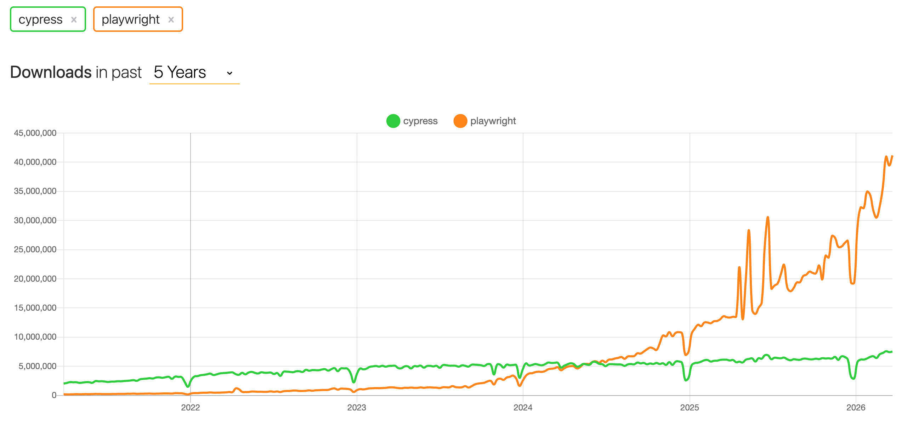
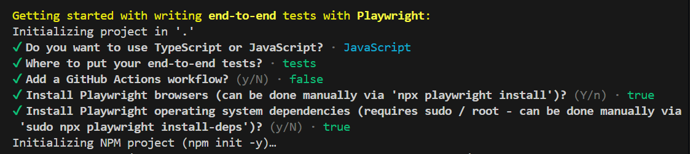
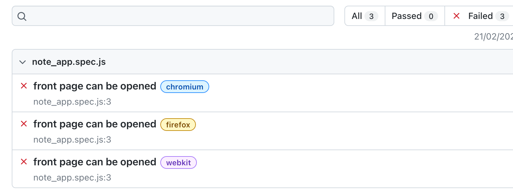
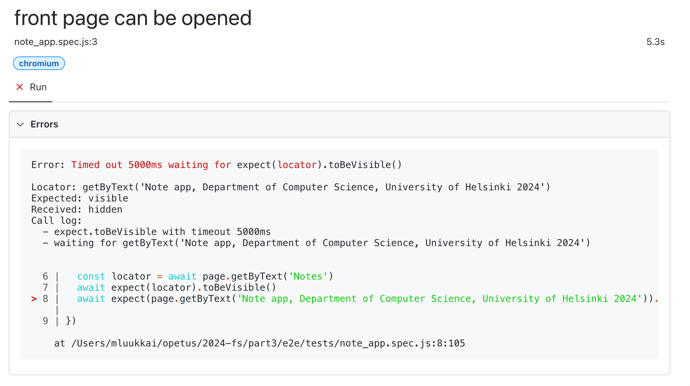
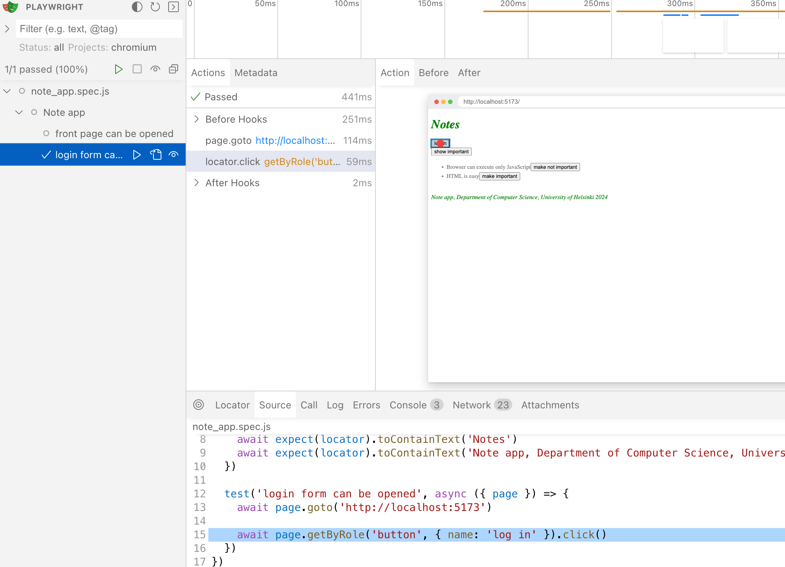
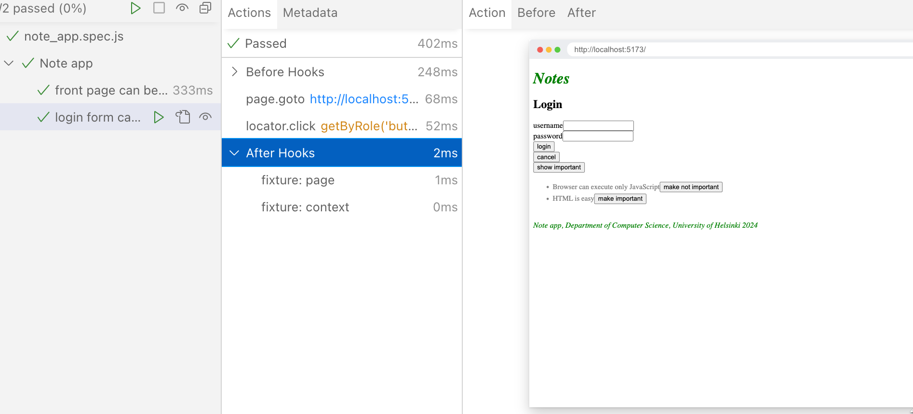
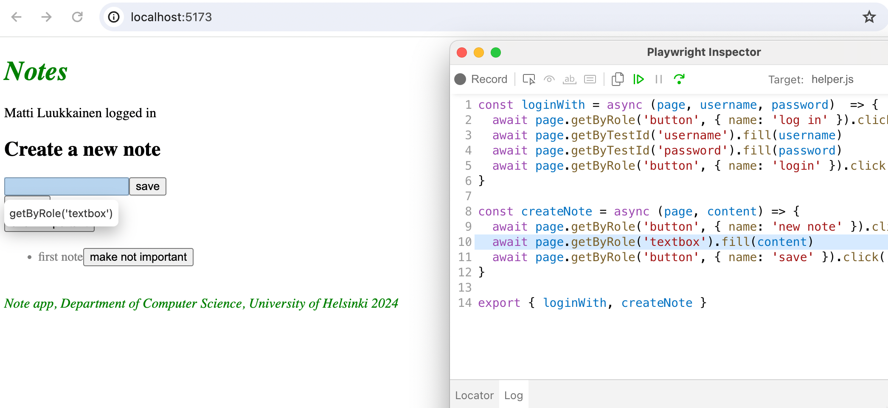
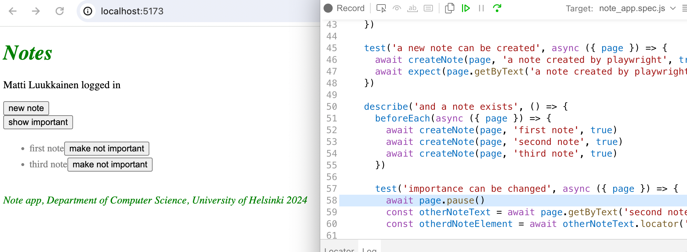
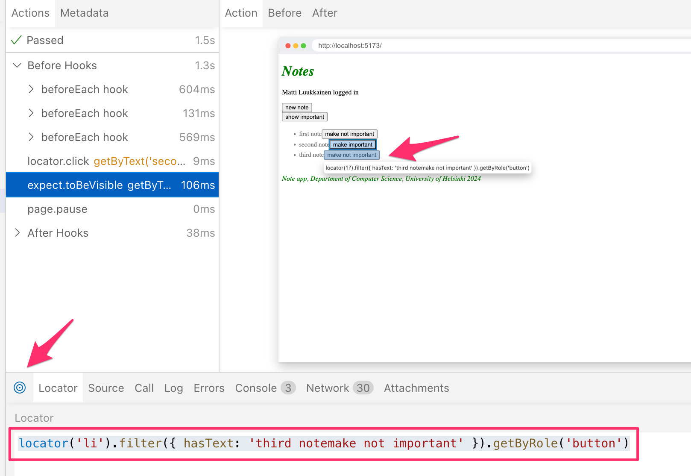
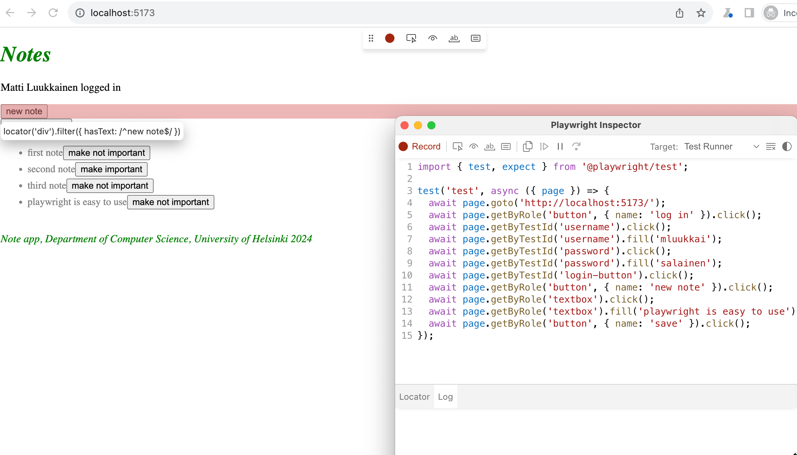

<div class="content">

حتى الآن، قمنا باختبار الواجهة الخلفية ككل على مستوى واجهة برمجة التطبيقات (API) باستخدام اختبارات التكامل (Integration Tests)، واختبرنا بعض مكونات الواجهة الأمامية باستخدام اختبارات الوحدات (Unit Tests).

بعد ذلك، سنلقي نظرة على إحدى الطرق لاختبار [النظام ككل](https://en.wikipedia.org/wiki/System_testing) باستخدام اختبارات <i>شاملة طرفاً لطرف</i> (End to End - E2E).

يمكننا إجراء اختبارات E2E لتطبيق الويب باستخدام المتصفح ومكتبة اختبار. هناك العديد من المكتبات المتاحة. أحد الأمثلة هو [Selenium](http://www.seleniumhq.org/)، والذي يمكن استخدامه مع أي متصفح تقريباً.
خيار آخر للمتصفحات هو ما يُسمى [المتصفحات عديمة الواجهة (Headless Browsers)](https://en.wikipedia.org/wiki/Headless_browser)، وهي متصفحات بدون واجهة مستخدم رسومية. على سبيل المثال، يمكن استخدام Chrome في الوضع عديم الواجهة (Headless mode).

تُعد اختبارات E2E الفئة الأكثر فائدة وقيمة من بين الاختبارات لأنها تختبر النظام من خلال نفس الواجهة التي يستخدمها المستخدمون الحقيقيون.

ومع ذلك، فإن لها بعض العيوب أيضاً. فتكوين اختبارات E2E وإعدادها يُعد أكثر صعوبة وتحدياً من اختبارات الوحدات أو التكامل. كما أنها تميل إلى أن تكون بطيئة نوعاً ما، ومع الأنظمة الكبيرة، قد يستغرق وقت تنفيذها دقائق أو حتى ساعات. وهذا أمر غير محبذ أثناء عملية التطوير، لأنه أثناء كتابة الكود من المفيد جداً أن تكون قادراً على تشغيل الاختبارات بأسرع وأكثر تكرار ممكن لاكتشاف أي [انتكاسات برمجية (Regressions)](https://en.wikipedia.org/wiki/Regression_testing).

يمكن أن تكون اختبارات E2E أيضاً [غير مستقرة ومتقلبة (Flaky Tests)](https://hackernoon.com/flaky-tests-a-war-that-never-ends-9aa32fdef359).
قد ينجح بعض الاختبارات في مرة ويفشل في مرة أخرى، حتى لو لم يتغير الكود على الإطلاق.

ربما تكون أسهل مكتبتين للاختبار الشامل طرفاً لطرف في الوقت الحالي هما [Playwright](https://playwright.dev/) و [Cypress](https://www.cypress.io/).

من الإحصائيات على [npmtrends.com](https://npmtrends.com/cypress-vs-playwright) يمكننا أن نرى أن Playwright تفوقت على Cypress في أعداد التنزيلات خلال عام 2024، وتستمر شعبيتها في النمو المتسارع:



استخدمت هذه الدورة Cypress لسنوات. والآن أصبح خيارنا المعتمد هو Playwright.

تُعد [Playwright](https://playwright.dev/) وافداً حديثاً نسبياً إلى عالم اختبارات E2E، وقد بدأت شعبيتها في الانفجار نحو نهاية عام 2023. تتساوى Playwright تقريباً مع Cypress من حيث سهولة الاستخدام، لكن المكتبتين تختلفان قليلاً من حيث طريقة عملهما. تختلف Cypress جذرياً عن معظم المكتبات المناسبة لاختبارات E2E، حيث يتم تشغيل اختبارات Cypress بالكامل داخل المتصفح. أما اختبارات Playwright، فيتم تنفيذها في عملية Node خارجية متصلة بالمتصفح عبر واجهات برمجية مخصصة.

دعنا نستكشف الآن مكتبة Playwright.

### تهيئة الاختبارات (Initializing tests)

على عكس اختبارات الواجهة الخلفية أو اختبارات الوحدات التي يتم إجراؤها على واجهة React الأمامية، لا يلزم وجود اختبارات E2E في نفس مشروع npm الذي يوجد به الكود. دعنا ننشئ مشروعاً منفصلاً تماماً لاختبارات E2E باستخدام الأمر _npm init_. ثم قم بتثبيت Playwright عن طريق تشغيل الأمر التالي في مجلد المشروع الجديد:

```bash
npm init playwright@latest
```

سيسأل سكربت التثبيت بعض الأسئلة، أجب عنها كما يلي:



لاحظ أنه عند تثبيت Playwright، قد لا يدعم نظام التشغيل لديك جميع المتصفحات التي تقدمها Playwright، وقد ترى رسالة تحذير أو خطأ مثل أدناه:

```
Webkit 18.0 (playwright build v2070) downloaded to /home/user/.cache/ms-playwright/webkit-2070
Playwright Host validation warning: 
╔══════════════════════════════════════════════════════╗
║ Host system is missing dependencies to run browsers. ║
║ Missing libraries:                                   ║
║     libicudata.so.66                                 ║
║     libicui18n.so.66                                 ║
║     libicuuc.so.66                                   ║
║     libjpeg.so.8                                     ║
║     libwebp.so.6                                     ║
║     libpcre.so.3                                     ║
║     libffi.so.7                                      ║
╚══════════════════════════════════════════════════════╝
```

إذا كانت هذه هي الحالة، يمكنك إما تحديد متصفحات معينة للاختبار باستخدام `--project=` في ملف _package.json_ الخاص بك:

```json
    "test": "playwright test --project=chromium --project=firefox",
```

أو إزالة الإدخال الخاص بالمتصفحات التي تسبب مشاكل من ملف _playwright.config.js_:

```js
  projects: [
    // ...
    //{
    //  name: 'webkit',
    //  use: { ...devices['Desktop Safari'] },
    //},
    // ...
  ]
```

دعنا نحدد سكربتات npm لتشغيل الاختبارات وتقارير الاختبار في _package.json_:

```json
{
  // ...
  "scripts": {
    "test": "playwright test",
    "test:report": "playwright show-report"
  },
  // ...
}
```

أثناء التثبيت، تتم طباعة ما يلي في سطر الأوامر:

```
And check out the following files:
  - ./tests/example.spec.js - Example end-to-end test
  - ./tests-examples/demo-todo-app.spec.js - Demo Todo App end-to-end tests
  - ./playwright.config.js - Playwright Test configuration
```

وهي مواقع بعض الاختبارات النموذجية للمشروع التي أنشأها التثبيت.

دعنا نشغل الاختبارات:

```bash
$ npm test

> notes-e2e@1.0.0 test
> playwright test


Running 6 tests using 5 workers
  6 passed (3.9s)

To open last HTML report run:

  npx playwright show-report
```

تنجح جميع الاختبارات. يمكن فتح تقرير اختبار أكثر تفصيلاً إما بالأمر المقترح بواسطة المخرجات، أو باستخدام سكربت npm الذي حددناه للتو:

```bash
npm run test:report
```

يمكن أيضاً تشغيل الاختبارات عبر واجهة المستخدم الرسومية باستخدام الأمر:

```bash
npm run test -- --ui
```

تبدو الاختبارات النموذجية في الملف tests/example.spec.js هكذا:

```js
// @ts-check
import { test, expect } from '@playwright/test';

test('has title', async ({ page }) => {
  await page.goto('https://playwright.dev/'); // highlight-line

  // Expect a title "to contain" a substring.
  await expect(page).toHaveTitle(/Playwright/);
});

test('get started link', async ({ page }) => {
  await page.goto('https://playwright.dev/');

  // Click the get started link.
  await page.getByRole('link', { name: 'Get started' }).click();

  // Expects page to have a heading with the name of Installation.
  await expect(page.getByRole('heading', { name: 'Installation' })).toBeVisible();
});
```

السطر الأول من دوال الاختبار يوضح أن الاختبارات تقوم باختبار الصفحة على العنوان https://playwright.dev/.

### اختبار الكود الخاص بنا (Testing our own code)

دعنا الآن نزيل الاختبارات النموذجية ونبدأ في اختبار تطبيقنا الخاص.

تفترض اختبارات Playwright أن النظام قيد الاختبار قيد التشغيل بالفعل عند تنفيذ الاختبارات. وعلى عكس اختبارات التكامل للواجهة الخلفية على سبيل المثال، فإن اختبارات Playwright <i>لا تقوم بتشغيل</i> النظام قيد الاختبار تلقائياً أثناء الاختبار.

دعنا ننشئ سكربت npm لـ <i>الواجهة الخلفية</i>، والذي سيمكن من تشغيلها في وضع الاختبار، أي بحيث يحصل <i>NODE\_ENV</i> على القيمة <i>test</i>.

```json
{
  // ...
  "scripts": {
    "start": "cross-env NODE_ENV=production node index.js",
    "dev": "cross-env NODE_ENV=development node --watch index.js",
    "test": "cross-env NODE_ENV=test node --test",
    "lint": "eslint .",
    // ...
    "start:test": "cross-env NODE_ENV=test node --watch index.js" // highlight-line
  },
  // ...
}
```

دعنا نشغل كلاً من الواجهة الأمامية والواجهة الخلفية، وننشئ أول ملف اختبار للتطبيق <code>tests/note\_app.spec.js</code>:

```js
const { test, expect } = require('@playwright/test')

test('front page can be opened', async ({ page }) => {
  await page.goto('http://localhost:5173')

  const locator = page.getByText('Notes')
  await expect(locator).toBeVisible()
  await expect(page.getByText('Note app, Department of Computer Science, University of Helsinki 2024')).toBeVisible()
})
```

أولاً، يفتح الاختبار التطبيق باستخدام التابع [page.goto](https://playwright.dev/docs/writing-tests#navigation). بعد ذلك، يستخدم [page.getByText](https://playwright.dev/docs/api/class-page#page-get-by-text) للحصول على [محدد موقع (Locator)](https://playwright.dev/docs/locators) يطابق العنصر الذي يوجد به النص <i>Notes</i>.

يضمن التابع [toBeVisible](https://playwright.dev/docs/api/class-locatorassertions#locator-assertions-to-be-visible) أن العنصر المطابق للمحدد مرئي على الصفحة.

يتم الفحص الثاني دون استخدام المتغير المساعد.

يفشل الاختبار لأن سنة قديمة ظهرت في الاختبار. يفتح Playwright تقرير الاختبار في المتصفح ويتضح أن Playwright قد أجرى الاختبارات بالفعل مع ثلاثة متصفحات مختلفة: Chrome و Firefox و Webkit (أي محرك المتصفح المستخدم بواسطة Safari):



بالنقر على تقرير أحد المتصفحات، يمكننا رؤية رسالة خطأ أكثر تفصيلاً:



في الصورة الكلية، من الجيد جداً بالطبع أن يتم الاختبار مع جميع محركات المتصفحات الثلاثة شائعة الاستخدام، ولكن هذا بطيء، وعند تطوير الاختبارات فمن الأفضل على الأرجح إجراؤها بشكل أساسي باستخدام متصفح واحد فقط. يمكنك تحديد محرك المتصفح الذي سيتم استخدامه باستخدام معامل سطر الأوامر:

```bash
npm test -- --project chromium
```

الآن دعنا نصلح الاختبار بالسنة الصحيحة ونضيف كتلة _describe_ إلى الاختبارات:

```js
const { test, describe, expect } = require('@playwright/test')

describe('Note app', () => {  // highlight-line
  test('front page can be opened', async ({ page }) => {
    await page.goto('http://localhost:5173')

    const locator = page.getByText('Notes')
    await expect(locator).toBeVisible()
    await expect(page.getByText('Note app, Department of Computer Science, University of Helsinki 2025')).toBeVisible()
  })
})
```

قبل أن ننتقل، دعنا نكسر الاختبارات مرة أخرى. نلاحظ أن تنفيذ الاختبارات سريع للغاية عندما تنجح، ولكنه أبطأ بكثير إذا لم تنجح. والسبب في ذلك هو أن سياسة Playwright هي الانتظار حتى تصبح العناصر التي يتم البحث عنها [مُصيّرة وجاهزة للتفاعل (Actionability)](https://playwright.dev/docs/actionability). إذا لم يتم العثور على العنصر، يتم إطلاق _TimeoutError_ ويفشل الاختبار. ينتظر Playwright العناصر افتراضياً لمدة 5 أو 30 ثانية [اعتماداً على الدوال المستخدمة في الاختبار](https://playwright.dev/docs/test-timeouts#introduction).

عند تطوير الاختبارات، قد يكون من الحكمة تقليل وقت الانتظار إلى بضع ثوانٍ. وفقاً لـ [الوثائق الرسمية](https://playwright.dev/docs/test-timeouts)، يمكن القيام بذلك عن طريق تعديل ملف _playwright.config.js_ كما يلي:

```js
export default defineConfig({
  // ...
  timeout: 3000, // highlight-line
  fullyParallel: false, // highlight-line
  workers: 1, // highlight-line
  // ...
})
```

أجرينا أيضاً تغييرين آخرين على الملف، محددين أن [تُنفذ جميع الاختبارات واحداً تلو الآخر](https://playwright.dev/docs/test-parallel). مع الإعدادات الافتراضية، يتم التنفيذ بالتوازي، ونظراً لأن اختباراتنا تستخدم قاعدة بيانات، فإن التنفيذ المتوازي يسبب مشاكل وتداخلاً.

### الكتابة في النماذج (Writing on the form)

دعنا نكتب اختباراً جديداً يحاول تسجيل الدخول إلى التطبيق. لنفترض أن هناك مستخدماً مخزناً في قاعدة البيانات، باسم المستخدم <i>mluukkai</i> وكلمة المرور <i>salainen</i>.

لنبدأ بفتح نموذج تسجيل الدخول:

```js
describe('Note app', () => {
  // ...

  test('user can log in', async ({ page }) => {
    await page.goto('http://localhost:5173')

    await page.getByRole('button', { name: 'login' }).click()
  })
})
```

يستخدم الاختبار أولاً التابع [page.getByRole](https://playwright.dev/docs/api/class-page#page-get-by-role) لاسترداد الزر بناءً على نصه. يُرجع التابع كائن [المحدد (Locator)](https://playwright.dev/docs/api/class-locator) المقابل لعنصر الزر. يتم الضغط على الزر باستخدام التابع [click](https://playwright.dev/docs/api/class-locator#locator-click) الخاص بالمحدد.

عند تطوير الاختبارات، يمكنك استخدام [وضع الواجهة الرسومية (UI mode)](https://playwright.dev/docs/test-ui-mode) في Playwright. دعنا نشغل الاختبارات في وضع UI كما يلي:

```bash
npm test -- --ui
```

نرى الآن أن الاختبار يجد الزر بنجاح:



بعد النقر، يظهر النموذج:



عند فتح النموذج، يجب أن يبحث الاختبار عن حقول النص ويدخل اسم المستخدم وكلمة المرور فيها. لنقم بالمحاولة الأولى باستخدام التابع [page.getByRole](https://playwright.dev/docs/api/class-page#page-get-by-role):

```js
describe('Note app', () => {
  // ...

  test('user can log in', async ({ page }) => {
    await page.goto('http://localhost:5173')

    await page.getByRole('button', { name: 'login' }).click()
    await page.getByRole('textbox').fill('mluukkai')  // highlight-line
  })
})
```

يؤدي هذا إلى ظهور خطأ:

```bash
Error: locator.fill: Error: strict mode violation: getByRole('textbox') resolved to 2 elements:
  1) <input value=""/> aka locator('div').filter({ hasText: /^username$/ }).getByRole('textbox')
  2) <input value="" type="password"/> aka locator('input[type="password"]')
```

المشكلة الآن هي أن _getByRole_ يجد حقلي نص، واستدعاء التابع [fill](https://playwright.dev/docs/api/class-locator#locator-fill) يفشل لأنه يفترض وجود حقل نصي واحد فقط. إحدى الطرق للتغلب على المشكلة هي استخدام التابعين [first](https://playwright.dev/docs/api/class-locator#locator-first) و [last](https://playwright.dev/docs/api/class-locator#locator-last):

```js
describe('Note app', () => {
  // ...

  test('user can log in', async ({ page }) => {
    await page.goto('http://localhost:5173')

    await page.getByRole('button', { name: 'login' }).click()
    // highlight-start
    await page.getByRole('textbox').first().fill('mluukkai')
    await page.getByRole('textbox').last().fill('salainen')
    await page.getByRole('button', { name: 'login' }).click()
  
    await expect(page.getByText('Matti Luukkainen logged in')).toBeVisible()
    // highlight-end
  })
})
```

بعد الكتابة في الحقول النصية، يضغط الاختبار على زر _login_ ويتحقق من أن التطبيق يصيّر معلومات المستخدم المسجل دخوله على الشاشة.

إذا كان هناك أكثر من حقلين نصيين، فلن يكون استخدام التابعين _first_ و _last_ كافياً. أحد الاحتمالات هو استخدام التابع [all](https://playwright.dev/docs/api/class-locator#locator-all)، الذي يحول المحددات التي تم العثور عليها إلى مصفوفة يمكن الوصول لعناصرها عبر الفهارس (Indexes):

```js
describe('Note app', () => {
  // ...
  test('user can log in', async ({ page }) => {
    await page.goto('http://localhost:5173')

    await page.getByRole('button', { name: 'login' }).click()
    // highlight-start
    const textboxes = await page.getByRole('textbox').all()

    await textboxes[0].fill('mluukkai')
    await textboxes[1].fill('salainen')
    // highlight-end

    await page.getByRole('button', { name: 'login' }).click()
  
    await expect(page.getByText('Matti Luukkainen logged in')).toBeVisible()
  })  
})
```

يعمل كل من هذا الإصدار والإصدار السابق من الاختبار. ومع ذلك، كلاهما يمثل مشكلة لدرجة أنه إذا تم تغيير نموذج التسجيل أو ترتيب الحقول، فقد تنكسر الاختبارات لأنها تعتمد على وجود الحقول على الصفحة بترتيب معين.

إذا كان من الصعب تحديد موقع عنصر في الاختبارات، يمكنك تعيين سمة <i>test-id</i> منفصلة له والعثور على العنصر في الاختبارات باستخدام التابع [getByTestId](https://playwright.dev/docs/api/class-page#page-get-by-test-id).

دعنا نستفيد الآن من العناصر الموجودة بالفعل في نموذج تسجيل الدخول. تم تعيين <i>تسميات (Labels)</i> فريدة لحقول الإدخال في نموذج تسجيل الدخول:

```js
// ...
<form onSubmit={handleSubmit}>
  <div>
    <label> // highlight-line
      username // highlight-line
      <input
        type="text"
        value={username}
        onChange={handleUsernameChange}
      />
    </label> // highlight-line
  </div>
  <div>
    <label> // highlight-line
      password // highlight-line
      <input
        type="password"
        value={password}
        onChange={handlePasswordChange}
      />
    </label> // highlight-line
  </div>
  <button type="submit">login</button>
</form>
// ...
```

يمكن ويجب تحديد موقع حقول الإدخال في الاختبارات باستخدام <i>التسميات (Labels)</i> مع التابع [getByLabel](https://playwright.dev/docs/api/class-page#page-get-by-label):

```js
describe('Note app', () => {
  // ...

  test('user can log in', async ({ page }) => {
    await page.goto('http://localhost:5173')

    await page.getByRole('button', { name: 'login' }).click()
    await page.getByLabel('username').fill('mluukkai') // highlight-line
    await page.getByLabel('password').fill('salainen')  // highlight-line
  
    await page.getByRole('button', { name: 'login' }).click() 
  
    await expect(page.getByText('Matti Luukkainen logged in')).toBeVisible()
  })
})
```

عند تحديد موقع العناصر، من المنطقي أن تهدف إلى الاستفادة من المحتوى المرئي للمستخدم في الواجهة، لأن هذا يحاكي بشكل أفضل كيفية عثور المستخدم فعلياً على حقل الإدخال المطلوب أثناء التنقل في التطبيق.

لاحظ أن اجتياز الاختبار في هذه المرحلة يتطلب وجود مستخدم في قاعدة بيانات <i>test</i> الخاصة بالواجهة الخلفية باسم المستخدم <i>mluukkai</i> وكلمة المرور <i>salainen</i>. أنشئ مستخدماً إذا لزم الأمر!

### تهيئة الاختبارات باستخدام beforeEach (Test Initialization)

نظراً لأن كلا الاختبارين يبدآن بنفس الطريقة، أي بفتح الصفحة <i>http://localhost:5173</i>، فمن المستحسن عزل الجزء المشترك في كتلة <i>beforeEach</i> التي يتم تنفيذها قبل كل اختبار:

```js
const { test, describe, expect, beforeEach } = require('@playwright/test')

describe('Note app', () => {
  // highlight-start
  beforeEach(async ({ page }) => {
    await page.goto('http://localhost:5173')
  })
  // highlight-end

  test('front page can be opened', async ({ page }) => {
    const locator = page.getByText('Notes')
    await expect(locator).toBeVisible()
    await expect(page.getByText('Note app, Department of Computer Science, University of Helsinki 2025')).toBeVisible()
  })

  test('user can log in', async ({ page }) => {
    await page.getByRole('button', { name: 'login' }).click()
    await page.getByLabel('username').fill('mluukkai')
    await page.getByLabel('password').fill('salainen')
    await page.getByRole('button', { name: 'login' }).click()
    await expect(page.getByText('Matti Luukkainen logged in')).toBeVisible()
  })
})
```

### اختبار إنشاء الملاحظات (Testing note creation)

بعد ذلك، دعنا ننشئ اختباراً يضيف ملاحظة جديدة إلى التطبيق:

```js
const { test, describe, expect, beforeEach } = require('@playwright/test')

describe('Note app', () => {
  // ...

  describe('when logged in', () => {
    beforeEach(async ({ page }) => {
      await page.getByRole('button', { name: 'login' }).click()
      await page.getByLabel('username').fill('mluukkai')
      await page.getByLabel('password').fill('salainen')
      await page.getByRole('button', { name: 'login' }).click()
    })

    test('a new note can be created', async ({ page }) => {
      await page.getByRole('button', { name: 'new note' }).click()
      await page.getByRole('textbox').fill('a note created by playwright')
      await page.getByRole('button', { name: 'save' }).click()
      await expect(page.getByText('a note created by playwright')).toBeVisible()
    })
  })  
})
```

يتم تعريف الاختبار في كتلة _describe_ خاصة به. يتطلب إنشاء ملاحظة أن يكون المستخدم مسجلاً للدخول، وهو ما يتم التعامل معه في كتلة _beforeEach_.

يثق الاختبار في أنه عند إنشاء ملاحظة جديدة، يوجد حقل إدخال واحد فقط على الصفحة، لذا فإنه يبحث عنه على النحو التالي:

```js
page.getByRole('textbox')
```

إذا كانت هناك حقول أخرى، فسينكسر الاختبار. ولهذا السبب، قد يكون من الأفضل إضافة <i>test-id</i> إلى مدخلات النموذج والبحث عنها في الاختبار بناءً على هذا المعرف.

**ملاحظة:** سينجح الاختبار في المرة الأولى فقط. والسبب في ذلك هو أن توكيده:

```js
await expect(page.getByText('a note created by playwright')).toBeVisible()
```

يسبب مشاكل عند إنشاء نفس الملاحظة في التطبيق أكثر من مرة. وسيتم حل هذه المشكلة في القسم التالي.

يبدو هيكل الاختبارات هكذا:

```js
const { test, describe, expect, beforeEach } = require('@playwright/test')

describe('Note app', () => {
  // ....

  test('user can log in', async ({ page }) => {
    await page.getByRole('button', { name: 'login' }).click()
    await page.getByLabel('username').fill('mluukkai')
    await page.getByLabel('password').fill('salainen')
    await page.getByRole('button', { name: 'login' }).click()
    await expect(page.getByText('Matti Luukkainen logged in')).toBeVisible()
  })

  describe('when logged in', () => {
    beforeEach(async ({ page }) => {
      await page.getByRole('button', { name: 'login' }).click()
      await page.getByLabel('username').fill('mluukkai')
      await page.getByLabel('password').fill('salainen')
      await page.getByRole('button', { name: 'login' }).click()
    })

    test('a new note can be created', async ({ page }) => {
      await page.getByRole('button', { name: 'new note' }).click()
      await page.getByRole('textbox').fill('a note created by playwright')
      await page.getByRole('button', { name: 'save' }).click()
      await expect(page.getByText('a note created by playwright')).toBeVisible()
    })
  })
})
```

نظراً لأننا منعنا تشغيل الاختبارات بالتوازي، فإن Playwright يقوم بتشغيل الاختبارات بالترتيب الذي تظهر به في كود الاختبار. أي يتم تنفيذ اختبار <i>user can log in</i> أولاً حيث يقوم المستخدم بتسجيل الدخول إلى التطبيق. بعد ذلك يتم تنفيذ اختبار <i>a new note can be created</i>، والذي يقوم أيضاً بتسجيل الدخول في كتلة <i>beforeEach</i>. لماذا يتم ذلك، أليس المستخدم مسجلاً للدخول بالفعل بفضل الاختبار السابق؟ لا، لأن تنفيذ <i>كل</i> اختبار يبدأ من "الحالة الصفرية" للمتصفح، وتتم إعادة تعيين جميع التغييرات التي أجرتها الاختبارات السابقة على حالة المتصفح.

### التحكم في حالة قاعدة البيانات (Controlling the state of the database)

إذا كانت الاختبارات بحاجة إلى تعديل قاعدة بيانات الخادم، يصبح الموقف أكثر تعقيداً على الفور. من الناحية المثالية، يجب أن تكون قاعدة بيانات الخادم هي نفسها في كل مرة نقوم فيها بتشغيل الاختبارات، حتى تكون اختباراتنا قابلة للتكرار وموثوقة.

كما هو الحال مع اختبارات الوحدات والتكامل، فمن الأفضل مع اختبارات E2E إفراغ قاعدة البيانات وتهيئتها قبل تشغيل الاختبارات. ويتمثل التحدي في اختبارات E2E في أنها لا تملك وصولاً مباشراً إلى قاعدة البيانات.

الحل هو إنشاء نقاط نهاية API لاختبارات الواجهة الخلفية.
يمكننا إفراغ قاعدة البيانات باستخدام نقاط النهاية هذه.
دعنا ننشئ موجهاً جديداً (Router) للاختبارات داخل مجلد <i>controllers</i>، في الملف <i>testing.js</i>:

```js
const router = require('express').Router()
const Note = require('../models/note')
const User = require('../models/user')

router.post('/reset', async (request, response) => {
  await Note.deleteMany({})
  await User.deleteMany({})

  response.status(204).end()
})

module.exports = router
```

ونضيفه إلى الواجهة الخلفية فقط <i>إذا كان التطبيق يعمل في وضع الاختبار</i>:

```js
// ...

app.use('/api/login', loginRouter)
app.use('/api/users', usersRouter)
app.use('/api/notes', notesRouter)

// highlight-start
if (process.env.NODE_ENV === 'test') {
  const testingRouter = require('./controllers/testing')
  app.use('/api/testing', testingRouter)
}
// highlight-end

app.use(middleware.unknownEndpoint)
app.use(middleware.errorHandler)

module.exports = app
```

بعد التغييرات، يؤدي طلب HTTP POST إلى نقطة النهاية <i>/api/testing/reset</i> إلى إفراغ قاعدة البيانات. تأكد من تشغيل الواجهة الخلفية في وضع الاختبار عن طريق تشغيلها بهذا الأمر (الذي تم تكوينه مسبقاً في ملف package.json):

```bash
npm run start:test
```

يمكن العثور على كود الواجهة الخلفية المعدل على فرع [GitHub](https://github.com/fullstack-hy2020/part3-notes-backend/tree/part5-1) <i>part5-1</i>.

بعد ذلك، سنقوم بتغيير كتلة _beforeEach_ بحيث تقوم بإفراغ قاعدة بيانات الخادم قبل تشغيل الاختبارات.

حالياً، لا يمكن إضافة مستخدمين جدد من خلال واجهة المستخدم الأمامية، لذلك نقوم بإضافة مستخدم جديد إلى الواجهة الخلفية من كتلة beforeEach:

```js
describe('Note app', () => {
  beforeEach(async ({ page, request }) => {
    await request.post('http://localhost:3001/api/testing/reset')
    await request.post('http://localhost:3001/api/users', {
      data: {
        name: 'Matti Luukkainen',
        username: 'mluukkai',
        password: 'salainen'
      }
    })

    await page.goto('http://localhost:5173')
  })
  
  test('front page can be opened',  () => {
    // ...
  })

  test('user can login', () => {
    // ...
  })

  describe('when logged in', () => {
    // ...
  })
})
```

أثناء التهيئة، يُجري الاختبار طلبات HTTP إلى الواجهة الخلفية باستخدام التابع [post](https://playwright.dev/docs/api/class-apirequestcontext#api-request-context-post) للمعامل _request_.

على عكس ما سبق، يبدأ اختبار الواجهة الخلفية دائماً من نفس الحالة الآن، أي يوجد مستخدم واحد ولا توجد ملاحظات في قاعدة البيانات.

دعنا ننشئ اختباراً يتحقق من إمكانية تغيير أهمية الملاحظات.

هناك عدة طرق لتنفيذ الاختبار.

فيما يلي، نبحث أولاً عن ملاحظة وننقر على زرها الذي يحتوي على النص <i>make not important</i>. بعد ذلك، نتحقق من أن الملاحظة تحتوي على الزر الذي يحمل النص <i>make important</i>.

```js
describe('Note app', () => {
  // ...

  describe('when logged in', () => {
    // ...

    // highlight-start
    describe('and a note exists', () => {
      beforeEach(async ({ page }) => {
        await page.getByRole('button', { name: 'new note' }).click()
        await page.getByRole('textbox').fill('another note by playwright')
        await page.getByRole('button', { name: 'save' }).click()
      })
  
      test('importance can be changed', async ({ page }) => {
        await page.getByRole('button', { name: 'make not important' }).click()
        await expect(page.getByText('make important')).toBeVisible()
      })
    // highlight-end
    })
  })
})
```

يبحث الأمر الأول أولاً عن المكوّن الذي يحتوي على النص <i>another note by playwright</i> وداخله الزر <i>make not important</i> وينقر عليه.

ويضمن الأمر الثاني أن نص نفس الزر قد تغير إلى <i>make important</i>.

الكود الحالي للاختبارات موجود على [GitHub](https://github.com/fullstack-hy2020/notes-e2e/tree/part5-1)، في الفرع <i>part5-1</i>.

### اختبار فشل تسجيل الدخول (Test for failed login)

دعنا نقوم الآن بإجراء اختبار يضمن فشل محاولة تسجيل الدخول إذا كانت كلمة المرور غير صحيحة.

يبدو الإصدار الأول من الاختبار هكذا:

```js
describe('Note app', () => {
  // ...

  test('login fails with wrong password', async ({ page }) => {
    await page.getByRole('button', { name: 'login' }).click()
    await page.getByLabel('username').fill('mluukkai')
    await page.getByLabel('password').fill('wrong')
    await page.getByRole('button', { name: 'login' }).click()

    await expect(page.getByText('wrong credentials')).toBeVisible()
  })

  // ...
})
```

يتحقق الاختبار باستخدام التابع [page.getByText](https://playwright.dev/docs/api/class-page#page-get-by-text) من أن التطبيق يطبع رسالة خطأ.

يصيّر التطبيق رسالة الخطأ إلى عنصر يحتوي على فئة CSS المسماة <i>error</i>:

```js
const Notification = ({ message }) => {
  if (message === null) {
    return null
  }

  return (
    <div className="error"> // highlight-line
      {message}
    </div>
  )
}
```

يمكننا تحسين الاختبار للتأكد من طباعة رسالة الخطأ في المكان الصحيح تماماً، أي في العنصر الذي يحتوي على فئة CSS المسماة <i>error</i>:

```js
test('login fails with wrong password', async ({ page }) => {
  // ...

  const errorDiv = page.locator('.error') // highlight-line
  await expect(errorDiv).toContainText('wrong credentials')
})
```

يستخدم الاختبار التابع [page.locator](https://playwright.dev/docs/api/class-page#page-locator) للعثور على المكوّن الذي يحتوي على فئة CSS المسماة <i>error</i> ويخزنه في متغير. يمكن التحقق من صحة النص المرتبط بالمكوّن باستخدام التوكيد [toContainText](https://playwright.dev/docs/api/class-locatorassertions#locator-assertions-to-contain-text). لاحظ أن [محدد فئات CSS](https://developer.mozilla.org/en-US/docs/Web/CSS/Class_selectors) يبدأ بنقطة، وبالتالي فإن محدد فئة <i>error</i> هو <i>.error</i>.

من الممكن اختبار أنماط CSS للتطبيق باستخدام المطابق [toHaveCSS](https://playwright.dev/docs/api/class-locatorassertions#locator-assertions-to-have-css). يمكننا، على سبيل المثال، التأكد من أن لون رسالة الخطأ أحمر، وأن هناك إطاراً يحيط بها:

```js
test('login fails with wrong password', async ({ page }) => {
  // ...

  const errorDiv = page.locator('.error')
  await expect(errorDiv).toContainText('wrong credentials')
  await expect(errorDiv).toHaveCSS('border-style', 'solid') // highlight-line
  await expect(errorDiv).toHaveCSS('color', 'rgb(255, 0, 0)') // highlight-line
})
```

يجب تعريف الألوان لـ Playwright كرموز [rgb](https://rgbcolorcode.com/color/red).

دعنا نضع اللمسات الأخيرة على الاختبار بحيث يضمن أيضاً أن التطبيق **لا يصيّر** النص الذي يصف تسجيل الدخول الناجح <i>'Matti Luukkainen logged in'</i>:

```js
test('login fails with wrong password', async ({ page }) =>{
  await page.getByRole('button', { name: 'login' }).click()
  await page.getByLabel('username').fill('mluukkai')
  await page.getByLabel('password').fill('wrong')
  await page.getByRole('button', { name: 'login' }).click()

  const errorDiv = page.locator('.error')
  await expect(errorDiv).toContainText('wrong credentials')
  await expect(errorDiv).toHaveCSS('border-style', 'solid')
  await expect(errorDiv).toHaveCSS('color', 'rgb(255, 0, 0)')

  await expect(page.getByText('Matti Luukkainen logged in')).not.toBeVisible() // highlight-line
})
```

### تشغيل الاختبارات بشكل فردي (Running tests one by one)

بشكل افتراضي، يقوم Playwright دائماً بتشغيل جميع الاختبارات، ومع زيادة عدد الاختبارات، يصبح ذلك مستهلكاً للوقت. عند تطوير اختبار جديد أو تصحيح أخطاء اختبار تالف، يمكن تعريف الاختبار بدلاً من الأمر <i>test</i> باستخدام الأمر <i>test.only</i>، وفي هذه الحالة سيقوم Playwright بتشغيل هذا الاختبار فقط:

```js
describe(() => {
  // هذا هو الاختبار الوحيد الذي سيتم تنفيذه!
  test.only('login fails with wrong password', async ({ page }) => {  // highlight-line
    // ...
  })

  // سيتم تخطي هذا الاختبار...
  test('user can login with correct credentials', async ({ page }) => {
    // ...
  })

  // ...
})
```

عندما يصبح الاختبار جاهزاً ومكتملاً، يمكن **ويجب** حذف <i>only</i>.

خيار آخر لتشغيل اختبار واحد هو استخدام معامل سطر الأوامر:

```bash
npm test -- -g "login fails with wrong password"
```

### الدوال المساعدة للاختبارات (Helper functions for tests)

تبدو اختبارات تطبيقنا حالياً كما يلي:

```js 
const { test, describe, expect, beforeEach } = require('@playwright/test')

describe('Note app', () => {
  // ...

  test('user can login with correct credentials', async ({ page }) => {
    await page.getByRole('button', { name: 'login' }).click()
    await page.getByLabel('username').fill('mluukkai')
    await page.getByLabel('password').fill('salainen')
    await page.getByRole('button', { name: 'login' }).click()
    await expect(page.getByText('Matti Luukkainen logged in')).toBeVisible()
  })

  test('login fails with wrong password', async ({ page }) =>{
    // ...
  })

  describe('when logged in', () => {
    beforeEach(async ({ page, request }) => {
      await page.getByRole('button', { name: 'login' }).click()
      await page.getByLabel('username').fill('mluukkai')
      await page.getByLabel('password').fill('salainen')
      await page.getByRole('button', { name: 'login' }).click()
    })

    test('a new note can be created', async ({ page }) => {
      // ...
    })
  
    // ...
  })  
})
```

أولاً، يتم اختبار وظيفة تسجيل الدخول. بعد ذلك، تحتوي كتلة _describe_ أخرى على مجموعة من الاختبارات التي تفترض أن المستخدم مسجل للدخول، ويتم التعامل مع تسجيل الدخول داخل كتلة _beforeEach_ للتهيئة.

كما ذكرنا سابقاً، يتم تنفيذ كل اختبار بدءاً من الحالة الأولية (حيث يتم مسح قاعدة البيانات وإنشاء مستخدم واحد هناك)، لذلك على الرغم من تعريف الاختبار بعد اختبار آخر في الكود، إلا أنه لا يبدأ من نفس الحالة التي تركتها الاختبارات المنفذة سابقاً في الكود!

من الجدير أيضاً السعي للحصول على كود غير متكرر في الاختبارات (DRY). دعنا نعزل الكود الذي يتعامل مع تسجيل الدخول كدالة مساعدة، يتم وضعها على سبيل المثال في الملف _tests/helper.js_:

```js 
const loginWith = async (page, username, password)  => {
  await page.getByRole('button', { name: 'login' }).click()
  await page.getByLabel('username').fill(username)
  await page.getByLabel('password').fill(password)
  await page.getByRole('button', { name: 'login' }).click()
}

export { loginWith }
```

تصبح الاختبارات أبسط وأكثر وضوحاً:

```js
const { test, describe, expect, beforeEach } = require('@playwright/test')
const { loginWith } = require('./helper') // highlight-line

describe('Note app', () => {
  // ...

  test('user can log in', async ({ page }) => {
    await loginWith(page, 'mluukkai', 'salainen') // highlight-line
    await expect(page.getByText('Matti Luukkainen logged in')).toBeVisible()
  })

  test('login fails with wrong password', async ({ page }) => {
    await loginWith(page, 'mluukkai', 'wrong') // highlight-line

    const errorDiv = page.locator('.error')
    // ...
  })

  describe('when logged in', () => {
    beforeEach(async ({ page }) => {
      await loginWith(page, 'mluukkai', 'salainen') // highlight-line
    })

    // ...
  })
})
```

تقدم Playwright أيضاً [حلاً](https://playwright.dev/docs/auth) يتم فيه إجراء تسجيل الدخول مرة واحدة قبل الاختبارات، ويبدأ كل اختبار من حالة تم فيها تسجيل الدخول إلى التطبيق بالفعل. ولكي نستفيد من هذه الطريقة، يجب إجراء تهيئة بيانات الاختبار الخاصة بالتطبيق بشكل مختلف قليلاً عما هو عليه الآن. في الحل الحالي، تتم إعادة تعيين قاعدة البيانات قبل كل اختبار، ولهذا السبب، فإن تسجيل الدخول مرة واحدة فقط قبل الاختبارات أمر مستحيل. لكي نتمكن من استخدام تسجيل الدخول المسبق الذي توفره Playwright، يجب تهيئة المستخدم مرة واحدة فقط قبل الاختبارات. نحن نلتزم بحلنا الحالي من أجل التبسيط والوضوح.

ينطبق الكود المتكرر المقابل أيضاً على إنشاء ملاحظة جديدة. فهناك اختبار ينشئ ملاحظة باستخدام نموذج. وأيضاً في كتلة تهيئة _beforeEach_ للاختبار الذي يختبر تغيير أهمية الملاحظة، يتم إنشاء ملاحظة باستخدام النموذج:

```js
describe('Note app', function() {
  // ...

  describe('when logged in', () => {
    test('a new note can be created', async ({ page }) => {
      await page.getByRole('button', { name: 'new note' }).click()
      await page.getByRole('textbox').fill('a note created by playwright')
      await page.getByRole('button', { name: 'save' }).click()
      await expect(page.getByText('a note created by playwright')).toBeVisible()
    })
  
    describe('and a note exists', () => {
      beforeEach(async ({ page }) => {
        await page.getByRole('button', { name: 'new note' }).click()
        await page.getByRole('textbox').fill('another note by playwright')
        await page.getByRole('button', { name: 'save' }).click()
      })
  
      test('it can be made important', async ({ page }) => {
        // ...
      })
    })
  })
})
```

يتم أيضاً عزل إنشاء الملاحظة كدالة مساعدة خاصة بها. يتوسع الملف _tests/helper.js_ كما يلي:

```js
const loginWith = async (page, username, password)  => {
  await page.getByRole('button', { name: 'login' }).click()
  await page.getByLabel('username').fill(username)
  await page.getByLabel('password').fill(password)
  await page.getByRole('button', { name: 'login' }).click()
}

// highlight-start
const createNote = async (page, content) => {
  await page.getByRole('button', { name: 'new note' }).click()
  await page.getByRole('textbox').fill(content)
  await page.getByRole('button', { name: 'save' }).click()
}
// highlight-end

export { loginWith, createNote } // highlight-line
```

يتم تبسيط الاختبارات كما يلي:

```js
const { test, describe, expect, beforeEach } = require('@playwright/test')
const { createNote, loginWith } = require('./helper') // highlight-line

describe('Note app', () => {
  // ...

  describe('when logged in', () => {
    beforeEach(async ({ page }) => {
      await loginWith(page, 'mluukkai', 'salainen')
    })

    test('a new note can be created', async ({ page }) => {
      await createNote(page, 'a note created by playwright') // highlight-line
      await expect(page.getByText('a note created by playwright')).toBeVisible()
    })

    describe('and a note exists', () => {
      beforeEach(async ({ page }) => {
        await createNote(page, 'another note by playwright') // highlight-line
      })
  
      test('importance can be changed', async ({ page }) => {
        await page.getByRole('button', { name: 'make not important' }).click()
        await expect(page.getByText('make important')).toBeVisible()
      })
    })
  })
})
```

هناك ميزة مزعجة أخرى في اختباراتنا. عنوان الواجهة الأمامية <i>http://localhost:5173</i> وعنوان الواجهة الخلفية <i>http://localhost:3001</i> مبرمجان بشكل ثابت (Hardcoded) في الاختبارات. من بين هذه العناوين، عنوان الواجهة الخلفية غير ضروري في الواقع، لأنه تم تحديد وكيل (Proxy) في تكوين Vite للواجهة الأمامية، والذي يعيد توجيه جميع الطلبات المقدمة من الواجهة الأمامية إلى العنوان <i>http://localhost:5173/api</i> إلى الواجهة الخلفية:

```js
export default defineConfig({
  server: {
    proxy: {
      '/api': {
        target: 'http://localhost:3001',
        changeOrigin: true,
      },
    }
  },
  // ...
})
```

لذلك يمكننا استبدال جميع العناوين في الاختبارات من _http://localhost:3001/api/..._ إلى _http://localhost:5173/api/..._

يمكننا الآن تحديد _baseUrl_ للتطبيق في ملف تكوين الاختبارات <i>playwright.config.js</i>:

```js
export default defineConfig({
  // ...
  use: {
    baseURL: 'http://localhost:5173',
    // ...
  },
  // ...
})
```

جميع الأوامر في الاختبارات التي تستخدم عنوان URL الخاص بالتطبيق، مثل:

```js
await page.goto('http://localhost:5173')
await request.post('http://localhost:5173/api/testing/reset')
```

يمكن تحويلها الآن إلى:

```js
await page.goto('/')
await request.post('/api/testing/reset')
```

الكود الحالي للاختبارات موجود على [GitHub](https://github.com/fullstack-hy2020/notes-e2e/tree/part5-2)، الفرع <i>part5-2</i>.

### مراجعة تغيير أهمية الملاحظات (Note importance change revisited)

دعنا نلقي نظرة على الاختبار الذي أجريناه سابقاً، والذي يتحقق من إمكانية تغيير أهمية الملاحظة.

دعنا نغير كتلة التهيئة للاختبار بحيث تنشئ ملاحظتين بدلاً من ملاحظة واحدة:

```js
describe('when logged in', () => {
  // ...
  describe('and several notes exists', () => { // highlight-line
    beforeEach(async ({ page }) => {
      // highlight-start
      await createNote(page, 'first note')
      await createNote(page, 'second note')
      // highlight-end
    })

    test('one of those can be made nonimportant', async ({ page }) => {
      const otherNoteElement = page.getByText('first note')

      await otherNoteElement
        .getByRole('button', { name: 'make not important' }).click()
      await expect(otherNoteElement.getByText('make important')).toBeVisible()
    })
  })
})
```

يبحث الاختبار أولاً عن العنصر المطابق للملاحظة الأولى التي تم إنشاؤها باستخدام التابع _page.getByText_ ويخزنه في متغير. بعد ذلك، يتم البحث عن زر يحتوي على النص _make not important_ داخل العنصر ويتم الضغط على الزر. وأخيراً، يتحقق الاختبار من أن نص الزر قد تغير إلى _make important_.

كان من الممكن أيضاً كتابة الاختبار بدون المتغير المساعد:

```js
test('one of those can be made nonimportant', async ({ page }) => {
  page.getByText('first note')
    .getByRole('button', { name: 'make not important' }).click()

  await expect(page.getByText('first note').getByText('make important'))
    .toBeVisible()
})
```

دعنا نغير مكوّن _Note_ بحيث يتم تصيير نص الملاحظة داخل عنصر _span_:

```js
const Note = ({ note, toggleImportance }) => {
  const label = note.important
    ? 'make not important' : 'make important'

  return (
    <li className='note'>
      <span>{note.content}</span> // highlight-line
      <button onClick={toggleImportance}>{label}</button>
    </li>
  )
}
```

تنكسر الاختبارات! والسبب في هذه المشكلة هو أن الأمر _page.getByText('first note')_ يُرجع الآن عنصر _span_ يحتوي على النص فقط، والزر موجود خارجه.

إحدى الطرق لإصلاح المشكلة هي كما يلي:

```js
test('one of those can be made nonimportant', async ({ page }) => {
  const otherNoteText = page.getByText('first note') // highlight-line
  const otherNoteElement = otherNoteText.locator('..') // highlight-line

  await otherNoteElement.getByRole('button', { name: 'make not important' }).click()
  await expect(otherNoteElement.getByText('make important')).toBeVisible()
})
```

يبحث السطر الأول الآن عن عنصر _span_ الذي يحتوي على النص المرتبط بأول ملاحظة تم إنشاؤها. في السطر الثاني، يتم استخدام الدالة _locator_ وتمرير _.._ كمعامل، والذي يسترجع العنصر الأب (Parent Element) للعنصر. دالة locator مرنة للغاية، ونحن نستفيد من حقيقة أنها تقبل [كمعامل](https://playwright.dev/docs/locators#locate-by-css-or-xpath) ليس فقط محددات CSS ولكن أيضاً محددات [XPath](https://developer.mozilla.org/en-US/docs/Web/XPath). سيكون من الممكن التعبير عن نفس الشيء باستخدام CSS، ولكن في هذه الحالة يوفر XPath أبسط طريقة للعثور على أصل العنصر.

بالطبع، يمكن كتابة الاختبار أيضاً باستخدام متغير مساعد واحد فقط:

```js
test('one of those can be made nonimportant', async ({ page }) => {
  const secondNoteElement = page.getByText('second note').locator('..')
  await secondNoteElement.getByRole('button', { name: 'make not important' }).click()
  await expect(secondNoteElement.getByText('make important')).toBeVisible()
})
```

دعنا نغير الاختبار بحيث يتم إنشاء ثلاث ملاحظات، ويتم تغيير الأهمية في الملاحظة الثانية التي تم إنشاؤها:

```js
describe('when logged in', () => {
  beforeEach(async ({ page }) => {
    await loginWith(page, 'mluukkai', 'salainen')
  })

  test('a new note can be created', async ({ page }) => {
    await createNote(page, 'a note created by playwright', true)
    await expect(page.getByText('a note created by playwright')).toBeVisible()
  })

  describe('and several notes exists', () => {
    beforeEach(async ({ page }) => {
      await createNote(page, 'first note')
      await createNote(page, 'second note')
      await createNote(page, 'third note') // highlight-line
    })

    test('one of those can be made nonimportant', async ({ page }) => {
      const otherNoteText = page.getByText('second note') // highlight-line
      const otherNoteElement = otherNoteText.locator('..')
    
      await otherNoteElement.getByRole('button', { name: 'make not important' }).click()
      await expect(otherNoteElement.getByText('make important')).toBeVisible()
    })
  })
}) 
```

لسبب ما، يبدأ الاختبار في العمل بشكل غير موثوق، فأحياناً ينجح وأحياناً لا ينجح. حان الوقت لكي نشمر عن سواعدنا ونتعلم كيفية تصحيح أخطاء الاختبارات.

### تطوير الاختبارات وتصحيح أخطائها (Test development and debugging)

إذا وعندما لا تنجح الاختبارات وتشتبه في أن الخطأ موجود في الاختبارات نفسها وليس في كود التطبيق، يجب عليك تشغيل الاختبارات في وضع [التصحيح (Debug mode)](https://playwright.dev/docs/debug#run-in-debug-mode-1).

يقوم الأمر التالي بتشغيل الاختبار الإشكالي في وضع التصحيح:

```bash
npm test -- -g 'one of those can be made nonimportant' --debug
```

يعرض أداة الفحص Playwright-inspector تقدم الاختبارات خطوة بخطوة. يؤدي النقر على زر السهم-النقطة في الأعلى إلى تقدم الاختبارات خطوة واحدة إلى الأمام. يتم تصور العناصر التي عثرت عليها المحددات والتفاعل مع المتصفح بصرياً:



بشكل افتراضي، يتنقل وضع debug عبر أمر الاختبار أمراً بأمر. وإذا كان الاختبار معقداً، فقد يكون التنقل عبر الاختبار حتى النقطة المطلوبة أمراً مرهقاً. يمكن تجنب ذلك باستخدام الأمر _await page.pause()_:

```js
describe('Note app', () => {
  beforeEach(async ({ page, request }) => {
    // ...
  })

  describe('when logged in', () => {
    beforeEach(async ({ page }) => {
      // ...
    })

    describe('and several notes exists', () => {
      beforeEach(async ({ page }) => {
        await createNote(page, 'first note')
        await createNote(page, 'second note')
        await createNote(page, 'third note')
      })
  
      test('one of those can be made nonimportant', async ({ page }) => {
        await page.pause() // highlight-line
        const otherNoteText = page.getByText('second note')
        const otherNoteElement = otherNoteText.locator('..')
      
        await otherNoteElement.getByRole('button', { name: 'make not important' }).click()
        await expect(otherNoteElement.getByText('make important')).toBeVisible()
      })
    })
  })
})
```

الآن في الاختبار يمكنك الانتقال إلى _page.pause()_ في خطوة واحدة، بالضغط على رمز السهم الأخضر في المفتش (Inspector).

عندما نقوم الآن بتشغيل الاختبار والقفز إلى أمر _page.pause()_، نجد حقيقة مثيرة للاهتمام:



يبدو أن المتصفح <i>لا يصيّر</i> جميع الملاحظات التي تم إنشاؤها في كتلة _beforeEach_. ما هي المشكلة؟

السبب في المشكلة هو أنه عندما يُنشئ الاختبار ملاحظة واحدة، فإنه يبدأ في إنشاء الملاحظة التالية حتى قبل أن يستجيب الخادم للطلب الأول، وقبل أن يتم تصيير الملاحظة المضافة على الشاشة. وهذا بدوره يمكن أن يتسبب في فقدان بعض الملاحظات (في الصورة، حدث هذا للملاحظة الثانية التي تم إنشاؤها)، حيث تتم إعادة تصيير المتصفح عندما يستجيب الخادم، بناءً على حالة الملاحظات في بداية عملية الإدراج تلك.

يمكن حل المشكلة عن طريق "إبطاء" عمليات الإدراج باستخدام الأمر [waitFor](https://playwright.dev/docs/api/class-locator#locator-wait-for) بعد الإدراج لانتظار تصيير الملاحظة المدرجة:

```js
const createNote = async (page, content) => {
  await page.getByRole('button', { name: 'new note' }).click()
  await page.getByRole('textbox').fill(content)
  await page.getByRole('button', { name: 'save' }).click()
  await page.getByText(content).waitFor() // highlight-line
}
```

بدلاً من وضع التصحيح، أو إلى جانبه، يمكن أن يكون تشغيل الاختبارات في وضع واجهة المستخدم (UI mode) مفيداً للغاية. وكما ذكرنا سابقاً، تبدأ الاختبارات في وضع UI كما يلي:

```bash
npm run test -- --ui
```

يشبه إلى حد كبير وضع UI استخدام أداة [Trace Viewer](https://playwright.dev/docs/trace-viewer-intro) في Playwright. الفكرة هي حفظ "أثر مرئي" للاختبارات، والتي يمكن عرضها إذا لزم الأمر بعد اكتمال الاختبارات. يتم حفظ الأثر بتشغيل الاختبارات على النحو التالي:

```bash
npm run test -- --trace on
```

إذا لزم الأمر، يمكن عرض الأثر (Trace) بالأمر:

```bash
npx playwright show-report
```

أو باستخدام سكربت npm الذي حددناه _npm run test:report_

يبدو Trace عملياً مماثلاً لتشغيل الاختبارات في وضع UI.

يوفر وضع UI و Trace Viewer أيضاً إمكانية البحث المساعد عن المحددات (Locators). ويتم ذلك عن طريق الضغط على الدائرة المزدوجة على الجانب الأيسر من الشريط السفلي، ثم بالنقر على عنصر واجهة المستخدم المطلوب. يعرض Playwright محدد العنصر المناسب:



يقترح Playwright ما يلي كمحدد للملاحظة الثالثة:

```js
page.locator('li').filter({ hasText: 'third note' }).getByRole('button')
```

يتم استدعاء التابع [page.locator](https://playwright.dev/docs/api/class-page#page-locator) بالمعامل _li_، أي أننا نبحث عن جميع عناصر li على الصفحة، والتي يوجد منها ثلاثة في المجموع. بعد ذلك، باستخدام تابع [locator.filter](https://playwright.dev/docs/api/class-locator#locator-filter)، نحصر البحث في عنصر li الذي يحتوي على النص <i>third note</i> ويتم أخذ عنصر الزر بداخله باستخدام تابع [locator.getByRole](https://playwright.dev/docs/api/class-locator#locator-get-by-role).

يختلف المحدد الذي أنشأه Playwright نوعاً ما عن المحدد المستخدم في اختباراتنا، والذي كان:

```js
page.getByText('first note').locator('..').getByRole('button', { name: 'make not important' })
```

إن تحديد أيهما أفضل هو مسألة تفضيل وتصميم.

يتضمن Playwright أيضاً [مولد اختبارات (Test Generator / Codegen)](https://playwright.dev/docs/codegen-intro) يتيح إمكانية "تسجيل" الاختبار من خلال التفاعل مع واجهة المستخدم. يبدأ مولد الاختبارات بالأمر:

```bash
npx playwright codegen http://localhost:5173/
```

عند تفعيل وضع _Record_، يقوم مولد الاختبارات "بتسجيل" تفاعل المستخدم في مفتش Playwright، حيث يمكن نسخ المحددات والإجراءات إلى ملفات الاختبار:



بدلاً من سطر الأوامر، يمكن أيضاً استخدام Playwright عبر إضافة [VS Code](https://marketplace.visualstudio.com/items?itemName=ms-playwright.playwright). تقدم الإضافة العديد من الميزات المريحة، مثل استخدام نقاط التوقف (Breakpoints) عند تصحيح أخطاء الاختبارات.

لتجنب المواقف الإشكالية وزيادة الفهم، يجدر بالتأكيد تصفح [الوثائق الرسمية](https://playwright.dev/docs/intro) عالية الجودة لـ Playwright. الأقسام الأكثر أهمية موضحة أدناه:
- يقدم القسم الخاص بـ [المحددات (Locators)](https://playwright.dev/docs/locators) تلميحات جيدة للعثور على العناصر في الاختبار.
- يوضح قسم [الإجراءات (Actions)](https://playwright.dev/docs/input) كيفية محاكاة التفاعل مع المتصفح في الاختبارات.
- يوضح القسم الخاص بـ [التوكيدات (Assertions)](https://playwright.dev/docs/test-assertions) التوقعات المختلفة التي يقدمها Playwright للاختبار.

يمكن العثور على تفاصيل متعمقة في وصف [واجهة برمجة التطبيقات (API)](https://playwright.dev/docs/api/class-playwright)، والمفيد بشكل خاص هو فئة [Page](https://playwright.dev/docs/api/class-page) المقابلة لنافذة المتصفح للتطبيق قيد الاختبار، وفئة [Locator](https://playwright.dev/docs/api/class-locator) المقابلة للعناصر التي يتم البحث عنها في الاختبارات.

النسخة النهائية للاختبارات موجودة بالكامل على [GitHub](https://github.com/fullstack-hy2020/notes-e2e/tree/part5-3)، في الفرع <i>part5-3</i>.

النسخة النهائية لكود الواجهة الأمامية موجودة بالكامل على [GitHub](https://github.com/fullstack-hy2020/part2-notes-frontend/tree/part5-9)، في الفرع <i>part5-9</i>.

</div>

<div class="tasks">

### التمارين 5.17.-5.23.

في التمارين الأخيرة من هذا الجزء، دعنا نقوم ببعض اختبارات E2E لتطبيق المدونة (Blog App). يجب أن تكون المادة الموضحة أعلاه كافية لأداء معظم التمارين. ومع ذلك، يجب عليك بالتأكيد قراءة [وثائق Playwright](https://playwright.dev/docs/intro) و [وصف API](https://playwright.dev/docs/api/class-playwright)، على الأقل الأقسام المذكورة في نهاية الفصل السابق.

#### 5.17: الاختبارات الشاملة E2E لقائمة المدونات، الخطوة 1

أنشئ مشروع npm جديد للاختبارات وقم بتهيئة Playwright فيه.

أنشئ اختباراً للتأكد من أن التطبيق يعرض نموذج تسجيل الدخول بشكل افتراضي.

يجب أن يكون الهيكل الأساسي للاختبار كما يلي:

```js 
const { test, expect, beforeEach, describe } = require('@playwright/test')

describe('Blog app', () => {
  beforeEach(async ({ page }) => {
    await page.goto('http://localhost:5173')
  })

  test('Login form is shown', async ({ page }) => {
    // ...
  })
})
```

#### 5.18: الاختبارات الشاملة E2E لقائمة المدونات، الخطوة 2

قم بإجراء اختبارات تسجيل الدخول. اختبر كلاً من تسجيل الدخول الناجح والفاشل. للاختبارات، أنشئ مستخدماً في كتلة _beforeEach_.

يتوسع هيكل الاختبارات كما يلي:

```js 
const { test, expect, beforeEach, describe } = require('@playwright/test')

describe('Blog app', () => {
  beforeEach(async ({ page, request }) => {
    // قم بإفراغ قاعدة البيانات هنا
    // أنشئ مستخدماً للواجهة الخلفية هنا
    // ...
  })

  test('Login form is shown', async ({ page }) => {
    // ...
  })

  describe('Login', () => {
    test('succeeds with correct credentials', async ({ page }) => {
      // ...
    })

    test('fails with wrong credentials', async ({ page }) => {
      // ...
    })
  })
})
```

يجب أن تقوم كتلة _beforeEach_ بإفراغ قاعدة البيانات باستخدام، على سبيل المثال، طريقة reset التي استخدمناها في [المادة التعليمية](/ar/part5/end_to_end_testing_playwright#controlling-the-state-of-the-database).

#### 5.19: الاختبارات الشاملة E2E لقائمة المدونات، الخطوة 3

أنشئ اختباراً يتحقق من أن المستخدم المسجل دخوله يمكنه إنشاء مدونة جديدة. قد يبدو هيكل الاختبار كما يلي:

```js 
describe('When logged in', () => {
  beforeEach(async ({ page }) => {
    // ...
  })

  test('a new blog can be created', async ({ page }) => {
    // ...
  })
})
```

يجب أن يضمن الاختبار أن المدونة التي تم إنشاؤها مرئية في قائمة المدونات.

#### 5.20: الاختبارات الشاملة E2E لقائمة المدونات، الخطوة 4

قم بإجراء اختبار يتأكد من إمكانية الإعجاب بالمدونة (Liking a blog).

#### 5.21: الاختبارات الشاملة E2E لقائمة المدونات، الخطوة 5

أنشئ اختباراً يضمن أن المستخدم الذي أضاف المدونة يمكنه حذف المدونة. إذا كنت تستخدم مربع الحوار _window.confirm_ في عملية الحذف، فقد تضطر إلى البحث في Google عن كيفية التعامل مع مربع الحوار في اختبارات Playwright.

#### 5.22: الاختبارات الشاملة E2E لقائمة المدونات، الخطوة 6

أنشئ اختباراً يضمن أن المستخدم الذي أضاف المدونة هو الوحيد الذي يرى زر حذف المدونة.

#### 5.23: الاختبارات الشاملة E2E لقائمة المدونات، الخطوة 7

قم بإجراء اختبار يضمن ترتيب المدونات حسب عدد الإعجابات، بحيث تظهر المدونة ذات أكبر عدد من الإعجابات أولاً.

<i>هذه المهمة أكثر صعوبة وتحدياً بشكل ملحوظ من المهام السابقة.</i>

</div>
