<div class="content">

واجهة المستخدم لتطبيقنا حالياً بسيطة للغاية وأساسية:


نريد تغيير ذلك. لنبدأ بهيكل التنقل (Navigation structure) في التطبيق.

من الشائع جداً في تطبيقات الويب وجود شريط تنقل (Navigation bar) يتيح للمستخدمين التبديل بين العروض (Views) المختلفة داخل التطبيق. يمكن أن يتضمن تطبيق الملاحظات الخاص بنا صفحة رئيسية:


وصفحة منفصلة لعرض الملاحظات:

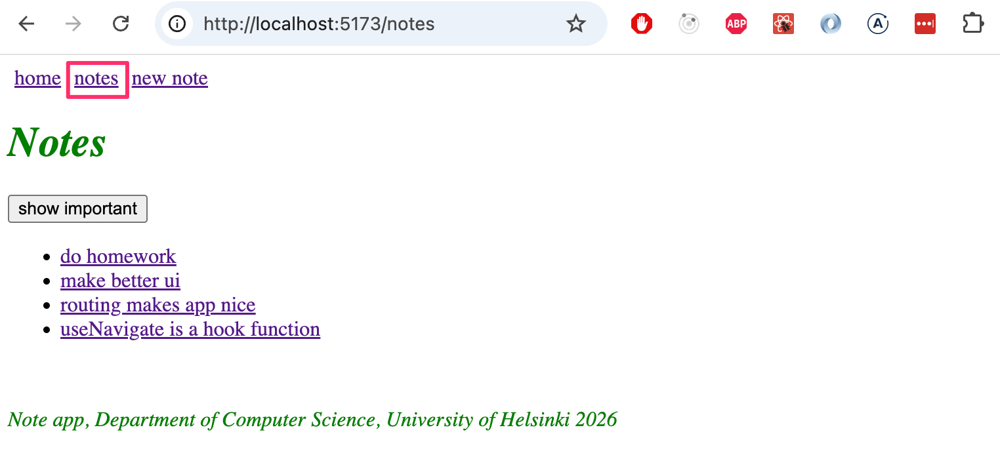

بالإضافة إلى صفحة لإنشاء الملاحظات:

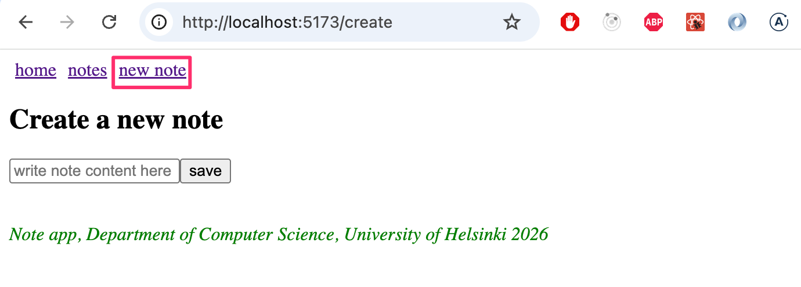

[في تطبيقات الويب التقليدية القديمة](/ar/part0/fundamentals_of_web_apps#traditional-web-applications)، كان التبديل بين الصفحات التي يعرضها التطبيق يتضمن إرسال المتصفح لطلب HTTP GET جديد إلى الخادم، ثم تصيير كود HTML الذي يرجعه الخادم، والذي يتوافق مع العرض الجديد.

أما في تطبيقات الصفحة الواحدة (Single Page Applications - SPAs)، فأنت في الواقع على نفس الصفحة طوال الوقت، وتقوم تعليمات جافاسكريبت البرمجية المنفذة في المتصفح بخلق انطباع بوجود "صفحات" مختلفة. وإذا تم إجراء طلبات HTTP عند تغيير العروض، فإنها تُستخدم فقط لجلب بيانات بتنسيق JSON قد تكون مطلوبة لعرض العرض الجديد.

سيكون من السهل تنفيذ تطبيق يحتوي على شريط تنقل وعروض متعددة باستخدام React، على سبيل المثال، من خلال جعل حالة التطبيق <i>page</i> تتذكر الصفحة التي يتواجد فيها المستخدم، وتصيير العرض الصحيح بناءً على ذلك:

```js
const App = () => {
  const [page, setPage] = useState('home')

 const  toPage = (page) => (event) => {
    event.preventDefault()
    setPage(page)
  }

  const content = () => {
    if (page === 'home') {
      return <Home />
    } else if (page === 'notes') {
      return <Notes />
    } else if (page === 'users') {
      return <Users />
    }
  }

  return (
    <div>
      <div>
        <a href="" onClick={toPage('home')} >
          home
        </a>
        <a href="" onClick={toPage('notes')}>
          notes
        </a>
        <a href="" onClick={toPage('users')} >
          users
        </a>
      </div>

      {content()}
    </div>
  )
}
```

ومع ذلك، فإن هذه الطريقة ليست مثالية: حيث يظل عنوان URL الخاص بموقع الويب كما هو حتى عندما تكون في عرض مختلف. يجب أن يكون لكل عرض عنوان URL خاص به، حتى يتمكن المستخدمون من وضع إشارات مرجعية (Bookmarks) للصفحات على سبيل المثال. علاوة على ذلك، لا يعمل زر الرجوع في المتصفح بشكل منطقي إذا لم يكن للصفحات عناوينها الخاصة؛ أي أن النقر فوق زر الرجوع لا ينقلك إلى العرض السابق للتطبيق ولكن إلى مكان آخر تماماً خارج التطبيق.

### مكتبة التوجيه React Router (React Router)

لحسن الحظ، تقدم مكتبة [React Router](https://reactrouter.com/) حلاً ممتازاً لإدارة التنقل والتوجيه في تطبيق React.

تثبيت React Router:

```bash
npm install react-router-dom
```

أنشئ مكوّناً جديداً ليكون بمثابة الصفحة الرئيسية للتطبيق:

```js
const Home = () => {
  return (
    <div>
      Lorem ipsum dolor sit amet, consectetur adipiscing elit, sed do eiusmod tempor incididunt ut labore et dolore magna aliqua. Ut enim ad minim veniam, quis nostrud exercitation ullamco laboris nisi ut aliquip ex ea commodo consequat. Duis aute irure dolor in reprehenderit in voluptate velit esse cillum dolore eu fugiat nulla pariatur. Excepteur sint occaecat cupidatat non proident, sunt in culpa qui officia deserunt mollit anim id est laborum.
    </div>
  )
}

export default Home
```

سنستخرج العرض الرئيسي السابق للتطبيق (الذي كان في المكوّن <i>App</i>) في مكوّن خاص به، لكننا ننقل إدارة حالة الملاحظات إلى خارج المكوّن:

```js
// يتم تمرير قائمة الملاحظات كمعامل
const NoteList = ({ notes }) => { // highlight-line
  // المحتوى مطابق في الغالب لما كان عليه في المكوّن App
  // تتم إزالة المرجع إلى NoteForm
}
```

يتغير المكوّن <i>App</i> الآن كما يلي:

```js
import { useState, useEffect } from 'react'
import noteService from './services/notes'

import {
  BrowserRouter as Router,
  Routes, Route, Link
} from 'react-router-dom'
import NoteList from './components/NoteList'
import Home from './components/Home'
import Footer from './components/Footer'
import NoteForm from './components/NoteForm'

const App = () => {
  const [notes, setNotes] = useState([])

  useEffect(() => {
    noteService.getAll().then(initialNotes => {
      setNotes(initialNotes)
    })
  }, [])

  const addNote = noteObject => {
    noteService.create(noteObject).then(returnedNote => {
      setNotes(notes.concat(returnedNote))
    })
  }

  const padding = {
    padding: 5
  }

  return (
    // highlight-start
    <Router>
      <div>
        <Link style={padding} to="/">home</Link>
        <Link style={padding} to="/notes">notes</Link>
        <Link style={padding} to="/create">new note</Link>
      </div>
        // highlight-end  

    // highlight-start
      <Routes>
        <Route path="/notes" element={
          <NoteList notes={notes} />
        } />
        <Route path="/create" element={
          <NoteForm createNote={addNote}/>
        } />
        <Route path="/" element={<Home />} />
      </Routes>

      <Footer />
    </Router>
    // highlight-end
  )
}

export default App
```

يتم تمكين التوجيه (Routing)، أي التصيير المشروط للمكونات بناءً على <i>URL</i> المتصفح، عن طريق وضع المكونات كعناصر فرعية لمكوّن [Router](https://reactrouter.com/api/declarative-routers/Router)، أي داخل وسوم <i>Router</i>.

أولاً، يتم تعريف شريط التنقل الخاص بالتطبيق باستخدام مكونات [Link](https://reactrouter.com/api/components/Link). تحدد السمة <i>to</i> كيفية تغيير عنوان URL للمتصفح عند النقر فوق الرابط:

```js
<div>
  <Link style={padding} to="/">home</Link>
  <Link style={padding} to="/notes">notes</Link>
  <Link style={padding} to="/create">new note</Link>
</div>
```

بعد ذلك، يتم تعريف توجيه التطبيق باستخدام مكوّن [Routes](https://reactrouter.com/api/components/Routes). داخل المكوّن، نستخدم [Route](https://reactrouter.com/api/components/Route) لتحديد مجموعة من القواعد والمكونات القابلة للتصيير المطابقة لها:

```js
<Routes>
  <Route path="/notes" element={
    <NoteList notes={notes} />
  } />
  <Route path="/create" element={
    <NoteForm createNote={addNote}/>
  } />
  <Route path="/" element={<Home />} />
</Routes>
```

إذا كنت في عنوان URL الجذري للتطبيق، فسيتم تصيير المكوّن <i>Home</i>:

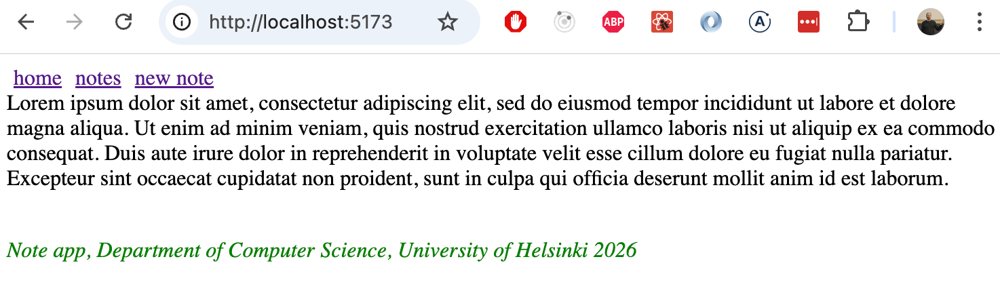

عند النقر فوق "notes" في شريط التنقل، يتغير العنوان في شريط عناوين المتصفح إلى <i>notes</i>، ويتم تصيير المكوّن <i>NoteList</i>:

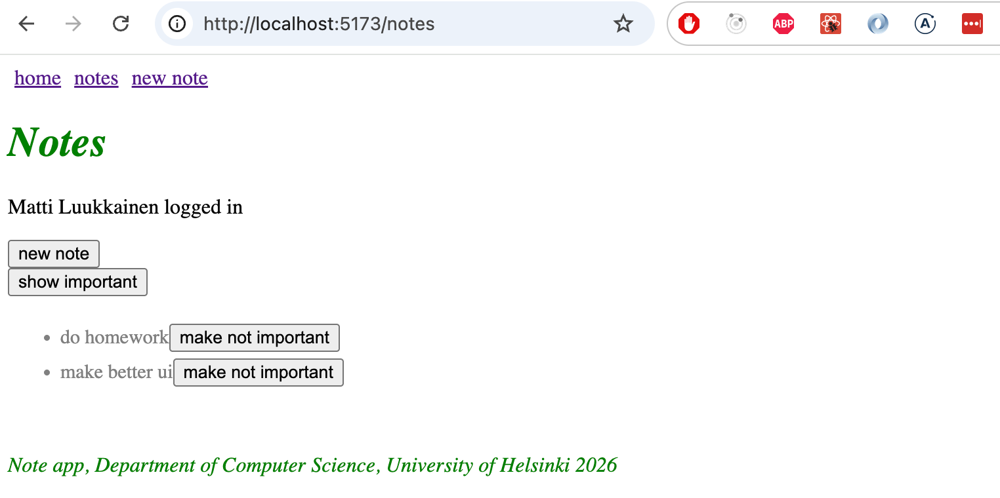

وبالمثل، عند النقر فوق "new note"، يصبح عنوان URL هو <i>create</i>، ويتم تصيير مكوّن <i>NoteForm</i>.

في صفحة الويب العادية، يؤدي تغيير العنوان في شريط عناوين المتصفح إلى إعادة تحميل الصفحة. ومع ذلك، عند استخدام React Router، لا يحدث هذا، وبدلاً من ذلك، تتم معالجة التوجيه بالكامل عبر جافاسكريبت على الواجهة الأمامية.

مكوّن Router الذي نستخدمه هو [BrowserRouter](https://reactrouter.com/en/main/router-components/browser-router):

```js
import {
  BrowserRouter as Router, // highlight-line
  Routes, Route, Link
} from 'react-router-dom'
```

وفقاً لـ [الوثائق الرسمية](https://reactrouter.com/en/main/router-components/browser-router):

> <i>BrowserRouter</i> هو <i>Router</i> يستخدم واجهة برمجة تطبيقات السجل في HTML5 (دوال pushState و replaceState وحدث popstate) للحفاظ على مزامنة واجهة المستخدم الخاصة بك مع عنوان URL.

يستخدم <i>BrowserRouter</i> [واجهة برمجة تطبيقات سجل HTML5 (HTML5 History API)](https://css-tricks.com/using-the-html5-history-api/) للسماح باستخدام عنوان URL في شريط عناوين المتصفح لـ "التوجيه" الداخلي داخل تطبيق React، مما يعني أنه حتى إذا تغير عنوان URL في شريط العناوين، يتم التلاعب بمحتوى الصفحة حصرياً عبر جافاسكريبت، ولا يقوم المتصفح بتحميل محتوى جديد من الخادم. ومع ذلك، فإن سلوك المتصفح فيما يتعلق بوظائف الرجوع والتقدم للأمام ووضع الإشارات المرجعية بديهي ويعمل تماماً كما هو الحال في مواقع الويب التقليدية.

الكود الحالي للتطبيق متاح بالكامل على [GitHub](https://github.com/fullstack-hy2020/part2-notes-frontend/tree/part5-10)، في الفرع <i>part5-10</i>.

### المسار المزوّد بمعاملات (Parameterized route)

دعنا ننقل تفاصيل الملاحظة الفردية إلى عرض خاص بها، والذي يمكن الوصول إليه بالنقر على اسم الملاحظة:

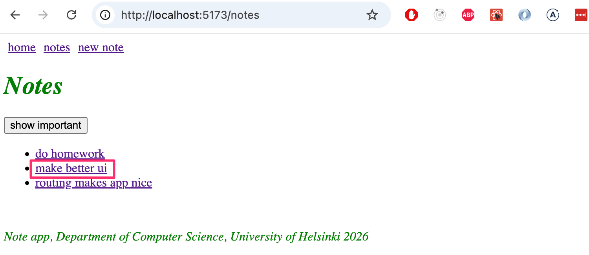

تم تنفيذ إمكانية النقر على الاسم في مكوّن <i>NoteList</i> كما يلي:

```js
import { Link } from 'react-router-dom' // highlight-line

const NoteList = ({ notes }) => {
  // ...

  return (
    <div>
      <h1>Notes</h1>
      <Notification message={errorMessage} />

      {!user && loginForm()}

      <div>
        <button onClick={() => setShowAll(!showAll)}>
          show {showAll ? 'important' : 'all'}
        </button>
      </div>
      <ul>
        {notesToShow.map(note => (
          <li key={note.id}>
            <Link to={`/notes/${note.id}`}>{note.content}</Link> // highlight-line
          </li>
        ))}
      </ul>
    </div>
  )
}

export default NoteList
```

لذلك يتم استخدام [Link](https://reactrouter.com/api/components/Link) مرة أخرى. على سبيل المثال، يؤدي النقر فوق اسم ملاحظة يكون <i>id</i> الخاص بها هو 12345 إلى تحديث عنوان URL للمتصفح إلى <i>notes/12345</i>.

يتم تعريف عنوان URL ذو المعاملات في التوجيه داخل المكوّن <i>App</i> كما يلي:

```js
<Router>
  // ...

  <Routes>
    // highlight-start
    <Route path="/notes/:id" element={
      <Note notes={notes} toggleImportanceOf={toggleImportanceOf} />
     } />
    // highlight-end
    <Route path="/notes" element={<Notes notes={notes} />} />   
    <Route path="/users" element={user ? <Users /> : <Navigate replace to="/login" />} />
    <Route path="/login" element={<Login onLogin={login} />} />
    <Route path="/" element={<Home />} />      
  </Routes>
</Router>
```

يتم تعريف المسار الذي يصيّر العرض لملاحظة واحدة بأسلوب "Express" عن طريق تمييز معامل المسار بالصيغة <i>:id</i> على النحو التالي:

```js
<Route path="/notes/:id" element={<Note notes={notes} ... />} />
```

عندما ينتقل المتصفح إلى عنوان URL الفريد لملاحظة ما، مثل <i>/notes/12345</i>، يتم تصيير المكوّن <i>Note</i>، والذي اضطررنا الآن إلى تعديله قليلاً:

```js
import { useParams } from 'react-router-dom' // highlight-line

const Note = ({ notes, toggleImportance }) => {
  // highlight-start
  const id = useParams().id
  const note = notes.find(n => n.id === id)
  // highlight-end

  const label = note.important ? 'make not important' : 'make important'

  return (
    <li className="note">
      <span>{note.content}</span>
      <button onClick={() => toggleImportance(id)}>{label}</button>
    </li>
  )
}

export default Note
```

على عكس ما كان عليه الحال سابقاً، يستقبل المكوّن <i>Note</i> الآن <i>جميع الملاحظات</i> عبر الخاصية <i>notes</i>، ويمكنه الوصول إلى الجزء الفريد من عنوان URL، وتحديداً <i>id</i> الملاحظة المراد عرضها، باستخدام دالة React Router المسماة [useParams](https://reactrouter.com/api/hooks/useParams).

### الخطاف useNavigate (useNavigate)

تدعم الواجهة الخلفية بالفعل حذف الملاحظات. لتنفيذ ذلك، دعنا نضيف زراً إلى صفحة الملاحظة الفردية في التطبيق:


دعنا نضيف معالجاً إلى المكوّن <i>App</i> يقوم بتنفيذ عملية الحذف، ونمرره إلى المكوّن <i>Note</i>:

```js
const App = () => {

  // highlight-start
  const deleteNote = (id) => {
    noteService.remove(id).then(() => {
      setNotes(notes.filter(n => n.id !== id))
    })
  }
  // highlight-end

  return (
      // ...

      <Routes>
        <Route path="/notes/:id" element={
          <Note 
            notes={notes}
            toggleImportanceOf={toggleImportanceOf}
            deleteNote={deleteNote} // highlight-line
          />
        } />
        <Route path="/notes" element={
          <NoteList notes={notes} />
        } />
        <Route path="/create" element={
          <NoteForm createNote={addNote}/>
        } />
        <Route path="/" element={<Home />} />
      </Routes>

      <Footer />
    </Router>
  )
}  
```

يتغير المكوّن <i>Note</i> كما يلي:

```js
import { useParams, useNavigate } from 'react-router-dom'

const Note = ({ notes, toggleImportanceOf, deleteNote }) => { // highlight-line
  const id = useParams().id
  const navigate = useNavigate()  // highlight-line
  const note = notes.find(n => n.id === id)

  const label = note.important ? 'make not important' : 'make important'

// highlight-start
  const handleDelete = () => {
    if (window.confirm(`Delete note "${note.content}"?`)) {
      deleteNote(id)
      navigate('/notes')
    }
  }
  // highlight-end

  return (
    <li className="note">
      <span>{note.content}</span>
      <button onClick={() => toggleImportanceOf(id)}>{label}</button>
      <button onClick={handleDelete}>delete</button>  // highlight-line
    </li>
  )
}

export default Note
```

عند حذف ملاحظة، يتم توجيه المستخدم مرة أخرى إلى الصفحة التي تسرد جميع الملاحظات. يتم ذلك عن طريق استدعاء الدالة التي يرجعها [useNavigate](https://reactrouter.com/api/components/Navigate) في React Router بعنوان URL المطلوب: <i>navigate('/notes')</i>.

الدالتان [useParams](https://reactrouter.com/api/hooks/useParams) و [useNavigate](https://reactrouter.com/api/components/Navigate) من مكتبة React Router هما دالتا خطافات (Hook Functions)، تماماً مثل useState و useEffect اللتين استخدمناهما عدة مرات. وكما نتذكر من الجزء 1، هناك [قواعد محددة للخطافات](/ar/part1/a_more_complex_state_debugging_react_apps#rules-of-hooks) ترتبط باستخدام دوال الخطافات.

دعنا نعدل أيضاً مكوّن <i>NoteForm</i> بحيث بعد إضافة ملاحظة جديدة، يتم توجيه المستخدم إلى الصفحة التي تحتوي على جميع الملاحظات:

```js
import { useState } from 'react' 
import { useNavigate } from 'react-router-dom' // highlight-line

const NoteForm = ({ createNote }) => {
  const [newNote, setNewNote] = useState('')
  const navigate = useNavigate() // highlight-line

  const addNote = event => {
    event.preventDefault()
    createNote({
      content: newNote,
      important: true
    })

    navigate('/notes') // highlight-line
    setNewNote('')
  }

  return (
    <div>
      <h2>Create a new note</h2>

      <form onSubmit={addNote}>
        <input
          value={newNote}
          onChange={event => setNewNote(event.target.value)}
          placeholder="write note content here"
        />
        <button type="submit">save</button>
      </form>
    </div>
  )
}
```

### مراجعة المسارات المزودة بمعاملات (Parameterized Route Revisited)

هناك مشكلة مزعجة بعض الشيء في التطبيق. يستقبل مكوّن _Note_ <i>جميع الملاحظات</i> كخاصية (prop)، على الرغم من أنه يعرض فقط الملاحظة التي يتطابق <i>id</i> الخاص بها مع الجزء المزوّد بالمعاملات في عنوان URL:

```js
const Note = ({ notes, toggleImportance }) => { 
  const id = useParams().id
  const note = notes.find(n => n.id === Number(id))
  // ...
}
```

هل سيكون من الممكن تعديل التطبيق بحيث يستقبل _Note_ فقط الملاحظة المراد عرضها كخاصية:

```js
import { useParams, useNavigate } from 'react-router-dom'

const Note = ({ note, id, toggleImportanceOf, deleteNote }) => {  // highlight-line
  const id = useParams().id
  const navigate = useNavigate()

  // ...

  return (
    <li className="note">
      <span>{note.content}</span>
      <button onClick={() => toggleImportanceOf(id)}>{label}</button>
      <button onClick={handleDelete}>delete</button>
    </li>
  )
}

export default Note
```

تتمثل إحدى الطرق في تحديد <i>id</i> الملاحظة المراد عرضها داخل المكوّن باستخدام دالة الخطاف [useMatch](https://reactrouter.com/api/hooks/useMatch) من React Router.

لا يمكن استخدام خطاف <i>useMatch</i> في نفس المكوّن الذي يحدد الجزء القابل للتوجيه من التطبيق. دعنا ننقل مكوّن <i>Router</i> خارج <i>App</i>:

```js
ReactDOM.createRoot(document.getElementById('root')).render(
  <Router> // highlight-line
    <App />
  </Router> // highlight-line
)
```

يصبح المكوّن <i>App</i>:

```js
import {
  // ...
  useMatch  // highlight-line
} from 'react-router-dom'

const App = () => {
  // ...

 // highlight-start
  const match = useMatch('/notes/:id')

  const note = match
    ? notes.find(note => note.id === match.params.id)
    : null
  // highlight-end

  return (
    <div>
      <div>
        <Link style={padding} to="/">home</Link>
        // ...
      </div>

      <Routes>
        <Route path="/notes/:id" element={
          <Note
            note={note} // highlight-line
            toggleImportanceOf={toggleImportanceOf}
            deleteNote={deleteNote}
          />
        } />
        <Route path="/notes" element={
          <NoteList notes={notes} />
        } />
        <Route path="/create" element={
          <NoteForm createNote={addNote}/>
        } />
        <Route path="/" element={<Home />} />
      </Routes>

      <div>
        <em>Note app, Department of Computer Science 2026</em>
      </div>
    </div>
  )
}    
```

في كل مرة يتم فيها تصيير المكوّن <i>App</i> (والذي يحدث عملياً كلما تغير عنوان URL في شريط عناوين المتصفح)، يتم تنفيذ الأمر التالي:

```js
const match = useMatch('/notes/:id')
```

إذا كان عنوان URL بالصيغة _/notes/:id_، أي يطابق عنوان URL لملاحظة واحدة، فسيتم تعيين كائن للمتغير <i>match</i> يمكن استخدامه لتحديد الجزء المزوّد بالمعاملات في المسار، أي <i>id</i> الملاحظة. يتيح لنا هذا استرداد الملاحظة المراد تصييرها:

```js
const note = match 
  ? notes.find(note => note.id === match.params.id)
  : null
```

لا يزال هناك خطأ برمجي صغير في تطبيقنا. إذا تمت إعادة تحميل المتصفح على صفحة ملاحظة فردية، فسيحدث خطأ:


تنشأ المشكلة لأن هناك محاولة لتصيير الصفحة قبل جلب الملاحظات من الواجهة الخلفية. يمكننا حل هذه المشكلة بالتصيير المشروط:

```js
const Note = ({ note, toggleImportanceOf, deleteNote }) => {
  const id = useParams().id
  const navigate = useNavigate()

// highlight-start
  if(!note) {
    return null
  }
  // highlight-end

  return (
    //...
  )
}
```

يحتوي التطبيق على ميزة مزعجة أخرى: منطق تسجيل الدخول لا يزال موجوداً بالكامل في الصفحة التي تسرد الملاحظات. ومع ذلك، سنترك الوظائف في هذه الحالة غير المكتملة نوعاً ما في الوقت الحالي.

الكود الحالي للتطبيق متاح بالكامل على [GitHub](https://github.com/fullstack-hy2020/part2-notes-frontend/tree/part5-11)، في الفرع <i>part5-11</i>.

</div>

<div class="tasks">

### التمارين 5.24–5.28.

#### 5.24: توجيه المدونات، الخطوة 1

أضف React Router إلى تطبيق المدونات بحيث يسمح النقر فوق الروابط في شريط التنقل بالتحكم في العرض المعروض.

في جذر التطبيق، أي المسار _/_، يتم عرض قائمة بجميع المدونات:


يتيح المسار _/login_ للمستخدمين تسجيل الدخول:


إذا كان المستخدم مسجلاً للدخول، يظهر زر تسجيل الخروج في شريط التنقل:


بعد تسجيل الدخول والخروج، يجب توجيه المستخدم إلى الصفحة التي تسرد جميع المدونات.

في هذه المرحلة، لا داعي للقلق بشأن إنشاء المدونات بعد.

#### 5.25: توجيه المدونات، الخطوة 2

نفّذ عرضاً في التطبيق يعرض معلومات منشور مدونة فردي:

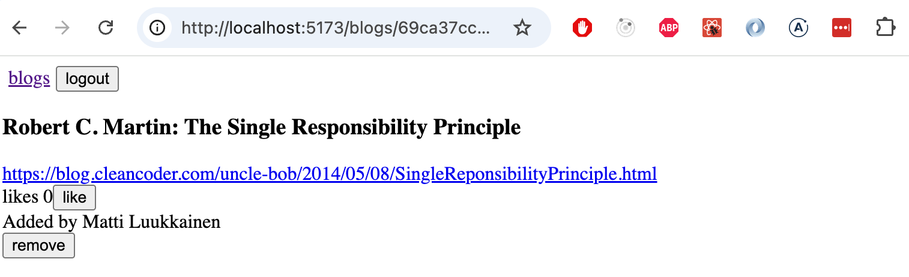

ينتقل المستخدمون إلى عرض منشور المدونة الفردي من قائمة المدونات:


تأكد من أن ميزة "الإعجاب (Like)" بالمدونات لا تزال تعمل! وقم أيضاً بتعديل الوظيفة بحيث يمكن للمستخدمين المسجلين فقط "الإعجاب" بالمدونة.

#### 5.26: توجيه المدونات، الخطوة 3

أنشئ عرضاً جديداً لإنشاء مدونة جديدة، والذي يمكن للمستخدمين المسجلين دخلوهم الوصول إليه عبر شريط التنقل:


يجب أن تؤدي إضافة مدونة جديدة وحذف مدونة موجودة إلى إعادة توجيه المستخدم إلى عرض جميع المدونات.

#### 5.27: توجيه المدونات، الخطوة 4

أصبحت قابلية استخدام التطبيق ومظهره أفضل من ذي قبل. لسوء الحظ، تعطلت بعض الاختبارات.

قم الآن بتعديل اختبارات عرض المدونة الفردية المنشأة في Vitest كما يلي:
- يتم عرض معلومات المدونة وعدد الإعجابات للمستخدمين غير المصادق عليهم، ولا يتم عرض الأزرار.
- يظهر للمستخدمين المصادق عليهم والذين ليسوا هم منشئي المدونة زر الإعجاب فقط.
- يظهر لمنشئ المدونة زر الحذف أيضاً.

#### 5.28: توجيه المدونات، الخطوة 5

الخطوة التالية هي إصلاح الاختبارات الشاملة (E2E) المنشأة باستخدام Playwright. الاختبارات التي كتبناها سابقاً معطلة تماماً، وسيتعين علينا إجراء تغييرات كبيرة عليها.

أنشئ اختبارات للسيناريوهات التالية:
- ينجح تسجيل الدخول مع التركيبة الصحيحة لاسم المستخدم/كلمة المرور.
- يفشل تسجيل الدخول إذا كان اسم المستخدم/كلمة المرور غير صحيحين.
- يمكن للمستخدم المسجل دخوله إنشاء مدونة.
- يمكن للمستخدم المسجل دخوله الإعجاب بالمدونات.
- يمكن للمستخدم المسجل دخوله حذف مدونة.

لذلك، لا يتم اختبار فرز المدونات حسب الإعجابات في الوقت الحالي.

</div>

<div class="content">

### مكتبات واجهة المستخدم (UI libraries)

في الجزء 2، نظرنا بالفعل في طريقتين لإضافة الأنماط والتنسيقات: ملف [CSS الفردي](/ar/part2/adding_styles_to_react_app) التقليدي والتنسيقات [المضمنة (Inline styles)](/ar/part2/adding_styles_to_react_app#inline-styles). في هذا القسم، سنلقي نظرة على بعض الطرق الإضافية.

أحد الأساليب لتحديد أنماط التطبيق هو استخدام "إطار عمل واجهة المستخدم (UI Framework)"، أو بعبارة أخرى، مكتبة أنماط واجهة المستخدم.

كان أول إطار عمل لواجهة المستخدم يكتسب شعبية واسعة هو [Bootstrap](https://getbootstrap.com/)، الذي طورته تويتر. خلال السنوات القليلة الماضية، ظهرت أطر عمل واجهة المستخدم كالفطر بعد المطر. التشكيلة واسعة جداً لدرجة أنه لا فائدة حتى من محاولة وضع قائمة شاملة بها هنا.

تتضمن العديد من أطر عمل واجهة المستخدم سمات محددة مسبقاً لتطبيقات الويب بالإضافة إلى "مكونات"، مثل الأزرار والقوائم والجداول. كُتب مصطلح "المكونات" بين علامات اقتباس أعلاه لأنه لا يشير تماماً إلى نفس الشيء مثل مكوّن React. في أغلب الأحيان، يتم استخدام أطر عمل واجهة المستخدم عن طريق تضمين أوراق أنماط CSS وأكواد جافاسكريبت الخاصة بإطار العمل في التطبيق.

تم تكييف العديد من أطر عمل واجهة المستخدم في إصدارات متوافقة مع React، حيث تم تحويل "المكونات" المحددة بواسطة إطار عمل واجهة المستخدم إلى مكونات React حقيقية. على سبيل المثال، هناك نسختان من Bootstrap لـ React، وأكثرها شعبية هي [React-Bootstrap](https://react-bootstrap.github.io/).

بدلاً من Bootstrap، دعنا نلقي نظرة تالياً على ما يُعد ربما أشهر إطار عمل لواجهة المستخدم في الوقت الحالي: مكتبة React المسماة [MaterialUI](https://mui.com/)، والتي تطبق لغة تصميم [Material Design](https://material.io/) من Google.

دعنا نثبت المكتبة:

```bash
npm install @mui/material @emotion/react @emotion/styled
```

عند استخدام MaterialUI، عادةً ما يتم تصيير محتوى التطبيق بالكامل داخل مكوّن [Container](https://material-ui.com/components/container/):

```js
import { Container } from '@mui/material'

const App = () => {
  // ...
  return (
    <Container>
      // ...
    </Container>
  )
}
```

#### الجدول (Table)

لنبدأ بمكوّن <i>NoteList</i> ونصيّر قائمة الملاحظات كـ [جدول (Table)](https://mui.com/material-ui/react-table/#simple-table)، والذي يعرض أيضاً المستخدم الذي أنشأ كل ملاحظة:

```js
import { useState, useEffect } from 'react'

import { Table, TableBody, TableCell, TableContainer, TableHead, TableRow, Paper } from '@mui/material'

//...

const NoteList = ({ notes }) => {

  // ...

  return (
    <div>
      // ...
      <h2>Notes</h2>

      <TableContainer component={Paper}>
        <Table>
          <TableHead>
            <TableRow>
              <TableCell>content</TableCell>
              <TableCell>user</TableCell>
              <TableCell>important</TableCell>
            </TableRow>
          </TableHead>
          <TableBody>
            {notes.map(note => (
              <TableRow key={note.id}>
                <TableCell>
                  <Link to={`/notes/${note.id}`}>
                    {note.content}
                  </Link>
                </TableCell>
                <TableCell>
                  {note.user.name}
                </TableCell>
                <TableCell>
                  {note.important ? 'yes': ''}
                </TableCell>
              </TableRow>
            ))}
          </TableBody>
        </Table>
      </TableContainer>

    </div>
  )
}

export default NoteList
```

يبدو الجدول كما يلي:


#### النموذج (Form)

بعد ذلك، دعنا نحسن العرض لإنشاء ملاحظة جديدة <i>NoteForm</i> باستخدام مكوني [TextField](https://mui.com/components/text-fields/) و [Button](https://mui.com/api/button/):

```js 
import { TextField, Button } from '@mui/material'

// ...

const NoteForm = ({ createNote }) => {
  // ...

  return (
    <div>
      <h2>Create a new note</h2>

      <form onSubmit={addNote}>
        <TextField
          label="note content"
          value={newNote}
          onChange={event => setNewNote(event.target.value)}
        />
        <div>
          <Button type="submit" variant="contained" style={{ marginTop: 10 }}>
            save
          </Button>
        </div>
      </form>
    </div>
  )
}

export default NoteForm
```

النتيجة أنيقة وجذابة:

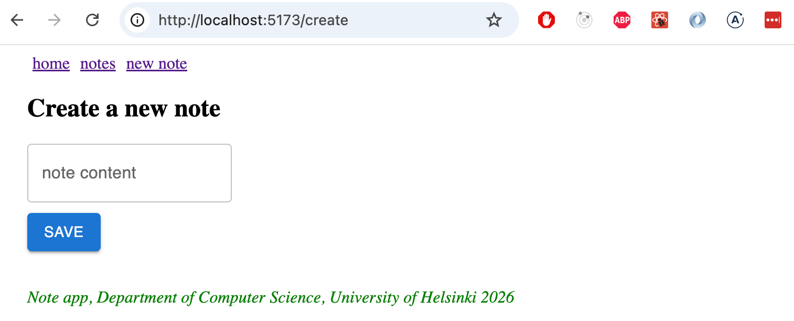

#### الإشعارات (Notifications)

دعنا نحسن مكوّن الإشعارات في التطبيق باستخدام مكوّن [Alert](https://mui.com/components/alert/) من MaterialUI:

```js
import { Alert } from '@mui/material'

const Notification = ({ notification }) => {
  if (notification === null) {
    return null
  }

  return (
    <Alert style={{ marginTop: 10, marginBottom: 10 }} severity={notification.type}>
      {notification.text}
    </Alert>
  )
}

export default Notification
```

انقل مكوّن الإشعارات وإدارة حالته إلى المكوّن <i>App</i>:

```js
const App = () => {
  const [notes, setNotes] = useState([])
  const [notification, setNotification] = useState(null) // highlight-line

  // ...

  const addNote = noteObject => {
    noteService.create(noteObject).then(returnedNote => {
      setNotes(notes.concat(returnedNote))
      setNotification({ text: `Note '${returnedNote.content}' added!`, type: 'success' }) // highlight-line
      setTimeout(() => {
        setNotification(null)
      }, 5000)
    })
  }

  return (
    <Container>
      <div>
        <Link style={padding} to="/">home</Link>
        <Link style={padding} to="/notes">notes</Link>
        <Link style={padding} to="/create">new note</Link>
      </div>

      <Notification notification={notification} /> // highlight-line

      <Routes>
        <Route path="/notes/:id" element={
          <Note
            note={note}
            toggleImportanceOf={toggleImportanceOf}
            deleteNote={deleteNote}
          />
        } />
        <Route path="/notes" element={
          <NoteList notes={notes} setNotification={setNotification} />
        } />
        <Route path="/create" element={
          <NoteForm createNote={addNote} />
        } />
        <Route path="/" element={<Home />} />
      </Routes>

      <Footer />
    </Container>
  )
}
```

يتمتع Alert بتصميم أنيق:

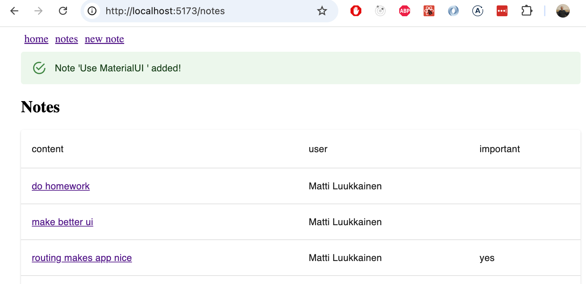

#### قائمة التنقل (Navigation Menu)

يتم تنفيذ قائمة التنقل باستخدام مكوّن [AppBar](https://mui.com/components/app-bar/).

إذا طبقنا المثال من التوثيق مباشرة:

```js
<AppBar position="static">
  <Toolbar>
    <Button color="inherit"><Link to="/">home</Link></Button>
    <Button color="inherit"><Link to="/notes">notes</Link></Button>
    <Button color="inherit"><Link to="/create">new note</Link></Button>
  </Toolbar>
</AppBar>
```

يوفر هذا حلاً فعالاً، لكن مظهره ليس الأفضل على الإطلاق:


من خلال تصفح [الوثائق الرسمية](https://mui.com/material-ui/guides/composition/#routing-libraries)، ستجد طريقة أفضل: خاصية [component prop](https://mui.com/material-ui/guides/composition/#component-prop)، والتي تسمح لك بتغيير كيفية تصيير العنصر الجذري لمكوّن MaterialUI.

بتحديد:

```js
<Button color="inherit" component={Link} to="/">
  home
</Button>
```

يتم تصيير مكوّن <i>Button</i> بحيث يكون مكونه الجذري هو مكوّن <i>Link</i> من مكتبة <i>react-router-dom</i>، والذي يتم تمرير الخاصية <i>to</i> إليه، والتي تحدد المسار.

الكود الكامل لشريط التنقل هو كالتالي:

```js
<AppBar position="static">
  <Toolbar>
    <Button color="inherit" component={Link} to="/">home</Button>
    <Button color="inherit" component={Link} to="/notes">notes</Button>
    <Button color="inherit" component={Link} to="/create">new note</Button>
  </Toolbar>
</AppBar>
```

والنتيجة تبدو تماماً كما نريد:


ومع ذلك، نلاحظ أنه عند تحريك الفأرة فوق شريط التنقل، يكون مؤشر التحويم خافتاً للغاية. دعنا نصلح ذلك من خلال تحديد لون خلفية أفضل قليلاً لهذه الحالات:

```js
const style = { '&:hover': { bgcolor: 'rgba(255,255,255,0.3)' } }

return (
  <Container>
    <AppBar position="static">
      <Toolbar>
        <Button color="inherit" component={Link} to="/" sx={style}>
          home
        </Button>
        <Button color="inherit" component={Link} to="/notes" sx={style}>
          notes
        </Button>
        <Button color="inherit" component={Link} to="/create" sx={style}>
          new note
        </Button>
      </Toolbar>
    </AppBar>

    // ...
)
```

أصبحنا راضين أخيراً:

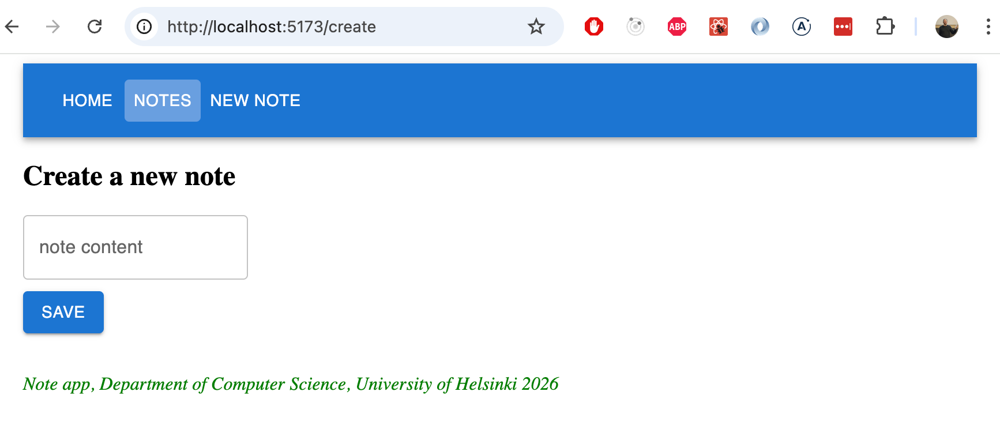

الكود الحالي للتطبيق متاح بالكامل على [GitHub](https://github.com/fullstack-hy2020/part2-notes-frontend/tree/part5-12)، في الفرع <i>part5-12</i>.

### المكونات ذات التنسيق المخصص (Styled Components)

بالإضافة إلى ما رأيناه بالفعل، هناك [طرق أخرى](https://blog.bitsrc.io/5-ways-to-style-react-components-in-2019-30f1ccc2b5b) لتطبيق الأنماط على تطبيق React.

تقدم مكتبة [styled-components](https://www.styled-components.com/)، التي تستخدم صيغة [قوالب السلاسل النصية الموسومة (Tagged Template Literals)](https://developer.mozilla.org/en-US/docs/Web/JavaScript/Reference/Template_literals) في ES6، نهجاً مثيراً للاهتمام لتحديد التنسيقات.

دعنا [نثبت](https://styled-components.com/docs/basics#installation) styled-components ونستخدمها لإجراء بعض التغييرات الأسلوبية على تطبيق الملاحظات (الإصدار السابق لتثبيت MaterialUI). أولاً، دعنا ننشئ تعريفين للنمط للمكونات التي سنستخدمها:

```js
import styled from 'styled-components'

const Button = styled.button`
  background: Bisque;
  font-size: 1em;
  margin: 1em;
  padding: 0.25em 1em;
  border: 2px solid Chocolate;
  border-radius: 3px;
`

const Input = styled.input`
  margin: 0.25em;
  width: 300px;  
`
```

ينشئ الكود إصدارات منسقة من عنصري HTML وهما <i>button</i> و <i>input</i>، ويسندها إلى المتغيرين <i>Button</i> و <i>Input</i>.

صيغة تعريف الأنماط مثيرة للاهتمام للغاية، حيث يتم وضع تعريفات CSS داخل علامات الاقتباس المائلة (Backticks). هذه هي صيغة [قوالب السلاسل النصية الموسومة (Tagged Template Literals)](https://developer.mozilla.org/en-US/docs/Web/JavaScript/Reference/Template_literals) في ES6.

تعمل المكونات المحددة مثل عناصر <i>button</i> و <i>input</i> العادية، وتُستخدم في التطبيق بالطريقة المعتادة:

```js
const NoteForm = ({ createNote }) => {
  // ...

  return (
    <div>
      <h2>Create a new note</h2>

      <form onSubmit={addNote}>
        <Input> // highlight-line
          value={newNote}
          onChange={event => setNewNote(event.target.value)}
          placeholder="write note content here"
        />
        <Button type="submit">save</Button> // highlight-line
      </form>
    </div>
  )
}
```

يبدو النموذج الآن هكذا:


دعنا نحدد المكونات التالية لإضافة أنماط، وكلها إصدارات محسنة من عناصر <i>div</i>:

```js
const Page = styled.div`
  padding: 1em;
  background: papayawhip;
`

const Navigation = styled.div`
  background: BurlyWood;
  padding: 1em;
`

const Footer = styled.div`
  background: Chocolate;
  padding: 1em;
  margin-top: 1em;
`
```

يمكن الآن استخدام المكونات الجديدة في التطبيق:

```js
const App = () => {
  // ...

  return (
    <Page> // highlight-line
      <Navigation> // highlight-line
        <Link style={padding} to="/">home</Link>
        <Link style={padding} to="/notes">notes</Link>
        <Link style={padding} to="/create">new note</Link>
      </Navigation> // highlight-line

      <Routes>
        <Route path="/notes/:id" element={
          <Note
            note={note}
            toggleImportanceOf={toggleImportanceOf}
            deleteNote={deleteNote}
          />
        } />
        <Route path="/notes" element={
          <NoteList notes={notes} />
        } />
        <Route path="/create" element={
          <NoteForm createNote={addNote}/>
        } />
        <Route path="/" element={<Home />} />
      </Routes>
// highlight-start
      <Footer>
         Note app, Department of Computer Science, University of Helsinki 2026
      </Footer>
    </Page>
    // highlight-end
  )
}
```

النتيجة النهائية هي كالتالي:

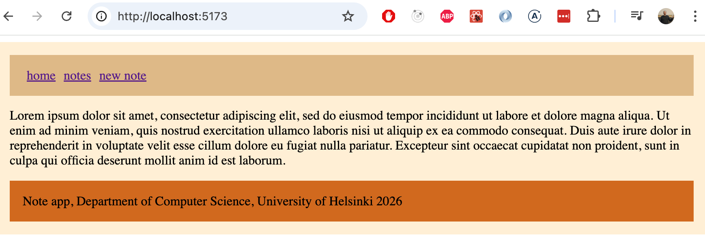

تكتسب Styled-Components شعبية متزايدة بشكل مطرد، ويبدو حالياً أن العديد من المطورين يعتبرونها أفضل طريقة لتحديد الأنماط لتطبيقات React.

</div>

<div class="tasks">

### التمارين 5.29–5.31

بعد ذلك، قم بتحسين أنماط تطبيق المدونة باستخدام MaterialUI أو Styled Components.

#### 5.29: تزيين المدونات، الخطوة 1

أضف أنماطاً وتنسيقات إلى نماذج التطبيق.

قد يبدو حلك شيئاً من هذا القبيل. نموذج تسجيل الدخول:


إنشاء مدونة جديدة:

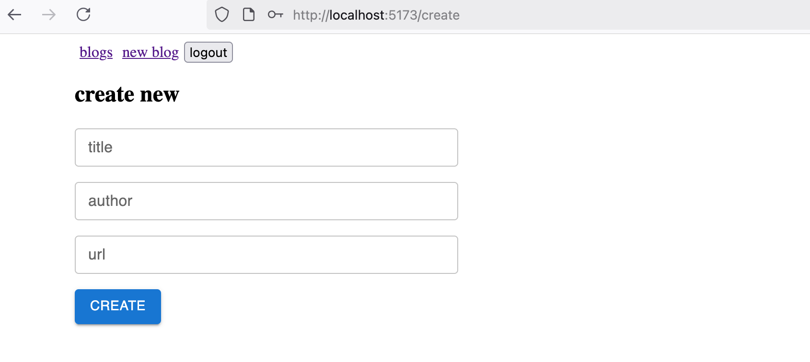

#### 5.30: تزيين المدونات، الخطوة 2

قم الآن بتنسيق شريط التنقل في التطبيق والمكوّن الذي يعرض الإشعارات. قد تبدو النتيجة شيئاً مثل هذا:

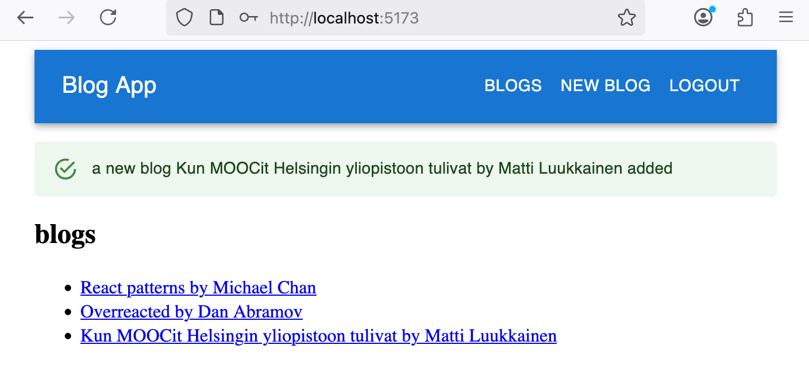

#### 5.31: تزيين المدونات، الخطوة 3

قم بتخصيص مظهر مكوّن عرض المدونة الفردية كما تراه مناسباً. هنا مثال:

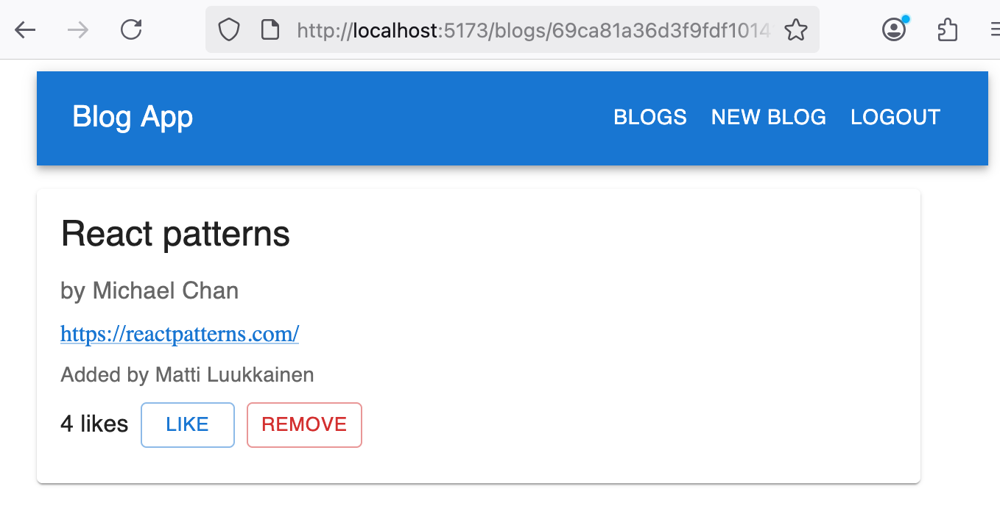

كان هذا التمرين الأخير في هذا القسم، وحان الوقت لدفع الكود إلى GitHub وتحديد التمارين المكتملة في [نظام تسليم التمارين](https://studies.cs.helsinki.fi/stats/courses/fullstackopen).

</div>
