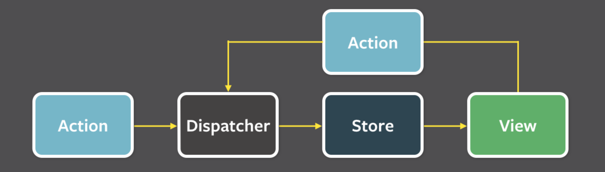
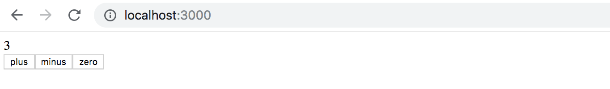
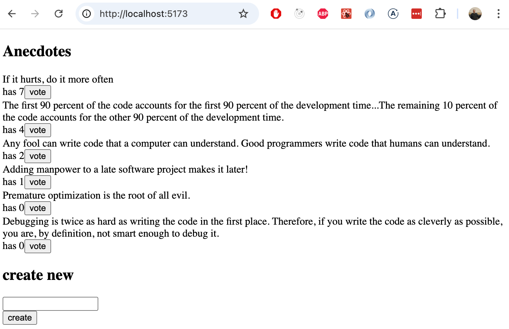

<div class="content">

لقد اتبعنا ممارسة React الموصى بها لإدارة حالة التطبيق من خلال تعريف الحالة التي تحتاجها مكونات متعددة والدوال التي تتعامل معها في المكونات [عالية المستوى](https://reactjs.org/docs/lifting-state-up.html) في التسلسل الهرمي للمكونات. يتم عادةً تعريف معظم الحالة والدوال التي تتعامل معها مباشرة في المكوّن الجذري (Root component) وتمريرها عبر الخصائص (Props) إلى المكونات التي تحتاج إليها. يعمل هذا النهج بشكل جيد إلى حد معين، ولكن مع نمو التطبيق وزيادة تعقيده، تصبح إدارة الحالة تحدياً كبيراً ومرهقاً.

### معمارية فلكس (Flux architecture)

طوّرت شركة Facebook معمارية [Flux](https://facebookarchive.github.io/flux/docs/in-depth-overview) في الأيام الأولى لتاريخ React للتخفيف من مشاكل إدارة الحالة. في Flux، يتم فصل إدارة حالة التطبيق تماماً في <i>مخازن (Stores)</i> خارجية خارج مكونات React. لا يتم تغيير الحالة في المخزن مباشرة، بل من خلال <i>إجراءات (Actions)</i> محددة يتم إنشاؤها لهذا الغرض.

عندما يغير إجراء ما حالة المخزن، تتم إعادة تصيير العروض (Views):


إذا أدى استخدام التطبيق (مثل الضغط على زر) إلى الحاجة إلى تغيير الحالة، يتم إجراء التغيير من خلال إجراء (Action). وهذا بدوره يؤدي إلى إعادة تصيير العرض:



وبالتالي، توفر Flux طريقة قياسية لكيفية ومكان الاحتفاظ بحالة التطبيق ولإجراء التغييرات عليها.

### مكتبة ريدكس (Redux)

كانت [Redux](https://redux.js.org)، التي تتبع معمارية Flux، الحل المهيمن لإدارة الحالة لتطبيقات React لما يقرب من عقد من الزمان. وفي هذه الدورة التدريبية، تم استخدام Redux أيضاً حتى ربيع عام 2026. ومع ذلك، لطالما عانت Redux من التعقيد والكمية الكبيرة من الشيفرات البرمجية النمطية المتكررة (Boilerplate code). تحسن الوضع بشكل ملحوظ مع تقديم [Redux Toolkit](https://redux-toolkit.js.org/)، ولكن على الرغم من ذلك، واصل مجتمع المطورين تطوير حلول بديلة لإدارة الحالة، مثل [MobX](https://mobx.js.org/) و [Recoil](https://recoiljs.org/) و [Jotai](https://www.npmjs.com/package/jotai). وقد تباينت شعبيتها عبر السنين.

الحل الأكثر إثارة للاهتمام، وبلا شك الأكثر شعبية بين الوافدين الجدد، هو [Zustand](https://zustand.docs.pmnd.rs/)، وهو أيضاً خيارنا المعتمد لحل إدارة الحالة في هذه الدورة. يبدو أن Zustand قد لحقت بالفعل بـ Redux من حيث الشعبية:


### مكتبة زوستاند (Zustand)

دعنا نتعرف على Zustand من خلال تنفيذ تطبيق العداد (Counter Application) مرة أخرى:



أنشئ تطبيق Vite جديد وقم بتثبيت <i>Zustand</i>:

```bash
npm install zustand
```

الإصدار الأول، حيث تعمل فقط زيادة العداد، هو كما يلي:

```js
import { create } from 'zustand'

const useCounterStore = create(set => ({
  counter: 0,
  increment: () => set(state => ({ counter: state.counter + 1 })),
}))

const App = () => {
  const counter = useCounterStore(state => state.counter)
  const increment = useCounterStore(state => state.increment)

  return (
    <div>
      <div>{counter}</div>
      <div>
        <button onClick={increment}>plus</button>
        <button>minus</button>
        <button>zero</button>
      </div>
      
    </div>
  )
}
```

يبدأ التطبيق بإنشاء <i>المخزن (Store)</i>، أي الحالة العامة، باستخدام دالة [create](https://zustand.docs.pmnd.rs/reference/apis/create) الخاصة بـ Zustand:

```js
import { create } from 'zustand'

const useCounterStore = create(set => ({
  counter: 0,
  increment: () => set(state => ({ counter: state.counter + 1 })),
}))
```

تستقبل الدالة كمعامل <i>دالة</i> تُرجع الحالة المراد تعريفها للتطبيق. المعامل هو بالتالي التالي:

```js
set => ({
  counter: 0,
  increment: () => set(state => ({ counter: state.counter + 1 })),
})
```

وبالتالي، تحتوي الحالة على <i>counter</i> محدد بقيمة صفرية، و <i>increment</i> وهي دالة.

يمكن لمكونات التطبيق الوصول إلى القيم والدوال المحددة في الحالة من خلال دالة <i>useCounterStore</i> المعرفة باستخدام <i>create</i> من Zustand. يستخدم المكوّن <i>App</i> <i>المحددات (Selectors)</i> لاسترداد قيمة <i>counter</i> ودالة <i>increment</i> من الحالة:

```js
const App = () => {
  // highlight-start
  // استخدام المحدد لاختيار الجزء الصحيح من حالة المخزن
  const counter = useCounterStore(state => state.counter)
  const increment = useCounterStore(state => state.increment)
  // highlight-end

  return (
    <div>
      <div>{counter}</div> // highlight-line
      <div>
        <button onClick={increment}>plus</button>  // highlight-line
        <button>minus</button>
        <button>zero</button>
      </div>
      
    </div>
  )
}
```

يقوم الكود بتخزين قيمة العداد من المخزن في متغير على النحو التالي:

```js
const counter = useCounterStore(state => state.counter)
```

يتم استخدام دالة محدد (Selector function) <i>state => state.counter</i>، والتي تحدد ما يتم إرجاعه من محتويات المخزن. وبنفس الطريقة، يتم استرداد الدالة المخزنة في المخزن في المتغير <i>increment</i>.

يتم تمرير دالة الحالة <i>increment</i>، التي تم تعريفها على النحو التالي، كمعالج للنقر على زر "plus":

```js
const useCounterStore = create(set => ({
  counter: 0,
  increment: () => set(state => ({ counter: state.counter + 1 })), // highlight-line
}))
```

دعنا ننظر إلى تعريف الدالة بشكل منفصل:

```js
() => set(state => ({ counter: state.counter + 1 }))
```

هذه دالة تستدعي دالة [set](https://zustand.docs.pmnd.rs/learn/guides/updating-state) ممررة دالة أخرى كمعامل. تحدد هذه الدالة الممررة كمعامل كيفية تغير الحالة:

```js
state => ({ counter: state.counter + 1 })
```

وهي اختصار لـ:

```js
state => {
  return { counter: state.counter + 1 }
}
```

تُرجع الدالة حالة جديدة، تحسبها بناءً على الحالة القديمة التي يمكنها الوصول إليها باستخدام المعامل <i>state</i>. لذلك إذا كانت الحالة القديمة على سبيل المثال:

```js
{
  counter: 1,
  increment: // تعريف الدالة
}
```

تصبح الحالة الجديدة:

```js
{
  counter: 2,
  increment: // تعريف الدالة
}
```

تحتوي الحالة دائماً أيضاً على الدالة المغيرة للحالة <i>increment</i>.

إن دالة الانتقال بالحالة:

```js
state => ({ counter: state.counter + 1 })
```

تؤثر فقط على قيمة <i>counter</i> في الحالة.

لا شيء يمنع تغيير الدالة في الحالة داخل دالة الانتقال بالحالة؛ على سبيل المثال، إذا قمنا بتعريفها كما يلي:

```js
state => {
  return {
    counter: state.counter + 1 ,
    increment: console.log('increment broken')
  }
}
```

فإن زر الزيادة سيعمل في المرة الأولى فقط؛ بعد ذلك، سيؤدي الضغط على الزر إلى الطباعة في الكونسول فقط.

عندما يتم تعيين الحالة الجديدة على النحو التالي:

```js
state => ({ counter: state.counter + 1 })
```

يتم تحديث قيمة المفتاح <i>counter</i> فقط في الحالة؛ حيث يتم الحصول على الحالة الجديدة عن طريق دمج (Merging) الحالة القديمة مع القيمة التي تُرجعها الدالة المغيرة للحالة. لهذا السبب فإن دالة انتقال الحالة التالية:

```js
state => ({})
```

لا تؤثر على الحالة على الإطلاق.

دعنا نكمل التطبيق للأزرار المتبقية أيضاً:

```js
const useCounterStore = create(set => ({
  counter: 0,
  increment: () => set(state => ({ counter: state.counter + 1 })),
  decrement: () => set(state => ({ counter: state.counter - 1 })),
  zero: () => set(() => ({ counter: 0 })),  
}))

const App = () => {
  const counter = useCounterStore(state => state.counter)
  const increment = useCounterStore(state => state.increment)
  const decrement = useCounterStore(state => state.decrement)
  const zero = useCounterStore(state => state.zero)

  return (
    <div>
      <div>{counter}</div>
      <div>
        <button onClick={increment}>plus</button>
        <button onClick={decrement}>minus</button>
        <button onClick={zero}>zero</button>
      </div>
      
    </div>
  )
}
```

> #### من أين تأتي دالتا set و state؟
>
> من أين تأتي <i>set</i>؟ إنها دالة مساعدة توفرها دالة <i>create</i> الخاصة بـ Zustand، تُستخدم لتحديث الحالة. تستدعي <i>create</i> دالة المعامل التي تستقبلها وتمرر <i>set</i> إليها تلقائياً. لا تحتاج إلى استدعائها أو استيرادها بنفسك؛ تتولى Zustand ذلك نيابة عنك.
>
> من أين تأتي <i>state</i>؟ عندما يتم تمرير دالة كمعامل لـ <i>set</i> (بدلاً من كائن حالة جديد مباشرة)، تستدعي Zustand تلك الدالة مع الحالة الحالية للمخزن كوسيط لها. بهذه الطريقة، يمكن لدوال تحديث الحالة الوصول إلى الحالة القديمة لحساب الحالة الجديدة.

### استخدام الحالة من مكونات مختلفة (Using the state from different components)

دعنا نعيد هيكلة التطبيق بحيث يتم نقل تعريف المخزن إلى ملفه الخاص <i>store.js</i>، ويتم تقسيم العرض إلى مكونات متعددة، كل منها معرف في ملفه الخاص.

محتويات <i>store.js</i> واضحة ومباشرة:

```js
export const useCounterStore = create(set => ({
  counter: 0,
  increment: () => set(state => ({ counter: state.counter + 1 })),
  decrement: () => set(state => ({ counter: state.counter - 1 })),
  zero: () => set(() => ({ counter: 0 })),  
}))
```

يتم تبسيط المكوّن <i>App</i> كما يلي:

```js
import Display from './Display'
import Controls from './Controls'

const App = () => {
  return (
    <div>
      <Display />
      <Controls />
    </div>
  )
}

export default App
```

ما هو جدير بالملاحظة هنا هو أن المكوّن <i>App</i> لم يعد يمرر الحالة إلى مكوناته الفرعية. في الواقع، لا يلمس المكوّن الحالة بأي شكل من الأشكال، فقد تم فصل تعريف المخزن بالكامل خارج المكوّن.

المكوّن الذي يصيّر قيمة العداد بسيط:

```js
import { useCounterStore } from './store'

const Display = () => {
  const counter = useCounterStore(state => state.counter)

  return (
    <div>{counter}</div>
  )
}

export default Display
```

يصل المكوّن إلى قيمة العداد عبر دالة <i>useCounterStore</i> التي تحدد المخزن. هذا ملائم من نواحٍ عديدة، على سبيل المثال، ليست هناك حاجة لتمرير الحالة إلى المكوّن عبر الخصائص (Props).

المكوّن الذي يحدد الأزرار يبدو هكذا:

```js
import { useCounterStore } from './store'

const Controls = () => {
  const increment = useCounterStore(state => state.increment)
  const decrement = useCounterStore(state => state.decrement)
  const zero = useCounterStore(state => state.zero)

  return (
    <div>
      <button onClick={increment}>plus</button>
      <button onClick={decrement}>minus</button>
      <button onClick={zero}>zero</button>
    </div>
  )
}

export default Controls
```

تأخذ دالة <i>useCounterStore</i> دالة محدد (Selector) كمعامل لها، والتي تحدد أي جزء من الحالة سيتم استخدامه. على سبيل المثال:

```js
  const increment = useCounterStore(state => state.increment)
```

هنا تلتقط دالة المحدد <i>state => state.increment</i> قيمة المفتاح <i>increment</i> من الحالة — الدالة التي تزيد العداد — وتخزنها في المتغير <i>increment</i>.

يمكننا أيضاً الوصول إلى الحالة بأكملها كما يلي:

```js
  const state = useCounterStore()
  // تفعل نفس ما يفعله useCounterStore(state => state)، أي أنها تختار الحالة بأكملها
```

يمكننا بعد ذلك الإشارة إلى قيمة العداد والدوال باستخدام تدوين النقطة (Dot notation)، أي <i>state.counter</i> و <i>state.increment</i>.

يطرح سؤال طبيعي نفسه: هل سيكون من الممكن استخدام أجزاء متعددة من الحالة عن طريق التفكيك (Destructuring):

```js
import { useCounterStore } from './store'

const Controls = () => {
  const { increment, decrement, zero } = useCounterStore() // highlight-line

  return (
    <div>
      <button onClick={increment}>plus</button>
      <button onClick={decrement}>minus</button>
      <button onClick={zero}>zero</button>
    </div>
  )
}

export default Controls
```

الحل يعمل، لكن له عيباً كبيراً. يتسبب التفكيك في إعادة تصيير مكوّن <i>Controls</i> في كل مرة تتغير فيها قيمة العداد، على الرغم من أن المكوّن يعرض الأزرار فقط وليس القيمة نفسها.

لذلك، فإن أفضل الممارسات في Zustand هي اختيار الأجزاء المطلوبة بالضبط فقط من الحالة في المكوّن المعين. يُعاد تصيير المكوّن فقط عندما يتغير الجزء الذي حدده من الحالة. بينما عند الكتابة بدلاً من ذلك:

```js
  const increment = useCounterStore((state) => state.increment)
  const decrement = useCounterStore((state) => state.decrement)
  const zero = useCounterStore((state) => state.zero) 
```

لا يعود المكوّن يتفاعل مع التغييرات في قيمة العداد، لأنه لم يقم بتحديده من الحالة.

### إعادة تنظيم وهيكلة الحالة (Reorganizing the state)

ومع ذلك، يمكننا تحقيق حل أنيق للغاية عن طريق إعادة تنظيم الحالة كما يلي:

```js
export const useCounterStore = create(set => ({
  counter: 0,
  actions: {
    increment: () => set(state => ({ counter: state.counter + 1 })),
    decrement: () => set(state => ({ counter: state.counter - 1 })),
    zero: () => set(() => ({ counter: 0 })),
  }  
}))
```

تم الآن تجميع الدوال المغيرة للحالة تحت مفتاح خاص بها يسمى <i>actions</i>، ويمكن تحديدها ككل وتفكيكها:

```js
const Controls = () => {
  
  const { increment, decrement, zero } = useCounterStore(state => state.actions)

  return (
    <div>
      <button onClick={increment}>plus</button>
      <button onClick={decrement}>minus</button>
      <button onClick={zero}>zero</button>
    </div>
  )
}
```

الآن لا تحدث أي عمليات إعادة تصيير غير ضرورية، حيث تم تحديد الدوال فقط من الحالة، وتظل هي نفسها طوال عمر المخزن بالكامل.

وفقاً لبعض [أفضل الممارسات](https://tkdodo.eu/blog/working-with-zustand#only-export-custom-hooks)، لا يُنصح بتصدير الدالة التي تحدد الحالة بأكملها للاستخدام في جميع أنحاء التطبيق. وبدلاً من ذلك، يجب إنشاء عروض وواجهات أصغر تكشف فقط الأجزاء الضرورية من الحالة. دعنا نعدل <i>store.js</i> كما يلي:

```js
import { create } from 'zustand'

const useCounterStore = create(set => ({
  counter: 0,
  actions: {
    increment: () => set(state => ({ counter: state.counter + 1 })),
    decrement: () => set(state => ({ counter: state.counter - 1 })),
    zero: () => set(() => ({ counter: 0 })),
  }  
}))

// دوال الخطافات التي تُستخدم في أماكن أخرى في التطبيق
export const useCounter = () => useCounterStore(state => state.counter)
export const useCounterControls = () => useCounterStore(state => state.actions)
```

الآن، خارج الوحدة النمطية المحددة للحالة، تتوفر الدالتان <i>useCounter</i> — التي تُرجع قيمة العداد عند استدعائها — و <i>useCounterControls</i> — التي تُرجع الدوال التي تعدل قيمة العداد. يتغير الاستخدام قليلاً:

```js
import { useCounter } from './store' // highlight-line

const Display = () => {
  const counter = useCounter() // highlight-line

  return (
    <div>{counter}</div>
  )
}
```

```js
import { useCounterControls } from './store' // highlight-line

const Controls = () => {
  const { increment, decrement, zero } = useCounterControls() // highlight-line

  return (
    <div>
      <button onClick={increment}>plus</button>
      <button onClick={decrement}>minus</button>
      <button onClick={zero}>zero</button>
    </div>
  )
}
```

عند استخدام الحالة بهذه الطريقة، لم تعد هناك حاجة لاستخدام دوال المحددات (Selectors) في المكونات، حيث تم إخفاء استخدامها داخل تعريف الدوال المساعدة الجديدة.

وقد لاحظ الأكثر دقة وملاحظة أن الدوال المتعلقة بـ Zustand تمت تسميتها بدءاً بكلمة <i>use</i>. والسبب في ذلك هو أن الدالة التي تُرجعها دالة <i>create</i> الخاصة بـ Zustand — في مثالنا <i>useCounterStore</i> — هي دالة [خطاف تخصيص (Custom Hook)](https://react.dev/learn/reusing-logic-with-custom-hooks) في React. دوالنا المساعدة <i>useCounter</i> و <i>useCounterControls</i> هي أيضاً خطافات تخصيص في جوهرها، لأنها تخفي استخدام خطاف التخصيص <i>useCounterStore</i> داخلها.

تأتي خطافات التخصيص مع مجموعة من القواعد، على سبيل المثال، يُتوقع أن تبدأ أسماؤها دائماً بـ <i>use</i>. كما أن [قواعد الخطافات](https://react.dev/warnings/invalid-hook-call-warning) التي تمت تغطيتها في [الجزء 1](/ar/part1/a_more_complex_state_debugging_react_apps#rules-of-hooks) تنطبق أيضاً على خطافات التخصيص!

</div>

<div class="tasks">

### التمرين 6.1.

دعنا ننشئ نسخة جديدة من تمرين Unicafe من الجزء 1. سنتعامل مع إدارة حالة التطبيق باستخدام Zustand.

يمكنك استخدام المشروع على https://github.com/fullstack-hy2020/unicafe-zustand كأساس لتطبيقك.

<i>ابدأ بإزالة إعدادات Git للتطبيق المنسوخ وتثبيت التبعيات:</i>

```bash
cd unicafe-zustand   // الانتقال إلى مجلد المستودع المنسوخ
rm -rf .git
npm install
```

#### 6.1: العودة إلى Unicafe

ثم قم بتنفيذ الوظائف الأصلية الكاملة للتطبيق.

يجب أن يكون مظهر تطبيقك ووظائفه مماثلاً لما كان عليه في الجزء 1:


</div>

<div class="content">

### تطبيق الملاحظات باستخدام زوستاند (Zustand notes)

هدفنا هو إنشاء نسخة معتمدة على Zustand من تطبيق الملاحظات الكلاسيكي.

الإصدار الأول من التطبيق هو التالي. المكوّن <i>App</i>:

```js
import { useNotes } from './store'

const App = () => {
  const notes = useNotes()

  return (
    <div>
      <ul>
        {notes.map(note => (
          <li key={note.id}>
            {note.important ? <strong>{note.content}</strong> : note.content}
          </li>
        ))}
      </ul>
    </div>
  )
}
export default App
```

يتم تعريف المخزن (Store) في البداية كما يلي:

```js
import { create } from 'zustand'

const useNoteStore = create(set => ({
  notes: [
    {
      id: 1,
      content: 'Zustand is less complex than Redux',
      important: true,
    },
  ],
}))

export const useNotes = () => useNoteStore(state => state.notes)
```

في الوقت الحالي، لا يحتوي التطبيق على وظيفة لإضافة ملاحظات جديدة، والمخزن لا يدعم ذلك بعد. تمت تهيئة الحالة بإضافة ملاحظة واحدة بالفعل حتى نتمكن من التحقق من قدرة التطبيق على تصيير الحالة بنجاح.

### الدوال النقية والكائنات غير القابلة للتعديل (Pure functions and immutable objects)

المحاولة الأولى لإجراء (Action) يضيف ملاحظة هي كالتالي:

```js
note => set(
          state => {
            state.notes.push(note)
            return state
          }
        )
```

تستقبل الدالة ملاحظة كمعامل وتُرجع حالة تمت فيها إضافة ملاحظة جديدة إلى الحالة القديمة <i>state</i>.

ومع ذلك، فإن محاولتنا تخالف القواعد. تذكر [وثائق Zustand الرسمية](https://zustand.docs.pmnd.rs/learn/guides/immutable-state-and-merging) ما يلي: <i>تماماً كما هو الحال مع useState في React، نحتاج إلى تحديث الحالة بشكل غير قابل للتعديل (Immutably)</i>. وكما نعلم، فإن <i>state.notes.push</i> تقوم بتعديل (Mutate) كائن الحالة الأصلي، لذا يجب تغيير الحل.

الطريقة الصحيحة هي استخدام دالة [Array.concat](https://developer.mozilla.org/en-US/docs/Web/JavaScript/Reference/Global_Objects/Array/concat) على سبيل المثال، والتي لا تعدل الحالة الحالية ولكنها تنشئ نسخة جديدة منها مع إضافة الملاحظة الجديدة:

```js
note => set(
          state => {
            return { notes: state.notes.concat(note) }
          }
        )
```

يبدو تعريف المخزن الآن كما يلي:

```js
import { create } from 'zustand'

const useNoteStore = create(set => ({
  notes: [],
  actions: {
    add: note => set(
      state => ({ notes: state.notes.concat(note) })
    )
  }
}))

export const useNotes = () => useNoteStore(state => state.notes)
export const useNoteActions = () => useNoteStore(state => state.actions)
```

> #### صياغة نشر المصفوفة (Array spread syntax)
>
> طريقة أخرى شائعة للقيام بنفس الشيء هي استخدام صيغة [نشر المصفوفات (Spread syntax)](https://developer.mozilla.org/en-US/docs/Web/JavaScript/Reference/Operators/Spread_syntax):
>
> ```js
> state => ({ notes: [...state.notes, note] })
> ```
>
> هنا، يتم تكوين مصفوفة عن طريق نشر كل عنصر من عناصر مصفوفة <i>state.notes</i> باستخدام صيغة النشر، ثم إلحاق الملاحظة الجديدة في النهاية. إن استخدام النشر أو دالة <i>concat</i> هو مسألة تفضيل شخصي.

من الناحية التقنية، فإن الحالة التي تم إنشاؤها باستخدام Zustand هي [غير قابلة للتعديل المباشر (Immutable)](https://developer.mozilla.org/en-US/docs/Glossary/Immutable)، ويجب أن تكون دوال الإجراءات التي تعدل الحالة [دوالاً نقية (Pure functions)](https://en.wikipedia.org/wiki/Pure_function).

الدوال النقية هي تلك التي <i>لا تنتج أي آثار جانبية (Side effects)</i> وتُرجع دائماً نفس النتيجة عند استدعائها بنفس المعاملات.

### النماذج غير المضبوطة (Uncontrolled form)

دعنا نضيف القدرة على إنشاء ملاحظات جديدة إلى التطبيق:

```js
import { useNotes, useNoteActions } from './store'

const App = () => {
  const notes = useNotes()
  const { add } = useNoteActions() // highlight-line

  const generateId = () => Number((Math.random() * 1000000).toFixed(0))  // highlight-line

 // highlight-start
  const addNote = (e) => {
    e.preventDefault()
    const content = e.target.note.value
    add({ id: generateId(), content, important: false })
    e.target.reset()
  }
   // highlight-end

  return (
    <div>
     // highlight-start
      <form onSubmit={addNote}>
        <input name="note" />
        <button type="submit">add</button>
      </form>
       // highlight-end
      <ul>
        {notes.map(note => (
          <li key={note.id}>
            {note.important ? <strong>{note.content}</strong> : note.content}
          </li>
        ))}
      </ul>
    </div>
  )
}
```

التنفيذ واضح ومباشر إلى حد ما. ما هو جدير بالملاحظة حول إضافة ملاحظة جديدة هو أننا، على عكس النماذج المنفذة مسبقاً في React، <i>لم</i> نقم بربط قيمة حقل النموذج بحالة المكوّن <i>App</i>. تطلق React على مثل هذه النماذج اسم النماذج [غير المضبوطة (Uncontrolled)](https://react.dev/learn/sharing-state-between-components#controlled-and-uncontrolled-components).

> النماذج غير المضبوطة لها قيود معينة. فهي لا تسمح، على سبيل المثال، بتقديم رسائل التحقق من الصحة بشكل فوري وتفاعلي، أو تعطيل زر الإرسال بناءً على المحتوى، وما إلى ذلك. ومع ذلك، فهي مناسبة تماماً لحالة الاستخدام الخاصة بنا هذه المرة.
يمكنك قراءة المزيد حول هذا الموضوع [هنا](https://goshakkk.name/controlled-vs-uncontrolled-inputs-react/) إذا كنت ترغب في ذلك.

النموذج بسيط جداً:

```js
<form onSubmit={addNote}>
  <input name="note" />
  <button type="submit">add</button>
</form>
```

ما هو جدير بالملاحظة حول النموذج هو أن حقل الإدخال له اسم (name). يتيح ذلك لدالة المعالج الوصول إلى قيمة الحقل مباشرة.

معالج الإضافة مباشر أيضاً:

```js
  const addNote = (e) => {
    e.preventDefault()
    const content = e.target.note.value
    add({ id: generateId(), content, important: false })
    e.target.reset()
  }
```

يتم استرداد المحتوى من الحقل النصي للنموذج باستخدام <i>e.target.note.value</i> في متغير، والذي يُستخدم كمعامل في الاستدعاء لدالة إضافة الملاحظة <i>add</i>.

السطر الأخير، <i>e.target.reset()</i>، يقوم بمسح وتفريغ النموذج.

الكود الحالي للتطبيق متاح بالكامل على [GitHub](https://github.com/fullstack-hy2020/zustand-notes/tree/part6-1)، في الفرع <i>part6-1</i>.

### المزيد من المكونات والوظائف (More components and functionality)

دعنا نقسم التطبيق إلى المزيد من المكونات. سنفصل إنشاء ملاحظة جديدة، وقائمة الملاحظات، وعرض ملاحظة فردية في مكونات خاصة بها.

المكوّن <i>App</i> بعد التغيير بسيط:

```js
const App = () => (
  <div>
    <NoteForm />
    <NoteList />
  </div>
)
```

إنشاء الملاحظات، أي <i>NoteForm</i>، لا يحتوي على أي شيء دراماتيكي أو مفاجئ، لذلك لا يتم عرض الكود هنا.

المكوّن المسؤول عن سرد الملاحظات، <i>NoteList</i>، يبدو كما يلي:

```js
import { useNotes } from './store'
import Note from './Note'

const NoteList = () => {
  const notes = useNotes()

  return (
    <ul>
      {notes.map(note => (
        <Note key={note.id} note={note} />
      ))}
    </ul>
  )
}
```

يجلب المكوّن قائمة الملاحظات من المخزن وينشئ مكوّن <i>Note</i> مطابقاً لكل منها، ممرراً بيانات الملاحظة كخصائص:

```js
const Note = ({ note }) => (
  <li>
    {note.important ? <strong>{note.content}</strong> : note.content}
  </li>
)
```

دعنا نضيف أيضاً القدرة على تبديل أهمية الملاحظة. المكوّن بعد التغيير هو التالي:

```js
import { useNoteActions } from './store'

const Note = ({ note }) => {
  const { toggleImportance } = useNoteActions() // highlight-line

  return (
    <li>
      {note.important ? <strong>{note.content}</strong> : note.content}
      // highlight-start
      <button onClick={() => toggleImportance(note.id)}>
        {note.important ? 'make not important' : 'make important'}
      </button>
      // highlight-end
    </li>
  )
}
```

يقوم المكوّن بتفكيك دالة تبديل الأهمية من القيمة المرجعة لـ <i>useNoteActions</i>، ويستدعيها عند النقر فوق زر التبديل.

يبدو تنفيذ دالة تبديل الأهمية كما يلي:

```js
import { create } from 'zustand'

const useNoteStore = create(set => ({
  notes: [],
  actions: {
    add: note => set(
      state => ({ notes: state.notes.concat(note) })
    ),
    // highlight-start
    toggleImportance: id => set(
      state => ({
        notes: state.notes.map(note =>
          note.id === id ? { ...note, important: !note.important } : note
        )
      })
    )
     // highlight-end
  }
}))
```

تستقبل الدالة معرّف (id) الملاحظة المراد تعديلها كمعامل. تتكون الحالة الجديدة من الحالة القديمة باستخدام دالة <i>map</i> بحيث يتم تضمين جميع الملاحظات القديمة، باستثناء الملاحظة المراد تعديلها، والتي يتم إنشاء نسخة منها مع تبديل أهميتها:

```js
{ ...note, important: !note.important } 
```

الكود الحالي للتطبيق متاح بالكامل على [GitHub](https://github.com/fullstack-hy2020/zustand-notes/tree/part6-2)، في الفرع <i>part6-2</i>.

</div>

<div class="tasks">

### التمارين 6.2.-6.5.

دعنا ننفذ نسخة جديدة من تطبيق التصويت على الطرائف (Anecdotes) من الجزء 1. استخدم المشروع على https://github.com/fullstack-hy2020/zustand-anecdotes كأساس لحلك.

إذا قمت بنسخ المشروع داخل مستودع Git موجود، <i>فاحذف إعدادات Git للتطبيق المنسوخ:</i>

```bash
cd zustand-anecdotes  // الانتقال إلى مجلد المستودع المنسوخ
rm -rf .git
```

يبدأ التطبيق بشكل طبيعي، ولكنك تحتاج إلى تثبيت التبعيات أولاً:

```bash
npm install
npm run dev
```

عند إكمال التمارين التالية، يجب أن يبدو التطبيق كما يلي:



#### 6.2: الطرائف، الخطوة 1

نفّذ القدرة على التصويت على الطرائف. يجب تخزين عدد الأصوات في مخزن Zustand.

#### 6.3: الطرائف، الخطوة 2

أضف القدرة على إضافة طرائف جديدة إلى التطبيق.

يمكنك إبقاء نموذج الإضافة [غير مضبوط (Uncontrolled)](/ar/part6/flux_architecture_and_zustand#uncontrolled-form) كما في المثال السابق.

#### 6.4: الطرائف، الخطوة 3

افصل إنشاء طريفة جديدة في مكوّن خاص بها يسمى <i>AnecdoteForm</i> وافصل عرض قائمة الطرائف في مكوّن خاص به يسمى <i>AnecdoteList</i>.

بعد هذا التمرين، يجب أن يبدو المكوّن <i>App</i> كما يلي:

```js
import AnecdoteForm from './components/AnecdoteForm'
import AnecdoteList from './components/AnecdoteList'

const App = () => {
  return (
    <div>
      <h2>Anecdotes</h2>
      <AnecdoteList />
      <AnecdoteForm />
    </div>
  )
}

export default App
```

#### 6.5: الطرائف، الخطوة 4

تأكد من الاحتفاظ بالطرائف مرتبة ترتيباً تنازلياً حسب عدد الأصوات.

**ملاحظة:** في هذا التمرين، يُنصح باستخدام دالة [Array.toSorted](https://developer.mozilla.org/en-US/docs/Web/JavaScript/Reference/Global_Objects/Array/toSorted)، والتي لا تقوم بفرز المصفوفة الأصلية ولكنها تنشئ نسخة مفروزة منها. وذلك لأنه يجب عدم تعديل حالة Zustand بشكل مباشر!

</div>
