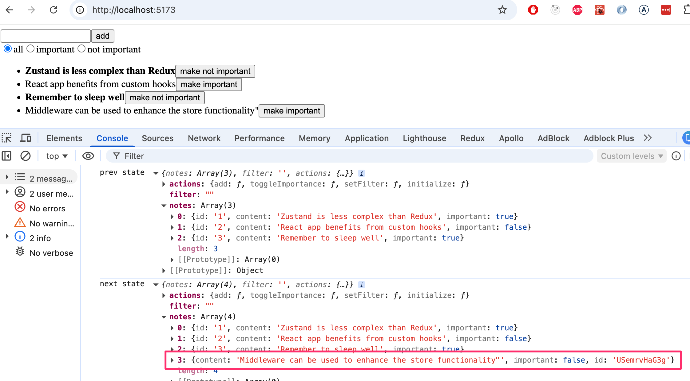
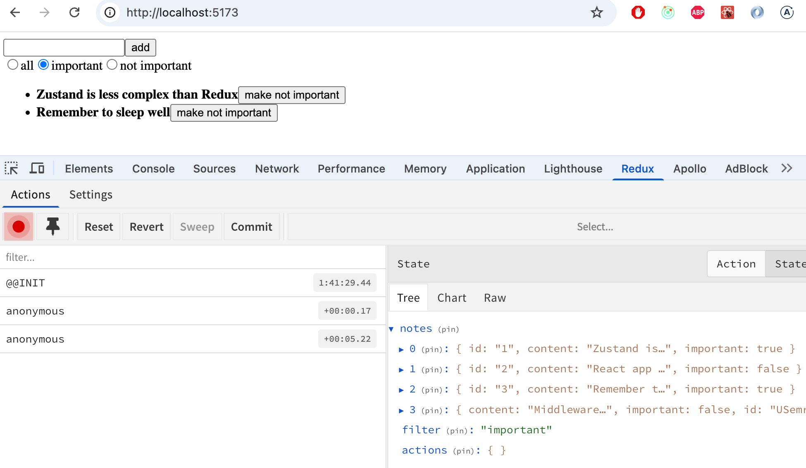

 
<div class="content">

دعنا نواصل توسيع إصدار Zustand من تطبيق الملاحظات.

لتسهيل عملية التطوير، دعنا نغير الحالة الأولية بحيث تحتوي بالفعل على بعض الملاحظات:

```js
// highlight-start
const initialNotes = [
    {
      id: 1,
      content: 'Zustand is less complex than Redux',
      important: true,
    }, {
      id: 2,
      content: 'React app benefits from custom hooks',
      important: false,
    }, {
      id: 3,
      content: 'Remember to sleep well',
      important: true,
    }
  ]


//highlight-end

const useNoteStore = create((set) => ({
  notes: initialNotes,
  // ...
}
```

### حالة أكثر تعقيداً (More complex state)

دعنا ننفذ تصفية الملاحظات (Filtering) المعروضة في التطبيق، مما يسمح بتقييد الملاحظات المرئية. يتم تنفيذ الفلتر باستخدام [أزرار الاختيار الراديوية (Radio buttons)](https://developer.mozilla.org/en-US/docs/Web/HTML/Element/input/radio):


يطرح السؤال نفسه حول أفضل طريقة للتعامل مع إدارة حالة الفلتر. هناك خياران أساسيان: إنشاء مخزن Zustand منفصل للفلتر، أو إضافته إلى المخزن الحالي. كِلا الحلين له ما يبرره. توصي [أفضل الممارسات](https://tkdodo.eu/blog/working-with-zustand#keep-the-scope-of-your-store-small) الموجودة على الإنترنت بالحفاظ على الأشياء غير المترابطة تماماً في مخازن منفصلة. ومع ذلك، فإن قائمة الملاحظات والتصفية مرتبطتان ارتباطاً وثيقاً بما يكفي لجعلهما في نفس المخزن:

```js
const useNoteStore = create((set) => ({
  notes: initialNotes,
  filter: 'all', // highlight-line
  actions: {
    add: note => set(
      state => ({ notes: state.notes.concat(note) })
    ),
    toggleImportance: id => set(
      state => ({
        notes: state.notes.map(note =>
          note.id === id ? { ...note, important: !note.important } : note
        )
      })
    ),
    setFilter: value => set(() => ({ filter: value })) // highlight-line
  }
}))

export const useNotes = () => useNoteStore((state) => state.notes)
export const useFilter = () => useNoteStore((state) => state.filter) // highlight-line
export const useNoteActions = () => useNoteStore((state) => state.actions)
```

المكوّن الذي يحدد قيمة الفلتر:

```js
import { useNoteActions } from './store'

const VisibilityFilter = () => {
  const { setFilter } = useNoteActions()

  return (
    <div>
      <input
        type="radio"
        name="filter"
        onChange={() => setFilter('all')}
        defaultChecked
      />
      all
      <input
        type="radio"
        name="filter"
        onChange={() => setFilter('important')}
      />
      important
      <input
        type="radio"
        name="filter"
        onChange={() => setFilter('nonimportant')}
      />
      not important
    </div>
  )
}

export default VisibilityFilter
```

يصيّر المكوّن <i>App</i> الفلتر:

```js
const App = () => (
  <div>
    <NoteForm />
    <VisibilityFilter /> // highlight-line
    <NoteList />
  </div>
)
```

يمكن التعامل مع تصفية الملاحظات المعروضة في مكوّن <i>NoteList</i>، على سبيل المثال كما يلي:

```js
import { useNotes, useFilter } from './store'
import Note from './Note'

const NoteList = () => {
  const notes = useNotes()
  const filter = useFilter() // highlight-line

  // highlight-start
  const notesToShow = notes.filter(note => {
    if (filter === 'important') return note.important
    if (filter === 'nonimportant') return !note.important
    return true
  })
  // highlight-end

  return (
    <ul>
      {notesToShow.map(note => ( // highlight-line
        <Note key={note.id} note={note} />
      ))}
    </ul>
  )
}
```

يتم الوصول إلى حل أفضل من خلال تضمين منطق التصفية مباشرة في دالة <i>useNotes</i> الخاصة بالمخزن:

```js
import { create } from 'zustand'

const useNoteStore = create((set) => ({
  // ...
}))

// highlight-start
export const useNotes = () => {
  const notes = useNoteStore((state) => state.notes)
  const filter = useNoteStore((state) => state.filter)

  if (filter === 'important') return notes.filter(n => n.important)
  if (filter === 'nonimportant') return notes.filter(n => !n.important)

  return notes
}
// highlight-end
```

وبالتالي، تُرجع الدالة <i>useNotes</i> دائماً قائمة من الملاحظات المفلترة بالطريقة المطلوبة. ولا يحتاج مستهلك الدالة، وهو مكوّن <i>NoteList</i>، إلى أن يكون على دراية بوجود الفلتر أصلاً:

```js
import { useNotes } from './store'
import Note from './Note'

const NoteList = () => {
  // يحصل المكوّن دائماً على مجموعة الملاحظات المفلترة بشكل صحيح
  const notes = useNotes()

  return (
    <ul>
      {notes.map(note => (
        <Note key={note.id} note={note} />
      ))}
    </ul>
  )
}
```

الحل أنيق ومحكم للغاية!

> #### حل بديل محتمل
>
> البديل هو تنفيذ التصفية مباشرة داخل دالة المحدد (Selector function)، بحيث تتم قراءة كل من الملاحظات والفلتر في استدعاء واحد لـ <i>useNoteStore</i>:
>
>```js
>export const useNotes = () => useNoteStore(({ notes, filter }) => {
>  if (filter === 'important') return notes.filter(n => n.important)
>  if (filter === 'nonimportant') return notes.filter(n => !n.important)
>  return notes
>})
>```
>
> ومع ذلك، فإن هذا النهج لا يعمل، لأنه يؤدي إلى حلقة إعادة تصيير لانهائية (Infinite re-rendering loop) عند تغيير الفلتر.
>
> والسبب هو التالي: تقارن Zustand القيمة المرجعة للمحدد باستخدام عامل المقارنة <i>===</i>. نظراً لأن <i>notes.filter(...)</i> تُنشئ مصفوفة جديدة في كل تصيير، فإن React تفسرها دائماً على أنها حالة جديدة وتطلق تصييراً آخر، مما يُنشئ مصفوفة جديدة مرة أخرى، وهكذا دواليك.
>
> الحل هو إضافة [useShallow](https://zustand.docs.pmnd.rs/reference/hooks/use-shallow)، والذي يستبدل المقارنة بـ <i>===</i> بمقارنة سطحية (Shallow comparison): حيث يقارن عناصر المصفوفة واحداً تلو الآخر. إذا لم يتغير المحتوى، فإنه يُرجع مرجع المصفوفة القديم بدلاً من مرجع جديد، وبالتالي ترى React الحالة على أنها مستقرة ولا تُعيد التصيير.
>
>```js
>import { useShallow } from 'zustand/react/shallow'
>
>//...
>
>export const useNotes = () => useNoteStore(useShallow(({ notes, filter }) => {
>  if (filter === 'important') return notes.filter(n => n.important)
>  if (filter === 'nonimportant') return notes.filter(n => !n.important)
>  return notes
>}))
>```
>
> الحل يعمل، لكنه أصعب قليلاً في الفهم. في مادة الدورة التعليمية نستخدم الإصدار المعروض سابقاً مع استدعاءين منفصلين لـ <i>useNoteStore</i>.

الكود الحالي للتطبيق متاح بالكامل على [GitHub](https://github.com/fullstack-hy2020/zustand-notes/tree/part6-3)، في الفرع <i>part6-3</i>.

</div>

<div class="tasks">

### التمرين 6.6

دعنا نواصل العمل على تطبيق الطرائف (Anecdotes).

#### 6.6 الطرائف، الخطوة 5

نفّذ تصفية الطرائف المعروضة في التطبيق:


أنشئ مكوّن <i>Filter</i> لعرض الفلتر على الشاشة. يمكنك استخدام ما يلي كنقطة انطلاق له:

```js
const Filter = () => {
  const handleChange = (event) => {
    // قيمة حقل الإدخال موجودة في event.target.value
  }
  const style = {
    marginBottom: 10
  }

  return (
    <div style={style}>
      filter <input onChange={handleChange} />
    </div>
  )
}

export default Filter
```

</div>

<div class="content">

### حفظ البيانات في الخادم (Data to the server)

دعنا نوسّع التطبيق بحيث يتم تخزين الملاحظات في واجهة خلفية (Backend). سنستخدم [JSON Server](/ar/part2/getting_data_from_server) المألوف من الجزء 2.

احفظ الحالة الأولية لقاعدة البيانات في الملف <i>db.json</i> في المجلد الجذري للمشروع:

```json
{
  "notes": [
    {
      "id": 1,
      "content": "Zustand is less complex than Redux",
      "important": true
    },
    {
      "id": 2,
      "content": "React app benefits from custom hooks",
      "important": false
    },
    {
      "id": 3,
      "content": "Remember to sleep well",
      "important": true
    }
  ]
}
```

تثبيت JSON Server:

```bash
npm install json-server --save-dev
```

وأضف السطر التالي إلى قسم <i>scripts</i> في ملف <i>package.json</i>:

```json
"scripts": {
  "server": "json-server -p 3001 db.json",
  // ...
}
```

قم بتشغيل JSON Server بالأمر _npm run server_.

### واجهة البرمجة Fetch API (Fetch API)

في تطوير البرمجيات، غالباً ما يتعين على المرء التفكير فيما إذا كان سينفذ ميزة معينة باستخدام مكتبة خارجية أو الاستفادة من الحلول الأصلية والمدمجة (Native) التي توفرها البيئة. كلا النهجين له مزاياه وتحدياته.

في الأجزاء السابقة من هذه الدورة، استخدمنا مكتبة [Axios](https://axios-http.com/docs/intro) لإجراء طلبات HTTP. دعنا نتعرف الآن على طريقة بديلة لإجراء طلبات HTTP باستخدام واجهة [Fetch API](https://developer.mozilla.org/en-US/docs/Web/API/Fetch_API) المدمجة والأصلية في المتصفح وبيئة Node.

من الشائع أن يتم تنفيذ مكتبة خارجية مثل <i>Axios</i> باستخدام مكتبات خارجية أخرى. على سبيل المثال، إذا قمت بتثبيت Axios في مشروع باستخدام الأمر <i>npm install axios</i>، فستكون مخرجات الكونسول:

```bash
$ npm install axios

added 23 packages, and audited 302 packages in 1s

71 packages are looking for funding
  run `npm fund` for details

found 0 vulnerabilities
```

لذلك سيقوم الأمر بتثبيت ليس فقط مكتبة Axios ولكن أكثر من 20 حزمة npm أخرى تحتاجها Axios لكي تعمل.

توفر <i>Fetch API</i> طريقة مماثلة لإجراء طلبات HTTP مثل Axios، لكن استخدام Fetch API لا يتطلب تثبيت مكتبات خارجية. تصبح صيانة التطبيق أسهل عندما يكون هناك عدد أقل من المكتبات التي تتطلب التحديث، كما يتحسن الأمان أيضاً نظراً لتقليل مساحة الهجوم المحتملة (Attack surface) للتطبيق. تم التطرق إلى أمان التطبيقات وصيانتها في [الجزء 7](https://fullstackopen.com/ar/part7/class_components_miscellaneous#security-in-react-and-node-applications) من الدورة.

يتم إجراء الطلبات عملياً باستخدام دالة <i>fetch()</i>. تحتوي الصيغة المستخدمة على بعض الاختلافات مقارنة بـ Axios. سنلاحظ أيضاً قريباً أن Axios كانت تتولى بعض الأشياء نيابة عنا وتجعل حياتنا أسهل. ومع ذلك، سنستخدم Fetch API الآن لأنها حل أصلي واسع الاستخدام يجب أن يكون كل مطور Full Stack على دراية به.

### جلب البيانات من الخادم (Fetching data from the server)

دعنا ننشئ دالة تجلب البيانات من الواجهة الخلفية في الملف <i>src/services/notes.js</i>:

```js
const baseUrl = 'http://localhost:3001/notes'

const getAll = async () => {
  const response = await fetch(baseUrl)

  if (!response.ok) {
    throw new Error('Failed to fetch notes')
  }

  const data = await response.json()
  return data
}

export default { getAll }
```

دعنا ننظر عن كثب في تنفيذ دالة <i>getAll</i>. يتم الآن جلب الملاحظات من الواجهة الخلفية عن طريق استدعاء دالة <i>fetch()</i>، والتي تم إعطاؤها عنوان URL للواجهة الخلفية كمعامل. لم يتم تحديد نوع الطلب بشكل منفصل، لذلك تؤدي <i>fetch</i> الإجراء الافتراضي، وهو طلب GET.

عند وصول الاستجابة، نتحقق مما إذا كان الطلب قد نجح من خلال النظر في حقل <i>response.ok</i> ونطلق خطأً إذا لزم الأمر:

```js
if (!response.ok) {
  throw new Error('Failed to fetch notes')
}
```

يحصل الحقل <i>response.ok</i> على القيمة <i>true</i> إذا نجح الطلب، أي إذا كان رمز حالة الاستجابة (Status code) في النطاق 200-299. وبالنسبة لجميع رموز الحالة الأخرى، مثل 404 أو 500، فإنه يحصل على القيمة <i>false</i>.

لاحظ أن <i>fetch</i> لا تطرح خطأً تلقائياً حتى إذا كان رمز حالة الاستجابة هو 404 مثلاً. يجب تنفيذ معالجة الأخطاء يدوياً، كما فعلنا الآن.

إذا نجح الطلب، يتم تحويل البيانات الموجودة في الاستجابة إلى تنسيق JSON:

```js
const data = await response.json()
```

لا تقوم <i>fetch</i> تلقائياً بتحويل البيانات التي قد تصاحب الاستجابة إلى تنسيق JSON؛ يجب أن يتم التحويل يدوياً. ومن الجدير بالذكر أيضاً أن <i>response.json()</i> هي دالة غير متزامنة (Asynchronous)، لذلك يجب استخدام الكلمة المفتاحية <i>await</i> معها.

دعنا نبسط الكود قليلاً عن طريق إرجاع البيانات التي تُرجعها دالة <i>response.json()</i> مباشرة:

```js
const getAll = async () => {
  const response = await fetch(baseUrl)

  if (!response.ok) {
    throw new Error('Failed to fetch notes')
  }

  return await response.json() // highlight-line
}
```

دعنا نضيف دالة إلى المخزن يمكن استخدامها لتهيئة الحالة بالملاحظات التي تم جلبها من الخادم:

```js
const useNoteStore = create((set) => ({
  notes: [], // highlight-line
  filter: '',
  actions: {
    // ...
    setFilter: value => set(() => ({ filter: value })),
    initialize: notes => set(() => ({ notes })) // highlight-line
  }
}))
```

دعنا ننفذ تهيئة الملاحظات في المكوّن <i>App</i> — كالمعتاد عند جلب البيانات من الخادم، نستخدم خطاف <i>useEffect</i>:

```js
const App = () => {
  const { initialize } = useNoteActions()

 // highlight-start
  useEffect(() => {
    noteService.getAll().then(notes => initialize(notes))
  }, [initialize])
 // highlight-end

  return (
    <div>
      <NoteForm />
      <VisibilityFilter />
      <NoteList />
    </div>
  )
}
```

وبالتالي يتم جلب الملاحظات من الخادم باستخدام دالة <i>getAll()</i> التي قمنا بتعريفها ثم تخزينها باستخدام دالة <i>initialize</i> الخاصة بالمخزن. يتم تنفيذ هذه الإجراءات في خطاف <i>useEffect</i>، مما يعني أنه يتم تنفيذها أثناء التصيير الأولي لمكوّن App.

دعنا ننظر بمزيد من التفصيل في تفصيلة صغيرة واحدة. لقد أضفنا دالة <i>initialize</i> إلى مصفوفة الاعتماديات (Dependencies array) لخطاف <i>useEffect</i>. إذا حاولنا استخدام مصفوفة تبعيات فارغة، فسيُصدر ESLint التحذير التالي: <i>React Hook useEffect has a missing dependency: 'initialize'</i>. ما الذي يحدث هنا؟

سيعمل الكود منطقياً بنفس الطريقة تماماً حتى لو استخدمنا مصفوفة تبعيات فارغة، لأن <i>initialize</i> تشير إلى نفس الدالة طوال فترة تنفيذ البرنامج. ومع ذلك، فمن الممارسات البرمجية الجيدة إضافة جميع المتغيرات والدوال التي يستخدمها خطاف _useEffect_ والمعرفة داخل المكوّن إلى التبعيات. يساعد هذا في تجنب الأخطاء البرمجية غير المتوقعة.

### إرسال البيانات إلى الخادم (Sending data to the server)

دعنا ننفذ بعد ذلك الوظيفة الخاصة بإرسال ملاحظة جديدة إلى الخادم. وفي الوقت نفسه يمكننا التدرب على كيفية إجراء طلب POST باستخدام دالة <i>fetch()</i>.

دعنا نوسع كود الاتصال بالخادم في <i>src/services/notes.js</i> كما يلي:

```js
const baseUrl = 'http://localhost:3001/notes'

const getAll = async () => {
  const response = await fetch(baseUrl)

  if (!response.ok) {
    throw new Error('Failed to fetch notes')
  }

  return await response.json()
}

// highlight-start
const createNew = async (content) => {
  const response = await fetch(baseUrl, {
    method: 'POST',
    headers: { 'Content-Type': 'application/json' },
    body: JSON.stringify({ content, important: false }),
  })
  
  if (!response.ok) {
    throw new Error('Failed to create note')
  }
  
  return await response.json()
}
// highlight-end

export default { getAll, createNew } // highlight-line
```

دعنا ننظر بمزيد من التفصيل في تنفيذ دالة <i>createNew</i>. يحدد المعامل الأول لدالة <i>fetch()</i> عنوان URL الذي يتم تقديم الطلب إليه. المعامل الثاني هو كائن يحدد التفاصيل الأخرى للطلب، مثل نوع الطلب والترويسات والبيانات المرسلة مع الطلب. يمكننا توضيح الكود بشكل أكبر عن طريق تخزين الكائن الذي يحدد تفاصيل الطلب في متغير مساعد منفصل باسم <i>options</i>:

```js
const createNew = async (content) => {
  // highlight-start
  const options = {
    method: 'POST',
    headers: { 'Content-Type': 'application/json' },
    body: JSON.stringify({ content, important: false }),
  }
  
  const response = await fetch(baseUrl, options)
  // highlight-end

  if (!response.ok) {
    throw new Error('Failed to create note')
  }
  
  return await response.json()
}
```

دعنا نلقي نظرة فاحصة على كائن <i>options</i>:

- يحدد <i>method</i> نوع الطلب، وهو في هذه الحالة <i>POST</i>.
- يحدد <i>headers</i> ترويسات الطلب. نرفق الترويسة <i>'Content-Type': 'application/json'</i> بالطلب حتى يعرف الخادم أن البيانات المضمنة في الطلب بتنسيق JSON، ويمكنه التعامل مع الطلب بشكل صحيح.
- يحتوي <i>body</i> على البيانات المراد إرسالها مع الطلب. لا يمكن أن يحتوي الحقل مباشرة على كائن جافاسكريبت، بل يجب تحويله أولاً إلى سلسلة نصية بتنسيق JSON عن طريق استدعاء <i>JSON.stringify()</i>.

كما هو الحال مع طلب GET، نتحقق أيضاً من رمز حالة الاستجابة بحثاً عن الأخطاء:

```js
if (!response.ok) {
  throw new Error('Failed to create note')
}
```

إذا نجح الطلب، يُرجع <i>JSON Server</i> الملاحظة التي تم إنشاؤها للتو، والتي قام أيضاً بإنشاء معرّف <i>id</i> فريد لها. لا يزال يتعين تحويل البيانات الموجودة في الاستجابة إلى تنسيق JSON باستخدام دالة <i>response.json()</i>:

```js
return await response.json()
```

دعنا نغير بعد ذلك مكوّن <i>NoteForm</i> في تطبيقنا بحيث يتم إرسال ملاحظة جديدة إلى الواجهة الخلفية. تتغير دالة <i>addNote</i> الخاصة بالمكوّن قليلاً:

```js
import { useNoteActions } from './store'
import noteService from './services/notes'

const NoteForm = () => {
  const { add } = useNoteActions()

  const addNote = async (e) => {
    e.preventDefault()
    const content = e.target.note.value
    const newNote = await noteService.createNew(content) // highlight-line
    add(newNote)
    e.target.reset()
  }

  return (
    <form onSubmit={addNote}>
      <input name="note" />
      <button type="submit">add</button>
    </form>
  )
}

export default NoteForm
```

عند إنشاء ملاحظة جديدة في الواجهة الخلفية عن طريق استدعاء الدالة <i>createNew()</i>، نستعيد كائناً يصف الملاحظة، والتي قامت الواجهة الخلفية بتوليد <i>id</i> لها.

الكود الحالي للتطبيق متاح بالكامل على [GitHub](https://github.com/fullstack-hy2020/zustand-notes/tree/part6-4)، في الفرع <i>part6-4</i>.

### الإجراءات غير المتزامنة (Async actions)

نهجنا جيد إلى حد ما، ولكنه مؤسف بمعنى ما، حيث يحدث الاتصال بالخادم داخل كود الدوال التي تحدد المكونات. سيكون من الأفضل لو أمكن تجريد الاتصال بعيداً عن المكونات، بحيث تحتاج فقط إلى استدعاء دالة مناسبة يوفرها المخزن.

نريد من <i>App</i> تهيئة حالة التطبيق كما يلي:

```js
const App = () => {
  const { initialize } = useNoteActions()  // highlight-line

  useEffect(() => {
    initialize()  // highlight-line
  }, [initialize])

  return (
    <div>
      <NoteForm />
      <VisibilityFilter />
      <NoteList />
    </div>
  )
}
```

بدوره، ينشئ <i>NoteForm</i> ملاحظة جديدة هكذا:

```js
const NoteForm = () => {
  const { add } = useNoteActions()  // highlight-line

  const addNote = async (e) => {
    e.preventDefault()
    const content = e.target.note.value
    await add(content)  // highlight-line
    e.target.reset()
  }

  return (
    <form onSubmit={addNote}>
      <input name="note" />
      <button type="submit">add</button>
    </form>
  )
}
```

التغيير في <i>store.js</i> هو كالتالي:

```js
import { create } from 'zustand'
import noteService from './services/notes' // highlight-line

const useNoteStore = create((set) => ({
  notes: [],
  filter: '',
  actions: {
    add: async (content) => {  // highlight-line
      const newNote = await noteService.createNew(content)  // highlight-line
      set(state => ({ notes: state.notes.concat(newNote) })) 
    },
    initialize: async () => {  // highlight-line
      const notes = await noteService.getAll()  // highlight-line
      set(() => ({ notes }))
    },
    // ...
  }
}))
```

وبالتالي تم تغيير الدالتين <i>add</i> و <i>initialize</i> إلى دوال غير متزامنة (Async functions)، والتي تستدعي أولاً دالة noteService المناسبة، ثم تقوم بتحديث الحالة.

الحل أنيق وممتاز؛ حيث يتم فصل إدارة الحالة والاتصال بالخادم تماماً خارج مكونات React.

دعنا نضع اللمسات الأخيرة على التطبيق من خلال مزامنة تغيير تبديل الأهمية مع الخادم.

يتم توسيع <i>noteService.js</i> كما يلي:

```js
const update = async (id, note) => {
  const response = await fetch(`${baseUrl}/${id}`, {
    method: 'PUT',
    headers: { 'Content-Type': 'application/json' },
    body: JSON.stringify(note),
  })

  if (!response.ok) {
    throw new Error('Failed to update note')
  }

  return await response.json()
}

export default { getAll, createNew, update } 
```

التغيير في دالة <i>toggleImportance</i> الخاصة بالمخزن هو كالتالي:

```js
const useNoteStore = create((set) => ({
  notes: [],
  filter: '',
  actions: {
    add: async (content) => {
      const newNote = await noteService.createNew(content)
      set(state => ({ notes: state.notes.concat(newNote) }))
    },
    // highlight-start
    toggleImportance: async (id) => {
      const note = useNoteStore.getState().notes.find(n => n.id === id)
      const updated = await noteService.update(
        id, { ...note, important: !note.important }
      )
      set(state => ({
        notes: state.notes.map(n => n.id === id ? updated : n)
      }))
    },
    // highlight-end
    setFilter: value => set(() => ({ filter: value })),
    initialize: async () => {
      const notes = await noteService.getAll()
      set(() => ({ notes }))
    }
  }
}))
```

هناك تفصيلة واحدة جديرة بالملاحظة في الدالة الجديدة. تستقبل الدالة معرّف الملاحظة كمعامل. ومع ذلك، يجب إرسال الملاحظة المعدلة إلى الواجهة الخلفية. يمكن العثور عليها عن طريق استدعاء دالة <i>getState</i> الخاصة بالمخزن:

```js
const note = useNoteStore.getState().notes.find(n => n.id === id)
```

تحتوي مخازن Zustand أيضاً على عدد من [الدوال المساعدة](https://zustand.docs.pmnd.rs/reference/apis/create#returns) الأخرى، والتي قد تكون مفيدة في بعض المواقف.

دعنا نغير أيضاً تعريف المخزن بحيث نمرر أيضاً المعامل <i>get</i> إلى الدالة المعطاة لـ <i>create</i>، والتي يمكننا من خلالها الوصول إلى قيم الحالة عند الحاجة:

```js
const useNoteStore = create((set, get) => ({ // highlight-line
  notes: [],
  filter: '',
  actions: {
    toggleImportance: async (id) => {
      const note = get().notes.find(n => n.id === id) // highlight-line
      const updated = await noteService.update(
        id, { ...note, important: !note.important }
      )
      set(state => ({
        notes: state.notes.map(n => n.id === id ? updated : n)
      }))
    },
    // ...
  }
}))
```

تُرجع الدالة <i>get</i> الحالة الحالية للمخزن. على سبيل المثال، يعطي الاستدعاء <i>get().notes</i> الملاحظات الحالية في المخزن. الدالة <i>get</i> مكافئة وظيفياً لاستدعاء <i>useNoteStore.getState()</i>، ولكنها الطريقة الأكثر اصطلاحية (Idiomatic) للإشارة إلى حالة المخزن من داخل دوال المخزن الخاصة به.

كود التطبيق موجود على [GitHub](https://github.com/fullstack-hy2020/zustand-notes/tree/part6-5) في الفرع <i>part6-5</i>.

</div>

<div class="tasks">

### التمارين 6.7.-6.11.

#### 6.7 الطرائف، الخطوة 6

قم بجلب الطرائف من الواجهة الخلفية لـ JSON Server عند بدء تشغيل التطبيق. استخدم Fetch API لإجراء طلب HTTP.

يمكنك العثور على المحتوى الأولي للواجهة الخلفية على سبيل المثال [هنا](https://github.com/fullstack-hy2020/misc/blob/master/anecdotes.json).

#### 6.8 الطرائف، الخطوة 7

قم بتغيير عملية إنشاء الطرائف الجديدة بحيث يتم تخزين الطرائف في الواجهة الخلفية. استخدم Fetch API في تنفيذك.

#### 6.9 الطرائف، الخطوة 8

التصويت لا يحفظ التغييرات في الواجهة الخلفية بعد. قم بإصلاح الوضع.

#### 6.10 الطرائف، الخطوة 9

يحتوي التطبيق على هيكل جاهز لمكوّن <i>Notification</i>:

```js
const Notification = () => {
  const style = {
    border: 'solid',
    padding: 10,
    borderWidth: 1,
    marginBottom: 10
  }

  return (
    <div style={style}>
      render here notification...
    </div>
  )
}

export default Notification
```

قم بتوسيع التطبيق بحيث يعرض إشعاراً باستخدام مكوّن <i>Notification</i> لمدة خمس ثوانٍ عند التصويت على الطرائف أو عند إنشاء طرائف جديدة:


استخدم Zustand لإدارة حالة الإشعارات. قد يكون من الجيد إنشاء مخزن Zustand منفصل للإشعارات، حيث قد يتوسع استخدام الإشعارات إلى مجالات أخرى من التطبيق أثناء نموه، مثل تسجيل دخول المستخدم.

#### 6.11 الطرائف، الخطوة 10

نلاحظ أن بعض الطرائف التي أضافها المستخدمون ليست جيدة جداً. نفّذ ميزة تتيح حذف الطرائف التي تحتوي على صفر من الأصوات.

</div>

<div class="content">

### البرمجيات الوسيطة (Middlewares)

عند تطوير تطبيق، غالباً ما يواجه المرء مواقف يصعب فيها فهم سبب تصرف التطبيق بشكل غير متوقع. تتغير الحالة نتيجة لاستدعاء دالة إجراء ما، ولكن من غير الواضح أي استدعاء غيّر ماذا وبأي ترتيب. يساعد التسجيل التقليدي في الكونسول للدوال الفردية إلى حد محدود فقط.

تدعم Zustand ما يُسمى بالبرمجيات الوسيطة (Middlewares)، والتي يمكن استخدامها لإضافة وظائف إلى المخازن بشفافية ودون لمس المنطق الخاص بالمخزن نفسه. فكرة البرمجية الوسيطة بسيطة: فهي "تلتف" حول المخزن ويمكنها، على سبيل المثال، تسجيل كل تغيير في الحالة تلقائياً.

شكل دوال البرمجيات الوسيطة غامض ومجرد نوعاً ما. فيما يلي دالة <i>logger</i> تطبع دائماً الحالة القديمة والجديدة للمخزن كلما تغيرت الحالة:

```js
const logger = (config) => (set, get) => config(
  (...args) => {
    console.log('prev state', get());
    set(...args);
    console.log('next state', get());
  },
  get
);
```

يتم تفعيل البرمجية الوسيطة عن طريق "تغليف" الدالة المعطاة لدالة <i>create</i> في Zustand كمعامل لها:

```js
const useNoteStore = create(logger((set, get) => ({ // highlight-line
  notes: [],
  filter: '',
  actions: {
    // ...
  }
}))) // highlight-line
```

الآن كلما تغيرت حالة المخزن، يمكننا دائماً أن نرى في الكونسول كيف تتغير الحالة:



من الناحية العملية، تعمل البرمجية الوسيطة المحددة لدينا عن طريق استبدال الدالة الأصلية <i>set</i> بالدالة:

```js
  (...args) => {
    console.log('prev state', get());
    set(...args);
    console.log('next state', get());
  }
```

والتي بالإضافة إلى استدعاء <i>set</i>، تطبع أيضاً الحالة القديمة والجديدة (التي يمكن الوصول إليها عبر دالة <i>get</i>) إلى الكونسول. المعامل الثاني هو <i>get</i> القديمة دون تغيير.

تحتوي Zustand أيضاً على برمجية وسيطة جاهزة تُسمى <i>devtools</i> تدمج المخزن مع إضافة [Redux DevTools](https://chromewebstore.google.com/detail/redux-devtools/lmhkpmbekcpmknklioeibfkpmmfibljd) في المتصفح. تُعد Devtools أداة تطوير مفيدة للغاية، لأنها تتيح لك تتبع تغييرات الحالة بصرياً.

الإعداد مباشر:

```js
import { create } from 'zustand'
import { devtools } from 'zustand/middleware' // highlight-line

const useNoteStore = create(devtools((set, get) => ({ // highlight-line
  notes: [],
  filter: '',
  actions: {
    // ...
  }
}))) // highlight-line
```

عند تثبيت إضافة Redux DevTools في المتصفح، يمكن فحص حالة المخزن وتغييراته في أدوات المطورين بالمتصفح:



### اختبار مخازن زوستاند (Testing Zustand stores)

أخيراً، دعنا نلقي نظرة على اختبار مخازن Zustand باستخدام Vitest.

من أجل التبسيط، لنبدأ بمخزن العداد:

```js
import { create } from 'zustand'

const useCounterStore = create(set => ({
  counter: 0,
  actions: {
    increment: () => set(state => ({ counter: state.counter + 1 })),
    decrement: () => set(state => ({ counter: state.counter - 1 })),
    zero: () => set(() => ({ counter: 0 })),
  }  
}))

export const useCounter = () => useCounterStore(state => state.counter)
export const useCounterControls = () => useCounterStore(state => state.actions)

export default useCounterStore // highlight-line
```

أضفنا تصديراً (Export) إلى التعريف للاختبارات، والتي يمكن للاختبار من خلالها الوصول إلى المخزن.

دعنا نثبت Vitest:

```bash
npm install --save-dev vitest
```

دعنا ننفذ الاختبار في الملف <i>store.test.js</i>:

```js
import { beforeEach, describe, expect, it } from 'vitest'
import useCounterStore from './store'

beforeEach(() => {
  useCounterStore.setState({ counter: 0 })
})

describe('counter store', () => {
  it('initial state is 0', () => {
    expect(useCounterStore.getState().counter).toBe(0)
  })

  it('increment increases counter by 1', () => {
    useCounterStore.getState().actions.increment()
    expect(useCounterStore.getState().counter).toBe(1)
  })

  it('decrement decreases counter by 1', () => {
    useCounterStore.getState().actions.decrement()
    expect(useCounterStore.getState().counter).toBe(-1)
  })

  it('zero resets counter to 0', () => {
    useCounterStore.getState().actions.increment()
    useCounterStore.getState().actions.increment()
    useCounterStore.getState().actions.zero()
    expect(useCounterStore.getState().counter).toBe(0)
  })
})
```

الاختبارات واضحة ومباشرة تماماً، حيث تستخدم دالة [getState](https://zustand.docs.pmnd.rs/reference/apis/create#returns) الخاصة بالمخزن، والتي تسمح لها بقراءة حالة المخزن وتنفيذ دوال المخزن.

قبل كل اختبار، تتم إعادة تعيين المخزن إلى حالته الأولية في كتلة <i>beforeEach</i> باستخدام دالة [setState](https://zustand.docs.pmnd.rs/reference/apis/create#returns) الخاصة بالمخزن.

إن إعادة تعيين المخزن إلى حالته الأولية أمر بسيط في حالتنا. وهذا ليس بالضرورة هو الحال دائماً. تصف [وثائق Zustand الرسمية](https://zustand.docs.pmnd.rs/learn/guides/testing#vitest) طريقة لإنشاء نسخة من المخازن للاختبار تتم إعادة تعيينها تلقائياً إلى حالتها الأولية قبل كل اختبار. ومع ذلك، فإن هذه الطريقة معقدة بما يكفي وغير ضرورية بالنسبة لنا بحيث سنتخطاها في الوقت الحالي.

وبالتالي فإن الاختبارات تستخدم المخزن مباشرة. وإذا تم تنفيذ منطق أكثر تعقيداً من خلال خطافات مخصصة لاستخدام المخزن، فقد يكون من الضروري كتابة اختبارات تستخدم الخطافات أيضاً. في العداد، يتم استخدام المخزن من خلال الخطافين <i>useCounter</i> و <i>useCounterControls</i>:

```js
const useCounterStore = create(set => ({
  // ...
}))

// hightlight-start
export const useCounter = () => useCounterStore(state => state.counter)
export const useCounterControls = () => useCounterStore(state => state.actions)
// hightlight-end
```

في هذه الحالة، لا تحتوي الخطافات على أي منطق، فهي تكشف فقط بشكل منفصل القيمة المخزنة في المخزن ودوال المخزن. وبالتالي فإن نهج الاختبار الذي استخدمناه أعلاه جيد تماماً.

ومع ذلك، دعنا ننشئ نسخة أخرى من الاختبارات لأغراض المثال، حيث يتم استخدام المخزن بنفس الطريقة تماماً التي يستخدمها التطبيق.

إن <i>useCounter</i> و <i>useCounterControls</i> هما خطافات React، لذا فإن اختبارهما يتطلب مكتبة [React Testing Library](https://github.com/testing-library/react-testing-library) ومكتبة [jsdom](https://github.com/jsdom/jsdom):

```bash
npm install --save-dev @testing-library/react jsdom
```

دعنا نضيف تكوين بيئة الاختبار إلى <i>vite.config.js</i>:

```js
import { defineConfig } from 'vite'
import react from '@vitejs/plugin-react'

export default defineConfig({
  plugins: [react()],
  // highlight-start
  test: {
    environment: 'jsdom',
  },
   // highlight-end
})
```

الاختبارات هي كما يلي:

```js
import { beforeEach, describe, expect, it } from 'vitest'
import { renderHook, act } from '@testing-library/react'
import useCounterStore, { useCounter, useCounterControls } from './store'

beforeEach(() => {
  useCounterStore.setState({ counter: 0 })
})

describe('counter hooks', () => {
  it('useCounter returns initial value of 0', () => {
    const { result } = renderHook(() => useCounter())
    expect(result.current).toBe(0)
  })

  it('increment updates counter', () => {
    const { result: counter } = renderHook(() => useCounter())
    const { result: controls } = renderHook(() => useCounterControls())

    act(() => controls.current.increment())

    expect(counter.current).toBe(1)
  })

  it('decrement updates counter', () => {
    const { result: counter } = renderHook(() => useCounter())
    const { result: controls } = renderHook(() => useCounterControls())

    act(() => controls.current.decrement())

    expect(counter.current).toBe(-1)
  })

  it('zero resets counter', () => {
    const { result: counter } = renderHook(() => useCounter())
    const { result: controls } = renderHook(() => useCounterControls())

    act(() => {
      controls.current.increment()
      controls.current.increment()
      controls.current.zero()
    })

    expect(counter.current).toBe(0)
  })
})
```

هناك بعض النقاط المثيرة للاهتمام في الاختبار. في بداية الاختبارات، يتم تصيير الخطافات باستخدام دالة [renderHook](https://testing-library.com/docs/react-testing-library/api/#renderhook):

```js
const { result: counter } = renderHook(() => useCounter())
const { result: controls } = renderHook(() => useCounterControls())
```

بهذه الطريقة يحصل الاختبار على إمكانية الوصول إلى القيم التي تُرجعها الخطافات، والتي يتم تخزينها في المتغيرين <i>counter</i> و <i>controls</i>.

يتم استدعاء الخطافات عن طريق تغليف الاستدعاء داخل دالة [act](https://testing-library.com/docs/react-testing-library/api/#act):

```js
act(() => {
  controls.current.increment()
  controls.current.increment()
  controls.current.zero()
})
```

أخيراً، يحدث توكيد الاختبار:

```js
expect(counter.current).toBe(0)
```

كما نرى، للوصول إلى الخطاف نفسه لا نزال بحاجة إلى أخذ الحقل <i>current</i> من الكائن الذي تُرجعه <i>renderHook</i>، والذي يطابق القيمة الحالية للخطاف.

> #### ما هي دالة act؟
>
> <i>act</i> هي دالة مساعدة تضمن معالجة جميع تحديثات الحالة وآثارها الجانبية قبل استمرار كود الاختبار.
>
> عند حدوث تغيير في الحالة في مكوّن أو خطاف React، لا تقوم React بتحديث الحالة على الفور ولكنها تضع التحديثات في قائمة انتظار. تجبر act هذه التحديثات الموجودة في قائمة الانتظار على التنفيذ الفوري.
>
> بدون act، قد يتحقق الاختبار من الحالة قبل أن يتوفر لـ React الوقت الكافي لتحديثها، مما يتسبب في فشل الاختبار أو إعطاء نتائج غير صحيحة.
>
> تقوم مكتبة React Testing Library بتغليف العديد من دوالها (مثل fireEvent و userEvent) في act تلقائياً، ولكن عند اختبار الخطافات مباشرة تكون هناك حاجة إليها عادةً.

يستخدم الاختبار عبر الخطافات مكتبة React Testing Library ويصيّر الخطافات في سياق React حقيقي باستخدام jsdom. هذا النهج أبطأ بكثير من الاختبارات التي تستخدم المخزن مباشرة، لذلك إذا كانت الخطافات لا تحتوي على منطق معقد، فقد يكون كافياً تشغيل الاختبارات باستخدام المخزن مباشرة.

الكود الذي يحتوي على اختبارات عداد Zustand متاح على [GitHub](https://github.com/fullstack-hy2020/zustand-counter).

### اختبار مخزن الملاحظات (Testing the notes store)

يُعد اختبار مخزن تطبيق الملاحظات حالة أكثر صعوبة وتحدياً إلى حد ما، حيث يحتوي المخزن على دوال غير متزامنة تستدعي الخادم:

```js
import { create } from 'zustand'
import noteService from './services/notes'

const useNoteStore = create(set => ({
  notes: [],
  filter: '',
  actions: {
    add: async (content) => {
      const newNote = await noteService.createNew(content) // highlight-line
      set(state => ({ notes: state.notes.concat(newNote) }))
    },
    toggleImportance: async (id) => {
      const note = useNoteStore.getState().notes.find(n => n.id === id)
      // highlight-start
      const updated = await noteService.update(
        id, { ...note, important: !note.important }
      )
       // highlight-end
      set(state => ({
        notes: state.notes.map(n => n.id === id ? updated : n)
      }))
    },
    setFilter: value => set(() => ({ filter: value })),
    initialize: async () => {
      const notes = await noteService.getAll() // highlight-line
      set(() => ({ notes }))
    }
  }
}))

export const useNotes = () => { 
  const notes = useNoteStore((state) => state.notes)
  const filter = useNoteStore((state) => state.filter)

  if (filter === 'important') return notes.filter(n => n.important)
  if (filter === 'nonimportant') return notes.filter(n => !n.important)
  return notes
}

export const useFilter = () => useNoteStore((state) => state.filter)
export const useNoteActions = () => useNoteStore((state) => state.actions)
```

تحتوي <i>useNotes</i> هذه المرة أيضاً على قدر كبير من المنطق، لذا يجب إجراء الاختبار على الأرجح عبر الخطافات باستخدام React Testing Library.

دعنا نثبت المكتبات المطلوبة:

```bash
npm install --save-dev vitest @testing-library/react jsdom
```

دعنا نضيف تكوين بيئة الاختبار إلى <i>vite.config.js</i>:

```js
import { defineConfig } from 'vite'
import react from '@vitejs/plugin-react'

export default defineConfig({
  plugins: [react()],
  // highlight-start
  test: {
    environment: 'jsdom',
  },
   // highlight-end
})
```

الجزء الأول من الاختبارات هو كما يلي:

```js
import { describe, it, expect, beforeEach, vi } from 'vitest'
import { renderHook, act } from '@testing-library/react'

vi.mock('./services/notes', () => ({
  default: {
    getAll: vi.fn(),
    createNew: vi.fn(),
    update: vi.fn(),
  }
}))

import noteService from './services/notes'
import useNoteStore, { useNotes, useFilter, useNoteActions } from './store'

beforeEach(() => {
  useNoteStore.setState({ notes: [], filter: '' })
  vi.clearAllMocks()
})

describe('useNoteActions', () => {
  it('initialize loads notes from service', async () => {
    const mockNotes = [{ id: 1, content: 'Test', important: false }]
    noteService.getAll.mockResolvedValue(mockNotes)

    const { result } = renderHook(() => useNoteActions())

    await act(async () => {
      await result.current.initialize()
    })

    const { result: notesResult } = renderHook(() => useNotes())
    expect(notesResult.current).toEqual(mockNotes)
  })

  it('add appends a new note', async () => {
    const newNote = { id: 2, content: 'New note', important: false }
    noteService.createNew.mockResolvedValue(newNote)

    const { result } = renderHook(() => useNoteActions())

    await act(async () => {
      await result.current.add('New note')
    })

    const { result: notesResult } = renderHook(() => useNotes())
    expect(notesResult.current).toContainEqual(newNote)
  })

  it('toggleImportance flips important flag', async () => {
    const note = { id: 1, content: 'Test', important: false }
    useNoteStore.setState({ notes: [note] })
    noteService.update.mockResolvedValue({ ...note, important: true })

    const { result } = renderHook(() => useNoteActions())

    await act(async () => {
      await result.current.toggleImportance(1)
    })

    const { result: notesResult } = renderHook(() => useNotes())
    expect(notesResult.current[0].important).toBe(true)
  })
})
```

هناك الكثير لفهمه في هذه الاختبارات. تنشئ الاختبارات، باستخدام Vitest، نسخة [محاكاة (Mock)](https://vitest.dev/guide/mocking) من <i>noteService</i> المسؤولة عن الاتصال بالخادم:

```js
import { describe, it, expect, beforeEach, vi } from 'vitest'

vi.mock('./services/notes', () => ({
  default: {
    getAll: vi.fn(),
    createNew: vi.fn(),
    update: vi.fn(),
  }
}))
```

تستبدل [vi.mock](https://vitest.dev/api/vi.html#vi-mock) كائن <i>noteService</i> في الوحدة النمطية <i>./services/notes</i> بنسختها الخاصة، حيث يتم استبدال جميع الدوال بدوال محاكاة ترجعها [vi.fn](https://vitest.dev/api/vi.html#vi-fn).

قبل كل اختبار، تتم إعادة تعيين المخزن إلى حالته الأولية ومسح دوال المحاكاة:

```js
beforeEach(() => {
  useNoteStore.setState({ notes: [], filter: '' })
  vi.clearAllMocks()
})
```

في بداية كل اختبار، يتم إخبار <i>noteService</i> المحاكية عبر دالة [mockResolvedValue](https://vitest.dev/api/mock.html#mockresolvedvalue) بكيفية تصرفها في سياق الاختبار:

```js
it('initialize loads notes from service', async () => {
  // highlight-start
  const mockNotes = [{ id: 1, content: 'Test', important: false }]
  noteService.getAll.mockResolvedValue(mockNotes)
  // highlight-end

  const { result } = renderHook(() => useNoteActions())

  await act(async () => {
    await result.current.initialize()
  })

  const { result: notesResult } = renderHook(() => useNotes())
  expect(notesResult.current).toEqual(mockNotes)
})
```

أولاً، يحدد الاختبار أنه عند استدعاء دالة <i>noteService.getAll</i>، يتم إرجاع الملاحظات الموجودة في مصفوفة <i>mockNotes</i> إلى المخزن.

الشيء الذي يتم اختباره هو الاستدعاء لدالة <i>initialize</i>:

```js
await act(async () => {
  await result.current.initialize()
})
```

نظراً لأن هذه دالة غير متزامنة، يجب انتظار اكتمال الاستدعاء باستخدام الكلمة المفتاحية <i>await</i>.

أخيراً، يتحقق الاختبار من أن حالة المخزن تحتوي على نفس قائمة الملاحظات التي أرجعتها <i>noteService.getAll</i> المحاكية:

```js
const { result: notesResult } = renderHook(() => useNotes())
expect(notesResult.current).toEqual(mockNotes)
```

تتبع الاختبارات الأخرى نفس النمط: أولاً، يتم تحديد ما تُرجعه دالة <i>noteService</i> المستدعاة من قِبل المخزن، ثم يتم تشغيل الاختبار الفعلي.

يتحقق الجزء الثاني من الاختبارات من أن التصفية تعمل بشكل صحيح:

```js
describe('useNotes filtering', () => {
  const notes = [
    { id: 1, content: 'A', important: true },
    { id: 2, content: 'B', important: false },
  ]

  beforeEach(() => {
    useNoteStore.setState({ notes })
  })

  it('returns all notes with no filter', () => {
    const { result } = renderHook(() => useNotes())
    expect(result.current).toHaveLength(2)
  })

  it('filters important notes', () => {
    useNoteStore.setState({ notes, filter: 'important' })
    const { result } = renderHook(() => useNotes())
    expect(result.current).toEqual([notes[0]])
  })

  it('filters nonimportant notes', () => {
    useNoteStore.setState({ notes, filter: 'nonimportant' })
    const { result } = renderHook(() => useNotes())
    expect(result.current).toEqual([notes[1]])
  })
})
```

تمت تهيئة الحالة بملاحظتين، إحداهما مهمة والأخرى ليست كذلك. تتحقق حالات الاختبار الثلاث من أن <i>useNotes</i> تُرجع الملاحظات الصحيحة لجميع قيم الفلتر.

الكود النهائي للتطبيق موجود على [GitHub](https://github.com/fullstack-hy2020/zustand-notes/tree/part6-6) في الفرع <i>part6-6</i>.

</div>

<div class="tasks">

### التمارين 6.12.-6.15.

#### 6.12 الطرائف، الخطوة 11

اكتب اختباراً يتحقق من تهيئة الحالة بالطرائف التي ترجعها الواجهة الخلفية.

#### 6.13 الطرائف، الخطوة 12

اكتب اختباراً يتحقق من أن المكوّن الذي يعرض الطرائف يستقبل الطرائف من المخزن مرتبة حسب الأصوات.

#### 6.14 الطرائف، الخطوة 13

اكتب اختباراً يتحقق من أن مكوّن React الصحيح يتلقى قائمة مفلترة بشكل سليم من الطرائف.

#### 6.15 الطرائف، الخطوة 14

اكتب اختباراً يتحقق من أن التصويت يزيد من عدد الأصوات لطريفة معينة.

</div>
