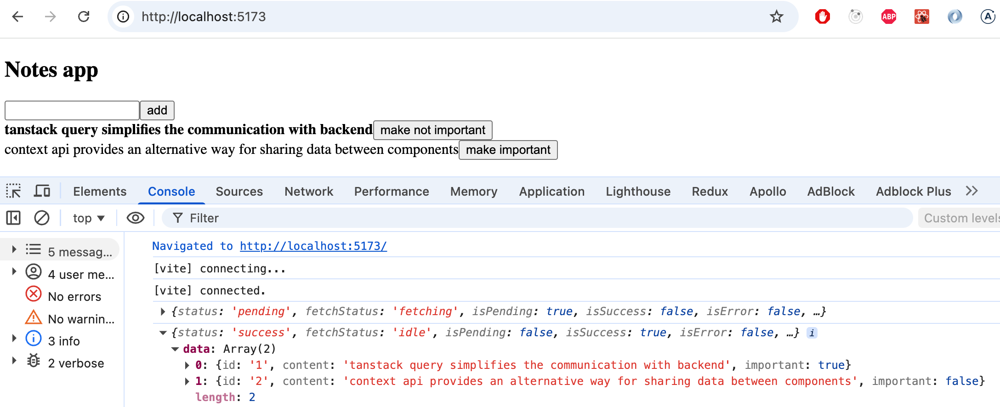
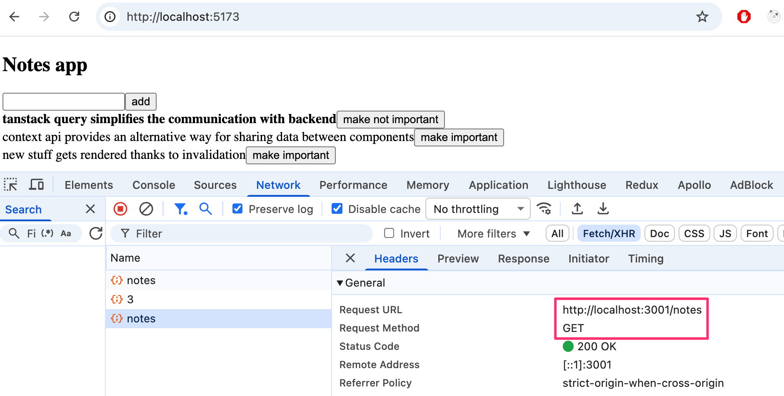
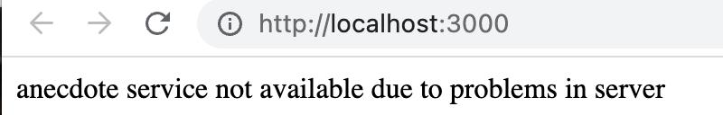
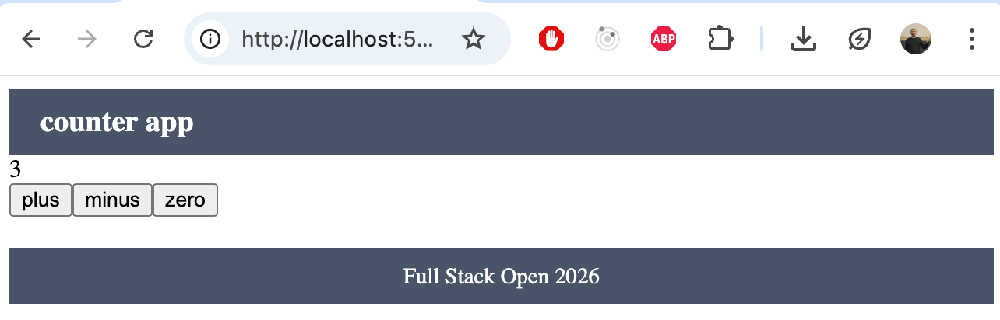
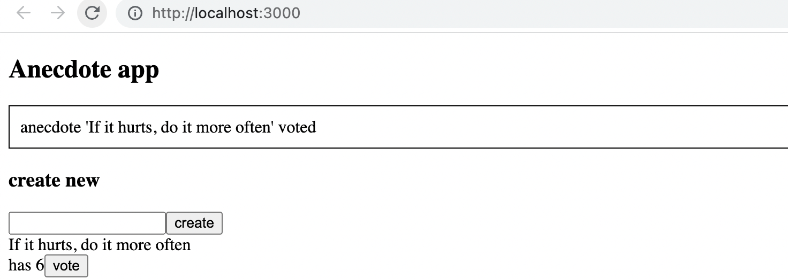

<div class="content">

في نهاية هذا الجزء، سنلقي نظرة على عدد من الطرق المختلفة الإضافية لإدارة حالة التطبيق.

دعنا نواصل العمل مع تطبيق الملاحظات. سنركز على التواصل مع الخادم. لنبدأ التطبيق من البداية. الإصدار الأول هو كما يلي:

```js
const App = () => {
  const addNote = async (event) => {
    event.preventDefault()
    const content = event.target.note.value
    event.target.reset()
    console.log(content)
  }

  const toggleImportance = (note) => {
    console.log('toggle importance of', note.id)
  }

  const notes = []

  return (
    <div>
      <h2>Notes app</h2>
      <form onSubmit={addNote}>
        <input name="note" />
        <button type="submit">add</button>
      </form>
      {notes.map((note) => (
        <li key={note.id} onClick={() => toggleImportance(note)}>
          {note.important ? <strong>{note.content}</strong> : note.content}
          <button onClick={() => toggleImportance(note.id)}>
            {note.important ? 'make not important' : 'make important'}
          </button>  
        </li>
      ))}
    </div>
  )
}

export default App
```

الكود الأولي موجود على GitHub في هذا [المستودع](https://github.com/fullstack-hy2020/query-notes/tree/part6-0)، في الفرع <i>part6-0</i>.

### إدارة البيانات على الخادم باستخدام مكتبة TanStack Query (Managing data on the server with the TanStack Query library)

سنستخدم الآن مكتبة [TanStack Query](https://tanstack.com/query/latest) لتخزين وإدارة البيانات المسترجعة من الخادم.

قم بتثبيت المكتبة بالأمر:

```bash
npm install @tanstack/react-query
```

هناك حاجة إلى بعض الإضافات على ملف <i>main.jsx</i> لتمرير دوال المكتبة إلى التطبيق بأكمله:

```js
import { createRoot } from 'react-dom/client'
import { QueryClient, QueryClientProvider } from '@tanstack/react-query' // highlight-line

import App from './App.jsx'

const queryClient = new QueryClient() // highlight-line

createRoot(document.getElementById('root')).render(
  <QueryClientProvider client={queryClient}> // highlight-line
    <App />
  </QueryClientProvider> // highlight-line
)
```

دعنا نستخدم [JSON Server](https://github.com/typicode/json-server) كما في الأجزاء السابقة لمحاكاة الواجهة الخلفية. تم تكوين JSON Server مسبقاً في المشروع النموذجي، ويحتوي جذر المشروع على ملف <i>db.json</i> يحتوي افتراضياً على ملاحظتين. يمكنك بدء تشغيل الخادم بالأمر:

```bash
npm run server
```

يمكننا الآن استرداد الملاحظات في المكوّن <i>App</i>. يتوسع الكود كما يلي:

```js
import { useQuery } from '@tanstack/react-query' // highlight-line

const App = () => {
  const addNote = async (event) => {
    event.preventDefault()
    const content = event.target.note.value
    event.target.reset()
    console.log(content)
  }

  const toggleImportance = (note) => {
    console.log('toggle importance of', note.id)
  }

  // highlight-start
  const result = useQuery({
    queryKey: ['notes'],
    queryFn: async () => {
      const response = await fetch('http://localhost:3001/notes')
      if (!response.ok) {
        throw new Error('Failed to fetch notes')
      }
      return await response.json()
    }
  })
 
  console.log(JSON.parse(JSON.stringify(result)))
 
  if (result.isPending) {
    return <div>loading data...</div>
  }
 
  const notes = result.data
  // highlight-end

  return (
    // ...
  )
}
```

يتم جلب البيانات من الخادم، كما في الفصل السابق، باستخدام دالة <i>fetch</i> من Fetch API. ومع ذلك، يتم الآن تغليف استدعاء الدالة داخل [استعلام (Query)](https://tanstack.com/query/latest/docs/react/guides/queries) تم تشكيله بواسطة دالة [useQuery](https://tanstack.com/query/latest/docs/react/reference/useQuery). يأخذ الاستدعاء لـ <i>useQuery</i> كمعامل له كائناً يحتوي على الحقلين <i>queryKey</i> و <i>queryFn</i>. قيمة حقل <i>queryKey</i> هي مصفوفة تحتوي على السلسلة النصية <i>notes</i>. وهو بمثابة [المفتاح (Key)](https://tanstack.com/query/latest/docs/react/guides/query-keys) للاستعلام المعرف، أي قائمة الملاحظات.

القيمة المرجعة لدالة <i>useQuery</i> هي كائن يشير إلى حالة الاستعلام. توضح المخرجات في الكونسول الموقف:



أي أنه في المرة الأولى التي يتم فيها تصيير المكوّن، يظل الاستعلام في حالة <i>الانتظار (Pending)</i>، أي أن طلب HTTP المقترن به قيد الانتظار. في هذه المرحلة، يتم تصيير ما يلي فقط:

```html
<div>loading data...</div>
```

ومع ذلك، يكتمل طلب HTTP بسرعة فائقة لدرجة أنه حتى ماكس فيرستابين لن يتمكن من رؤية هذا النص. عند اكتمال الطلب، يتم تصيير المكوّن مرة أخرى. ويكون الاستعلام في حالة <i>النجاح (Success)</i> في التصيير الثاني، ويحتوي الحقل <i>data</i> لكائن الاستعلام على البيانات التي أرجعها الطلب، أي قائمة الملاحظات التي يتم تصييرها على الشاشة.

وبالتالي يسترجع التطبيق البيانات من الخادم ويصيّرها على الشاشة دون استخدام خطافي React وهما <i>useState</i> و <i>useEffect</i> المستخدمين في الفصول 2-5 على الإطلاق. أصبحت البيانات الموجودة على الخادم الآن بالكامل تحت إدارة مكتبة TanStack Query، ولا يحتاج التطبيق إلى الحالة المعرفة بواسطة خطاف React المسمى <i>useState</i> على الإطلاق!

دعنا ننقل الدالة التي تجري طلب HTTP الفعلي إلى ملفها الخاص <i>src/requests.js</i>:

```js
const baseUrl = 'http://localhost:3001/notes'

export const getNotes = async () => {
  const response = await fetch(baseUrl)
  if (!response.ok) {
    throw new Error('Failed to fetch notes')
  }
  return await response.json()
}
```

يصبح المكوّن <i>App</i> الآن مبسطاً قليلاً:

```js
import { useQuery } from '@tanstack/react-query' 
import { getNotes } from './requests' // highlight-line

const App = () => {
  // ...

  const result = useQuery({
    queryKey: ['notes'],
    queryFn: getNotes // highlight-line
  })

  // ...
}
```

الكود الحالي للتطبيق موجود في [GitHub](https://github.com/fullstack-hy2020/query-notes/tree/part6-1) في الفرع <i>part6-1</i>.

### مزامنة البيانات مع الخادم باستخدام TanStack Query (Synchronizing data to the server using TanStack Query)

تم بالفعل استرداد البيانات بنجاح من الخادم. بعد ذلك، سنتأكد من حفظ البيانات المضافة والمعدلة على الخادم. لنبدأ بإضافة ملاحظات جديدة.

دعنا ننشئ دالة <i>createNote</i> في الملف <i>requests.js</i> لحفظ الملاحظات الجديدة:

```js
const baseUrl = 'http://localhost:3001/notes'

export const getNotes = async () => {
  const response = await fetch(baseUrl)
  if (!response.ok) {
    throw new Error('Failed to fetch notes')
  }
  return await response.json()
}

// highlight-start
export const createNote = async (newNote) => {
  const options = {
    method: 'POST',
    headers: { 'Content-Type': 'application/json' },
    body: JSON.stringify(newNote)
  }
 
  const response = await fetch(baseUrl, options)
 
  if (!response.ok) {
    throw new Error('Failed to create note')
  }
 
  return await response.json()
}
// highlight-end
```

سيتغير المكوّن <i>App</i> كما يلي:

```js
import { useQuery, useMutation } from '@tanstack/react-query' // highlight-line
import { getNotes, createNote } from './requests' // highlight-line

const App = () => {
  //highlight-start
  const newNoteMutation = useMutation({
    mutationFn: createNote,
  })
  // highlight-end

  const addNote = async (event) => {
    event.preventDefault()
    const content = event.target.note.value
    event.target.reset()
    newNoteMutation.mutate({ content, important: true }) // highlight-line
  }

  // ...
}
```

لإنشاء ملاحظة جديدة، يتم تعريف [طفرة (Mutation)](https://tanstack.com/query/latest/docs/react/guides/mutations) باستخدام دالة [useMutation](https://tanstack.com/query/latest/docs/react/reference/useMutation):

```js
const newNoteMutation = useMutation({
  mutationFn: createNote,
})
```

المعامل هو الدالة التي أضفناها إلى الملف <i>requests.js</i>، والتي تستخدم Fetch API لإرسال ملاحظة جديدة إلى الخادم.

يقوم معالج الأحداث <i>addNote</i> بتنفيذ الطفرة عن طريق استدعاء الدالة <i>mutate</i> الخاصة بكائن الطفرة وتمرير الملاحظة الجديدة كمعامل:

```js
newNoteMutation.mutate({ content, important: true })
```

حلنا جيد. باستثناء أنه لا يعمل بالكامل بالشكل المرئي المطلوب. يتم حفظ الملاحظة الجديدة على الخادم، ولكن لا يتم تحديثها على الشاشة.

من أجل تصيير الملاحظة الجديدة أيضاً، نحتاج إلى إخبار TanStack Query بضرورة [إبطال صلاحية (Invalidate)](https://tanstack.com/query/latest/docs/react/guides/invalidations-from-mutations) النتيجة القديمة للاستعلام الذي يحمل المفتاح <i>notes</i>.

لحسن الحظ، فإن إبطال الصلاحية أمر سهل، ويمكن القيام به من خلال تحديد دالة رد نداء (Callback function) مناسبة <i>onSuccess</i> للطفرة:

```js
import { useQuery, useMutation, useQueryClient } from '@tanstack/react-query' // highlight-line
import { getNotes, createNote } from './requests'

const App = () => {
  const queryClient = useQueryClient() // highlight-line

  const newNoteMutation = useMutation({
    mutationFn: createNote,
    onSuccess: () => {  // highlight-line
      queryClient.invalidateQueries({ queryKey: ['notes'] }) // highlight-line
    }, // highlight-line
  })

  // ...
}
```

الآن بعد تنفيذ الطفرة بنجاح، يتم استدعاء الدالة:

```js
queryClient.invalidateQueries({ queryKey: ['notes'] })
```

وهذا بدوره يجعل TanStack Query يقوم تلقائياً بتحديث الاستعلام الذي يحمل المفتاح <i>notes</i>، أي جلب الملاحظات الحديثة من الخادم. نتيجة لذلك، يصيّر التطبيق الحالة المحدثة على الخادم، أي يتم تصيير الملاحظة المضافة أيضاً.

دعنا ننفذ أيضاً التغيير في أهمية الملاحظات. تتم إضافة دالة لتحديث الملاحظات إلى الملف <i>requests.js</i>:

```js
export const updateNote = async (updatedNote) => {
  const options = {
    method: 'PUT',
    headers: { 'Content-Type': 'application/json' },
    body: JSON.stringify(updatedNote)
  }

  const response = await fetch(`${baseUrl}/${updatedNote.id}`, options)

  if (!response.ok) {
    throw new Error('Failed to update note')
  }

  return await response.json()
}
```

يتم تحديث الملاحظة أيضاً بواسطة طفرة (Mutation). يتوسع المكوّن <i>App</i> كما يلي:

```js
import { useQuery, useMutation, useQueryClient } from '@tanstack/react-query'
import { getNotes, createNote, updateNote } from './requests' // highlight-line

const App = () => {
  const queryClient = useQueryClient()

  const newNoteMutation = useMutation({
    mutationFn: createNote,
    onSuccess: () => {
      queryClient.invalidateQueries({ queryKey: ['notes'] })
    }
  })

  // highlight-start
  const updateNoteMutation = useMutation({
    mutationFn: updateNote,
    onSuccess: () => {
      queryClient.invalidateQueries({ queryKey: ['notes'] })
    }
  })
  // highlight-end

  const addNote = async (event) => {
    event.preventDefault()
    const content = event.target.note.value
    event.target.reset()
    newNoteMutation.mutate({ content, important: true })
  }

  const toggleImportance = (note) => {
    updateNoteMutation.mutate({...note, important: !note.important }) // highlight-line
  }

  // ...
}
```

مرة أخرى، تبطل الطفرة التي أنشأناها استعلام الملاحظات بحيث يتم تصيير الملاحظة المحدثة بشكل صحيح. استخدام الطفرات سهل، وتستقبل الدالة <i>mutate</i> ملاحظة كمعامل، حيث تم تغيير أهميتها إلى نفي القيمة القديمة.

الكود الحالي للتطبيق موجود على [GitHub](https://github.com/fullstack-hy2020/query-notes/tree/part6-2) في الفرع <i>part6-2</i>.

### تحسين الأداء (Optimizing the performance)

يعمل التطبيق بشكل جيد، والكود بسيط نسبياً. إن سهولة إجراء التغييرات على قائمة الملاحظات مدهشة بشكل خاص. على سبيل المثال، عندما نغير أهمية ملاحظة ما، فإن إبطال الاستعلام <i>notes</i> يكفي لتحديث بيانات التطبيق:

```js
const updateNoteMutation = useMutation({
  mutationFn: updateNote,
  onSuccess: () => {
    queryClient.invalidateQueries({ queryKey: ['notes'] }) // highlight-line
  }
})
```

ونتيجة لذلك بالطبع، بعد طلب PUT الذي يتسبب في تغيير الملاحظة، يقوم التطبيق بإجراء طلب GET جديد لاسترداد بيانات الاستعلام من الخادم:



إذا لم تكن كمية البيانات التي يسترجعها التطبيق كبيرة، فلن يهم ذلك حقاً. فمن وجهة نظر وظائف المتصفح، لا يشكل إجراء طلب HTTP GET إضافي فرقاً كبيراً، ولكن في بعض الحالات قد يمثل ذلك عبئاً وضغطاً على الخادم.

إذا لزم الأمر، فمن الممكن أيضاً تحسين الأداء [عن طريق التحديث اليدوي](https://tanstack.com/query/latest/docs/react/guides/updates-from-mutation-responses) لحالة الاستعلام التي تحتفظ بها TanStack Query في الذاكرة المؤقتة (Cache).

التغيير للطفرة التي تضيف ملاحظة جديدة هو كما يلي:

```js
const App = () => {
  const queryClient = useQueryClient()

  const newNoteMutation = useMutation({
    mutationFn: createNote,
    // highlight-start
    onSuccess: (newNote) => {
      const notes = queryClient.getQueryData(['notes'])
      queryClient.setQueryData(['notes'], notes.concat(newNote))
    // highlight-end
    }
  })

  // ...
}
```

أي أنه في رد نداء <i>onSuccess</i>، يقرأ كائن <i>queryClient</i> أولاً حالة <i>notes</i> الحالية للاستعلام ويحدثها عن طريق إضافة ملاحظة جديدة، والتي يتم الحصول عليها كمعامل لدالة رد النداء. قيمة المعامل هي القيمة التي تُرجعها الدالة <i>createNote</i>، المحددة في الملف <i>requests.js</i> كما يلي:

```js
export const createNote = async (newNote) => {
  const options = {
    method: 'POST',
    headers: { 'Content-Type': 'application/json' },
    body: JSON.stringify(newNote)
  }

  const response = await fetch(baseUrl, options)

  if (!response.ok) {
    throw new Error('Failed to create note')
  }

  return await response.json() // highlight-line
}
```

سيكون من السهل نسبياً إجراء تغيير مماثل لطفرة تغير أهمية الملاحظة، لكننا نترك ذلك كتمرين اختياري.

أخيراً، لاحظ تفصيلاً مثيراً للاهتمام. يقوم TanStack Query بإعادة جلب جميع الملاحظات عندما ننتقل إلى علامة تبويب أخرى في المتصفح ثم نعود إلى علامة تبويب التطبيق. يمكن ملاحظة ذلك في تبويب الشبكة (Network) في كونسول المطور:


ما الذي يحدث هنا؟ من خلال قراءة [الوثائق الرسمية](https://tanstack.com/query/latest/docs/react/reference/useQuery)، نلاحظ أن الوظيفة الافتراضية لاستعلامات TanStack Query هي أن الاستعلامات (التي تكون حالتها <i>stale</i> أي قديمة) يتم تحديثها عند تغير <i>تركيز النافذة (Window focus)</i>. إذا أردنا، يمكننا إيقاف تشغيل هذه الوظيفة عن طريق إنشاء استعلام كما يلي:

```js
const App = () => {
  // ...
  const result = useQuery({
    queryKey: ['notes'],
    queryFn: getNotes,
    refetchOnWindowFocus: false // highlight-line
  })

  // ...
}
```

إذا وضعت عبارة console.log في الكود، يمكنك أن ترى من كونسول المتصفح عدد المرات التي يتسبب فيها TanStack Query في إعادة تصيير التطبيق. القاعدة العامة هي أن إعادة التصيير تحدث على الأقل كلما دعت الحاجة إلى ذلك، أي عندما تتغير حالة الاستعلام. يمكنك قراءة المزيد حول ذلك على سبيل المثال [هنا](https://tkdodo.eu/blog/react-query-render-optimizations).

### خطاف التخصيص useNotes (useNotes custom hook)

حلنا جيد إلى حد ما، ولكن الأمر المزعج إلى حد ما هو حقيقة أنه تم وضع العديد من تفاصيل تنفيذ TanStack Query مباشرة داخل مكوّن React. دعنا نستخرج هذه التفاصيل في دالة خطاف تخصيص خاصة بها:

```js
import { useQuery, useMutation, useQueryClient } from '@tanstack/react-query'
import { getNotes, createNote, updateNote } from '../requests'

export const useNotes = () => {
  const queryClient = useQueryClient()

  const result = useQuery({
    queryKey: ['notes'],
    queryFn: getNotes,
    refetchOnWindowFocus: false
  })

  const newNoteMutation = useMutation({
    mutationFn: createNote,
    onSuccess: (newNote) => {
      const notes = queryClient.getQueryData(['notes'])
      queryClient.setQueryData(['notes'], notes.concat(newNote))
    }
  })

  const updateNoteMutation = useMutation({
    mutationFn: updateNote,
    onSuccess: () => {
      queryClient.invalidateQueries({ queryKey: ['notes'] })
    }
  })

  return {
    notes: result.data,
    isPending: result.isPending,
    addNote: (content) => newNoteMutation.mutate({ content, important: true }),
    toggleImportance: (note) => updateNoteMutation.mutate({ 
      ...note, important: !note.important 
    }),
  }
}
```

تغلف دالة الخطاف جميع الأكواد البرمجية المتعلقة بـ TanStack Query: الاستعلام لجلب الملاحظات وكلا الطفرتين لإنشاء وتحديث الملاحظات. يتم إخفاء تفاصيل التنفيذ هذه عن مستخدم الخطاف، حيث تُرجع الدالة كائناً بسيطاً يحتوي على:

- <i>notes</i>: قائمة الملاحظات.
- <i>isPending</i>: ما إذا كانت البيانات لا تزال قيد التحميل.
- <i>addNote</i>: دالة لإضافة ملاحظة جديدة باستخدام نص المحتوى فقط.
- <i>toggleImportance</i>: دالة لتبديل أهمية الملاحظة.

يتم تبسيط المكوّن <i>App</i> بشكل كبير:

```js
import { useNotes } from './hooks/useNotes'

const App = () => {
  const { notes, isPending, addNote: addNoteToServer, toggleImportance } = useNotes()

  const addNote = async (event) => {
    event.preventDefault()
    const content = event.target.note.value
    event.target.reset()
    addNoteToServer(content)
  }

  if (isPending) {
    return <div>loading data...</div>
  }

  return (
    <div>
      <h2>Notes app</h2>
      <form onSubmit={addNote}>
        <input name="note" />
        <button type="submit">add</button>
      </form>
      {notes.map((note) => (
        <li key={note.id}>
          {note.important ? <strong>{note.content}</strong> : note.content}
          <button onClick={() => toggleImportance(note)}>
            {note.important ? 'make not important' : 'make important'}
          </button>
        </li>
      ))}
    </div>
  )
}
```

كود التطبيق موجود على [GitHub](https://github.com/fullstack-hy2020/query-notes/tree/part6-3) في الفرع <i>part6-3</i>.

إن TanStack Query هي مكتبة متعددة الاستخدامات تعمل، بناءً على ما رأيناه بالفعل، على تبسيط التطبيق. هل تجعل TanStack Query حلول إدارة الحالة الأكثر تعقيداً مثل Zustand غير ضرورية؟ لا. يمكن لـ TanStack Query أن تحل جزئياً محل حالة التطبيق في بعض الحالات، ولكن كما تنص [الوثائق الرسمية](https://tanstack.com/query/latest/docs/react/guides/does-this-replace-client-state):

- إن TanStack Query هي <i>مكتبة لحالة الخادم (Server-state library)</i>، مسؤولة عن إدارة العمليات غير المتزامنة بين الخادم والعميل.
- تُعد Zustand وما شابهها <i>مكتبات لحالة العميل (Client-state libraries)</i> يمكن استخدامها لتخزين البيانات غير المتزامنة، وإن كان ذلك بشكل غير فعال بالمقارنة مع أداة متخصصة مثل TanStack Query.

وبالتالي، فإن TanStack Query هي مكتبة تحافظ على <i>حالة الخادم</i> في الواجهة الأمامية، أي تعمل كذاكرة تخزين مؤقت (Cache) لما يتم تخزينه على الخادم. تعمل TanStack Query على تبسيط معالجة البيانات على الخادم، ويمكنها في بعض الحالات التخلص من الحاجة إلى حفظ بيانات الخادم في حالة الواجهة الأمامية.

تحتاج معظم تطبيقات React ليس فقط إلى طريقة لتخزين البيانات المجلوبة مؤقتاً، ولكن أيضاً إلى حل لكيفية التعامل مع بقية حالة الواجهة الأمامية (مثل حالة النماذج أو الإشعارات).

</div>

<div class="tasks">

### التمارين 6.16.-6.19.

دعنا ننشئ الآن نسخة جديدة من تطبيق الطرائف تستخدم مكتبة TanStack Query. خذ [هذا المشروع](https://github.com/fullstack-hy2020/query-anecdotes) كنقطة بداية لك. يحتوي المشروع على خادم JSON جاهز ومثبت مسبقاً، وقد تم تعديل تشغيله قليلاً (راجع ملف _server.js_ لمزيد من التفاصيل. وتأكد من اتصالك بالمنفذ _PORT_ الصحيح). ابدأ تشغيل الخادم بالأمر <i>npm run server</i>.

استخدم Fetch API لإجراء الطلبات.

#### التمرين 6.16

نفّذ استرداد الطرائف من الخادم باستخدام TanStack Query.

يجب أن يعمل التطبيق بطريقة تجعل من تعذر الاتصال بالخادم يعرض صفحة خطأ فقط:



يمكنك العثور [هنا](https://tanstack.com/query/latest/docs/react/guides/queries) على معلومات حول كيفية اكتشاف الأخطاء المحتملة.

يمكنك محاكاة مشكلة في الخادم عن طريق إيقاف تشغيل JSON Server مثلاً. يرجى ملاحظة أنه في حالة وجود مشكلة، يكون الاستعلام أولاً في حالة <i>isPending</i> لفترة من الوقت، لأنه إذا فشل الطلب، فإن TanStack Query يحاول إعادة إرسال الطلب عدة مرات قبل أن يقرر أن الطلب غير ناجح. يمكنك اختيارياً تحديد عدم إجراء أي محاولات إعادة:

```js
const result = useQuery(
  {
    queryKey: ['anecdotes'],
    queryFn: getAnecdotes,
    retry: false
  }
)
```

أو تحديد إعادة محاولة الطلب مرة واحدة فقط مثلاً:

```js
const result = useQuery(
  {
    queryKey: ['anecdotes'],
    queryFn: getAnecdotes,
    retry: 1
  }
)
```

#### التمرين 6.17

نفّذ إضافة طرائف جديدة إلى الخادم باستخدام TanStack Query. يجب أن يصيّر التطبيق طريفة جديدة بشكل افتراضي. لاحظ أن محتوى الطريفة يجب أن يتكون من 5 أحرف على الأقل، وإلا سيرفض الخادم طلب POST. لا داعي للقلق بشأن معالجة الأخطاء الآن.

#### التمرين 6.18

نفّذ التصويت على الطرائف باستخدام TanStack Query مرة أخرى. يجب أن يصيّر التطبيق تلقائياً العدد المتزايد من الأصوات للطريفة التي تم التصويت عليها.

#### التمرين 6.19

استخرج تفاصيل TanStack Query في دالة خطاف تخصيص (Custom hook).

</div>

<div class="content">

### واجهة سياق ريأكت (Context API)

دعنا نعود إلى تطبيق العداد الكلاسيكي. يتم تعريف التطبيق كما يلي:

```js
import { useState } from 'react'
import Display from './components/Display'
import Controls from './components/Controls'

const App = () => {
  const [counter, setCounter] = useState(0)

  return (
    <div>
      <Display counter={counter} />
      <Controls counter={counter} setCounter={setCounter} />
    </div>
  )
}
```

يحدد المكوّن <i>App</i> حالة التطبيق ويمررها إلى مكوّن <i>Display</i>، الذي يصيّر قيمة العداد:

```js
const Display = ({ counter }) => {

  return (
    <div>{counter}</div>
  )
}
```

وإلى مكوّن <i>Controls</i>، الذي يصيّر الأزرار:

```js
const Controls = ({ counter, setCounter }) => {
  const increment = () => setCounter(counter + 1)
  const decrement = () => setCounter(counter - 1)
  const zero = () => setCounter(0)

  return (
    <div>
      <button onClick={increment}>plus</button>
      <button onClick={decrement}>minus</button>
      <button onClick={zero}>zero</button>
    </div>
  )
}
```

ينمو التطبيق ويتوسع:



يتغير دور المكوّن <i>App</i>: حيث يظل محتفظاً بحالة التطبيق، لكنه لم يعد يصيّر المكونات التي تستخدم حالة العداد مباشرة:

```js
const App = () => {
  const [counter, setCounter] = useState(0)

  return (
    <div>
      <Navbar />
      <Panel counter={counter} setCounter={setCounter} />
      <Footer />
    </div>
  )
}
```

المكوّن الجديد <i>Panel</i> مسؤول عن تصيير المكونات التي تعرض العداد والأزرار:

```js
import Display from './Display'
import Controls from './Controls'

const Panel = ({ counter, setCounter }) => {
  return (
    <div>
      <Display counter={counter} />
      <Controls counter={counter} setCounter={setCounter} />
    </div>
  )
}
```

التسلسل الهرمي لمكونات التطبيق هو كما يلي:

```
App (state)
 ├── Panel 
 │    ├── Display
 │    └── Controls
 └── Footer
```

لا تزال حالة التطبيق موجودة في المكوّن <i>App</i>. للسماح لـ <i>Display</i> و <i>Controls</i> بالوصول إلى حالة العداد، يجب تمرير الحالة ودالة التحديث الخاصة بها كخصائص عبر مكوّن <i>Panel</i>، على الرغم من أن <i>Panel</i> نفسه لا يحتاج إليها. ينشأ هذا النوع من المواقف بسهولة عند استخدام الحالة المنشأة باستخدام خطاف <i>useState</i>. تسمى هذه الظاهرة [الحفر عبر الخصائص (Prop drilling)](https://kentcdodds.com/blog/prop-drilling).

تقدم واجهة [Context API](https://react.dev/learn/passing-data-deeply-with-context) المدمجة في React حلاً لهذه المشكلة. سياق React هو نوع من الحالة العامة للتطبيق، مما يسمح لأي مكوّن بالوصول المباشر إليها.

دعنا ننشئ الآن سياقاً في التطبيق يخزن إدارة حالة العداد.

يتم إنشاء السياق باستخدام دالة المصنع [createContext](https://react.dev/reference/react/createContext) من React. دعنا ننشئ السياق في ملف <i>src/CounterContext.jsx</i>:

```js
import { createContext } from 'react'

const CounterContext = createContext()

export default CounterContext
```

يمكن للمكوّن <i>App</i> الآن <i>توفير</i> السياق لمكوناته الفرعية كما يلي:

```js
// ...
import CounterContext from './components/CounterContext'

const App = () => {
  const [counter, setCounter] = useState(0)

  return (
    <CounterContext.Provider value={{counter, setCounter}}> // highlight-line
      <Panel /> // highlight-line
      <Footer />
    </CounterContext.Provider> // highlight-line
  )
}
```

يتم توفير السياق عن طريق تغليف المكونات الفرعية داخل مكوّن <i>CounterContext.Provider</i> وتعيين قيمة مناسبة للسياق.

قيمة السياق هي الآن كائن يحتوي على السمتين <i>counter</i> و <i>setCounter</i>، أي حالة العداد والدالة التي تقوم بتحديثه.

لاحظ أن مكوّن <i>Panel</i> لم يعد يستقبل أي خصائص متعلقة بالعداد، لذا يتم تبسيطه إلى:

```js
const Panel = () => {
  return (
    <div>
      <Display />
      <Controls />
    </div>
  )
}
```

يمكن للمكونات الأخرى الآن الوصول إلى السياق باستخدام خطاف [useContext](https://react.dev/reference/react/useContext). يتغير المكوّن <i>Display</i> كما يلي:

```js
import { useContext } from 'react' // highlight-line
import CounterContext from './CounterContext' // highlight-line

const Display = () => {  // highlight-line
  const { counter } = useContext(CounterContext) // highlight-line

  return <div>{counter}</div>
}
```

لم يعد المكوّن <i>Display</i> بحاجة إلى أي خصائص. فهو يحصل على قيمة العداد عن طريق استدعاء خطاف <i>useContext</i> مع كائن <i>CounterContext</i> كمعامل له.

وبالمثل، يتغير مكوّن <i>Controls</i> إلى:

```js
import { useContext } from 'react' // highlight-line
import CounterContext from './CounterContext' // highlight-line

const Controls = () => {
  const { counter, setCounter } = useContext(CounterContext) // highlight-line

  const increment = () => setCounter(counter + 1)
  const decrement = () => setCounter(counter - 1)
  const zero = () => setCounter(0)

  return (
    <div>
      <button onClick={increment}>plus</button>
      <button onClick={decrement}>minus</button>
      <button onClick={zero}>zero</button>
    </div>
  )
}

export default Controls
```

تتمتع المكونات الآن بإمكانية الوصول إلى المحتوى الذي حدده مزود السياق، وهو حالة العداد ودالة التحديث الخاصة به.

تستخرج المكونات السمات التي تحتاجها باستخدام صيغة تفكيك الكائنات في جافاسكريبت:

```js
const { counter } = useContext(CounterContext)
```

### تعريف سياق العداد في ملف منفصل (Defining the counter context in its own file)

لا يزال تطبيقنا يحتوي على ميزة غير محببة وهي أن وظيفة إدارة حالة العداد محددة داخل المكوّن <i>App</i>. دعنا ننقل جميع الأكواد المتعلقة بالعداد إلى الملف <i>CounterContext.jsx</i>:

```js
import { createContext, useState } from 'react'

const CounterContext = createContext()

export default CounterContext

// highlight-start
export const CounterContextProvider = (props) => {
  const [counter, setCounter] = useState(0)

  return (
    <CounterContext.Provider value={{ counter, setCounter }}>
      {props.children}
    </CounterContext.Provider>
  )
}
// highlight-end
```

يصدّر الملف الآن كلاً من كائن <i>CounterContext</i> ومكوّن <i>CounterContextProvider</i>، وهو في الأساس مزود سياق تحتوي قيمته على العداد ودالة التحديث الخاصة به.

دعنا نستخدم مزود السياق مباشرة في الملف <i>main.jsx</i>:

```js
import { StrictMode } from 'react'
import { createRoot } from 'react-dom/client'

import App from './App'
import { CounterContextProvider } from './CounterContext' // highlight-line

createRoot(document.getElementById('root')).render(
  <CounterContextProvider> // highlight-line
    <App />
  </CounterContextProvider> // highlight-line
)
```

الآن أصبح السياق الذي يحدد قيمة العداد ووظائفه متاحاً لـ <i>جميع</i> المكونات في التطبيق.

يتم تبسيط المكوّن <i>App</i> إلى:

```js
import Panel from './components/Panel'
import Footer from './components/Footer'

const App = () => {

  return (
    <div>
      <Navbar />
      <Panel />
      <Footer />
  </div>
  )
}

export default App
```

لا يزال السياق مستخدماً بنفس الطريقة، وليست هناك حاجة لإجراء أي تغييرات على المكونات الأخرى. على سبيل المثال، يظل <i>Controls</i> كما هو:

```js
const Controls = () => {
  const { counter, setCounter } = useContext(CounterContext)
  const increment = () => setCounter(counter + 1)
  const decrement = () => setCounter(counter - 1)
  const zero = () => setCounter(0)

  return (
    <div>
      <button onClick={increment}>plus</button>
      <button onClick={decrement}>minus</button>
      <button onClick={zero}>zero</button>
    </div>
  )
}
```

الحل جيد جداً. أصبحت حالة التطبيق بأكملها، أي قيمة العداد، معزولة الآن في ملف <i>CounterContext</i>. تصل المكونات إلى الجزء الذي تحتاجه بالضبط من السياق باستخدام خطاف <i>useContext</i> وصيغة التفكيك في جافاسكريبت.

دعنا نجري تحسيناً صغيراً إضافياً ونحدد أيضاً دوال تحديث العداد <i>increment</i> و <i>decrement</i> و <i>zero</i> داخل السياق:

```js
import { createContext, useState } from 'react'

const CounterContext = createContext()

export default CounterContext

export const CounterContextProvider = (props) => {
  const [counter, setCounter] = useState(0)

// highlight-start
  const increment = () => setCounter(counter + 1)
  const decrement = () => setCounter(counter - 1)
  const zero = () => setCounter(0)
// highlight-end

  return (
    <CounterContext.Provider value={{ counter, increment, decrement, zero }}> // highlight-line
      {props.children}
    </CounterContext.Provider>
  )
}
```

الآن يمكننا استخدام الدوال التي تم الحصول عليها من السياق مباشرة كمعالجات لأحداث الأزرار:

```js
import { useContext } from 'react'
import CounterContext from '../CounterContext' 

const Controls = () => {
  const { increment, decrement, zero } = useContext(CounterContext) // highlight-line

  return (
    <div>
      <button onClick={increment}>plus</button>
      <button onClick={decrement}>minus</button>
      <button onClick={zero}>zero</button>
    </div>
  )
}
```

لا يزال هناك مجال لتحسين إضافي. إذا نظرنا إلى كيفية استخدام سياق العداد، نلاحظ أن نفس الكود النمطي يتكرر في كلا المكونين اللذين يستهلكانه:

```js
import { useContext } from 'react'
import CounterContext from '../CounterContext' 

const Display = () => {
  const { counter } = useContext(CounterContext)
  // ...
}
```

```js
import { useContext } from 'react'
import CounterContext from '../CounterContext' 

const Controls = () => {
  const { increment, decrement, zero } = useContext(CounterContext) // highlight-line
  // ...
}
```

يمكننا أخذ الحل خطوة إلى الأمام من خلال إنشاء خطاف مخصص يُرجع السياق مباشرة. دعنا نضيفه إلى الملف <i>hooks/useCounter.js</i>:

```js
import { useContext } from 'react'
import CounterContext from '../CounterContext'

const useCounter = () => useContext(CounterContext)

export default useCounter
```

أصبح استخدام السياق الآن أبسط بخطوة:

```js
import useCounter from '../hooks/useCounter'

const Display = () => {
  const { counter } = useCounter()
  // ...
}

import useCounter from '../hooks/useCounter'

const Controls = () => {
  const { increment, decrement, zero } = useCounter()
  // ...
}
```

نحن راضون عن هذا الحل. فهو يعزل إدارة الحالة بالكامل داخل السياق. المكونات التي تستخدم الحالة ليس لديها أي معرفة بكيفية تنفيذ الحالة — وبفضل الخطاف المخصص، فإنها لا تدرك حتى أن الحل يعتمد على Context API.

كود التطبيق موجود في مستودع GitHub [https://github.com/fullstack-hy2020/context-counter](https://github.com/fullstack-hy2020/context-counter).

</div>

<div class="tasks">

### التمارين 6.20.-6.22.

#### التمرين 6.20.

يحتوي التطبيق على مكوّن <i>Notification</i> لعرض الإشعارات للمستخدم.

نفّذ إدارة حالة الإشعارات في التطبيق باستخدام Context API. يجب أن يخبر الإشعار المستخدم عند إنشاء طريفة جديدة أو عند التصويت على طريفة:



يتم عرض الإشعار لمدة خمس ثوانٍ.

#### التمرين 6.21.

كما هو مذكور في التمرين 6.17، يتطلب الخادم أن يكون محتوى الطريفة المراد إضافتها بطول 5 أحرف على الأقل. قم الآن بتنفيذ معالجة الأخطاء لعملية الإدراج. من الناحية العملية، يكفي عرض إشعار للمستخدم في حالة فشل طلب POST:


يجب معالجة حالة الخطأ في دالة رد النداء المسجلة لها، راجع [هنا](https://tanstack.com/query/latest/docs/react/reference/useMutation) لمعرفة كيفية تسجيل دالة.

#### التمرين 6.22.

إذا لم تكن قد قمت بذلك بالفعل، فانقل السياق المتعلق بالإشعار إلى ملفه الخاص <i>NotificationContext.jsx</i>، بنفس الطريقة التي تم بها نقل سياق تطبيق العداد إلى <i>CounterContext.jsx</i> في المادة التعليمية. وأنشئ أيضاً خطافاً مخصصاً <i>useNotify</i> يغلف منطق الإشعار. قم بتبسيط المكونات التي تستخدم الإشعار بحيث تستدعي الخطاف مباشرة بدلاً من استدعاء <i>useContext</i> بشكل منفصل.

كان هذا التمرين الأخير في هذا الجزء من الدورة التدريبية، وحان الوقت لدفع الكود إلى GitHub وتحديد جميع التمارين المكتملة في [نظام تسليم التمارين](https://studies.cs.helsinki.fi/stats/courses/fullstackopen).

</div>

<div class="content">

### ما هو حل إدارة الحالة الذي يجب اختياره؟ (Which state management solution to choose?)

في الفصول 1-5، تمت معالجة جميع عمليات إدارة الحالة في التطبيق باستخدام خطاف <i>useState</i> في React. تطلبت الاستدعاءات غير المتزامنة للواجهة الخلفية استخدام خطاف <i>useEffect</i> في بعض المواقف. من حيث المبدأ، لا توجد حاجة إلى أي شيء آخر.

المشكلة الدقيقة في الحلول القائمة على الحالة التي تم إنشاؤها باستخدام خطاف <i>useState</i> هي أنه إذا كانت هناك حاجة إلى جزء من حالة التطبيق بواسطة مكونات متعددة، فيجب تمرير الحالة والدوال اللازمة لمعالجتها عبر الخصائص (Props) إلى جميع المكونات التي تتعامل مع تلك الحالة. في بعض الأحيان يلزم تمرير الخصائص عبر مكونات متعددة، وقد لا تكون المكونات الموجودة على طول الطريق مهتمة بالحالة بأي شكل من الأشكال. تسمى هذه الظاهرة المزعجة إلى حد ما <i>الحفر عبر الخصائص (Prop drilling)</i>.

على مر السنين، تم تطوير العديد من الحلول البديلة لإدارة الحالة في تطبيقات React، والتي يمكن استخدامها للتخفيف من المواقف الإشكالية مثل الحفر عبر الخصائص. ومع ذلك، لم يكن هناك حل "نهائي ومطلق" — فجميع الحلول لها إيجابياتها وسلبياتها، ويتم تطوير حلول جديدة طوال الوقت.

قد يربك هذا الموقف المبتدئ وحتى مطور الويب ذي الخبرة. ما هو الحل الذي ينبغي استخدامه؟

بالنسبة للتطبيقات البسيطة، يُعد <i>useState</i> بالتأكيد نقطة انطلاق ممتازة. وإذا كان التطبيق يتصل بخادم، فيمكن التعامل مع الاتصال بنفس الطريقة كما في الفصول 1-5، باستخدام حالة التطبيق الخاصة. ومع ذلك، أصبح من الشائع مؤخراً نقل الاتصال وإدارة الحالة المرتبطة به جزئياً على الأقل تحت سيطرة TanStack Query (أو أي مكتبة أخرى مماثلة). إذا كنت قلقاً بشأن useState والحفر عبر الخصائص الذي يستلزمه، فقد يكون استخدام السياق (Context) خياراً جيداً. وهناك أيضاً مواقف قد يكون من المنطقي فيها معالجة بعض الحالة باستخدام useState والبعض الآخر باستخدام السياقات.

لفترة طويلة، كان حل إدارة الحالة الأكثر شعبية وشمولاً هو Redux، وهي طريقة لتنفيذ ما يُسمى بمعمارية [Flux](https://facebookarchive.github.io/flux/). ومع ذلك، تشتهر Redux بتعقيدها ووفرة الشيفرات المتكررة (Boilerplate)، وهو ما كان الدافع وراء حلول إدارة الحالة الأحدث. في هذه المادة التعليمية، تم استبدال Redux بمكتبة [Zustand](https://zustand.docs.pmnd.rs/)، والتي توفر وظائف مكافئة مع واجهة برمجة تطبيقات أبسط بكثير. أصبحت Zustand خياراً شائعاً خاصة عندما تحتاج إلى أكثر مما يقدمه useState، ولكن آليات Redux الكاملة تبدو مفرطة وثقيلة. لقد أصبحت بعض الانتقادات الموجهة إلى جمود Redux قديمة بفضل [Redux Toolkit](https://redux-toolkit.js.org/)، ولا تزال Redux مستخدمة على نطاق واسع، خاصة في المشاريع الأكبر حجماً.

ليس من الضروري استخدام Zustand أو Redux في جميع أنحاء التطبيق بالكامل. فقد يكون من المنطقي، على سبيل المثال، إدارة حالة النماذج خارجها، خاصة في الحالات التي لا تؤثر فيها حالة النموذج على بقية التطبيق. كما أن استخدام Zustand أو Redux جنباً إلى جنب مع TanStack Query في نفس التطبيق أمر ممكن تماماً وشائع للغاية.

إن مسألة اختيار حل إدارة الحالة ليست مباشرة على الإطلاق. من المستحيل تقديم إجابة صحيحة واحدة تناسب الجميع، ومن المرجح أيضاً أن يتضح أن الحل المختار ليس مثالياً مع نمو التطبيق، مما يتطلب تغيير النهج حتى لو تم وضع التطبيق بالفعل في بيئة الإنتاج الفعلية.

</div>
