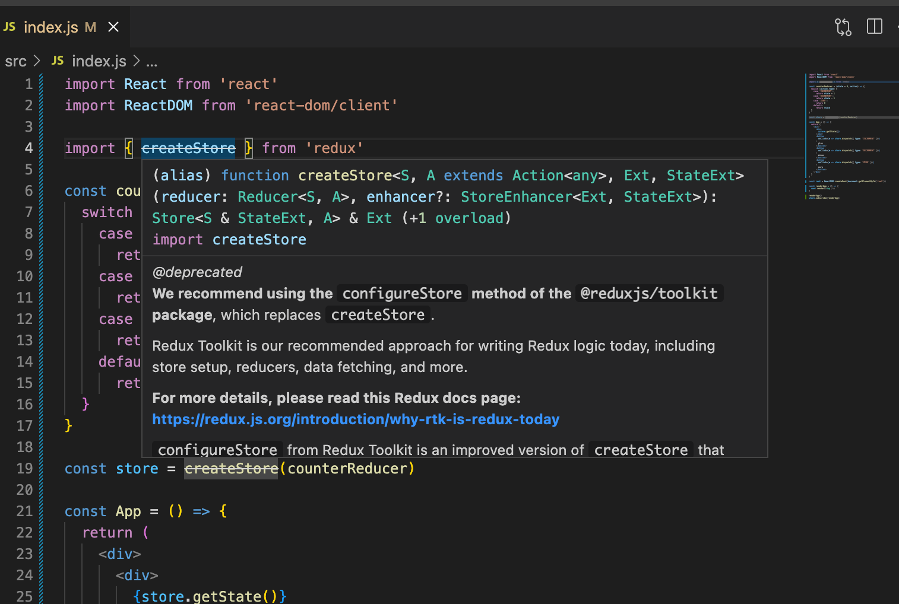
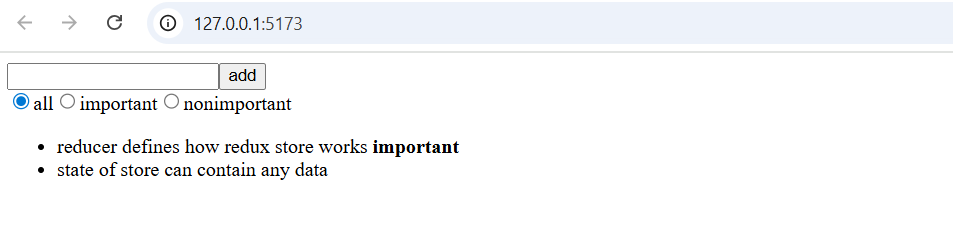
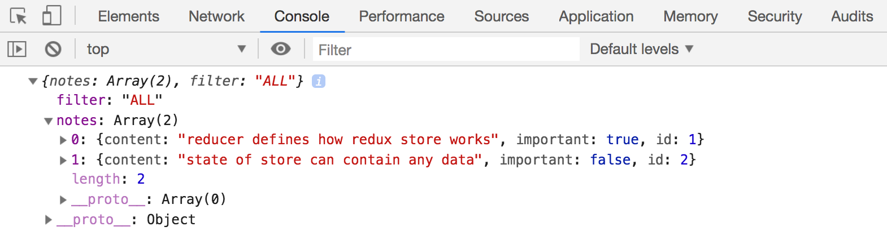
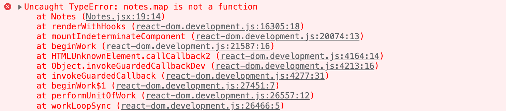
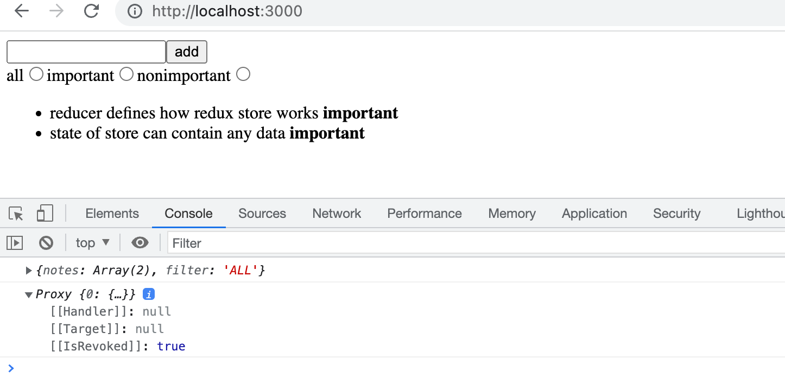
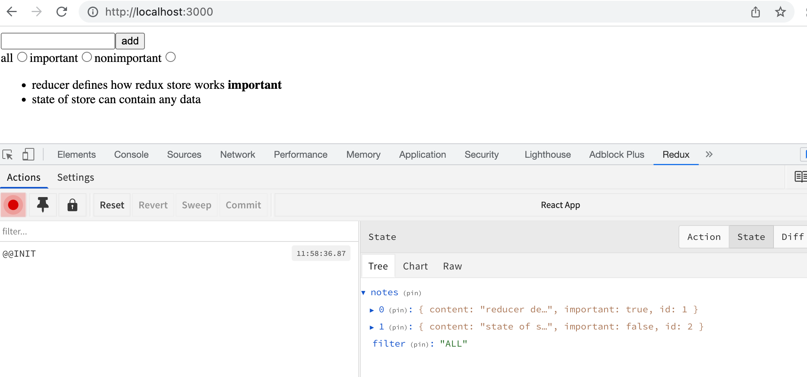
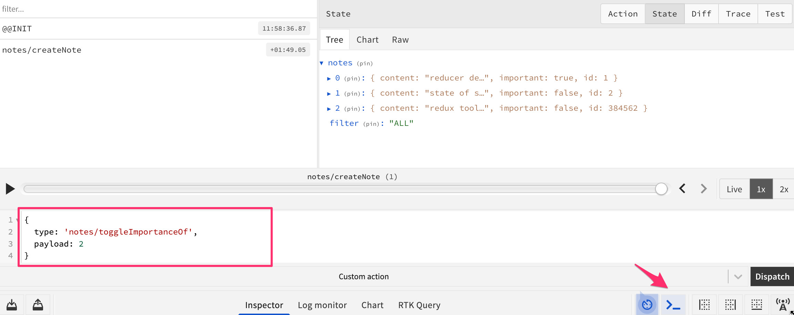

<div class="tasks">

هذه هي المادة التعليمية المتعلقة بـ Redux والتي تمت إزالتها من المنهج الأساسي للدورة. يمكنك المتابعة بهذه المادة وتمارينها إذا كنت قد بدأت بالفعل هذا الجزء باستخدام Redux. خلاف ذلك، يُوصى باتباع المادة الجديدة (المعتمدة على Zustand و TanStack Query). ستتم إزالة هذه المادة في يونيو 2026.

</div>

<div class="content">

حتى الآن، اتبعنا اتفاقيات إدارة الحالة الموصى بها في React. لقد وضعنا الحالة والدوال اللازمة للتعامل معها في [المستوى الأعلى](https://react.dev/learn/sharing-state-between-components) من بنية مكونات التطبيق. وفي كثير من الأحيان، توجد معظم حالة التطبيق والدوال المغيرة للحالة مباشرة في المكوّن الجذري (Root component). ثم يتم تمرير الحالة ودوال المعالجة الخاصة بها إلى المكونات الأخرى عبر الخصائص (Props). يعمل هذا النهج حتى نقطة معينة، ولكن عندما تكبر التطبيقات وتزداد تعقيداً، تصبح إدارة الحالة تحدياً كبيراً.

### معمارية فلكس (Flux-architecture)

منذ سنوات مضت، طورت شركة Facebook معمارية [Flux](https://facebookarchive.github.io/flux/docs/in-depth-overview) لتسهيل إدارة حالة تطبيقات React. في Flux، يتم فصل الحالة عن مكونات React ونقلها إلى <i>مخازن (Stores)</i> خاصة بها.
لا يتم تغيير الحالة في المخزن مباشرة، بل بواسطة <i>إجراءات (Actions)</i> مختلفة.

عندما يغير إجراء ما حالة المخزن، يُعاد تصيير العروض (Views):


إذا أدى إجراء ما في التطبيق، مثل الضغط على زر، إلى الحاجة إلى تغيير الحالة، يتم إجراء التغيير بواسطة إجراء (Action).
يتسبب هذا في إعادة تصيير العرض مرة أخرى:


توفر معمارية Flux طريقة قياسية لكيفية ومكان الاحتفاظ بحالة التطبيق وكيفية تعديلها.

### مكتبة ريدكس (Redux)

لدى Facebook تطبيق لمعمارية Flux، لكننا سنستخدم مكتبة [Redux](https://redux.js.org). إنها تعمل بنفس المبدأ ولكنها أبسط قليلاً. تستخدم Facebook أيضاً Redux الآن بدلاً من تطبيق Flux الأصلي الخاص بها.

سنتعرف على Redux من خلال تنفيذ تطبيق العداد مرة أخرى:


أنشئ تطبيق Vite جديد وقم بتثبيت <i>redux</i> بالأمر:

```bash
npm install redux
```

كما هو الحال في Flux، يتم تخزين الحالة في Redux أيضاً في [مخزن (Store)](https://redux.js.org/tutorials/essentials/part-1-overview-concepts#store).

يتم تخزين حالة التطبيق بالكامل في كائن جافاسكريبت <i>واحد</i> في المخزن. نظراً لأن تطبيقنا يحتاج فقط إلى قيمة العداد، فسنحفظها مباشرة في المخزن. إذا كانت الحالة أكثر تعقيداً، فسيتم حفظ الأشياء المختلفة في الحالة كحقول منفصلة للكائن.

يتم تغيير حالة المخزن بواسطة [الإجراءات (Actions)](https://redux.js.org/tutorials/essentials/part-1-overview-concepts#actions). الإجراءات هي كائنات تحتوي على الأقل على حقل يحدد <i>نوع (Type)</i> الإجراء.
يحتاج تطبيقنا على سبيل المثال إلى الإجراء التالي:

```js
{
  type: 'INCREMENT'
}
```

إذا كانت هناك بيانات مرتبطة بالإجراء، فيمكن التصريح عن حقول أخرى حسب الحاجة. ومع ذلك، فإن تطبيق العد الخاص بنا بسيط للغاية لدرجة أن الإجراءات تكتفي بحقل النوع فقط.

يتم تحديد تأثير الإجراء على حالة التطبيق باستخدام [دالة الاختزال / المخفّض (Reducer)](https://redux.js.org/tutorials/essentials/part-1-overview-concepts#reducers). من الناحية العملية، دالة الاختزال هي دالة تُعطى الحالة الحالية وإجراءً كمعاملات. وهي <i>تُرجع</i> حالة جديدة.

دعنا نحدد الآن دالة اختزال لتطبيقنا في <i>main.jsx</i>. يبدو الملف في البداية كما يلي:

```js
const counterReducer = (state, action) => {
  if (action.type === 'INCREMENT') {
    return state + 1
  } else if (action.type === 'DECREMENT') {
    return state - 1
  } else if (action.type === 'ZERO') {
    return 0
  }

  return state
}
```

المعامل الأول هو <i>الحالة (state)</i> في المخزن. تُرجع دالة الاختزال <i>حالة جديدة</i> بناءً على نوع الإجراء (Action type). لذلك، على سبيل المثال، عندما يكون نوع الإجراء هو <i>INCREMENT</i>، تحصل الحالة على القيمة القديمة زائد واحد. وإذا كان نوع الإجراء <i>ZERO</i>، فإن القيمة الجديدة للحالة هي صفر.

دعنا نغير الكود قليلاً. لقد استخدمنا عبارات if-else للاستجابة لإجراء وتغيير الحالة. ومع ذلك، فإن عبارة [switch](https://developer.mozilla.org/en-US/docs/Web/JavaScript/Reference/Statements/switch) هي النهج الأكثر شيوعاً لكتابة دالة الاختزال.

دعنا نحدد أيضاً [قيمة افتراضية (Default value)](https://developer.mozilla.org/en-US/docs/Web/JavaScript/Reference/Functions/Default_parameters) بقيمة 0 للمعامل <i>state</i>. الآن تعمل دالة الاختزال حتى إذا لم يتم تجهيز حالة المخزن وتهيئتها بعد.

```js
// highlight-start
const counterReducer = (state = 0, action) => {
  // highlight-end
  switch (action.type) {
    case 'INCREMENT':
      return state + 1
    case 'DECREMENT':
      return state - 1
    case 'ZERO':
      return 0
    default: // إذا لم يتطابق أي مما سبق، يأتي الكود إلى هنا
      return state
  }
}
```

لا يُفترض أبداً استدعاء دالة الاختزال مباشرة من كود التطبيق. حيث يتم إعطاؤها فقط كمعامل لدالة _createStore_ التي تنشئ المخزن:

```js
import { createStore } from 'redux' // highlight-line

const counterReducer = (state = 0, action) => {
  switch (action.type) {
    case 'INCREMENT':
      return state + 1
    case 'DECREMENT':
      return state - 1
    case 'ZERO':
      return 0
    default:
      return state
  }
}

const store = createStore(counterReducer) // highlight-line
```

قد يُحذر محرر التعليمات البرمجية من أن _createStore_ مهجورة (Deprecated). دعنا نتجاهل هذا في الوقت الحالي؛ هناك شرح أكثر تفصيلاً حول هذا الأمر أدناه.

يستخدم المخزن الآن دالة الاختزال للتعامل مع <i>الإجراءات (Actions)</i>، والتي يتم <i>إرسالها (Dispatched)</i> إلى المخزن باستخدام طريقة [dispatch](https://redux.js.org/tutorials/essentials/part-1-overview-concepts#dispatch) الخاصة به.

```js
store.dispatch({ type: 'INCREMENT' })
```

يمكنك معرفة حالة المخزن باستخدام الطريقة [getState](https://redux.js.org/api/store#getstate).

على سبيل المثال، الكود التالي:

```js
// ...

const store = createStore(counterReducer)

// highlight-start
console.log(store.getState())
store.dispatch({type: 'INCREMENT'})
store.dispatch({type: 'INCREMENT'})
store.dispatch({type: 'INCREMENT'})
console.log(store.getState())
store.dispatch({type: 'ZERO'})
store.dispatch({type: 'DECREMENT'})
console.log(store.getState())
// highlight-end
```

سيقوم بطباعة ما يلي في الكونسول:

```
0
3
-1
```

لأنه في البداية، تكون حالة المخزن 0. وبعد ثلاثة إجراءات <i>INCREMENT</i> تصبح الحالة 3. وفي النهاية، بعد إجرائي <i>ZERO</i> و <i>DECREMENT</i>، تصبح الحالة -1.

الطريقة المهمة الثالثة التي يمتلكها المخزن هي [subscribe](https://redux.js.org/api/store#subscribelistener)، والتي تُستخدم لإنشاء دوال رد نداء (Callback functions) يستدعيها المخزن عندما يتم إرسال إجراء إلى المخزن.

إذا أضفنا، على سبيل المثال، الدالة التالية إلى subscribe، فسيتم طباعة <i>كل تغيير في المخزن</i> في الكونسول:

```js
store.subscribe(() => {
  const storeNow = store.getState()
  console.log(storeNow)
})
```

وبالتالي فإن الكود:

```js
// ...

const store = createStore(counterReducer)

// highlight-start
store.subscribe(() => {
  const storeNow = store.getState()
  console.log(storeNow)
})
// highlight-end

// highlight-start
store.dispatch({ type: 'INCREMENT' })
store.dispatch({ type: 'INCREMENT' })
store.dispatch({ type: 'INCREMENT' })
store.dispatch({ type: 'ZERO' })
store.dispatch({ type: 'DECREMENT' })
// highlight-end
```

سيتسبب في طباعة ما يلي:

```
1
2
3
0
-1
```

كود تطبيق العداد الخاص بنا هو التالي. تمت كتابة الكود بأكمله في نفس الملف، لذا فإن <i>store</i> متاح مباشرة لكود React. سنتعرف على طرق أفضل لهيكلة كود React/Redux لاحقاً. يبدو الملف <i>main.jsx</i> كما يلي:

```js
import ReactDOM from 'react-dom/client'
import { createStore } from 'redux'

const counterReducer = (state = 0, action) => {
  switch (action.type) {
    case 'INCREMENT':
      return state + 1
    case 'DECREMENT':
      return state - 1
    case 'ZERO':
      return 0
    default:
      return state
  }
}

const store = createStore(counterReducer)

const App = () => {
  return (
    <div>
      <div>{store.getState()}</div>
      <button onClick={() => store.dispatch({ type: 'INCREMENT' })}>
        plus
      </button>
      <button onClick={() => store.dispatch({ type: 'DECREMENT' })}>
        minus
      </button>
      <button onClick={() => store.dispatch({ type: 'ZERO' })}>
        zero
      </button>
    </div>
  )
}

const root = ReactDOM.createRoot(document.getElementById('root'))

const renderApp = () => {
  root.render(<App />)
}

renderApp()
store.subscribe(renderApp)
```

هناك بعض الأشياء الجديرة بالملاحظة في الكود.
يصيّر <i>App</i> قيمة العداد عن طريق طلبها من المخزن باستخدام الطريقة _store.getState()_. وتقوم معالجات الأحداث الخاصة بالأزرار بـ <i>إرسال (dispatch)</i> الإجراءات الصحيحة إلى المخزن.

عندما تتغير الحالة في المخزن، لا تتمكن React من إعادة تصيير التطبيق تلقائياً بمفردها. وبالتالي قمنا بتسجيل دالة _renderApp_، التي تصيّر التطبيق بالكامل، للاستماع إلى التغييرات في المخزن باستخدام طريقة _store.subscribe_. لاحظ أنه يتعين علينا استدعاء طريقة _renderApp_ على الفور. وبدون هذا الاستدعاء، لن يحدث التصيير الأولي للتطبيق أبداً.

### ملاحظة حول استخدام createStore

سيلاحظ الأكثر دقة أن اسم الدالة createStore مشطوب بخط يتوسطه. إذا حركت الماوس فوق الاسم، فسيظهر شرح:



الشرح الكامل هو كما يلي:

><i>نوصي باستخدام طريقة configureStore من حزمة @reduxjs/toolkit، والتي تحل محل createStore.</i>
>
><i>تُعد Redux Toolkit نهجنا الموصى به لكتابة منطق Redux اليوم، بما في ذلك إعداد المخزن ودوال الاختزال وجلب البيانات والمزيد.</i>
>
><i>لمزيد من التفاصيل، يرجى قراءة صفحة وثائق Redux هذه: <https://redux.js.org/introduction/why-rtk-is-redux-today></i>
>
><i>إن configureStore من Redux Toolkit هي نسخة محسنة من createStore تعمل على تبسيط الإعداد وتساعد في تجنب الأخطاء الشائعة.</i>
>
><i>يجب ألا تستخدم الحزمة الأساسية redux بمفردها اليوم، إلا للأغراض التعليمية. لن تتم إزالة طريقة createStore من حزمة redux الأساسية، ولكننا نشجع جميع المستخدمين على الانتقال إلى استخدام Redux Toolkit لجميع أكواد Redux.</i>

لذلك، بدلاً من الدالة <i>createStore</i>، يوصى باستخدام الدالة الأكثر "تقدماً" <i>configureStore</i>، وسنستخدمها أيضاً عندما نحقق الوظائف الأساسية لـ Redux.

ملاحظة جانبية: يتم تعريف <i>createStore</i> على أنها "مهجورة" (deprecated)، وهو ما يعني عادةً أنه ستتم إزالة الميزة في إصدار أحدث من المكتبة. يوضح الشرح أعلاه وهذا [النقاش](https://stackoverflow.com/questions/71944111/redux-createstore-is-deprecated-cannot-get-state-from-getstate-in-redux-ac) أن <i>createStore</i> لن تتم إزالتها، وقد تم إعطاؤها حالة <i>deprecated</i> ربما لأسباب توجيهية. لذا فإن الدالة ليست ملغاة، ولكن هناك طريقة مفضلة وجديدة اليوم للقيام بنفس الشيء تقريباً.

### تطبيق الملاحظات باستخدام ريدكس (Redux-notes)

نهدف إلى تعديل تطبيق الملاحظات الخاص بنا لاستخدام Redux لإدارة الحالة. ومع ذلك، دعنا نغطي أولاً بعض المفاهيم الأساسية من خلال تطبيق ملاحظات مبسط.

يبدو الإصدار الأول من تطبيقنا، المكتوب في الملف <i>main.jsx</i>، كما يلي:

```js
import ReactDOM from 'react-dom/client'
import { createStore } from 'redux'

const noteReducer = (state = [], action) => {
  switch (action.type) {
    case 'NEW_NOTE':
      state.push(action.payload)
      return state
    default:
      return state
  }
}

const store = createStore(noteReducer)

store.dispatch({
  type: 'NEW_NOTE',
  payload: {
    content: 'the app state is in redux store',
    important: true,
    id: 1
  }
})

store.dispatch({
  type: 'NEW_NOTE',
  payload: {
    content: 'state changes are made with actions',
    important: false,
    id: 2
  }
})

const App = () => {
  return (
    <div>
      <ul>
        {store.getState().map(note => (
          <li key={note.id}>
            {note.content} <strong>{note.important ? 'important' : ''}</strong>
          </li>
        ))}
      </ul>
    </div>
  )
}

const root = ReactDOM.createRoot(document.getElementById('root'))

const renderApp = () => {
  root.render(<App />)
}

renderApp()
store.subscribe(renderApp)
```

حتى الآن، لا يحتوي التطبيق على وظيفة لإضافة ملاحظات جديدة من واجهة المستخدم، على الرغم من أنه من الممكن القيام بذلك عن طريق إرسال إجراءات <i>NEW\_NOTE</i> برمجياً.

تحتوي الإجراءات الآن على نوع وحقل <i>payload</i> (الحمولة / البيانات)، والذي يحتوي على الملاحظة المراد إضافتها:

```js
{
  type: 'NEW_NOTE',
  payload: {
    content: 'state changes are made with actions',
    important: false,
    id: 2
  }
}
```

اختيار اسم الحقل ليس عشوائياً. الاتفاقية العامة هي أن الإجراءات لها حقلان بالضبط: <i>type</i> يخبر بالنوع و <i>payload</i> يحتوي على البيانات المضمنة مع الإجراء.

### الدوال النقية والكائنات غير القابلة للتعديل (Pure functions, immutable)

الإصدار الأولي لدالة الاختزال بسيط للغاية:

```js
const noteReducer = (state = [], action) => {
  switch (action.type) {
    case 'NEW_NOTE':
      state.push(action.payload)
      return state
    default:
      return state
  }
}
```

الحالة هي الآن مصفوفة (Array). تتسبب الإجراءات من نوع <i>NEW\_NOTE</i> في إضافة ملاحظة جديدة إلى الحالة باستخدام طريقة [push](https://developer.mozilla.org/en-US/docs/Web/JavaScript/Reference/Global_Objects/Array/push).

يبدو أن التطبيق يعمل، لكن دالة الاختزال التي أعلنا عنها سيئة وخاطئة من الناحية المعمارية. إنها تكسر [الافتراض الأساسي](https://redux.js.org/tutorials/essentials/part-1-overview-concepts#reducers) بأن دوال الاختزال يجب أن تكون [دوالاً نقية (Pure functions)](https://en.wikipedia.org/wiki/Pure_function).

الدوال النقية هي تلك التي <i>لا تسبب أي آثار جانبية (Side effects)</i> ويجب أن تُرجع دائماً نفس النتيجة عند استدعائها بنفس المعاملات.

أضفنا ملاحظة جديدة إلى الحالة باستخدام الطريقة _state.push(action.payload)_ والتي <i>تعدل وتغير (Mutates)</i> حالة كائن الحالة الأصلي. هذا غير مسموح به في Redux. يتم حل المشكلة بسهولة باستخدام طريقة [concat](https://developer.mozilla.org/en-US/docs/Web/JavaScript/Reference/Global_Objects/Array/concat)، والتي تنشئ <i>مصفوفة جديدة</i> تحتوي على جميع عناصر المصفوفة القديمة بالإضافة إلى العنصر الجديد:

```js
const noteReducer = (state = [], action) => {
  switch (action.type) {
    case 'NEW_NOTE':
      return state.concat(action.payload) // highlight-line
    default:
      return state
  }
}
```

يجب أن تتكون حالة دالة الاختزال من كائنات [غير قابلة للتعديل المباشر (Immutable)](https://en.wikipedia.org/wiki/Immutable_object). إذا حدث تغيير في الحالة، فلن يتم تغيير الكائن القديم، بل يتم <i>استبداله بكائن جديد معدل</i>. هذا هو بالضبط ما فعلناه مع دالة الاختزال الجديدة: يتم استبدال المصفوفة القديمة بالمصفوفة الجديدة.

دعنا نوسع دالة الاختزال الخاصة بنا حتى تتمكن من التعامل مع تغيير أهمية الملاحظة:

```js
{
  type: 'TOGGLE_IMPORTANCE',
  payload: {
    id: 2
  }
}
```

نظراً لأنه ليس لدينا أي كود يستخدم هذه الوظيفة بعد، فإننا نقوم بتوسيع دالة الاختزال بالطريقة "الموجهة بالاختبار" (Test-driven).

### تهيئة بيئة الاختبار (Configuring the test environment)

علينا أولاً تكوين مكتبة الاختبار [Vitest](https://vitest.dev/) للمشروع. دعنا نثبتها كتابعية تطوير للتطبيق:

```bash
npm install --save-dev vitest
```

دعنا نوسع <i>package.json</i> بسكريبت لتشغيل الاختبارات:

```json
{
  // ...
  "scripts": {
    "dev": "vite",
    "build": "vite build",
    "lint": "eslint .",
    "preview": "vite preview",
    "test": "vitest" // highlight-line
  },
  // ...
}
```

لتسهيل الاختبار، دعنا ننقل كود دالة الاختزال إلى وحدتها النمطية الخاصة، إلى الملف <i>src/reducers/noteReducer.js</i>:

```js
const noteReducer = (state = [], action) => {
  switch (action.type) {
    case 'NEW_NOTE':
      return state.concat(action.payload)
    default:
      return state
  }
}

export default noteReducer
```

يتغير الملف <i>main.jsx</i> كما يلي:

```js
import ReactDOM from 'react-dom/client'
import { createStore } from 'redux'
import noteReducer from './reducers/noteReducer' // highlight-line

const store = createStore(noteReducer)

// ...
```

سنضيف أيضاً مكتبة [deep-freeze](https://www.npmjs.com/package/deep-freeze)، والتي يمكن استخدامها لضمان تعريف دالة الاختزال بشكل صحيح كدالة غير قابلة للتعديل (Immutable function).
دعنا نثبت المكتبة كتابعية تطوير:

```bash
npm install --save-dev deep-freeze
```

نحن الآن جاهزون لكتابة الاختبارات.

### اختبارات noteReducer (Tests for noteReducer)

لنبدأ بإنشاء اختبار للتعامل مع الإجراء <i>NEW\_NOTE</i>. الاختبار، الذي نحدده في الملف <i>src/reducers/noteReducer.test.js</i>، له المحتوى التالي:

```js
import deepFreeze from 'deep-freeze'
import { describe, expect, test } from 'vitest'
import noteReducer from './noteReducer'

describe('noteReducer', () => {
  test('returns new state with action NEW_NOTE', () => {
    const state = []
    const action = {
      type: 'NEW_NOTE',
      payload: {
        content: 'the app state is in redux store',
        important: true,
        id: 1
      }
    }

    deepFreeze(state)
    const newState = noteReducer(state, action)

    expect(newState).toHaveLength(1)
    expect(newState).toContainEqual(action.payload)
  })
})
```

قم بتشغيل الاختبار باستخدام <i>npm test</i>. يضمن الاختبار أن الحالة الجديدة التي تُرجعها دالة الاختزال هي مصفوفة تحتوي على عنصر واحد، وهو نفس الكائن الموجود في حقل <i>payload</i> للإجراء.

يضمن الأمر <i>deepFreeze(state)</i> ألا تقوم دالة الاختزال بتغيير حالة المخزن المعطاة لها كمعامل. إذا استخدمت دالة الاختزال أمر _push_ لمعالجة الحالة، فسيَفشل الاختبار:


الآن سننشئ اختباراً لإجراء <i>TOGGLE\_IMPORTANCE</i>:

```js
test('returns new state with action TOGGLE_IMPORTANCE', () => {
  const state = [
    {
      content: 'the app state is in redux store',
      important: true,
      id: 1
    },
    {
      content: 'state changes are made with actions',
      important: false,
      id: 2
    }
  ]

  const action = {
    type: 'TOGGLE_IMPORTANCE',
    payload: {
      id: 2
    }
  }

  deepFreeze(state)
  const newState = noteReducer(state, action)

  expect(newState).toHaveLength(2)

  expect(newState).toContainEqual(state[0])

  expect(newState).toContainEqual({
    content: 'state changes are made with actions',
    important: true,
    id: 2
  })
})
```

لذلك فإن الإجراء التالي:

```js
{
  type: 'TOGGLE_IMPORTANCE',
  payload: {
    id: 2
  }
}
```

يجب أن يغير أهمية الملاحظة التي تحمل المعرّف id رقم 2.

يتم توسيع دالة الاختزال كما يلي:

```js
const noteReducer = (state = [], action) => {
  switch(action.type) {
    case 'NEW_NOTE':
      return state.concat(action.payload)
    // highlight-start
    case 'TOGGLE_IMPORTANCE': {
      const id = action.payload.id
      const noteToChange = state.find(n => n.id === id)
      const changedNote = {
        ...noteToChange,
        important: !noteToChange.important
      }
      return state.map(note => (note.id !== id ? note : changedNote))
    }
    // highlight-end
    default:
      return state
  }
}
```

ننشئ نسخة من الملاحظة التي تغيرت أهميتها بالصيغة [المألوفة من الجزء 2](/ar/part2/altering_data_in_server#changing-the-importance-of-notes)، ونستبدل الحالة بحالة جديدة تحتوي على جميع الملاحظات التي لم تتغير ونسخة الملاحظة المعدلة <i>changedNote</i>.

دعنا نلخص ما يدور في الكود. أولاً، نبحث عن كائن ملاحظة محدد نريد تغيير أهميته:

```js
const noteToChange = state.find(n => n.id === id)
```

ثم ننشئ كائناً جديداً، وهو <i>نسخة</i> من الملاحظة الأصلية، مع تغيير قيمة الحقل <i>important</i> فقط إلى عكس ما كانت عليه:

```js
const changedNote = { 
  ...noteToChange, 
  important: !noteToChange.important 
}
```

ثم يتم إرجاع حالة جديدة. ننشئها عن طريق أخذ جميع الملاحظات من الحالة القديمة باستثناء الملاحظة المطلوبة، والتي نستبدلها بنسختها المعدلة قليلاً:

```js
state.map(note => (note.id !== id ? note : changedNote))
```

### صياغة نشر المصفوفة (Array spread syntax)

نظراً لأن لدينا الآن اختبارات جيدة لدالة الاختزال، يمكننا إعادة هيكلة الكود بأمان.

تؤدي إضافة ملاحظة جديدة إلى إنشاء الحالة المرجعة من دالة _concat_ للمصفوفة. دعنا نلقي نظرة على كيفية تحقيق نفس الشيء باستخدام صيغة [نشر المصفوفات (Spread syntax)](https://developer.mozilla.org/en-US/docs/Web/JavaScript/Reference/Operators/Spread_operator) في جافاسكريبت:

```js
const noteReducer = (state = [], action) => {
  switch(action.type) {
    case 'NEW_NOTE':
      return [...state, action.payload] // highlight-line
    case 'TOGGLE_IMPORTANCE': {
      // ...
    }
    default:
    return state
  }
}
```

تعمل صيغة النشر على النحو التالي. إذا أعلنا:

```js
const numbers = [1, 2, 3]
```

فإن <code>...numbers</code> تفكك المصفوفة إلى عناصر فردية، والتي يمكن وضعها في مصفوفة أخرى:

```js
[...numbers, 4, 5]
```

وتكون النتيجة هي المصفوفة <i>[1, 2, 3, 4, 5]</i>.

إذا كنا قد وضعنا المصفوفة في مصفوفة أخرى بدون النشر:

```js
[numbers, 4, 5]
```

فستكون النتيجة <i>[ [1, 2, 3], 4, 5]</i>.

عندما نأخذ عناصر من مصفوفة عن طريق [التفكيك (Destructuring)](https://developer.mozilla.org/en-US/docs/Web/JavaScript/Reference/Operators/Destructuring_assignment)، يتم استخدام صيغة ذات مظهر مماثل <i>لجمع</i> بقية العناصر:

```js
const numbers = [1, 2, 3, 4, 5, 6]

const [first, second, ...rest] = numbers

console.log(first)     // يطبع 1
console.log(second)   // يطبع 2
console.log(rest)     // يطبع [3, 4, 5, 6]
```

</div>

<div class="tasks">

### التمارين 6.1.-6.2.

دعنا ننشئ نسخة مبسطة من تمرين Unicafe من الجزء 1. سنتعامل مع إدارة الحالة باستخدام Redux.

يمكنك أخذ الكود من هذا المستودع <https://github.com/fullstack-hy2020/unicafe-redux> كأساس لمشروعك.

<i>ابدأ بإزالة إعدادات git للمستودع المنسوخ، وتثبيت التبعيات:</i>

```bash
cd unicafe-redux   // الانتقال إلى مجلد المستودع المنسوخ
rm -rf .git
npm install
```

#### 6.1: العودة إلى Unicafe، الخطوة 1

قبل تنفيذ وظائف واجهة المستخدم، دعنا ننفذ الوظائف المطلوبة للمخزن.

علينا حفظ عدد كل نوع من التقييمات في المخزن، وبالتالي فإن شكل الحالة في المخزن هو:

```js
{
  good: 5,
  ok: 4,
  bad: 2
}
```

يحتوي المشروع على الأساس التالي لدالة الاختزال:

```js
const initialState = {
  good: 0,
  ok: 0,
  bad: 0
}

const counterReducer = (state = initialState, action) => {
  console.log(action)
  switch (action.type) {
    case 'GOOD':
      return state
    case 'OK':
      return state
    case 'BAD':
      return state
    case 'RESET':
      return state
    default:
      return state
  }
}

export default counterReducer
```

وأساس لاختباراتها:

```js
import deepFreeze from 'deep-freeze'
import { describe, expect, test } from 'vitest'
import counterReducer from './reducer'

describe('unicafe reducer', () => {
  const initialState = {
    good: 0,
    ok: 0,
    bad: 0
  }

  test('should return a proper initial state when called with undefined state', () => {
    const action = {
      type: 'DO_NOTHING'
    }

    const newState = counterReducer(undefined, action)
    expect(newState).toEqual(initialState)
  })

  test('good is incremented', () => {
    const action = {
      type: 'GOOD'
    }
    const state = initialState

    deepFreeze(state)
    const newState = counterReducer(state, action)
    expect(newState).toEqual({
      good: 1,
      ok: 0,
      bad: 0
    })
  })
})
```

**نفّذ دالة الاختزال واختباراتها.**

يجب أن ينجح الاختبار الأول المقدم دون أي تغييرات. تتوقع Redux أن تُرجع دالة الاختزال الحالة الأصلية عندما يتم استدعاؤها مع معامل أول - والذي يمثل <i>الحالة</i> السابقة - بقيمة <i>undefined</i>.

ابدأ بتوسيع دالة الاختزال حتى ينجح كلا الاختبارين. بعد ذلك، أضف الاختبارات المتبقية للإجراءات المختلفة لدالة الاختزال وقم بتنفيذ الوظائف المقابلة في دالة الاختزال.

في الاختبارات، تأكد من أن دالة الاختزال هي <i>دالة غير قابلة للتعديل (Immutable function)</i> باستخدام مكتبة <i>deep-freeze</i>. النموذج الجيد لدالة الاختزال هو مثال [redux-notes](/ar/part6/flux_architecture_and_redux#pure-functions-immutable) أعلاه.

#### 6.2: العودة إلى Unicafe، الخطوة 2

الآن قم بتنفيذ الوظائف الفعلية للتطبيق.

يمكن أن يكون لتطبيقك مظهر متواضع، فلا حاجة إلى أي شيء آخر سوى الأزرار وعدد المراجعات لكل نوع:


</div>

<div class="content">

### النماذج غير المضبوطة (Uncontrolled form)

دعنا نضيف وظائف لإضافة ملاحظات جديدة وتغيير أهميتها:

```js
// ...

const generateId = () => Number((Math.random() * 1000000).toFixed(0)) // highlight-line

const App = () => {
  // highlight-start
  const addNote = event => {
    event.preventDefault()
    const content = event.target.note.value
    event.target.note.value = ''
    store.dispatch({
      type: 'NEW_NOTE',
      payload: {
        content,
        important: false,
        id: generateId()
      }
    })
  }
    // highlight-end

  // highlight-start
  const toggleImportance = id => {
    store.dispatch({
      type: 'TOGGLE_IMPORTANCE',
      payload: { id }
    })
  }
    // highlight-end

  return (
    <div>
      // highlight-start
      <form onSubmit={addNote}>
        <input name="note" /> 
        <button type="submit">add</button>
      </form>
        // highlight-end
      <ul>
        {store.getState().map(note => (
          <li key={note.id} onClick={() => toggleImportance(note.id)}> // highlight-line
            {note.content} <strong>{note.important ? 'important' : ''}</strong>
          </li>
        ))}
      </ul>
    </div>
  )
}

// ...
```

تنفيذ كلتا الوظيفتين مباشر. من الجدير بالذكر أننا <i>لم</i> نقم بربط حالة حقول النموذج بحالة المكوّن <i>App</i> كما فعلنا سابقاً. تطلق React على هذا النوع من النماذج اسم النماذج [غير المضبوطة (Uncontrolled)](https://react.dev/reference/react-dom/components/input#controlling-an-input-with-a-state-variable).

> النماذج غير المضبوطة لها قيود معينة (على سبيل المثال، رسائل الخطأ الديناميكية أو تعطيل زر الإرسال بناءً على الإدخال غير ممكنة بسهولة). ومع ذلك فهي مناسبة لاحتياجاتنا الحالية.

يمكنك قراءة المزيد حول النماذج غير المضبوطة [هنا](https://goshakkk.name/controlled-vs-uncontrolled-inputs-react/).

طريقة إضافة ملاحظات جديدة بسيطة، فهي ترسل الإجراء الخاص بإضافة الملاحظات:

```js
addNote = event => {
  event.preventDefault()
  const content = event.target.note.value
  event.target.note.value = ''
  store.dispatch({
    type: 'NEW_NOTE',
    payload: {
      content,
      important: false,
      id: generateId()
    }
  })
}
```

يتم الحصول على محتوى الملاحظة الجديدة مباشرة من حقل الإدخال في النموذج، والذي يمكن الوصول إليه من خلال كائن الحدث:

```js
const content = event.target.note.value
```

يرجى ملاحظة أنه يجب أن يكون لحقل الإدخال اسم (name) من أجل الوصول إلى قيمته:

```js
<form onSubmit={addNote}>
  <input name="note" /> // highlight-line
  <button type="submit">add</button>
</form>
```

يمكن تغيير أهمية الملاحظة بالنقر فوق اسمها. معالج الأحداث بسيط جداً:

```js
toggleImportance = id => {
  store.dispatch({
    type: 'TOGGLE_IMPORTANCE',
    payload: { id }
  })
}
```

### منشئات الإجراءات (Action creators)

بدأنا نلاحظ أنه حتى في التطبيقات البسيطة كتطبيقنا، فإن استخدام Redux يمكن أن يبسط كود الواجهة الأمامية. ومع ذلك، يمكننا أن نفعل ما هو أفضل بكثير.

لا تحتاج مكونات React إلى معرفة أنواع وصيغ إجراءات Redux الداخلية.
دعنا نفصل إنشاء الإجراءات في دوال منفصلة:

```js
const createNote = content => {
  return {
    type: 'NEW_NOTE',
    payload: {
      content,
      important: false,
      id: generateId()
    }
  }
}

const toggleImportanceOf = id => {
  return {
    type: 'TOGGLE_IMPORTANCE',
    payload: { id }
  }
}
```

تسمى الدوال التي تنشئ الإجراءات بـ [منشئات الإجراءات (Action creators)](https://redux.js.org/tutorials/essentials/part-1-overview-concepts#action-creators).

لم يعد المكوّن <i>App</i> بحاجة إلى معرفة أي شيء عن التمثيل الداخلي للإجراءات بعد الآن، فهو يحصل فقط على الإجراء الصحيح عن طريق استدعاء دالة المنشئ:

```js
const App = () => {
  const addNote = event => {
    event.preventDefault()
    const content = event.target.note.value
    event.target.note.value = ''
    store.dispatch(createNote(content)) // highlight-line
    
  }
  
  const toggleImportance = id => {
    store.dispatch(toggleImportanceOf(id))// highlight-line
  }

  // ...
}
```

### تمرير مخزن Redux إلى المكونات المختلفة (Forwarding Redux Store to various components)

بصرف النظر عن دالة الاختزال، فإن تطبيقنا موجود في ملف واحد. هذا بالطبع ليس معقولاً، ويجب أن نفصل <i>App</i> إلى وحدته النمطية الخاصة.

والسؤال الآن هو: كيف يمكن لـ <i>App</i> الوصول إلى المخزن بعد نقله؟ وبشكل أوسع، عندما يتكون المكوّن من العديد من المكونات الأصغر، يجب أن تكون هناك طريقة لجميع المكونات للوصول إلى المخزن.

هناك طرق متعددة لمشاركة مخزن Redux مع المكونات. أولاً، سننظر في أحدث طريقة وربما أسهلها، وهي استخدام واجهة [الخطافات (Hooks API)](https://react-redux.js.org/api/hooks) الخاصة بمكتبة [react-redux](https://react-redux.js.org/).

أولاً، نقوم بتثبيت react-redux:

```bash
npm install react-redux
```

دعنا ننظم كود التطبيق بشكل أكثر منطقية في عدة ملفات مختلفة. يبدو الملف _main.jsx_ كما يلي بعد التغييرات:

```js
import ReactDOM from 'react-dom/client'
import { createStore } from 'redux'
import { Provider } from 'react-redux'

import App from './App'
import noteReducer from './reducers/noteReducer'

const store = createStore(noteReducer)

ReactDOM.createRoot(document.getElementById('root')).render(
  <Provider store={store}>
    <App />
  </Provider>
)
```

لاحظ أن التطبيق محدد الآن كابن لمكوّن [Provider](https://react-redux.js.org/api/provider) الذي توفره مكتبة react-redux. ويتم إعطاء مخزن التطبيق إلى المزود Provider كخاصية <i>store</i>:

```js
const store = createStore(noteReducer)

ReactDOM.createRoot(document.getElementById('root')).render(
  <Provider store={store}> // highlight-line
    <App />
  </Provider> // highlight-line
)
```

وهذا يجعل المخزن متاحاً لجميع المكونات في التطبيق، كما سنرى قريباً.

تم نقل تعريف منشئات الإجراءات إلى الملف <i>src/reducers/noteReducer.js</i> حيث تم تعريف دالة الاختزال. يبدو هذا الملف كما يلي:

```js
const noteReducer = (state = [], action) => {
  switch (action.type) {
    case 'NEW_NOTE':
      return [...state, action.payload]
    case 'TOGGLE_IMPORTANCE': {
      const id = action.payload.id
      const noteToChange = state.find(n => n.id === id)
      const changedNote = {
        ...noteToChange,
        important: !noteToChange.important
      }
      return state.map(note => (note.id !== id ? note : changedNote))
    }
    default:
      return state
  }
}

const generateId = () =>
  Number((Math.random() * 1000000).toFixed(0))

export const createNote = (content) => {
  return {
    type: 'NEW_NOTE',
    payload: {
      content,
      important: false,
      id: generateId()
    }
  }
}

export const toggleImportanceOf = (id) => {
  return {
    type: 'TOGGLE_IMPORTANCE',
    payload: { id }
  }
}

export default noteReducer
```

تحتوي الوحدة النمطية الآن على أوامر [تصدير (export)](https://developer.mozilla.org/en-US/docs/Web/JavaScript/Reference/Statements/export) متعددة. لا تزال دالة الاختزال تُرجع باستخدام أمر <i>export default</i>، لذلك يمكن استيراد دالة الاختزال بالطريقة المعتادة:

```js
import noteReducer from './reducers/noteReducer'
```

يمكن أن تحتوي الوحدة النمطية على <i>تصدير افتراضي واحد فقط (default export)</i>، ولكن يمكنها احتواء العديد من الصادرات "العادية":

```js
export const createNote = (content) => {
  // ...
}

export const toggleImportanceOf = (id) => { 
  // ...
}
```

يمكن استيراد الدوال المصدرة بشكل عادي (وليس كافتراضية) باستخدام صيغة الأقواس المعقوفة:

```js
import { createNote } from '../../reducers/noteReducer'
```

بعد ذلك، ننقل مكوّن _App_ إلى ملفه الخاص _src/App.jsx_. محتوى الملف هو كما يلي:

```js
import { createNote, toggleImportanceOf } from './reducers/noteReducer'
import { useSelector, useDispatch } from 'react-redux' 


const App = () => {
  const dispatch = useDispatch()
  const notes = useSelector(state => state)

  const addNote = (event) => {
    event.preventDefault()
    const content = event.target.note.value
    event.target.note.value = ''
    dispatch(createNote(content))
  }

  const toggleImportance = (id) => {
    dispatch(toggleImportanceOf(id))
  }

  return (
    <div>
      <form onSubmit={addNote}>
        <input name="note" /> 
        <button type="submit">add</button>
      </form>
      <ul>
        {notes.map(note => 
          <li
            key={note.id} 
            onClick={() => toggleImportance(note.id)}
          >
            {note.content} <strong>{note.important ? 'important' : ''}</strong>
          </li>
        )}
      </ul>
    </div>
  )
}

export default App
```

هناك بعض الأشياء التي يجب ملاحظتها في الكود. في السابق، كان الكود يرسل الإجراءات عن طريق استدعاء طريقة dispatch لمخزن Redux:

```js
store.dispatch({
  type: 'TOGGLE_IMPORTANCE',
  payload: { id }
})
```

الآن يفعل ذلك باستخدام دالة <i>dispatch</i> من خطاف [useDispatch](https://react-redux.js.org/api/hooks#usedispatch).

```js
import { useSelector, useDispatch } from 'react-redux'  // highlight-line

const App = () => {
  const dispatch = useDispatch()  // highlight-line
  // ...

  const toggleImportance = (id) => {
    dispatch(toggleImportanceOf(id)) // highlight-line
  }

  // ...
}
```

يوفر خطاف <i>useDispatch</i> لأي مكوّن React إمكانية الوصول إلى دالة dispatch لمخزن Redux المحدد في <i>main.jsx</i>. يتيح ذلك لجميع المكونات إجراء تغييرات على حالة مخزن Redux.

يمكن للمكوّن الوصول إلى الملاحظات المخزنة في المخزن باستخدام خطاف [useSelector](https://react-redux.js.org/api/hooks#useselector) الخاص بمكتبة react-redux.

```js
import { useSelector, useDispatch } from 'react-redux'  // highlight-line

const App = () => {
  // ...
  const notes = useSelector(state => state)  // highlight-line
  // ...
}
```

تستقبل <i>useSelector</i> دالة كمعامل. تبحث الدالة عن بيانات من مخزن Redux أو تحددها.
هنا نحتاج إلى جميع الملاحظات، لذلك تُرجع دالة المحدد الحالة بأكملها:

```js
state => state
```

وهي اختصار لـ:

```js
(state) => {
  return state
}
```

عادةً ما تكون دوال المحددات أكثر تحديداً وتُرجع أجزاء محددة فقط من محتويات مخزن Redux.
يمكننا على سبيل المثال إرجاع الملاحظات المحددة على أنها مهمة فقط:

```js
const importantNotes = useSelector(state => state.filter(note => note.important))  
```

يمكن العثور على الإصدار الحالي للتطبيق على [GitHub](https://github.com/fullstack-hy2020/redux-notes/tree/part6-0)، الفرع <i>part6-0</i>.

### المزيد من المكونات (More components)

دعنا نفصل النموذج المسؤول عن إنشاء ملاحظة جديدة إلى مكوّن خاص به في الملف <i>src/components/NoteForm.jsx</i>:

```js
import { useDispatch } from 'react-redux'
import { createNote } from '../reducers/noteReducer'

const NoteForm = () => {
  const dispatch = useDispatch()

  const addNote = (event) => {
    event.preventDefault()
    const content = event.target.note.value
    event.target.note.value = ''
    dispatch(createNote(content))
  }

  return (
    <form onSubmit={addNote}>
      <input name="note" />
      <button type="submit">add</button>
    </form>
  )
}

export default NoteForm
```

على عكس كود React الذي قمنا به بدون Redux، تم نقل معالج الأحداث لتغيير حالة التطبيق (الذي يعيش الآن في Redux) بعيداً عن <i>App</i> إلى مكوّن فرعي. لا يزال منطق تغيير الحالة في Redux مفصولاً بشكل أنيق عن جزء React بالكامل في التطبيق.

سنفصل أيضاً قائمة الملاحظات وعرض ملاحظة فردية في مكونات خاصة بهما. دعنا نضعهما في الملف <i>src/components/Notes.jsx</i>:

```js
import { useDispatch, useSelector } from 'react-redux'
import { toggleImportanceOf } from '../reducers/noteReducer'

const Note = ({ note, handleClick }) => {
  return (
    <li onClick={handleClick}>
      {note.content}
      <strong> {note.important ? 'important' : ''}</strong>
    </li>
  )
}

const Notes = () => {
  const dispatch = useDispatch()
  const notes = useSelector(state => state)

  return (
    <ul>
      {notes.map(note => (
        <Note
          key={note.id}
          note={note}
          handleClick={() => dispatch(toggleImportanceOf(note.id))}
        />
      ))}
    </ul>
  )
}

export default Notes
```

أصبح منطق تغيير أهمية الملاحظة موجوداً الآن في المكوّن الذي يدير قائمة الملاحظات.

تبقى كمية صغيرة فقط من الكود في الملف <i>App.jsx</i>:

```js
import NoteForm from './components/NoteForm'
import Notes from './components/Notes'

const App = () => {
  return (
    <div>
      <NoteForm />
      <Notes />
    </div>
  )
}

export default App
```

إن مكوّن <i>Note</i>، المسؤول عن تصيير ملاحظة واحدة، بسيط للغاية ولا يدرك أن معالج الأحداث الذي يحصل عليه كخصائص يقوم بإرسال إجراء. تسمى هذه الأنواع من المكونات [عرضية (Presentational)](https://medium.com/@dan_abramov/smart-and-dumb-components-7ca2f9a7c7d0) في مصطلحات React.

ومن ناحية أخرى، فإن <i>Notes</i> هو مكوّن [حاوي (Container)](https://medium.com/@dan_abramov/smart-and-dumb-components-7ca2f9a7c7d0)، حيث يحتوي على بعض منطق التطبيق: فهو يحدد ما تفعله معالجات الأحداث لمكونات <i>Note</i> وينسق تكوين المكونات <i>العرضية</i>، أي الملاحظات.

يمكن العثور على كود تطبيق Redux على [GitHub](https://github.com/fullstack-hy2020/redux-notes/tree/part6-1)، في الفرع <i>part6-1</i>.

</div>

<div class="tasks">

### التمارين 6.3.-6.8.

دعنا ننشئ نسخة جديدة من تطبيق التصويت على الطرائف من الجزء 1. خذ المشروع من هذا المستودع <https://github.com/fullstack-hy2020/redux-anecdotes> كأساس لحلك.

إذا قمت بنسخ المشروع في مستودع git موجود، <i>فاحذف إعدادات git للتطبيق المنسوخ:</i>

```bash
cd redux-anecdotes  // الانتقال إلى المستودع المنسوخ
rm -rf .git
```

يمكن بدء تشغيل التطبيق كالمعتاد، ولكن يجب عليك تثبيت التبعيات أولاً:

```bash
npm install
npm run dev
```

بعد إكمال هذه التمارين، يجب أن يبدو تطبيقك كما يلي:


#### 6.3: الطرائف، الخطوة 1

نفّذ وظيفة التصويت على الطرائف. يجب حفظ عدد الأصوات في مخزن Redux.

#### 6.4: الطرائف، الخطوة 2

نفّذ وظيفة إضافة طرائف جديدة.

يمكنك الاحتفاظ بالنموذج غير مضبوط كما فعلنا [سابقاً](/ar/part6/flux_architecture_and_redux#uncontrolled-form).

#### 6.5: الطرائف، الخطوة 3

تأكد من ترتيب الطرائف حسب عدد الأصوات تنازلياً.

#### 6.6: الطرائف، الخطوة 4

إذا لم تكن قد قمت بذلك بالفعل، فافصل إنشاء كائنات الإجراءات إلى دوال [منشئات الإجراءات (Action creators)](https://read.reduxbook.com/markdown/part1/04-action-creators.html) وضعها في ملف <i>src/reducers/anecdoteReducer.js</i>، لذلك افعل ما كنا نفعله منذ فصل [منشئات الإجراءات](/ar/part6/flux_architecture_and_redux#action-creators).

#### 6.7: الطرائف، الخطوة 5

افصل إنشاء الطرائف الجديدة إلى مكوّن يسمى <i>AnecdoteForm</i>. انقل كل المنطق الخاص بإنشاء طريفة جديدة إلى هذا المكوّن الجديد.

#### 6.8: الطرائف، الخطوة 6

افصل تصيير قائمة الطرائف إلى مكوّن يسمى <i>AnecdoteList</i>. انقل كل المنطق المتعلق بالتصويت على طريفة إلى هذا المكوّن الجديد.

الآن يجب أن يبدو المكوّن <i>App</i> كما يلي:

```js
import AnecdoteForm from './components/AnecdoteForm'
import AnecdoteList from './components/AnecdoteList'

const App = () => {
  return (
    <div>
      <h2>Anecdotes</h2>
      <AnecdoteList />
      <AnecdoteForm />
    </div>
  )
}

export default App
```

</div>

<div class="content">

دعنا نواصل عملنا مع [إصدار Redux](/ar/part6/flux_architecture_and_redux#redux-notes) المبسط من تطبيق الملاحظات الخاص بنا.

لتسهيل تطويرنا، دعنا نغير دالة الاختزال الخاصة بنا بحيث تتم تهيئة المخزن بحالة تحتوي على ملاحظتين:

```js
// highlight-start
const initialState = [
  {
    content: 'reducer defines how redux store works',
    important: true,
    id: 1,
  },
  {
    content: 'state of store can contain any data',
    important: false,
    id: 2,
  },
]
//highlight-end

const noteReducer = (state = initialState, action) => { // highlight-line
  // ...
}

// ...

export default noteReducer
```

### مخزن بحالة معقدة (Store with complex state)

دعنا ننفذ التصفية للملاحظات التي يتم عرضها للمستخدم. سيتم تنفيذ واجهة المستخدم للفلاتر باستخدام [أزرار الاختيار الراديوية (Radio buttons)](https://developer.mozilla.org/en-US/docs/Web/HTML/Element/input/radio):



لنبدأ بتنفيذ بسيط ومباشر للغاية:

```js
import NoteForm from './components/NoteForm'
import Notes from './components/Notes'

const App = () => {
//highlight-start
  const filterSelected = (value) => {
    console.log(value)
  }
//highlight-end

  return (
    <div>
      <NoteForm />
      //highlight-start
      <div>
        <input
          type="radio"
          name="filter"
          onChange={() => filterSelected('ALL')}
        />
        all
        <input
          type="radio"
          name="filter"
          onChange={() => filterSelected('IMPORTANT')}
        />
        important
        <input
          type="radio"
          name="filter"
          onChange={() => filterSelected('NONIMPORTANT')}
        />
        nonimportant
      </div>
      //highlight-end
      <Notes />
    </div>
  )
}
```

نظراً لأن سمة <i>name</i> لجميع أزرار الاختيار هي نفسها، فإنها تشكل <i>مجموعة أزرار</i> حيث يمكن تحديد خيار واحد فقط.

تحتوي الأزرار على معالج تغيير يقوم حالياً بطباعة السلسلة النصية المرتبطة بالزر الذي تم النقر عليه في الكونسول فقط.

في القسم التالي، سننفذ التصفية عن طريق تخزين كل من الملاحظات بالإضافة إلى <i>قيمة الفلتر</i> في مخزن Redux. عندما ننتهي، نود أن تبدو حالة المخزن كما يلي:

```js
{
  notes: [
    { content: 'reducer defines how redux store works', important: true, id: 1},
    { content: 'state of store can contain any data', important: false, id: 2}
  ],
  filter: 'IMPORTANT'
}
```

تم تخزين مصفوفة الملاحظات فقط في حالة التنفيذ السابق لتطبيقنا. في التنفيذ الجديد، يحتوي كائن الحالة على خاصيتين، <i>notes</i> التي تحتوي على مصفوفة الملاحظات و <i>filter</i> التي تحتوي على سلسلة نصية تشير إلى الملاحظات التي يجب عرضها للمستخدم.

### دوال الاختزال المجمعة (Combined reducers)

يمكننا تعديل دالة الاختزال الحالية للتعامل مع الشكل الجديد للحالة. ومع ذلك، فإن الحل الأفضل في هذا الموقف هو تحديد دالة اختزال جديدة منفصلة لحالة الفلتر. دعنا ننشئ أيضاً دالة _منشئ إجراء_ جديدة ونضع الكود في الوحدة النمطية <i>src/reducers/filterReducer.js</i>:

```js
const filterReducer = (state = 'ALL', action) => {
  switch (action.type) {
    case 'SET_FILTER':
      return action.payload
    default:
      return state
  }
}

export const filterChange = filter => {
  return {
    type: 'SET_FILTER',
    payload: filter
  }
}

export default filterReducer
```

تبدو الإجراءات الخاصة بتغيير حالة الفلتر كما يلي:

```js
{
  type: 'SET_FILTER',
  payload: 'IMPORTANT'
}
```

يمكننا إنشاء دالة الاختزال الفعلية لتطبيقنا من خلال الجمع بين دالتي الاختزال الموجودتين باستخدام الدالة [combineReducers](https://redux.js.org/api/combinereducers).

دعنا نحدد دالة الاختزال المجمعة في الملف <i>main.jsx</i>. المحتوى المحدث للملف هو كما يلي:

```js
import ReactDOM from 'react-dom/client'
import { Provider } from 'react-redux'
import { createStore, combineReducers } from 'redux'

import App from './App'
import filterReducer from './reducers/filterReducer'
import noteReducer from './reducers/noteReducer'

const reducer = combineReducers({
  notes: noteReducer,
  filter: filterReducer
})

const store = createStore(reducer)

console.log(store.getState())

ReactDOM.createRoot(document.getElementById('root')).render(
  <Provider store={store}>
    <div />
  </Provider>
)
```

نظراً لأن تطبيقنا ينكسر تماماً في هذه المرحلة، فإننا نصيّر عنصر <i>div</i> فارغاً بدلاً من مكوّن <i>App</i>.

بفضل أمر console.log، تتم طباعة حالة المخزن في الكونسول:



كما نرى من المخرجات، فإن المخزن له الشكل الدقيق الذي أردناه!

دعنا نلقي نظرة فاحصة على كيفية إنشاء دالة الاختزال المجمعة:

```js
const reducer = combineReducers({
  notes: noteReducer,
  filter: filterReducer,
})
```

حالة المخزن المحددة بواسطة دالة الاختزال أعلاه هي كائن له خاصيتان: <i>notes</i> و <i>filter</i>. يتم تحديد قيمة الخاصية <i>notes</i> بواسطة <i>noteReducer</i>، والتي لا يتعين عليها التعامل مع الخصائص الأخرى للحالة. وبالمثل، تتم إدارة الخاصية <i>filter</i> بواسطة <i>filterReducer</i>.

قبل إجراء المزيد من التغييرات على الكود، دعنا نلقي نظرة على كيفية قيام الإجراءات المختلفة بتغيير حالة المخزن المحددة بواسطة دالة الاختزال المجمعة. دعنا نضيف الأسطر التالية مؤقتاً إلى الملف <i>main.jsx</i>:

```js
// ...

const store = createStore(reducer)

console.log(store.getState())

// highlight-start
import { createNote } from './reducers/noteReducer'
import { filterChange } from './reducers/filterReducer'
// highlight-end

// highlight-start
store.subscribe(() => console.log(store.getState()))
store.dispatch(filterChange('IMPORTANT'))
store.dispatch(createNote('combineReducers forms one reducer from many simple reducers'))
// highlight-end

ReactDOM.createRoot(document.getElementById('root')).render(
  <Provider store={store}>
    <div />
  </Provider>
)
```

من خلال محاكاة إنشاء ملاحظة وتغيير حالة الفلتر بهذه الطريقة، يتم تسجيل حالة المخزن في الكونسول بعد كل تغيير يتم إجراؤه على المخزن:


في هذه المرحلة، من الجيد أن ندرك تفصيلاً صغيراً ولكنه مهم. إذا أضفنا عبارة console log <i>إلى بداية كلتا دالتي الاختزال</i>:

```js
const filterReducer = (state = 'ALL', action) => {
  console.log('ACTION: ', action) // highlight-line
  // ...
}
```

بناءً على مخرجات الكونسول، قد يتولد لدى المرء انطباع بأن كل إجراء يتم تكراره مرتين:


هل هناك خطأ برمجية في الكود الخاص بنا؟ لا. تعمل دالة الاختزال المجمعة بطريقة تجعل كل <i>إجراء</i> يتم التعامل معه في <i>كل</i> جزء من دالة الاختزال المجمعة، أو بعبارة أخرى، كل دالة اختزال "تستمع" لجميع الإجراءات المرسلة وتفعل شيئاً بها إذا صدرت لها تعليمات بذلك. عادةً ما تكون دالة اختزال واحدة فقط مهتمة بأي إجراء محدد، ولكن هناك مواقف تقوم فيها دوال اختزال متعددة بتغيير أجزائها الخاصة من الحالة بناءً على نفس الإجراء.

### استكمال الفلاتر (Finishing the filters)

دعنا ننهي التطبيق بحيث يستخدم دالة الاختزال المجمعة. دعنا نزيل كود الاختبار الإضافي من الملف <i>main.jsx</i> ونستعيد _App_ كمكوّن مصيّر. المحتوى المحدث للملف هو كما يلي:

```js
import ReactDOM from 'react-dom/client'
import { Provider } from 'react-redux'
import { createStore, combineReducers } from 'redux'

import App from './App'
import filterReducer from './reducers/filterReducer'
import noteReducer from './reducers/noteReducer'

const reducer = combineReducers({
  notes: noteReducer,
  filter: filterReducer
})

const store = createStore(reducer)

console.log(store.getState())

ReactDOM.createRoot(document.getElementById('root')).render(
  <Provider store={store}>
    <App />
  </Provider>
)
```

بعد ذلك، دعنا نصلح خطأ ناتجاً عن توقع الكود أن يكون مخزن التطبيق مصفوفة من الملاحظات:



إنه إصلاح سهل. نظراً لأن الملاحظات موجودة في حقل المخزن <i>notes</i>، فما علينا سوى إجراء تغيير بسيط على دالة المحدد:

```js
const Notes = () => {
  const dispatch = useDispatch()
  const notes = useSelector(state => state.notes) // highlight-line

  return(
    <ul>
      {notes.map(note =>
        <Note
          key={note.id}
          note={note}
          handleClick={() => 
            dispatch(toggleImportanceOf(note.id))
          }
        />
      )}
    </ul>
  )
}
```

في السابق، كانت دالة المحدد تُرجع حالة المخزن بأكملها:

```js
const notes = useSelector(state => state)
```

والآن تُرجع فقط حقلها <i>notes</i>:

```js
const notes = useSelector(state => state.notes)
```

دعنا نستخرج فلتر الرؤية في مكوّن <i>src/components/VisibilityFilter.jsx</i> الخاص به:

```js
import { useDispatch } from 'react-redux'
import { filterChange } from '../reducers/filterReducer'

const VisibilityFilter = () => {
  const dispatch = useDispatch()

  return (
    <div>
      <input
        type="radio"
        name="filter"
        onChange={() => dispatch(filterChange('ALL'))}
      />
      all
      <input
        type="radio"
        name="filter"
        onChange={() => dispatch(filterChange('IMPORTANT'))}
      />
      important
      <input
        type="radio"
        name="filter"
        onChange={() => dispatch(filterChange('NONIMPORTANT'))}
      />
      nonimportant
    </div>
  )
}

export default VisibilityFilter
```

مع المكوّن الجديد، يمكن تبسيط <i>App</i> كما يلي:

```js
import NoteForm from './components/NoteForm'
import Notes from './components/Notes'
import VisibilityFilter from './components/VisibilityFilter'

const App = () => {
  return (
    <div>
      <NoteForm />
      <VisibilityFilter />
      <Notes />
    </div>
  )
}

export default App
```

التنفيذ مباشر إلى حد ما. يؤدي النقر فوق أزرار الاختيار المختلفة إلى تغيير حالة خاصية <i>filter</i> في المخزن.

دعنا نغير مكوّن <i>Notes</i> لدمج الفلتر:

```js
const Notes = () => {
  const dispatch = useDispatch()
  // highlight-start
  const notes = useSelector(state => {
    if (state.filter === 'ALL') {
      return state.notes
    }
    return state.filter === 'IMPORTANT'
      ? state.notes.filter(note => note.important)
      : state.notes.filter(note => !note.important)
  })
  // highlight-end

  return (
    <ul>
      {notes.map(note => (
        <Note
          key={note.id}
          note={note}
          handleClick={() => dispatch(toggleImportanceOf(note.id))}
        />
      ))}
    </ul>
  )
}
```

نجري تغييرات فقط على دالة المحدد، والتي كانت في السابق:

```js
useSelector(state => state.notes)
```

دعنا نبسط المحدد عن طريق تفكيك الحقول من الحالة التي يستقبلها كمعامل:

```js
const notes = useSelector(({ filter, notes }) => {
  if ( filter === 'ALL' ) {
    return notes
  }
  return filter  === 'IMPORTANT' 
    ? notes.filter(note => note.important)
    : notes.filter(note => !note.important)
})
```

هناك عيب تجميلي طفيف في تطبيقنا. على الرغم من تعيين الفلتر على <i>ALL</i> افتراضياً، لم يتم تحديد زر الاختيار المقترن به في البداية. بطبيعة الحال، يمكن إصلاح هذه المشكلة، ولكن نظراً لأن هذا خطأ غير مريح ولكنه غير ضار، فسنحفظ الإصلاح لوقت لاحق.

يمكن العثور على الإصدار الحالي للتطبيق على [GitHub](https://github.com/fullstack-hy2020/redux-notes/tree/part6-2)، الفرع <i>part6-2</i>.

</div>

<div class="tasks">

### التمرين 6.9

#### 6.9 الطرائف، الخطوة 7

نفّذ تصفية الطرائف المعروضة للمستخدم.


قم بتخزين حالة الفلتر في مخزن Redux. يوصى بإنشاء دالة اختزال جديدة ومنشئات إجراءات ودالة اختزال مجمعة للمخزن باستخدام دالة <i>combineReducers</i>.

أنشئ مكوّن <i>Filter</i> جديداً لعرض الفلتر. يمكنك استخدام الكود التالي كقالب للمكوّن:

```js
const Filter = () => {
  const handleChange = (event) => {
    // قيمة حقل الإدخال موجودة في المتغير event.target.value
  }
  const style = {
    marginBottom: 10
  }

  return (
    <div style={style}>
      filter <input onChange={handleChange} />
    </div>
  )
}

export default Filter
```

</div>

<div class="content">

### ريدكس تولكيت وإعادة هيكلة تكوين المخزن (Redux Toolkit and Refactoring the Store Configuration)

كما رأينا حتى الآن، يتطلب تكوين Redux وتنفيذ إدارة الحالة قدراً كبيراً من الجهد. ويتجلى ذلك على سبيل المثال في الكود المتعلق بدوال الاختزال ومنشئات الإجراءات والذي يحتوي على شيفرات نمطية متكررة (Boilerplate). [Redux Toolkit](https://redux-toolkit.js.org/) هي مكتبة تحل هذه المشاكل الشائعة المتعلقة بـ Redux. تعمل المكتبة على سبيل المثال على تبسيط تكوين مخزن Redux إلى حد كبير وتقدم مجموعة كبيرة ومتنوعة من الأدوات لتسهيل إدارة الحالة.

لنبدأ في استخدام Redux Toolkit في تطبيقنا عن طريق إعادة هيكلة الكود الحالي. أولاً، سنحتاج إلى تثبيت المكتبة:

```bash
npm install @reduxjs/toolkit
```

بعد ذلك، افتح الملف <i>main.jsx</i> الذي ينشئ حالياً مخزن Redux. بدلاً من دالة <em>createStore</em> في Redux، دعنا ننشئ المخزن باستخدام دالة [configureStore](https://redux-toolkit.js.org/api/configureStore) من Redux Toolkit:

```js
import ReactDOM from 'react-dom/client'
import { Provider } from 'react-redux'
import { configureStore } from '@reduxjs/toolkit' // highlight-line

import App from './App'
import filterReducer from './reducers/filterReducer'
import noteReducer from './reducers/noteReducer'

 // highlight-start
const store = configureStore({
  reducer: {
    notes: noteReducer,
    filter: filterReducer
  }
})
// highlight-end

console.log(store.getState())

ReactDOM.createRoot(document.getElementById('root')).render(
  <Provider store={store}>
    <App />
  </Provider>
)
```

لقد تخلصنا بالفعل من بضعة أسطر من الكود، والآن لا نحتاج إلى دالة <em>combineReducers</em> لإنشاء دالة اختزال المخزن. سنرى قريباً أن دالة <em>configureStore</em> لها العديد من الفوائد الإضافية مثل الدمج السهل لأدوات التطوير والعديد من المكتبات شائعة الاستخدام دون الحاجة إلى تكوين إضافي.

دعنا ننظف ملف <i>main.jsx</i> بشكل أكبر عن طريق نقل الكود المتعلق بإنشاء مخزن Redux إلى ملف منفصل. دعنا ننشئ ملفاً جديداً <i>src/store.js</i>:

```js
import { configureStore } from '@reduxjs/toolkit'

import noteReducer from './reducers/noteReducer'
import filterReducer from './reducers/filterReducer'

const store = configureStore({
  reducer: {
    notes: noteReducer,
    filter: filterReducer
  }
})

export default store
```

بعد التغييرات، يصبح محتوى <i>main.jsx</i> كما يلي:

```js
import ReactDOM from 'react-dom/client'
import { Provider } from 'react-redux'

import App from './App'
import store from './store'

ReactDOM.createRoot(document.getElementById('root')).render(
  <Provider store={store}>
    <App />
  </Provider>
)
```

### ريدكس تولكيت وإعادة هيكلة دوال الاختزال (Redux Toolkit and Refactoring Reducers)

دعنا ننتقل إلى إعادة هيكلة دوال الاختزال، مما يُظهر فوائد Redux Toolkit بوضوح. باستخدام Redux Toolkit، يمكننا بسهولة إنشاء دالة الاختزال ومنشئات الإجراءات ذات الصلة باستخدام دالة [createSlice](https://redux-toolkit.js.org/api/createSlice). يمكننا استخدام دالة <em>createSlice</em> لإعادة هيكلة دالة الاختزال ومنشئات الإجراءات في ملف <i>reducers/noteReducer.js</i> بالطريقة التالية:

```js
import { createSlice } from '@reduxjs/toolkit' // highlight-line

const initialState = [
  {
    content: 'reducer defines how redux store works',
    important: true,
    id: 1,
  },
  {
    content: 'state of store can contain any data',
    important: false,
    id: 2,
  },
]

const generateId = () =>
  Number((Math.random() * 1000000).toFixed(0))

// highlight-start
const noteSlice = createSlice({
  name: 'notes',
  initialState,
  reducers: {
    createNote(state, action) {
      const content = action.payload

      state.push({
        content,
        important: false,
        id: generateId(),
      })
    },
    toggleImportanceOf(state, action) {
      const id = action.payload

      const noteToChange = state.find(n => n.id === id)

      const changedNote = { 
        ...noteToChange, 
        important: !noteToChange.important 
      }

      return state.map(note =>
        note.id !== id ? note : changedNote 
      )     
    }
  },
})
// highlight-end

// highlight-start
export const { createNote, toggleImportanceOf } = noteSlice.actions
export default noteSlice.reducer
// highlight-end
```

يحدد المعامل <em>name</em> لدالة <em>createSlice</em> البادئة (Prefix) المستخدمة في قيم نوع الإجراءات. على سبيل المثال، سيكون للإجراء <em>createNote</em> المحدد لاحقاً قيمة النوع <em>notes/createNote</em>. من الممارسات الجيدة إعطاء المعامل قيمة فريدة بين دوال الاختزال. بهذه الطريقة لن تكون هناك تعارضات غير متوقعة بين قيم نوع الإجراءات في التطبيق.
يحدد المعامل <em>initialState</em> الحالة الأولية لدالة الاختزال.
يأخذ المعامل <em>reducers</em> دالة الاختزال نفسها ككائن، حيث تتعامل دواله مع تغييرات الحالة الناتجة عن إجراءات معينة. لاحظ أن <em>action.payload</em> في الدالة يحتوي على الوسيط المقدم عن طريق استدعاء منشئ الإجراء:

```js
dispatch(createNote('Redux Toolkit is awesome!'))
```

استدعاء الإرسال هذا مكافئ لإرسال الكائن التالي:

```js
dispatch({ type: 'notes/createNote', payload: 'Redux Toolkit is awesome!' })
```

إذا تابعت عن كثب، فربما لاحظت أنه داخل إجراء <em>createNote</em>، يبدو أن هناك شيئاً يحدث ينتهك مبدأ عدم قابلية التعديل لدوال الاختزال المذكور سابقاً:

```js
createNote(state, action) {
  const content = action.payload

  state.push({
    content,
    important: false,
    id: generateId(),
  })
}
```

نحن نعدل مصفوفة المعامل <em>state</em> مباشرة عن طريق استدعاء طريقة <em>push</em> بدلاً من إرجاع نسخة جديدة من المصفوفة. ما قصة هذا؟

تستخدم Redux Toolkit مكتبة [Immer](https://immerjs.github.io/immer/) مع دوال الاختزال التي تم إنشاؤها بواسطة دالة <em>createSlice</em>، مما يجعل من الممكن تعديل معامل <em>state</em> داخل دالة الاختزال بشكل مباشر. تستخدم Immer الحالة المعدلة لإنتاج حالة جديدة غير قابلة للتعديل تلقائياً، وبالتالي تظل تغييرات الحالة غير قابلة للتعديل في الخلفية. لاحظ أنه يمكن تغيير <em>state</em> بدون "تعديل مباشر"، كما فعلنا مع إجراء <em>toggleImportanceOf</em>. في هذه الحالة، تقوم الدالة مباشرة بـ <i>إرجاع</i> الحالة الجديدة. ومع ذلك، فإن تعديل الحالة سيكون مفيداً غالباً خاصة عندما يلزم تحديث حالة معقدة ومتداخلة.

تُرجع دالة <em>createSlice</em> كائناً يحتوي على دالة الاختزال بالإضافة إلى منشئات الإجراءات المحددة بواسطة المعامل <em>reducers</em>. يمكن الوصول إلى دالة الاختزال بواسطة الخاصية <em>noteSlice.reducer</em>، بينما يمكن الوصول إلى منشئات الإجراءات بواسطة الخاصية <em>noteSlice.actions</em>. يمكننا إنتاج صادرات الملف بالطريقة التالية:

```js
const noteSlice = createSlice({
  // ...
})

// highlight-start
export const { createNote, toggleImportanceOf } = noteSlice.actions
export default noteSlice.reducer
// highlight-end
```

ستعمل الواردات في الملفات الأخرى تماماً كما كانت تفعل من قبل:

```js
import noteReducer, { createNote, toggleImportanceOf } from './reducers/noteReducer'
```

نحتاج إلى تغيير أسماء أنواع الإجراءات في الاختبارات بسبب اصطلاحات Redux Toolkit:

```js 
import deepFreeze from 'deep-freeze'
import { describe, expect, test } from 'vitest'
import noteReducer from './noteReducer'

describe('noteReducer', () => {
  test('returns new state with action notes/createNote', () => { // highlight-line
    const state = []
    const action = {
      type: 'notes/createNote', // highlight-line
      payload: 'the app state is in redux store' // highlight-line
    }

    deepFreeze(state)
    const newState = noteReducer(state, action)

    expect(newState).toHaveLength(1)
    expect(newState.map(note => note.content)).toContainEqual(action.payload) // highlight-line
  })
})

test('returns new state with action notes/toggleImportanceOf', () => { // highlight-line
  const state = [
    {
      content: 'the app state is in redux store',
      important: true,
      id: 1
    },
    {
      content: 'state changes are made with actions',
      important: false,
      id: 2
    }
  ]

  const action = {
    type: 'notes/toggleImportanceOf', // highlight-line
    payload: 2 // highlight-line
  }

  deepFreeze(state)
  const newState = noteReducer(state, action)

  expect(newState).toHaveLength(2)

  expect(newState).toContainEqual(state[0])

  expect(newState).toContainEqual({
    content: 'state changes are made with actions',
    important: true,
    id: 2
  })
})
```

يمكنك العثور على كود تطبيقنا الحالي بالكامل في الفرع <i>part6-3</i> من [مستودع GitHub هذا](https://github.com/fullstack-hy2020/redux-notes/tree/part6-3).

### ريدكس تولكيت وتعليمات console.log (Redux Toolkit and console.log)

كما تعلمنا، فإن console.log هي أداة قوية للغاية؛ وغالباً ما تنقذنا من المتاعب.

دعنا نحاول طباعة حالة مخزن Redux في الكونسول في منتصف دالة الاختزال التي تم إنشاؤها باستخدام دالة createSlice:

```js
const noteSlice = createSlice({
  name: 'notes',
  initialState,
  reducers: {
    // ...
    toggleImportanceOf(state, action) {
      const id = action.payload

      const noteToChange = state.find(n => n.id === id)

      const changedNote = { 
        ...noteToChange, 
        important: !noteToChange.important 
      }

      console.log(state) // highlight-line

      return state.map(note =>
        note.id !== id ? note : changedNote 
      )     
    }
  },
})
```

عندما نغير الآن أهمية ملاحظة بالنقر فوق اسمها، تتم طباعة ما يلي في الكونسول:



المخرجات مثيرة للاهتمام ولكنها ليست مفيدة للغاية. يتعلق هذا بمكتبة Immer المذكورة سابقاً والتي تستخدمها Redux Toolkit داخلياً لحفظ حالة المخزن.

يمكن تحويل الحالة إلى تنسيق يمكن قراءته بسهولة باستخدام دالة [current](https://redux-toolkit.js.org/api/other-exports#current) من مكتبة immer. يمكن استيراد الدالة بالأمر التالي:

```js
import { current } from '@reduxjs/toolkit'
```

وبعد ذلك، يمكن طباعة الحالة في الكونسول بالأمر التالي:

```js
console.log(current(state))
```

أصبحت مخرجات الكونسول الآن قابلة للقراءة بشكل واضح:


### أدوات تطوير ريدكس (Redux DevTools)

[Redux DevTools](https://chrome.google.com/webstore/detail/redux-devtools/lmhkpmbekcpmknklioeibfkpmmfibljd) هي إضافة لمتصفح Chrome توفر أدوات تطوير مفيدة لـ Redux. يمكن استخدامها على سبيل المثال لفحص حالة مخزن Redux وإرسال الإجراءات من خلال كونسول المتصفح. عند إنشاء المخزن باستخدام دالة <em>configureStore</em> من Redux Toolkit، لا يلزم إجراء أي تكوين إضافي لكي تعمل Redux DevTools.

بمجرد تثبيت الإضافة، يؤدي النقر فوق علامة التبويب <i>Redux</i> في أدوات المطور بالمتصفح إلى فتح Redux DevTools:



يمكنك فحص كيفية قيام إرسال إجراء معين بتغيير الحالة بالنقر فوق الإجراء:


من الممكن أيضاً إرسال إجراءات إلى المخزن باستخدام أدوات التطوير:



</div>

<div class="tasks">

### التمارين 6.10.-6.13.

دعنا نواصل العمل على تطبيق الطرائف باستخدام Redux الذي بدأناه في التمرين 6.3.

#### 6.10 الطرائف، الخطوة 8

قم بتثبيت Redux Toolkit للمشروع. انقل إنشاء مخزن Redux إلى الملف <i>store.js</i> واستخدم <em>configureStore</em> من Redux Toolkit لإنشاء المخزن.

قم بتغيير تعريف <i>دالة اختزال الفلتر ومنشئات الإجراءات</i> لاستخدام دالة <em>createSlice</em> من Redux Toolkit.

أيضاً، ابدأ في استخدام Redux DevTools لتصحيح حالة التطبيق بسهولة أكبر.

#### 6.11 الطرائف، الخطوة 9

قم بتغيير تعريف <i>دالة اختزال الطرائف ومنشئات الإجراءات</i> أيضاً لاستخدام دالة <em>createSlice</em> من Redux Toolkit.

#### 6.12 الطرائف، الخطوة 10

يحتوي التطبيق على هيكل جاهز لمكوّن <i>Notification</i>:

```js
const Notification = () => {
  const style = {
    border: 'solid',
    padding: 10,
    borderWidth: 1,
    marginBottom: 10
  }

  return (
    <div style={style}>
      render here notification...
    </div>
  )
}

export default Notification
```

قم بتوسيع المكوّن بحيث يصيّر الرسالة المخزنة في مخزن Redux. أنشئ دالة اختزال منفصلة للوظيفة الجديدة باستخدام دالة <em>createSlice</em> من Redux Toolkit.

لا يتعين على التطبيق استخدام مكوّن <i>Notification</i> بذكاء في هذه المرحلة من التمارين. يكفي أن يعرض التطبيق القيمة الأولية المحددة للرسالة في <i>notificationReducer</i>.

#### 6.13 الطرائف، الخطوة 11

قم بتوسيع التطبيق بحيث يستخدم مكوّن <i>Notification</i> لعرض رسالة لمدة خمس ثوانٍ عندما يصوت المستخدم لطريفة أو ينشئ طريفة جديدة:


يوصى بإنشاء [منشئات إجراءات](https://redux-toolkit.js.org/api/createSlice#reducers) منفصلة لتعيين الإشعارات وإزالتها.

</div>


<div class="content">

### إعداد JSON Server (Setting up JSON Server)

دعنا نوسع التطبيق بحيث يتم تخزين الملاحظات في الواجهة الخلفية. سنستخدم [json-server](/ar/part2/getting_data_from_server)، المألوف من الجزء 2.

يتم تخزين الحالة الأولية لقاعدة البيانات في الملف <i>db.json</i>، والذي يتم وضعه في جذر المشروع:

```json
{
  "notes": [
    {
      "content": "the app state is in redux store",
      "important": true,
      "id": 1
    },
    {
      "content": "state changes are made with actions",
      "important": false,
      "id": 2
    }
  ]
}
```

سنقوم بتثبيت json-server للمشروع:

```bash
npm install json-server --save-dev
```

ونضيف السطر التالي إلى جزء <i>scripts</i> في الملف <i>package.json</i>:

```json
"scripts": {
  "server": "json-server -p 3001 db.json",
  // ...
}
```

الآن دعنا نشغل json-server بالأمر _npm run server_.

### واجهة البرمجة Fetch API (Fetch API)

في تطوير البرمجيات، غالباً ما يكون من الضروري التفكير فيما إذا كان ينبغي تنفيذ وظيفة معينة باستخدام مكتبة خارجية أو ما إذا كان من الأفضل الاستفادة من الحلول الأصلية التي توفرها البيئة. كلا النهجين له مزاياه وتحدياته الخاصة.

في الأجزاء السابقة من هذه الدورة، استخدمنا مكتبة [Axios](https://axios-http.com/docs/intro) لإجراء طلبات HTTP. الآن، دعنا نستكشف طريقة بديلة لإجراء طلبات HTTP باستخدام واجهة [Fetch API](https://developer.mozilla.org/en-US/docs/Web/API/Fetch_API) الأصلية.

من الشائع أن يتم تنفيذ مكتبة خارجية مثل <i>Axios</i> باستخدام مكتبات خارجية أخرى. على سبيل المثال، إذا قمت بتثبيت Axios في مشروعك باستخدام الأمر _npm install axios_، فستكون مخرجات الكونسول:

```bash
$ npm install axios

added 23 packages, and audited 302 packages in 1s

71 packages are looking for funding
  run `npm fund` for details

found 0 vulnerabilities
```

لذلك، بالإضافة إلى مكتبة Axios، سيقوم الأمر بتثبيت أكثر من 20 حزمة npm أخرى تحتاجها Axios لكي تعمل.

توفر <i>Fetch API</i> طريقة مماثلة لإجراء طلبات HTTP مثل Axios، لكن استخدام Fetch API لا يتطلب تثبيت أي مكتبات خارجية. تصبح صيانة التطبيق أسهل عندما يكون هناك عدد أقل من المكتبات التي تتطلب التحديث، كما يتحسن الأمان أيضاً نظراً لتقليل مساحة الهجوم المحتملة للتطبيق. تمت مناقشة أمان التطبيقات وقابليتها للصيانة بشكل أكبر في [الجزء 7](https://fullstackopen.com/ar/part7/class_components_miscellaneous#react-node-application-security) من الدورة.

من الناحية العملية، يتم إجراء الطلبات باستخدام دالة _fetch()_. تختلف الصيغة المستخدمة نوعاً ما عن Axios. سنلاحظ أيضاً قريباً أن Axios كانت تهتم ببعض الأشياء نيابة عنا وتجعل حياتنا أسهل. ومع ذلك، سنستخدم Fetch API الآن، لأنها حل أصلي واسع الاستخدام يجب أن يكون كل مطور Full Stack على دراية به.

### جلب البيانات من الواجهة الخلفية (Getting data from the backend)

دعنا ننشئ دالة لجلب البيانات من الواجهة الخلفية في الملف <i>src/services/notes.js</i>:

```js
const baseUrl = 'http://localhost:3001/notes'

const getAll = async () => {
  const response = await fetch(baseUrl)

  if (!response.ok) {
    throw new Error('Failed to fetch notes')
  }

  const data = await response.json()
  return data
}

export default { getAll }
```

دعنا نلقي نظرة فاحصة على تنفيذ دالة _getAll_. يتم الآن جلب الملاحظات من الواجهة الخلفية عن طريق استدعاء دالة _fetch()_، والتي تُعطى عنوان URL للواجهة الخلفية كوسيط. لم يتم تحديد نوع الطلب بشكل صريح، لذلك تؤدي _fetch_ الإجراء الافتراضي، وهو طلب GET.

بمجرد وصول الاستجابة، يتم التحقق من نجاح الطلب باستخدام خاصية _response.ok_، ويتم طرح خطأ إذا لزم الأمر:

```js
if (!response.ok) {
  throw new Error('Failed to fetch notes')
}
```

يتم تعيين السمة _response.ok_ على _true_ إذا كان الطلب ناجحاً، مما يعني أن رمز حالة الاستجابة يتراوح بين 200 و 299. وبالنسبة لجميع رموز الحالة الأخرى، مثل 404 أو 500، يتم تعيينها على _false_.

لاحظ أن _fetch_ لا تطرح خطأً تلقائياً حتى إذا كان رمز حالة الاستجابة هو 404 مثلاً. يجب تنفيذ معالجة الأخطاء يدوياً، كما فعلنا هنا.

إذا نجح الطلب، يتم تحويل البيانات الموجودة في الاستجابة إلى تنسيق JSON:

```js
const data = await response.json()
```

لا تقوم _fetch_ تلقائياً بتحويل أي بيانات مضمنة في الاستجابة إلى تنسيق JSON؛ يجب أن يتم التحويل يدوياً. من المهم أيضاً ملاحظة أن _response.json()_ هي طريقة غير متزامنة، لذا يلزم استخدام الكلمة المفتاحية <i>await</i>.

دعنا نبسط الكود بشكل أكبر عن طريق إرجاع البيانات التي تُرجعها طريقة _response.json()_ مباشرة:

```js
const getAll = async () => {
  const response = await fetch(baseUrl)

  if (!response.ok) {
    throw new Error('Failed to fetch notes')
  }

  return await response.json() // highlight-line
}
```

### تهيئة المخزن بالبيانات المجلوبة من الخادم (Initializing the store with data fetched from the server)

دعنا نعدل تطبيقنا الآن بحيث تتم تهيئة حالة التطبيق بالملاحظات المجلوبة من الخادم.

في الملف <i>noteReducer.js</i>، قم بتغيير تهيئة حالة الملاحظات بحيث لا توجد ملاحظات افتراضياً:

```js
const noteSlice = createSlice({
  name: 'notes',
  initialState: [], // highlight-line
  // ...
})
```

دعنا نضيف منشئ إجراء يسمى <em>setNotes</em>، والذي يسمح لنا باستبدال مصفوفة الملاحظات مباشرة. يمكننا إنشاء منشئ الإجراء المطلوب باستخدام دالة <em>createSlice</em> كما يلي:

```js
// ...

const noteSlice = createSlice({
  name: 'notes',
  initialState: [],
  reducers: {
    createNote(state, action) {
      const content = action.payload
      state.push({
        content,
        important: false,
        id: generateId()
      })
    },
    toggleImportanceOf(state, action) {
      const id = action.payload
      const noteToChange = state.find(n => n.id === id)
      const changedNote = {
        ...noteToChange,
        important: !noteToChange.important
      }
      return state.map(note => (note.id !== id ? note : changedNote))
    },
    // highlight-start
    setNotes(state, action) {
      return action.payload
    }
    // highlight-end
  }
})

export const { createNote, toggleImportanceOf, setNotes } = noteSlice.actions // highlight-line
export default noteSlice.reducer
```

دعنا ننفذ تهيئة الملاحظات في المكوّن <i>App</i>. كما هو الحال عادةً عند جلب البيانات من خادم، سنستخدم خطاف <i>useEffect</i>:

```js
import { useEffect } from 'react' // highlight-line
import { useDispatch } from 'react-redux' // highlight-line

import NoteForm from './components/NoteForm'
import Notes from './components/Notes'
import VisibilityFilter from './components/VisibilityFilter'
import { setNotes } from './reducers/noteReducer' // highlight-line
import noteService from './services/notes' // highlight-line

const App = () => {
  const dispatch = useDispatch() // highlight-line

  // highlight-start
  useEffect(() => {
    noteService.getAll().then(notes => dispatch(setNotes(notes)))
  }, [dispatch])
  // highlight-end

  return (
    <div>
      <NoteForm />
      <VisibilityFilter />
      <Notes />
    </div>
  )
}

export default App
```

يتم جلب الملاحظات من الخادم باستخدام طريقة _getAll()_ التي حددناها، ثم يتم تخزينها في مخزن Redux عن طريق إرسال الإجراء الذي أرجعه منشئ الإجراء _setNotes_. يتم تنفيذ هذه العمليات داخل خطاف <i>useEffect</i>، مما يعني أنه يتم تنفيذها عند تصيير مكوّن App للمرة الأولى.

دعنا نلقي نظرة فاحصة على تفصيلة صغيرة. لقد أضفنا المتغير _dispatch_ إلى مصفوفة الاعتماديات لخطاف <i>useEffect</i>. إذا حاولنا استخدام مصفوفة تبعيات فارغة، فسيُصدر ESLint التحذير التالي: <i>React Hook useEffect has a missing dependency: 'dispatch'</i>. ماذا يعني هذا؟

منطقياً، سيعمل الكود بنفس الطريقة تماماً حتى لو استخدمنا مصفوفة تبعيات فارغة، لأن dispatch يشير إلى نفس الدالة طوال فترة تنفيذ البرنامج. ومع ذلك، يعتبر من الممارسات البرمجية الجيدة إضافة جميع المتغيرات والدوال المستخدمة داخل خطاف _useEffect_ والمعرفة داخل المكوّن إلى مصفوفة التبعيات. يساعد هذا في تجنب الأخطاء غير المتوقعة.

### إرسال البيانات إلى الواجهة الخلفية (Sending data to the backend)

بعد ذلك، دعنا ننفذ الوظيفة الخاصة بإرسال ملاحظة جديدة إلى الخادم. سيعطينا هذا أيضاً فرصة للتدرب على كيفية إجراء طلب POST باستخدام طريقة _fetch()_.

دعنا نوسع الكود في <i>src/services/notes.js</i> الذي يتعامل مع الاتصال بالخادم كما يلي:

```js
const baseUrl = 'http://localhost:3001/notes'

const getAll = async () => {
  const response = await fetch(baseUrl)

  if (!response.ok) {
    throw new Error('Failed to fetch notes')
  }

  return await response.json()
}

// highlight-start
const createNew = async (content) => {
  const response = await fetch(baseUrl, {
    method: 'POST',
    headers: { 'Content-Type': 'application/json' },
    body: JSON.stringify({ content, important: false }),
  })
  
  if (!response.ok) {
    throw new Error('Failed to create note')
  }
  
  return await response.json()
}
// highlight-end

export default { getAll, createNew } // highlight-line
```

دعنا نلقي نظرة فاحصة على تنفيذ طريقة _createNew_. يحدد المعامل الأول لدالة _fetch()_ عنوان URL الذي يتم تقديم الطلب إليه. المعامل الثاني هو كائن يحدد تفاصيل أخرى للطلب، مثل نوع الطلب والترويسات والبيانات المرسلة مع الطلب. يمكننا توضيح الكود بشكل أكبر عن طريق تخزين الكائن الذي يحدد تفاصيل الطلب في متغير <i>options</i> منفصل:

```js
const createNew = async (content) => {
  // highlight-start
  const options = {
    method: 'POST',
    headers: { 'Content-Type': 'application/json' },
    body: JSON.stringify({ content, important: false }),
  }
  
  const response = await fetch(baseUrl, options)
  // highlight-end

  if (!response.ok) {
    throw new Error('Failed to create note')
  }
  
  return await response.json()
}
```

دعنا نلقي نظرة فاحصة على كائن <i>options</i>:

- يحدد <i>method</i> نوع الطلب، وهو في هذه الحالة <i>POST</i>.
- يحدد <i>headers</i> ترويسات الطلب. نضيف الترويسة _'Content-Type': 'application/json'_ لإعلام الخادم بأن البيانات المرسلة مع الطلب بتنسيق JSON، حتى يتمكن من التعامل مع الطلب بشكل صحيح.
- يحتوي <i>body</i> على البيانات المرسلة مع الطلب. لا يمكنك تعيين كائن جافاسكريبت مباشرة لهذا الحقل؛ يجب تحويله أولاً إلى سلسلة نصية بتنسيق JSON عن طريق استدعاء دالة _JSON.stringify()_.

كما هو الحال مع طلب GET، يتم التحقق من رمز حالة الاستجابة بحثاً عن الأخطاء:

```js
if (!response.ok) {
  throw new Error('Failed to create note')
}
```

إذا كان الطلب ناجحاً، يُرجع <i>JSON Server</i> الملاحظة المنشأة حديثاً، والتي قام أيضاً بإنشاء معرّف <i>id</i> فريد لها. ومع ذلك، لا يزال يتعين تحويل البيانات الموجودة في الاستجابة إلى تنسيق JSON باستخدام طريقة _response.json()_:

```js
return await response.json()
```

دعنا نعدل بعد ذلك مكوّن <i>NoteForm</i> في تطبيقنا بحيث يتم إرسال ملاحظة جديدة إلى الواجهة الخلفية. ستتغير طريقة _addNote_ الخاصة بالمكوّن قليلاً:

```js
import { useDispatch } from 'react-redux'
import { createNote } from '../reducers/noteReducer'
import noteService from '../services/notes' // highlight-line

const NoteForm = (props) => {
  const dispatch = useDispatch()
  
  const addNote = async (event) => { // highlight-line
    event.preventDefault()
    const content = event.target.note.value
    event.target.note.value = ''
    const newNote = await noteService.createNew(content) // highlight-line
    dispatch(createNote(newNote)) // highlight-line
  }

  return (
    <form onSubmit={addNote}>
      <input name="note" />
      <button type="submit">add</button>
    </form>
  )
}

export default NoteForm
```

عند إنشاء ملاحظة جديدة في الواجهة الخلفية عن طريق استدعاء طريقة _createNew()_، تكون القيمة المرجعة كائناً يمثل الملاحظة، والتي قامت الواجهة الخلفية بإنشاء <i>id</i> فريد لها. لذلك، دعنا نعدل منشئ الإجراء <i>createNote</i> المحدد في <i>notesReducer.js</i> كما يلي:

```js
const noteSlice = createSlice({
  name: 'notes',
  initialState: [],
  reducers: {
    createNote(state, action) {
      state.push(action.payload) // highlight-line
    },
    // ..
  },
})
```

يمكن تنفيذ تغيير أهمية الملاحظات باستخدام نفس المبدأ، عن طريق إجراء استدعاء دالة غير متزامن إلى الخادم ثم إرسال إجراء مناسب.

يمكن العثور على الحالة الحالية للكود الخاص بالتطبيق على [GitHub](https://github.com/fullstack-hy2020/redux-notes/tree/part6-4) في الفرع <i>part6-4</i>.

</div>

<div class="tasks">

### التمارين 6.14.-6.15.

#### 6.14 الطرائف والواجهة الخلفية، الخطوة 1

عند بدء تشغيل التطبيق، قم بجلب الطرائف من الواجهة الخلفية المنفذة باستخدام json-server. استخدم Fetch API لإجراء طلب HTTP.

كبيانات أولية للواجهة الخلفية، يمكنك استخدام [هذا الرابط](https://github.com/fullstack-hy2020/misc/blob/master/anecdotes.json) على سبيل المثال.

#### 6.15 الطرائف والواجهة الخلفية، الخطوة 2

قم بتعديل إنشاء الطرائف الجديدة، بحيث يتم تخزين الطرائف في الواجهة الخلفية. استخدم Fetch API في تنفيذك مرة أخرى.

</div>

<div class="content">

### الإجراءات غير المتزامنة ومكتبة Redux Thunk (Asynchronous actions and Redux Thunk)

نهجنا جيد جداً، لكن ليس من الرائع أن يحدث الاتصال بالخادم داخل دوال المكونات. سيكون من الأفضل لو أمكن تجريد الاتصال بعيداً عن المكونات بحيث لا تضطر إلى القيام بأي شيء سوى استدعاء <i>منشئ الإجراء (action creator)</i> المناسب. على سبيل المثال، سيقوم <i>App</i> بتهيئة حالة التطبيق كما يلي:

```js
const App = () => {
  const dispatch = useDispatch()

  useEffect(() => {
    dispatch(initializeNotes())
  }, [dispatch]) 
  
  // ...
}
```

وسيقوم <i>NoteForm</i> بإنشاء ملاحظة جديدة كما يلي:

```js
const NoteForm = () => {
  const dispatch = useDispatch()
  
  const addNote = async (event) => {
    event.preventDefault()
    const content = event.target.note.value
    event.target.note.value = ''
    dispatch(createNote(content))
  }

  // ...
}
```

في هذا التنفيذ، سيرسل كلا المكونين إجراءً دون الحاجة إلى معرفة الاتصال بالخادم الذي يحدث خلف الكواليس. يمكن تنفيذ هذه الأنواع من <i>الإجراءات غير المتزامنة (async actions)</i> باستخدام مكتبة [Redux Thunk](https://github.com/reduxjs/redux-thunk). لا يحتاج استخدام المكتبة إلى أي تكوين إضافي أو حتى تثبيت عند إنشاء مخزن Redux باستخدام دالة <em>configureStore</em> من Redux Toolkit.

بفضل Redux Thunk، من الممكن تحديد <i>منشئات إجراءات</i> تُرجع دالة بدلاً من كائن. وهذا يجعل من الممكن تنفيذ منشئات إجراءات غير متزامنة تنتظر أولاً اكتمال بعض العمليات غير المتزامنة وفقط بعد ذلك ترسل الإجراء الفعلي.

إذا أرجع منشئ الإجراء دالة، فإن Redux يمرر تلقائياً طريقتي <em>dispatch</em> و <em>getState</em> لمخزن Redux كوسائط إلى الدالة المرجعة. يتيح لنا هذا تحديد منشئ إجراء يسمى <em>initializeNotes</em> في ملف <i>noteReducer.js</i>، والذي يجلب الملاحظات الأولية من الخادم، كما يلي:

```js
import { createSlice } from '@reduxjs/toolkit'
import noteService from '../services/notes' // highlight-line

const noteSlice = createSlice({
  name: 'notes',
  initialState: [],
  reducers: {
    createNote(state, action) {
      state.push(action.payload)
    },
    toggleImportanceOf(state, action) {
      const id = action.payload
      const noteToChange = state.find((n) => n.id === id)
      const changedNote = {
        ...noteToChange,
        important: !noteToChange.important,
      }
      return state.map((note) => (note.id !== id ? note : changedNote))
    },
    setNotes(state, action) {
      return action.payload
    },
  },
})

const { setNotes } = noteSlice.actions // highlight-line

// highlight-start
export const initializeNotes = () => {
  return async (dispatch) => {
    const notes = await noteService.getAll()
    dispatch(setNotes(notes))
  }
}
// highlight-end

export const { createNote, toggleImportanceOf } = noteSlice.actions // highlight-line

export default noteSlice.reducer
```

في دالتها الداخلية، أي في <i>الإجراء غير المتزامن</i>، تجلب العملية أولاً جميع الملاحظات من الخادم ثم <i>ترسل (dispatches)</i> الإجراء لإضافة الملاحظات إلى المخزن. من الجدير بالذكر أن Redux يمرر تلقائياً مرجعاً لطريقة _dispatch_ كوسيط للدالة، لذلك لا يتطلب منشئ الإجراء _initializeNotes_ أي معاملات.

لم يعد يتم تصدير منشئ الإجراء _setNotes_ خارج الوحدة النمطية، حيث سيتم تعيين الحالة الأولية للملاحظات الآن باستخدام منشئ الإجراءات غير المتزامن _initializeNotes_ الذي أنشأناه. ومع ذلك، لا نزال نستخدم منشئ الإجراء _setNotes_ داخل الوحدة النمطية.

يمكن الآن تعريف المكوّن <i>App</i> كما يلي:

```js
import { useEffect } from 'react'
import { useDispatch } from 'react-redux'

import NoteForm from './components/NoteForm'
import Notes from './components/Notes'
import VisibilityFilter from './components/VisibilityFilter'
import { initializeNotes } from './reducers/noteReducer' // highlight-line

const App = () => {
  const dispatch = useDispatch()

  useEffect(() => {
    dispatch(initializeNotes()) // highlight-line
  }, [dispatch])

  return (
    <div>
      <NoteForm />
      <VisibilityFilter />
      <Notes />
    </div>
  )
}

export default App
```

الحل أنيق وممتاز. تم فصل منطق التهيئة للملاحظات تماماً عن مكوّن React.

بعد ذلك، دعنا ننشئ منشئ إجراءات غير متزامن يسمى _appendNote_:

```js
import { createSlice } from '@reduxjs/toolkit'
import noteService from '../services/notes'

const noteSlice = createSlice({
  name: 'notes',
  initialState: [],
  reducers: {
    createNote(state, action) {
      state.push(action.payload)
    },
    toggleImportanceOf(state, action) {
      const id = action.payload
      const noteToChange = state.find((n) => n.id === id)
      const changedNote = {
        ...noteToChange,
        important: !noteToChange.important,
      }
      return state.map((note) => (note.id !== id ? note : changedNote))
    },
    setNotes(state, action) {
      return action.payload
    },
  },
})

const { createNote, setNotes } = noteSlice.actions // highlight-line

export const initializeNotes = () => {
  return async (dispatch) => {
    const notes = await noteService.getAll()
    dispatch(setNotes(notes))
  }
}

// highlight-start
export const appendNote = (content) => {
  return async (dispatch) => {
    const newNote = await noteService.createNew(content)
    dispatch(createNote(newNote))
  }
}
// highlight-end

export const { toggleImportanceOf } = noteSlice.actions // highlight-line

export default noteSlice.reducer
```

المبدأ هو نفسه مرة أخرى. أولاً، يتم تنفيذ عملية غير متزامنة، وبمجرد اكتمالها، يتم <i>إرسال (dispatched)</i> إجراء يقوم بتحديث حالة المخزن. لم يعد يتم تصدير منشئ الإجراء _createNote_ خارج الملف؛ حيث يتم استخدامه داخلياً فقط في تنفيذ دالة _appendNote_.

يتغير المكوّن <i>NoteForm</i> كما يلي:

```js
import { useDispatch } from 'react-redux'
import { appendNote } from '../reducers/noteReducer' // highlight-line

const NoteForm = () => {
  const dispatch = useDispatch()

  const addNote = async (event) => {
    event.preventDefault()
    const content = event.target.note.value
    event.target.note.value = ''
    dispatch(appendNote(content)) // highlight-line
  }

  return (
    <form onSubmit={addNote}>
      <input name="note" />
      <button type="submit">add</button>
    </form>
  )
}
```

يمكن العثور على الحالة الحالية للكود الخاص بالتطبيق على [GitHub](https://github.com/fullstack-hy2020/redux-notes/tree/part6-5) في الفرع <i>part6-5</i>.

تقدم Redux Toolkit مجموعة كبيرة من الأدوات لتبسيط إدارة الحالة غير المتزامنة. الأدوات المناسبة لحالة الاستخدام هذه هي على سبيل المثال دالة [createAsyncThunk](https://redux-toolkit.js.org/api/createAsyncThunk) وواجهة برمجة تطبيقات [RTK Query](https://redux-toolkit.js.org/rtk-query/overview).

</div>

<div class="tasks">

### التمارين 6.16.-6.19.

#### 6.16 الطرائف والواجهة الخلفية، الخطوة 3

قم بتعديل تهيئة مخزن Redux لتتم باستخدام منشئات إجراءات غير متزامنة، والتي أصبحت ممكنة بفضل مكتبة Redux Thunk.

#### 6.17 الطرائف والواجهة الخلفية، الخطوة 4

قم أيضاً بتعديل إنشاء طريفة جديدة ليتم باستخدام منشئات إجراءات غير متزامنة، والتي أتاحتها مكتبة Redux Thunk.

#### 6.18 الطرائف والواجهة الخلفية، الخطوة 5

التصويت لا يحفظ التغييرات في الواجهة الخلفية بعد. قم بإصلاح الوضع بمساعدة مكتبة Redux Thunk و Fetch API.

#### 6.19 الطرائف والواجهة الخلفية، الخطوة 6

لا يزال إنشاء الإشعارات مملاً بعض الشيء حيث يتعين على المرء القيام بإجراءين واستخدام دالة _setTimeout_:

```js
dispatch(setNotification(`new anecdote '${content}'`))
setTimeout(() => {
  dispatch(clearNotification())
}, 5000)
```

اصنع منشئ إجراء يُمكّن المرء من تقديم الإشعار كما يلي:

```js
dispatch(setNotification(`you voted '${anecdote.content}'`, 10))
```

المعامل الأول هو النص المراد تصييره والمعامل الثاني هو وقت عرض الإشعار معطى بالثواني.

نفّذ استخدام هذا الإشعار المحسن في تطبيقك.

</div>
