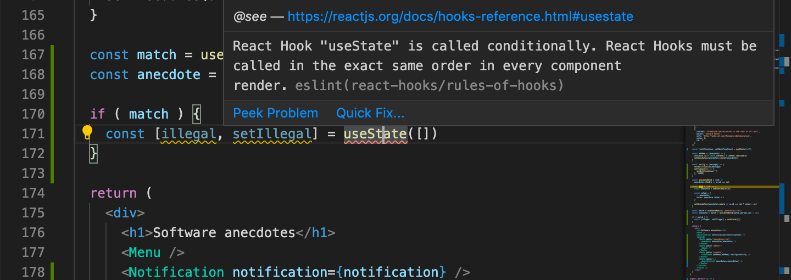
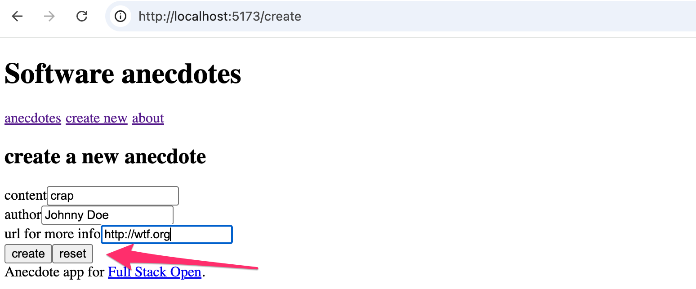

<div class="content">

سنتعلم في هذا القسم القواعد الدقيقة لخطافات React، وتقنيات تحسين الأداء عبر **`useMemo`** و **`useCallback`** و **`React.memo`**، وكيفية بناء **خطافات التخصيص (Custom Hooks)** لإعادة استخدام المنطق بين المكونات بكفاءة عالية.

---

### قواعد استخدام الخطافات (Rules of Hooks)

1. **لا تستدعِ الخطافات داخل الحلقات التكرارية (Loops)، أو الشروط (Conditions)، أو الدوال المتداخلة (Nested Functions).** استدعِ الخطافات دائماً في المستوى الأعلى من دالة المكون.
2. **استدعِ الخطافات فقط أثناء تصيير مكونات الدوال (Function Components) أو داخل خطاف مخصص (Custom Hook).**

تساعد إضافة `eslint-plugin-react-hooks` في تنبيهك فوراً لأي انتهاك لقواعد الخطافات:



---

### التخزين المؤقت للحسابات المكلفة: `useMemo`

تقوم `useMemo` بحفظ وتخزين نتيجة عملية حسابية معقدة بين دورات التصيير، ولا تعيد حسابها إلا إذا تغيرت إحدى القيم في مصفوفة الاعتماديات:

```jsx
import { useState, useMemo } from 'react'

const FilteredList = ({ items }) => {
  const [filter, setFilter] = useState('')
  const [darkMode, setDarkMode] = useState(false)

  // لا يتم تنفيذ الفلترة المكلفة إلا إذا تغيرت قيمة filter فقط
  const filtered = useMemo(() => {
    console.log('جاري الفلترة...')
    return items.filter(item => item.includes(filter))
  }, [filter])

  return (
    <div style={{ background: darkMode ? '#333' : '#fff' }}>
      <input value={filter} onChange={e => setFilter(e.target.value)} />
      <button onClick={() => setDarkMode(!darkMode)}>تبديل الوضع الليلي</button>
      <ul>
        {filtered.map(item => <li key={item}>{item}</li>)}
      </ul>
    </div>
  )
}
```

---

### منع إعادة تصيير المكونات: `React.memo` و `useCallback`

- **`React.memo`**: مكوّن عالي الرتبة (Higher-Order Component) يتخطى إعادة تصيير المكون إذا لم تتغير خصائصه (Props).
- **`useCallback`**: يحفظ مرجع دالة الحدث بين دورات التصيير، مما يمنع تمرير مرجع جديد إلى مكونات `React.memo` عند كل تصيير:

```jsx
import { useState, useCallback, memo } from 'react'

const NoteList = memo(({ notes, onDelete }) => {
  console.log('تصيير قائمة الملاحظات')
  return (
    <ul>
      {notes.map(note => (
        <li key={note.id}>
          {note.content}
          <button onClick={() => onDelete(note.id)}>حذف</button>
        </li>
      ))}
    </ul>
  )
})

const App = () => {
  const [notes, setNotes] = useState([])
  const [newNote, setNewNote] = useState('')

  // يظل مرجع الدالة ثابتاً ولا يتغير عند كل ضغطة مفتاح في حقل الإدخال
  const handleDelete = useCallback((id) => {
    setNotes(notes => notes.filter(n => n.id !== id))
  }, [])

  return (
    <div>
      <input value={newNote} onChange={e => setNewNote(e.target.value)} />
      <NoteList notes={notes} onDelete={handleDelete} />
    </div>
  )
}
```

---

### خطافات التخصيص (Custom Hooks)

تسمح خطافات التخصيص باستخراج منطق الحالة المشترك في دوال قابلة لإعادة الاستخدام. يجب أن يبدأ اسم أي خطاف مخصص بكلمة **`use`**.

#### 1. خطاف إدارة حقول النماذج `useField`:

```js
// src/hooks/index.js
import { useState } from 'react'

export const useField = (type) => {
  const [value, setValue] = useState('')

  const onChange = (event) => {
    setValue(event.target.value)
  }

  const reset = () => {
    setValue('')
  }

  return {
    type,
    value,
    onChange,
    reset,
  }
}
```

استخدامه مع نشر الخصائص (Spread Syntax):

```jsx
const App = () => {
  const name = useField('text')
  const born = useField('date')

  return (
    <form>
      الاسم: <input type={name.type} value={name.value} onChange={name.onChange} />
      تاريخ الميلاد: <input type={born.type} value={born.value} onChange={born.onChange} />
    </form>
  )
}
```

#### 2. خطاف التخزين الدائم `useLocalStorage`:

```js
import { useState } from 'react'

export const useLocalStorage = (key, initialValue) => {
  const [storedValue, setStoredValue] = useState(() => {
    try {
      const item = window.localStorage.getItem(key)
      return item ? JSON.parse(item) : initialValue
    } catch {
      return initialValue
    }
  })

  const setValue = (value) => {
    try {
      setStoredValue(value)
      window.localStorage.setItem(key, JSON.stringify(value))
    } catch (error) {
      console.error(error)
    }
  }

  return [storedValue, setValue]
}
```

</div>

<div class="tasks">

<h3>التمارين 7.1 - 7.6: خطافات التخصيص وتطبيق الطرائف الموجهة (Routed Anecdotes)</h3>

استخدم المشروع في المستودع: `https://github.com/fullstack-hy2020/routed-anecdotes` كنقطة بداية.

<h4>7.1: خطاف الحقول (useField hook)</h4>
أنشئ الخطاف المخصص `useField` في `src/hooks/index.js` واستخدمه لإدارة حقول نموذج إنشاء الطرفة الجديدة.

<h4>7.2: إضافة دالة التصفير (useField with reset)</h4>
أضف زراً للنموذج لمسح الحقول (`reset`)، وقم بتوسيع `useField` لتصدير دالة تصفير قيمة الحقل.



<h4>7.3: إصلاح مشكلة نشر الخصائص (Fixing the spread issue)</h4>
تأكد من عدم تمرير خاصية `reset` كـ attribute لوسم `<input>` لتجنب ظهور تحذير في كونسول المتصفح.

<h4>7.4: خطاف الطرائف - الخطوة 1 (useAnecdotes step 1)</h4>
ابنِ خطافاً مخصصاً `useAnecdotes` لجلب قائمة الطرائف من الخادم الخلفي (JSON Server) باستخدام Fetch API و useEffect.

<h4>7.5: خطاف الطرائف - الخطوة 2 (useAnecdotes step 2)</h4>
قم بتوسيع `useAnecdotes` ليدعم إضافة طرفة جديدة وإرسالها إلى الخادم وتحديث الحالة المحلية.

<h4>7.6: خطاف الطرائف - الخطوة 3 (useAnecdotes step 3)</h4>
أضف دالة لحذف الطرائف `deleteAnecdote`، وأعد هيكلة المكونات بحيث تستدعي `useAnecdotes` مباشرة دون تمرير البيانات والوظائف كـ Props من المكون `App`.

</div>
