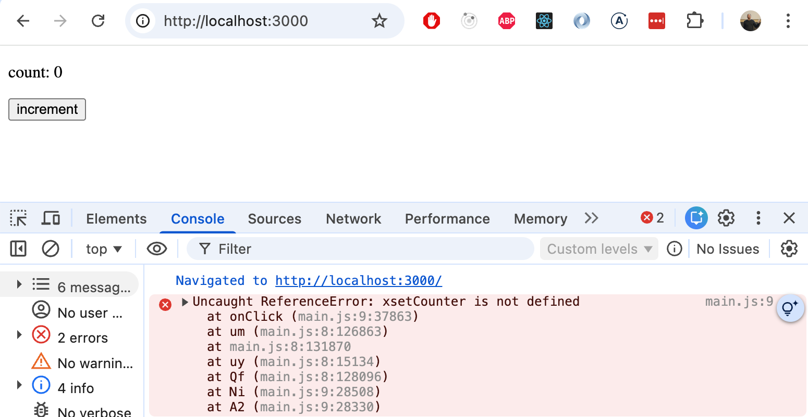

<div class="content">

في الأيام الأولى، كانت مكتبة React مشهورة نوعاً ما بصعوبة تهيئة وضبط الأدوات اللازمة لتطوير التطبيقات. ولتسهيل هذا الموقف، تم تطوير [Create React App](https://github.com/facebookincubator/create-react-app)، مما قضى على المشاكل المتعلقة بملفات التهيئة والإعدادات. ومنذ ذلك الحين، حلت أداة [Vite](https://vitejs.dev/) - المستخدمة طوال هذه الدورة - محل Create React App كمعيار قياسي لإنشاء تطبيقات React الجديدة.

تستخدم كل من Vite و Create React App **مجمّعات الشيفرات (Bundlers)** للقيام بالعمل الفعلي. في هذا القسم، سنلقي نظرة فاحصة على ما تفعله مجمّعات الشيفرات في الواقع، وكيف تعمل Vite خلف الكواليس، وكيفية تهيئتها لسيناريوهات مختلفة. سنستكشف أيضاً باختصار أداة [esbuild](https://esbuild.github.io/)، وهي مجمّع منخفض المستوى تستخدمه Vite نفسها داخلياً، ففهم esbuild يساعد في توضيح المفهوم الجوهري لعملية التجميع والحزم (Bundling).

> #### ماذا عن Webpack؟
>
> كانت أداة Webpack هي المجمّع المهيمن لمعظم سنوات العقد الأول من القرن الحادي والعشرين (2010s)، ولا تزال موجودة في قواعد الشيفرات القديمة وتطبيقات الشركات الضخمة. وغطت هذه الدورة أيضاً Webpack حتى ربيع عام 2026.
>
> إذا كنت تعمل على مشروع قديم (Legacy Project)، فإن معرفة وجود Webpack واستخدامها لنفس المفاهيم الأساسية (نقاط الدخول Entry Points، والمحولات/الإضافات Loaders/Plugins، والمخرجات Output) أمر مفيد. ومع ذلك، لا يوصى بإنشاء مشروع جديد باستخدام Webpack في عام 2026؛ فإعداداتها معقدة، والأدوات الحديثة مثل Vite توفر تجربة تطوير أفضل بشكل هائل للمطورين. لن نقوم بتغطية إعدادات Webpack في هذه الدورة.

### تجميع وحزم الشيفرة (Bundling)

لقد قمنا بتنفيذ تطبيقاتنا عن طريق تقسيم الشيفرة البرمجية إلى وحدات (Modules) منفصلة يتم **استيرادها (Imported)** في الأماكن التي تحتاج إليها. على الرغم من أن وحدات ES6 محددة رسمياً في معيار ECMAScript، إلا أنه ليست كل بيئات التشغيل تتعامل مع الشيفرات القائمة على الوحدات تلقائياً. حتى المتصفحات الحديثة تستفيد بشكل كبير من معالجة التبعيات مسبقاً وتحسينها قبل تسليمها للمستخدم.

لهذا السبب، فإن الشيفرة المقسمة إلى وحدات يتم **تجميعها وحزمها (Bundled)** لبيئة الإنتاج (Production)، مما يعني تحويل ملفات الشيفرة المصدرية ودمجها في مجموعة محسنة ومصغرة من الملفات التي يمكن للمتصفح تحميلها بكفاءة عالية. عندما قمنا بتشغيل <i>npm run build</i> في الأجزاء السابقة من هذه الدورة، قامت Vite بعملية التجميع هذه. تظهر المخرجات في المجلد <i>dist</i>:

```
├── assets
│   ├── index-d526a0c5.css
│   ├── index-e92ae01e.js
│   └── react-35ef61ed.svg
├── index.html
└── vite.svg
```

يقوم ملف <i>index.html</i> في الجذر بتحميل ملف JavaScript المجمّع عبر وسم <i>script</i>:

```html
<!doctype html>
<html lang="en">
  <head>
    <meta charset="UTF-8" />
    <link rel="icon" type="image/svg+xml" href="/vite.svg" />
    <meta name="viewport" content="width=device-width, initial-scale=1.0" />
    <title>Vite + React</title>
    <script type="module" crossorigin src="/assets/index-e92ae01e.js"></script> // highlight-line
    <link rel="stylesheet" href="/assets/index-d526a0c5.css">  // highlight-line
  </head>
  <body>
    <div id="root"></div>
  </body>
</html>
```

يتم أيضاً تجميع ملفات CSS داخل ملف واحد مجمع.

من الناحية العملية، تبدأ عملية التجميع من نقطة دخول (Entry Point)، والتي عادة ما تكون <i>main.jsx</i>. لا تتضمن Vite الشيفرة من نقطة الدخول فحسب، بل تتضمن أيضاً كل ما تستورده تكرارياً (Recursively)، حتى يتم حل وحساب شجرة التبعيات الكاملة (Dependency Graph).

نظراً لأن جزءاً من الملفات المستوردة هي حزم مثل React و Redux و Axios، فإن ملف JavaScript المجمّع سيحتوي أيضاً على محتويات كل من هذه المكتبات.

> قبل توفر مجمعات الشيفرات، كان النهج القديم يعتمد على قيام ملف index.html بتحميل كافة ملفات JavaScript المنفصلة للتطبيق بمساعدة وسوم script المتعددة. أدى ذلك إلى انخفاض الأداء، لأن تحميل كل ملف منفصل يتسبب في استهلاك موارد وتأخير إضافي للشبكة. لهذا السبب، أصبحت الطريقة المفضلة في الوقت الحاضر هي تجميع وحزم الشيفرة في ملف واحد. كما يتيح التجميع تحسينات مثل تصغير الشيفرة (Minification) وتقليم الشيفرة الميتة أو غير المستخدمة (Tree-shaking).

### كيف تعمل Vite

تعمل Vite وفق نمطين تشغيليين متميزين يعملان بشكل مختلف تماماً:

**نمط التطوير (Development mode)** (عبر الأمر <i>npm run dev</i>): لا يقوم بحزم وتجميع شيفرتك على الإطلاق. بدلاً من ذلك، تبدأ Vite خادم تطوير يقدّم ملفاتك المصدرية كوحدات ES أصلية (Native ES Modules)، مما يتيح للمتصفح حل عمليات الاستيراد مباشرة. هذا هو السبب في أن بدء تشغيل الخادم فوري تقريباً بغض النظر عن حجم المشروع.
استثناء واحد فقط: يتم تجميع تبعيات الطرف الثالث مسبقاً من مجلد node_modules بواسطة أداة esbuild قبل بدء تشغيل الخادم. يعالج هذا مشكلتين: فالعديد من حزم npm لا تزال بتنسيق CommonJS (الذي لا تستطيع المتصفحات استهلاكه مباشرة بشكل أصلي)، كما تتكون بعض المكتبات من مئات الملفات الداخلية الصغيرة التي قد تؤدي بخلاف ذلك إلى إطلاق مئات الطلبات المنفصلة عبر الشبكة. تقوم esbuild بتحويلها ودمجها معاً، وحفظ النتيجة في ذاكرة التخزين المؤقت على القرص، مما يجعل عمليات التشغيل اللاحقة شبه فورية.

**نمط الإنتاج (Production mode)** (عبر الأمر <i>npm run build</i>): يستخدم أداة [Rollup](https://rollupjs.org/) للتجميع بينما تستمر esbuild في التعامل مع المهام الأخرى مثل الترجمة البرمجية (JSX و TypeScript) وتصغير الشيفرة (Minification). صُممت Rollup من الأساس لوحدات ES البرمجية، مما يجعلها بارعة بشكل استثنائي في **تقليم الشيفرة غير المستخدمة (Tree-shaking)**، وهي تقنية تحلل بشكل ثابت ما يتم تصديره واستخدامه بالفعل من كل وحدة برمجية، وتزيل الباقي بالكامل من الحزمة النهائية. على سبيل المثال، إذا قمت باستيراد دالة مساعدة واحدة فقط من مكتبة ضخمة، فإن تقليم الشيفرة يضمن عدم تضمين بقية شيفرة تلك المكتبة في الحزمة المجمعة، مما يقلل حجم الحزمة بشكل كبير.

هذا التقسيم للعمل — esbuild للسرعة الفائقة، و Rollup لجودة وتنسيق الحزمة النهائية — هو جوهر تصميم بنية Vite.

> قد تتساءل لماذا لا تستخدم Vite أداة esbuild لتجميع حزم الإنتاج أيضاً، نظراً لسرعتها الفائقة؟ السبب هو أن مخرجات التجميع في esbuild، رغم صحتها، تنتج نتائج أقل مثالية في السيناريوهات المتقدمة: فهي توفر دعماً محدوداً لتقسيم الشيفرة (Code Splitting)، ولا تنتج نفس المستوى العالي من تحسين أجزاء الحزم (Chunks)، كما أن منظومة إضافاتها للتحويلات على مستوى الحزمة لا تزال قيد النضج والتطور. بينما مخرجات Rollup أكثر قابلية للتنبؤ وأفضل ضبطاً لمخططات التبعيات المعقدة للتطبيقات الحقيقية. وقد [صرح مؤلفو Vite](https://vitejs.dev/guide/why.html#why-not-bundle-with-esbuild) بأنهم ينوون التبديل إلى esbuild للتجميع النهائي للإنتاج بمجرد أن تسد قدراتها هذه الفجوة.

### فهم أداة esbuild

لفهم ما تنطوي عليه عملية التجميع من حيث المبدأ، من المفيد العمل مع [esbuild](https://esbuild.github.io/) مباشرة، دون طبقة التجريد الإضافية التي تضعها Vite فوقها. دعنا نبني بيئة React بسيطة ومجردة من الصفر.

دعنا ننشئ تطبيق React بسيطاً بهيكل المجلدات التالي:

```
├── dist
│   └── index.html
├── src
│   ├── main.jsx
│   └── App.jsx
└── package.json
```

نبدأ بتثبيت React و react-dom:

```bash
npm install react react-dom
```

نحتاج أيضاً إلى تثبيت esbuild:

```bash
npm install --save-dev esbuild
```

في البداية، نضيف نصين برمجيين (Scripts) إلى ملف <i>package.json</i>:

```json
{
  "scripts": {
    "build": "esbuild src/main.jsx --bundle --outfile=dist/main.js --jsx=automatic",
    "serve": "npx serve dist"
  },
  // ...
}
```

بالنسبة للتطبيق، نحتاج إلى الملف <i>dist/index.html</i> الذي يحمل حزمة JavaScript المجمعة:

```html
<!DOCTYPE html>
<html lang="en">
  <head>
    <meta charset="UTF-8" />
    <title>esbuild app</title>
  </head>
  <body>
    <div id="root"></div>
    <script src="./main.js"></script>
  </body>
</html>
```

نقطة الدخول <i>src/main.jsx</i> هي الملف النموذجي المعتاد:

```jsx
import React from 'react'
import ReactDOM from 'react-dom/client'
import App from './App'

ReactDOM.createRoot(document.getElementById('root')).render(<App />)
```

مكوّن التطبيق البسيط <i>src/App.jsx</i> هو كالتالي:

```jsx
import React, { useState } from 'react'

const App = () => {
  const [counter, setCounter] = useState(0)

  return (
    <div>
      <p>count: {counter}</p>
      <button onClick={() => setCounter(counter + 1)}>increment</button>
    </div>
  )
}

export default App
```

الآن يمكننا تجميع وحزم التطبيق:

```bash
npm run build
```

الناتج هو ملف واحد <i>dist/main.js</i> يحتوي على شيفرة تطبيقك جنباً إلى جنب مع مكتبة React مجمعتين معاً.

يمكننا الآن تشغيل التطبيق المجمّع عبر <i>npm run serve</i>. يستخدم هذا الأمر حزمة [serve](https://www.npmjs.com/package/serve) لبدء خادم ملفات ثابتة محلي للمجلد <i>dist</i>، مما يجعل التطبيق متاحاً على <i>http://localhost:3000</i>:


تدعم esbuild أيضاً [تصغير الشيفرة وضغطها (Minification)](https://en.wikipedia.org/wiki/Minification_(programming)) عبر أعلام سطر الأوامر (Command-line flags). يزيل التصغير المسافات البيضاء والتعليقات، ويقصر أسماء المتغيرات، ويطبق تحسينات أخرى على الحجم. ستكون الحزمة كبيرة بشكل ملحوظ لأنها تتضمن مكتبة React الكاملة. ويؤدي التصغير إلى تقليل حجمها بشكل كبير.

دعنا نفعّل التصغير الآن:

```json
{
  "scripts": {
    "build": "esbuild src/main.jsx --bundle --minify --outfile=dist/main.js --jsx=automatic",  // highlight-line
    "serve": "npx serve dist"
  }
}
```

يؤدي التصغير إلى خفض حجم الحزمة من حوالي 1.1 ميغابايت إلى حوالي 190 كيلوبايت، وهو انخفاض جوهري.

لكن تصغير الشيفرة ينطوي على عقبة: إذا أطلق التطبيق خطأً أثناء التشغيل (Runtime Error)، فستشير أدوات مطوري المتصفح إلى سطر داخل ملف <i>main.js</i> المصغر والمضغوط، وهو أمر يستحيل قراءته تقريباً:



الحل هو **خريطة المصدر (Source Map)**: وهي عبارة عن ملف مرافق (<i>dist/main.js.map</i>) يسجل كيف يتوافق كل سطر من الحزمة المصغرة مع المصدر الأصلي غير المصغر. مع تفعيلها، يشير تتبع المكدس (Stack Trace) إلى السطر الدقيق في <i>App.jsx</i> أو <i>main.jsx</i> بدلاً من الإشارة إلى مكان ما داخل جدار غير مقروء من الشيفرات المضغوطة.

يمكننا تمكين خرائط المصدر بإضافة العلم <i>--sourcemap</i>:

```json
{
  "scripts": {
    "build": "esbuild src/main.jsx --bundle --minify --sourcemap --outfile=dist/main.js --jsx=automatic",  // highlight-line
    "serve": "npx serve dist"
  }
}
```

الآن أصبح لرسالة الخطأ معنى واضح ودقيق:


لاحظ أن خرائط المصدر لا تقدر بثمن أثناء التطوير وتصحيح الأخطاء، ولكن قد ترغب في استبعادها من حزمة الإنتاج العامة (Public Production Build). نظراً لأن خريطة المصدر تحتوي على الشيفرة المصدرية الأصلية الكاملة، يمكن لأي شخص يفتح أدوات مطوري المتصفح قراءة منطق تطبيقك الأصلي غير المصغر. إذا كان هذا يمثل مصدر قلق، فما عليك سوى حذف العلم <i>--sourcemap</i> من أمر بناء الإنتاج.

### الترجمة البرمجية (Transpilation)

إلى جانب تجميع الشيفرات، تؤدي esbuild مهمة أساسية أخرى: **الترجمة البرمجية (Transpilation)**. تعني الترجمة البرمجية تحويل الشيفرة المصدرية المكتوبة بصيغة معينة من JavaScript إلى صيغة أخرى، وعادة ما يكون ذلك من تركيب نحوي حديث أو موسع إلى JavaScript بسيط وقياسي يمكن للمتصفحات تنفيذه.

تفهم المتصفحات لغة JavaScript القياسية، لكن JSX ليس تركيباً صالحاً في JavaScript، ولا يمكن لأي متصفح تحليله مباشرة. عندما نكتب:

```jsx
const element = <App />
```

يجب ترجمته برمجياً إلى شيء يمكن للمتصفح تشغيله:

```js
const element = React.createElement(App, null)
```

هذا هو السبب في أن الترجمة البرمجية تعد خطوة إلزامية لأي مشروع React وليست مجرد تحسين اختياري. تقوم esbuild بهذه العملية تلقائياً أثناء التجميع. باستخدام العلم <i>--jsx=automatic</i>، تتعامل esbuild مع JSX دون أي أداة خارجية. في سير العمل القديم القائم على Webpack، كان يتعين عليك تثبيت وتهيئة [Babel](https://babeljs.io/) والحزم ذات الصلة لترجمة JSX للمتصفح. مع esbuild، تُترجم الملفات التي تنتهي بـ <i>.jsx</i> تلقائياً وبشكل مباشر.

### بيئة التطوير (Development environment)

حتى الآن، يتطلب كل تغيير تشغيل الأمر <i>npm run build</i> وتحديث المتصفح يدوياً، وهي حلقة بطيئة وسرعان ما تصبح مرهقة. يحل [خادم التطوير](https://esbuild.github.io/api/#serve) المدمج في esbuild هذه المشكلة. أضف نص <i>dev</i> إلى <i>package.json</i>:

```json
{
  "scripts": {
    "build": "esbuild src/main.jsx --bundle --minify --sourcemap --outfile=dist/main.js --jsx=automatic",
    "serve": "npx serve dist",
    "dev": "esbuild src/main.jsx --bundle --outfile=dist/main.js --jsx=automatic --servedir=./dist --watch" // highlight-line
  }
}
```

يؤدي تشغيل <i>npm run dev</i> إلى أمرين في وقت واحد. أولاً، يطلب العلم [--watch](https://esbuild.github.io/api/#watch) من esbuild مراقبة جميع الملفات المصدرية المستوردة بحثاً عن أي تغييرات وإعادة بناء الحزمة تلقائياً متى تم حفظ أي منها. ثانياً، يبدأ العلم [--servedir](https://esbuild.github.io/api/#serve) خادم HTTP خفيف الوزن يقدّم محتويات مجلد <i>dist</i>، أي ملف <i>index.html</i> وملف <i>main.js</i> المبني حديثاً، على العنوان <i>http://localhost:8000</i>.

إن العلم <i>--servedir</i> هو ما يجعل الجزأين يعملان معاً: بدونه، ستقوم esbuild بإعادة البناء في وضع المراقبة فقط دون تقديم أي شيء عبر الخادم. وبوجوده، يقدم الخادم دائماً أحدث حزمة مجمعة، بحيث تحتاج فقط إلى تحديث المتصفح بعد حفظ الملف.

لاحظ أنه على عكس خادم تطوير Vite، لا تدعم esbuild الاستبدال الساخن للوحدات (Hot Module Replacement). تتطلب التغييرات في الشيفرة المصدرية تحديث المتصفح يدوياً لتصبح سارية المفعول.

يوضح وضوح واجهة esbuild ما يفعله مجمّع الشيفرات بشكل أساسي: فهو يأخذ نقطة دخول، ويتبع جميع عمليات الاستيراد، وينتج مخرجات محسنة. وتبني Vite فوق هذا الأساس لتضيف طبقة تحسين تجربة المطور: خادم تطوير، واستبدال ساخن للوحدات، وإعدادات افتراضية ذكية لمشاريع React.

الآن بعد أن أصبحت لدينا صورة أوضح لما تنطوي عليه عمليتا التجميع والترجمة البرمجية بشكل جوهري، دعنا نعود إلى Vite ونرى كيف يمكن تهيئتها وضبطها.

### تهيئة وإعدادات Vite

بالنسبة لمعظم مشاريع React، تعمل Vite بدون أي ملفات تهيئة على الإطلاق. ومع ذلك، عندما تحتاج إلى تخصيص سلوكها، يمكنك تعديل الملف <i>vite.config.js</i> (أو <i>vite.config.ts</i>).

يبدو ملف التهيئة البسيط لـ Vite لمشروع React كما يلي:

```js
import { defineConfig } from 'vite'
import react from '@vitejs/plugin-react'

export default defineConfig({
  plugins: [react()],
})
```

تتيح الإضافة <i>@vitejs/plugin-react</i> تحويل JSX، والتحديث السريع Fast Refresh (الاستبدال الساخن للوحدات الذي يحافظ على حالة المكوّنات)، وميزات أخرى خاصة بـ React.

#### تهيئة خادم التطوير

يمكنك تهيئة منفذ (Port) خادم التطوير والإعدادات الأخرى تحت المفتاح <i>server</i>:

```js
export default defineConfig({
  plugins: [react()],
  server: {
    port: 3000,
    open: true,        // open browser automatically
  },
})
```

#### توجيه طلبات API عبر الخادم الوسيط (Proxying API requests)

عند التطوير محلياً، يعمل تطبيق React عادة على منفذ معين (مثل 3000) بينما يعمل خادمك الخلفي على منفذ آخر (مثل 3001). تمنع سياسة الأصل المشترك للمتصفح (Same-Origin Policy) عادة الطلبات المتبادلة بينهما. يحل إعداد البروكسي (Proxy) في Vite هذه المشكلة دون الحاجة إلى تكوين CORS على الخادم الخلفي:

```js
export default defineConfig({
  plugins: [react()],
  server: {
    port: 3000,
    proxy: {
      '/api': {
        target: 'http://localhost:3001',
        changeOrigin: true,
      },
    },
  },
})
```

مع هذا الإعداد، يُعاد توجيه أي طلب يرسله تطبيق React الخاص بك إلى <i>/api/notes</i> تلقائياً إلى <i>http://localhost:3001/api/notes</i> بواسطة خادم تطوير Vite. لا تحتاج شيفرة الواجهة الأمامية أبداً إلى تضمين <i>localhost:3001</i> في عناوين URL الخاصة بها أثناء التطوير.

#### متغيرات البيئة (Environment variables)

تتمتع Vite بدعم مدمج لمتغيرات البيئة باستخدام ملفات <i>.env</i>. هذا هو البديل الحديث للحقن اليدوي للثوابت داخل الحزمة المجمعة.

أنشئ ملف <i>.env</i> في جذر المشروع:

```
VITE_BACKEND_URL=http://localhost:3001/api/notes
```

وملف <i>.env.production</i> لقيم بيئة الإنتاج:

```
VITE_BACKEND_URL=https://myapp.fly.dev/api/notes
```

**مهم جداً:** يجب أن تبدأ جميع متغيرات البيئة المكشوفة للمتصفح بالبادئة <i>VITE_</i>. المتغيرات التي لا تحتوي على هذه البادئة تظل خاصة بجانب الخادم فقط ولا يتم تضمينها في الحزمة المجمعة. هذا إجراء أمني مقصود لمنع تسريب المفاتيح والأسرار الحساسة عن طريق الخطأ.

يمكنك الوصول إلى المتغير في شيفرة تطبيقك عبر <i>import.meta.env</i>:

```js
const App = () => {
  const notes = useNotes(import.meta.env.VITE_BACKEND_URL)

  return (
    <div>
      {notes.length} notes on server {import.meta.env.VITE_BACKEND_URL}
    </div>
  )
}
```

تختار Vite تلقائياً ملف <i>.env</i> الصحيح بناءً على وضع التشغيل:

- يستخدم <i>npm run dev</i> الملفين <i>.env</i> و <i>.env.development</i>
- يستخدم <i>npm run build</i> الملفين <i>.env</i> و <i>.env.production</i>

أضف ملف <i>.env.production</i> إلى <i>.gitignore</i> إذا كان يحتوي على قيم حساسة، واستخدم ملف <i>.env.example</i> لتوثيق المتغيرات المطلوبة.

#### الترجمة البرمجية (Transpilation)

تتعامل Vite مع الترجمة البرمجية للشيفرة تلقائياً. أثناء التطوير، تقوم esbuild بترجمة TypeScript و JSX عند الطلب. وهي سريعة بما يكفي للقيام بذلك لكل ملف على حدة دون تأخير ملحوظ. أثناء عمليات بناء الإنتاج، تتعامل Rollup مع التجميع بينما تتولى esbuild الترجمة البرمجية.

الهدف الافتراضي للترجمة في Vite هو المتصفحات الحديثة التي تدعم وحدات ES الأصلية (مثل Chrome 87+ و Firefox 78+ و Safari 14+ و Edge 88+). إذا كنت بحاجة إلى دعم متصفحات أقدم، يمكنك تكوين الهدف بشكل صريح وإضافة الإضافة <i>@vitejs/plugin-legacy</i>:

```bash
npm install --save-dev @vitejs/plugin-legacy
```

```js
import { defineConfig } from 'vite'
import react from '@vitejs/plugin-react'
import legacy from '@vitejs/plugin-legacy'

export default defineConfig({
  plugins: [
    react(),
    legacy({
      targets: ['defaults', 'not IE 11'],
    }),
  ],
})
```

تنشئ إضافة legacy تلقائياً حزمة منفصلة للمتصفحات القديمة باستخدام Babel.

#### تنسيقات CSS

تتعامل Vite مع CSS دون أي إعدادات إضافية. ما عليك سوى استيراد ملف CSS من داخل ملف JavaScript:

```js
import './index.css'
```

ستقوم Vite بمعالجته وتضمينه في البناء. في بيئة الإنتاج، يتم استخراج CSS في ملف منفصل. وأثناء التطوير، يتم حقنه عبر وسوم <i>&lt;style&gt;</i> مع دعم إعادة التحميل الساخن (Hot Reload).

تدعم Vite أيضاً بشكل أصلي [وحدات CSS البرمجية (CSS Modules)](https://github.com/css-modules/css-modules) للأنماط محددة النطاق (Scoped Styles). يُعامل أي ملف ينتهي بـ <i>.module.css</i> كوحدة CSS Module:

```js
import styles from './App.module.css'

const App = () => (
  <div className={styles.container}>
    hello vite
  </div>
)
```

يمكن إضافة معالجات CSS المسبقة مثل [Sass](https://sass-lang.com/) ببساطة عن طريق تثبيت المعالج المسبق، دون الحاجة إلى أي إضافة أو تهيئة:

```bash
npm install --save-dev sass
```

بعد ذلك، تعمل ملفات <i>.scss</i> تلقائياً وبشكل مباشر.

#### تصغير الشيفرة (Minification)

عند تشغيل <i>npm run build</i>، تقوم Vite بتصغير المخرجات. يزيل التصغير المسافات البيضاء والتعليقات، ويقصر أسماء المتغيرات، ويطبق تحسينات أخرى على الحجم. والنتيجة هي ملف أصغر بكثير يتم تحميله بشكل أسرع في المتصفح.

تستخدم Vite أداة esbuild لتصغير JavaScript ومصغر CSS مدمجاً لأوراق الأنماط.

#### خرائط المصدر (Source maps)

تسمح خرائط المصدر لأدوات مطوري المتصفح بربط الأخطاء ونقاط التوقف (Breakpoints) بالشيفرة المصدرية الأصلية بدلاً من الحزمة المصغرة. وبدونها، فإن تتبع المكدس الذي يشير إلى السطر 1 من <i>main.js</i> يكون عديم الفائدة تقريباً لتصحيح الأخطاء.

في بيئة التطوير، تولد Vite خرائط المصدر تلقائياً. أما بالنسبة لبناء الإنتاج، فيمكنك تمكينها بشكل صريح:

```js
export default defineConfig({
  plugins: [react()],
  build: {
    sourcemap: true,
  },
})
```

لاحظ أن خرائط المصدر في بيئة الإنتاج تزيد من وقت البناء وتكشف شيفرتك المصدرية لأي شخص ينظر في علامة تبويب الشبكة (Network tab). في كثير من الحالات، من الأفضل رفع خرائط المصدر إلى خدمة مراقبة الأخطاء (مثل Sentry) وإبقائها بعيدة عن الخادم العام.

#### الإضافات (Plugins)

تتوسع وظائف Vite من خلال [الإضافات (Plugins)](https://vite.dev/plugins/). لقد نمت منظومة الإضافات بسرعة وتغطي معظم الاحتياجات الشائعة. تشمل بعض الإضافات المستخدمة على نطاق واسع:

- <i>@vitejs/plugin-react</i> — دعم React (تحويل JSX، والتحديث السريع Fast Refresh)
- <i>@vitejs/plugin-legacy</i> — دعم المتصفحات القديمة
- <i>vite-plugin-svgr</i> — استيراد ملفات SVG كمكوّنات React
- <i>rollup-plugin-visualizer</i> — تحليل وتصور حجم الحزمة المجمعة

يتم تحديد الإضافات في مصفوفة <i>plugins</i> داخل ملف <i>vite.config.js</i>. وهي تتبع نفس واجهة إضافات Rollup، لذلك تعمل العديد من إضافات Rollup بسلاسة مع Vite أيضاً.

#### جسور التوافق (Polyfills)

**جسر التوافق (Polyfill)** هو شيفرة برمجية تطبق ميزة معينة للمتصفحات التي لا تدعمها بشكل أصلي. فالترجمة البرمجية وحدها ليست كافية للميزات الصالحة نحوياً ولكنها غير مطبقة داخل المتصفح. على سبيل المثال، قد يحلل المتصفح كائن <i>Promise</i> بشكل صحيح ولكنه لا يمتلك أي تطبيق برمجي داخلي له.

مع Vite، تتم معالجة جسور التوافق بواسطة الإضافة <i>@vitejs/plugin-legacy</i>، والتي تتضمن تلقائياً البوليفيلز الضرورية بناءً على المتصفحات المستهدفة. إذا كنت بحاجة إلى بوليفيل محدد دون استخدام إضافة legacy، فيمكنك تثبيته مباشرة واستيراده في الجزء العلوي من ملف نقطة الدخول الخاص بك.

يمكنك التحقق من دعم المتصفح لواجهات برمجة تطبيقات معينة على موقع [https://caniuse.com](https://caniuse.com) أو [توثيق MDN من موزيلا](https://developer.mozilla.org/).

</div>
