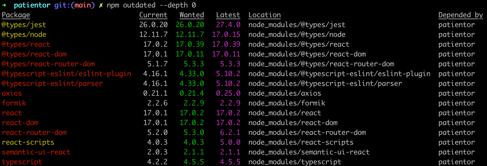
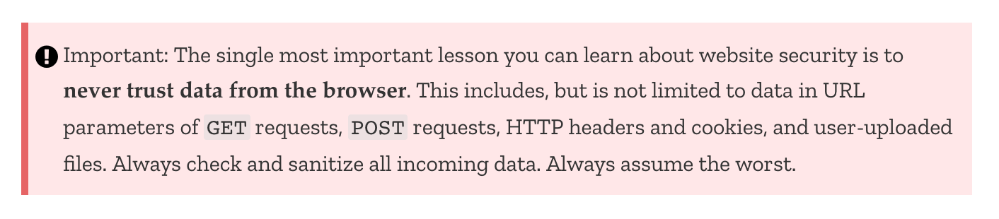
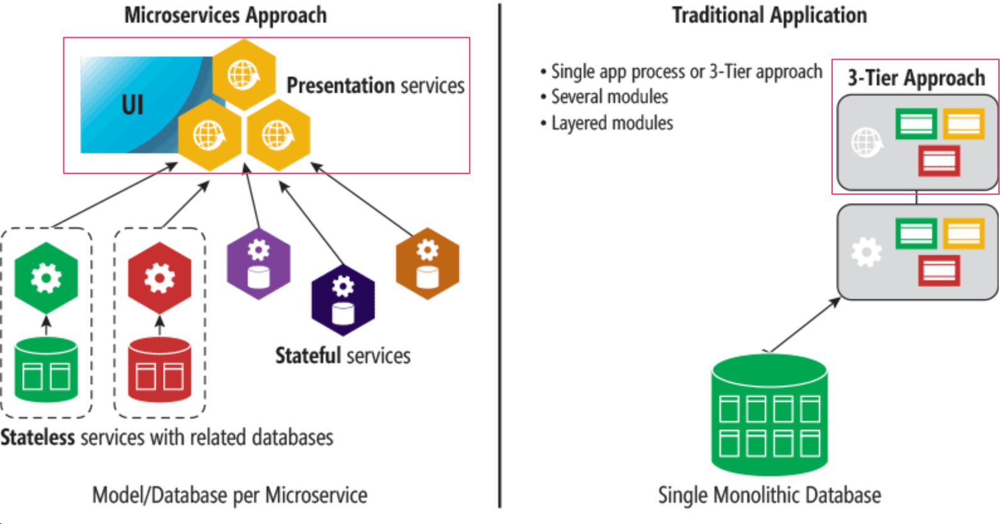

<div class="content">

### مكونات الفئات (Class Components)

خلال هذه الدورة، استخدمنا فقط مكوّنات React التي تم تعريفها كدوال JavaScript (Functional Components). لم يكن هذا ممكناً بدون ميزة [الخطافات (Hooks)](https://reactjs.org/docs/hooks-intro.html) التي ظهرت مع الإصدار 16.8 من React. قبل ذلك، عند تعريف مكوّن يستخدم الحالة (State)، كان يتعين تعريفه باستخدام صيغة [الفئات (Class)](https://reactjs.org/docs/state-and-lifecycle.html#converting-a-function-to-a-class) في JavaScript.

من المفيد أن تكون على دراية بمكونات الفئات إلى حد ما على الأقل، نظراً لأن العالم البرمجي يحتوي على الكثير من شيفرات React القديمة، والتي من المحتمل ألا تتم إعادة كتابتها بالكامل باستخدام الصيغة الحديثة.

دعنا نتعرف على الميزات الرئيسية لمكونات الفئات من خلال إنشاء تطبيق طرائف (Anecdotes) مألوف للغاية. سنقوم بتخزين الطرائف في الملف <i>db.json</i> باستخدام <i>json-server</i>. محتويات الملف مأخوذة من [هنا](https://github.com/fullstack-hy/misc/blob/master/anecdotes.json).

يبدو الإصدار الأولي من مكوّن الفئة على النحو التالي:

```js
import React from 'react'

class App extends React.Component {
  constructor(props) {
    super(props)
  }

  render() {
    return (
      <div>
        <h1>anecdote of the day</h1>
      </div>
    )
  }
}

export default App
```

يحتوي المكوّن الآن على [دالة البناء (Constructor)](https://react.dev/reference/react/Component#constructor)، والتي لا يحدث فيها شيء في الوقت الحالي، ويحتوي على الدالة [render](https://react.dev/reference/react/Component#render). كما قد يخمن المرء، تحدد render كيف وماذا يتم تصييره على الشاشة.

دعنا نعرّف حالة لقائمة الطرائف وللطرفة المعروضة حالياً. على عكس استخدام خطاف [useState](https://react.dev/reference/react/useState)، تحتوي مكونات الفئات على حالة واحدة فقط. لذلك إذا كانت الحالة تتكون من عدة "أجزاء"، فيجب تخزينها كخصائص لكائن الحالة. يتم تهيئة الحالة داخل دالة البناء (Constructor):

```js
class App extends React.Component {
  constructor(props) {
    super(props)

    // highlight-start
    this.state = {
      anecdotes: [],
      current: 0
    }
    // highlight-end
  }

  render() {
  // highlight-start
    if (this.state.anecdotes.length === 0) {
      return <div>no anecdotes...</div>
    }
  // highlight-end

    return (
      <div>
        <h1>anecdote of the day</h1>
        // highlight-start
        <div>
          {this.state.anecdotes[this.state.current].content}
        </div>
        <button>next</button>
        // highlight-end
      </div>
    )
  }
}
```

توجد حالة المكوّن في متغير النسخة <i>this.state</i>. الحالة عبارة عن كائن له خاصيتان: <i>this.state.anecdotes</i> وهي قائمة الطرائف، و <i>this.state.current</i> وهي مؤشر (Index) الطرفة المعروضة حالياً.

في المكوّنات الدالية (Functional Components)، المكان المناسب لجلب البيانات من الخادم هو داخل [خطاف التأثير (Effect Hook)](https://react.dev/reference/react/useEffect)، والذي يُنفّذ عند تصيير المكوّن أو بتكرار أقل إذا لزم الأمر، على سبيل المثال فقط مع أول عملية تصيير.

توفر [دوال دورة الحياة (Lifecycle Methods)](https://react.dev/reference/react/Component#adding-lifecycle-methods-to-a-class-component) في مكونات الفئات وظائف مطابقة. المكان الصحيح لبدء جلب البيانات من الخادم هو داخل دالة دورة الحياة [componentDidMount](https://react.dev/reference/react/Component#componentdidmount)، والتي تُنفّذ مرة واحدة مباشرة بعد أول عملية تصيير للمكوّن:

```js
class App extends React.Component {
  constructor(props) {
    super(props)

    this.state = {
      anecdotes: [],
      current: 0
    }
  }

  // highlight-start
  componentDidMount = () => {
    axios.get('http://localhost:3001/anecdotes').then(response => {
      this.setState({ anecdotes: response.data })
    })
  }
  // highlight-end

  // ...
}
```

تقوم الدالة الاسترجاعية لطلب HTTP بتحديث حالة المكوّن باستخدام الدالة [setState](https://react.dev/reference/react/Component#setstate). تعدل هذه الدالة فقط المفاتيح التي تم تعريفها في الكائن الممرر إليها كمعامل، بينما تظل قيمة المفتاح <i>current</i> دون أي تغيير.

يؤدي استدعاء الدالة setState دائماً إلى تشغيل إعادة تصيير مكوّن الفئة، أي استدعاء الدالة <i>render</i> مجدداً.

سننهي المكوّن بإضافة القدرة على تغيير الطرفة المعروضة. فيما يلي شيفرة المكوّن بالكامل مع تمييز الإضافة:

```js
class App extends React.Component {
  constructor(props) {
    super(props)

    this.state = {
      anecdotes: [],
      current: 0
    }
  }

  componentDidMount = () => {
    axios.get('http://localhost:3001/anecdotes').then(response => {
      this.setState({ anecdotes: response.data })
    })
  }

  // highlight-start
  handleClick = () => {
    const current = Math.floor(
      Math.random() * this.state.anecdotes.length
    )
    this.setState({ current })
  }
  // highlight-end

  render() {
    if (this.state.anecdotes.length === 0 ) {
      return <div>no anecdotes...</div>
    }

    return (
      <div>
        <h1>anecdote of the day</h1>
        <div>{this.state.anecdotes[this.state.current].content}</div>
        <button onClick={this.handleClick}>next</button> // highlight-line
      </div>
    )
  }
}
```

للمقارنة، إليك نفس التطبيق كمكوّن دالي (Functional Component):

```js
const App = () => {
  const [anecdotes, setAnecdotes] = useState([])
  const [current, setCurrent] = useState(0)

  useEffect(() =>{
    axios.get('http://localhost:3001/anecdotes').then(response => {
      setAnecdotes(response.data)
    })
  },[])

  const handleClick = () => {
    setCurrent(Math.round(Math.random() * (anecdotes.length - 1)))
  }

  if (anecdotes.length === 0) {
    return <div>no anecdotes...</div>
  }

  return (
    <div>
      <h1>anecdote of the day</h1>
      <div>{anecdotes[current].content}</div>
      <button onClick={handleClick}>next</button>
    </div>
  )
}
```

في حالة مثالنا هذا، كانت الاختلافات طفيفة. يكمن الفارق الأكبر بين المكوّنات الدالية ومكونات الفئات في أن حالة مكوّن الفئة هي كائن واحد، وأن الحالة يتم تحديثها باستخدام الدالة <i>setState</i>، بينما في المكوّنات الدالية يمكن أن تتكون الحالة من عدة متغيرات مستقلة، ولكل منها دالة التحديث الخاصة به.

في عام 2026، أصبحت مكونات الفئات مجرد أثر تاريخي إلى حد كبير. يعتمد كل تطوير حديث في React على المكوّنات الدالية مع الخطافات، ولا يوجد أي سبب منطقي للجوء إلى مكوّن فئة عند كتابة شيفرات جديدة. حتى وثائق React نفسها تعامل مكونات الفئات كواجهة برمجة قديمة (Legacy API).

### حدود الأخطاء (Error boundary)

على الرغم من أن مكونات الفئات أصبحت قديمة إلى حد كبير، إلا أن هناك موقفاً واحداً لا يمكنك فيه تجنبها: **حدود الأخطاء ([Error Boundaries](https://react.dev/reference/react/Component#catching-rendering-errors-with-an-error-boundary))**. حد الخطأ هو مكوّن يلتقط أخطاء JavaScript في أي مكان في شجرة المكوّنات الأبناء الخاصة به ويعرض واجهة مستخدم بديلة (Fallback UI) بدلاً من انهيار التطبيق بأكمله. اعتباراً من عام 2026، لم تقدم React بعد بديلاً قائماً على الخطافات لهذا الغرض، لذلك يجب الاستمرار في تنفيذ حدود الأخطاء كمكونات فئات.

يبدو حد الأخطاء كما يلي:

```js
import React from 'react'

class ErrorBoundary extends React.Component {
  constructor(props) {
    super(props)
    this.state = { hasError: false, error: null }
  }

  static getDerivedStateFromError(error) {
    return { hasError: true, error }
  }

  componentDidCatch(error, info) {
    console.error('ErrorBoundary caught an error', error, info)
  }

  render() {
    if (this.state.hasError) {
      return (
        <div>
          <h2>Something went wrong.</h2>
          <p>{this.state.error.message}</p>
          <button onClick={() => this.setState({ hasError: false, error: null })}>
            try again
          </button>
        </div>
      )
    }

    return this.props.children
  }
}

export default ErrorBoundary
```

دالتا دورة الحياة الأساسيتان هما <i>getDerivedStateFromError</i>، التي تحدث الحالة ليعرض التصيير التالي واجهة المستخدم البديلة، و <i>componentDidCatch</i>، وهي مكان مناسب لتسجيل وتتبع الخطأ إلى خدمة مراقبة وتقارير الأخطاء.

يمكنك تغليف أي جزء من شجرة مكوّناتك بحد خطأ لاحتواء الأعطال داخل تلك الشجرة الفرعية فقط:

```js
const App = () => {
  return (
    <div>
      <ErrorBoundary>
        <Notes />
      </ErrorBoundary>
      <ErrorBoundary>
        <Persons />
      </ErrorBoundary>
    </div>
  )
}
```

إذا أطلق المكوّن <i>Notes</i> خطأً، فسيظهر الاحتياطي في هذا القسم فقط، بينما يستمر <i>Persons</i> في العمل بشكل طبيعي.

نظراً لأن هذه هي حالة الاستخدام الوحيدة المتبقية لمكونات الفئات، تستخدم العديد من المشاريع مكتبة [react-error-boundary](https://github.com/bvaughn/react-error-boundary)، التي تغلف آليات الفئات خلف واجهة برمجة مكوّن دالي مريحة حتى لا تضطر أبداً إلى كتابة مكوّن فئة بنفسك.

### الواجهة الأمامية والخلفية في نفس المستودع (Frontend and backend in the same repository)

خلال هذه الدورة، أنشأنا الواجهة الأمامية والخلفية في مستودعين منفصلين. هذا نهج شائع ونموذجي للغاية. ومع ذلك، قمنا بعملية النشر عبر [نسخ](/ar/part3/deploying_app_to_internet#serving-static-files-from-the-backend) شيفرة الواجهة الأمامية المجمعة إلى مستودع الواجهة الخلفية. ربما كان النهج الأفضل هو نشر شيفرة الواجهة الأمامية بشكل منفصل.

في بعض الأحيان، يتم وضع التطبيق بأكمله في مستودع واحد (Monorepo). إحدى الطرق الشائعة والمنظمة للقيام بذلك مع الحزم الحديثة هي الاحتفاظ بواجهة Vite الأمامية في مجلد <i>client</i> وخلفية Express في مجلد <i>server</i>، ولكل منهما ملف <i>package.json</i> خاص به. ويحصل جذر المستودع على ملف <i>package.json</i> ثالث يعمل كغلاف ملائم يحتوي على نصوص برمجية لتشغيلهما معاً.

يبدو التخطيط الأدنى لمثل هذا [المستودع](https://github.com/fullstack-hy2020/monorepo) كما يلي:

```
app/
  package.json        (root, scripts only)
  client/
    package.json      (Vite + React)
    vite.config.js
    src/
      App.jsx
  server/
    package.json      (Express)
    index.js
```

يخدم خادم Express في <i>server/index.js</i> واجهة برمجة التطبيقات (API)، وفي بيئة الإنتاج، يقدم أيضاً الواجهة الأمامية المبنية من المجلد <i>client/dist</i>:

```js
const express = require('express')
const path = require('path')

const app = express()

app.use(express.json())

app.get('/api/ping', (req, res) => {
  res.json({ message: 'pong', time: new Date().toISOString() })
})

// serve the built Vite frontend in production
if (process.env.NODE_ENV === 'production') {
  app.use(express.static(path.join(__dirname, '../client/dist')))
  app.get('/*splat', (req, res) => {
    res.sendFile(path.join(__dirname, '../client/dist/index.html'))
  })
}

const PORT = process.env.PORT || 3001
app.listen(PORT, () => console.log(`server running on port ${PORT}`))
```

أثناء التطوير، يعمل خادم تطوير Vite على منفذه الخاص ويحتاج إلى إعادة توجيه طلبات API إلى Express. يتم تكوين ذلك في <i>client/vite.config.js</i>:

```js
import { defineConfig } from 'vite'
import react from '@vitejs/plugin-react'

export default defineConfig({
  plugins: [react()],
  server: {
    proxy: {
      '/api': 'http://localhost:3001',
    },
  },
})
```

مع وجود البروكسي، يُعاد توجيه أي طلب جلب من الواجهة الأمامية إلى <i>/api/ping</i> تلقائياً إلى خادم Express أثناء التطوير، لذلك لن تضطر أبداً إلى كتابة عنوان URL الخاص بالخادم الخلفي بشكل ثابت داخل الكود.

يربط ملف <i>package.json</i> في الجذر كل شيء معاً ببعض النصوص البرمجية:

```json
{
  "scripts": {
    "dev": "concurrently \"npm run dev --prefix server\" \"npm run dev --prefix client\"",
    "build": "npm run build --prefix client",
    "start": "NODE_ENV=production npm start --prefix server"
  },
  "devDependencies": {
    "concurrently": "^8.0.0"
  }
}
```

هناك أمران مثيران للاهتمام هنا:

يستخدم النص البرمجي <i>dev</i> حزمة [concurrently](https://github.com/open-cli-tools/concurrently)، وهي أداة مساعدة صغيرة تقوم بتشغيل أوامر متعددة في نفس الوقت وتدمج مخرجاتها في تدفق واحد داخل الطرفية. بدونها، سيتعين عليك فتح نافذتي طرفية منفصلتين، واحدة للخلفية والأخرى للواجهة الأمامية.

يخبر العلم <i>--prefix</i> مدير الحزم npm بأي مجلد فرعي يجب معاملته كدليل عمل لهذا الأمر، لذا فإن <i>npm run dev --prefix server</i> يعادل <i>cd server && npm run dev</i>.

وبالتالي، فإن تشغيل <i>npm run dev</i> من الجذر يبدأ كلاً من خادم تطوير Vite وخادم Express بالتوازي بأمر واحد. في هذا الوضع، تقدم Vite الواجهة الأمامية مع الاستبدال الساخن للوحدات: عندما تقوم بتعديل مكوّن React، يتم تحديث المتصفح على الفور دون إعادة تحميل الصفحة بالكامل. ويعمل خادم Express بشكل منفصل ويقوم وكيل Vite بإعادة توجيه طلبات <i>/api</i> إليه.

يؤدي تشغيل <i>npm run build</i> إلى تجميع الواجهة الأمامية في مجلد <i>client/dist</i>. بعد ذلك، يضبط <i>npm start</i> المتغير <i>NODE_ENV=production</i> ويبدأ تشغيل Express، الذي يلتقط الملفات الثابتة من <i>client/dist</i> ويخدم كلاً من API والواجهة الأمامية من منفذ واحد. هذا هو الإعداد الذي ستستخدمه عند النشر على الخادم.

نظراً لأن كل جزء من المشروع يحتوي على ملف <i>package.json</i> خاص به، يجب أن تكون صريحاً بشأن الجزء الذي تستهدفه عند تثبيت حزم جديدة. يعمل نفس العلم <i>--prefix</i> مع <i>npm install</i> أيضاً:

```bash
npm install axios --prefix client     # add to the frontend
npm install mongoose --prefix server  # add to the backend
```

بدلاً من ذلك، يمكنك ببساطة الانتقال إلى المجلد باستخدام <i>cd</i> وتشغيل <i>npm install</i> من هناك كما تفعل عادةً.

### تنظيم الشيفرة في تطبيقات React (Organization of code in React application)

في معظم التطبيقات خلال هذه الدورة، اتبعنا العرف المتمثل في وضع المكوّنات في مجلد <i>components</i>، والخطافات في <i>hooks</i>، وشيفرة الاتصال بالخادم في <i>services</i>. بالنسبة لتطبيق قائمة المدونات (BlogList)، قد يبدو الأمر كما يلي:

```
src/
  App.jsx
  components/
    Blog.jsx
    BlogList.jsx
    LoginForm.jsx
    Notification.jsx
  hooks/
    useField.js
  services/
    blogs.js
    users.js
  stores/
    blogStore.js
    notificationStore.js
```

يعمل هذا التجميع المسطح القائم على نوع الملف (Type-based) بشكل جيد للتطبيقات الصغيرة.

عندما يستخدم التطبيق التوجيه (Routing)، فمن الشائع إضافة مجلد <i>pages</i> (يُطلق عليه أحياناً <i>views</i>) لمكونات المسار ذات المستوى الأعلى، مع الاحتفاظ بمكونات واجهة المستخدم القابلة لإعادة الاستخدام في <i>components</i>. يُستخدم هذا العرف في أطر عمل مثل [Next.js](https://nextjs.org/docs/pages/building-your-application/routing) وموضح في [الأسئلة الشائعة حول React حول بنية الملفات](https://legacy.reactjs.org/docs/faq-structure.html):

```
src/
  App.jsx
  pages/
    HomePage.jsx
    BlogPage.jsx
    UserPage.jsx
  components/
    Blog.jsx
    BlogList.jsx
    LoginForm.jsx
    Notification.jsx
  hooks/
    useField.js
  services/
    blogs.js
    users.js
  stores/
    blogStore.js
    notificationStore.js
```

ومع ذلك، كلما نمت قاعدة الشيفرة أكثر، فإن التغيير في ميزة واحدة قد يمس ملفات مبعثرة عبر كل مجلد، وقد يصبح التنقل بين كل من <i>components</i> و <i>pages</i> أمراً صعباً ومشتتاً.

الاستجابة الشائعة لذلك هي تجميع الملفات حسب **الميزة (Feature)** بدلاً من ذلك. تضع منهجية [Feature-Sliced Design](https://feature-sliced.design/) إطاراً رسمياً لهذا النهج، ويعد مشروع [bulletproof-react](https://github.com/alan2207/bulletproof-react) مثالاً واسع الانتشار لتطبيقه عملياً:

```
src/
  App.jsx
  features/
    blogs/
      Blog.jsx
      BlogList.jsx
      blogService.js
      blogStore.js
    users/
      UserList.jsx
      userService.js
    notifications/
      Notification.jsx
      notificationStore.js
  hooks/
    useField.js
```

كل ما يتعلق بالمدونات يعيش معاً، لذا فإن إضافة ميزة أو تغييرها يعني العمل في مكان واحد بدلاً من عدة أماكن متفرقة. لا توجد طريقة صحيحة واحدة لتنظيم مشروع أكبر، ويعتمد الاختيار المناسب على حجم التطبيق وطبيعته.

### التغييرات على الخادم (Changes on the server)

التطبيقات التي نبنيها خلال هذه الدورة تجلب البيانات من الخادم عند تحميل الصفحة وبعد إجراءات المستخدم، ولكن ليس لديها طريقة لمعرفة التغييرات التي أجراها مستخدمون آخرون. إذا أضاف مستخدم آخر تدوينة جديدة، فإن واجهتنا الأمامية ببساطة لا تعلم عنها حتى يتم تحديث الصفحة. كيف يمكننا الحفاظ على مزامنة واجهة المستخدم مع خادم يتغير بشكل مستقل؟

النهج الأبسط هو **الاستقصاء الدوري ([Polling](https://en.wikipedia.org/wiki/Polling_(computer_science)))**: حيث تطلب الواجهة الأمامية مراراً وتكراراً من الخادم بيانات جديدة على فترات زمنية ثابتة، على سبيل المثال باستخدام [setInterval](https://developer.mozilla.org/en-US/docs/Web/API/WindowOrWorkerGlobalScope/setInterval). الاستقصاء سهل التنفيذ ولكنه مهدر للموارد، لأن معظم الطلبات لا تعود بأي شيء جديد.

البديل الأفضل والأكثر كفاءة هو **[WebSockets](https://developer.mozilla.org/en-US/docs/Web/API/WebSockets_API)**، التي تفتح اتصالاً ثنائي الاتجاه ومستمراً بين المتصفح والخادم. يمكن للخادم بعد ذلك دفع التحديثات إلى العملاء المتصلين في اللحظة التي يتغير فيها شيء ما، دون أن يضطر العميل إلى السؤال. أصبحت WebSockets مدعومة الآن من قبل جميع المتصفحات الحديثة.

قد يكون العمل مباشرة مع WebSocket API مرهقاً. تغلف مكتبة [Socket.io](https://socket.io/) هذه الواجهة بواجهة برمجة أعلى مستوى وتضيف إعادة الاتصال التلقائي ومزايا ملائمة أخرى.

في [الجزء الثامن](/ar/part8)، سنلقي نظرة على GraphQL، والتي تتضمن آلية الاشتراكات (Subscriptions) التي تتيح للخادم إخطار العملاء بتغييرات البيانات بطريقة منظمة.

### أمان تطبيقات React و Node

حتى الآن خلال الدورة، لم نتطرق إلى أمن المعلومات كثيراً. ليس لدينا الكثير من الوقت لذلك الآن أيضاً، ولكن لحسن الحظ، تقدم جامعة هلسنكي دورة تدريبية مفتوحة بعنوان [تأمين البرمجيات (Securing Software)](https://cybersecuritybase.mooc.fi/module-2.1) لهذا الموضوع الهام.

ومع ذلك، سنلقي نظرة على بعض الأشياء الخاصة بهذه الدورة.

ينشر مشروع أمان تطبيقات الويب المفتوحة، المعروف باسم [OWASP](https://www.owasp.org)، قائمة سنوية بأكثر المخاطر الأمنية شيوعاً في تطبيقات الويب. يمكن العثور على أحدث قائمة [هنا](https://owasp.org/Top10/). وتتكرر نفس المخاطر من عام إلى آخر.

في أعلى القائمة، نجد **الحقن (Injection)**، مما يعني أن النص المرسل باستخدام نموذج في التطبيق مثلاً يتم تفسيره بشكل مختلف تماماً عما قصده مطور البرامج. أشهر أنواع الحقن هو على الأرجح [حقن SQL (SQL Injection)](https://stackoverflow.com/questions/332365/how-does-the-sql-injection-from-the-bobby-tables-xkcd-comic-work).

على سبيل المثال، تخيل أنه يتم تنفيذ استعلام SQL التالي في تطبيق غير محمي:

```js
let query = "SELECT * FROM Users WHERE name = '" + userName + "';"
```

الآن دعنا نفترض أن مستخدماً خبيثاً <i>Arto Hellas</i> حدد اسمه على أنه:

```
Arto Hell-as'; DROP TABLE Users; --
```

بحيث يحتوي الاسم على علامة اقتباس مفردة <code>'</code>، وهي حرف بداية ونهاية نص SQL. نتيجة لذلك، سيتم تنفيذ عمليتي SQL، والثانية منهما ستدمر جدول قاعدة البيانات <i>Users</i>:

```sql
SELECT * FROM Users WHERE name = 'Arto Hell-as'; DROP TABLE Users; --'
```

يتم منع حقن SQL باستخدام **الاستعلامات ذات المعلمات ([Parameterized Queries](https://security.stackexchange.com/questions/230211/why-are-stored-procedures-and-prepared-statements-the-preferred-modern-methods-f))**. من خلالها، لا يتم خلط مدخلات المستخدم مع استعلام SQL، ولكن قاعدة البيانات نفسها تُدخل قيم المدخلات عند العناصر النائبة في الاستعلام (عادة <code>?</code>):

```js
execute("SELECT * FROM Users WHERE name = ?", [userName])
```

هجمات الحقن ممكنة أيضاً في قواعد بيانات NoSQL. ومع ذلك، تمنعها مكتبة mongoose عن طريق **تعقيم وتطهير ([Sanitizing](https://zanon.io/posts/nosql-injection-in-mongodb))** الاستعلامات. يمكن العثور على المزيد حول هذا الموضوع مثلاً [هنا](https://web.archive.org/web/20220901024441/https://blog.websecurify.com/2014/08/hacking-nodejs-and-mongodb.html).

**البرمجة النصية عبر المواقع ([Cross-site scripting - XSS](https://developer.mozilla.org/en-US/docs/Glossary/Cross-site_scripting))** هي هجوم حيث يمكن حقن شيفرة JavaScript خبيثة في تطبيق ويب شرعي. سيتم بعد ذلك تنفيذ الشيفرة الخبيثة في متصفح الضحية. إذا حاولنا حقن ما يلي في تطبيق الملاحظات مثلاً:

```html
<script>
  alert('Evil XSS attack')
</script>
```

فلن يتم تنفيذ الشيفرة، بل يتم تصييرها كنص فقط على الصفحة:


نظراً لأن React [تتولى تعقيم البيانات في المتغيرات](https://legacy.reactjs.org/docs/introducing-jsx.html#jsx-prevents-injection-attacks). كانت بعض إصدارات React [عرضة](https://medium.com/dailyjs/exploiting-script-injection-flaws-in-reactjs-883fb1fe36c1) لهجمات XSS. بطبيعة الحال، تم تصحيح الثغرات الأمنية، ولكن ليس هناك ما يضمن عدم وجود ثغرات أخرى.

يجب على المرء أن يظل يقظاً عند استخدام المكتبات؛ إذا كانت هناك تحديثات أمنية لتلك المكتبات، فمن المستحسن تحديثها في التطبيقات. توجد التحديثات الأمنية لـ Express في [توثيق المكتبة](https://expressjs.com/en/advanced/security-updates.html) وتلك الخاصة بـ Node موجودة في [هذه المدونة](https://nodejs.org/en/blog/vulnerability/).

يمكنك التحقق من مدى حداثة تبعياتك باستخدام الأمر:

```bash
npm outdated --depth 0
```

المشروع البالغ من العمر عاماً واحداً والمستخدم في [الجزء التاسع](/ar/part9) من هذه الدورة يحتوي بالفعل على عدد قليل من التبعيات القديمة:



يمكن تحديث التبعيات عن طريق تحديث الملف <i>package.json</i>. أفضل طريقة للقيام بذلك هي استخدام أداة تسمى <i>npm-check-updates</i>. يمكن تثبيتها عالمياً عن طريق تشغيل الأمر:

```bash
npm install -g npm-check-updates
```

باستخدام هذه الأداة، يتم التحقق من حداثة التبعيات بالطريقة التالية:

```bash
$ npm-check-updates
Checking ...\my-app\package.json
[====================] 11/11 100%

 @testing-library/react       ^14.0.0  →  ^15.0.0
 @testing-library/user-event  ^14.4.3  →  ^14.5.2
 react                        ^18.2.0  →  ^19.0.0
 vite                          ^5.0.0  →   ^6.0.0

Run ncu -u to upgrade package.json
```

يتم تحديث الملف <i>package.json</i> عن طريق تشغيل الأمر <i>ncu -u</i>.

```bash
$ ncu -u
Upgrading ...\my-app\package.json
[====================] 11/11 100%

 @testing-library/react       ^14.0.0  →  ^15.0.0
 @testing-library/user-event  ^14.4.3  →  ^14.5.2
 react                        ^18.2.0  →  ^19.0.0
 vite                          ^5.0.0  →   ^6.0.0

Run npm install to install new versions.
```

ثم حان الوقت لتحديث التبعيات عن طريق تشغيل الأمر <i>npm install</i>. ومع ذلك، فإن الإصدارات القديمة من التبعيات لا تشكل بالضرورة خطراً أمنياً.

يمكن استخدام أمر [audit](https://docs.npmjs.com/cli/audit) في npm للتحقق من أمان التبعيات. فهو يقارن أرقام إصدارات التبعيات في تطبيقك بقائمة بأرقام إصدارات التبعيات التي تحتوي على تهديدات أمنية معروفة في قاعدة بيانات أخطاء مركزية.

عند تشغيل <i>npm audit</i> في نفس المشروع، فإنه يطبع قائمة طويلة من التحذيرات والإصلاحات المقترحة.
فيما يلي جزء من التقرير:

```js
$ patientor npm audit

... many lines removed ...

url-parse  <1.5.2
Severity: moderate
Open redirect in url-parse - https://github.com/advisories/GHSA-hh27-ffr2-f2jc
fix available via `npm audit fix`
node_modules/url-parse

ws  6.0.0 - 6.2.1 || 7.0.0 - 7.4.5
Severity: moderate
ReDoS in Sec-Websocket-Protocol header - https://github.com/advisories/GHSA-6fc8-4gx4-v693
ReDoS in Sec-Websocket-Protocol header - https://github.com/advisories/GHSA-6fc8-4gx4-v693
fix available via `npm audit fix`
node_modules/webpack-dev-server/node_modules/ws
node_modules/ws

120 vulnerabilities (102 moderate, 16 high, 2 critical)

To address issues that do not require attention, run:
  npm audit fix

To address all issues (including breaking changes), run:
  npm audit fix --force
```

بعد عام واحد فقط، أصبحت الشيفرة مليئة بالتهديدات الأمنية الصغيرة. لحسن الحظ، لا يوجد سوى تهديدين حرجين. دعنا نشغل <i>npm audit fix</i> كما يقترح التقرير:

```js
$ npm audit fix

+ mongoose@5.9.1
added 19 packages from 8 contributors, removed 8 packages and updated 15 packages in 7.325s
fixed 354 of 416 vulnerabilities in 20047 scanned packages
  1 package update for 62 vulns involved breaking changes
  (use `npm audit fix --force` to install breaking changes; or refer to `npm audit` for steps to fix these manually)
```

يتبقى 62 تهديداً لأنه، افتراضياً، لا يقوم <i>audit fix</i> بتحديث التبعيات إذا زاد رقم إصدارها الرئيسي (Major Version). قد يؤدي تحديث هذه التبعيات إلى انهيار التطبيق بأكمله.

مصدر الخطأ الحرج هو مكتبة [immer](https://github.com/immerjs/immer):

```js
immer  <9.0.6
Severity: critical
Prototype Pollution in immer - https://github.com/advisories/GHSA-33f9-j839-rf8h
fix available via `npm audit fix --force`
Will install react-scripts@5.0.0, which is a breaking change
```

سيؤدي تشغيل <i>npm audit fix --force</i> إلى ترقية إصدار المكتبة ولكنه سيؤدي أيضاً إلى ترقية المكتبة <i>react-scripts</i> مما قد يؤدي إلى كسر بيئة التطوير. لذلك سنترك ترقيات المكتبات لوقت لاحق...

أحد التهديدات المذكورة في قائمة OWASP هو **فشل التوثيق (Broken Authentication)** وما يرتبط به من **فشل التحكم في الوصول (Broken Access Control)**. إن التوثيق القائم على الرموز المميزة (Tokens) الذي استخدمناه قوي إلى حد ما إذا تم استخدام التطبيق عبر بروتوكول HTTPS المشفر لحركة المرور. عند تنفيذ التحكم في الوصول، يجب على المرء، على سبيل المثال، أن يتذكر عدم التحقق من هوية المستخدم في المتصفح فقط بل على الخادم أيضاً. الأمان السيئ هو منع بعض الإجراءات فقط عن طريق إخفاء خيارات التنفيذ في شيفرة المتصفح.

في شبكة MDN التابعة لموزيلا، يوجد [دليل أمان مواقع الويب](https://developer.mozilla.org/en-US/docs/Learn/Server-side/First_steps/Website_security) الممتاز للغاية، والذي يطرح هذا الموضوع المهم جداً:



يتضمن توثيق Express قسماً حول الأمان: [أفضل الممارسات للإنتاج: الأمان](https://expressjs.com/en/advanced/best-practice-security.html)، وهو يستحق القراءة. يوصى أيضاً بإضافة مكتبة تسمى [Helmet](https://helmetjs.github.io/) إلى الخادم الخلفي. وهي تتضمن مجموعة من البرمجيات الوسيطة (Middleware) التي تقضي على بعض الثغرات الأمنية في تطبيقات Express.

من المفيد أيضاً استخدام [إضافة الأمان](https://github.com/nodesecurity/eslint-plugin-security) الخاصة بـ ESLint.

### الاتجاهات والتقنيات الحديثة (Current trends)

أخيراً، دعنا نلقي نظرة على بعض تقنيات الغد (أو في الواقع، تقنيات اليوم بالفعل)، والاتجاهات التي يتجه نحوها تطوير الويب.

#### النسخ المكتوبة بأنواع البيانات من JavaScript (Typed versions of JavaScript)

يمكن أن يؤدي [النوع الديناميكي (Dynamic Typing)](https://developer.mozilla.org/en-US/docs/Glossary/Dynamic_typing) لـ JavaScript إلى أخطاء خفية لا يتم اكتشافها إلا في وقت التشغيل. في الجزء الخامس، تطرقنا إلى [PropTypes](/ar/part5/props_children_and_proptypes#prop-types) كوسيلة لإضافة عمليات التحقق من نوع البيانات في وقت التشغيل لخصائص المكوّنات، لكن استخدام PropTypes تراجع إلى حد كبير مع تحول النظام البيئي نحو [التحقق من الأنواع الثابتة (Static Type Checking)](https://en.wikipedia.org/wiki/Type_system#Static_type_checking).

أصبحت لغة [TypeScript](https://www.typescriptlang.org/)، التي طورتها شركة Microsoft، المعيار الفعلي للغة JavaScript المكتوبة بالأنواع. فهي تكتشف أخطاء الأنواع في وقت الترجمة (Compile time) بدلاً من وقت التشغيل، وتوفر أدوات ممتازة داخل محررات الأكواد، ويتم استخدامها الآن من قبل غالبية مشاريع React الجديدة. يتم تغطية TypeScript بالتفصيل في [الجزء التاسع](/ar/part9).

#### التصيير من جانب الخادم ومكونات خادم ريأكت (Server-side rendering and React Server Components)

لا يتعين بالضرورة تشغيل مكوّنات React في المتصفح فقط. يمكن أيضاً تصييرها على [الخادم](https://react.dev/reference/react-dom/server)، والذي يرسل HTML جاهزاً إلى العميل بدلاً من صفحة فارغة يجب على JavaScript ملؤها. يؤدي هذا **التصيير من جانب الخادم (SSR)** إلى تحسين سرعة التحميل المحسوسة للمستخدم وهو أمر بالغ الأهمية لتحسين محركات البحث (SEO)، حيث ترى برامج زحف محركات البحث محتوى مصيراً بالكامل دون الحاجة إلى تشغيل JavaScript.

التطور الأحدث والأكثر أهمية هو **مكونات خادم ريأكت ([React Server Components - RSC](https://react.dev/blog/2023/03/22/react-labs-what-we-have-been-working-on-march-2023#react-server-components))**، والتي تم تقديمها في React 18 وأصبحت الآن جزءاً أساسياً من بنية React. يعمل مكوّن الخادم حصرياً على الخادم ولا يُرسل أبداً إلى المتصفح كشيفرة JavaScript. يمكنه القراءة مباشرة من قاعدة البيانات أو نظام الملفات، والحفاظ على المفاتيح السرية بعيداً عن حزمة العميل، وبث مخرجاته إلى المتصفح. يستقبل المتصفح هذه المكوّنات كبيانات مصيرة وليست كأكواد قابلة للتنفيذ. أما **مكونات العميل (Client Components)**، المحددة بـ <code>'use client'</code>، فلا تزال تعمل في المتصفح وتتعامل مع التفاعلية كما كانت من قبل. في تطبيقات RSC، تكون معظم المكوّنات عبارة عن مكوّنات خادم افتراضياً، مع استخدام مكوّنات العميل فقط عند الحاجة إلى تفاعل المستخدم.

أصبح إطار العمل [Next.js](https://nextjs.org/) المعيار القياسي لبناء تطبيقات React التي تتطلب سلوكاً من جانب الخادم. تم بناء App Router الخاص به (الذي تم تقديمه في Next.js 13) حول React Server Components ويوفر توجيهاً قائماً على الملفات، وتخطيطات متداخلة، وإجراءات الخادم (Server Actions) لتعديل البيانات، ودعماً مدمجاً للتوليد الثابت (Static Generation) وإعادة التوليد الثابت المتزايد (Incremental Static Regeneration). في عام 2026، يُعد Next.js الخيار الأول لأي مشروع React تكون فيه متطلبات SSR أو SEO أو إمكانيات Full-Stack مهمة.

#### بنية الخدمات المصغرة (Microservice architecture)

خلال هذه الدورة، قمنا فقط بملامسة السطح لجانب الخادم. في تطبيقاتنا، كان لدينا خادم خلفي **أحادي (Monolithic Backend)**، مما يعني تطبيقاً واحداً يشكل كلاً متكاملاً ويعمل على خادم واحد، ويقدم نقاط نهاية API قليلة فقط.

مع نمو التطبيق، يبدأ نهج الخادم الأحادي في أن يصبح إشكالياً سواء من حيث الأداء أو قابلية الصيانة.

تعد **بنية الخدمات المصغرة ([Microservices](https://martinfowler.com/articles/microservices.html))** طريقة لتكوين الخادم الخلفي للتطبيق من العديد من الخدمات المنفصلة والمستقلة، والتي تتواصل مع بعضها البعض عبر الشبكة. الغرض من كل خدمة مصغرة فردية هو الاهتمام بجزء وظيفي ومنطقي معين. في بنية الخدمات المصغرة النقية، لا تستخدم الخدمات قاعدة بيانات مشتركة.

على سبيل المثال، يمكن أن يتكون تطبيق قائمة المدونات من خدمتين: واحدة تتعامل مع المستخدمين والأخرى تهتم بالمدونات. ستكون مسؤولية خدمة المستخدم هي تسجيل المستخدمين وتوثيقهم، بينما ستهتم خدمة المدونات بالعمليات المتعلقة بالمدونات.

توضح الصورة أدناه الفرق بين بنية تطبيق يعتمد على الخدمات المصغرة وتطبيق يعتمد على الهيكل الأحادي التقليدي:



لا يختلف دور الواجهة الأمامية (المحاطة بمربع في الصورة) كثيراً بين النموذجين. غالباً ما توجد ما تسمى بـ **بوابة واجهة برمجة التطبيقات ([API Gateway](http://microservices.io/patterns/apigateway))** بين الخدمات المصغرة والواجهة الأمامية، والتي توفر وهماً بوجود API تقليدي "كل شيء على نفس الخادم". تستخدم شركة [Netflix](https://medium.com/netflix-techblog/optimizing-the-netflix-api-5c9ac715cf19)، من بين شركات أخرى، هذا النوع من النهج.

ظهرت بنيات الخدمات المصغرة وتطورت لتلبية احتياجات التطبيقات الضخمة على مستوى الإنترنت. تم وضع هذا الاتجاه بواسطة Amazon قبل ظهور مصطلح الخدمة المصغرة بفترة طويلة. كانت نقطة البداية الحاسمة هي رسالة بريد إلكتروني أرسلها جيف بيزوس الرئيس التنفيذي لشركة أمازون إلى جميع الموظفين في عام 2002:

> ستكشف جميع الفرق من الآن فصاعداً عن بياناتها ووظائفها من خلال واجهات الخدمة (Service Interfaces).
>
> يجب أن تتواصل الفرق مع بعضها البعض من خلال هذه الواجهات.
>
> لن يُسمح بأي شكل آخر من أشكال الاتصال بين العمليات: لا روابط مباشرة، ولا قراءات مباشرة لمخزن بيانات فريق آخر، ولا نموذج ذاكرة مشتركة، ولا أي أبواب خلفية على الإطلاق. الاتصال الوحيد المسموح به هو عبر استدعاءات واجهة الخدمة عبر الشبكة.
>
> لا يهم التكنولوجيا التي تستخدمها.
>
> يجب تصميم جميع واجهات الخدمة، دون استثناء، من الألف إلى الياء لتكون قابلة للاستخدام الخارجي. وهذا يعني أنه يجب على الفريق التخطيط والتصميم ليكون قادراً على كشف الواجهة للمطورين في العالم الخارجي.
>
> بلا استثناءات.
>
> أي شخص لا يفعل ذلك سيتم طرده. شكراً لكم، وأتمنى لكم يوماً جميلاً!

في الوقت الحاضر، تعد شركة [Netflix](https://www.infoq.com/presentations/netflix-chaos-microservices) واحدة من أكبر الرواد في استخدام الخدمات المصغرة.

لقد اكتسب استخدام الخدمات المصغرة زخماً متزايداً ليكون بمثابة [رصاصة فضية (Silver bullet)](https://en.wikipedia.org/wiki/No_Silver_Bullet) اليوم، والتي يتم تقديمها كحل لكل أنواع المشاكل تقريباً. ومع ذلك، هناك العديد من التحديات عندما يتعلق الأمر بتطبيق بنية الخدمات المصغرة، وقد يكون من المنطقي البدء بـ [الهيكل الأحادي أولاً (Monolith First)](https://martinfowler.com/bliki/MonolithFirst.html) من خلال إنشاء خادم خلفي تقليدي شامل في البداية. أو ربما [لا](https://martinfowler.com/articles/dont-start-monolith.html). هناك مجموعة من الآراء المختلفة حول هذا الموضوع. كلا الرابطين يقودان إلى موقع مارتن فاولر؛ وكما نرى، حتى الخبراء ليسوا متأكدين تماماً من أي الطرق الصحيحة هي الأكثر صواباً.

لسوء الحظ، لا يمكننا التعمق أكثر في هذا الموضوع المهم خلال هذه الدورة. حتى النظرة السريعة على الموضوع ستتطلب 5 أسابيع إضافية على الأقل.

#### الحوسبة بدون خادم (Serverless)

بعد إطلاق خدمة [Lambda](https://aws.amazon.com/lambda/) من أمازون في نهاية عام 2014، بدأ اتجاه جديد في الظهور في تطوير تطبيقات الويب: **الحوسبة بدون خادم ([Serverless](https://serverless.com/))**.

الشيء الرئيسي في Lambda، والآن أيضاً في [Cloud functions](https://cloud.google.com/functions/) من Google بالإضافة إلى [الوظائف المماثلة في Azure](https://azure.microsoft.com/en-us/services/functions/)، هو أنها تتيح **تنفيذ دوال فردية** في السحابة. في السابق، كانت أصغر وحدة قابلة للتنفيذ في السحابة هي *عملية واحدة (Process)*، مثل بيئة تشغيل تشغل خادماً خلفياً لـ Node.

على سبيل المثال، باستخدام [API Gateway](https://aws.amazon.com/api-gateway/) من أمازون، من الممكن إنشاء تطبيقات بدون خادم حيث تتلقى الطلبات المرسلة إلى HTTP API المحدد استجابات مباشرة من الدوال السحابية. عادةً، تعمل هذه الدوال بالفعل باستخدام البيانات المخزنة في قواعد بيانات الخدمة السحابية.

لا تعني الحوسبة بدون خادم عدم وجود خادم في التطبيقات، بل تتعلق بكيفية تعريف الخادم وإدارته. يمكن لمطوري البرامج تحويل جهودهم البرمجية إلى مستوى أعلى من التجريد حيث لم تعد هناك حاجة لتحديد توجيه طلبات HTTP برمجياً، وعلاقات قواعد البيانات، وما إلى ذلك، حيث توفر البنية التحتية السحابية كل هذا. تفسح الدوال السحابية المجال أيضاً لإنشاء نظام عالي التوسع، على سبيل المثال يمكن لـ Lambda من أمازون تنفيذ كمية هائلة من الدوال السحابية في الثانية الواحدة. كل هذا يحدث تلقائياً من خلال البنية التحتية ولا توجد حاجة لتشغيل خوادم جديدة أو تهيئتها يدوياً.

### مكتبات مفيدة ومصادر للاطلاع

أنتج مجتمع مطوري JavaScript مجموعة كبيرة ومتنوعة من المكتبات المفيدة. قبل كتابة شيء من الصفر، يجدر بك دائماً التحقق مما إذا كان هناك حل برمجي موثوق ومُصان جيداً موجود بالفعل.

يمكنك الاستفادة من معرفتك بـ React عند تطوير تطبيقات الهواتف الذكية باستخدام [React Native](https://reactnative.dev/)، وهو موضوع [الجزء العاشر](/ar/part10) من الدورة.

تستمر الدورة نفسها بعد الجزء 7: يغطي [الجزء الثامن](/ar/part8) تقنية GraphQL، و [الجزء التاسع](/ar/part9) لغة TypeScript، و [الجزء العاشر](/ar/part10) إطار React Native، و [الجزء الحادي عشر](/ar/part11) أدوات CI/CD، و [الجزء الثاني عشر](/ar/part12) الحاويات (Containers). يتم سرد محتويات الدورة الكاملة في [صفحة الدورة](/ar/#course-contents).

الموارد الخارجية التالية أماكن ممتازة للتعمق في أنماط React وجودة الشيفرات والمنظومة البرمجية الأوسع:

- يغطي موقع [Patterns.dev](https://www.patterns.dev/) أنماط React و JavaScript الحديثة بعمق. وللحصول على مجموعة منتقاة من التقنيات الخاصة بـ React، يُعد [React bits](https://vasanthk.gitbooks.io/react-bits/) مرجعاً مفيداً.
- مدونة [Overreacted](https://overreacted.io/) هي مدونة Dan Abramov، أحد الأعضاء الأصليين في فريق React الأساسي. تتعمق المقالات في قرارات تصميم React والنماذج العقلية لها، وتستحق القراءة حتى لو كانت مكتوبة منذ بضع سنوات.
- يكتب [Kent C. Dodds](https://kentcdodds.com/blog) بكثافة عن أفضل الممارسات في React والاختبارات وتصميم المكوّنات. وقد شكلت مقالاته حول فلسفة الاختبار على وجه الخصوص الطريقة التي يفكر بها مجتمع المطورين حول اختبارات الواجهة الأمامية.
- يعتبر [Tao of React](https://alexkondov.com/tao-of-react/) دليلاً موجزاً وعملياً لهيكلة تطبيقات React يغطي المكوّنات والحالة والخصائص وتخطيط المشروع بطريقة براغماتية.
- مجتمع [Reactiflux](https://www.reactiflux.com/) هو مجتمع ضخم لمطوري React على Discord، ومكان رائع لطرح الأسئلة بعد انتهاء الدورة. تحتفظ العديد من المكتبات مفتوحة المصدر بقنواتها الخاصة هناك.

</div>
