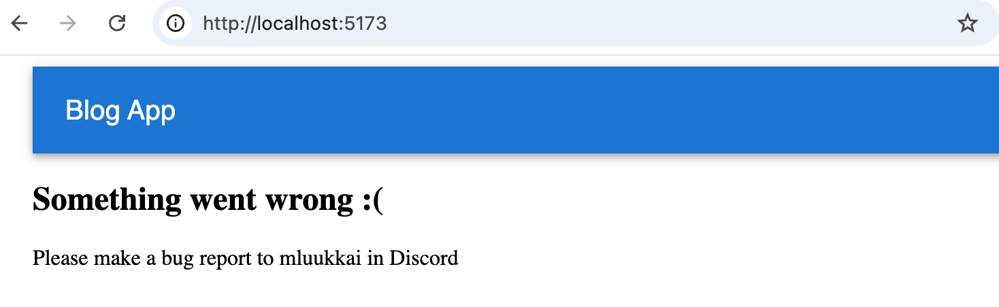
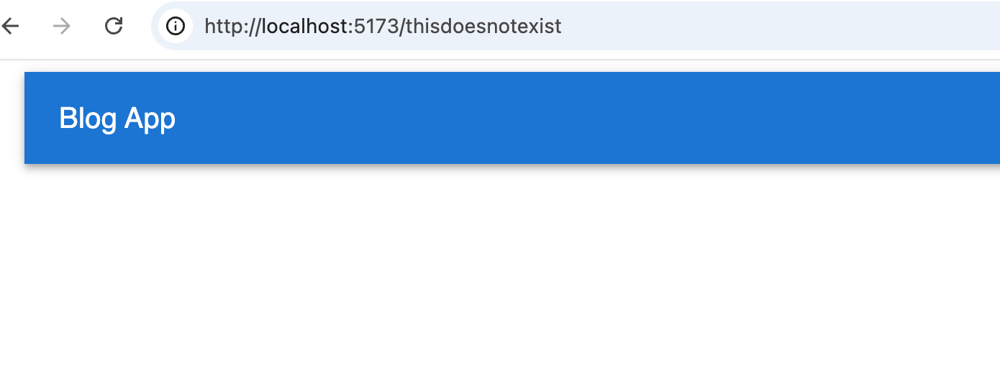
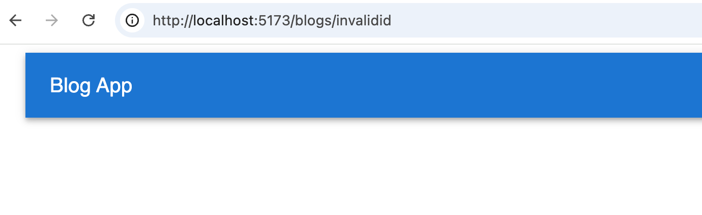
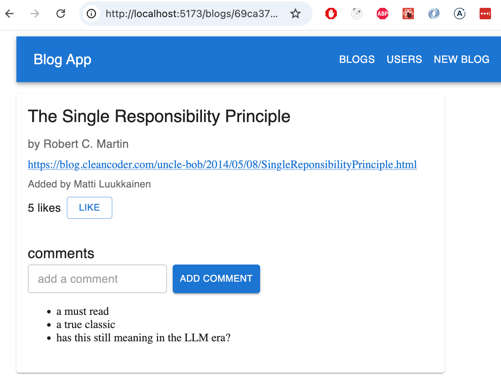

<div class="content">

بالإضافة إلى التمارين الستة في قسم [خطافات ريأكت](/ar/part7/more_about_react_hooks) من هذا الجزء من المنهج، تواصل 14 تمريناً عملنا على تطبيق قائمة المدونات (BlogList) الذي عملنا عليه في الجزأين الرابع والخامس من الدورة. بعض التمارين التالية عبارة عن "ميزات" مستقلة عن بعضها البعض، مما يعني أنه لا توجد حاجة لإنهائها بأي ترتيب معين. لك مطلق الحرية في تخطي جزء من التمارين إذا كنت ترغب في ذلك. يتعلق عدد كبير منها بتطبيق تقنيات إدارة الحالة المتقدمة (Zustand و React Query والسياق Context) التي تم تغطيتها في [الجزء السادس](/ar/part6).

إذا كنت لا ترغب في استخدام تطبيق BlogList الخاص بك، فيمكنك استخدام الشيفرة المصدرية من الحل النموذجي كنقطة انطلاق لهذه التمارين.

ستتطلب العديد من التمارين في هذا الجزء من المنهج [إعادة هيكلة (Refactoring)](https://en.wikipedia.org/wiki/Code_refactoring) للشيفرات البرمجية الحالية. هذا واقع شائع عند توسيع التطبيقات الحالية، مما يعني أن إعادة الهيكلة مهارة مهمة وضرورية حتى لو بدت صعبة وغير مريحة في بعض الأحيان.

إحدى النصائح الجيدة لكل من إعادة الهيكلة وكتابة شيفرات جديدة هي اتخاذ **خطوات صغيرة وتدريجية (Baby Steps)**. إن ترك التطبيق في حالة معطلة تماماً لفترات طويلة أثناء إعادة الهيكلة سيؤدي حتماً إلى الإحباط وفقدان التركيز.

**تفترض هذه التمارين أنك قد أكملت بالفعل التمارين [5.24-5.28](/ar/part5/react_router_ui_frameworks#exercises-5-24-5-28). إذا لم تكن قد قمت بذلك، فقم بإنهائها أولاً.**

</div>

<div class="tasks">

### التمارين 7.7.-7.20.

تفترض هذه التمارين أنك قد أكملت بالفعل التمارين [5.24-5.28](/ar/part5/react_router_ui_frameworks#exercises-5-24-5-28). إذا لم تكن قد قمت بذلك، فقم بإنهائها أولاً.

#### 7.7: الواجهة الأمامية والخلفية في نفس المستودع (Frontend and backend in the same repository)

خلال الدورة، عاشت الواجهة الأمامية والخلفية لتطبيق BlogList في مستودعين منفصلين. من الممارسات الشائعة في العالم الحقيقي وضع كليهما في مستودع واحد، مما يبسط عملية النشر ويسهل مشاركة الشيفرات بينهما.

اقرأ قسم [الواجهة الأمامية والخلفية في نفس المستودع](/ar/part7/miscellaneous#frontend-and-backend-in-the-same-repository) من مادة الدورة التدريبية وأعد هيكلة تطبيقك وفقاً لذلك. ضع الشيفرة المصدرية للواجهة الأمامية والخلفية في نفس المستودع مع الاحتفاظ بملفات <i>package.json</i> الخاصة بكل منهما منفصلة.

تأكد من أن سير عمل التطوير لا يزال يعمل: يجب أن يؤدي تشغيل <i>npm run dev</i> في مجلد الواجهة الأمامية إلى بدء تشغيل خادم تطوير Vite مع إعادة التحميل الساخن كما كان من قبل. تحقق أيضاً من أن بناء الإنتاج يعمل: يجب أن يكون الخادم الخلفي قادراً على خدمة الواجهة الأمامية المبنية كموقع ثابت باستخدام أمر مثل <i>npm run build && npm start</i> (أو نصوص برمجية مكافئة تحددها أنت).

<i>ملاحظة:</i> إذا واجهت أخطاء غريبة في التبعيات بعد إعادة تنظيم المستودع، فإن الحل الأكثر أماناً غالباً هو حذف جميع مجلدات <i>node_modules</i> وتشغيل <i>npm install</i> مرة أخرى من الصفر في كل من المجلدات المعنية.

#### 7.8: حدود الأخطاء (Error boundary)

تؤدي الأخطاء في تطبيق React التي لا يتم التقاطها في أي مكان إلى ظهور صفحة فارغة. هذه ليست تجربة مستخدم جيدة. الحل القياسي في React لهذه المشكلة هو مفهوم حد الخطأ (Error boundary)، وهو مكوّن يغلف جزءاً من شجرة المكوّنات ويلتقط أي أخطاء تصيير تحدث داخله، ويعرض واجهة مستخدم بديلة بدلاً من انهيار الصفحة بأكملها.

اقرأ قسم [حدود الأخطاء](/ar/part7/miscellaneous#error-boundary) من مادة الدورة. ثم أضف مكوّن حد خطأ إلى تطبيقك يلتقط أي أخطاء تصيير ويعرض رسالة خطأ سهلة الاستخدام بدلاً من صفحة فارغة.

يجب إضافة حد الخطأ إلى التطبيق بحيث يظل شريط التنقل (Navigation Bar) خارجه. في حالة حدوث خطأ في التصيير في أي مكان في بقية التطبيق، يلتقطه حد الخطأ ويعرض رسالة خطأ سهلة الاستخدام مثل هذه:



يمكنك محاكاة خطأ التصيير عن طريق رمي استثناء مؤقتاً داخل أحد المكوّنات الخاصة بك، على سبيل المثال:

```js
const BlogList = ({ blogs }) => {
  throw new Error('simulated error') // highlight line
  return (
    // ...
  )
}
```

#### 7.9: المسارات غير الموجودة (Nonexisting routes)

يحتوي التطبيق أيضاً على نوع آخر من الأخطاء. إذا حاول المستخدم الانتقال إلى مسار غير موجود مثل:



أو:



فالنتيجة هي صفحة فارغة. أصلح التوجيه بحيث يظهر الانتقال إلى مسار غير موجود رسالة مناسبة تفيد بأن "الصفحة غير موجودة" (Page not found) بدلاً من ذلك. يُعد مسار الرمز النجمي [splat route](https://reactrouter.com/start/framework/routing#splats) في React Router (عبر <i>path="*"</i>) هو الأداة المناسبة لذلك: فهو يطابق أي مسار لا يغطيه أي مسار آخر. يجب أن تبدو النتيجة كما يلي:


#### 7.10: التنسيق التلقائي للشيفرة (Automatic Code Formatting)

في الأجزاء السابقة، استخدمنا ESLint للتأكد من أن الشيفرة تتبع الأعراف المحددة. وتُعد أداة [Prettier](https://prettier.io/) نهجاً آخر لنفس الغرض. وفقاً للوثائق، فإن Prettier هي *أداة تنسيق شيفرات ذات رأي حاسم (Opinionated code formatter)*، أي أن Prettier لا تتحكم في أسلوب الشيفرة فحسب، بل تقوم أيضاً بتنسيقها وترتيبها تلقائياً وفقاً للقواعد المحددة.

من السهل دمج Prettier في محرر الأكواد بحيث يتم تنسيق الملف تلقائياً عند حفظه.

استخدم Prettier في تطبيقك وقم بتهيئتها للعمل مع المحرر الخاص بك.

### إدارة الحالة: Zustand

<i>هناك نسختان بديلتان للاختيار من بينهما للتمارين 7.11-7.14: يمكنك إدارة حالة التطبيق إما باستخدام Zustand أو باستخدام React Query و Context</i>. إذا كنت ترغب في تعظيم استفادتك التعليمية، فيجب عليك تنفيذ كلا الإصدارين!

ملاحظة: إذا أكملت الجزء السادس باستخدام Redux، فيمكنك بالطبع استخدام Redux بدلاً من Zustand في سلسلة التمارين هذه!

#### 7.11: Zustand، الخطوة 1

أعد هيكلة التطبيق لاستخدام Zustand لإدارة بيانات الإشعارات (Notifications).

#### 7.12: Zustand، الخطوة 2

<i>لاحظ</i> أن هذا التمرين والتمرينين التاليين شاقان للغاية ولكنهما مفيدان وتعليميان لأقصى درجة.

قم بتخزين المعلومات المتعلقة بتدوينات المدونة في مخزن Zustand. في هذا التمرين، يكفي أن تتمكن من رؤية المدونات في الواجهة الخلفية وإنشاء مدونة جديدة.

لك مطلق الحرية في إدارة حالة تسجيل الدخول وإنشاء تدوينات مدونة جديدة باستخدام الحالة الداخلية لمكونات React.

#### 7.13: Zustand، الخطوة 3

قم بتوسيع حلك بحيث يصبح من الممكن مرة أخرى الإعجاب بمدونة وحذفها.

#### 7.14: Zustand، الخطوة 4

قم بتخزين المعلومات المتعلقة بالمستخدم الذي قام بتسجيل الدخول في مخزن Zustand.

### إدارة الحالة: React Query والسياق (Context)

<i>هناك نسختان بديلتان للاختيار من بينهما للتمارين 7.11-7.14: يمكنك إدارة حالة التطبيق إما باستخدام Zustand أو باستخدام React Query و Context</i>. إذا كنت ترغب في تعظيم استفادتك التعليمية، فيجب عليك تنفيذ كلا الإصدارين!

#### 7.11: React Query والسياق، الخطوة 1

أعد هيكلة التطبيق لاستخدام خطاف useReducer والسياق (Context) لإدارة بيانات الإشعارات.

#### 7.12: React Query والسياق، الخطوة 2

استخدم React Query لإدارة الحالة الخاصة بتدوينات المدونة. بالنسبة لهذا التمرين، يكفي أن يعرض التطبيق المدونات الحالية وأن ينجح إنشاء مدونة جديدة.

لك مطلق الحرية في إدارة حالة تسجيل الدخول وإنشاء تدوينات مدونة جديدة باستخدام الحالة الداخلية لمكونات React.

#### 7.13: React Query والسياق، الخطوة 3

قم بتوسيع حلك بحيث يصبح من الممكن مرة أخرى الإعجاب بمدونة وحذفها.

#### 7.14: React Query والسياق، الخطوة 4

استخدم Context API لإدارة البيانات الخاصة بالمستخدم الذي قام بتسجيل الدخول.

#### 7.15: تنظيف الشيفرة البرمجية (Cleaning the code)

يحتوي تطبيقك على الأرجح على شيفرة تتعامل مع المستخدم الذي قام بتسجيل الدخول عبر <i>localStorage</i> في عدة أماكن:

```js
const userJSON = window.localStorage.getItem('loggedBlogappUser')

// ...

window.localStorage.setItem('loggedBlogappUser', JSON.stringify(user))

// ...

window.localStorage.removeItem('loggedBlogappUser')
```

استخرج هذا المنطق إلى وحدة خدمة مخصصة <i>src/services/persistentUser.js</i>، تصدّر الدوال التالية:

```js
const getUser = () => { ... }
const saveUser = (user) => { ... }
const removeUser = () => { ... }
```

استبدل جميع عمليات الوصول المباشر إلى <i>localStorage</i> في التطبيق باستدعاءات لهذه الدوال.

استخدم أيضاً خطاف [useField](/ar/part7/more_about_react_hooks) الذي تم تقديمه سابقاً في هذا الجزء داخل النماذج.

بقية المهام مشتركة بين إصداري Zustand و React Query.

#### 7.16: عرض المستخدمين (Users view)

قم بتنفيذ واجهة عرض في التطبيق تعرض جميع المعلومات الأساسية المتعلقة بالمستخدمين:


#### 7.17: عرض المستخدم الفردي (Individual User View)

قم بتنفيذ واجهة عرض للمستخدمين الفرديين تعرض جميع تدوينات المدونة التي أضافها ذلك المستخدم:


يمكنك الوصول إلى واجهة العرض هذه بالنقر على اسم المستخدم في واجهة العرض التي تسرد جميع المستخدمين:


#### 7.18: التعليقات، الخطوة 1 (Comments, step 1)

قم بتنفيذ وظيفة التعليق على تدوينات المدونة:


يجب أن تكون التعليقات مجهولة المصدر، مما يعني أنها غير مرتبطة بالمستخدم الذي ترك التعليق.

في هذا التمرين، يكفي للواجهة الأمامية فقط عرض التعليقات التي يتلقاها التطبيق من الخادم الخلفي.

ستكون الآلية المناسبة لإضافة تعليقات إلى تدوينة مدونة هي طلب HTTP POST إلى نقطة النهاية <i>api/blogs/:id/comments</i>.

#### 7.19: التعليقات، الخطوة 2 (Comments, step 2)

قم بتوسيع تطبيقك بحيث يمكن للمستخدمين إضافة تعليقات إلى تدوينات المدونة من الواجهة الأمامية:



#### 7.20: التنسيق والمظهر (Styling)

قم بتحسين المظهر المرئي للميزات الجديدة لتطبيقك باستخدام التقنيات التي تمت تغطيتها في [الجزء الخامس](/ar/part5/react_router_ui_frameworks).

كان هذا هو التمرين الأخير لهذا الجزء من الدورة وحان الوقت لدفع شيفرتك إلى GitHub وتسجيل جميع تمارينك المكتملة في [نظام تسليم التمارين](https://studies.cs.helsinki.fi/stats/courses/fullstackopen).

</div>
